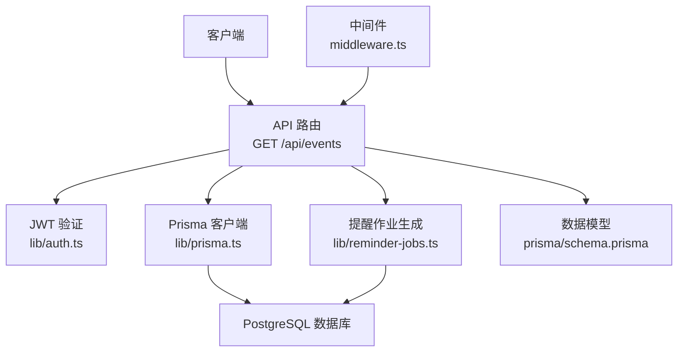
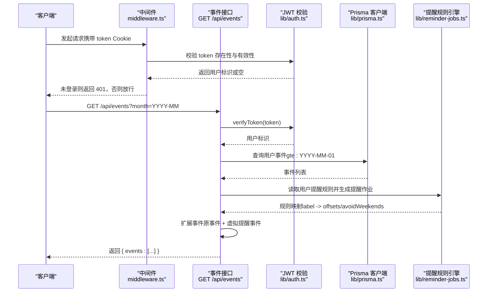
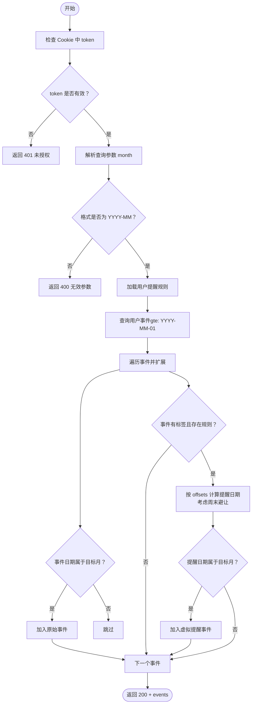
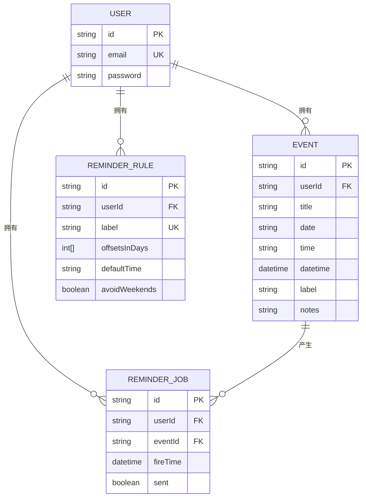
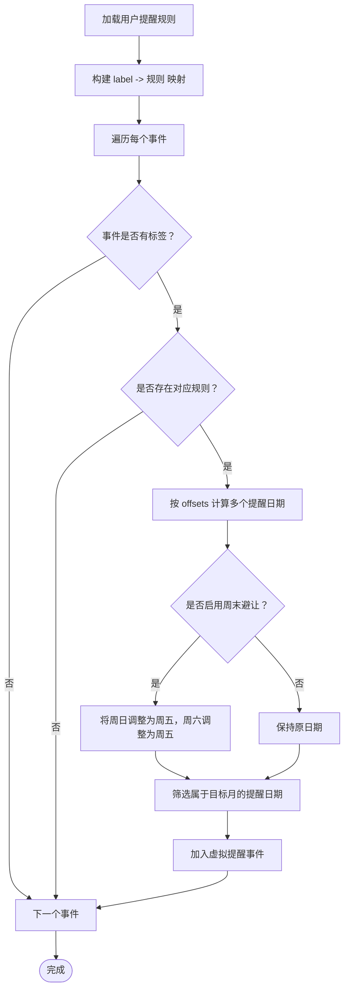
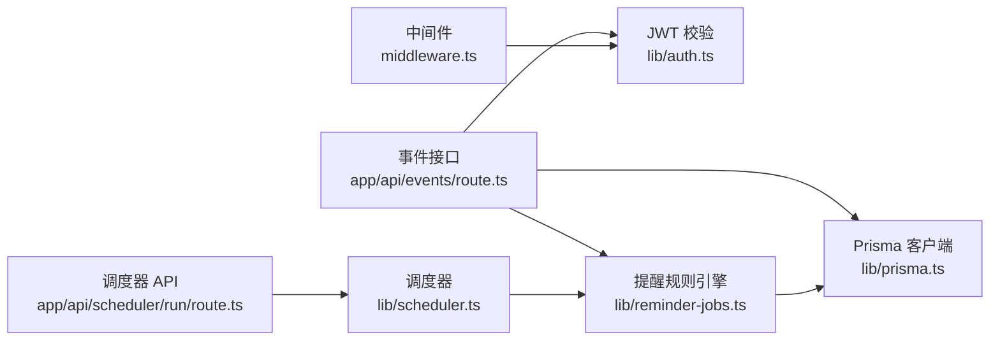

# 事件列表查询

<cite>
**本文引用的文件**
- [app/api/events/route.ts](file://app/api/events/route.ts)
- [lib/prisma.ts](file://lib/prisma.ts)
- [lib/auth.ts](file://lib/auth.ts)
- [lib/reminder-jobs.ts](file://lib/reminder-jobs.ts)
- [prisma/schema.prisma](file://prisma/schema.prisma)
- [middleware.ts](file://middleware.ts)
- [app/api/scheduler/run/route.ts](file://app/api/scheduler/run/route.ts)
- [lib/scheduler.ts](file://lib/scheduler.ts)
</cite>

## 目录
1. [简介](#简介)
2. [项目结构](#项目结构)
3. [核心组件](#核心组件)
4. [架构总览](#架构总览)
5. [详细组件分析](#详细组件分析)
6. [依赖关系分析](#依赖关系分析)
7. [性能考量](#性能考量)
8. [故障排查指南](#故障排查指南)
9. [结论](#结论)

## 简介
本文件为“事件列表查询”接口（GET /api/events）的完整API文档。该接口支持按月查询当前登录用户的事件，并在需要时动态扩展生成“提醒事件”。接口具备以下能力：
- 请求参数校验：仅接受 YYYY-MM 格式的月份参数
- 身份验证：通过 JWT Cookie 进行用户身份校验
- 数据查询：使用 Prisma 查询指定月份范围内的事件
- 提醒规则扩展：根据用户设置的提醒规则，动态生成虚拟提醒事件
- 响应结构：返回事件数组，其中原始事件与提醒事件通过字段区分

## 项目结构
该接口位于 Next.js 的 App Router 中，采用 API 路由形式组织。核心文件与职责如下：
- 接口实现：app/api/events/route.ts
- 数据访问：lib/prisma.ts（Prisma 客户端）
- 身份验证：lib/auth.ts（JWT 签发与校验）
- 提醒作业生成：lib/reminder-jobs.ts（生成/查询提醒任务）
- 数据模型：prisma/schema.prisma（Event、ReminderRule、ReminderJob 等）
- 中间件：middleware.ts（统一鉴权拦截）
- 调度器：lib/scheduler.ts 与 app/api/scheduler/run/route.ts（定时发送提醒）

图表来源
- [app/api/events/route.ts](file://app/api/events/route.ts#L15-L129)
- [lib/auth.ts](file://lib/auth.ts#L22-L29)
- [lib/prisma.ts](file://lib/prisma.ts#L13-L19)
- [lib/reminder-jobs.ts](file://lib/reminder-jobs.ts#L15-L72)
- [prisma/schema.prisma](file://prisma/schema.prisma#L28-L74)
- [middleware.ts](file://middleware.ts#L5-L45)

章节来源
- [app/api/events/route.ts](file://app/api/events/route.ts#L1-L200)
- [lib/prisma.ts](file://lib/prisma.ts#L1-L20)
- [lib/auth.ts](file://lib/auth.ts#L1-L30)
- [lib/reminder-jobs.ts](file://lib/reminder-jobs.ts#L1-L109)
- [prisma/schema.prisma](file://prisma/schema.prisma#L1-L86)
- [middleware.ts](file://middleware.ts#L1-L50)

## 核心组件
- 接口控制器：负责解析请求、校验参数、执行查询与扩展逻辑、返回响应
- 身份验证模块：提供 JWT 校验，确保请求来自已登录用户
- 数据访问层：封装 Prisma 客户端，提供数据库查询与写入能力
- 提醒规则引擎：读取用户提醒规则，计算提醒时间并生成提醒作业
- 中间件：统一拦截受保护路径，进行基础的未登录拦截与重定向

章节来源
- [app/api/events/route.ts](file://app/api/events/route.ts#L15-L129)
- [lib/auth.ts](file://lib/auth.ts#L22-L29)
- [lib/prisma.ts](file://lib/prisma.ts#L13-L19)
- [lib/reminder-jobs.ts](file://lib/reminder-jobs.ts#L15-L72)
- [middleware.ts](file://middleware.ts#L5-L45)

## 架构总览
下图展示了从客户端到数据库的整体调用链路，以及提醒规则扩展的关键步骤。

图表来源
- [middleware.ts](file://middleware.ts#L5-L45)
- [app/api/events/route.ts](file://app/api/events/route.ts#L15-L129)
- [lib/auth.ts](file://lib/auth.ts#L22-L29)
- [lib/prisma.ts](file://lib/prisma.ts#L13-L19)
- [lib/reminder-jobs.ts](file://lib/reminder-jobs.ts#L15-L72)

## 详细组件分析

### 接口定义与请求参数
- 方法：GET
- 路径：/api/events
- 查询参数：
  - month（必需）：字符串，格式为 YYYY-MM
- 认证方式：Cookie 中携带 token（JWT），服务端通过 verifyToken 校验
- 成功响应：200 OK，返回 JSON 对象 { events: [...] }
- 错误响应：
  - 400：无效的月份格式或输入参数
  - 401：未提供 token 或 token 无效
  - 500：服务器内部错误

章节来源
- [app/api/events/route.ts](file://app/api/events/route.ts#L15-L32)

### 请求流程与控制流
- 步骤一：从 Cookie 中提取 token 并校验
- 步骤二：解析查询参数 month，校验格式
- 步骤三：查询用户的所有提醒规则，构建 label -> 规则映射
- 步骤四：查询用户事件（从 YYYY-MM-01 开始），按日期升序排序
- 步骤五：遍历事件，生成扩展事件：
  - 若事件日期属于目标月份，则加入原始事件
  - 若事件存在标签且存在对应规则，则按 offsets 计算提醒日期，并考虑周末避让
  - 若提醒日期属于目标月份，则加入虚拟提醒事件
- 步骤六：返回结果

图表来源
- [app/api/events/route.ts](file://app/api/events/route.ts#L15-L129)

章节来源
- [app/api/events/route.ts](file://app/api/events/route.ts#L15-L129)

### 数据模型与查询逻辑
- 数据模型概览（关键字段）：
  - Event：id、userId、title、date、time、datetime、label、notes
  - ReminderRule：id、userId、label、offsetsInDays、defaultTime、avoidWeekends
  - ReminderJob：id、userId、eventId、fireTime、sent
- 查询策略：
  - 使用 Prisma 的 findMany 查询事件，where 条件包含 userId 与 date >= YYYY-MM-01
  - 按 date 升序排序，便于后续扩展与展示
  - 批量获取用户所有提醒规则，构建 label -> 规则映射，避免逐条查询

图表来源
- [prisma/schema.prisma](file://prisma/schema.prisma#L16-L74)

章节来源
- [prisma/schema.prisma](file://prisma/schema.prisma#L28-L74)
- [app/api/events/route.ts](file://app/api/events/route.ts#L34-L71)

### 响应数据结构
- 根对象：{ events: [...] }
- events 数组中的每个元素为一个事件对象，字段说明：
  - id：事件唯一标识（原始事件为真实 ID；提醒事件为 “{originalId}-reminder-{offset}”）
  - title：事件标题
  - date：事件日期（YYYY-MM-DD）
  - time：事件时间（可选）
  - label：事件标签（可选）
  - notes：备注（可选）
  - isReminder：布尔值，true 表示该事件为虚拟提醒事件
  - reminderDaysOffset：数字，表示距离事件日的天数偏移（提醒事件）
  - originalEventId：原始事件 ID（提醒事件）
  - displayDate：用于显示的日期（YYYY-MM-DD，可能与 date 不同，取决于周末避让调整）

示例响应结构（不包含具体事件内容）：
- { "events": [ { ... }, { ... }, ... ] }

章节来源
- [app/api/events/route.ts](file://app/api/events/route.ts#L74-L122)

### 提醒规则的动态扩展
- 规则来源：一次性加载用户所有提醒规则，构建 label -> 规则映射
- 规则字段：
  - offsetsInDays：数组，表示提前若干天提醒
  - avoidWeekends：布尔值，若为 true，则将落在周末的提醒调整到周五
- 扩展逻辑：
  - 对每个事件，若其标签存在于规则映射中，则按 offsets 计算多个提醒日期
  - 若开启周末避让，将周日调整到前两个工作日（周五），周六调整到前一个工作日（周五）
  - 仅当提醒日期属于目标月份时，才将其作为虚拟提醒事件加入结果

图表来源
- [app/api/events/route.ts](file://app/api/events/route.ts#L34-L122)
- [lib/reminder-jobs.ts](file://lib/reminder-jobs.ts#L15-L72)

章节来源
- [app/api/events/route.ts](file://app/api/events/route.ts#L34-L122)
- [lib/reminder-jobs.ts](file://lib/reminder-jobs.ts#L15-L72)

### 性能优化策略
- 日期范围查询：通过 gte: YYYY-MM-01 限制查询起点，避免扫描全表
- 批量获取规则：一次性查询用户所有提醒规则，构建内存映射，避免 N+1 查询
- 有序查询：按 date 升序排序，便于前端渲染与后续扩展
- 选择性扩展：仅在目标月份内生成虚拟提醒事件，减少结果集大小

章节来源
- [app/api/events/route.ts](file://app/api/events/route.ts#L53-L71)
- [app/api/events/route.ts](file://app/api/events/route.ts#L34-L48)

### 错误处理机制
- 400（无效参数）：
  - 未提供 month 参数或格式不符合 YYYY-MM
  - 输入参数校验失败（如创建事件时）
- 401（未授权）：
  - Cookie 中无 token
  - token 校验失败（verifyToken 返回空）
- 500（服务器错误）：
  - 任意未捕获异常导致的内部错误
- 中间件拦截：
  - 对受保护路径进行未登录拦截，直接返回 401

章节来源
- [app/api/events/route.ts](file://app/api/events/route.ts#L17-L32)
- [app/api/events/route.ts](file://app/api/events/route.ts#L125-L128)
- [middleware.ts](file://middleware.ts#L23-L28)

### 请求与响应示例
- 请求示例（带月份参数）：
  - GET /api/events?month=2025-06
- 响应示例（简化）：
  - {
      "events": [
        {
          "id": "event-id-1",
          "title": "会议",
          "date": "2025-06-15",
          "time": "14:00",
          "label": "Work",
          "notes": "",
          "isReminder": false,
          "reminderDaysOffset": null,
          "originalEventId": "event-id-1",
          "displayDate": "2025-06-15"
        },
        {
          "id": "event-id-1-reminder-1",
          "title": "会议",
          "date": "2025-06-14",
          "time": "14:00",
          "label": "Work",
          "notes": "",
          "isReminder": true,
          "reminderDaysOffset": 1,
          "originalEventId": "event-id-1",
          "displayDate": "2025-06-14"
        }
      ]
    }

章节来源
- [app/api/events/route.ts](file://app/api/events/route.ts#L74-L122)

## 依赖关系分析
- 组件耦合：
  - 事件接口依赖身份验证模块与 Prisma 客户端
  - 提醒规则扩展依赖提醒规则引擎与 Prisma 客户端
  - 中间件对受保护路径进行统一拦截
- 外部依赖：
  - Prisma 适配 PostgreSQL
  - JWT 使用 jose 库进行签发与校验
  - Web Push 通知（与提醒调度相关）

图表来源
- [app/api/events/route.ts](file://app/api/events/route.ts#L1-L6)
- [lib/auth.ts](file://lib/auth.ts#L22-L29)
- [lib/prisma.ts](file://lib/prisma.ts#L13-L19)
- [lib/reminder-jobs.ts](file://lib/reminder-jobs.ts#L1-L109)
- [middleware.ts](file://middleware.ts#L5-L45)
- [app/api/scheduler/run/route.ts](file://app/api/scheduler/run/route.ts#L1-L37)
- [lib/scheduler.ts](file://lib/scheduler.ts#L1-L86)

章节来源
- [app/api/events/route.ts](file://app/api/events/route.ts#L1-L6)
- [lib/auth.ts](file://lib/auth.ts#L22-L29)
- [lib/prisma.ts](file://lib/prisma.ts#L13-L19)
- [lib/reminder-jobs.ts](file://lib/reminder-jobs.ts#L1-L109)
- [middleware.ts](file://middleware.ts#L5-L45)
- [app/api/scheduler/run/route.ts](file://app/api/scheduler/run/route.ts#L1-L37)
- [lib/scheduler.ts](file://lib/scheduler.ts#L1-L86)

## 性能考量
- 查询范围控制：通过 gte: YYYY-MM-01 限定查询起点，减少扫描范围
- 内存映射：一次性加载用户提醒规则，构建 label -> 规则映射，避免多次数据库往返
- 有序输出：按日期升序返回，便于前端分页与渲染
- 扩展过滤：仅在目标月份内生成虚拟提醒事件，避免返回无关数据
- 后续建议（可选）：
  - 在 Event 上增加复合索引（userId, date）以进一步提升查询性能
  - 对 ReminderRule 增加（userId, label）唯一约束（已在 schema 中定义）

章节来源
- [app/api/events/route.ts](file://app/api/events/route.ts#L53-L71)
- [app/api/events/route.ts](file://app/api/events/route.ts#L34-L48)
- [prisma/schema.prisma](file://prisma/schema.prisma#L44-L59)

## 故障排查指南
- 400 错误（无效月份）：
  - 检查 month 参数是否为 YYYY-MM 格式
  - 确认未传递空值或非标准格式
- 401 错误（未授权）：
  - 确认浏览器已正确携带 token Cookie
  - 检查 JWT 密钥配置与签名算法
  - 中间件是否正确拦截并返回 401
- 500 错误（服务器错误）：
  - 查看服务端日志中的堆栈信息
  - 检查 Prisma 连接与数据库可用性
  - 确认提醒规则引擎与调度器运行正常
- 提醒未出现：
  - 确认事件标签与提醒规则标签一致
  - 检查 offsetsInDays 是否包含目标天数
  - 确认 avoidWeekends 设置与预期相符

章节来源
- [app/api/events/route.ts](file://app/api/events/route.ts#L17-L32)
- [app/api/events/route.ts](file://app/api/events/route.ts#L125-L128)
- [middleware.ts](file://middleware.ts#L23-L28)
- [lib/reminder-jobs.ts](file://lib/reminder-jobs.ts#L15-L72)

## 结论
GET /api/events 接口通过严格的参数校验、JWT 身份验证与高效的数据库查询，实现了按月事件列表的获取，并在需要时动态扩展生成提醒事件。其设计兼顾了易用性与性能，适合在生产环境中稳定运行。建议配合调度器与 Web Push 通知体系，形成完整的事件提醒闭环。