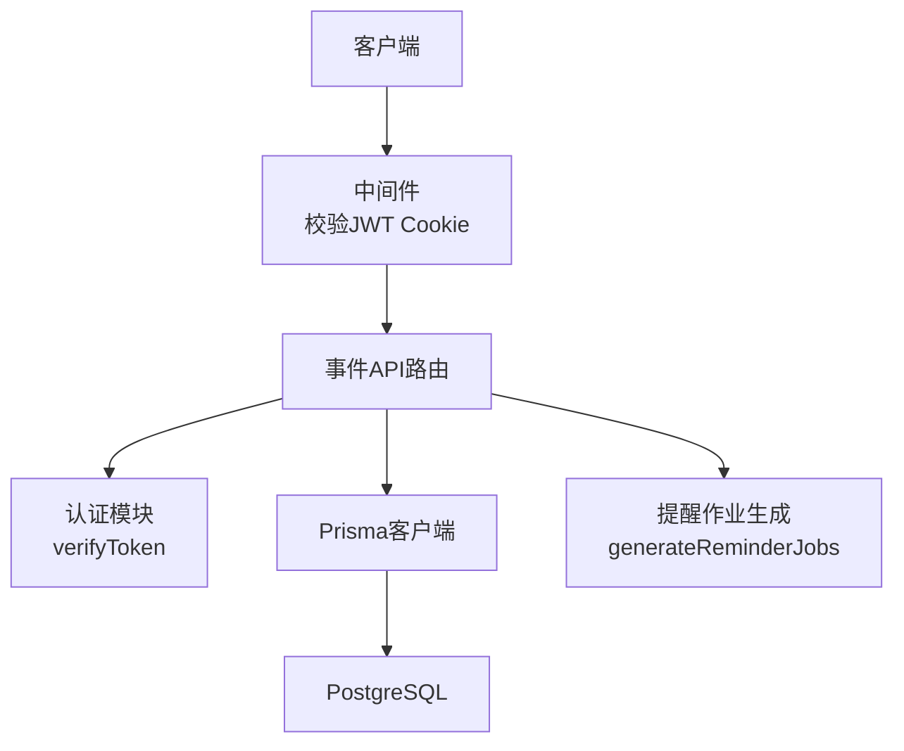
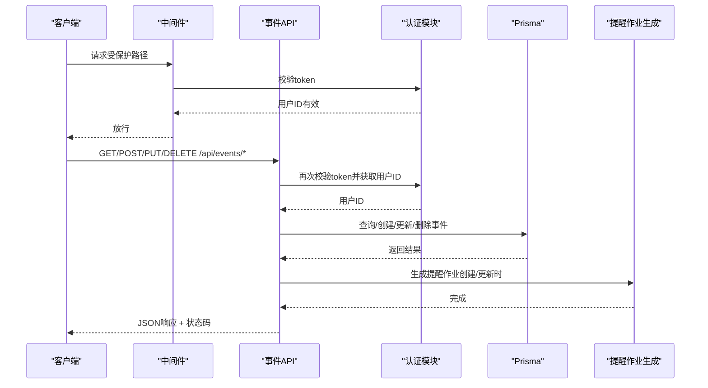
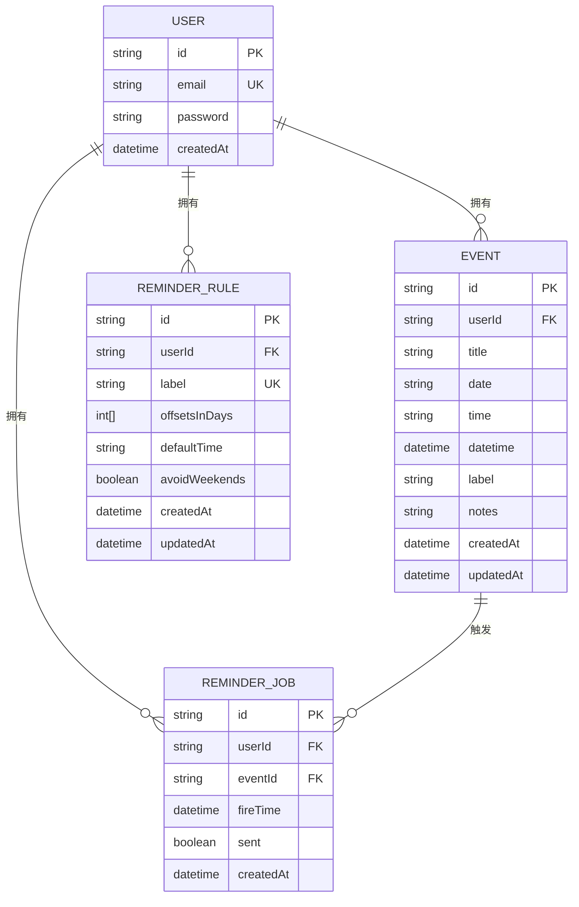
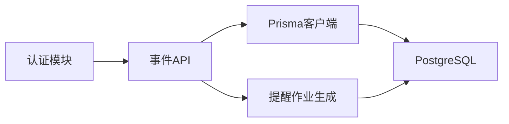

# 事件管理API

<cite>
**本文引用的文件**
- [app/api/events/route.ts](file://app/api/events/route.ts)
- [app/api/events/bulk-create/route.ts](file://app/api/events/bulk-create/route.ts)
- [app/api/events/[id]/route.ts](file://app/api/events/[id]/route.ts)
- [lib/prisma.ts](file://lib/prisma.ts)
- [lib/auth.ts](file://lib/auth.ts)
- [lib/reminder-jobs.ts](file://lib/reminder-jobs.ts)
- [prisma/schema.prisma](file://prisma/schema.prisma)
- [public/templates/events-template.csv](file://public/templates/events-template.csv)
- [middleware.ts](file://middleware.ts)
- [README.md](file://README.md)
</cite>

## 目录
1. [简介](#简介)
2. [项目结构](#项目结构)
3. [核心组件](#核心组件)
4. [架构总览](#架构总览)
5. [详细组件分析](#详细组件分析)
6. [依赖关系分析](#依赖关系分析)
7. [性能考虑](#性能考虑)
8. [故障排查指南](#故障排查指南)
9. [结论](#结论)
10. [附录](#附录)

## 简介
本文件为事件管理API的完整参考文档，涵盖以下接口：
- GET /api/events：按月查询事件列表（含提醒扩展），支持查询参数 month（YYYY-MM）
- POST /api/events：创建或更新单个事件
- POST /api/events/bulk-create：批量导入CSV格式事件（基于JSON结构）
- PUT /api/events/[id]：更新指定事件
- DELETE /api/events/[id]：删除指定事件

文档包含请求/响应示例、状态码说明、认证要求（JWT Cookie）、错误处理策略、性能优化建议，并提供curl命令示例。

## 项目结构
事件管理API位于Next.js App Router的API目录中，采用文件路由方式组织：
- GET /api/events → app/api/events/route.ts
- POST /api/events → app/api/events/route.ts
- POST /api/events/bulk-create → app/api/events/bulk-create/route.ts
- PUT /api/events/[id] → app/api/events/[id]/route.ts
- DELETE /api/events/[id] → app/api/events/[id]/route.ts

认证与中间件：
- 中间件对受保护路径进行JWT校验，要求携带token Cookie
- API层再次校验token并提取用户ID

数据库与模型：
- 使用Prisma客户端连接PostgreSQL
- 事件模型包含标题、日期、时间、标签、备注等字段

图表来源
- [middleware.ts](file://middleware.ts#L1-L50)
- [app/api/events/route.ts](file://app/api/events/route.ts#L1-L200)
- [lib/auth.ts](file://lib/auth.ts#L1-L30)
- [lib/prisma.ts](file://lib/prisma.ts#L1-L20)
- [lib/reminder-jobs.ts](file://lib/reminder-jobs.ts#L1-L109)

章节来源
- [middleware.ts](file://middleware.ts#L1-L50)
- [app/api/events/route.ts](file://app/api/events/route.ts#L1-L200)
- [lib/prisma.ts](file://lib/prisma.ts#L1-L20)
- [prisma/schema.prisma](file://prisma/schema.prisma#L1-L86)

## 核心组件
- 认证与授权
  - 中间件检查Cookie中的token，未提供或无效则返回401
  - API层再次调用verifyToken，确保userId存在后执行业务逻辑
- 数据库访问
  - 通过Prisma客户端访问PostgreSQL，使用索引优化查询
- 提醒作业生成
  - 事件创建/更新后，根据标签规则生成提醒作业（可避开周末）

章节来源
- [middleware.ts](file://middleware.ts#L1-L50)
- [lib/auth.ts](file://lib/auth.ts#L1-L30)
- [lib/prisma.ts](file://lib/prisma.ts#L1-L20)
- [lib/reminder-jobs.ts](file://lib/reminder-jobs.ts#L1-L109)

## 架构总览
事件API的典型请求-响应流程如下：

图表来源
- [middleware.ts](file://middleware.ts#L1-L50)
- [app/api/events/route.ts](file://app/api/events/route.ts#L1-L200)
- [app/api/events/bulk-create/route.ts](file://app/api/events/bulk-create/route.ts#L1-L133)
- [app/api/events/[id]/route.ts](file://app/api/events/[id]/route.ts#L1-L119)
- [lib/auth.ts](file://lib/auth.ts#L1-L30)
- [lib/reminder-jobs.ts](file://lib/reminder-jobs.ts#L1-L109)

## 详细组件分析

### GET /api/events（按月查询）
- 功能描述
  - 查询当前用户在指定月份的所有事件，并扩展生成提醒实例（仅当提醒日期落在该月时才包含）
  - 支持按标签配置的提醒规则（可避开周末）
- 查询参数
  - month: YYYY-MM（必填且格式校验）
- 响应数据结构
  - events: Event[]（见下方“数据模型”）
  - 每个事件包含 isReminder、reminderDaysOffset、originalEventId、displayDate 等扩展字段
- 状态码
  - 200 成功
  - 400 参数无效
  - 401 未认证
  - 500 服务器错误
- curl 示例
  - curl -b "token=YOUR_JWT_TOKEN" "http://localhost:3000/api/events?month=2025-12"

请求/响应示例
- 请求
  - GET /api/events?month=2025-12
- 响应
  - 200 OK
  - Body:
    - {
        "events": [
          {
            "id": "event-id",
            "title": "会议",
            "date": "2025-12-10",
            "time": "14:00",
            "label": "Work",
            "notes": "团队讨论",
            "isReminder": false,
            "reminderDaysOffset": null,
            "originalEventId": "event-id",
            "displayDate": "2025-12-10"
          },
          {
            "id": "event-id-reminder-1",
            "title": "会议",
            "date": "2025-12-09",
            "time": "14:00",
            "label": "Work",
            "notes": "团队讨论",
            "isReminder": true,
            "reminderDaysOffset": 1,
            "originalEventId": "event-id",
            "displayDate": "2025-12-09"
          }
        ]
      }

章节来源
- [app/api/events/route.ts](file://app/api/events/route.ts#L15-L129)
- [lib/reminder-jobs.ts](file://lib/reminder-jobs.ts#L1-L109)

### POST /api/events（创建或更新单个事件）
- 功能描述
  - 接收事件JSON，校验字段后创建或更新事件
  - 若同名事件已存在，则更新；否则创建新事件
  - 生成提醒作业
- 请求体字段
  - title: 非空字符串
  - date: YYYY-MM-DD
  - time: HH:mm（可选，为空时默认10:00）
  - label: 标签（可选）
  - notes: 备注（可选）
- 响应
  - 201 Created 或 200 OK（取决于是否替换）
  - Body: { event, replaced: boolean }
- 状态码
  - 201/200 成功
  - 400 输入校验失败
  - 401 未认证
  - 500 服务器错误
- curl 示例
  - curl -b "token=YOUR_JWT_TOKEN" -X POST -H "Content-Type: application/json" -d '{"title":"会议","date":"2025-12-10","time":"14:00","label":"Work","notes":"团队讨论"}' "http://localhost:3000/api/events"

请求/响应示例
- 请求
  - POST /api/events
  - Body: { title, date, time?, label?, notes? }
- 响应
  - 201 Created
  - Body: { event: { id, title, date, time, label, notes }, replaced: false }

章节来源
- [app/api/events/route.ts](file://app/api/events/route.ts#L131-L199)
- [lib/reminder-jobs.ts](file://lib/reminder-jobs.ts#L1-L109)

### POST /api/events/bulk-create（批量导入）
- 功能描述
  - 接收事件数组，逐条校验并创建/更新
  - 对同一标题的重复项，后续条目会覆盖前者
  - 生成提醒作业
- 请求体字段
  - events: Event[]（每个元素包含 title、date、time、label、notes）
- 响应
  - 201 Created
  - Body: { success: true, created: N, updated: M, failed: K, errors: [...] }
  - errors: 包含 index、title、error 的数组
- 状态码
  - 201 成功
  - 400 输入校验失败
  - 401 未认证
  - 500 服务器错误
- curl 示例
  - curl -b "token=YOUR_JWT_TOKEN" -X POST -H "Content-Type: application/json" -d '{"events":[{"title":"会议","date":"2025-12-10","time":"14:00","label":"Work","notes":"团队讨论"}]}' "http://localhost/3000/api/events/bulk-create"

请求/响应示例
- 请求
  - POST /api/events/bulk-create
  - Body: { events: [{ title, date, time?, label?, notes? }] }
- 响应
  - 201 Created
  - Body: { success: true, created: 1, updated: 0, failed: 0, errors: [] }

CSV模板参考
- CSV列头顺序：title,date,time,label,notes
- 示例行：Contract renewal,2025-12-11,14:30,Contract,Call supplier to renew

章节来源
- [app/api/events/bulk-create/route.ts](file://app/api/events/bulk-create/route.ts#L19-L132)
- [public/templates/events-template.csv](file://public/templates/events-template.csv#L1-L5)

### PUT /api/events/[id]（更新事件）
- 功能描述
  - 更新指定事件，仅允许当前用户拥有该事件
  - 更新后重新生成提醒作业
- 路径参数
  - id: 事件ID（必填）
- 请求体字段
  - title?: 非空字符串（可选）
  - date?: YYYY-MM-DD（可选）
  - time?: HH:mm 或空字符串（可选）
  - label?: 标签（可选）
  - notes?: 备注（可选）
- 响应
  - 200 OK
  - Body: { event }
- 状态码
  - 200 成功
  - 400 缺少ID或输入校验失败
  - 401 未认证
  - 403 无权限
  - 404 事件不存在
  - 500 服务器错误
- curl 示例
  - curl -b "token=YOUR_JWT_TOKEN" -X PUT -H "Content-Type: application/json" -d '{"time":"15:00"}' "http://localhost:3000/api/events/event-id"

章节来源
- [app/api/events/[id]/route.ts](file://app/api/events/[id]/route.ts#L15-L74)
- [lib/reminder-jobs.ts](file://lib/reminder-jobs.ts#L1-L109)

### DELETE /api/events/[id]（删除事件）
- 功能描述
  - 删除指定事件，仅允许当前用户拥有该事件
- 路径参数
  - id: 事件ID（必填）
- 响应
  - 200 OK
  - Body: { success: true }
- 状态码
  - 200 成功
  - 400 缺少ID
  - 401 未认证
  - 403 无权限
  - 404 事件不存在
  - 500 服务器错误
- curl 示例
  - curl -b "token=YOUR_JWT_TOKEN" -X DELETE "http://localhost:3000/api/events/event-id"

章节来源
- [app/api/events/[id]/route.ts](file://app/api/events/[id]/route.ts#L76-L118)

### 数据模型
事件对象（Event）字段说明
- id: 字符串（主键）
- userId: 字符串（外键）
- title: 字符串（非空）
- date: 字符串（YYYY-MM-DD）
- time: 字符串（HH:mm，可选）
- datetime: 日期时间（用于排序/查询）
- label: 字符串（可选）
- notes: 字符串（可选）
- createdAt/updatedAt: 时间戳

提醒规则（ReminderRule）字段说明
- id: 字符串（主键）
- userId: 字符串（外键）
- label: 字符串（唯一约束：userId + label）
- offsetsInDays: 整数数组（如 [7,3,1]）
- defaultTime: 字符串（如 "10:00"）
- avoidWeekends: 布尔值（是否避开周末）

提醒作业（ReminderJob）字段说明
- id: 字符串（主键）
- userId: 字符串（外键）
- eventId: 字符串（外键，级联删除）
- fireTime: 日期时间（触发时间）
- sent: 布尔值（是否已发送）

图表来源
- [prisma/schema.prisma](file://prisma/schema.prisma#L1-L86)

章节来源
- [prisma/schema.prisma](file://prisma/schema.prisma#L1-L86)

## 依赖关系分析
- 认证链路
  - 中间件负责拦截并校验JWT Cookie
  - API层再次校验token并获取用户ID，确保操作权限
- 数据访问
  - 所有事件操作均通过Prisma客户端访问数据库
  - 事件模型包含复合索引以优化查询
- 提醒生成
  - 事件创建/更新后调用提醒作业生成函数
  - 读取用户标签对应的提醒规则，计算触发时间并避开周末

图表来源
- [lib/auth.ts](file://lib/auth.ts#L1-L30)
- [middleware.ts](file://middleware.ts#L1-L50)
- [app/api/events/route.ts](file://app/api/events/route.ts#L1-L200)
- [lib/reminder-jobs.ts](file://lib/reminder-jobs.ts#L1-L109)
- [lib/prisma.ts](file://lib/prisma.ts#L1-L20)

章节来源
- [lib/auth.ts](file://lib/auth.ts#L1-L30)
- [middleware.ts](file://middleware.ts#L1-L50)
- [app/api/events/route.ts](file://app/api/events/route.ts#L1-L200)
- [lib/reminder-jobs.ts](file://lib/reminder-jobs.ts#L1-L109)
- [lib/prisma.ts](file://lib/prisma.ts#L1-L20)

## 性能考虑
- 批量导入优化
  - 预取现有事件（按标题去重），避免重复查询
  - 逐条处理并生成提醒作业，便于错误定位与统计
  - 建议：对于超大批次，可在数据库层面引入事务包裹，减少锁竞争与回滚成本
- 查询优化
  - 事件模型对 userId 和 date 建有索引，按月查询具备良好性能
  - 扩展提醒实例时仅包含目标月份的数据，避免返回过多记录
- 提醒生成
  - 事件更新后仅删除旧作业并重建，避免冗余作业堆积
  - 可在调度任务中批量扫描待发送作业，提升吞吐

章节来源
- [app/api/events/bulk-create/route.ts](file://app/api/events/bulk-create/route.ts#L41-L49)
- [prisma/schema.prisma](file://prisma/schema.prisma#L44-L45)
- [lib/reminder-jobs.ts](file://lib/reminder-jobs.ts#L16-L19)

## 故障排查指南
- 401 未认证
  - 确认请求携带有效的token Cookie
  - 检查JWT密钥配置与签名算法
- 403 禁止访问
  - 确认事件属于当前用户
- 404 事件不存在
  - 检查事件ID是否正确
- 400 输入校验失败
  - 确认字段类型与格式（如日期时间正则）
  - 批量导入时关注 errors 数组中的具体错误位置
- 500 服务器错误
  - 查看服务端日志，定位异常堆栈

章节来源
- [app/api/events/route.ts](file://app/api/events/route.ts#L18-L25)
- [app/api/events/[id]/route.ts](file://app/api/events/[id]/route.ts#L40-L46)
- [app/api/events/bulk-create/route.ts](file://app/api/events/bulk-create/route.ts#L34-L36)

## 结论
事件管理API提供了完整的事件生命周期管理能力，支持单条创建/更新、批量导入、按月查询与提醒扩展。通过JWT认证与中间件保护，确保了安全性；借助Prisma索引与提醒规则，兼顾了性能与可用性。建议在生产环境中结合事务处理与批量调度，进一步提升批量导入的稳定性与吞吐。

## 附录

### 认证要求
- 方式：HTTP-only Cookie，键名为 token
- 中间件与API层双重校验，确保用户身份与权限
- JWT密钥由环境变量提供

章节来源
- [middleware.ts](file://middleware.ts#L1-L50)
- [lib/auth.ts](file://lib/auth.ts#L1-L30)

### curl 命令示例
- 获取事件（按月）
  - curl -b "token=YOUR_JWT_TOKEN" "http://localhost:3000/api/events?month=2025-12"
- 创建事件
  - curl -b "token=YOUR_JWT_TOKEN" -X POST -H "Content-Type: application/json" -d '{"title":"会议","date":"2025-12-10","time":"14:00","label":"Work","notes":"团队讨论"}' "http://localhost:3000/api/events"
- 批量导入
  - curl -b "token=YOUR_JWT_TOKEN" -X POST -H "Content-Type: application/json" -d '{"events":[{"title":"会议","date":"2025-12-10","time":"14:00","label":"Work","notes":"团队讨论"}]}' "http://localhost:3000/api/events/bulk-create"
- 更新事件
  - curl -b "token=YOUR_JWT_TOKEN" -X PUT -H "Content-Type: application/json" -d '{"time":"15:00"}' "http://localhost:3000/api/events/event-id"
- 删除事件
  - curl -b "token=YOUR_JWT_TOKEN" -X DELETE "http://localhost:3000/api/events/event-id"

章节来源
- [README.md](file://README.md#L110-L135)