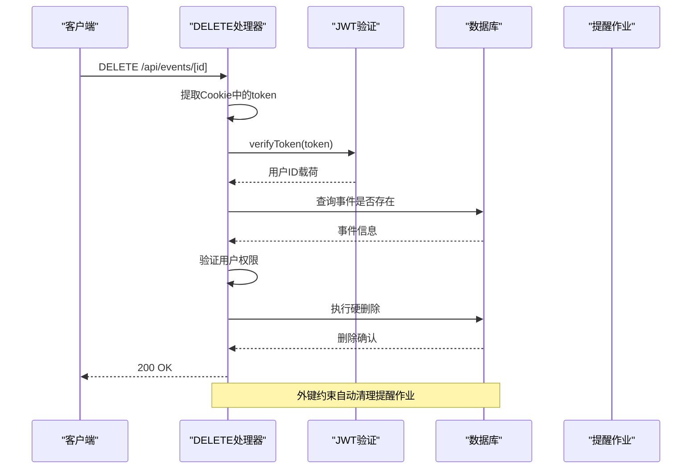

# 单条事件删除 (DELETE)

<cite>
**本文档引用的文件**
- [app/api/events/[id]/route.ts](file://app/api/events/[id]/route.ts)
- [lib/auth.ts](file://lib/auth.ts)
- [lib/prisma.ts](file://lib/prisma.ts)
- [middleware.ts](file://middleware.ts)
- [lib/reminder-jobs.ts](file://lib/reminder-jobs.ts)
- [prisma/schema.prisma](file://prisma/schema.prisma)
- [__tests__/api/event-crud.test.ts](file://__tests__/api/event-crud.test.ts)
</cite>

## 目录
1. [简介](#简介)
2. [项目结构](#项目结构)
3. [核心组件](#核心组件)
4. [架构概览](#架构概览)
5. [详细组件分析](#详细组件分析)
6. [依赖关系分析](#依赖关系分析)
7. [性能考虑](#性能考虑)
8. [故障排除指南](#故障排除指南)
9. [结论](#结论)

## 简介

本文档详细说明了单条事件删除接口（DELETE /api/events/[id]）的实现细节和使用方法。该接口采用硬删除策略，直接从数据库中永久移除事件记录，同时确保严格的安全验证以防止跨用户访问。

## 项目结构

事件删除功能位于Next.js App Router的API路由中，采用模块化设计：

**图表来源**
- [app/api/events/[id]/route.ts](file://app/api/events/[id]/route.ts#L76-L118)
- [lib/auth.ts](file://lib/auth.ts#L22-L29)
- [lib/prisma.ts](file://lib/prisma.ts#L13-L19)
- [prisma/schema.prisma](file://prisma/schema.prisma#L28-L45)

**章节来源**
- [app/api/events/[id]/route.ts](file://app/api/events/[id]/route.ts#L1-L119)
- [lib/auth.ts](file://lib/auth.ts#L1-L30)
- [lib/prisma.ts](file://lib/prisma.ts#L1-L20)

## 核心组件

### DELETE处理器实现

事件删除接口的核心实现位于`app/api/events/[id]/route.ts`文件中，包含以下关键功能：

- **JWT令牌验证**：通过`verifyToken`函数验证用户身份
- **事件存在性检查**：使用`prisma.event.findUnique`查询事件
- **权限验证**：确保事件属于当前认证用户
- **硬删除执行**：使用`prisma.event.delete`永久删除事件
- **响应处理**：返回标准化的JSON响应

### 安全验证流程

系统采用多层安全验证确保操作安全性：

**图表来源**
- [app/api/events/[id]/route.ts](file://app/api/events/[id]/route.ts#L76-L118)
- [lib/auth.ts](file://lib/auth.ts#L22-L29)
- [prisma/schema.prisma](file://prisma/schema.prisma#L67)

**章节来源**
- [app/api/events/[id]/route.ts](file://app/api/events/[id]/route.ts#L76-L118)
- [lib/auth.ts](file://lib/auth.ts#L22-L29)

## 架构概览

事件删除接口遵循RESTful设计原则，采用硬删除策略：

**图表来源**
- [app/api/events/[id]/route.ts](file://app/api/events/[id]/route.ts#L76-L118)
- [lib/prisma.ts](file://lib/prisma.ts#L13-L19)

## 详细组件分析

### DELETE处理器类图

**图表来源**
- [app/api/events/[id]/route.ts](file://app/api/events/[id]/route.ts#L76-L118)
- [lib/auth.ts](file://lib/auth.ts#L22-L29)
- [lib/prisma.ts](file://lib/prisma.ts#L13-L19)
- [lib/reminder-jobs.ts](file://lib/reminder-jobs.ts#L15-L72)

### 删除流程详细分析

#### 步骤1：JWT令牌验证
处理器首先从Cookie中提取JWT令牌并进行验证：

**图表来源**
- [app/api/events/[id]/route.ts](file://app/api/events/[id]/route.ts#L80-L89)

#### 步骤2：事件存在性检查
使用Prisma ORM查询事件是否存在：

**图表来源**
- [app/api/events/[id]/route.ts](file://app/api/events/[id]/route.ts#L91-L107)

#### 步骤3：硬删除执行
执行硬删除并利用数据库外键约束自动清理相关数据：

**图表来源**
- [prisma/schema.prisma](file://prisma/schema.prisma#L67)

**章节来源**
- [app/api/events/[id]/route.ts](file://app/api/events/[id]/route.ts#L76-L118)
- [prisma/schema.prisma](file://prisma/schema.prisma#L67)

### 数据模型关系

事件删除涉及的核心数据模型关系：

**图表来源**
- [prisma/schema.prisma](file://prisma/schema.prisma#L16-L74)

**章节来源**
- [prisma/schema.prisma](file://prisma/schema.prisma#L16-L74)

## 依赖关系分析

### 组件依赖图

**图表来源**
- [app/api/events/[id]/route.ts](file://app/api/events/[id]/route.ts#L1-L5)
- [lib/auth.ts](file://lib/auth.ts#L1-L3)
- [lib/prisma.ts](file://lib/prisma.ts#L1-L3)

### 错误处理流程

**图表来源**
- [app/api/events/[id]/route.ts](file://app/api/events/[id]/route.ts#L76-L118)

**章节来源**
- [app/api/events/[id]/route.ts](file://app/api/events/[id]/route.ts#L76-L118)

## 性能考虑

### 查询优化

1. **索引使用**：事件表在`(userId, date)`上建立了复合索引，支持高效的用户事件查询
2. **最小化查询**：删除操作仅执行一次数据库查询，避免不必要的往返
3. **事务处理**：Prisma自动管理事务，确保数据一致性

### 内存和CPU优化

1. **流式处理**：删除操作不需要加载完整事件数据到内存
2. **异步处理**：所有数据库操作都是异步的，不会阻塞其他请求
3. **连接池**：使用PostgreSQL连接池复用数据库连接

## 故障排除指南

### 常见问题及解决方案

#### 401 Unauthorized (未授权)
- **原因**：缺少有效的JWT令牌或令牌无效
- **解决方案**：重新登录获取有效令牌，确保Cookie正确设置

#### 403 Forbidden (禁止访问)
- **原因**：尝试删除不属于当前用户的事件
- **解决方案**：确认事件的所有权，检查用户ID匹配

#### 404 Not Found (未找到)
- **原因**：指定ID的事件不存在
- **解决方案**：验证事件ID的正确性，确认事件确实存在

#### 500 Internal Server Error (服务器内部错误)
- **原因**：数据库连接问题或意外异常
- **解决方案**：检查数据库连接状态，查看服务器日志

### 调试建议

1. **启用详细日志**：在开发环境中查看详细的错误日志
2. **单元测试**：运行现有的测试套件验证功能正确性
3. **数据库监控**：检查数据库查询性能和连接状态

**章节来源**
- [__tests__/api/event-crud.test.ts](file://__tests__/api/event-crud.test.ts#L127-L165)

## 结论

单条事件删除接口实现了安全、高效的数据删除功能。通过严格的JWT验证、事件存在性检查和权限验证，确保了系统的安全性。采用硬删除策略配合数据库外键约束，实现了数据的一致性和完整性。该实现遵循RESTful设计原则，提供了清晰的错误处理和响应格式，为前端应用提供了可靠的API接口。