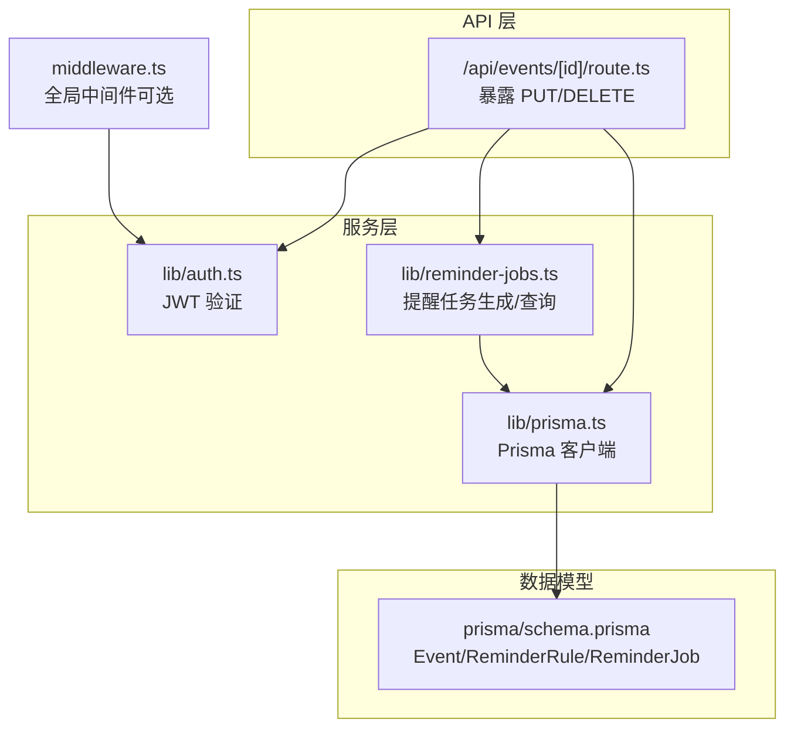
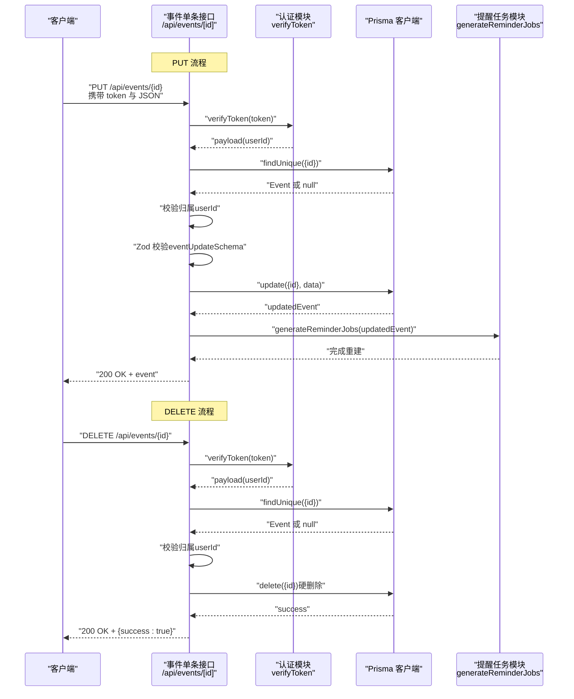
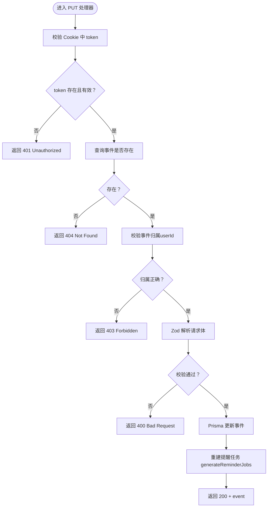
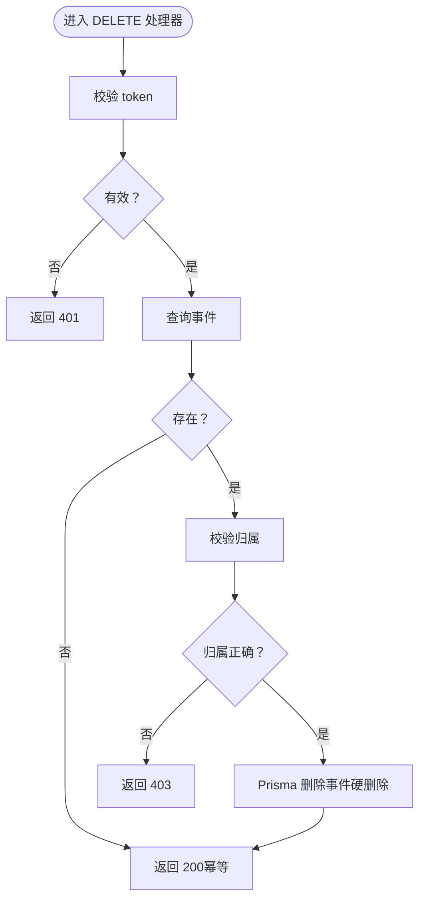
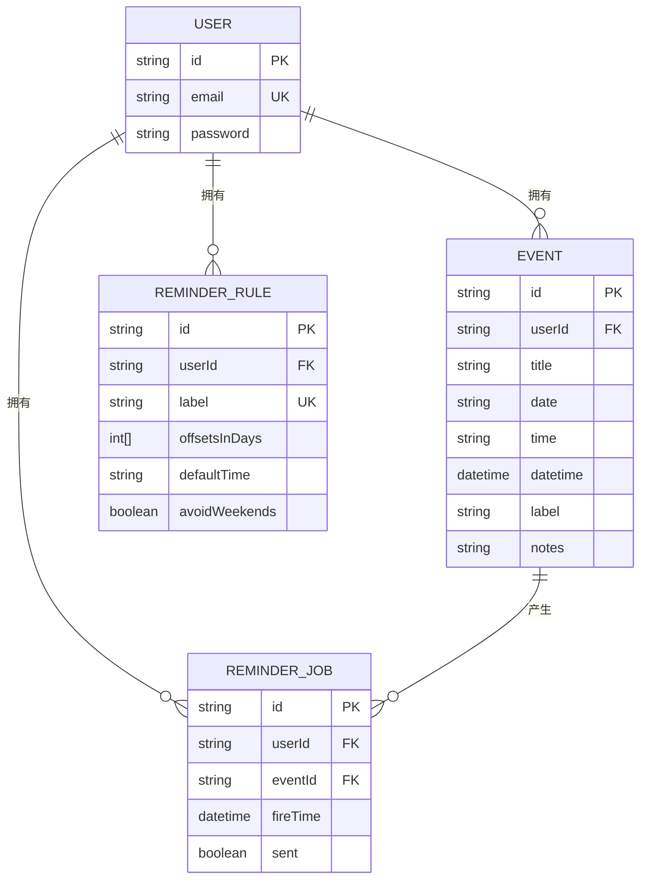
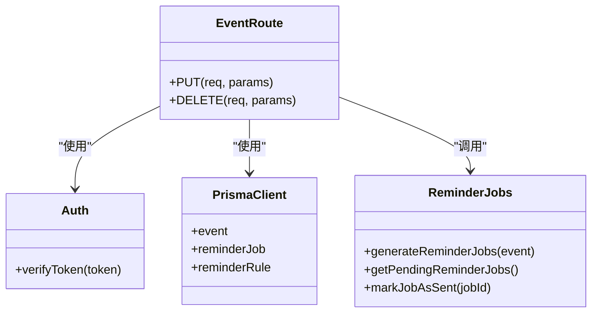
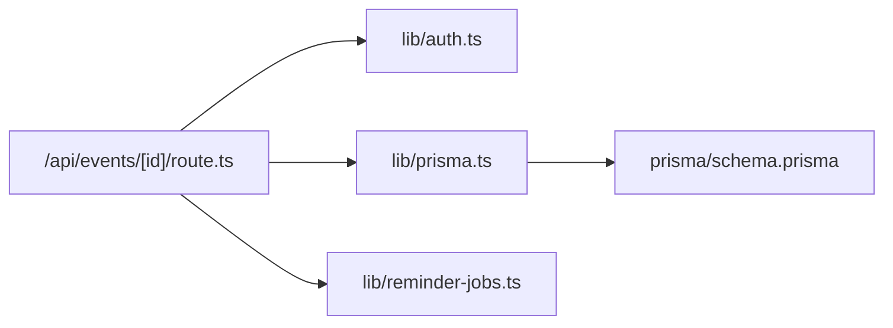

# 单条事件操作

<cite>
**本文引用的文件**
- [app/api/events/[id]/route.ts](file://app/api/events/[id]/route.ts)
- [lib/prisma.ts](file://lib/prisma.ts)
- [lib/auth.ts](file://lib/auth.ts)
- [lib/reminder-jobs.ts](file://lib/reminder-jobs.ts)
- [prisma/schema.prisma](file://prisma/schema.prisma)
- [middleware.ts](file://middleware.ts)
- [__tests__/api/event-crud.test.ts](file://__tests__/api/event-crud.test.ts)
</cite>

## 目录
1. [简介](#简介)
2. [项目结构](#项目结构)
3. [核心组件](#核心组件)
4. [架构总览](#架构总览)
5. [详细组件分析](#详细组件分析)
6. [依赖关系分析](#依赖关系分析)
7. [性能考量](#性能考量)
8. [故障排查指南](#故障排查指南)
9. [结论](#结论)
10. [附录](#附录)

## 简介
本文件聚焦于单条事件操作接口（PUT/DELETE /api/events/[id]），系统性阐述以下内容：
- PUT 请求的完整流程：鉴权、权限校验、Zod 部分更新校验、数据库更新、以及更新后自动重新生成关联提醒任务。
- DELETE 请求的幂等性设计、硬删除策略及删除后清理提醒任务的机制。
- 安全保障：跨用户访问时返回 403 的作用。
- 实战示例：PUT 的 JSON Patch 风格更新（仅更新 label 字段）与 DELETE 的简单调用示例。
- 错误处理与边界条件：401、403、404、400、500 等状态码的触发场景。

## 项目结构
该接口位于 Next.js App Router 的动态路由中，采用独立的 [id] 路由文件组织，配合认证、数据库与提醒任务模块协同工作。

图表来源
- [app/api/events/[id]/route.ts](file://app/api/events/[id]/route.ts#L1-L119)
- [lib/auth.ts](file://lib/auth.ts#L1-L30)
- [lib/prisma.ts](file://lib/prisma.ts#L1-L20)
- [lib/reminder-jobs.ts](file://lib/reminder-jobs.ts#L1-L109)
- [prisma/schema.prisma](file://prisma/schema.prisma#L28-L74)
- [middleware.ts](file://middleware.ts#L1-L50)

章节来源
- [app/api/events/[id]/route.ts](file://app/api/events/[id]/route.ts#L1-L119)
- [lib/prisma.ts](file://lib/prisma.ts#L1-L20)
- [lib/auth.ts](file://lib/auth.ts#L1-L30)
- [lib/reminder-jobs.ts](file://lib/reminder-jobs.ts#L1-L109)
- [prisma/schema.prisma](file://prisma/schema.prisma#L28-L74)
- [middleware.ts](file://middleware.ts#L1-L50)

## 核心组件
- 动态路由处理器：负责接收请求、鉴权、权限校验、参数校验、数据库操作与后续提醒任务重建。
- 认证模块：提供 JWT 解析与校验能力，确保请求来自合法用户。
- 数据库客户端：基于 Prisma 的 PostgreSQL 适配器，统一访问事件与提醒任务表。
- 提醒任务模块：根据事件标签与规则生成或重建提醒任务，支持工作日避让与默认规则回退。

章节来源
- [app/api/events/[id]/route.ts](file://app/api/events/[id]/route.ts#L1-L119)
- [lib/auth.ts](file://lib/auth.ts#L22-L29)
- [lib/prisma.ts](file://lib/prisma.ts#L9-L19)
- [lib/reminder-jobs.ts](file://lib/reminder-jobs.ts#L15-L72)

## 架构总览
下图展示从客户端到数据库与提醒系统的整体交互路径。

图表来源
- [app/api/events/[id]/route.ts](file://app/api/events/[id]/route.ts#L15-L74)
- [app/api/events/[id]/route.ts](file://app/api/events/[id]/route.ts#L76-L118)
- [lib/auth.ts](file://lib/auth.ts#L22-L29)
- [lib/reminder-jobs.ts](file://lib/reminder-jobs.ts#L15-L72)

## 详细组件分析

### PUT /api/events/[id]：部分更新与提醒重建
- 鉴权与权限校验
  - 从 Cookie 中提取 token 并通过 JWT 校验，若无效返回 401。
  - 查询目标事件是否存在且归属当前用户，否则返回 404 或 403。
- 输入校验
  - 使用 Zod 的 eventUpdateSchema 对请求体进行安全解析，支持 title/date/time/label/notes 的可选更新。
  - 若校验失败，返回 400 并附带错误详情。
- 数据库更新
  - 通过 Prisma 的 event.update 执行部分更新。
- 提醒任务重建
  - 调用 generateReminderJobs，先清理旧任务，再依据事件标签查找对应提醒规则或回退默认规则，生成新的提醒任务。
- 返回值
  - 成功返回 200，包含更新后的事件对象。

图表来源
- [app/api/events/[id]/route.ts](file://app/api/events/[id]/route.ts#L15-L74)
- [lib/reminder-jobs.ts](file://lib/reminder-jobs.ts#L15-L72)

章节来源
- [app/api/events/[id]/route.ts](file://app/api/events/[id]/route.ts#L15-L74)
- [lib/reminder-jobs.ts](file://lib/reminder-jobs.ts#L15-L72)

### DELETE /api/events/[id]：幂等性与硬删除
- 鉴权与权限校验
  - 同样进行 token 校验与归属校验，不匹配返回 403。
- 删除策略
  - 当前实现为硬删除（Prisma delete），未做软删除标记。
- 幂等性
  - 多次调用同一 ID 的 DELETE，只要资源不存在则重复返回 200，满足幂等性要求。
- 清理机制
  - 删除后直接返回成功，提醒任务清理由外层逻辑或定时任务负责；当前路由未显式调用清理函数。

图表来源
- [app/api/events/[id]/route.ts](file://app/api/events/[id]/route.ts#L76-L118)

章节来源
- [app/api/events/[id]/route.ts](file://app/api/events/[id]/route.ts#L76-L118)

### 数据模型与提醒规则
- Event 模型
  - 包含 id、userId、title、date、time、datetime、label、notes 等字段，并维护与 ReminderJob 的一对多关系。
- ReminderRule 模型
  - 用户维度的标签提醒规则，包含标签名、偏移天数数组、默认提醒时间、是否避开周末等。
- ReminderJob 模型
  - 具体的提醒任务，包含 fireTime、sent 状态等，与 Event 建立级联删除关系。

图表来源
- [prisma/schema.prisma](file://prisma/schema.prisma#L28-L74)

章节来源
- [prisma/schema.prisma](file://prisma/schema.prisma#L28-L74)

### 类关系与依赖

图表来源
- [app/api/events/[id]/route.ts](file://app/api/events/[id]/route.ts#L1-L119)
- [lib/auth.ts](file://lib/auth.ts#L22-L29)
- [lib/prisma.ts](file://lib/prisma.ts#L13-L19)
- [lib/reminder-jobs.ts](file://lib/reminder-jobs.ts#L1-L109)

## 依赖关系分析
- 内部依赖
  - /api/events/[id]/route.ts 依赖 lib/auth.ts 进行鉴权、lib/prisma.ts 进行数据库访问、lib/reminder-jobs.ts 用于提醒任务重建。
- 外部依赖
  - Prisma 客户端通过 @prisma/adapter-pg 连接 PostgreSQL。
  - JWT 使用 jose 库进行签发与校验。
- 关系耦合
  - 路由层与业务层清晰分离，提醒任务模块可复用至其他场景。
  - 事件与提醒任务之间通过外键与级联删除建立强约束。

图表来源
- [app/api/events/[id]/route.ts](file://app/api/events/[id]/route.ts#L1-L119)
- [lib/auth.ts](file://lib/auth.ts#L1-L30)
- [lib/prisma.ts](file://lib/prisma.ts#L1-L20)
- [lib/reminder-jobs.ts](file://lib/reminder-jobs.ts#L1-L109)
- [prisma/schema.prisma](file://prisma/schema.prisma#L28-L74)

章节来源
- [app/api/events/[id]/route.ts](file://app/api/events/[id]/route.ts#L1-L119)
- [lib/auth.ts](file://lib/auth.ts#L1-L30)
- [lib/prisma.ts](file://lib/prisma.ts#L1-L20)
- [lib/reminder-jobs.ts](file://lib/reminder-jobs.ts#L1-L109)
- [prisma/schema.prisma](file://prisma/schema.prisma#L28-L74)

## 性能考量
- 查询优化
  - 事件归属校验与单条查询使用唯一索引，避免全表扫描。
- 提醒任务重建
  - 采用“先删后建”的策略，确保新规则生效；批量事件同步可考虑分批处理以降低峰值压力。
- 数据库连接
  - Prisma 在开发环境缓存客户端实例，减少重复初始化开销。
- 建议
  - 对频繁更新的事件，可在应用层引入变更检测，仅在必要时触发提醒任务重建。
  - 对高并发场景，建议对提醒任务生成增加队列化或异步化处理。

[本节为通用性能建议，无需特定文件引用]

## 故障排查指南
- 401 未授权
  - 检查请求是否携带有效 token，确认 JWT 密钥配置正确。
- 403 禁止访问
  - 确认事件归属与当前用户一致；跨用户访问会被拒绝。
- 404 未找到
  - 确认事件 ID 存在；可能已被删除或输入错误。
- 400 输入无效
  - 检查请求体是否符合 eventUpdateSchema 规范（如日期格式、时间格式、可空字段等）。
- 500 服务器错误
  - 查看后端日志定位异常；关注 Prisma 查询与提醒任务生成过程中的异常。

章节来源
- [app/api/events/[id]/route.ts](file://app/api/events/[id]/route.ts#L19-L73)
- [app/api/events/[id]/route.ts](file://app/api/events/[id]/route.ts#L80-L117)

## 结论
- PUT 接口通过严格的鉴权与权限校验、Zod 的安全输入校验、以及更新后的提醒任务重建，确保了数据一致性与用户体验。
- DELETE 接口采用幂等设计与硬删除策略，简化了实现复杂度，同时保持了接口的可预测性。
- 403 的出现有效防止了跨用户访问，是系统安全边界的重要一环。
- 建议在后续迭代中考虑软删除与更细粒度的权限控制，以增强审计与恢复能力。

[本节为总结性内容，无需特定文件引用]

## 附录

### 接口定义与行为摘要
- PUT /api/events/[id]
  - 请求体：部分字段（title/date/time/label/notes），使用 eventUpdateSchema 校验。
  - 成功：200，返回更新后的事件对象。
  - 安全：鉴权 + 归属校验；更新后重建提醒任务。
- DELETE /api/events/[id]
  - 成功：200，返回 { success: true }。
  - 幂等：重复调用不会改变最终状态。
  - 安全：鉴权 + 归属校验；当前为硬删除。

章节来源
- [app/api/events/[id]/route.ts](file://app/api/events/[id]/route.ts#L15-L74)
- [app/api/events/[id]/route.ts](file://app/api/events/[id]/route.ts#L76-L118)

### 示例调用

- PUT（JSON Patch 风格，仅更新 label 字段）
  - 方法与路径：PUT /api/events/{id}
  - 请求头：Content-Type: application/json
  - 请求体：{"label":"新标签"}
  - 说明：仅传递需要更新的字段，其余保持不变；服务端会进行 Zod 校验并执行部分更新。
  - 安全：必须为事件归属用户，否则返回 403。

- DELETE（简单调用）
  - 方法与路径：DELETE /api/events/{id}
  - 说明：删除指定事件；若事件不存在，仍返回 200（幂等）。
  - 安全：必须为事件归属用户，否则返回 403。

章节来源
- [app/api/events/[id]/route.ts](file://app/api/events/[id]/route.ts#L15-L74)
- [app/api/events/[id]/route.ts](file://app/api/events/[id]/route.ts#L76-L118)

### 测试参考
- 单元测试覆盖了鉴权失败、事件不存在、跨用户访问（403）、成功更新与删除成功等场景。
- 可作为集成测试与端到端测试的参考基线。

章节来源
- [__tests__/api/event-crud.test.ts](file://__tests__/api/event-crud.test.ts#L86-L165)