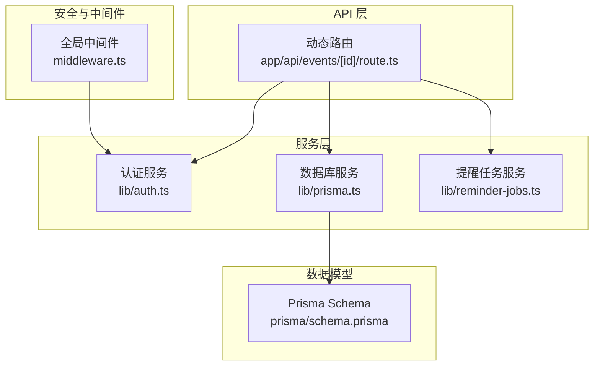
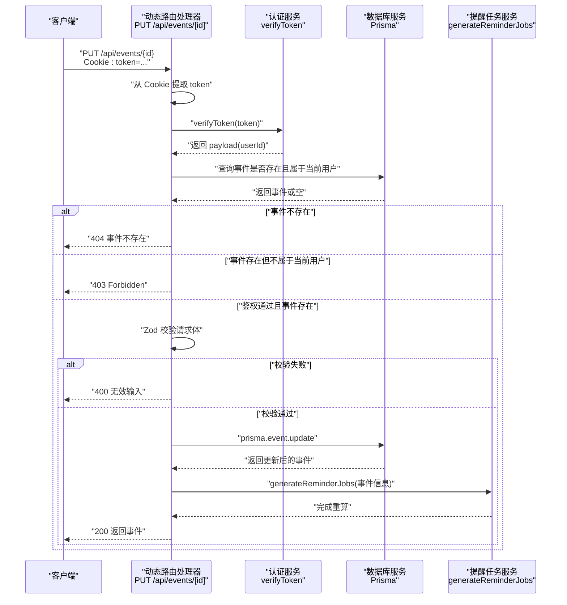
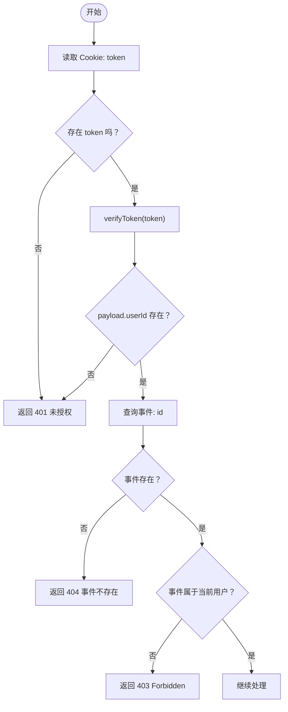
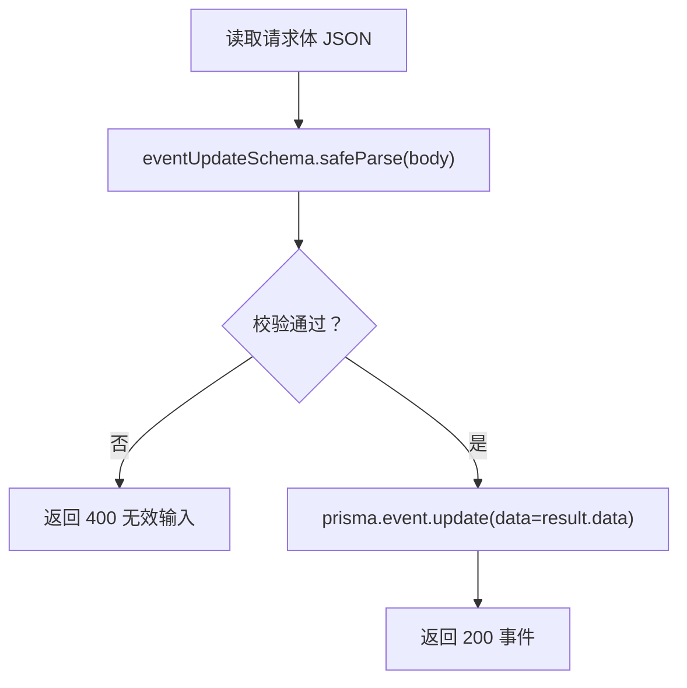
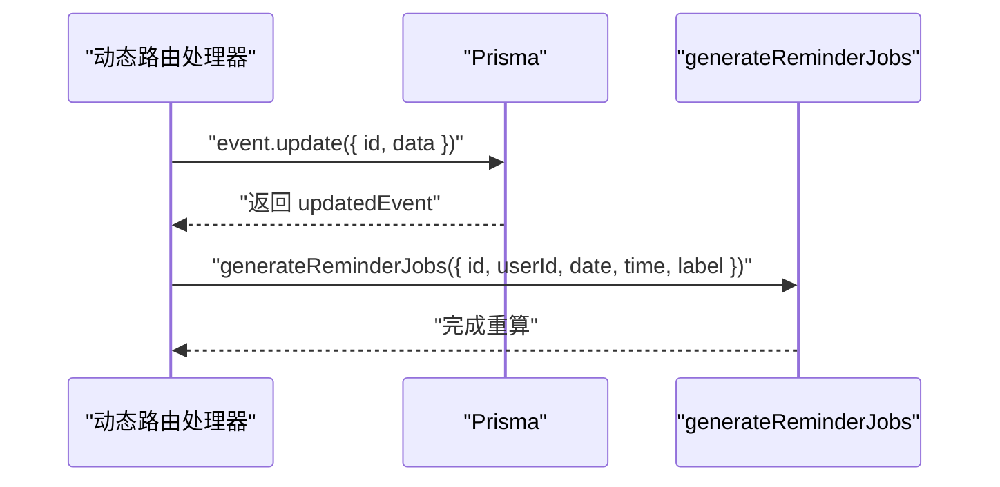
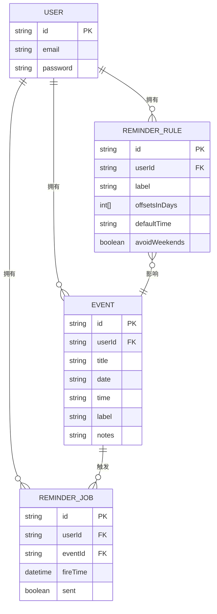
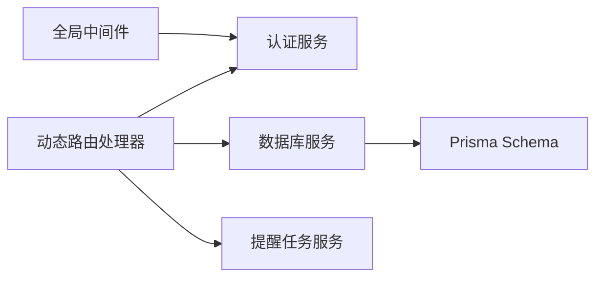

# 单条事件更新 (PUT)

<cite>
**本文引用的文件**
- [app/api/events/[id]/route.ts](file://app/api/events/[id]/route.ts)
- [lib/auth.ts](file://lib/auth.ts)
- [lib/prisma.ts](file://lib/prisma.ts)
- [lib/reminder-jobs.ts](file://lib/reminder-jobs.ts)
- [prisma/schema.prisma](file://prisma/schema.prisma)
- [middleware.ts](file://middleware.ts)
- [app/api/events/route.ts](file://app/api/events/route.ts)
</cite>

## 目录
1. [简介](#简介)
2. [项目结构](#项目结构)
3. [核心组件](#核心组件)
4. [架构总览](#架构总览)
5. [详细组件分析](#详细组件分析)
6. [依赖关系分析](#依赖关系分析)
7. [性能考量](#性能考量)
8. [故障排查指南](#故障排查指南)
9. [结论](#结论)
10. [附录](#附录)

## 简介
本文件面向“单条事件更新接口（PUT /api/events/[id]）”的实现与使用，系统性阐述以下内容：
- 请求认证流程：从 Cookie 中提取 JWT 令牌并验证用户身份
- 数据隔离与权限控制：基于事件所属用户 ID 的 403 Forbidden 处理
- 请求体校验：使用 Zod 校验器 eventUpdateSchema 对 title、date、time、label、notes 字段进行可选更新，并说明日期与时间格式约束
- 数据库更新：prisma.event.update 执行部分更新
- 提醒任务同步：更新成功后调用 generateReminderJobs 重新生成该事件关联的提醒任务
- 错误状态码与触发条件：200 成功、400 校验失败、401 未授权、403 越权访问、404 事件不存在、500 内部错误
- 请求示例：仅更新 label 字段的 JSON 示例

## 项目结构
该接口位于 Next.js App Router 的动态路由下，采用“按文件即路由”的组织方式：
- 动态路由文件：app/api/events/[id]/route.ts
- 认证工具：lib/auth.ts（签名与验证 JWT）
- 数据库客户端：lib/prisma.ts（Prisma Client 初始化）
- 提醒任务生成：lib/reminder-jobs.ts（根据标签规则生成提醒任务）
- 数据模型：prisma/schema.prisma（Event、ReminderRule、ReminderJob 等）
- 全局中间件：middleware.ts（统一鉴权拦截）

图表来源
- [app/api/events/[id]/route.ts](file://app/api/events/[id]/route.ts#L1-L74)
- [lib/auth.ts](file://lib/auth.ts#L1-L29)
- [lib/prisma.ts](file://lib/prisma.ts#L1-L20)
- [lib/reminder-jobs.ts](file://lib/reminder-jobs.ts#L1-L72)
- [prisma/schema.prisma](file://prisma/schema.prisma#L28-L45)
- [middleware.ts](file://middleware.ts#L1-L49)

章节来源
- [app/api/events/[id]/route.ts](file://app/api/events/[id]/route.ts#L1-L74)
- [lib/auth.ts](file://lib/auth.ts#L1-L29)
- [lib/prisma.ts](file://lib/prisma.ts#L1-L20)
- [lib/reminder-jobs.ts](file://lib/reminder-jobs.ts#L1-L72)
- [prisma/schema.prisma](file://prisma/schema.prisma#L28-L45)
- [middleware.ts](file://middleware.ts#L1-L49)

## 核心组件
- 动态路由处理器：负责接收 PUT 请求、解析参数、鉴权、校验、更新与重算提醒
- 认证服务：提供 verifyToken 验证 JWT 并返回用户标识
- 数据库服务：提供 Prisma Client 实例，用于查询与更新事件
- 提醒任务服务：根据事件标签与规则生成或重算提醒任务
- 数据模型：Event、ReminderRule、ReminderJob 的关系与字段定义

章节来源
- [app/api/events/[id]/route.ts](file://app/api/events/[id]/route.ts#L15-L74)
- [lib/auth.ts](file://lib/auth.ts#L22-L29)
- [lib/prisma.ts](file://lib/prisma.ts#L13-L19)
- [lib/reminder-jobs.ts](file://lib/reminder-jobs.ts#L15-L72)
- [prisma/schema.prisma](file://prisma/schema.prisma#L28-L45)

## 架构总览
下面的时序图展示了从客户端到数据库与提醒服务的整体流程。

图表来源
- [app/api/events/[id]/route.ts](file://app/api/events/[id]/route.ts#L15-L74)
- [lib/auth.ts](file://lib/auth.ts#L22-L29)
- [lib/reminder-jobs.ts](file://lib/reminder-jobs.ts#L15-L72)

## 详细组件分析

### 接口定义与路由参数
- 路径：/api/events/[id]
- 方法：PUT
- 参数：动态路由参数 id（事件 ID）
- 请求头：Cookie: token=...
- 响应：200 返回更新后的事件对象；错误时返回 JSON 错误信息与对应状态码

章节来源
- [app/api/events/[id]/route.ts](file://app/api/events/[id]/route.ts#L15-L33)

### 认证与权限控制
- 从请求 Cookie 中读取 token
- 使用 verifyToken 进行 JWT 验证，获取 payload.userId
- 查询事件是否存在且 userId 与 payload.userId 匹配
- 不满足条件时分别返回 401、403 或 404

图表来源
- [app/api/events/[id]/route.ts](file://app/api/events/[id]/route.ts#L19-L46)
- [lib/auth.ts](file://lib/auth.ts#L22-L29)

章节来源
- [app/api/events/[id]/route.ts](file://app/api/events/[id]/route.ts#L19-L46)
- [lib/auth.ts](file://lib/auth.ts#L22-L29)

### 请求体校验（Zod Schema）
- 支持的字段（均可选）：title、date、time、label、notes
- 格式约束：
  - date：YYYY-MM-DD（正则约束）
  - time：HH:MM（正则约束），允许为 null 或空字符串
- 校验失败返回 400，并包含错误详情

图表来源
- [app/api/events/[id]/route.ts](file://app/api/events/[id]/route.ts#L7-L13)
- [app/api/events/[id]/route.ts](file://app/api/events/[id]/route.ts#L48-L58)

章节来源
- [app/api/events/[id]/route.ts](file://app/api/events/[id]/route.ts#L7-L13)
- [app/api/events/[id]/route.ts](file://app/api/events/[id]/route.ts#L48-L58)

### 数据库更新与提醒任务重算
- 更新：prisma.event.update 按 id 更新传入字段
- 重算：调用 generateReminderJobs，删除旧任务并按标签规则生成新任务
- 触发时机：更新成功后立即执行

图表来源
- [app/api/events/[id]/route.ts](file://app/api/events/[id]/route.ts#L55-L67)
- [lib/reminder-jobs.ts](file://lib/reminder-jobs.ts#L15-L72)

章节来源
- [app/api/events/[id]/route.ts](file://app/api/events/[id]/route.ts#L55-L67)
- [lib/reminder-jobs.ts](file://lib/reminder-jobs.ts#L15-L72)

### 数据模型与关系
- Event：包含 id、userId、title、date、time、label、notes 等字段
- ReminderRule：按用户与标签配置提醒偏移天数、默认时间、是否避开周末
- ReminderJob：按事件生成的提醒任务，与 Event 关联

图表来源
- [prisma/schema.prisma](file://prisma/schema.prisma#L16-L85)

章节来源
- [prisma/schema.prisma](file://prisma/schema.prisma#L28-L45)
- [prisma/schema.prisma](file://prisma/schema.prisma#L47-L60)
- [prisma/schema.prisma](file://prisma/schema.prisma#L62-L74)

### 请求示例（仅更新 label）
- 方法：PUT
- 路径：/api/events/{id}
- 请求头：Cookie: token=...
- 请求体（JSON）：
  - 仅包含 label 字段，值为字符串或 null/空字符串

章节来源
- [app/api/events/[id]/route.ts](file://app/api/events/[id]/route.ts#L7-L13)
- [app/api/events/[id]/route.ts](file://app/api/events/[id]/route.ts#L48-L58)

## 依赖关系分析
- 动态路由处理器依赖认证服务（verifyToken）、数据库服务（Prisma）、提醒任务服务（generateReminderJobs）
- 中间件对受保护路径进行统一鉴权，减少重复逻辑
- Prisma Schema 定义了事件与提醒规则/任务的关系，支撑提醒重算逻辑

图表来源
- [app/api/events/[id]/route.ts](file://app/api/events/[id]/route.ts#L1-L5)
- [middleware.ts](file://middleware.ts#L1-L49)
- [prisma/schema.prisma](file://prisma/schema.prisma#L28-L45)

章节来源
- [app/api/events/[id]/route.ts](file://app/api/events/[id]/route.ts#L1-L5)
- [middleware.ts](file://middleware.ts#L1-L49)
- [prisma/schema.prisma](file://prisma/schema.prisma#L28-L45)

## 性能考量
- 中间件对每个请求进行 JWT 验证可能带来额外开销，建议在受保护路径上启用并保持轻量
- 事件更新后调用 generateReminderJobs 会删除并重建提醒任务，建议在批量更新场景合并调用以减少数据库写入
- Prisma 查询与更新尽量使用索引字段（如 userId、id），避免全表扫描

## 故障排查指南
- 401 未授权
  - 可能原因：Cookie 中无 token 或 token 无效
  - 处理建议：确认登录状态与 Cookie 设置
- 403 Forbidden
  - 可能原因：事件存在但不属于当前用户
  - 处理建议：检查事件归属与用户上下文
- 404 事件不存在
  - 可能原因：id 无效或事件已被删除
  - 处理建议：确认 id 正确性
- 400 校验失败
  - 可能原因：date/time 格式不匹配或字段类型不符
  - 处理建议：遵循 YYYY-MM-DD 与 HH:MM 格式，或传空字符串/null
- 500 内部错误
  - 可能原因：数据库异常或服务内部错误
  - 处理建议：查看服务器日志并重试

章节来源
- [app/api/events/[id]/route.ts](file://app/api/events/[id]/route.ts#L20-L28)
- [app/api/events/[id]/route.ts](file://app/api/events/[id]/route.ts#L40-L46)
- [app/api/events/[id]/route.ts](file://app/api/events/[id]/route.ts#L51-L53)
- [app/api/events/[id]/route.ts](file://app/api/events/[id]/route.ts#L70-L73)

## 结论
该接口通过严格的认证与权限校验、Zod 校验器与 Prisma 更新，确保了数据一致性与安全性；同时在更新后自动重算提醒任务，保障提醒规则与最新事件数据同步。遵循本文档的请求格式与错误处理策略，可稳定地完成单条事件的部分更新。

## 附录

### 状态码与触发条件对照
- 200 成功：鉴权通过、事件存在且属于当前用户、请求体校验通过、数据库更新成功
- 400 校验失败：请求体不符合 eventUpdateSchema
- 401 未授权：缺少 token 或 token 无效
- 403 越权访问：事件存在但不属于当前用户
- 404 事件不存在：id 对应事件不存在
- 500 内部错误：服务端异常

章节来源
- [app/api/events/[id]/route.ts](file://app/api/events/[id]/route.ts#L20-L28)
- [app/api/events/[id]/route.ts](file://app/api/events/[id]/route.ts#L40-L46)
- [app/api/events/[id]/route.ts](file://app/api/events/[id]/route.ts#L51-L53)
- [app/api/events/[id]/route.ts](file://app/api/events/[id]/route.ts#L70-L73)