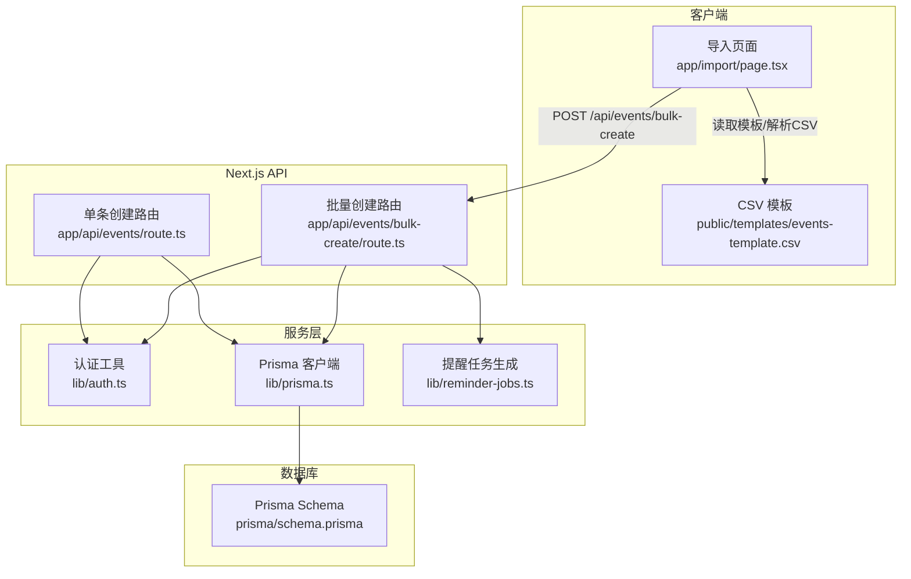
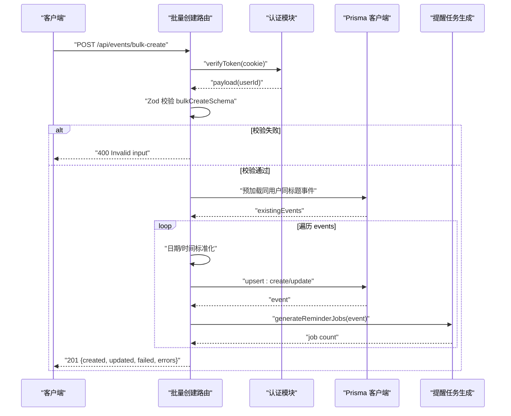
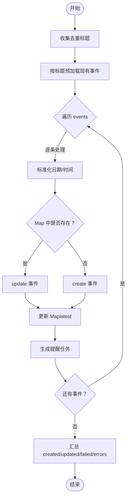
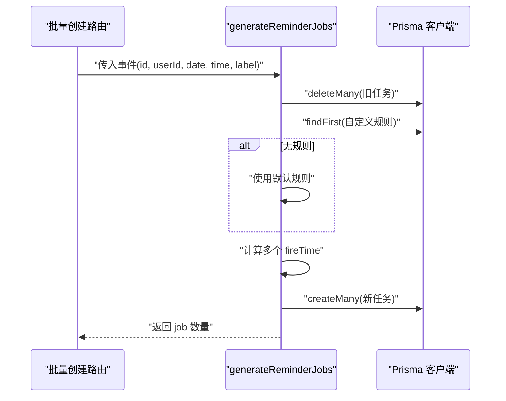
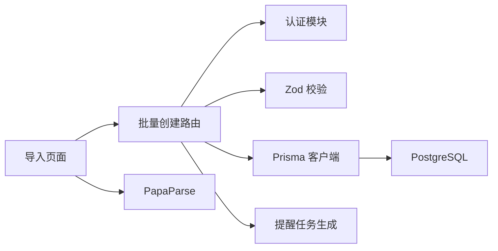

# 批量创建事件

<cite>
**本文引用的文件列表**
- [app/api/events/bulk-create/route.ts](file://app/api/events/bulk-create/route.ts)
- [app/api/events/route.ts](file://app/api/events/route.ts)
- [lib/reminder-jobs.ts](file://lib/reminder-jobs.ts)
- [lib/prisma.ts](file://lib/prisma.ts)
- [lib/auth.ts](file://lib/auth.ts)
- [prisma/schema.prisma](file://prisma/schema.prisma)
- [app/import/page.tsx](file://app/import/page.tsx)
- [public/templates/events-template.csv](file://public/templates/events-template.csv)
- [README.md](file://README.md)
</cite>

## 目录
1. [简介](#简介)
2. [项目结构](#项目结构)
3. [核心组件](#核心组件)
4. [架构总览](#架构总览)
5. [详细组件分析](#详细组件分析)
6. [依赖关系分析](#依赖关系分析)
7. [性能考量](#性能考量)
8. [故障排查指南](#故障排查指南)
9. [结论](#结论)
10. [附录](#附录)

## 简介
本文件针对批量创建事件接口（POST /api/events/bulk-create）进行完整技术文档化，涵盖：
- 请求体结构与字段映射（events 数组、title、date、time、label、notes）
- 数据预处理策略（日期格式标准化、时间补零）
- Zod 校验模式（bulkCreateSchema、bulkEventSchema）的验证规则
- 业务逻辑详解（基于 Map 的预加载缓存、upsert 模式逐条处理、错误隔离）
- 批量导入后提醒任务生成（generateReminderJobs 调用）
- 响应结构说明（created、updated、failed、errors 字段）
- curl 示例与 CSV 转换后 JSON 的导入方式

## 项目结构
该接口位于 Next.js App Router 的 API 层，配合 Prisma ORM、Zod 校验、JWT 认证与提醒任务生成模块协同工作。



图表来源
- [app/import/page.tsx](file://app/import/page.tsx#L1-L218)
- [public/templates/events-template.csv](file://public/templates/events-template.csv#L1-L5)
- [app/api/events/bulk-create/route.ts](file://app/api/events/bulk-create/route.ts#L1-L133)
- [app/api/events/route.ts](file://app/api/events/route.ts#L1-L200)
- [lib/auth.ts](file://lib/auth.ts#L1-L30)
- [lib/prisma.ts](file://lib/prisma.ts#L1-L20)
- [lib/reminder-jobs.ts](file://lib/reminder-jobs.ts#L1-L109)
- [prisma/schema.prisma](file://prisma/schema.prisma#L1-L86)

章节来源
- [README.md](file://README.md#L1-L152)

## 核心组件
- 批量创建路由：负责鉴权、输入校验、预加载现有事件、逐条 upsert、生成提醒任务、返回聚合统计。
- 单条创建路由：对比参考，展示标准 upsert 流程与提醒任务生成。
- 认证模块：JWT 验证，提取 userId。
- Prisma 客户端：连接 PostgreSQL，执行查询与写入。
- 提醒任务生成：根据事件标签与规则生成 ReminderJob。
- 导入页面与模板：前端 CSV 解析、格式标准化、触发批量导入。

章节来源
- [app/api/events/bulk-create/route.ts](file://app/api/events/bulk-create/route.ts#L1-L133)
- [app/api/events/route.ts](file://app/api/events/route.ts#L131-L199)
- [lib/auth.ts](file://lib/auth.ts#L22-L29)
- [lib/prisma.ts](file://lib/prisma.ts#L1-L20)
- [lib/reminder-jobs.ts](file://lib/reminder-jobs.ts#L15-L72)
- [app/import/page.tsx](file://app/import/page.tsx#L35-L106)
- [public/templates/events-template.csv](file://public/templates/events-template.csv#L1-L5)

## 架构总览
批量创建流程的关键步骤如下：



图表来源
- [app/api/events/bulk-create/route.ts](file://app/api/events/bulk-create/route.ts#L19-L127)
- [lib/auth.ts](file://lib/auth.ts#L22-L29)
- [lib/reminder-jobs.ts](file://lib/reminder-jobs.ts#L15-L72)

## 详细组件分析

### 请求体结构与字段映射
- events：数组，元素为单个事件对象
  - title：字符串，必填且长度≥1
  - date：字符串，必须匹配“YYYY-MM-DD”或“YYYY/MM/DD”，最终统一为“YYYY-MM-DD”
  - time：字符串，可选，格式“H:MM”或“HH:MM”，不合法会报错；若为空则默认“10:00”
  - label：字符串，可选
  - notes：字符串，可选

字段映射与约束
- title：唯一性在 upsert 中体现（同一用户下按 title 决定是否更新）
- date：标准化为“YYYY-MM-DD”，用于查询与排序
- time：若仅有一位小时数（如“1:30”），自动补零为“01:30”
- label/notes：可空，最终入库为 null 或字符串

章节来源
- [app/api/events/bulk-create/route.ts](file://app/api/events/bulk-create/route.ts#L7-L17)
- [app/api/events/bulk-create/route.ts](file://app/api/events/bulk-create/route.ts#L59-L66)

### 数据预处理与标准化
- 日期标准化：将“YYYY/MM/DD”替换为“YYYY-MM-DD”
- 时间补零：将“H:MM”补零为“HH:MM”
- 默认时间：若未提供 time，默认使用“10:00”
- 时区：统一使用“+08:00”构造 ISO 字符串，确保数据库 datetime 一致

章节来源
- [app/api/events/bulk-create/route.ts](file://app/api/events/bulk-create/route.ts#L59-L66)

### Zod 校验模式
- bulkCreateSchema：包含 events 数组，数组元素为 bulkEventSchema
- bulkEventSchema：
  - title：非空字符串
  - date：正则“YYYY[-/]MM[-/]DD”
  - time：可选，正则“H:MM”或“HH:MM”
  - label/notes：可选

校验失败返回
- 状态码 400，返回错误详情（details）

章节来源
- [app/api/events/bulk-create/route.ts](file://app/api/events/bulk-create/route.ts#L7-L17)
- [app/api/events/bulk-create/route.ts](file://app/api/events/bulk-create/route.ts#L32-L36)

### 业务逻辑：Map 缓存与 upsert
- 预加载策略
  - 从 events 中收集去重后的 title，一次性查询当前用户下已存在的同名事件
  - 将结果构建为 Map，键为 title，值为事件对象，便于 O(1) 查找
- upsert 流程
  - 对每个事件：
    - 若 Map 中存在相同 title，则 update
    - 否则 create
  - 更新 Map，确保同一批次内后续重复 title 会覆盖最新一条
- 错误隔离
  - 单个事件异常被捕获并记录其索引、标题与错误消息，不影响其他事件处理
  - 最终返回 created、updated、failed 与 errors 数组



图表来源
- [app/api/events/bulk-create/route.ts](file://app/api/events/bulk-create/route.ts#L41-L119)

章节来源
- [app/api/events/bulk-create/route.ts](file://app/api/events/bulk-create/route.ts#L41-L119)

### 提醒任务生成（generateReminderJobs）
- 删除旧任务：先删除该事件对应的所有 ReminderJob
- 查找规则：按事件 label 查询用户级 ReminderRule
- 规则回退：若无自定义规则，使用默认规则（1 天前，10:00，不避周末）
- 计算 fireTime：事件时间减去每条偏移天数
- 周末避让：若开启 avoidWeekends，将周日/周六调整为周五
- 批量创建：将所有计算出的 job 写入数据库



图表来源
- [lib/reminder-jobs.ts](file://lib/reminder-jobs.ts#L15-L72)

章节来源
- [lib/reminder-jobs.ts](file://lib/reminder-jobs.ts#L15-L72)

### 响应结构与语义
- success：布尔，表示接口处理成功
- created：本次导入中新增事件数量（含 upsert 新增）
- updated：本次导入中更新事件数量
- failed：本次导入中失败事件数量
- errors：数组，包含每个失败事件的 index、title 与错误信息

章节来源
- [app/api/events/bulk-create/route.ts](file://app/api/events/bulk-create/route.ts#L121-L127)

### 与单条创建的差异
- 单条创建：每次只处理一个事件，直接 upsert 并生成一次提醒任务
- 批量创建：预加载缓存、逐条 upsert、逐条生成提醒任务，并对每个事件独立捕获异常

章节来源
- [app/api/events/route.ts](file://app/api/events/route.ts#L131-L199)
- [app/api/events/bulk-create/route.ts](file://app/api/events/bulk-create/route.ts#L71-L105)

### 数据模型与索引
- Event：包含 userId、title、date、time、datetime、label、notes
- ReminderRule：按 userId+label 唯一
- ReminderJob：按 userId、sent、fireTime 索引，Cascade 删除事件时同步删除任务

章节来源
- [prisma/schema.prisma](file://prisma/schema.prisma#L28-L74)

## 依赖关系分析
- 批量创建路由依赖：
  - 认证：verifyToken 提取 userId
  - 校验：Zod bulkCreateSchema/bulkEventSchema
  - 数据库：Prisma ORM
  - 提醒：generateReminderJobs
- 导入页面依赖：
  - PapaParse：解析 CSV
  - 格式标准化：日期“YYYY/MM/DD”→“YYYY-MM-DD”，时间“H:MM”→“HH:MM”
  - 发送请求：POST /api/events/bulk-create



图表来源
- [app/api/events/bulk-create/route.ts](file://app/api/events/bulk-create/route.ts#L1-L5)
- [lib/auth.ts](file://lib/auth.ts#L22-L29)
- [lib/reminder-jobs.ts](file://lib/reminder-jobs.ts#L1-L109)
- [app/import/page.tsx](file://app/import/page.tsx#L35-L90)

章节来源
- [app/api/events/bulk-create/route.ts](file://app/api/events/bulk-create/route.ts#L1-L5)
- [app/import/page.tsx](file://app/import/page.tsx#L35-L90)

## 性能考量
- 预加载缓存：通过一次性查询减少重复查询，提升 upsert 效率
- Map 查找：O(1) 查找，避免 N 次数据库查询
- 逐条 upsert：保持事务边界清晰，便于错误隔离
- 批量提醒任务：先删后增，避免重复任务堆积
- 建议
  - 控制单次导入事件数量上限，避免长时间占用数据库连接
  - 对大量导入建议分批提交
  - 确保数据库索引（如 userId+date）有效

章节来源
- [app/api/events/bulk-create/route.ts](file://app/api/events/bulk-create/route.ts#L41-L49)
- [lib/reminder-jobs.ts](file://lib/reminder-jobs.ts#L16-L19)

## 故障排查指南
- 400 错误（无效输入）
  - 检查 events 数组与字段类型
  - 确认 date/time 格式符合正则要求
- 401 错误（未授权）
  - 确认请求携带有效的 token Cookie
- 500 错误（内部错误）
  - 查看服务端日志，定位具体异常
- 导入结果异常
  - 检查 errors 数组，定位失败事件的 index 与错误信息
  - 确认同用户下 title 是否重复导致 upsert 覆盖

章节来源
- [app/api/events/bulk-create/route.ts](file://app/api/events/bulk-create/route.ts#L20-L36)
- [app/api/events/bulk-create/route.ts](file://app/api/events/bulk-create/route.ts#L128-L131)

## 结论
批量创建事件接口通过严格的输入校验、高效的预加载缓存、逐条 upsert 与错误隔离机制，实现了稳定可靠的批量导入能力。结合提醒任务生成，确保导入完成后自动建立提醒计划。前端导入页面提供 CSV 模板与格式标准化，进一步降低使用门槛。

## 附录

### curl 示例：导入 CSV 转换后的 JSON
- 准备数据
  - 将 CSV 转换为 JSON（字段：title、date、time、label、notes）
  - 示例 JSON 结构见下方“请求体示例”
- 发送请求
  - 注意设置 Content-Type 为 application/json
  - 确保携带有效的 Cookie（token）

请求体示例（events 数组）
- title：必填
- date：YYYY-MM-DD 或 YYYY/MM/DD（将被标准化为 YYYY-MM-DD）
- time：可选，HH:MM
- label：可选
- notes：可选

响应示例（成功与失败混合）
- created：本次导入中新增事件数量
- updated：本次导入中更新事件数量
- failed：本次导入中失败事件数量
- errors：失败事件数组，包含 index、title、error

curl 命令示例
- 假设本地运行，token 存于 Cookie
- 将以下 JSON 替换为实际数据

```bash
curl -X POST http://localhost:3000/api/events/bulk-create \
  -H "Content-Type: application/json" \
  -H "Cookie: token=<your_jwt_token>" \
  -d '{
    "events": [
      {"title":"会议","date":"2025-12-11","time":"14:30","label":"Project","notes":"团队讨论"},
      {"title":"体检","date":"2025-12-12","time":"09:00","label":"Health","notes":"年度体检"}
    ]
  }'
```

章节来源
- [app/import/page.tsx](file://app/import/page.tsx#L76-L106)
- [public/templates/events-template.csv](file://public/templates/events-template.csv#L1-L5)
- [app/api/events/bulk-create/route.ts](file://app/api/events/bulk-create/route.ts#L121-L127)