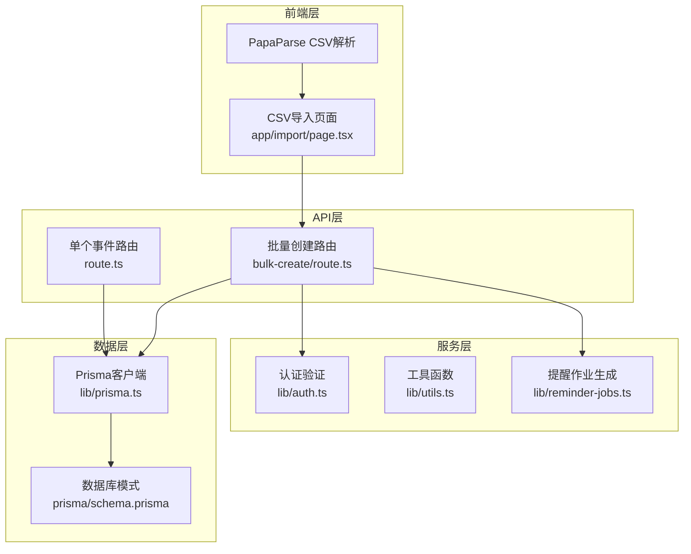
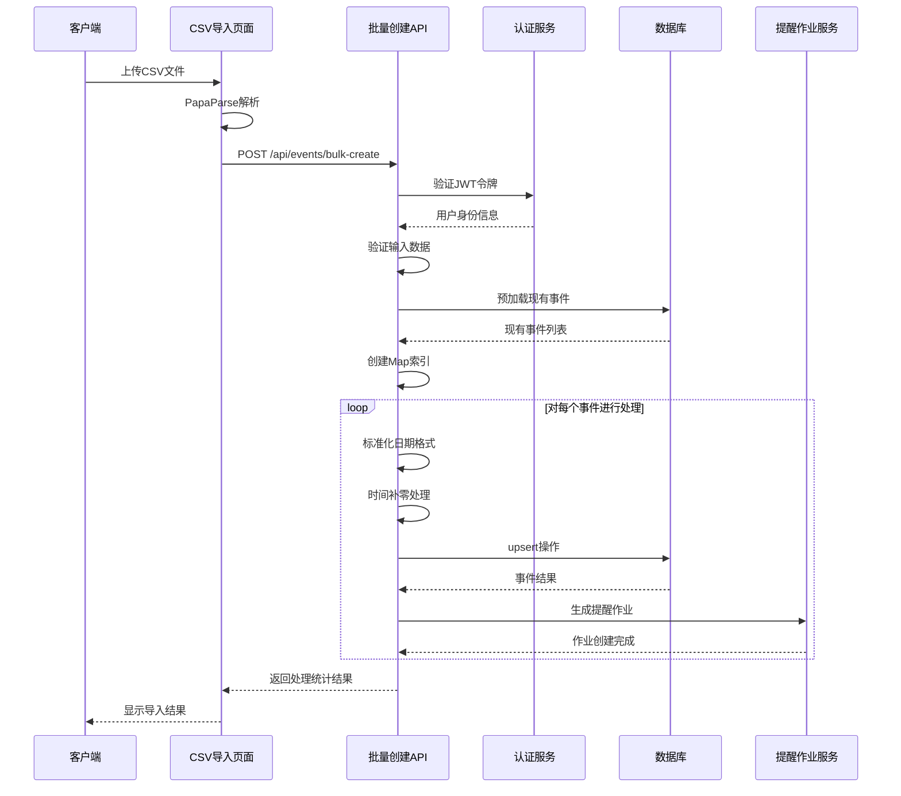
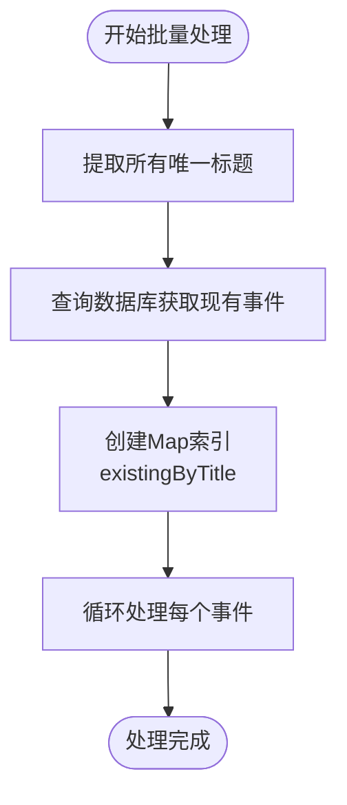
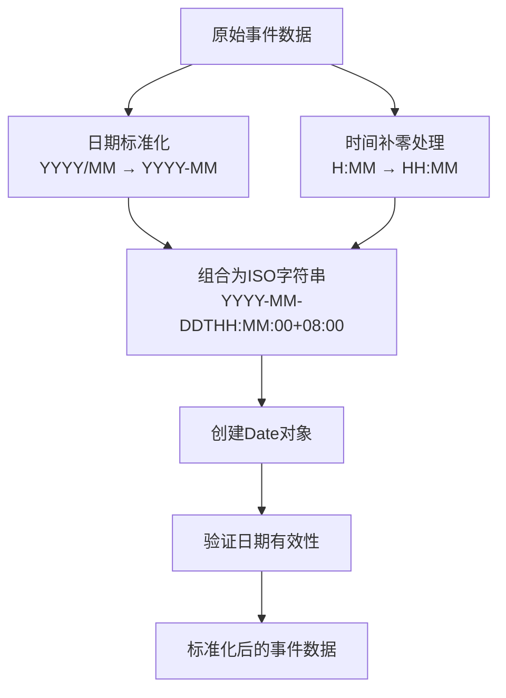
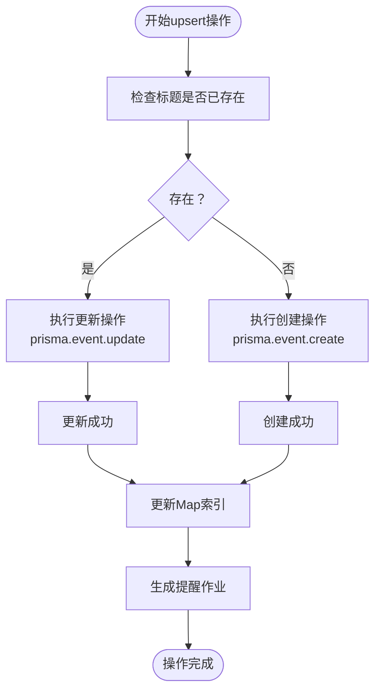
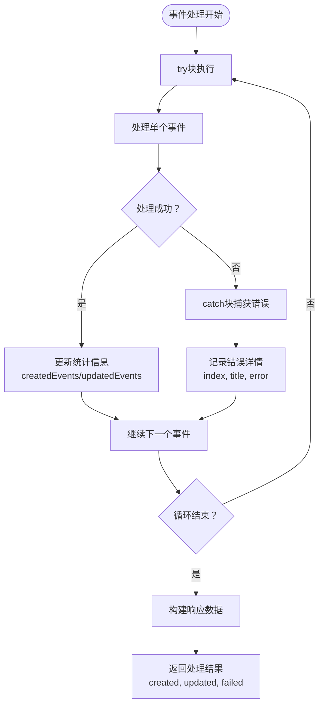
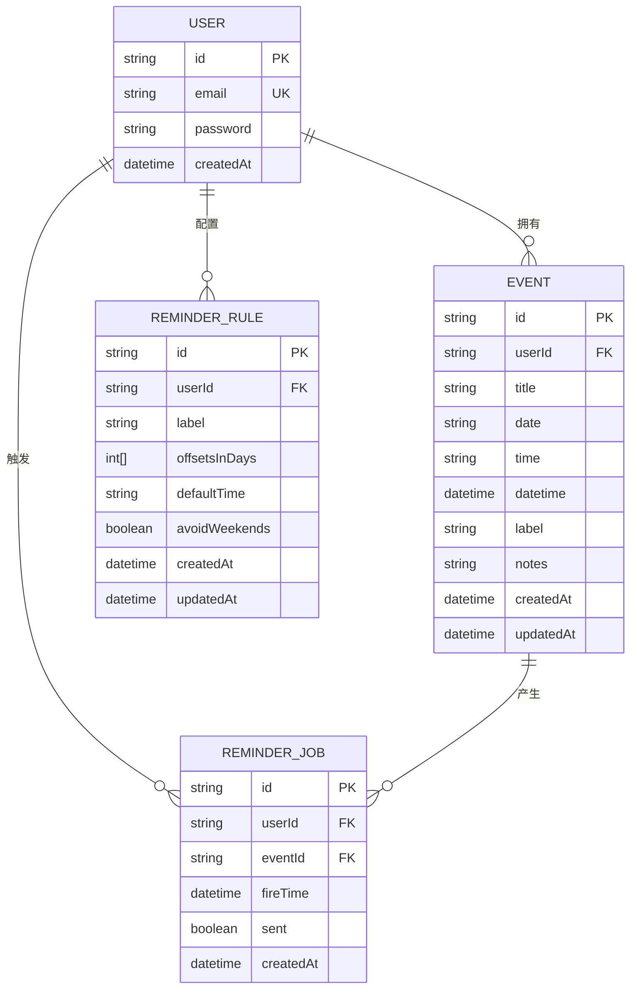
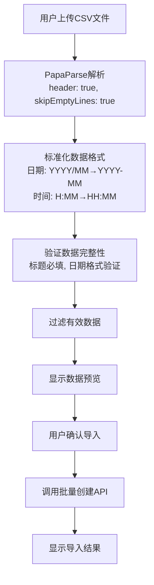
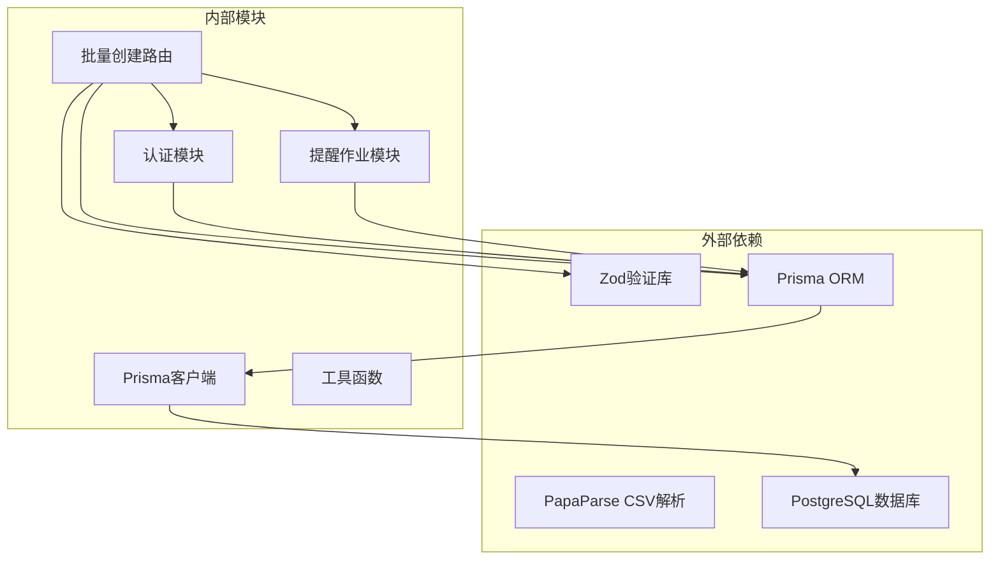

# 批量处理与事件操作

<cite>
**本文档引用的文件**
- [bulk-create/route.ts](file://app/api/events/bulk-create/route.ts)
- [route.ts](file://app/api/events/route.ts)
- [prisma.ts](file://lib/prisma.ts)
- [reminder-jobs.ts](file://lib/reminder-jobs.ts)
- [schema.prisma](file://prisma/schema.prisma)
- [page.tsx](file://app/import/page.tsx)
</cite>

## 目录
1. [简介](#简介)
2. [项目结构](#项目结构)
3. [核心组件](#核心组件)
4. [架构概览](#架构概览)
5. [详细组件分析](#详细组件分析)
6. [依赖关系分析](#依赖关系分析)
7. [性能考虑](#性能考虑)
8. [故障排除指南](#故障排除指南)
9. [结论](#结论)

## 简介

本文档深入分析了该任务管理应用中的批量事件创建功能。该功能允许用户通过CSV文件批量导入多个日程事件，并提供了高效的数据库操作和错误处理机制。系统采用预加载策略优化查询性能，实现了基于标题的upsert模式，并提供了完整的导入统计反馈。

## 项目结构

该批量处理功能涉及以下关键文件和模块：

**图表来源**
- [bulk-create/route.ts](file://app/api/events/bulk-create/route.ts#L1-L133)
- [page.tsx](file://app/import/page.tsx#L1-L218)
- [prisma.ts](file://lib/prisma.ts#L1-L20)

**章节来源**
- [bulk-create/route.ts](file://app/api/events/bulk-create/route.ts#L1-L133)
- [page.tsx](file://app/import/page.tsx#L1-L218)

## 核心组件

批量事件创建功能由以下核心组件构成：

### 数据验证组件
- **批量事件模式验证**：使用Zod验证器确保输入数据的完整性和格式正确性
- **字段约束**：标题必填、日期格式验证（YYYY-MM-DD或YYYY/MM-DD）、时间格式验证（HH:MM）

### 性能优化组件
- **预加载机制**：通过Map结构实现O(1)查找性能
- **批量数据库操作**：减少数据库往返次数

### 处理逻辑组件
- **日期标准化**：统一日期格式为YYYY-MM-DD
- **时间补零处理**：确保时间格式的一致性
- **upsert模式**：基于标题匹配的创建或更新操作

**章节来源**
- [bulk-create/route.ts](file://app/api/events/bulk-create/route.ts#L7-L17)
- [bulk-create/route.ts](file://app/api/events/bulk-create/route.ts#L41-L49)

## 架构概览

批量处理系统采用分层架构设计，从CSV解析到数据库操作形成完整的处理链路：

**图表来源**
- [bulk-create/route.ts](file://app/api/events/bulk-create/route.ts#L19-L127)
- [page.tsx](file://app/import/page.tsx#L76-L106)

## 详细组件分析

### 批量创建路由实现

#### 预加载机制（第41-49行）
系统通过预加载策略显著提升性能：

**图表来源**
- [bulk-create/route.ts](file://app/api/events/bulk-create/route.ts#L41-L49)

该机制的关键优势：
- **时间复杂度**：O(n)，其中n为事件数量
- **空间复杂度**：O(m)，其中m为唯一标题数量
- **查找性能**：从O(n)降低到O(1)

#### 日期格式标准化（第58-61行）
系统实现了严格的日期和时间格式标准化：

**图表来源**
- [bulk-create/route.ts](file://app/api/events/bulk-create/route.ts#L58-L66)

#### Upsert模式实现（第71-93行）
基于标题匹配的upsert操作流程：

**图表来源**
- [bulk-create/route.ts](file://app/api/events/bulk-create/route.ts#L71-L93)

#### 错误处理与统计机制（第112-127行）
系统提供了完善的错误处理和统计反馈：

**图表来源**
- [bulk-create/route.ts](file://app/api/events/bulk-create/route.ts#L112-L127)

**章节来源**
- [bulk-create/route.ts](file://app/api/events/bulk-create/route.ts#L41-L127)

### 数据模型与数据库交互

#### Prisma模型定义
系统使用Prisma ORM管理数据库操作：

**图表来源**
- [schema.prisma](file://prisma/schema.prisma#L28-L45)
- [schema.prisma](file://prisma/schema.prisma#L47-L60)
- [schema.prisma](file://prisma/schema.prisma#L62-L74)

#### 数据库连接配置
系统使用PostgreSQL作为数据库后端：

**章节来源**
- [prisma.ts](file://lib/prisma.ts#L1-L20)
- [schema.prisma](file://prisma/schema.prisma#L1-L86)

### 前端集成与CSV处理

#### CSV解析与验证
前端页面实现了完整的CSV处理流程：

**图表来源**
- [page.tsx](file://app/import/page.tsx#L35-L74)
- [page.tsx](file://app/import/page.tsx#L76-L106)

**章节来源**
- [page.tsx](file://app/import/page.tsx#L1-L218)

## 依赖关系分析

批量处理系统的依赖关系如下：

**图表来源**
- [bulk-create/route.ts](file://app/api/events/bulk-create/route.ts#L1-L5)
- [prisma.ts](file://lib/prisma.ts#L1-L20)

**章节来源**
- [bulk-create/route.ts](file://app/api/events/bulk-create/route.ts#L1-L5)
- [prisma.ts](file://lib/prisma.ts#L1-L20)

## 性能考虑

### 查询优化策略
1. **预加载机制**：通过一次性查询所有现有事件，避免N+1查询问题
2. **Map索引**：使用哈希表实现O(1)查找性能
3. **批量操作**：减少数据库往返次数

### 内存使用优化
- **唯一标题集合**：使用Set去重，减少内存占用
- **增量处理**：逐个事件处理，避免大量数据同时驻留内存

### 并发处理
- **串行处理**：当前实现为串行处理，确保数据一致性
- **错误隔离**：单个事件错误不影响其他事件处理

## 故障排除指南

### 常见错误类型及解决方案

#### 认证失败
**症状**：返回401 Unauthorized
**原因**：缺少或无效的JWT令牌
**解决方案**：重新登录获取有效令牌

#### 输入数据验证失败
**症状**：返回400 Bad Request，包含错误详情
**常见原因**：
- 缺少必需字段（标题、日期）
- 日期格式不正确（非YYYY-MM-DD或YYYY/MM-DD）
- 时间格式不正确（非HH:MM）

#### 数据库操作失败
**症状**：返回500 Internal Server Error
**可能原因**：
- 数据库连接异常
- 索引冲突（重复标题）
- 字段长度超限

#### 导入统计异常
**症状**：created + updated ≠ total
**原因**：部分事件处理失败但仍有成功处理

**章节来源**
- [bulk-create/route.ts](file://app/api/events/bulk-create/route.ts#L20-L36)
- [bulk-create/route.ts](file://app/api/events/bulk-create/route.ts#L128-L131)

## 结论

该批量事件创建功能展现了优秀的工程实践：

### 技术亮点
1. **性能优化**：通过预加载和Map索引实现O(1)查找性能
2. **数据一致性**：upsert模式确保数据完整性
3. **错误处理**：完善的错误捕获和统计机制
4. **用户体验**：提供详细的导入结果反馈

### 架构优势
- **模块化设计**：清晰的职责分离
- **可扩展性**：易于添加新的验证规则和处理逻辑
- **可维护性**：代码结构清晰，注释完整

### 改进建议
1. **并发处理**：考虑实现批量数据库操作以进一步提升性能
2. **事务支持**：为整个批量操作提供事务保证
3. **进度反馈**：为大型批量导入提供进度指示
4. **重试机制**：实现失败操作的自动重试

该功能为用户提供了高效、可靠的批量事件导入体验，是现代Web应用中批量数据处理的优秀实践案例。