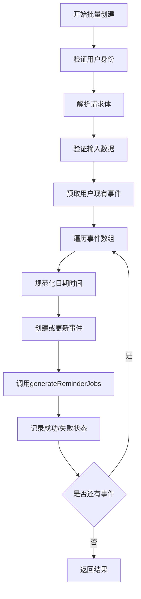
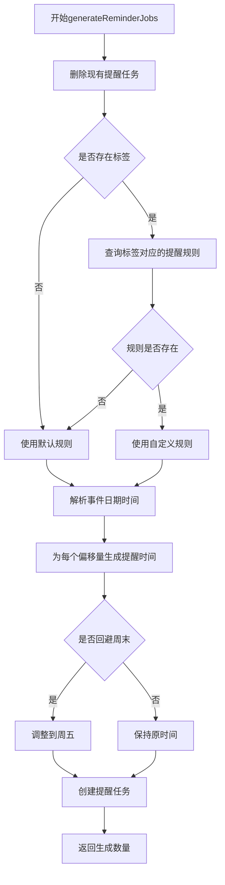
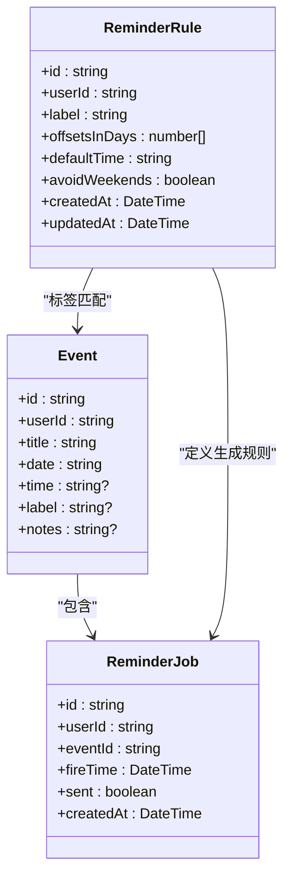
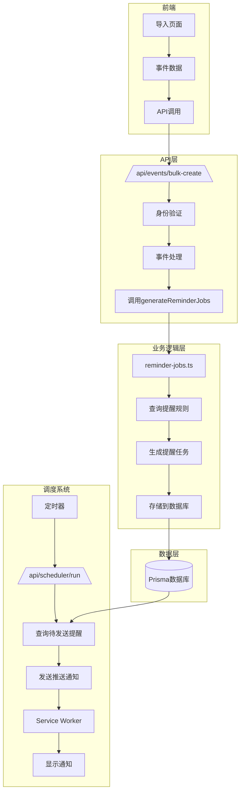
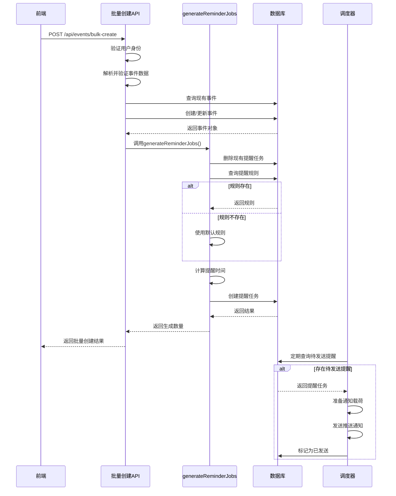
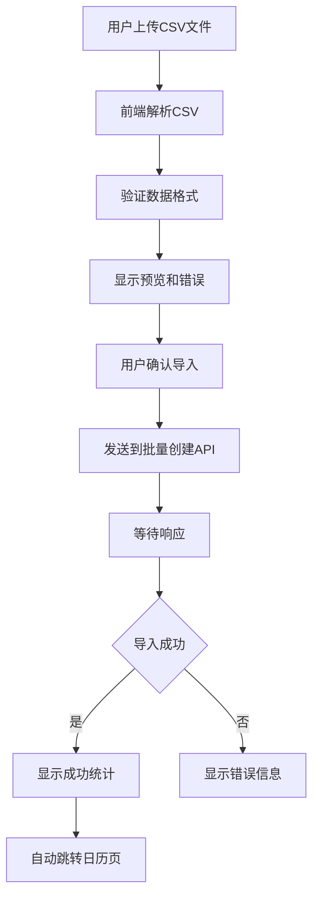
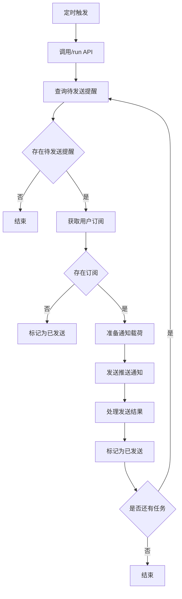
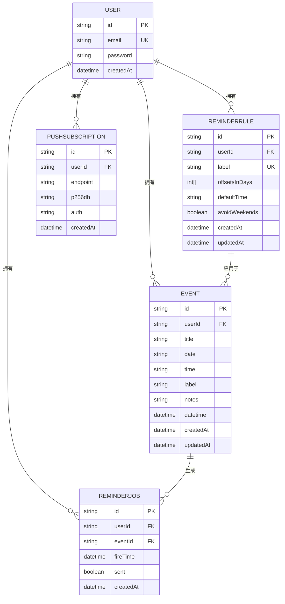

# 提醒任务生成集成

<cite>
**本文档引用的文件**   
- [bulk-create/route.ts](file://app/api/events/bulk-create/route.ts)
- [reminder-jobs.ts](file://lib/reminder-jobs.ts)
- [events/route.ts](file://app/api/events/route.ts)
- [scheduler.ts](file://lib/scheduler.ts)
- [schema.prisma](file://prisma/schema.prisma)
- [route.ts](file://app/api/reminder-rules/route.ts)
- [ReminderRuleDialog.tsx](file://components/ReminderRuleDialog.tsx)
- [page.tsx](file://app/import/page.tsx)
- [sw.js](file://public/sw.js)
- [SCHEDULER_SETUP.md](file://docs/SCHEDULER_SETUP.md)
</cite>

## 目录
1. [简介](#简介)
2. [批量创建事件流程](#批量创建事件流程)
3. [提醒任务生成机制](#提醒任务生成机制)
4. [提醒规则与事件关联](#提醒规则与事件关联)
5. [系统架构与数据流](#系统架构与数据流)
6. [状态流转与执行流程](#状态流转与执行流程)
7. [前端集成与用户交互](#前端集成与用户交互)
8. [调度器与通知系统](#调度器与通知系统)
9. [数据库模型设计](#数据库模型设计)
10. [结论](#结论)

## 简介
本文档详细说明了在批量创建或更新事件后，如何通过调用 `generateReminderJobs` 函数实现提醒任务的自动生成。重点阐述了该集成机制如何确保新导入的事件立即关联其对应的提醒规则，从而实现“导入即提醒”的用户体验。文档涵盖了从事件创建、提醒规则匹配、提醒任务生成到最终推送通知的完整流程。

## 批量创建事件流程
当用户通过CSV文件批量导入事件时，系统通过 `/api/events/bulk-create` 接口处理请求。该接口接收包含多个事件对象的数组，对每个事件进行验证、创建或更新，并在每个事件成功处理后立即调用 `generateReminderJobs` 函数。

**Diagram sources**
- [bulk-create/route.ts](file://app/api/events/bulk-create/route.ts#L1-L132)

**Section sources**
- [bulk-create/route.ts](file://app/api/events/bulk-create/route.ts#L1-L132)
- [page.tsx](file://app/import/page.tsx#L1-L106)

## 提醒任务生成机制
`generateReminderJobs` 函数是提醒系统的核心，负责为每个事件生成相应的提醒任务。该函数在事件创建或更新后被调用，接收事件的关键参数并根据用户的提醒规则生成提醒任务。

### 函数调用参数
- **id**: 事件的唯一标识符
- **userId**: 事件所属用户的ID
- **date**: 事件日期（YYYY-MM-DD格式）
- **time**: 事件时间（HH:mm格式，可选）
- **label**: 事件标签（用于匹配提醒规则）

### 函数执行流程

**Diagram sources**
- [reminder-jobs.ts](file://lib/reminder-jobs.ts#L1-L72)

**Section sources**
- [reminder-jobs.ts](file://lib/reminder-jobs.ts#L1-L72)
- [bulk-create/route.ts](file://app/api/events/bulk-create/route.ts#L98-L105)

## 提醒规则与事件关联
系统通过标签（label）将事件与提醒规则关联。当事件带有标签时，系统会查找用户针对该标签设置的提醒规则；若无匹配规则，则使用默认规则。

### 提醒规则模型

**Diagram sources**
- [schema.prisma](file://prisma/schema.prisma#L47-L60)
- [reminder-jobs.ts](file://lib/reminder-jobs.ts#L3-L9)

**Section sources**
- [schema.prisma](file://prisma/schema.prisma#L47-L60)
- [route.ts](file://app/api/reminder-rules/route.ts#L1-L109)
- [ReminderRuleDialog.tsx](file://components/ReminderRuleDialog.tsx#L1-L173)

## 系统架构与数据流
整个提醒系统由多个组件协同工作，形成完整的数据流和控制流。

**Diagram sources**
- [bulk-create/route.ts](file://app/api/events/bulk-create/route.ts#L1-L132)
- [reminder-jobs.ts](file://lib/reminder-jobs.ts#L1-L109)
- [scheduler.ts](file://lib/scheduler.ts#L1-L86)
- [sw.js](file://public/sw.js#L1-L78)

## 状态流转与执行流程
当事件被创建或更新时，系统经历一系列状态流转以确保提醒任务正确生成和执行。

**Diagram sources**
- [bulk-create/route.ts](file://app/api/events/bulk-create/route.ts#L98-L105)
- [reminder-jobs.ts](file://lib/reminder-jobs.ts#L15-L72)
- [scheduler.ts](file://lib/scheduler.ts#L8-L86)

## 前端集成与用户交互
用户通过导入页面上传CSV文件，系统处理后自动为每个事件生成提醒任务。

### 导入流程

**Section sources**
- [page.tsx](file://app/import/page.tsx#L1-L106)
- [bulk-create/route.ts](file://app/api/events/bulk-create/route.ts#L1-L132)

## 调度器与通知系统
系统通过调度器定期检查并发送待处理的提醒通知。

### 调度器工作流程

**Diagram sources**
- [scheduler.ts](file://lib/scheduler.ts#L8-L86)
- [run/route.ts](file://app/api/scheduler/run/route.ts#L1-L37)
- [sw.js](file://public/sw.js#L1-L78)

## 数据库模型设计
系统使用Prisma定义了清晰的数据模型，确保事件、提醒规则和提醒任务之间的关系正确。

**Diagram sources**
- [schema.prisma](file://prisma/schema.prisma#L16-L86)

## 结论
本集成文档详细说明了批量创建事件后提醒任务生成的完整流程。通过在事件创建或更新后立即调用 `generateReminderJobs` 函数，系统确保了新导入的事件能够立即关联其对应的提醒规则，实现了“导入即提醒”的用户体验。该机制通过清晰的函数调用、合理的数据模型设计和可靠的调度系统，为用户提供及时、准确的提醒服务。