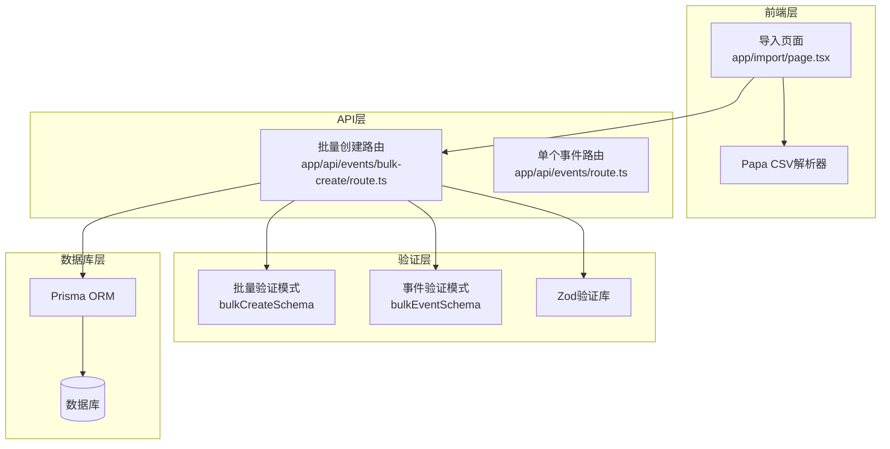
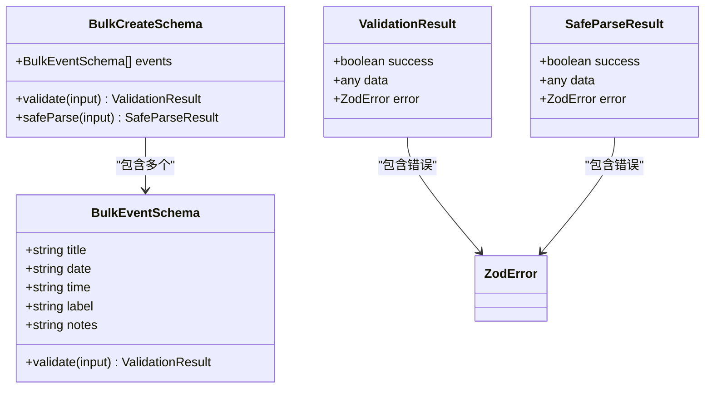
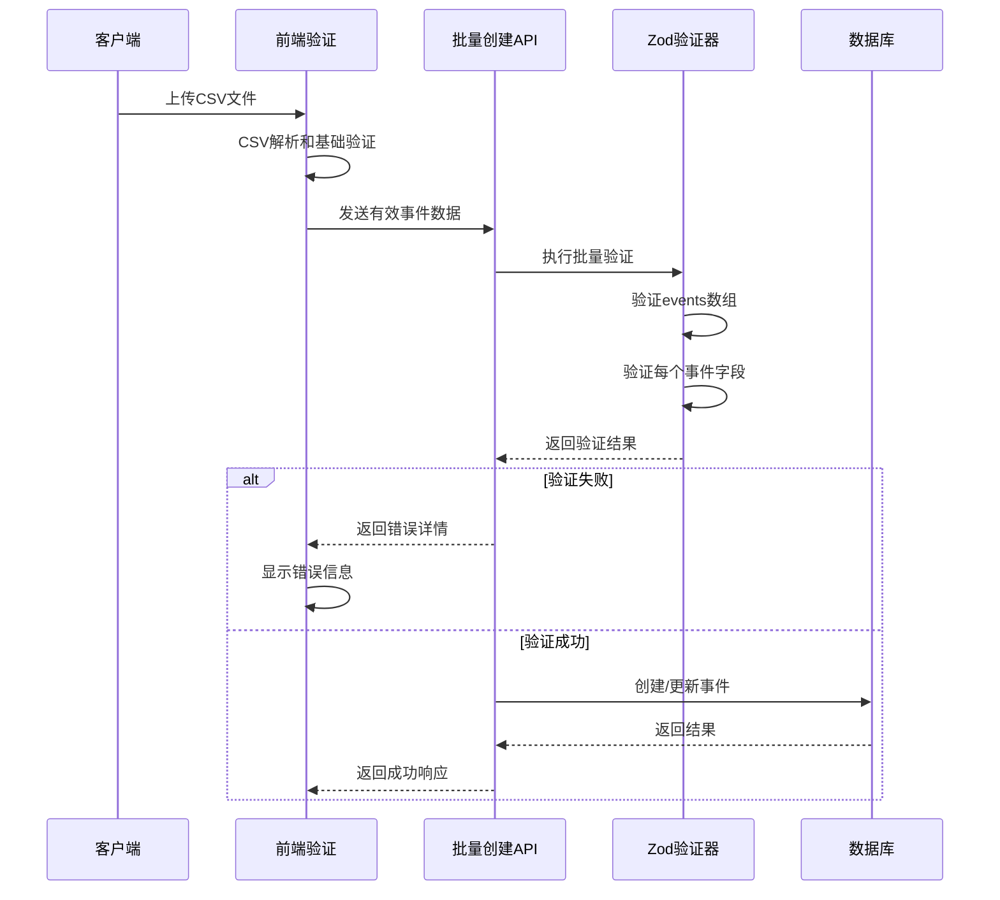
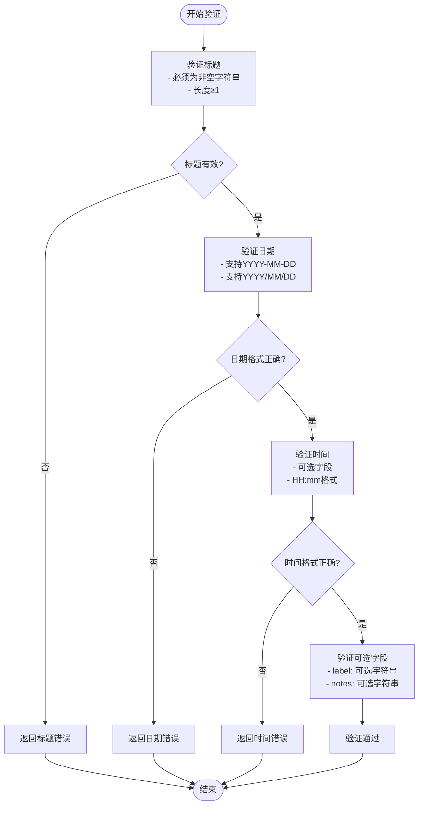
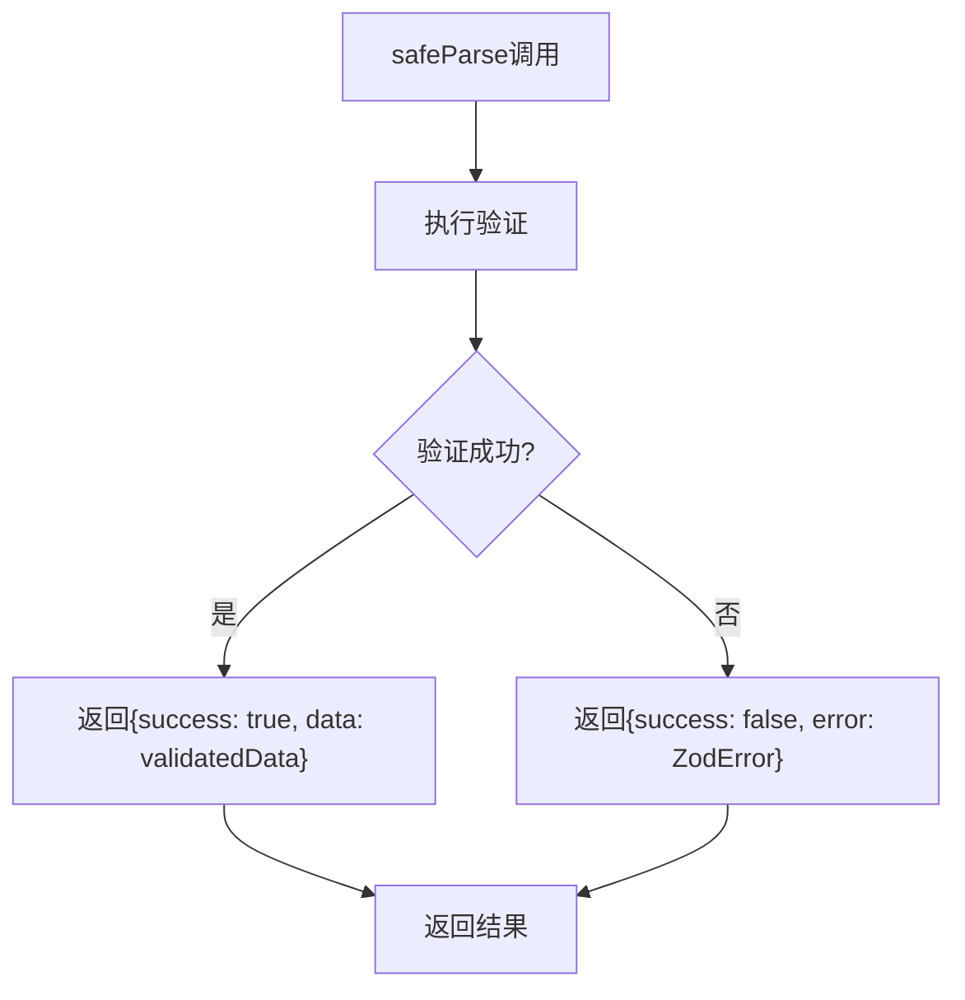
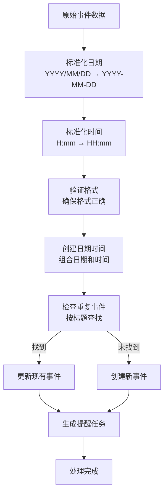
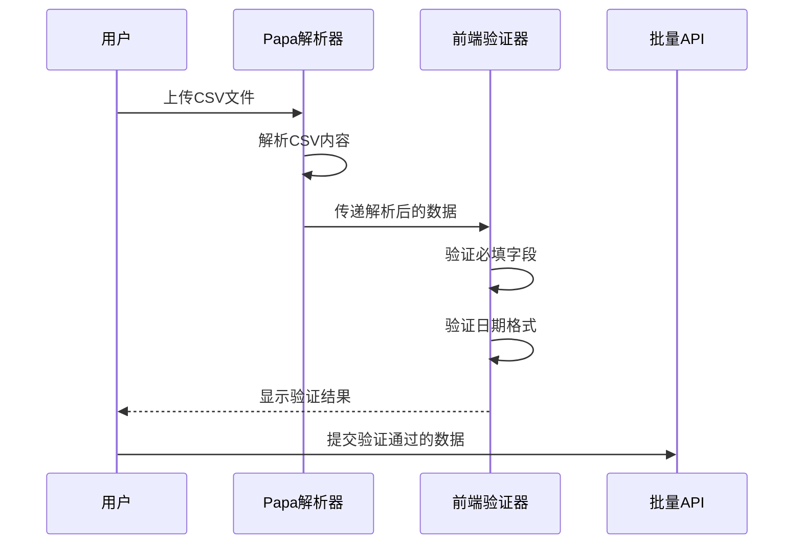
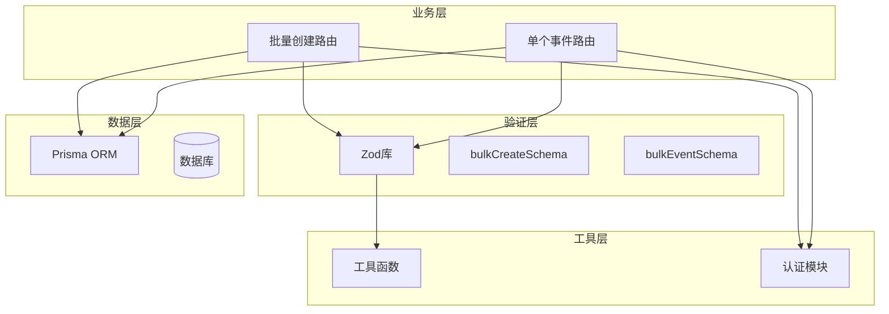

# 请求验证与数据校验

<cite>
**本文档引用的文件**
- [app/api/events/bulk-create/route.ts](file://app/api/events/bulk-create/route.ts)
- [app/api/events/route.ts](file://app/api/events/route.ts)
- [app/import/page.tsx](file://app/import/page.tsx)
</cite>

## 目录
1. [简介](#简介)
2. [项目结构](#项目结构)
3. [核心组件](#核心组件)
4. [架构概览](#架构概览)
5. [详细组件分析](#详细组件分析)
6. [依赖关系分析](#依赖关系分析)
7. [性能考虑](#性能考虑)
8. [故障排除指南](#故障排除指南)
9. [结论](#结论)

## 简介

本文档深入分析了批量创建事件接口的请求验证机制，重点解析Zod校验模式的设计与实现。该系统采用双层验证策略：前端CSV解析验证和后端API验证，确保数据完整性并提供清晰的错误反馈。

系统的核心验证逻辑位于批量创建事件API中，通过Zod库实现严格的输入验证，包括事件数组的嵌套校验、字段格式约束以及错误处理机制。

## 项目结构

批量创建事件验证机制涉及以下关键文件：



**图表来源**
- [app/import/page.tsx](file://app/import/page.tsx#L1-L218)
- [app/api/events/bulk-create/route.ts](file://app/api/events/bulk-create/route.ts#L1-L133)
- [app/api/events/route.ts](file://app/api/events/route.ts#L1-L200)

**章节来源**
- [app/import/page.tsx](file://app/import/page.tsx#L1-L218)
- [app/api/events/bulk-create/route.ts](file://app/api/events/bulk-create/route.ts#L1-L133)
- [app/api/events/route.ts](file://app/api/events/route.ts#L1-L200)

## 核心组件

### 批量验证模式 (bulkCreateSchema)

批量验证模式是整个验证系统的核心，负责验证包含多个事件对象的数组结构：



**图表来源**
- [app/api/events/bulk-create/route.ts](file://app/api/events/bulk-create/route.ts#L7-L17)

### 字段验证规则

每个事件对象都遵循严格的字段验证规则：

| 字段名 | 类型 | 验证规则 | 可选性 | 示例 |
|--------|------|----------|--------|------|
| title | string | 非空字符串，长度≥1 | 必填 | "会议" |
| date | string | YYYY-MM-DD或YYYY/MM/DD格式 | 必填 | "2024-01-15" |
| time | string | HH:mm格式，可选 | 可选 | "14:30" |
| label | string | 可选字符串 | 可选 | "工作" |
| notes | string | 可选字符串 | 可选 | "重要会议" |

**章节来源**
- [app/api/events/bulk-create/route.ts](file://app/api/events/bulk-create/route.ts#L7-L17)

## 架构概览

批量创建事件的验证流程采用分层架构设计：



**图表来源**
- [app/import/page.tsx](file://app/import/page.tsx#L35-L74)
- [app/api/events/bulk-create/route.ts](file://app/api/events/bulk-create/route.ts#L19-L36)

## 详细组件分析

### Zod验证模式设计

#### bulkEventSchema详细分析

bulkEventSchema定义了单个事件对象的完整验证规则：



**图表来源**
- [app/api/events/bulk-create/route.ts](file://app/api/events/bulk-create/route.ts#L7-L13)

#### bulkCreateSchema详细分析

bulkCreateSchema作为顶层验证器，确保整个请求体结构正确：

```mermaid
classDiagram
class BulkCreateSchema {
+validate(input) ValidationResult
+safeParse(input) SafeParseResult
+结构 : {
events : BulkEventSchema[]
}
}
class BulkEventSchema {
+validate(input) ValidationResult
+结构 : {
title : string
date : string
time : string?
label : string?
notes : string?
}
}
class ValidationResult {
+boolean success
+any data
+ZodError error
}
class SafeParseResult {
+boolean success
+any data
+ZodError error
}
BulkCreateSchema --> BulkEventSchema : "events数组"
ValidationResult --> ZodError : "包含错误信息"
SafeParseResult --> ZodError : "包含错误信息"
```

**图表来源**
- [app/api/events/bulk-create/route.ts](file://app/api/events/bulk-create/route.ts#L15-L17)

### safeParse()方法使用详解

safeParse()方法是Zod验证的核心，提供了安全的验证方式：

#### 方法行为分析



**图表来源**
- [app/api/events/bulk-create/route.ts](file://app/api/events/bulk-create/route.ts#L32-L36)

#### 错误处理机制

当验证失败时，系统返回详细的错误信息：

| 错误类型 | 结构 | 描述 |
|----------|------|------|
| 字段缺失 | `{ field: "title", message: "必须提供标题" }` | 必填字段未提供 |
| 格式错误 | `{ field: "date", message: "日期格式不正确" }` | 字段格式不符合要求 |
| 类型错误 | `{ field: "time", message: "时间必须为字符串" }` | 字段类型不正确 |
| 数组错误 | `{ field: "events[2].title", message: "第三个事件标题无效" }` | 数组中特定元素错误 |

**章节来源**
- [app/api/events/bulk-create/route.ts](file://app/api/events/bulk-create/route.ts#L32-L36)

### 数据完整性保障机制

#### 模式设计确保的数据完整性

基于代码第7-17行的模式设计，系统通过以下机制确保数据完整性：

1. **强制性字段验证**
   - title字段必须为非空字符串，确保事件名称存在
   - date字段必须符合YYYY-MM-DD或YYYY/MM/DD格式，防止日期解析错误

2. **格式标准化**
   - 自动将斜杠日期转换为连字符格式
   - 时间格式标准化，单数字小时前补零

3. **可选字段处理**
   - time、label、notes字段可选，但一旦提供必须符合格式要求
   - 空值自动转换为null，保持数据库一致性

#### 数据处理流程



**图表来源**
- [app/api/events/bulk-create/route.ts](file://app/api/events/bulk-create/route.ts#L56-L96)

**章节来源**
- [app/api/events/bulk-create/route.ts](file://app/api/events/bulk-create/route.ts#L56-L96)

### 前端验证集成

前端导入页面实现了双重验证机制：

#### CSV解析验证

前端使用Papa Parse库进行CSV解析，并实施基础验证：



**图表来源**
- [app/import/page.tsx](file://app/import/page.tsx#L35-L74)

#### 错误显示机制

前端通过颜色编码显示验证状态：
- 绿色：验证通过 ✓ 校验通过
- 红色：验证失败 缺少标题/日期格式错误

**章节来源**
- [app/import/page.tsx](file://app/import/page.tsx#L167-L179)

## 依赖关系分析

### 组件耦合度分析



**图表来源**
- [app/api/events/bulk-create/route.ts](file://app/api/events/bulk-create/route.ts#L1-L5)
- [app/api/events/route.ts](file://app/api/events/route.ts#L1-L5)

### 外部依赖关系

系统主要依赖以下外部库：

| 依赖库 | 版本 | 用途 | 重要性 |
|--------|------|------|--------|
| zod | 最新版本 | 数据验证 | 核心依赖 |
| papaparse | 最新版本 | CSV解析 | 前端依赖 |
| next | 最新版本 | Web框架 | 运行时依赖 |
| prisma | 最新版本 | 数据库ORM | 核心依赖 |

**章节来源**
- [app/api/events/bulk-create/route.ts](file://app/api/events/bulk-create/route.ts#L1-L5)
- [app/import/page.tsx](file://app/import/page.tsx#L5)

## 性能考虑

### 验证性能优化

1. **批量验证效率**
   - 使用Zod的safeParse方法避免抛出异常，提高性能
   - 事件数组一次性验证，减少多次验证开销

2. **数据库查询优化**
   - 预查询用户现有的事件标题，避免重复数据库查询
   - 使用IN查询批量获取重复事件

3. **内存管理**
   - 使用Set去重标题，减少内存占用
   - 及时清理错误处理中的临时变量

### 错误处理性能

系统采用渐进式错误处理：
- 单个事件失败不影响其他事件处理
- 错误信息包含事件索引，便于定位问题

## 故障排除指南

### 常见验证错误及解决方案

#### 标题验证错误
- **错误信息**: "必须提供标题" 或 "标题不能为空"
- **可能原因**: CSV中缺少标题列或为空值
- **解决方案**: 确保CSV包含标题列且所有行都有有效标题

#### 日期格式错误
- **错误信息**: "日期格式不正确"
- **可能原因**: 日期格式不是YYYY-MM-DD或YYYY/MM/DD
- **解决方案**: 将日期格式统一为YYYY-MM-DD或YYYY/MM/DD

#### 时间格式错误
- **错误信息**: "时间格式不正确"
- **可能原因**: 时间格式不是HH:mm或包含无效字符
- **解决方案**: 确保时间格式为HH:mm，如09:30

#### 重复事件处理

系统会自动处理重复事件：
- 同一标题的事件会被识别为更新操作
- 后导入的同标题事件会覆盖之前的数据

**章节来源**
- [app/api/events/bulk-create/route.ts](file://app/api/events/bulk-create/route.ts#L112-L119)

### 调试建议

1. **启用详细日志**
   - 在开发环境中启用Zod的详细错误输出
   - 记录验证失败的具体字段和原因

2. **分步调试**
   - 先验证单个事件，再测试批量导入
   - 使用最小化数据集进行测试

3. **错误定位**
   - 利用错误数组中的索引定位具体问题行
   - 检查CSV文件中的对应行数据

## 结论

批量创建事件接口的请求验证机制通过精心设计的Zod验证模式和双层验证策略，确保了数据的完整性和系统的稳定性。该系统的主要优势包括：

1. **严格的数据验证**: 通过Zod实现精确的字段验证和格式检查
2. **友好的错误反馈**: 提供详细的错误信息帮助用户快速定位问题
3. **高效的批量处理**: 支持大量事件的一次性导入和处理
4. **完善的重复处理**: 自动识别和处理重复事件，避免数据冲突

该验证机制为后续的数据处理和存储奠定了坚实的基础，确保了整个系统的可靠性和用户体验。