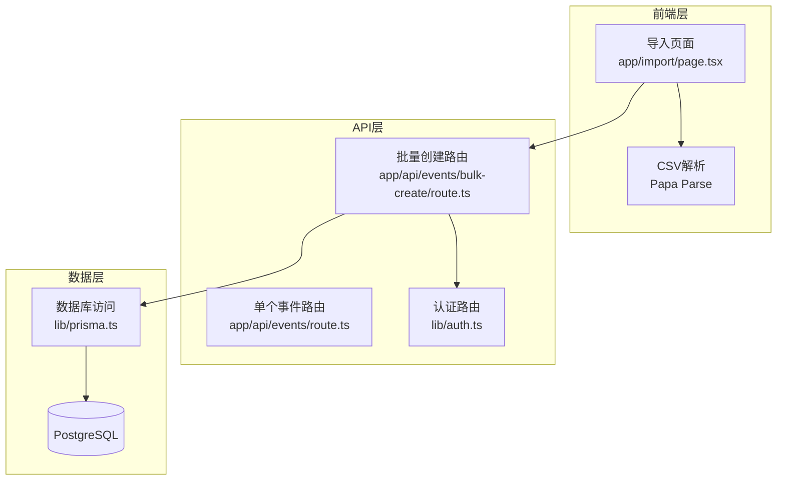
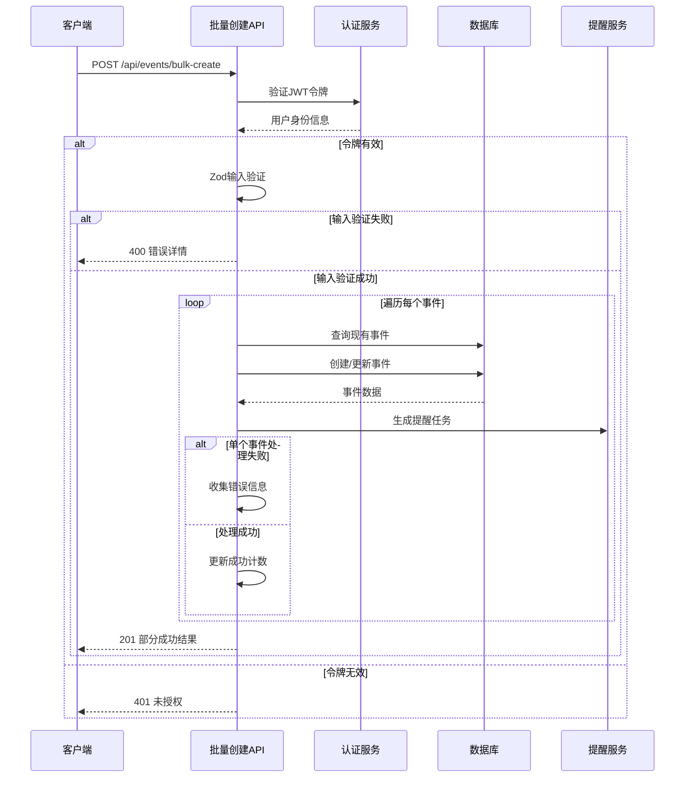
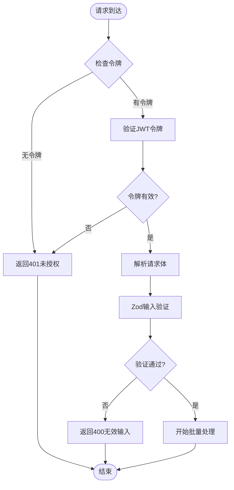
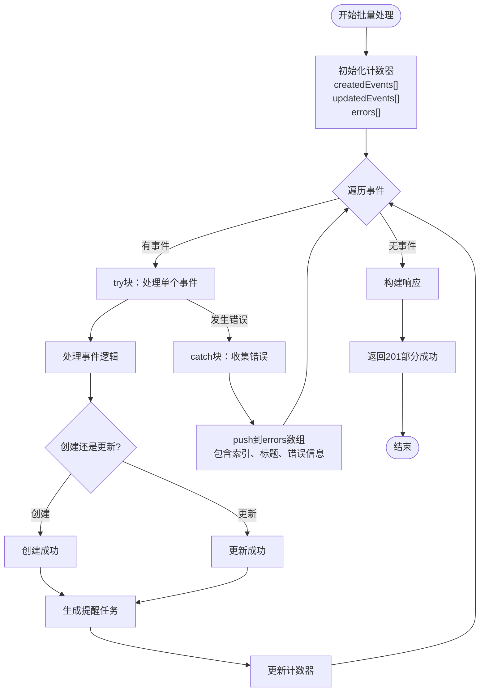
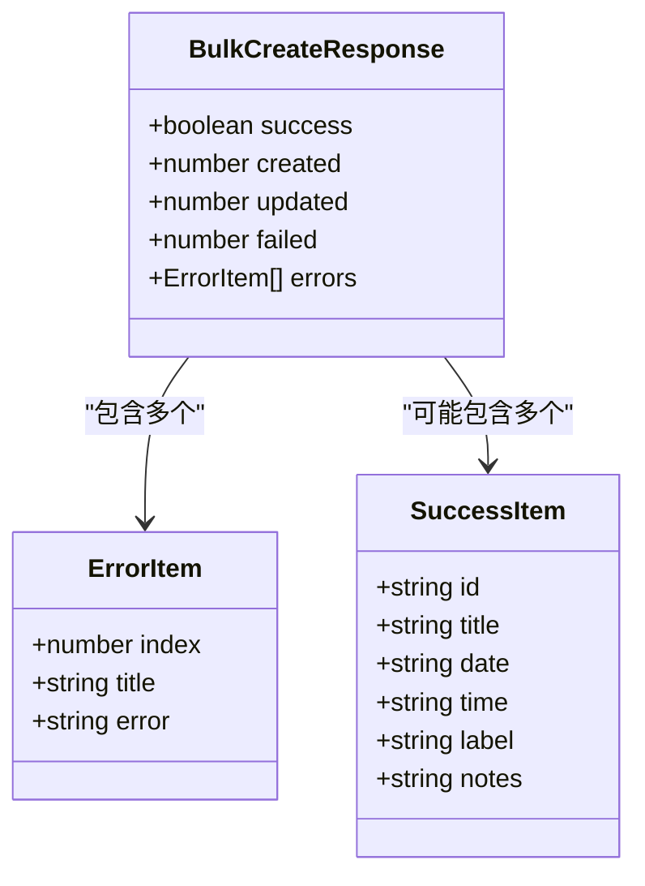
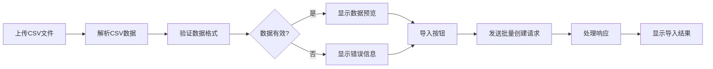
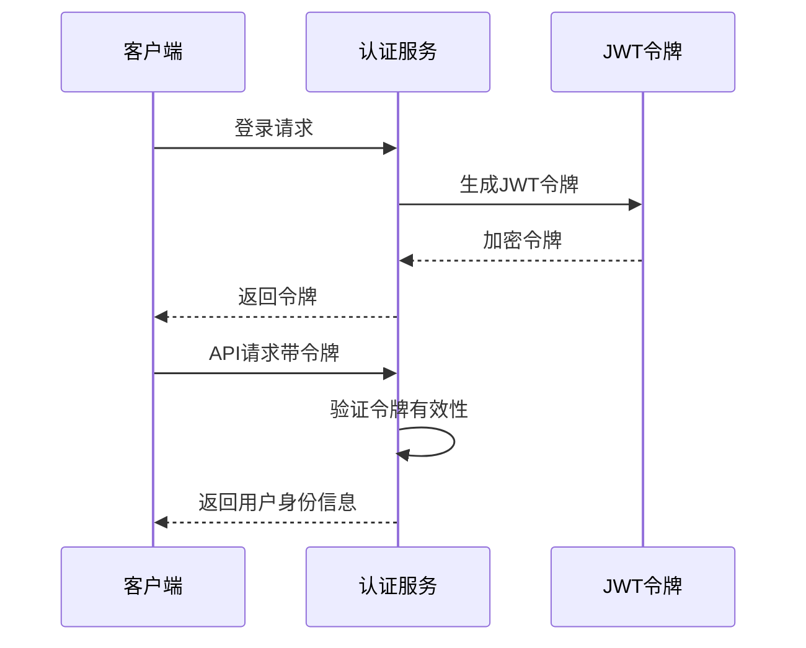
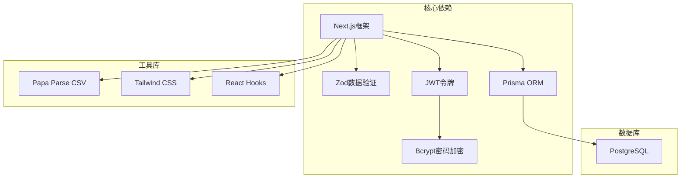
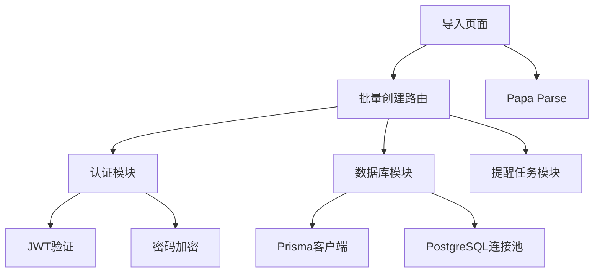

# 错误处理与响应机制

<cite>
**本文档引用的文件**
- [app/api/events/bulk-create/route.ts](file://app/api/events/bulk-create/route.ts)
- [lib/auth.ts](file://lib/auth.ts)
- [lib/prisma.ts](file://lib/prisma.ts)
- [app/import/page.tsx](file://app/import/page.tsx)
- [app/api/events/route.ts](file://app/api/events/route.ts)
</cite>

## 目录
1. [简介](#简介)
2. [项目结构](#项目结构)
3. [核心组件](#核心组件)
4. [架构概览](#架构概览)
5. [详细组件分析](#详细组件分析)
6. [依赖关系分析](#依赖关系分析)
7. [性能考虑](#性能考虑)
8. [故障排除指南](#故障排除指南)
9. [结论](#结论)

## 简介

本文档详细分析了批量创建事件接口的错误处理策略，重点关注三层错误分类：认证错误（401未授权）、输入验证错误（400无效输入）和内部服务器错误（500）。特别阐述了细粒度的错误隔离机制——单个事件处理失败不会中断整个批量操作，错误信息被收集到errors数组中，包含失败索引、事件标题和错误消息。同时说明了最终响应如何包含部分成功的结果（created和updated计数）与详细的失败列表，使客户端能够精准反馈给用户哪几行CSV导入失败。

## 项目结构

该系统采用Next.js全栈架构，主要涉及以下关键模块：

**图表来源**
- [app/api/events/bulk-create/route.ts](file://app/api/events/bulk-create/route.ts#L1-L133)
- [app/import/page.tsx](file://app/import/page.tsx#L1-L218)
- [lib/auth.ts](file://lib/auth.ts#L1-L30)
- [lib/prisma.ts](file://lib/prisma.ts#L1-L20)

**章节来源**
- [app/api/events/bulk-create/route.ts](file://app/api/events/bulk-create/route.ts#L1-L133)
- [app/import/page.tsx](file://app/import/page.tsx#L1-L218)

## 核心组件

### 批量创建事件API

批量创建事件接口实现了完整的错误处理策略，包括：

- **认证层**：JWT令牌验证，确保用户身份
- **输入验证层**：Zod模式验证，确保数据格式正确
- **事务处理层**：逐条处理事件，实现细粒度错误隔离
- **响应聚合层**：返回部分成功结果和详细错误信息

### 错误处理策略

系统实现了三层错误处理机制：

1. **认证错误（401）**：令牌缺失或无效
2. **输入验证错误（400）**：数据格式不符合要求
3. **内部服务器错误（500）**：系统级异常

**章节来源**
- [app/api/events/bulk-create/route.ts](file://app/api/events/bulk-create/route.ts#L19-L36)
- [lib/auth.ts](file://lib/auth.ts#L22-L29)

## 架构概览

批量创建事件的完整处理流程如下：

**图表来源**
- [app/api/events/bulk-create/route.ts](file://app/api/events/bulk-create/route.ts#L19-L132)
- [lib/auth.ts](file://lib/auth.ts#L22-L29)

## 详细组件分析

### 批量创建路由实现

#### 认证处理

批量创建路由首先进行严格的认证检查：

**图表来源**
- [app/api/events/bulk-create/route.ts](file://app/api/events/bulk-create/route.ts#L19-L36)

#### 输入验证机制

系统使用Zod进行严格的数据验证：

- **标题验证**：非空字符串，最小长度1
- **日期验证**：支持YYYY-MM-DD或YYYY/MM/DD格式
- **时间验证**：HH:mm格式，可选参数
- **标签验证**：字符串，可选
- **备注验证**：字符串，可选

#### 细粒度错误隔离

批量处理的核心创新在于单个事件失败不影响整体操作：

**图表来源**
- [app/api/events/bulk-create/route.ts](file://app/api/events/bulk-create/route.ts#L56-L119)

#### 错误信息收集结构

每个错误对象包含以下关键信息：

| 字段名 | 类型 | 描述 | 示例值 |
|--------|------|------|--------|
| index | number | 事件在原始数组中的索引位置 | 5 |
| title | string | 事件标题 | "团队会议" |
| error | string | 具体错误消息 | "数据库连接失败" |

#### 响应结构设计

批量创建API返回统一的响应格式：

**图表来源**
- [app/api/events/bulk-create/route.ts](file://app/api/events/bulk-create/route.ts#L121-L127)

### 前端集成与错误展示

前端导入页面实现了完整的错误处理和用户反馈机制：

#### CSV数据预览

**图表来源**
- [app/import/page.tsx](file://app/import/page.tsx#L35-L106)

#### 用户界面反馈

前端通过视觉化的方式向用户展示导入状态：

- **绿色通过**：`✓ 校验通过` - 显示在通过验证的行
- **红色错误**：显示具体的错误信息 - 标记在验证失败的行
- **统计信息**：实时显示通过和未通过的数量

**章节来源**
- [app/import/page.tsx](file://app/import/page.tsx#L151-L202)

### 认证与安全机制

系统使用JWT进行用户认证，确保API调用的安全性：

**图表来源**
- [lib/auth.ts](file://lib/auth.ts#L14-L29)

**章节来源**
- [lib/auth.ts](file://lib/auth.ts#L1-L30)

## 依赖关系分析

### 外部依赖

系统依赖的关键外部库：

**图表来源**
- [app/api/events/bulk-create/route.ts](file://app/api/events/bulk-create/route.ts#L1-L5)
- [app/import/page.tsx](file://app/import/page.tsx#L1-L10)

### 内部模块依赖

**图表来源**
- [app/api/events/bulk-create/route.ts](file://app/api/events/bulk-create/route.ts#L1-L5)
- [app/import/page.tsx](file://app/import/page.tsx#L1-L10)

**章节来源**
- [lib/prisma.ts](file://lib/prisma.ts#L1-L20)

## 性能考虑

### 批量处理优化

系统在批量处理中采用了多项性能优化策略：

1. **预查询优化**：使用`Set`去重标题，减少数据库查询次数
2. **内存映射**：使用`Map`存储现有事件，O(1)查找复杂度
3. **事务隔离**：单个事件失败不影响其他事件处理
4. **资源清理**：及时更新内存映射，避免重复处理

### 错误处理性能

- **早期失败**：认证和输入验证在循环外进行，避免不必要的数据库操作
- **细粒度捕获**：仅捕获单个事件的错误，不影响整体性能
- **内存管理**：错误数组只包含必要信息，避免内存泄漏

## 故障排除指南

### 常见错误类型及解决方案

#### 认证相关错误

| 错误类型 | HTTP状态码 | 可能原因 | 解决方案 |
|----------|------------|----------|----------|
| 令牌缺失 | 401 | Cookie中无token | 检查登录状态，重新登录 |
| 令牌无效 | 401 | JWT签名验证失败 | 检查JWT密钥配置 |
| 用户不存在 | 401 | payload.userId为空 | 检查用户数据库记录 |

#### 输入验证错误

| 错误类型 | HTTP状态码 | 可能原因 | 解决方案 |
|----------|------------|----------|----------|
| 标题为空 | 400 | title字段缺失或为空 | 确保CSV包含标题列 |
| 日期格式错误 | 400 | 不符合YYYY-MM-DD格式 | 检查日期格式一致性 |
| 时间格式错误 | 400 | 不符合HH:mm格式 | 标准化时间格式 |

#### 数据库相关错误

| 错误类型 | HTTP状态码 | 可能原因 | 解决方案 |
|----------|------------|----------|----------|
| 连接超时 | 500 | 数据库连接池耗尽 | 检查数据库连接配置 |
| 约束冲突 | 500 | 唯一约束违反 | 检查重复数据 |
| 查询超时 | 500 | 复杂查询执行时间过长 | 优化查询索引 |

### 调试建议

1. **启用详细日志**：在开发环境中查看控制台输出
2. **检查网络请求**：使用浏览器开发者工具监控API调用
3. **验证数据格式**：确保CSV文件格式符合要求
4. **测试小批量数据**：先导入少量数据验证流程

**章节来源**
- [app/api/events/bulk-create/route.ts](file://app/api/events/bulk-create/route.ts#L128-L131)

## 结论

批量创建事件接口的错误处理策略体现了现代Web应用的最佳实践：

### 主要优势

1. **细粒度错误隔离**：单个事件失败不影响整体操作，提高了系统的鲁棒性
2. **完整的错误反馈**：客户端能够精确知道哪些数据导入失败以及失败原因
3. **优雅的降级处理**：即使部分失败，系统仍能返回有价值的部分成功结果
4. **清晰的错误分类**：明确区分认证、验证和系统级错误

### 技术亮点

- **循环内try-catch**：实现了真正的细粒度错误处理
- **统一响应格式**：提供了结构化的成功和失败信息
- **前后端协作**：前端负责数据预验证，后端负责业务逻辑验证
- **性能优化**：通过预查询和内存映射提升处理效率

### 改进建议

1. **增加重试机制**：对于临时性错误（如数据库连接超时）可以考虑重试
2. **增强错误分类**：可以进一步细分错误类型，提供更精确的错误信息
3. **添加进度反馈**：对于大量数据的批量处理，可以提供进度指示
4. **优化错误展示**：前端可以提供更友好的错误提示和修复建议

这个错误处理策略为类似的数据批量导入场景提供了优秀的参考实现，既保证了系统的稳定性，又为用户提供了清晰的反馈信息。