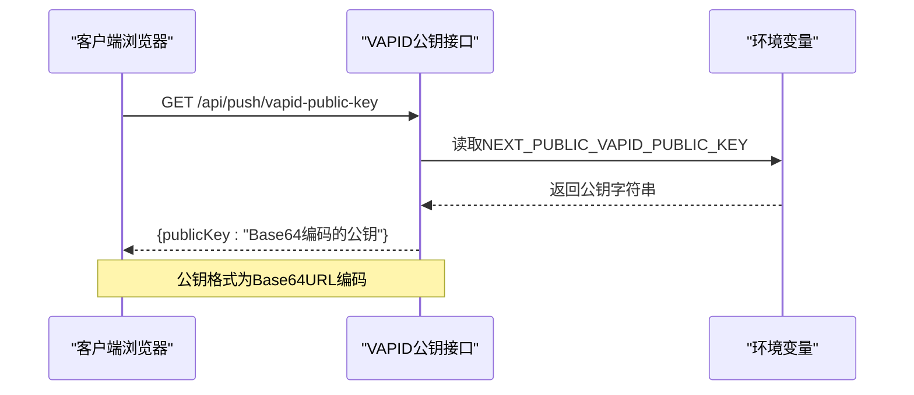
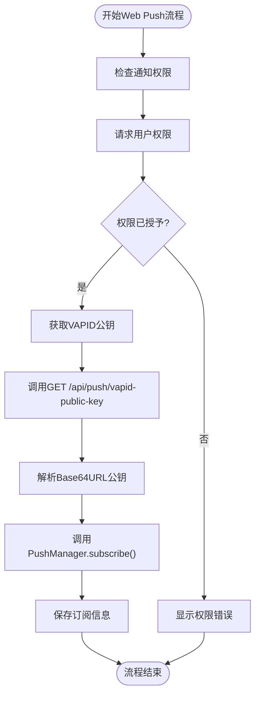
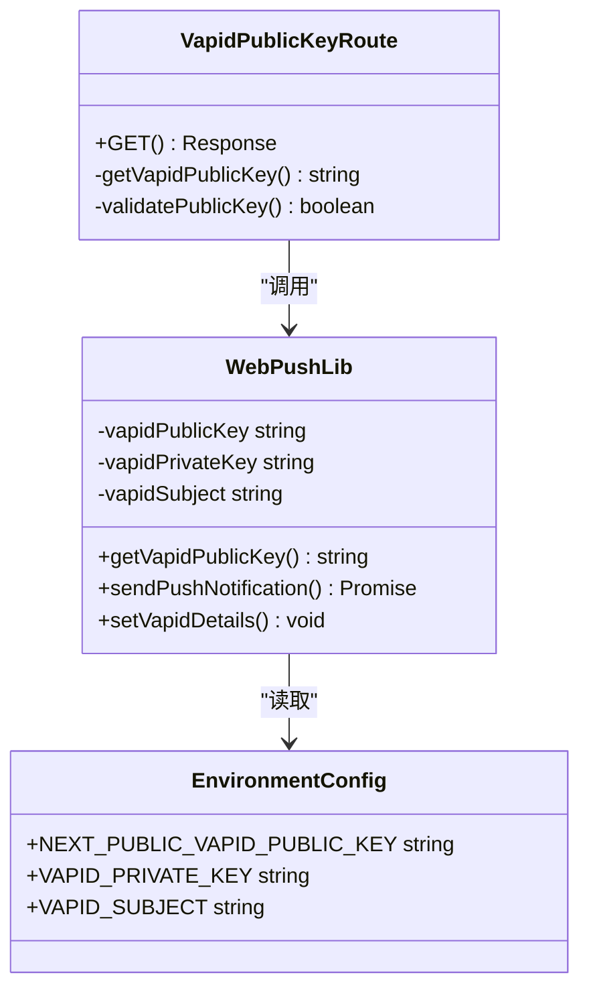
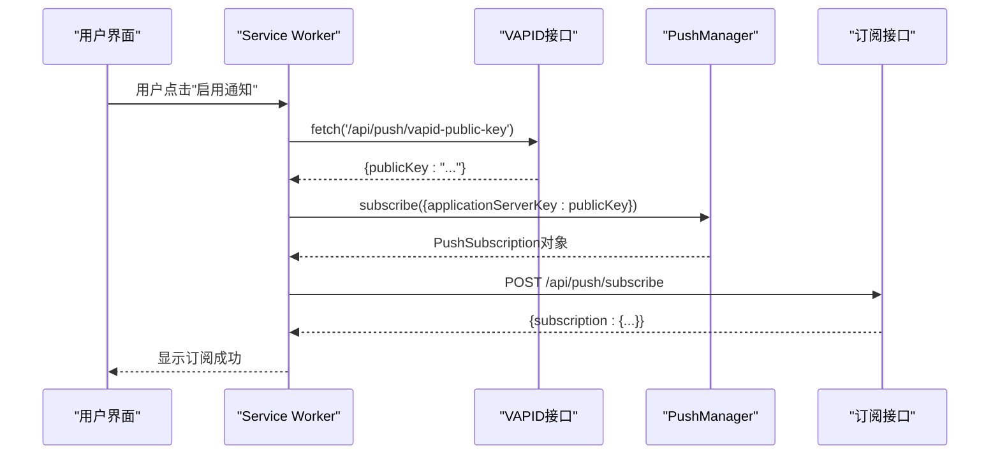

# VAPID公钥获取接口

<cite>
**本文档引用的文件**
- [app/api/push/vapid-public-key/route.ts](file://app/api/push/vapid-public-key/route.ts)
- [lib/web-push.ts](file://lib/web-push.ts)
- [components/ServiceWorkerRegistration.tsx](file://components/ServiceWorkerRegistration.tsx)
- [components/NotificationPermissionPrompt.tsx](file://components/NotificationPermissionPrompt.tsx)
- [public/sw.js](file://public/sw.js)
- [app/api/push/subscribe/route.ts](file://app/api/push/subscribe/route.ts)
- [docs/WEB_PUSH_DEBUG.md](file://docs/WEB_PUSH_DEBUG.md)
- [package.json](file://package.json)
</cite>

## 目录
1. [简介](#简介)
2. [接口概述](#接口概述)
3. [VAPID协议详解](#vapid协议详解)
4. [接口实现分析](#接口实现分析)
5. [前端集成指南](#前端集成指南)
6. [错误处理机制](#错误处理机制)
7. [环境变量配置](#环境变量配置)
8. [安全考虑](#安全考虑)
9. [故障排除](#故障排除)
10. [总结](#总结)

## 简介

本文档详细说明了GET /api/push/vapid-public-key接口的实现原理和使用方法。该接口负责从环境变量中读取VAPID公钥并返回给前端，用于Web Push通知的注册过程。通过该接口，前端可以获取Base64格式的VAPID公钥，配合Service Worker完成PushManager的订阅初始化。

## 接口概述

### 基本信息
- **接口路径**: `/api/push/vapid-public-key`
- **HTTP方法**: GET
- **接口类型**: 公开接口（无需身份验证）
- **响应格式**: JSON
- **用途**: 提供VAPID公钥供前端初始化PushManager订阅

### 请求和响应规范



**图表来源**
- [app/api/push/vapid-public-key/route.ts](file://app/api/push/vapid-public-key/route.ts#L4-L12)
- [lib/web-push.ts](file://lib/web-push.ts#L5-L6)

## VAPID协议详解

### VAPID协议作用

VAPID（Voluntary Application Server Identification）是Web Push通知协议中的一个关键组件，主要作用包括：

1. **应用标识**: 为推送服务提供应用的身份信息
2. **安全保护**: 防止恶意应用滥用推送服务
3. **服务器认证**: 验证推送通知的发送方身份
4. **配对验证**: 确保公钥和私钥正确配对

### VAPID在Web Push流程中的作用



**图表来源**
- [components/NotificationPermissionPrompt.tsx](file://components/NotificationPermissionPrompt.tsx#L51-L73)
- [app/api/push/vapid-public-key/route.ts](file://app/api/push/vapid-public-key/route.ts#L4-L12)

### 公钥在Web Push中的具体用途

VAPID公钥在Web Push流程中扮演以下角色：

1. **订阅初始化**: 前端使用公钥初始化PushManager的subscribe()方法
2. **密钥交换**: 作为椭圆曲线加密的公钥部分
3. **身份验证**: 用于验证推送通知的发送方身份
4. **数据保护**: 确保推送消息的完整性和机密性

## 接口实现分析

### 后端实现架构



**图表来源**
- [app/api/push/vapid-public-key/route.ts](file://app/api/push/vapid-public-key/route.ts#L1-L12)
- [lib/web-push.ts](file://lib/web-push.ts#L1-L53)

### 核心实现逻辑

#### 接口路由实现

接口路由实现了简洁而高效的逻辑：

1. **导入依赖**: 导入NextResponse用于响应处理和getVapidPublicKey函数
2. **获取公钥**: 调用lib/web-push.ts中的getVapidPublicKey()函数
3. **验证状态**: 检查公钥是否存在
4. **返回响应**: 成功时返回JSON格式的公钥，失败时返回500错误

#### 库函数实现

lib/web-push.ts中的getVapidPublicKey()函数提供了核心的环境变量访问逻辑：

1. **环境变量读取**: 从process.env中读取NEXT_PUBLIC_VAPID_PUBLIC_KEY
2. **默认值处理**: 如果未配置则返回空字符串
3. **全局初始化**: 在模块加载时设置VAPID详细信息

**章节来源**
- [app/api/push/vapid-public-key/route.ts](file://app/api/push/vapid-public-key/route.ts#L1-L12)
- [lib/web-push.ts](file://lib/web-push.ts#L51-L53)

## 前端集成指南

### 完整的前端调用流程



**图表来源**
- [components/NotificationPermissionPrompt.tsx](file://components/NotificationPermissionPrompt.tsx#L51-L73)
- [app/api/push/subscribe/route.ts](file://app/api/push/subscribe/route.ts#L14-L61)

### 前端实现示例

#### 基础fetch请求示例

```javascript
// 获取VAPID公钥
const keyRes = await fetch('/api/push/vapid-public-key')
const { publicKey } = await keyRes.json()

// 使用公钥初始化PushManager订阅
const subscription = await registration.pushManager.subscribe({
    userVisibleOnly: true,
    applicationServerKey: publicKey,
})

// 发送订阅信息到后端
await fetch('/api/push/subscribe', {
    method: 'POST',
    headers: { 'Content-Type': 'application/json' },
    body: JSON.stringify(subscription.toJSON()),
})
```

#### React组件集成示例

```typescript
const subscribeToPush = async () => {
    try {
        const registration = await navigator.serviceWorker.ready
        const keyRes = await fetch('/api/push/vapid-public-key')
        
        if (!keyRes.ok) return
        
        const { publicKey } = await keyRes.json()
        
        const subscription = await registration.pushManager.subscribe({
            userVisibleOnly: true,
            applicationServerKey: publicKey,
        })
        
        await fetch('/api/push/subscribe', {
            method: 'POST',
            headers: { 'Content-Type': 'application/json' },
            body: JSON.stringify(subscription.toJSON()),
        })
        
        console.log('[Notification] Auto-subscribed successfully')
    } catch (error) {
        console.error('[Notification] Auto-subscribe error:', error)
    }
}
```

**章节来源**
- [components/NotificationPermissionPrompt.tsx](file://components/NotificationPermissionPrompt.tsx#L51-L73)
- [app/settings/page.tsx](file://app/settings/page.tsx#L125-L143)

## 错误处理机制

### 500错误响应场景

当环境变量未正确配置时，接口会返回500错误：

```json
{
    "error": "VAPID keys not configured"
}
```

这种设计确保了系统的健壮性，防止在缺少必要配置的情况下继续运行。

### 前端错误处理策略

前端应该实现适当的错误处理：

1. **网络错误**: 检查fetch请求的状态码
2. **JSON解析错误**: 验证响应数据格式
3. **权限错误**: 处理用户拒绝通知权限的情况
4. **订阅失败**: 捕获并处理订阅过程中的异常

**章节来源**
- [app/api/push/vapid-public-key/route.ts](file://app/api/push/vapid-public-key/route.ts#L7-L9)

## 环境变量配置

### 必需的环境变量

系统使用以下环境变量来配置VAPID：

| 环境变量名 | 类型 | 必需 | 默认值 | 描述 |
|-----------|------|------|--------|------|
| NEXT_PUBLIC_VAPID_PUBLIC_KEY | 字符串 | 是 | 无 | Base64URL编码的VAPID公钥 |
| VAPID_PRIVATE_KEY | 字符串 | 是 | 无 | VAPID私钥（仅后端使用） |
| VAPID_SUBJECT | 字符串 | 否 | mailto:admin@example.com | VAPID主题标识 |

### 环境变量生成和管理

使用web-push库提供的工具生成VAPID密钥对：

```bash
npx web-push generate-vapid-keys
```

这个命令会输出公钥和私钥，需要分别配置到相应的环境变量中。

**章节来源**
- [lib/web-push.ts](file://lib/web-push.ts#L3-L7)

## 安全考虑

### 公开接口的安全性

该接口为公开接口，无需身份验证，但必须确保以下安全措施：

1. **公钥与私钥配对**: 确保NEXT_PUBLIC_VAPID_PUBLIC_KEY与VAPID_PRIVATE_KEY正确配对
2. **HTTPS部署**: 生产环境中必须使用HTTPS协议
3. **最小权限原则**: 仅暴露必要的公钥信息
4. **定期轮换**: 定期更换VAPID密钥对以提高安全性

### 前端安全实践

1. **公钥验证**: 前端应验证接收到的公钥格式
2. **错误隔离**: 避免将敏感信息泄露给前端
3. **CORS配置**: 正确配置跨域资源共享策略

## 故障排除

### 常见问题诊断

#### 1. 权限请求不弹出

根据项目文档，这是最常见的Web Push问题之一。可能的原因包括：

- 浏览器安全策略限制
- 之前的权限被拒绝
- 浏览器兼容性问题

#### 2. VAPID公钥获取失败

如果GET /api/push/vapid-public-key接口返回500错误，检查：

- 环境变量是否正确配置
- 应用是否重新部署
- 日志中是否有相关错误信息

#### 3. 订阅失败

检查以下方面：

- Service Worker是否正确注册
- 浏览器是否支持Web Push
- 网络连接是否正常

### 调试工具和方法

项目提供了完整的调试文档，包含：

1. **浏览器控制台诊断脚本**
2. **权限状态检查**
3. **Service Worker状态监控**
4. **详细的问题排查步骤**

**章节来源**
- [docs/WEB_PUSH_DEBUG.md](file://docs/WEB_PUSH_DEBUG.md#L1-L166)

## 总结

GET /api/push/vapid-public-key接口是一个设计简洁、功能明确的公开接口，它为Web Push通知系统提供了关键的基础设施支持。通过该接口，前端可以安全地获取VAPID公钥，配合Service Worker完成推送订阅的初始化。

### 关键要点回顾

1. **接口简单高效**: 仅需一次GET请求即可获取公钥
2. **安全可靠**: 采用公开接口设计，但要求严格的密钥配对
3. **易于集成**: 前端实现简单，错误处理完善
4. **生产就绪**: 包含完整的环境变量配置和安全考虑

### 最佳实践建议

1. **正确的环境变量配置**: 确保VAPID公钥和私钥正确配对
2. **完善的错误处理**: 前后端都应实现适当的错误处理逻辑
3. **安全的部署策略**: 生产环境必须使用HTTPS协议
4. **持续的监控和维护**: 定期检查推送功能的运行状态

通过遵循这些指导原则，开发者可以构建稳定可靠的Web Push通知系统，为用户提供及时有效的通知体验。