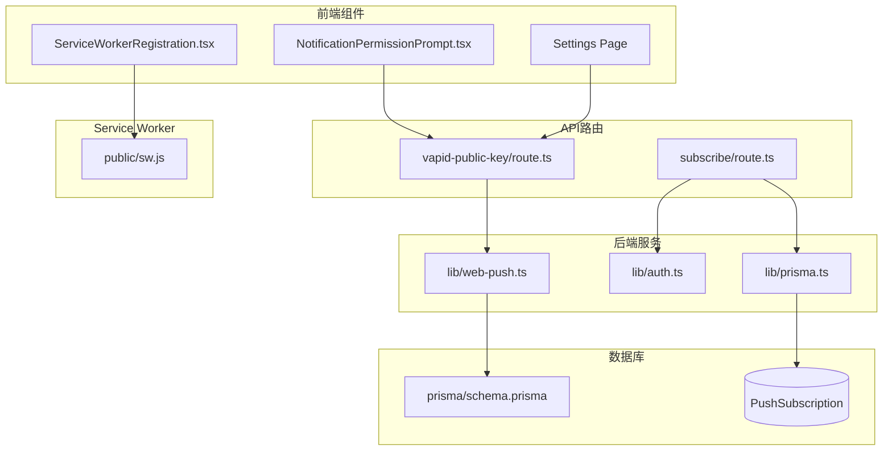
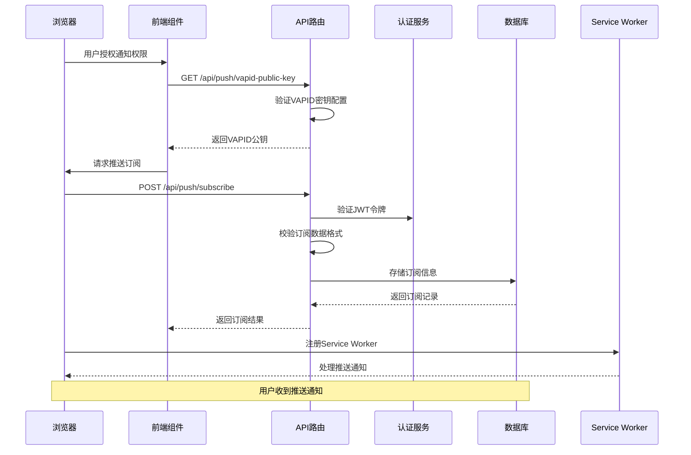
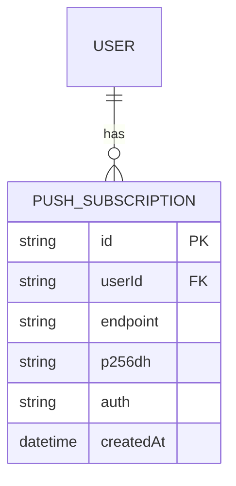
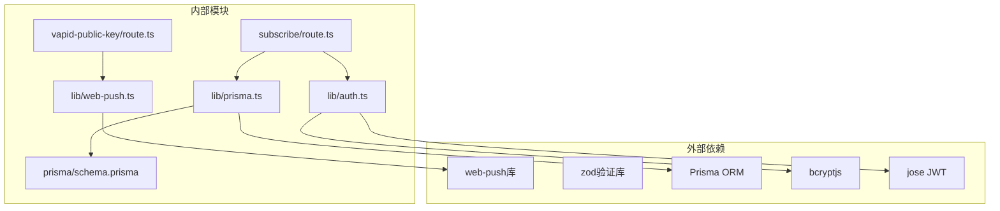

# 推送订阅API

<cite>
**本文档引用的文件**
- [app/api/push/vapid-public-key/route.ts](file://app/api/push/vapid-public-key/route.ts)
- [app/api/push/subscribe/route.ts](file://app/api/push/subscribe/route.ts)
- [lib/web-push.ts](file://lib/web-push.ts)
- [lib/prisma.ts](file://lib/prisma.ts)
- [prisma/schema.prisma](file://prisma/schema.prisma)
- [lib/auth.ts](file://lib/auth.ts)
- [public/sw.js](file://public/sw.js)
- [components/ServiceWorkerRegistration.tsx](file://components/ServiceWorkerRegistration.tsx)
- [components/NotificationPermissionPrompt.tsx](file://components/NotificationPermissionPrompt.tsx)
- [app/settings/page.tsx](file://app/settings/page.tsx)
</cite>

## 目录
1. [简介](#简介)
2. [项目结构](#项目结构)
3. [核心组件](#核心组件)
4. [架构概览](#架构概览)
5. [详细组件分析](#详细组件分析)
6. [依赖关系分析](#依赖关系分析)
7. [性能考虑](#性能考虑)
8. [故障排除指南](#故障排除指南)
9. [结论](#结论)

## 简介

本文档详细说明了Web Push订阅接口的实现，包括GET /api/push/vapid-public-key端点用于获取VAPID公钥，以及POST /api/push/subscribe端点用于接收和存储浏览器生成的PushSubscription对象。该系统实现了完整的推送通知功能，包括前端Service Worker集成、后端订阅管理、以及安全的身份验证机制。

## 项目结构

推送订阅功能涉及以下关键文件和组件：

**图表来源**
- [app/api/push/vapid-public-key/route.ts](file://app/api/push/vapid-public-key/route.ts#L1-L13)
- [app/api/push/subscribe/route.ts](file://app/api/push/subscribe/route.ts#L1-L96)
- [lib/web-push.ts](file://lib/web-push.ts#L1-L54)
- [lib/prisma.ts](file://lib/prisma.ts#L1-L20)

**章节来源**
- [app/api/push/vapid-public-key/route.ts](file://app/api/push/vapid-public-key/route.ts#L1-L13)
- [app/api/push/subscribe/route.ts](file://app/api/push/subscribe/route.ts#L1-L96)
- [lib/web-push.ts](file://lib/web-push.ts#L1-L54)
- [lib/prisma.ts](file://lib/prisma.ts#L1-L20)

## 核心组件

### VAPID公钥获取组件

GET /api/push/vapid-public-key端点负责向客户端提供VAPID公钥，这是Web Push协议中必需的安全组件。

### 推送订阅管理组件

POST /api/push/subscribe端点处理浏览器推送订阅的创建和存储，确保每个订阅都与正确的用户关联。

### 数据存储组件

PushSubscription模型定义了推送订阅的数据结构，包括用户关联、端点URL和加密密钥。

**章节来源**
- [app/api/push/vapid-public-key/route.ts](file://app/api/push/vapid-public-key/route.ts#L4-L12)
- [app/api/push/subscribe/route.ts](file://app/api/push/subscribe/route.ts#L14-L62)
- [prisma/schema.prisma](file://prisma/schema.prisma#L76-L85)

## 架构概览

推送订阅系统的整体架构如下：

**图表来源**
- [components/NotificationPermissionPrompt.tsx](file://components/NotificationPermissionPrompt.tsx#L51-L73)
- [app/api/push/vapid-public-key/route.ts](file://app/api/push/vapid-public-key/route.ts#L4-L12)
- [app/api/push/subscribe/route.ts](file://app/api/push/subscribe/route.ts#L14-L62)
- [public/sw.js](file://public/sw.js#L12-L49)

## 详细组件分析

### VAPID公钥获取端点

#### 功能概述
GET /api/push/vapid-public-key端点提供Base64编码的VAPID公钥，供前端在建立推送订阅时使用。

#### 实现细节
- 从环境变量加载VAPID公钥和私钥
- 初始化web-push库的VAPID配置
- 返回包含公钥的对象

#### 错误处理
- 当VAPID密钥未配置时返回500状态码
- 返回标准JSON格式的错误响应

**章节来源**
- [app/api/push/vapid-public-key/route.ts](file://app/api/push/vapid-public-key/route.ts#L4-L12)
- [lib/web-push.ts](file://lib/web-push.ts#L5-L15)

### 推送订阅管理端点

#### POST /api/push/subscribe

##### 安全性设计
- 使用JWT令牌进行身份验证
- 验证用户ID的有效性
- 每个订阅与特定用户绑定

##### 数据验证
使用Zod进行严格的输入验证：
- endpoint必须是有效的URL
- keys对象必须包含p256dh和auth字段
- 所有字段都必须是字符串类型

##### 数据存储逻辑
- 检查用户是否已存在相同的订阅
- 如果存在则返回现有订阅
- 否则创建新的订阅记录

##### 返回值
- 成功时返回订阅对象（201状态码）
- 已存在时返回现有订阅（200状态码）

#### DELETE /api/push/subscribe

##### 功能
删除指定用户的推送订阅

##### 参数
- endpoint查询参数（必需）

##### 安全性
- 验证JWT令牌
- 确保只能删除当前用户的订阅

**章节来源**
- [app/api/push/subscribe/route.ts](file://app/api/push/subscribe/route.ts#L14-L62)
- [app/api/push/subscribe/route.ts](file://app/api/push/subscribe/route.ts#L64-L95)

### 数据存储结构

#### PushSubscription模型

**图表来源**
- [prisma/schema.prisma](file://prisma/schema.prisma#L76-L85)

##### 字段说明
- **id**: 主键，使用CUID生成
- **userId**: 外键，关联到User模型
- **endpoint**: 推送服务端点URL
- **p256dh**: ECDH密钥，用于密钥交换
- **auth**: 认证密钥，用于消息认证
- **createdAt**: 创建时间戳

##### 约束条件
- 每个用户只能有一个特定endpoint的订阅
- 自动设置创建时间

**章节来源**
- [prisma/schema.prisma](file://prisma/schema.prisma#L76-L85)

### Service Worker集成

#### 功能概述
Service Worker处理接收到的推送通知，显示系统通知并处理用户交互。

#### 事件处理

##### push事件
- 解析推送负载数据
- 显示通知对话框
- 支持自定义标题、正文、图标等

##### notificationclick事件
- 处理用户点击通知
- 尝试聚焦现有窗口
- 如无窗口则打开新窗口

##### notificationclose事件
- 记录通知关闭事件

**章节来源**
- [public/sw.js](file://public/sw.js#L12-L77)

### 前端集成组件

#### ServiceWorkerRegistration组件
负责注册和初始化Service Worker，确保推送通知功能正常工作。

#### NotificationPermissionPrompt组件
自动请求用户授予通知权限，并在获得授权后执行推送订阅。

#### 设置页面集成
在设置页面提供手动订阅选项，包含完整的订阅流程。

**章节来源**
- [components/ServiceWorkerRegistration.tsx](file://components/ServiceWorkerRegistration.tsx#L5-L29)
- [components/NotificationPermissionPrompt.tsx](file://components/NotificationPermissionPrompt.tsx#L51-L73)
- [app/settings/page.tsx](file://app/settings/page.tsx#L125-L143)

## 依赖关系分析

**图表来源**
- [app/api/push/vapid-public-key/route.ts](file://app/api/push/vapid-public-key/route.ts#L1-L2)
- [app/api/push/subscribe/route.ts](file://app/api/push/subscribe/route.ts#L1-L4)
- [lib/web-push.ts](file://lib/web-push.ts#L1)
- [lib/auth.ts](file://lib/auth.ts#L1-L2)

### 关键依赖关系

1. **认证依赖**: 订阅端点依赖JWT认证服务
2. **数据存储依赖**: 使用Prisma ORM进行数据库操作
3. **推送依赖**: 依赖web-push库处理VAPID和推送
4. **验证依赖**: 使用Zod进行输入数据验证

**章节来源**
- [app/api/push/subscribe/route.ts](file://app/api/push/subscribe/route.ts#L1-L4)
- [lib/web-push.ts](file://lib/web-push.ts#L1)
- [lib/auth.ts](file://lib/auth.ts#L1-L2)

## 性能考虑

### 订阅去重机制
系统实现了智能的订阅去重逻辑，避免重复存储相同的订阅信息，减少数据库压力。

### 异步处理
所有推送操作都是异步的，不会阻塞主线程，提升用户体验。

### 缓存策略
VAPID公钥在应用启动时加载一次，避免重复计算。

### 错误恢复
当推送发送失败时，系统会自动清理无效的订阅记录，保持数据库整洁。

## 故障排除指南

### 常见错误情况

#### 未认证错误 (401)
- **原因**: 缺少或无效的JWT令牌
- **解决方案**: 确保用户已登录并正确传递令牌

#### 输入验证错误 (400)
- **原因**: JSON格式不正确或缺少必要字段
- **解决方案**: 检查订阅对象的结构，确保包含endpoint和keys字段

#### VAPID密钥未配置 (500)
- **原因**: 环境变量中缺少VAPID公钥或私钥
- **解决方案**: 生成VAPID密钥对并正确配置环境变量

#### 内部服务器错误 (500)
- **原因**: 服务器端异常
- **解决方案**: 查看服务器日志获取详细错误信息

### 调试建议

1. **检查网络请求**: 确认API端点能够正常访问
2. **验证JWT令牌**: 确保令牌格式正确且未过期
3. **检查数据库连接**: 确认Prisma连接正常
4. **查看Service Worker状态**: 确保Service Worker正确注册

**章节来源**
- [app/api/push/subscribe/route.ts](file://app/api/push/subscribe/route.ts#L17-L24)
- [app/api/push/subscribe/route.ts](file://app/api/push/subscribe/route.ts#L29-L31)
- [app/api/push/vapid-public-key/route.ts](file://app/api/push/vapid-public-key/route.ts#L7-L9)

## 结论

该Web Push订阅系统提供了完整、安全且高效的推送通知功能。通过严格的认证机制、完善的数据验证、智能的订阅管理和优雅的错误处理，确保了系统的稳定性和可靠性。

### 主要特性总结

1. **安全性**: 基于JWT的用户认证，防止跨用户订阅
2. **完整性**: 严格的输入验证和数据校验
3. **可维护性**: 清晰的代码结构和完善的错误处理
4. **可扩展性**: 模块化的架构设计，便于功能扩展

### 最佳实践建议

1. **环境配置**: 确保VAPID密钥正确配置
2. **错误监控**: 实施全面的错误监控和日志记录
3. **性能优化**: 定期清理无效的订阅记录
4. **安全更新**: 及时更新依赖包和安全补丁