# 推送订阅管理接口

<cite>
**本文档引用的文件**
- [app/api/push/subscribe/route.ts](file://app/api/push/subscribe/route.ts)
- [lib/web-push.ts](file://lib/web-push.ts)
- [public/sw.js](file://public/sw.js)
- [prisma/schema.prisma](file://prisma/schema.prisma)
- [lib/auth.ts](file://lib/auth.ts)
- [components/ServiceWorkerRegistration.tsx](file://components/ServiceWorkerRegistration.tsx)
- [app/api/push/vapid-public-key/route.ts](file://app/api/push/vapid-public-key/route.ts)
- [app/settings/page.tsx](file://app/settings/page.tsx)
- [middleware.ts](file://middleware.ts)
</cite>

## 目录
1. [简介](#简介)
2. [项目结构](#项目结构)
3. [核心组件](#核心组件)
4. [架构概览](#架构概览)
5. [详细组件分析](#详细组件分析)
6. [依赖关系分析](#依赖关系分析)
7. [性能考虑](#性能考虑)
8. [故障排除指南](#故障排除指南)
9. [结论](#结论)

## 简介

本文档详细说明了Web推送通知系统的订阅管理接口，包括POST `/api/push/subscribe` 和DELETE `/api/push/subscribe` 接口的完整实现。该系统基于Next.js构建，使用Prisma作为ORM，Zod进行数据验证，JWT进行用户身份验证，并通过web-push库实现推送通知功能。

系统的核心流程包括：浏览器Service Worker注册、VAPID密钥获取、PushSubscription对象创建与存储、以及订阅的取消与删除。整个过程确保了用户身份验证、数据完整性验证和防重复机制的实施。

## 项目结构

推送订阅功能涉及以下关键文件和组件：

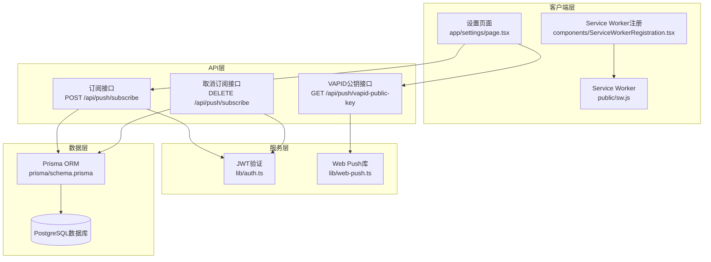

**图表来源**
- [app/api/push/subscribe/route.ts](file://app/api/push/subscribe/route.ts#L1-L96)
- [lib/web-push.ts](file://lib/web-push.ts#L1-L54)
- [public/sw.js](file://public/sw.js#L1-L78)

**章节来源**
- [app/api/push/subscribe/route.ts](file://app/api/push/subscribe/route.ts#L1-L96)
- [lib/web-push.ts](file://lib/web-push.ts#L1-L54)
- [public/sw.js](file://public/sw.js#L1-L78)

## 核心组件

### 数据模型定义

推送订阅系统的核心数据模型定义如下：

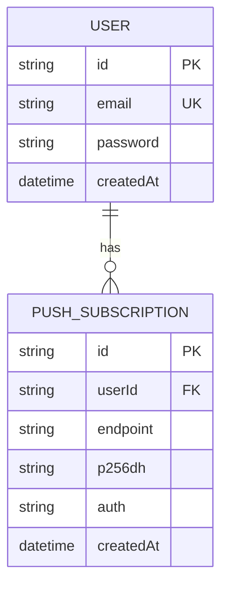

**图表来源**
- [prisma/schema.prisma](file://prisma/schema.prisma#L76-L85)

### 推送订阅数据结构

系统使用Zod进行严格的数据验证，确保订阅数据的完整性：

| 字段名 | 类型 | 必填 | 验证规则 | 描述 |
|--------|------|------|----------|------|
| endpoint | string | 是 | URL格式验证 | 推送服务端点URL |
| keys.p256dh | string | 是 | 任意字符串 | ECDH密钥材料 |
| keys.auth | string | 是 | 任意字符串 | 认证密钥材料 |

**章节来源**
- [prisma/schema.prisma](file://prisma/schema.prisma#L76-L85)
- [app/api/push/subscribe/route.ts](file://app/api/push/subscribe/route.ts#L6-L12)

## 架构概览

推送订阅系统的整体架构采用分层设计，确保了清晰的关注点分离和良好的可维护性。

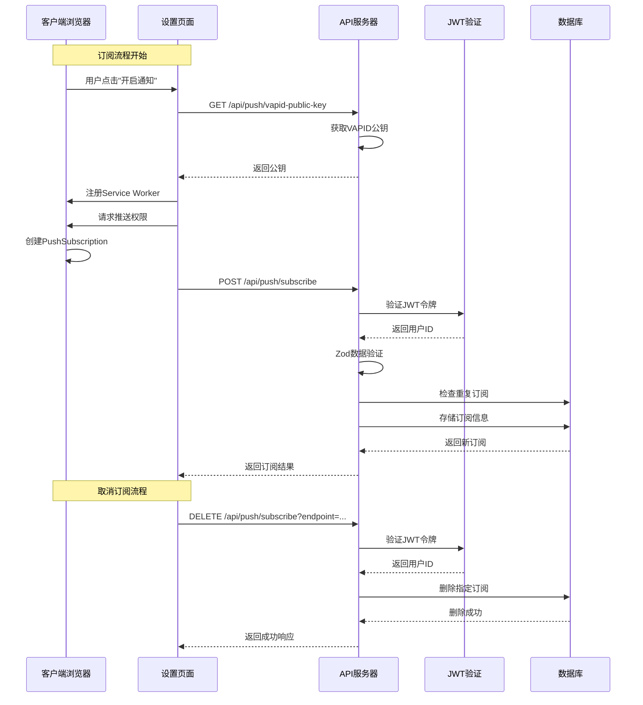

**图表来源**
- [app/settings/page.tsx](file://app/settings/page.tsx#L125-L143)
- [app/api/push/subscribe/route.ts](file://app/api/push/subscribe/route.ts#L14-L62)
- [app/api/push/vapid-public-key/route.ts](file://app/api/push/vapid-public-key/route.ts#L1-L13)

## 详细组件分析

### POST /api/push/subscribe 接口

#### 接口概述

POST `/api/push/subscribe` 接口负责接收浏览器生成的PushSubscription对象，进行数据验证和用户身份确认后，将订阅信息存储到数据库中。

#### 请求处理流程

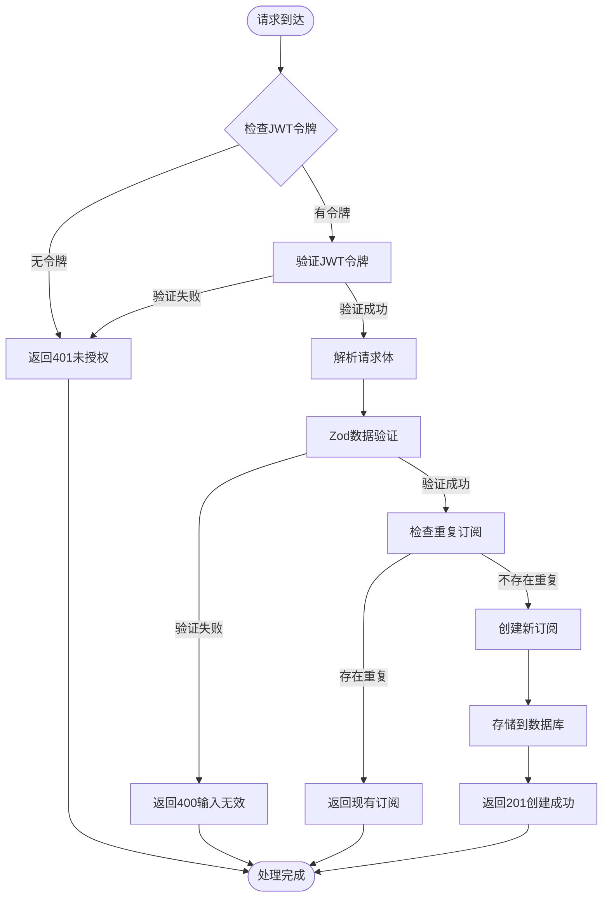

**图表来源**
- [app/api/push/subscribe/route.ts](file://app/api/push/subscribe/route.ts#L14-L62)

#### 数据验证机制

接口使用Zod进行严格的数据验证，确保输入数据符合预期格式：

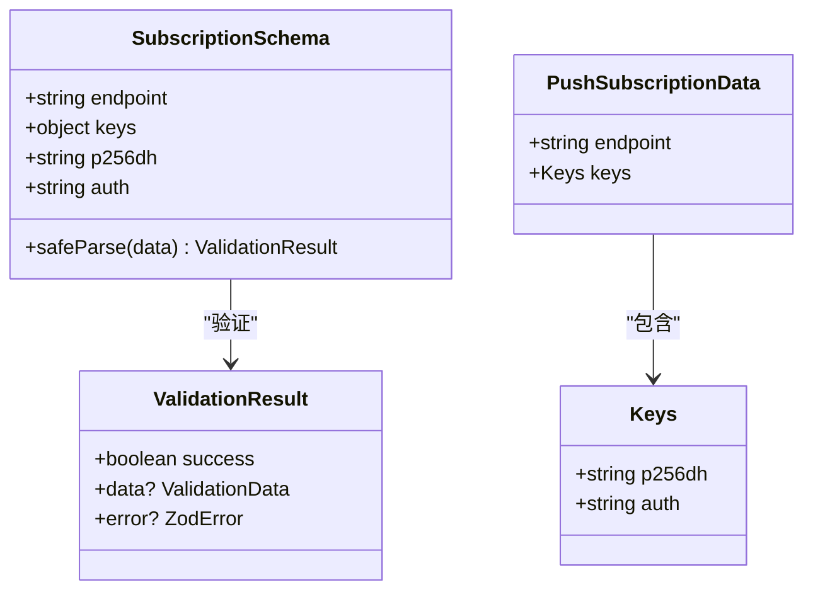

**图表来源**
- [app/api/push/subscribe/route.ts](file://app/api/push/subscribe/route.ts#L6-L12)
- [lib/web-push.ts](file://lib/web-push.ts#L17-L23)

#### 防重复机制

系统实现了基于userId和endpoint的双重条件查询，有效防止重复存储：

| 查询条件 | 作用 | 防重复效果 |
|----------|------|------------|
| userId | 确保同一用户的唯一性 | 防止同一用户重复订阅 |
| endpoint | 确保相同端点的唯一性 | 防止同一设备重复订阅 |
| 组合查询 | 同时满足两个条件 | 完全防重复，确保数据一致性 |

**章节来源**
- [app/api/push/subscribe/route.ts](file://app/api/push/subscribe/route.ts#L35-L45)

### DELETE /api/push/subscribe 接口

#### 接口概述

DELETE `/api/push/subscribe` 接口用于取消用户的推送订阅，通过查询参数endpoint指定要取消的具体订阅。

#### 取消订阅流程

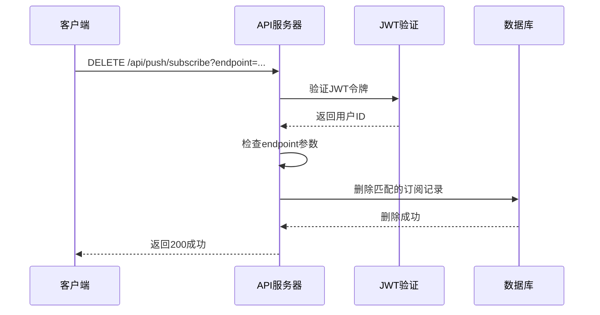

**图表来源**
- [app/api/push/subscribe/route.ts](file://app/api/push/subscribe/route.ts#L64-L95)

#### 参数验证

接口对查询参数进行严格验证：

| 参数名 | 必填 | 验证规则 | 错误处理 |
|--------|------|----------|----------|
| endpoint | 是 | 必须存在且非空 | 返回400错误，提示"Endpoint required" |

**章节来源**
- [app/api/push/subscribe/route.ts](file://app/api/push/subscribe/route.ts#L76-L81)

### Service Worker 生命周期

#### 注册流程

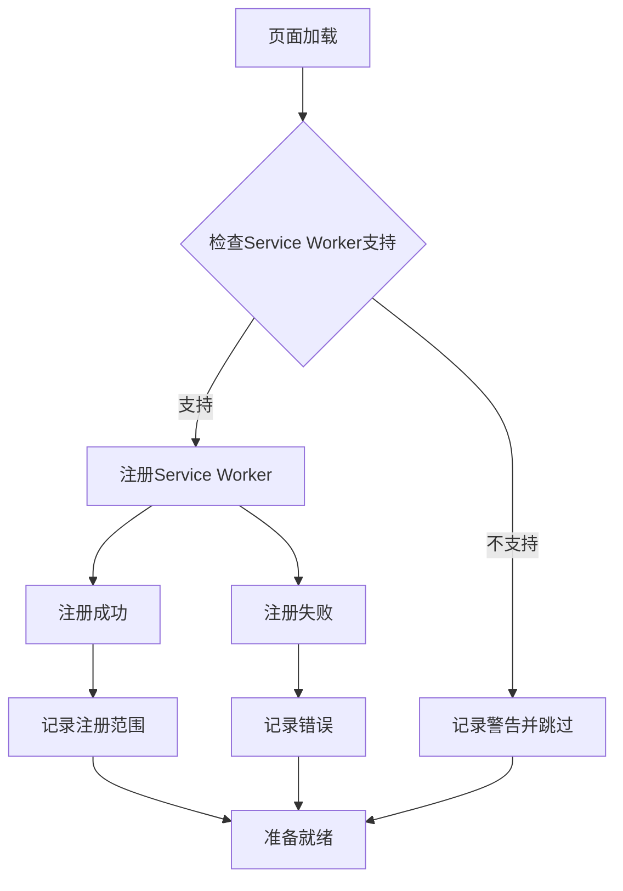

**图表来源**
- [components/ServiceWorkerRegistration.tsx](file://components/ServiceWorkerRegistration.tsx#L5-L26)

#### 推送消息处理

Service Worker负责处理来自推送服务的消息：

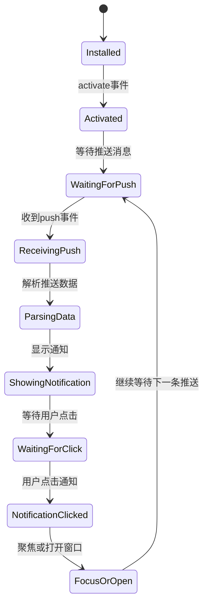

**图表来源**
- [public/sw.js](file://public/sw.js#L12-L73)

**章节来源**
- [public/sw.js](file://public/sw.js#L1-L78)
- [components/ServiceWorkerRegistration.tsx](file://components/ServiceWorkerRegistration.tsx#L1-L30)

### VAPID 密钥管理

#### 密钥初始化

系统使用web-push库进行VAPID密钥配置：

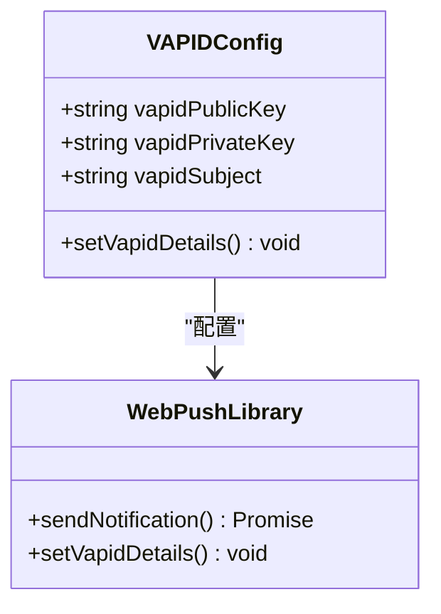

**图表来源**
- [lib/web-push.ts](file://lib/web-push.ts#L1-L15)

#### 公钥获取接口

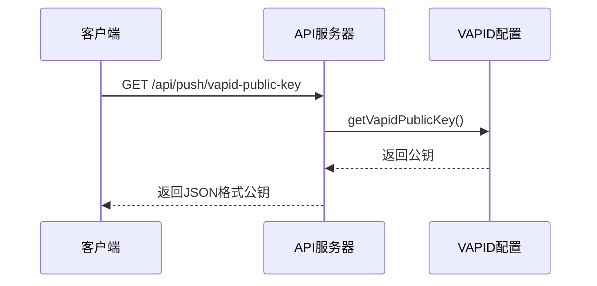

**图表来源**
- [app/api/push/vapid-public-key/route.ts](file://app/api/push/vapid-public-key/route.ts#L1-L13)

**章节来源**
- [lib/web-push.ts](file://lib/web-push.ts#L1-L54)
- [app/api/push/vapid-public-key/route.ts](file://app/api/push/vapid-public-key/route.ts#L1-L13)

## 依赖关系分析

### 核心依赖图

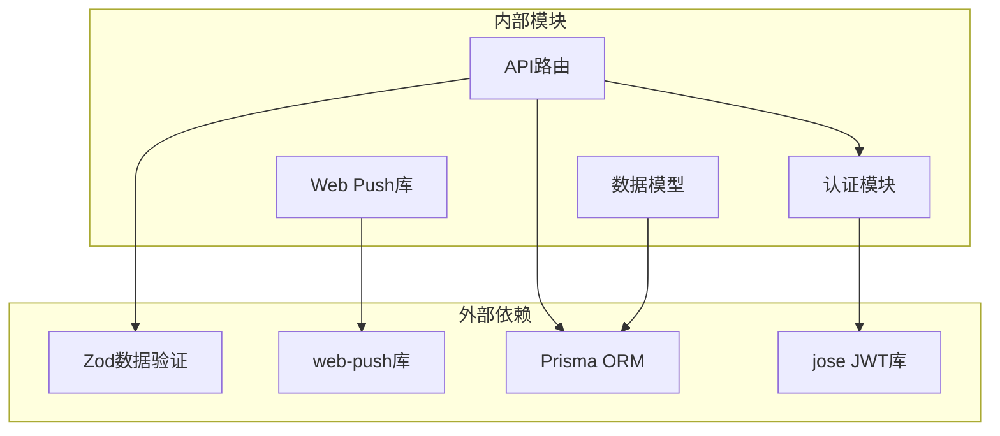

**图表来源**
- [app/api/push/subscribe/route.ts](file://app/api/push/subscribe/route.ts#L1-L4)
- [lib/web-push.ts](file://lib/web-push.ts#L1-L1)

### 关键依赖关系

| 模块 | 依赖 | 用途 | 版本 |
|------|------|------|------|
| app/api/push/subscribe/route.ts | zod | 数据验证 | ^4.1.13 |
| app/api/push/subscribe/route.ts | @prisma/client | 数据库操作 | ^7.1.0 |
| lib/web-push.ts | web-push | 推送通知 | ^3.6.7 |
| lib/auth.ts | jose | JWT处理 | ^6.1.3 |
| components/ServiceWorkerRegistration.tsx | react | Service Worker注册 | 19.2.1 |

**章节来源**
- [package.json](file://package.json#L11-L36)

## 性能考虑

### 缓存策略

- **VAPID公钥缓存**：公钥在应用启动时加载，避免频繁的API调用
- **JWT令牌验证**：使用边缘计算环境进行快速验证
- **数据库连接池**：Prisma自动管理连接池，减少连接开销

### 并发处理

- **请求并发**：每个请求独立处理，避免相互阻塞
- **数据库事务**：使用Prisma的原子操作确保数据一致性
- **错误隔离**：单个请求失败不影响其他请求

### 内存优化

- **流式处理**：推送消息使用流式处理，避免大对象内存占用
- **及时释放**：处理完成后及时释放临时变量
- **连接复用**：数据库连接自动复用，减少连接建立成本

## 故障排除指南

### 常见错误及解决方案

#### 400 错误（输入无效）

**可能原因**：
- PushSubscription对象格式不正确
- endpoint字段不是有效的URL
- keys对象缺少必需字段

**解决方案**：
- 使用Zod验证工具检查数据格式
- 确保endpoint遵循URL格式规范
- 验证keys对象包含p256dh和auth字段

#### 401 错误（未认证）

**可能原因**：
- JWT令牌缺失或过期
- 令牌格式不正确
- 令牌签名验证失败

**解决方案**：
- 检查客户端是否正确存储JWT令牌
- 验证令牌有效期和格式
- 确保服务器端JWT密钥配置正确

#### 500 错误（服务器错误）

**可能原因**：
- 数据库连接失败
- VAPID密钥配置错误
- 异步操作异常

**解决方案**：
- 检查数据库连接状态
- 验证VAPID密钥环境变量配置
- 查看服务器日志获取详细错误信息

### 调试技巧

#### 客户端调试

```javascript
// 在设置页面添加调试输出
console.log('[Push] 订阅流程开始');
console.log('[Push] VAPID公钥:', publicKey);
console.log('[Push] PushSubscription:', subscription);
console.log('[Push] 订阅请求:', JSON.stringify(subscription.toJSON()));
```

#### 服务器端调试

```javascript
// 在API路由中添加详细日志
console.error('Subscribe Push error:', error);
console.error('Request body:', await req.json());
console.error('User ID:', payload?.userId);
```

**章节来源**
- [app/api/push/subscribe/route.ts](file://app/api/push/subscribe/route.ts#L58-L61)
- [app/api/push/subscribe/route.ts](file://app/api/push/subscribe/route.ts#L91-L94)

## 结论

推送订阅管理系统提供了完整的Web推送通知解决方案，具有以下特点：

### 技术优势

- **安全性**：基于JWT的身份验证确保只有授权用户可以管理订阅
- **可靠性**：严格的Zod数据验证和防重复机制确保数据完整性
- **可扩展性**：模块化设计便于功能扩展和维护
- **用户体验**：简洁的前端界面和流畅的订阅流程

### 最佳实践

- **环境配置**：正确配置VAPID密钥和JWT密钥
- **错误处理**：完善的错误处理和用户反馈机制
- **性能优化**：合理的缓存策略和并发处理
- **监控告警**：建立完善的日志记录和错误监控

### 未来改进方向

- **批量操作**：支持批量订阅管理和取消
- **订阅状态**：添加订阅状态跟踪和健康检查
- **推送模板**：支持自定义推送消息模板
- **多平台支持**：扩展对移动设备推送的支持

该系统为Web应用提供了可靠的推送通知能力，能够有效提升用户参与度和应用活跃度。