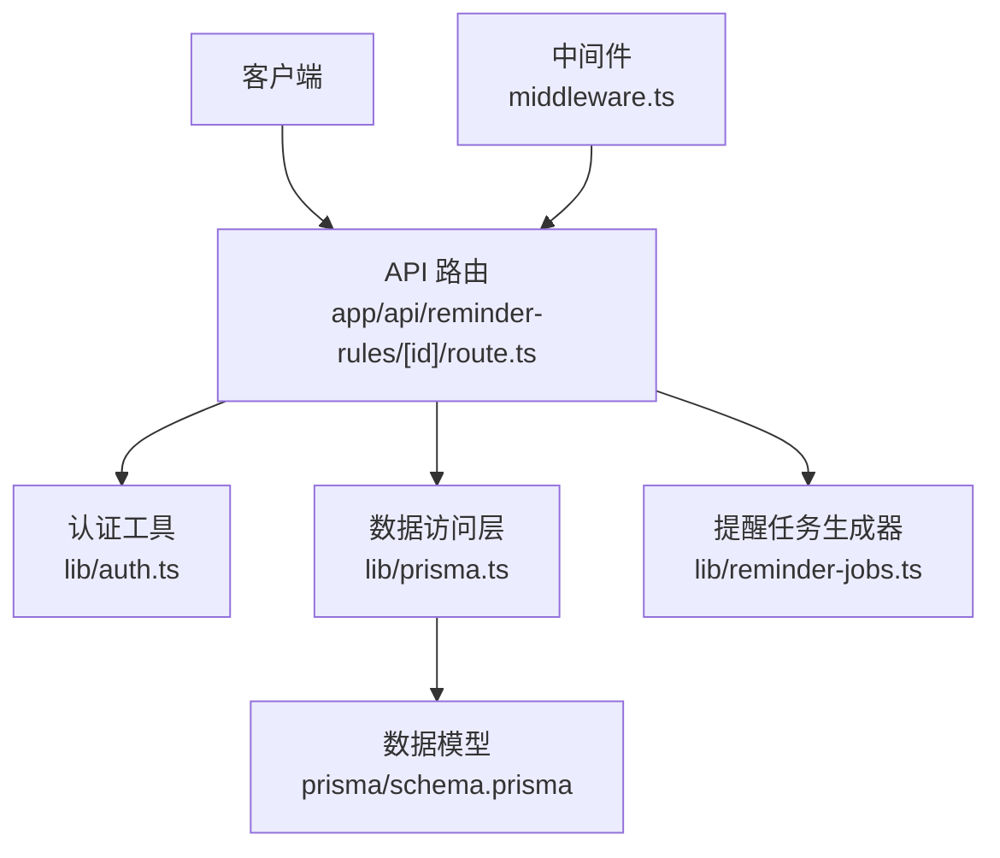
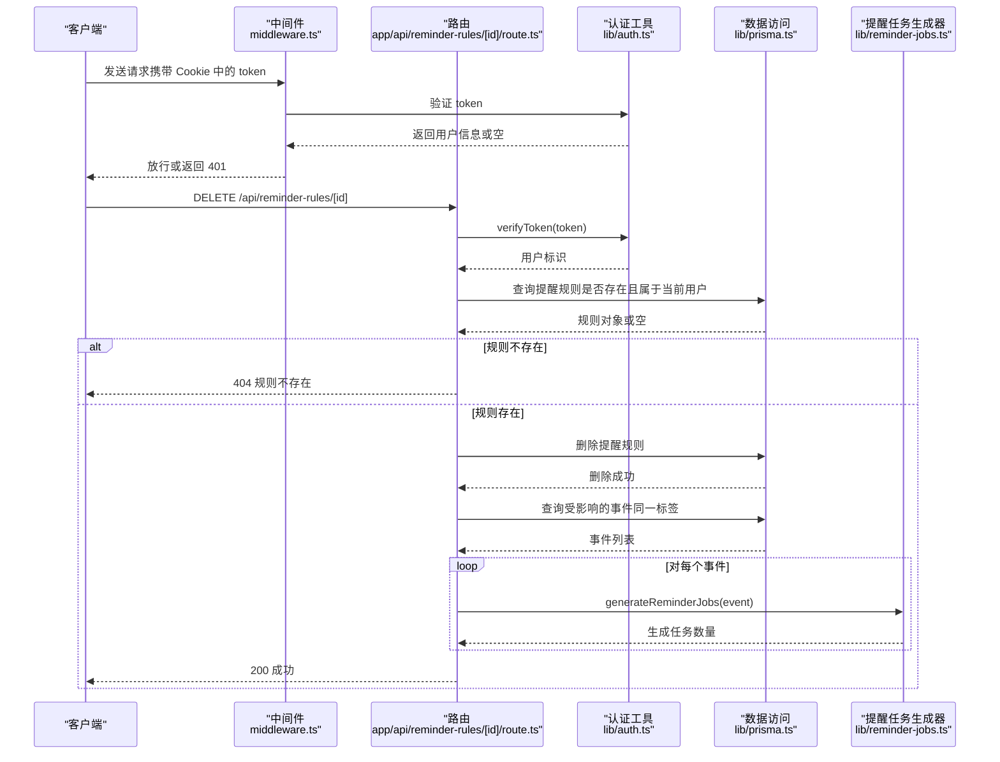
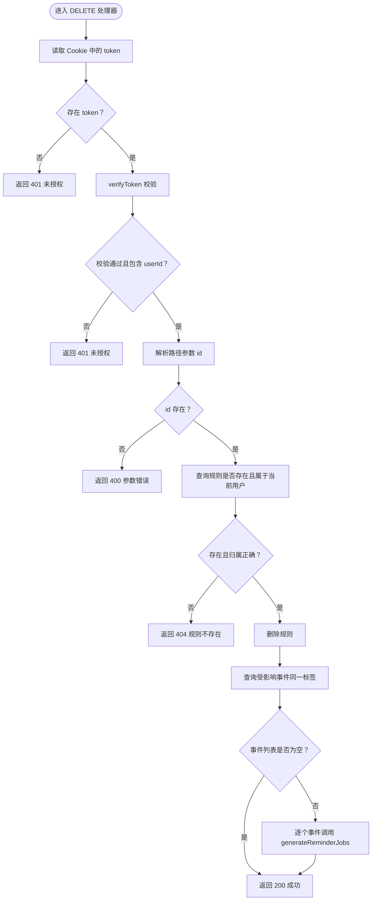
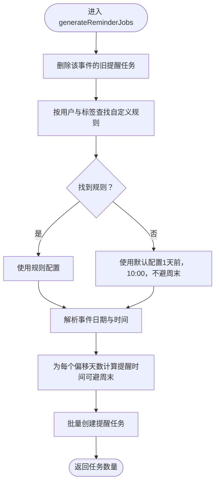
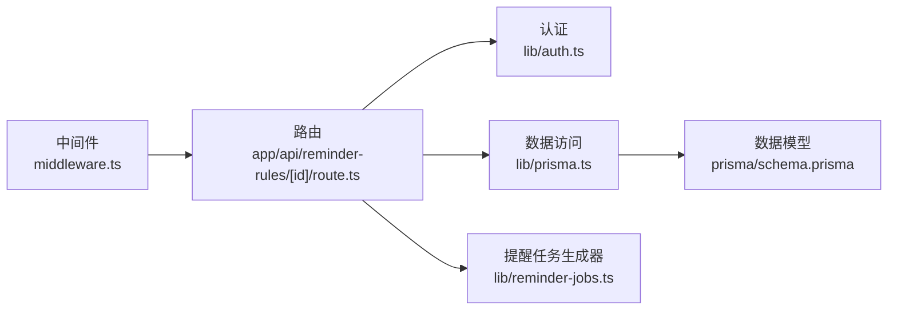

# 删除提醒规则 (DELETE)

<cite>
**本文引用的文件**
- [app/api/reminder-rules/[id]/route.ts](file://app/api/reminder-rules/[id]/route.ts)
- [lib/reminder-jobs.ts](file://lib/reminder-jobs.ts)
- [lib/auth.ts](file://lib/auth.ts)
- [lib/prisma.ts](file://lib/prisma.ts)
- [prisma/schema.prisma](file://prisma/schema.prisma)
- [middleware.ts](file://middleware.ts)
- [app/settings/page.tsx](file://app/settings/page.tsx)
- [package.json](file://package.json)
</cite>

## 目录
1. [简介](#简介)
2. [项目结构](#项目结构)
3. [核心组件](#核心组件)
4. [架构总览](#架构总览)
5. [详细组件分析](#详细组件分析)
6. [依赖关系分析](#依赖关系分析)
7. [性能考虑](#性能考虑)
8. [故障排除指南](#故障排除指南)
9. [结论](#结论)

## 简介
本文件为 DELETE /api/reminder-rules/[id] 接口的详细技术文档，面向后端开发者与集成方。内容涵盖：
- 身份验证流程（JWT Token 校验）
- 权限控制（规则所属用户校验）
- 删除前存在性检查
- 删除后的业务逻辑（事件回退默认提醒策略、重新生成提醒任务）
- 事务性非强保证特性与异常处理
- 请求/响应示例与客户端行为建议

## 项目结构
该接口位于 Next.js App Router 的 API 路由中，采用按文件系统路由的约定：
- 路由文件：app/api/reminder-rules/[id]/route.ts
- 认证工具：lib/auth.ts
- 数据访问：lib/prisma.ts
- 事件提醒任务生成：lib/reminder-jobs.ts
- 数据模型定义：prisma/schema.prisma
- 中间件：middleware.ts

图表来源
- [app/api/reminder-rules/[id]/route.ts](file://app/api/reminder-rules/[id]/route.ts#L1-L158)
- [lib/auth.ts](file://lib/auth.ts#L1-L30)
- [lib/prisma.ts](file://lib/prisma.ts#L1-L20)
- [lib/reminder-jobs.ts](file://lib/reminder-jobs.ts#L1-L109)
- [prisma/schema.prisma](file://prisma/schema.prisma#L1-L86)
- [middleware.ts](file://middleware.ts#L1-L50)

章节来源
- [app/api/reminder-rules/[id]/route.ts](file://app/api/reminder-rules/[id]/route.ts#L1-L158)
- [lib/auth.ts](file://lib/auth.ts#L1-L30)
- [lib/prisma.ts](file://lib/prisma.ts#L1-L20)
- [lib/reminder-jobs.ts](file://lib/reminder-jobs.ts#L1-L109)
- [prisma/schema.prisma](file://prisma/schema.prisma#L1-L86)
- [middleware.ts](file://middleware.ts#L1-L50)

## 核心组件
- 路由处理器：负责接收 DELETE 请求、执行鉴权与权限校验、查询并删除提醒规则、触发事件任务重建。
- 认证工具：提供 JWT 签发与校验能力，用于用户身份识别。
- 数据访问层：通过 Prisma 客户端访问 PostgreSQL 数据库。
- 事件提醒任务生成器：根据规则或默认策略为事件生成提醒任务。
- 数据模型：定义 ReminderRule、Event、ReminderJob 等实体及其关系。

章节来源
- [app/api/reminder-rules/[id]/route.ts](file://app/api/reminder-rules/[id]/route.ts#L94-L157)
- [lib/auth.ts](file://lib/auth.ts#L22-L29)
- [lib/prisma.ts](file://lib/prisma.ts#L13-L19)
- [lib/reminder-jobs.ts](file://lib/reminder-jobs.ts#L15-L72)
- [prisma/schema.prisma](file://prisma/schema.prisma#L47-L74)

## 架构总览
下图展示了删除提醒规则的端到端流程，包括鉴权、权限校验、删除操作与事件任务重建。

图表来源
- [app/api/reminder-rules/[id]/route.ts](file://app/api/reminder-rules/[id]/route.ts#L94-L157)
- [lib/auth.ts](file://lib/auth.ts#L22-L29)
- [lib/prisma.ts](file://lib/prisma.ts#L13-L19)
- [lib/reminder-jobs.ts](file://lib/reminder-jobs.ts#L15-L72)
- [middleware.ts](file://middleware.ts#L5-L44)

## 详细组件分析

### 路由处理器（DELETE /api/reminder-rules/[id]）
- 身份验证：从 Cookie 中读取 token，若缺失直接返回 401。
- JWT 校验：调用 verifyToken 进行签名校验，失败或无 userId 同样返回 401。
- 参数解析：从路径参数获取规则 ID，缺失时返回 400。
- 存在性检查：查询 ReminderRule 是否存在，不存在返回 404。
- 权限控制：比较规则所属用户与 token 中的 userId，不一致返回 403。
- 删除操作：删除对应 ReminderRule。
- 事件回退与重建：查询同一标签的所有事件，逐个调用 generateReminderJobs，使其回退到默认提醒策略并重新生成任务。
- 异常处理：捕获错误并返回 500，同时记录日志。

图表来源
- [app/api/reminder-rules/[id]/route.ts](file://app/api/reminder-rules/[id]/route.ts#L94-L157)

章节来源
- [app/api/reminder-rules/[id]/route.ts](file://app/api/reminder-rules/[id]/route.ts#L94-L157)

### 认证工具（JWT）
- 签发：使用 HS256 算法签发，包含用户标识，有效期 24 小时。
- 校验：使用相同密钥进行验证，失败返回空值。

章节来源
- [lib/auth.ts](file://lib/auth.ts#L14-L29)

### 数据访问层（Prisma）
- 初始化：基于环境变量 DATABASE_URL 创建连接池与适配器，导出 PrismaClient 实例。
- 使用：在路由中通过 prisma.reminderRule 和 prisma.event 执行查询与删除。

章节来源
- [lib/prisma.ts](file://lib/prisma.ts#L9-L19)

### 事件提醒任务生成器（generateReminderJobs）
- 删除旧任务：先清理该事件的现有提醒任务。
- 查找规则：按用户与标签查找自定义提醒规则。
- 默认策略：若无自定义规则，则使用默认配置（提前 1 天，10:00，默认不避周末）。
- 时间计算：根据事件日期与时间、偏移天数与是否避周末生成多个提醒时间点。
- 写入任务：批量创建 ReminderJob 记录。

图表来源
- [lib/reminder-jobs.ts](file://lib/reminder-jobs.ts#L15-L72)

章节来源
- [lib/reminder-jobs.ts](file://lib/reminder-jobs.ts#L15-L72)

### 数据模型（Prisma）
- ReminderRule：唯一约束（用户 + 标签），包含偏移天数数组、默认提醒时间、是否避周末等字段。
- Event：包含用户、标题、日期、时间、标签等字段，并与 ReminderJob 关联。
- ReminderJob：包含用户、事件、触发时间、发送状态等字段。

章节来源
- [prisma/schema.prisma](file://prisma/schema.prisma#L47-L74)

### 前端交互（设置页）
- 删除按钮：在“提醒规则”卡片中提供删除按钮，调用 DELETE /api/reminder-rules/[id]。
- 刷新策略：删除成功后主动重新拉取规则列表，确保 UI 与服务端状态一致。

章节来源
- [app/settings/page.tsx](file://app/settings/page.tsx#L62-L78)

## 依赖关系分析
- 路由依赖认证工具进行 JWT 校验，依赖 Prisma 访问数据库，依赖提醒任务生成器进行事件重建。
- 中间件对受保护路径进行统一鉴权拦截，减少重复校验。
- Prisma 模型定义了 ReminderRule 与 Event 的一对一关系，以及 ReminderJob 的级联删除策略。

图表来源
- [app/api/reminder-rules/[id]/route.ts](file://app/api/reminder-rules/[id]/route.ts#L1-L158)
- [lib/auth.ts](file://lib/auth.ts#L1-L30)
- [lib/prisma.ts](file://lib/prisma.ts#L1-L20)
- [lib/reminder-jobs.ts](file://lib/reminder-jobs.ts#L1-L109)
- [prisma/schema.prisma](file://prisma/schema.prisma#L1-L86)
- [middleware.ts](file://middleware.ts#L1-L50)

章节来源
- [app/api/reminder-rules/[id]/route.ts](file://app/api/reminder-rules/[id]/route.ts#L1-L158)
- [lib/auth.ts](file://lib/auth.ts#L1-L30)
- [lib/prisma.ts](file://lib/prisma.ts#L1-L20)
- [lib/reminder-jobs.ts](file://lib/reminder-jobs.ts#L1-L109)
- [prisma/schema.prisma](file://prisma/schema.prisma#L1-L86)
- [middleware.ts](file://middleware.ts#L1-L50)

## 性能考虑
- 逐事件重建提醒任务：删除规则后，接口会对受影响的每个事件逐一调用 generateReminderJobs。当标签下的事件数量较大时，此过程可能耗时较长。
- 建议：
  - 在前端显示加载状态，避免重复触发删除。
  - 若事件规模很大，可在后续版本引入分批处理或后台队列机制。
  - 确保数据库索引合理（如 Event(userId, label)），以优化查询性能。

[本节为通用性能建议，无需特定文件来源]

## 故障排除指南
- 401 未授权
  - 可能原因：Cookie 中缺少 token 或 token 无效。
  - 处理：重新登录获取有效 token。
- 403 禁止访问
  - 可能原因：尝试删除不属于当前用户的规则。
  - 处理：仅能删除自己的规则。
- 404 规则不存在
  - 可能原因：规则 ID 错误或已被删除。
  - 处理：确认规则 ID 并刷新页面。
- 500 内部错误
  - 可能原因：数据库异常、任务生成异常。
  - 处理：查看服务器日志，重试或联系管理员。
- 事务性非强保证
  - 现状：删除规则与重建任务之间无数据库事务包裹，若中间发生异常，可能出现部分事件已重建而部分未重建的情况。
  - 建议：在后续版本中引入事务或幂等处理，确保一致性。

章节来源
- [app/api/reminder-rules/[id]/route.ts](file://app/api/reminder-rules/[id]/route.ts#L94-L157)
- [lib/reminder-jobs.ts](file://lib/reminder-jobs.ts#L15-L72)

## 结论
DELETE /api/reminder-rules/[id] 接口提供了安全、可控的提醒规则删除能力。其关键特性包括：
- 严格的 JWT 身份验证与权限控制
- 删除前的存在性检查
- 删除后自动回退默认提醒策略并逐事件重建提醒任务
- 明确的错误码与异常处理
- 前端在删除成功后主动刷新规则列表，确保界面与服务端状态一致

对于大规模事件场景，建议关注逐事件重建的性能与一致性问题，并在后续迭代中引入更稳健的事务或异步处理机制。