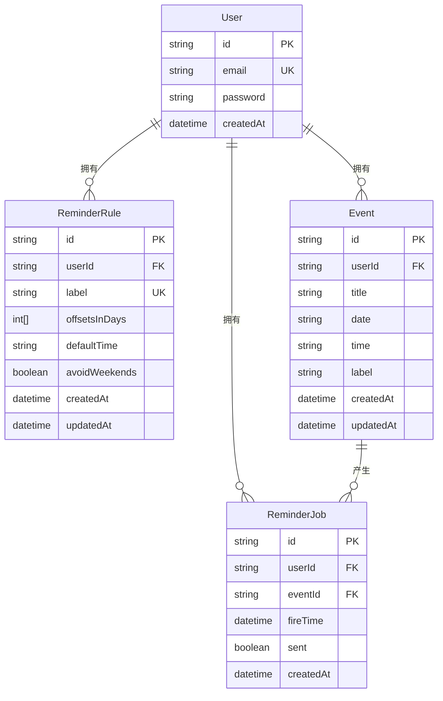
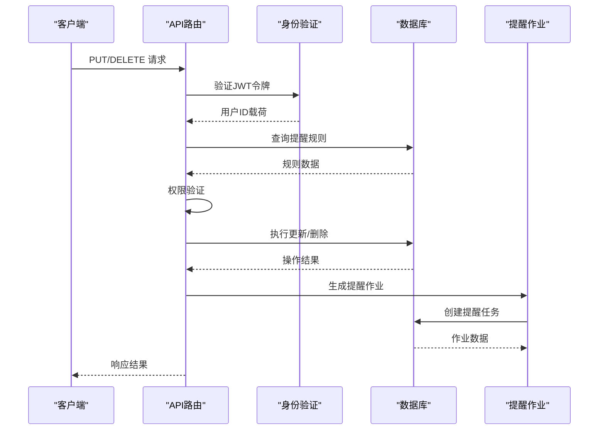
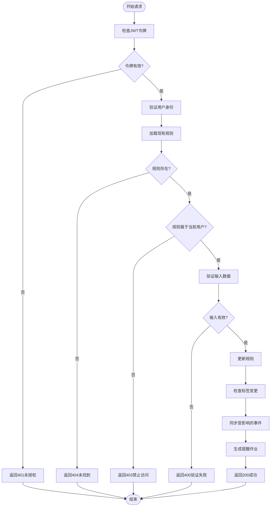
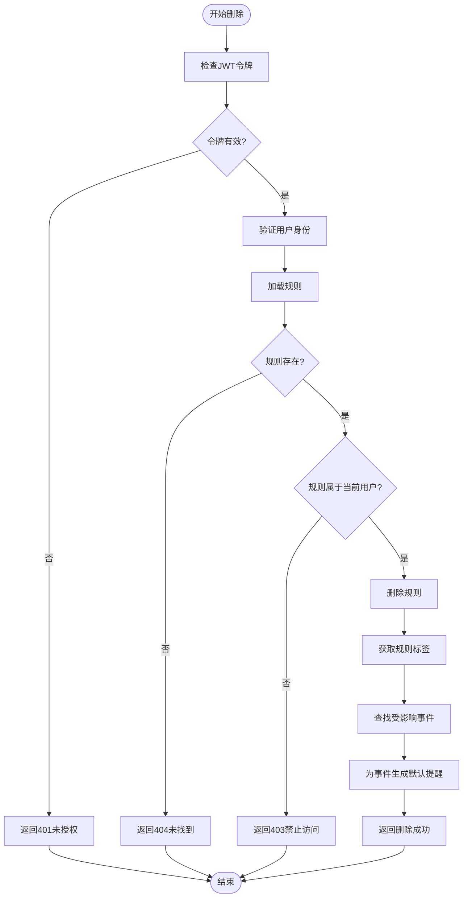
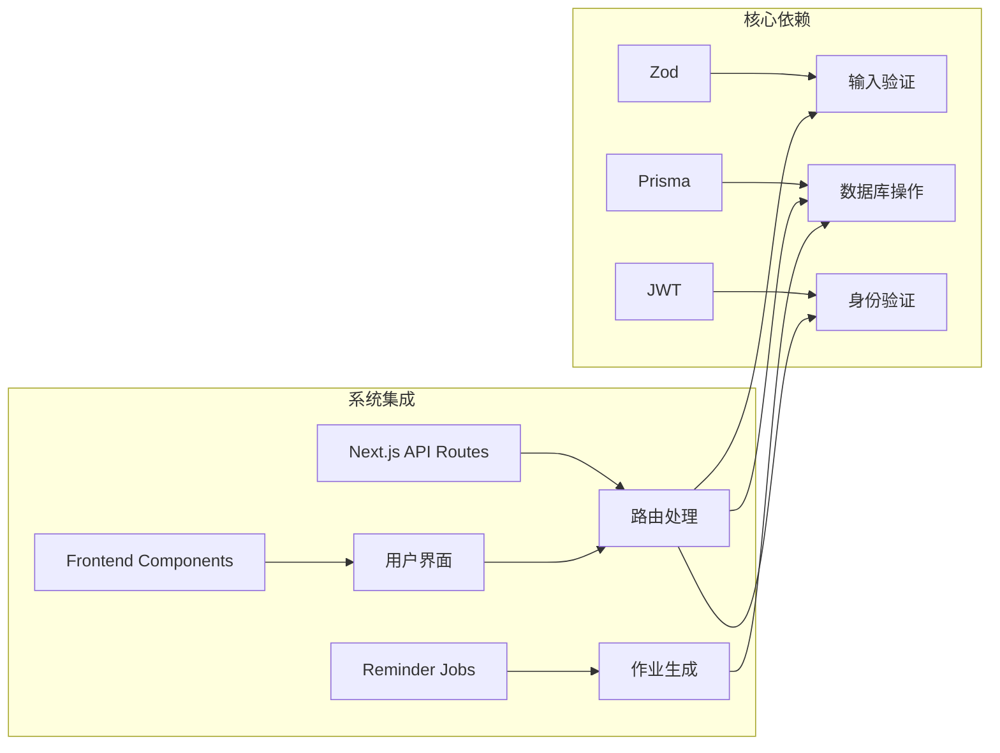
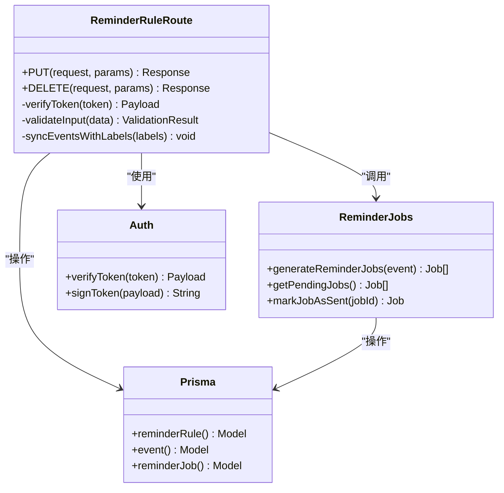

# 单条提醒规则操作

<cite>
**本文档引用的文件**
- [app/api/reminder-rules/[id]/route.ts](file://app/api/reminder-rules/[id]/route.ts)
- [lib/reminder-jobs.ts](file://lib/reminder-jobs.ts)
- [lib/auth.ts](file://lib/auth.ts)
- [lib/prisma.ts](file://lib/prisma.ts)
- [prisma/schema.prisma](file://prisma/schema.prisma)
- [components/ReminderRuleDialog.tsx](file://components/ReminderRuleDialog.tsx)
- [app/settings/page.tsx](file://app/settings/page.tsx)
</cite>

## 目录
1. [简介](#简介)
2. [项目结构](#项目结构)
3. [核心组件](#核心组件)
4. [架构概览](#架构概览)
5. [详细组件分析](#详细组件分析)
6. [依赖关系分析](#依赖关系分析)
7. [性能考虑](#性能考虑)
8. [故障排除指南](#故障排除指南)
9. [结论](#结论)

## 简介

本文档详细说明了提醒规则的单资源操作接口，包括PUT和DELETE方法。这些接口允许用户更新或删除指定的提醒规则，同时确保数据完整性和一致性。系统采用基于JWT的身份验证机制，确保只有规则所有者才能进行操作。

## 项目结构

提醒规则API位于Next.js应用的API路由结构中，采用RESTful设计：

```mermaid
graph TB
subgraph "API路由结构"
A[app/api/reminder-rules/] --> B[[id]/route.ts]
A --> C[route.ts]
D[app/api/events/] --> E[[id]/route.ts]
F[lib/] --> G[reminder-jobs.ts]
F --> H[auth.ts]
F --> I[prisma.ts]
J[prisma/] --> K[schema.prisma]
end
subgraph "前端组件"
L[components/ReminderRuleDialog.tsx]
M[app/settings/page.tsx]
end
```

**图表来源**
- [app/api/reminder-rules/[id]/route.ts](file://app/api/reminder-rules/[id]/route.ts#L1-L158)
- [lib/reminder-jobs.ts](file://lib/reminder-jobs.ts#L1-L108)
- [lib/auth.ts](file://lib/auth.ts#L1-L30)
- [lib/prisma.ts](file://lib/prisma.ts#L1-L20)
- [prisma/schema.prisma](file://prisma/schema.prisma#L1-L86)

**章节来源**
- [app/api/reminder-rules/[id]/route.ts](file://app/api/reminder-rules/[id]/route.ts#L1-L158)
- [prisma/schema.prisma](file://prisma/schema.prisma#L47-L60)

## 核心组件

### 身份验证与授权

系统使用JWT令牌进行身份验证，所有API请求都必须包含有效的token：

- **令牌位置**: Cookie中的"token"字段
- **验证方式**: 使用JWT_SECRET密钥验证令牌有效性
- **用户标识**: 从令牌载荷中提取userId
- **权限检查**: 确保请求的规则属于当前用户

### 数据验证

使用Zod模式进行输入验证：

- **更新模式**: `reminderRuleUpdateSchema` - 支持部分更新
- **创建模式**: `reminderRuleSchema` - 完整字段验证
- **字段约束**: 
  - label: 非空字符串
  - offsetsInDays: 非负整数数组
  - defaultTime: HH:mm格式
  - avoidWeekends: 布尔值

### 数据库模型



**图表来源**
- [prisma/schema.prisma](file://prisma/schema.prisma#L16-L86)

**章节来源**
- [lib/auth.ts](file://lib/auth.ts#L14-L29)
- [app/api/reminder-rules/[id]/route.ts](file://app/api/reminder-rules/[id]/route.ts#L6-L11)
- [prisma/schema.prisma](file://prisma/schema.prisma#L47-L74)

## 架构概览

提醒规则操作遵循以下处理流程：



**图表来源**
- [app/api/reminder-rules/[id]/route.ts](file://app/api/reminder-rules/[id]/route.ts#L13-L92)
- [lib/reminder-jobs.ts](file://lib/reminder-jobs.ts#L15-L72)

## 详细组件分析

### PUT /api/reminder-rules/[id] - 更新提醒规则

#### 请求处理流程



**图表来源**
- [app/api/reminder-rules/[id]/route.ts](file://app/api/reminder-rules/[id]/route.ts#L13-L92)

#### 输入验证规则

更新接口支持部分更新，使用以下Zod模式：

| 字段名 | 类型 | 必填 | 验证规则 | 描述 |
|--------|------|------|----------|------|
| label | string | 可选 | 非空字符串 | 规则标签名称 |
| offsetsInDays | number[] | 可选 | 非负整数数组 | 提前提醒天数列表 |
| defaultTime | string | 可选 | HH:mm格式正则 | 默认提醒时间 |
| avoidWeekends | boolean | 可选 | 布尔值 | 是否避开周末 |

#### 标签变更同步机制

当规则标签发生变更时，系统会同步处理新旧标签下的所有事件：

1. **识别受影响标签**: 包含原始标签和新标签
2. **查询事件**: 获取指定用户下所有受影响标签的事件
3. **批量生成作业**: 为每个事件重新生成提醒作业

#### 成功响应示例

```json
{
  "rule": {
    "id": "string",
    "userId": "string", 
    "label": "string",
    "offsetsInDays": [number],
    "defaultTime": "HH:mm",
    "avoidWeekends": boolean,
    "createdAt": "datetime",
    "updatedAt": "datetime"
  }
}
```

**章节来源**
- [app/api/reminder-rules/[id]/route.ts](file://app/api/reminder-rules/[id]/route.ts#L13-L92)
- [app/api/reminder-rules/[id]/route.ts](file://app/api/reminder-rules/[id]/route.ts#L6-L11)

### DELETE /api/reminder-rules/[id] - 删除提醒规则

#### 删除流程



**图表来源**
- [app/api/reminder-rules/[id]/route.ts](file://app/api/reminder-rules/[id]/route.ts#L94-L157)

#### 删除后的副作用

删除规则后，所有使用该标签的现有事件将回退到默认提醒策略：

1. **事件回退**: 使用该标签的所有事件不再有自定义规则
2. **默认策略**: 事件将使用系统默认规则（提前1天，10:00）
3. **作业重建**: 系统为受影响事件重新生成提醒作业
4. **状态一致性**: 确保提醒任务与事件状态保持一致

#### 成功响应示例

```json
{
  "success": true
}
```

**章节来源**
- [app/api/reminder-rules/[id]/route.ts](file://app/api/reminder-rules/[id]/route.ts#L94-L157)

### 错误处理

系统提供完整的错误处理机制：

| 状态码 | 错误类型 | 描述 | 响应体 |
|--------|----------|------|--------|
| 400 | Bad Request | 请求参数无效 | `{ error: "Invalid input", details: ZodError }` |
| 401 | Unauthorized | 缺少或无效令牌 | `{ error: "Unauthorized" }` |
| 403 | Forbidden | 权限不足 | `{ error: "Forbidden" }` |
| 404 | Not Found | 规则不存在 | `{ error: "Rule not found" }` |
| 500 | Internal Server Error | 服务器内部错误 | `{ error: "Internal server error", details: string }` |

**章节来源**
- [app/api/reminder-rules/[id]/route.ts](file://app/api/reminder-rules/[id]/route.ts#L18-L91)
- [app/api/reminder-rules/[id]/route.ts](file://app/api/reminder-rules/[id]/route.ts#L99-L156)

## 依赖关系分析

### 外部依赖



**图表来源**
- [app/api/reminder-rules/[id]/route.ts](file://app/api/reminder-rules/[id]/route.ts#L1-L4)
- [lib/reminder-jobs.ts](file://lib/reminder-jobs.ts#L1-L108)

### 内部模块交互



**图表来源**
- [app/api/reminder-rules/[id]/route.ts](file://app/api/reminder-rules/[id]/route.ts#L1-L158)
- [lib/reminder-jobs.ts](file://lib/reminder-jobs.ts#L1-L108)
- [lib/auth.ts](file://lib/auth.ts#L1-L30)

**章节来源**
- [app/api/reminder-rules/[id]/route.ts](file://app/api/reminder-rules/[id]/route.ts#L1-L158)
- [lib/reminder-jobs.ts](file://lib/reminder-jobs.ts#L1-L108)

## 性能考虑

### 数据库优化

1. **索引使用**: 
   - `ReminderRule`: `(userId, label)` 唯一索引
   - `Event`: `(userId, date)` 复合索引
   - `ReminderJob`: `(userId, sent, fireTime)` 复合索引

2. **查询优化**:
   - 使用`findUnique`进行精确查询
   - 批量操作减少数据库往返
   - 条件查询限制在必要范围内

### 内存管理

1. **异步处理**: 所有数据库操作都是异步的
2. **流式处理**: 大量事件的作业生成采用逐个处理
3. **错误隔离**: 异常处理不影响整体系统稳定性

### 并发控制

1. **事务处理**: 关键操作在单个事务中执行
2. **锁机制**: 避免并发更新导致的数据不一致
3. **幂等性**: 确保重复操作不会产生副作用

## 故障排除指南

### 常见问题诊断

#### 身份验证问题

**症状**: 返回401状态码
**可能原因**:
- 令牌缺失或过期
- JWT_SECRET配置错误
- 令牌格式不正确

**解决方案**:
1. 检查Cookie中是否存在"token"字段
2. 验证JWT_SECRET环境变量
3. 确认令牌格式符合JWT标准

#### 权限问题

**症状**: 返回403状态码
**可能原因**:
- 尝试访问其他用户的规则
- 用户ID与令牌不匹配
- 规则已被删除

**解决方案**:
1. 确认当前登录用户
2. 检查规则的userId字段
3. 验证用户会话状态

#### 数据验证问题

**症状**: 返回400状态码
**可能原因**:
- offsetsInDays包含负数或小数
- defaultTime格式不符合HH:mm
- label为空字符串
- 输入数据类型不正确

**解决方案**:
1. 确保offsetsInDays为非负整数数组
2. 验证defaultTime格式为HH:mm
3. 检查label非空且为字符串

### 调试建议

1. **启用日志**: 在开发环境中启用详细日志记录
2. **单元测试**: 为关键功能编写测试用例
3. **监控指标**: 监控API响应时间和错误率
4. **性能分析**: 定期分析数据库查询性能

**章节来源**
- [app/api/reminder-rules/[id]/route.ts](file://app/api/reminder-rules/[id]/route.ts#L85-L91)
- [app/api/reminder-rules/[id]/route.ts](file://app/api/reminder-rules/[id]/route.ts#L153-L156)

## 结论

提醒规则的单资源操作接口提供了完整的CRUD功能，具有以下特点：

1. **安全性**: 基于JWT的身份验证和严格的权限控制
2. **数据完整性**: 使用Zod进行严格的数据验证
3. **一致性**: 自动同步相关事件的提醒作业
4. **可扩展性**: 模块化设计便于功能扩展
5. **用户体验**: 清晰的错误反馈和状态管理

该接口设计遵循RESTful原则，提供了可靠、高效的提醒规则管理能力，确保用户能够灵活地定制个人化的提醒策略。