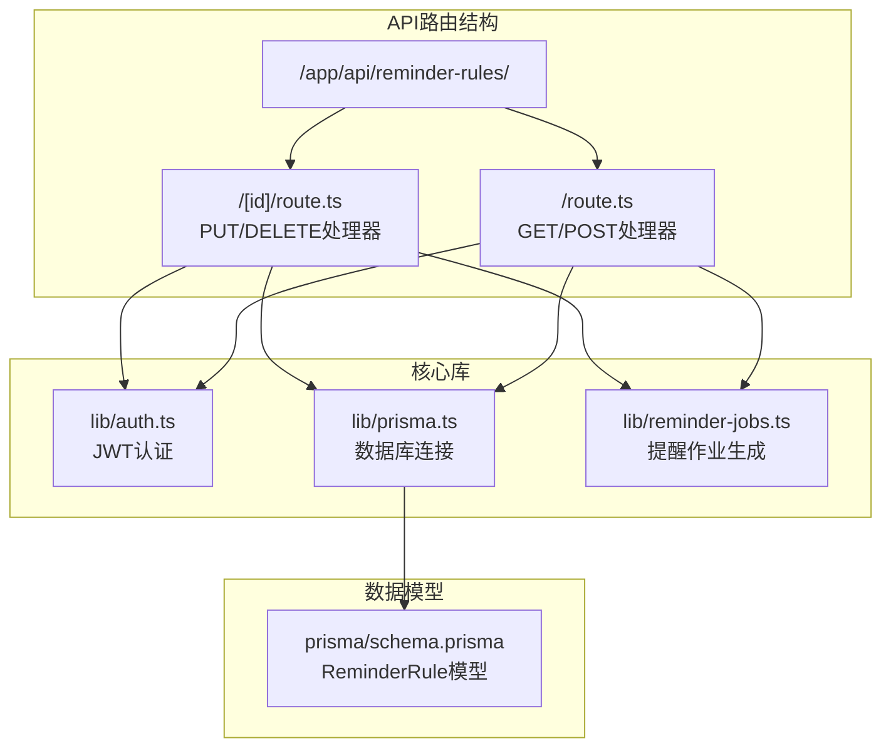
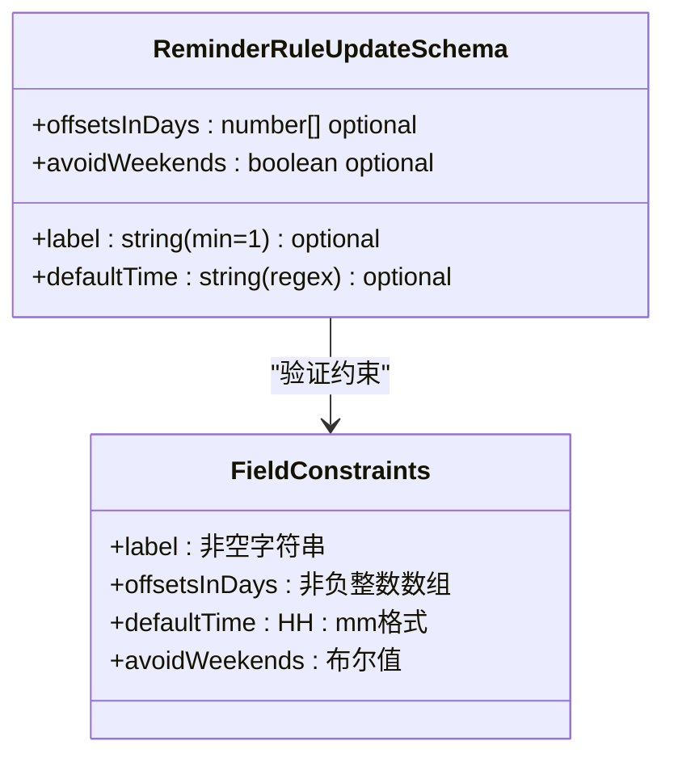
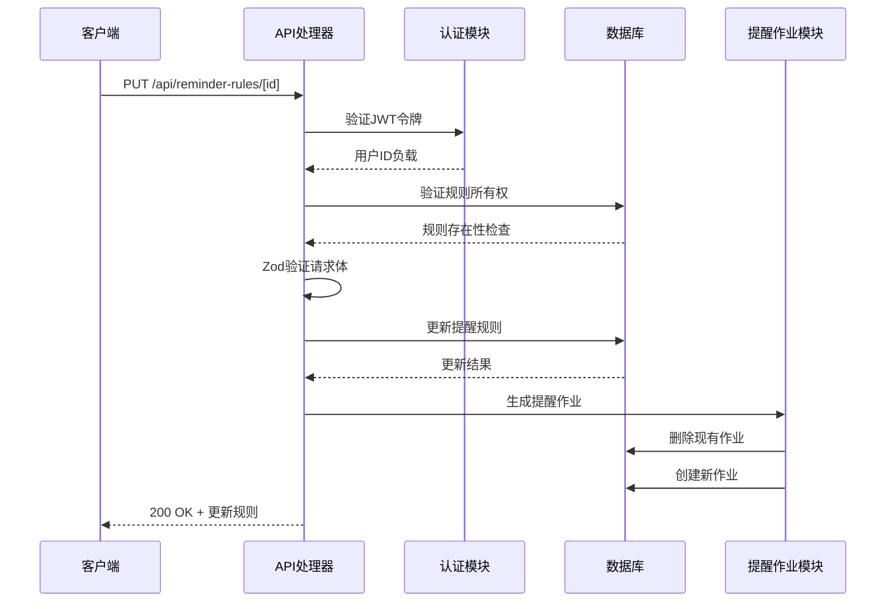
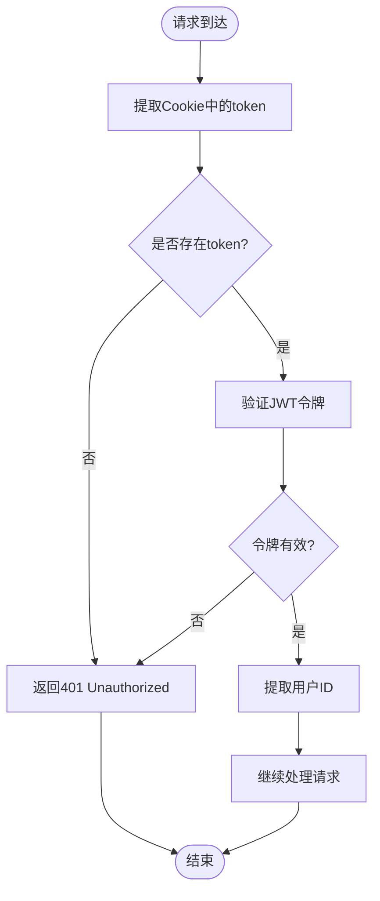
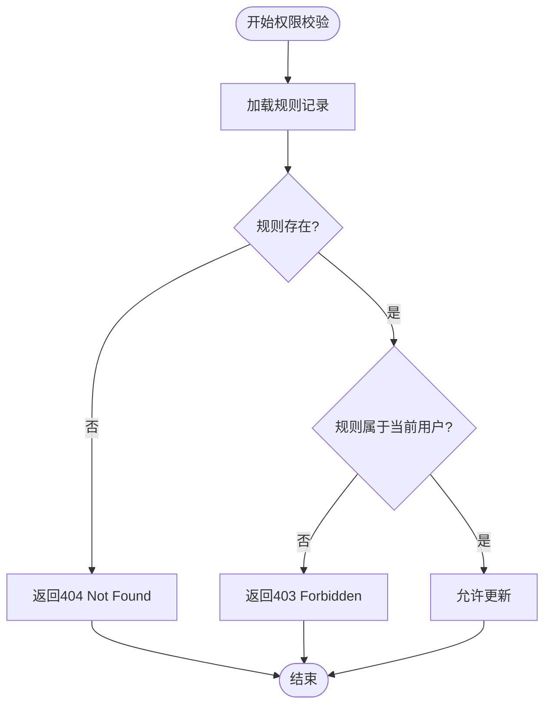
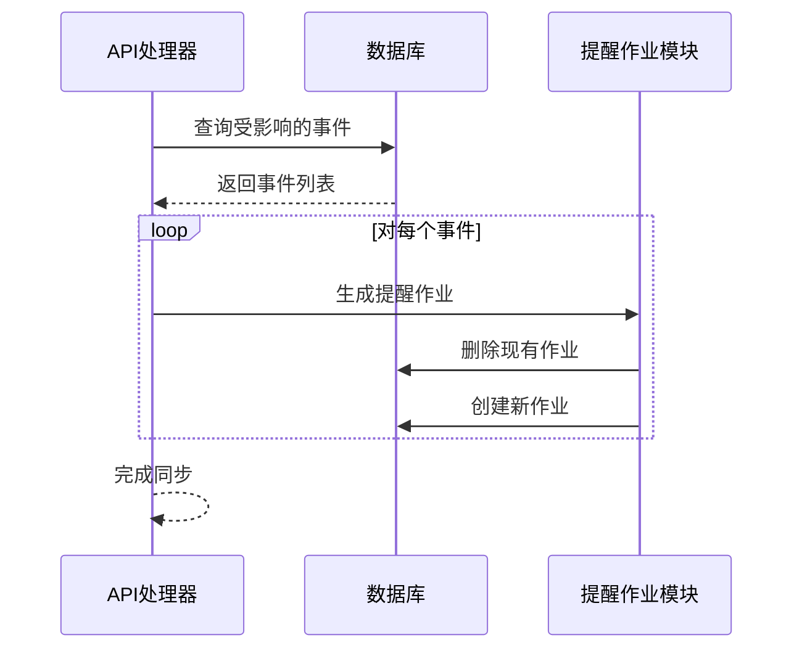
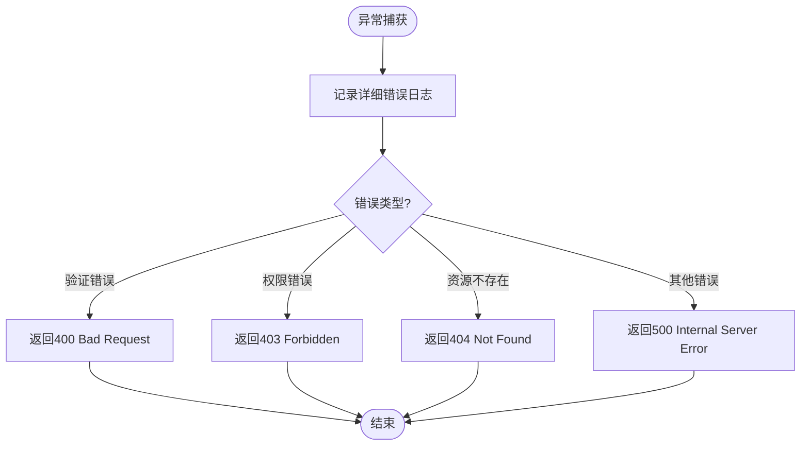
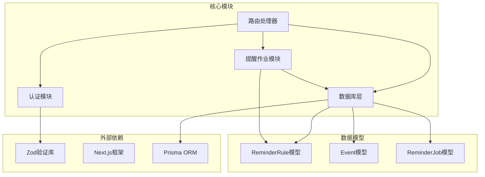

# 更新提醒规则 (PUT)

<cite>
**本文档引用的文件**
- [app/api/reminder-rules/[id]/route.ts](file://app/api/reminder-rules/[id]/route.ts)
- [lib/auth.ts](file://lib/auth.ts)
- [lib/prisma.ts](file://lib/prisma.ts)
- [lib/reminder-jobs.ts](file://lib/reminder-jobs.ts)
- [prisma/schema.prisma](file://prisma/schema.prisma)
- [app/api/reminder-rules/route.ts](file://app/api/reminder-rules/route.ts)
- [middleware.ts](file://middleware.ts)
</cite>

## 目录
1. [简介](#简介)
2. [项目结构](#项目结构)
3. [核心组件](#核心组件)
4. [架构概览](#架构概览)
5. [详细组件分析](#详细组件分析)
6. [依赖关系分析](#依赖关系分析)
7. [性能考虑](#性能考虑)
8. [故障排除指南](#故障排除指南)
9. [结论](#结论)

## 简介

本文档详细说明了PUT /api/reminder-rules/[id]接口的实现，该接口用于部分更新指定用户的提醒规则。该接口实现了完整的身份验证流程（通过Cookie中的JWT token）、用户权限校验（确保规则归属当前用户），以及基于Zod的请求体验证机制。

## 项目结构

该API位于Next.js应用的API路由结构中，采用按文件系统组织的方式：

**图表来源**
- [app/api/reminder-rules/[id]/route.ts](file://app/api/reminder-rules/[id]/route.ts#L1-L158)
- [app/api/reminder-rules/route.ts](file://app/api/reminder-rules/route.ts#L1-L109)
- [lib/auth.ts](file://lib/auth.ts#L1-L30)
- [lib/prisma.ts](file://lib/prisma.ts#L1-L20)
- [lib/reminder-jobs.ts](file://lib/reminder-jobs.ts#L1-L109)
- [prisma/schema.prisma](file://prisma/schema.prisma#L47-L60)

**章节来源**
- [app/api/reminder-rules/[id]/route.ts](file://app/api/reminder-rules/[id]/route.ts#L1-L158)
- [app/api/reminder-rules/route.ts](file://app/api/reminder-rules/route.ts#L1-L109)

## 核心组件

### 身份验证组件

接口使用基于Cookie的JWT令牌进行身份验证：

- **令牌位置**: Cookie中的'token'键
- **验证方法**: 使用lib/auth.ts中的verifyToken函数
- **令牌内容**: 包含userId的负载
- **中间件保护**: middleware.ts提供全局保护

### 请求体验证组件

使用Zod定义的reminderRuleUpdateSchema进行验证：

**图表来源**
- [app/api/reminder-rules/[id]/route.ts](file://app/api/reminder-rules/[id]/route.ts#L6-L11)

**章节来源**
- [app/api/reminder-rules/[id]/route.ts](file://app/api/reminder-rules/[id]/route.ts#L6-L11)
- [lib/auth.ts](file://lib/auth.ts#L22-L29)

## 架构概览

该接口采用分层架构设计，包含身份验证、业务逻辑、数据访问和副作用处理四个层次：

**图表来源**
- [app/api/reminder-rules/[id]/route.ts](file://app/api/reminder-rules/[id]/route.ts#L13-L92)
- [lib/auth.ts](file://lib/auth.ts#L22-L29)
- [lib/reminder-jobs.ts](file://lib/reminder-jobs.ts#L15-L72)

## 详细组件分析

### 身份验证流程

身份验证采用多层保护机制：

1. **令牌提取**: 从Cookie中获取'token'值
2. **令牌验证**: 使用JWT算法验证令牌有效性
3. **负载解析**: 提取包含userId的用户标识

**图表来源**
- [app/api/reminder-rules/[id]/route.ts](file://app/api/reminder-rules/[id]/route.ts#L17-L26)
- [lib/auth.ts](file://lib/auth.ts#L22-L29)

### 权限校验机制

权限校验确保用户只能更新自己的提醒规则：

**图表来源**
- [app/api/reminder-rules/[id]/route.ts](file://app/api/reminder-rules/[id]/route.ts#L33-L44)

### 请求体验证机制

基于Zod的强类型验证确保数据完整性：

| 字段名 | 类型 | 必填 | 约束条件 | 示例 |
|--------|------|------|----------|------|
| label | string | 可选 | 非空字符串，最小长度1 | "合同" |
| offsetsInDays | number[] | 可选 | 非负整数数组，无上限 | [7, 3, 1] |
| defaultTime | string | 可选 | HH:mm格式的时间字符串 | "10:00" |
| avoidWeekends | boolean | 可选 | 布尔值 | true/false |

**章节来源**
- [app/api/reminder-rules/[id]/route.ts](file://app/api/reminder-rules/[id]/route.ts#L6-L11)

### 更新后副作用处理

当label字段发生变更时，系统会执行同步操作以确保数据一致性：

**图表来源**
- [app/api/reminder-rules/[id]/route.ts](file://app/api/reminder-rules/[id]/route.ts#L58-L82)
- [lib/reminder-jobs.ts](file://lib/reminder-jobs.ts#L15-L72)

**章节来源**
- [app/api/reminder-rules/[id]/route.ts](file://app/api/reminder-rules/[id]/route.ts#L58-L82)

### 错误处理策略

系统采用统一的错误处理机制：

**图表来源**
- [app/api/reminder-rules/[id]/route.ts](file://app/api/reminder-rules/[id]/route.ts#L85-L91)

**章节来源**
- [app/api/reminder-rules/[id]/route.ts](file://app/api/reminder-rules/[id]/route.ts#L85-L91)

## 依赖关系分析

接口的依赖关系图展示了各组件间的交互：

**图表来源**
- [app/api/reminder-rules/[id]/route.ts](file://app/api/reminder-rules/[id]/route.ts#L1-L4)
- [lib/prisma.ts](file://lib/prisma.ts#L1-L20)
- [prisma/schema.prisma](file://prisma/schema.prisma#L47-L74)

**章节来源**
- [app/api/reminder-rules/[id]/route.ts](file://app/api/reminder-rules/[id]/route.ts#L1-L4)
- [lib/prisma.ts](file://lib/prisma.ts#L1-L20)
- [prisma/schema.prisma](file://prisma/schema.prisma#L47-L60)

## 性能考虑

### 数据库查询优化

- **索引利用**: ReminderRule表在(userId, label)上具有唯一索引
- **批量操作**: 事件同步使用批量查询减少数据库往返
- **条件过滤**: 仅查询受影响的事件标签

### 缓存策略

- **令牌验证**: JWT令牌验证在Edge环境中高效执行
- **中间件缓存**: middleware.ts提供快速的令牌存在性检查

### 异步处理

- **并发处理**: 事件同步采用逐个处理避免数据库锁竞争
- **错误隔离**: 单个事件处理失败不影响其他事件

## 故障排除指南

### 常见问题诊断

| 问题类型 | 错误码 | 可能原因 | 解决方案 |
|----------|--------|----------|----------|
| 未授权访问 | 401 | 缺少或无效的JWT令牌 | 检查Cookie中token的存在性和有效性 |
| 权限拒绝 | 403 | 规则不属于当前用户 | 确认用户身份和规则所有权 |
| 规则不存在 | 404 | 规则ID无效或已被删除 | 验证规则ID的正确性 |
| 输入验证失败 | 400 | 请求体格式不正确 | 检查字段类型和格式约束 |
| 服务器错误 | 500 | 内部处理异常 | 查看服务器日志获取详细错误信息 |

### 日志记录策略

系统在以下场景记录详细日志：
- 认证失败
- 权限验证失败  
- 数据库操作异常
- 业务逻辑异常

**章节来源**
- [app/api/reminder-rules/[id]/route.ts](file://app/api/reminder-rules/[id]/route.ts#L85-L91)

## 结论

PUT /api/reminder-rules/[id]接口提供了完整、安全且高效的提醒规则更新功能。通过多层身份验证、严格的输入验证、完善的权限控制和智能的副作用处理，确保了系统的安全性、一致性和可靠性。

该接口的设计充分考虑了用户体验和系统性能，在保证数据完整性的同时提供了灵活的配置选项，支持用户根据个人需求定制提醒规则。