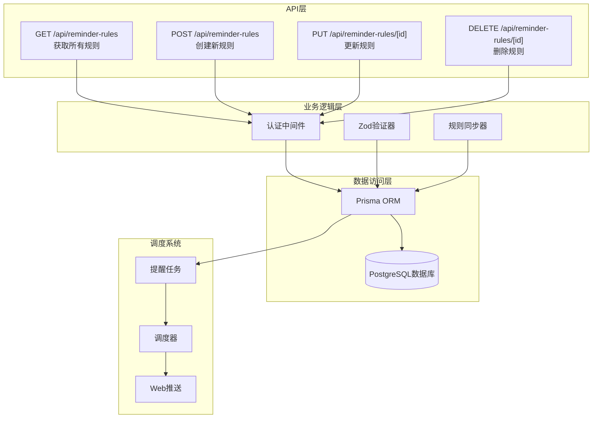
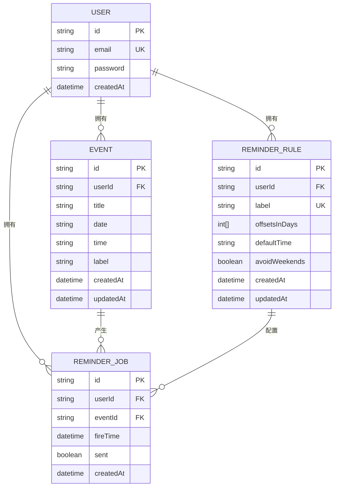
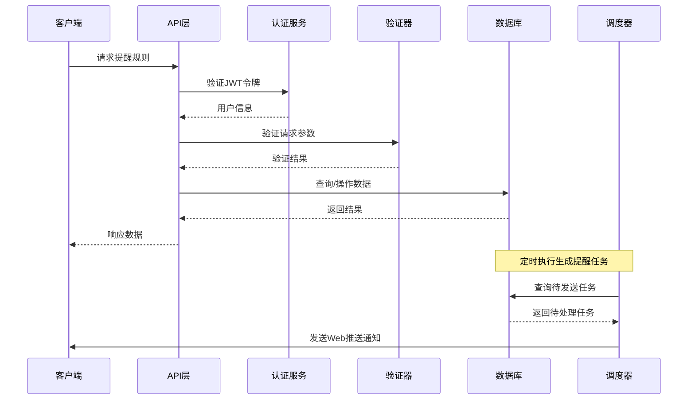
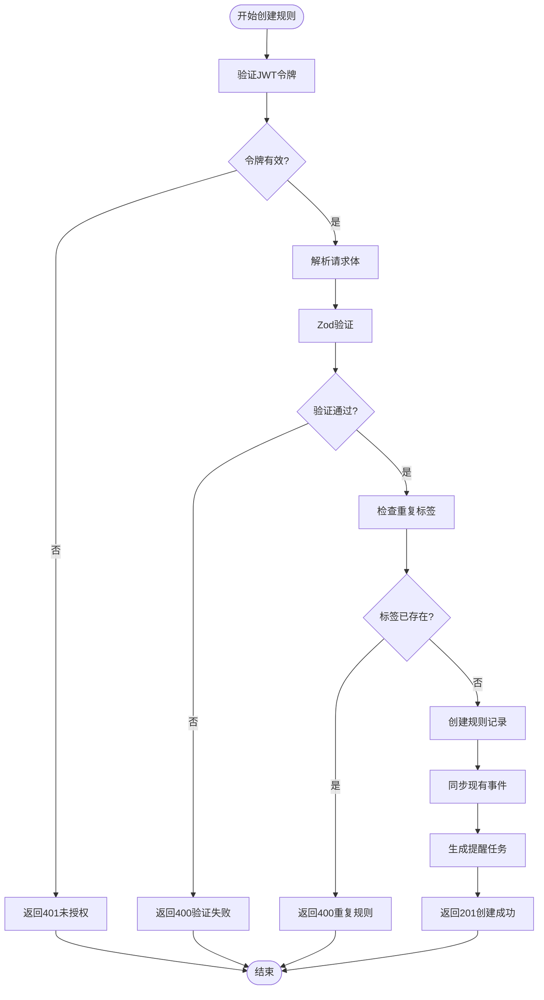
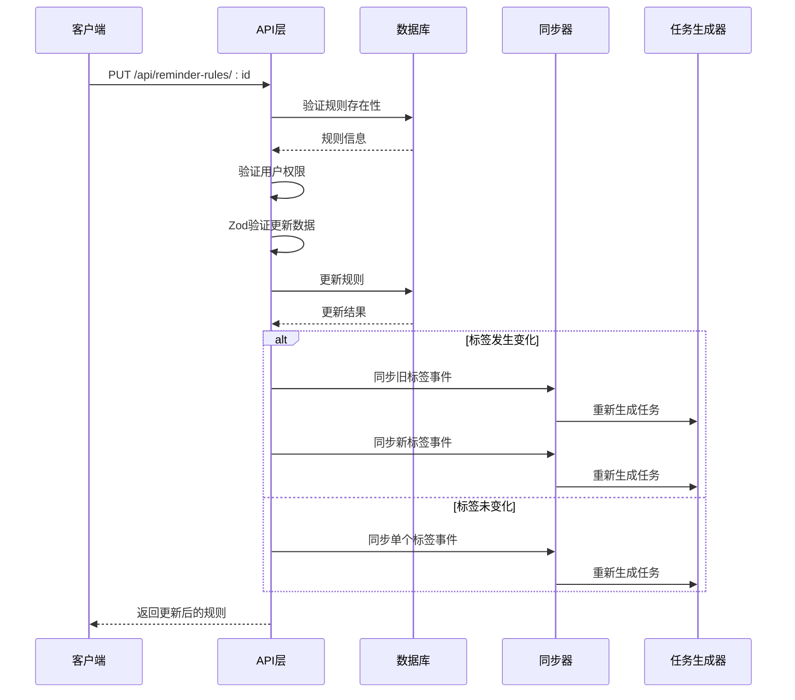
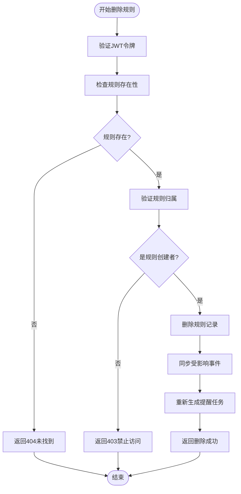
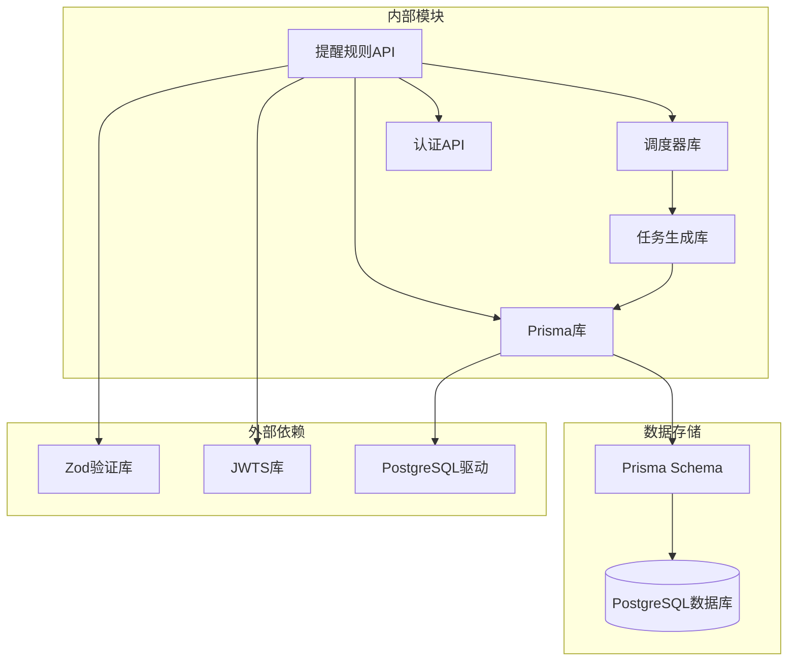
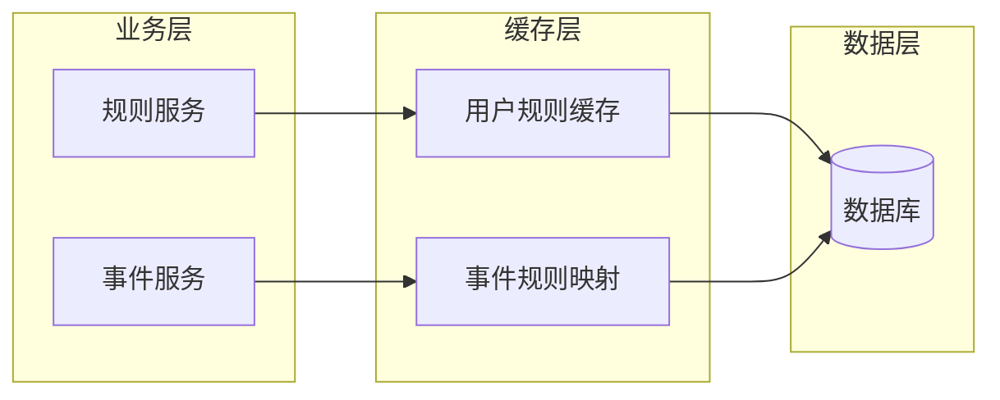

# 提醒规则API

<cite>
**本文档引用的文件**
- [app/api/reminder-rules/route.ts](file://app/api/reminder-rules/route.ts)
- [app/api/reminder-rules/[id]/route.ts](file://app/api/reminder-rules/[id]/route.ts)
- [lib/prisma.ts](file://lib/prisma.ts)
- [lib/scheduler.ts](file://lib/scheduler.ts)
- [lib/reminder-jobs.ts](file://lib/reminder-jobs.ts)
- [prisma/schema.prisma](file://prisma/schema.prisma)
- [lib/auth.ts](file://lib/auth.ts)
- [components/ReminderRuleDialog.tsx](file://components/ReminderRuleDialog.tsx)
- [app/settings/page.tsx](file://app/settings/page.tsx)
- [app/api/scheduler/run/route.ts](file://app/api/scheduler/run/route.ts)
</cite>

## 目录
1. [简介](#简介)
2. [项目结构](#项目结构)
3. [核心组件](#核心组件)
4. [架构概览](#架构概览)
5. [详细组件分析](#详细组件分析)
6. [依赖关系分析](#依赖关系分析)
7. [性能考虑](#性能考虑)
8. [故障排除指南](#故障排除指南)
9. [结论](#结论)

## 简介

提醒规则API是任务管理应用中用于管理事件提醒规则的核心接口。该系统允许用户为不同类型的事件标签设置个性化的提醒策略，包括提前通知天数、默认提醒时间和周末回避功能。系统通过调度器定期检查即将到来的事件并发送Web推送通知。

## 项目结构

提醒规则API位于Next.js应用的API路由中，采用模块化设计：



**图表来源**
- [app/api/reminder-rules/route.ts](file://app/api/reminder-rules/route.ts#L1-L109)
- [app/api/reminder-rules/[id]/route.ts](file://app/api/reminder-rules/[id]/route.ts#L1-L158)
- [lib/reminder-jobs.ts](file://lib/reminder-jobs.ts#L1-L109)

**章节来源**
- [app/api/reminder-rules/route.ts](file://app/api/reminder-rules/route.ts#L1-L109)
- [app/api/reminder-rules/[id]/route.ts](file://app/api/reminder-rules/[id]/route.ts#L1-L158)

## 核心组件

### 数据模型

提醒规则系统基于以下核心数据模型：



**图表来源**
- [prisma/schema.prisma](file://prisma/schema.prisma#L16-L86)

### 验证规则

系统使用Zod进行输入验证，确保数据完整性：

| 字段名 | 类型 | 必填 | 验证规则 | 描述 |
|--------|------|------|----------|------|
| label | string | 是 | min(1) | 规则标签名称，唯一标识 |
| offsetsInDays | number[] | 是 | 数组，非负整数 | 提前通知天数列表 |
| defaultTime | string | 是 | HH:mm格式正则 | 默认提醒时间 |
| avoidWeekends | boolean | 否 | 布尔值 | 是否避开周末 |

**章节来源**
- [prisma/schema.prisma](file://prisma/schema.prisma#L47-L60)
- [app/api/reminder-rules/route.ts](file://app/api/reminder-rules/route.ts#L6-L11)

## 架构概览

提醒规则系统采用分层架构，从API层到数据层的完整流程如下：



**图表来源**
- [app/api/reminder-rules/route.ts](file://app/api/reminder-rules/route.ts#L13-L39)
- [lib/auth.ts](file://lib/auth.ts#L22-L29)
- [lib/reminder-jobs.ts](file://lib/reminder-jobs.ts#L15-L72)

## 详细组件分析

### GET /api/reminder-rules - 获取所有提醒规则

此端点返回当前用户的所有提醒规则，按创建时间倒序排列。

**请求示例**
```javascript
// 请求头
Cookie: token=eyJhbGciOiJIUzI1NiIsInR5cCI6IkpXVCJ9...

// 响应体
{
  "rules": [
    {
      "id": "clq1234567890",
      "label": "contract",
      "offsetsInDays": [7, 3, 1],
      "defaultTime": "10:00",
      "avoidWeekends": false,
      "createdAt": "2024-01-15T10:30:00Z",
      "updatedAt": "2024-01-15T10:30:00Z"
    }
  ]
}
```

**响应字段说明**

| 字段名 | 类型 | 描述 |
|--------|------|------|
| id | string | 规则唯一标识符 |
| label | string | 规则标签名称 |
| offsetsInDays | number[] | 提前通知天数数组 |
| defaultTime | string | 默认提醒时间(HH:mm) |
| avoidWeekends | boolean | 是否避开周末 |
| createdAt | datetime | 创建时间 |
| updatedAt | datetime | 更新时间 |

**状态码**
- 200: 成功获取规则列表
- 401: 未授权访问
- 500: 服务器内部错误

**章节来源**
- [app/api/reminder-rules/route.ts](file://app/api/reminder-rules/route.ts#L13-L39)

### POST /api/reminder-rules - 创建新提醒规则

此端点创建新的提醒规则，包含完整的输入验证和数据库持久化。

**请求体示例**
```javascript
{
  "label": "contract",
  "offsetsInDays": [7, 3, 1],
  "defaultTime": "10:00",
  "avoidWeekends": false
}
```

**处理流程**



**图表来源**
- [app/api/reminder-rules/route.ts](file://app/api/reminder-rules/route.ts#L41-L108)

**验证规则**
- `label`: 必须存在且非空
- `offsetsInDays`: 必须是非负整数数组
- `defaultTime`: 必须符合HH:mm格式的字符串
- `avoidWeekends`: 可选布尔值，默认false

**错误处理**
- 400: 验证失败或重复标签
- 401: 未授权访问
- 500: 服务器内部错误

**章节来源**
- [app/api/reminder-rules/route.ts](file://app/api/reminder-rules/route.ts#L41-L108)

### PUT /api/reminder-rules/[id] - 更新提醒规则

此端点更新指定ID的提醒规则，支持部分更新。

**请求体示例**
```javascript
{
  "label": "updated_contract",
  "offsetsInDays": [14, 7, 1],
  "defaultTime": "09:30",
  "avoidWeekends": true
}
```

**更新逻辑**



**图表来源**
- [app/api/reminder-rules/[id]/route.ts](file://app/api/reminder-rules/[id]/route.ts#L13-L92)

**权限控制**
- 必须是规则的创建者才能更新
- 支持部分字段更新（可选字段）

**错误处理**
- 400: 规则ID缺失或验证失败
- 401: 未授权访问
- 403: 权限不足
- 404: 规则不存在
- 500: 服务器内部错误

**章节来源**
- [app/api/reminder-rules/[id]/route.ts](file://app/api/reminder-rules/[id]/route.ts#L13-L92)

### DELETE /api/reminder-rules/[id] - 删除提醒规则

此端点删除指定ID的提醒规则，并同步影响相关事件。

**删除流程**



**图表来源**
- [app/api/reminder-rules/[id]/route.ts](file://app/api/reminder-rules/[id]/route.ts#L94-L158)

**影响范围**
- 删除规则后，使用该标签的事件将回退到默认提醒规则
- 系统会自动重新生成受影响事件的提醒任务

**错误处理**
- 400: 规则ID缺失
- 401: 未授权访问
- 403: 权限不足
- 404: 规则不存在
- 500: 服务器内部错误

**章节来源**
- [app/api/reminder-rules/[id]/route.ts](file://app/api/reminder-rules/[id]/route.ts#L94-L158)

## 依赖关系分析

提醒规则API的依赖关系图：



**图表来源**
- [app/api/reminder-rules/route.ts](file://app/api/reminder-rules/route.ts#L1-L4)
- [lib/prisma.ts](file://lib/prisma.ts#L1-L20)
- [lib/scheduler.ts](file://lib/scheduler.ts#L1-L3)

**章节来源**
- [lib/prisma.ts](file://lib/prisma.ts#L1-L20)
- [lib/auth.ts](file://lib/auth.ts#L1-L30)

## 性能考虑

### 数据库优化

1. **索引策略**
   - `ReminderRule`: 唯一索引(用户ID, 标签)
   - `ReminderJob`: 复合索引(用户ID, 未发送, 触发时间)

2. **查询优化**
   - 使用`findMany`批量获取规则
   - 限制查询结果数量避免内存溢出
   - 使用事务确保数据一致性

### 缓存策略



### 并发控制

- 使用数据库事务防止并发更新冲突
- 实现乐观锁机制处理高并发场景
- 合理设置连接池大小避免资源耗尽

## 故障排除指南

### 常见错误及解决方案

| 错误类型 | 状态码 | 触发条件 | 解决方案 |
|----------|--------|----------|----------|
| 未授权访问 | 401 | 缺少或无效的JWT令牌 | 检查Cookie中token是否正确设置 |
| 验证失败 | 400 | 请求体不符合Zod模式 | 确认字段类型和格式要求 |
| 规则不存在 | 404 | 规则ID不存在 | 检查规则ID是否正确 |
| 权限不足 | 403 | 非规则创建者尝试修改 | 确保用户身份验证正确 |
| 重复规则 | 400 | 同一标签已存在 | 更换唯一的标签名称 |

### 调试建议

1. **启用详细日志**
   ```javascript
   // 在API层添加请求日志
   console.log('Request:', req.method, req.url, body)
   ```

2. **验证数据库连接**
   ```javascript
   // 检查Prisma连接状态
   await prisma.$queryRaw`SELECT 1`
   ```

3. **监控调度器状态**
   ```javascript
   // 检查提醒任务生成
   const pendingJobs = await getPendingReminderJobs()
   console.log('Pending jobs:', pendingJobs.length)
   ```

**章节来源**
- [app/api/reminder-rules/route.ts](file://app/api/reminder-rules/route.ts#L35-L38)
- [app/api/reminder-rules/[id]/route.ts](file://app/api/reminder-rules/[id]/route.ts#L85-L91)

## 结论

提醒规则API提供了完整的事件提醒管理功能，具有以下特点：

1. **安全性**: 基于JWT的认证机制和严格的权限控制
2. **数据完整性**: 使用Zod进行严格的输入验证
3. **灵活性**: 支持多标签、多提前天数的个性化提醒
4. **实时性**: 通过调度器实现实时提醒通知
5. **可扩展性**: 模块化设计便于功能扩展和维护

系统通过规则与事件标签的关联，实现了智能的提醒策略管理，为用户提供个性化的任务管理体验。调度器的定期运行确保了提醒通知的及时性和准确性。