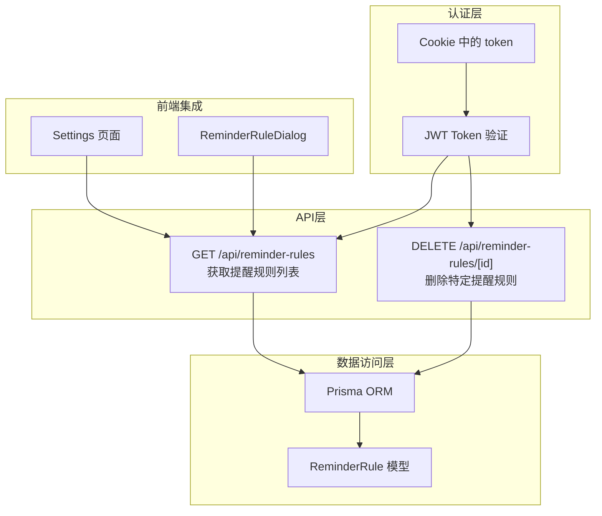
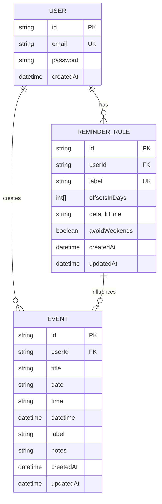
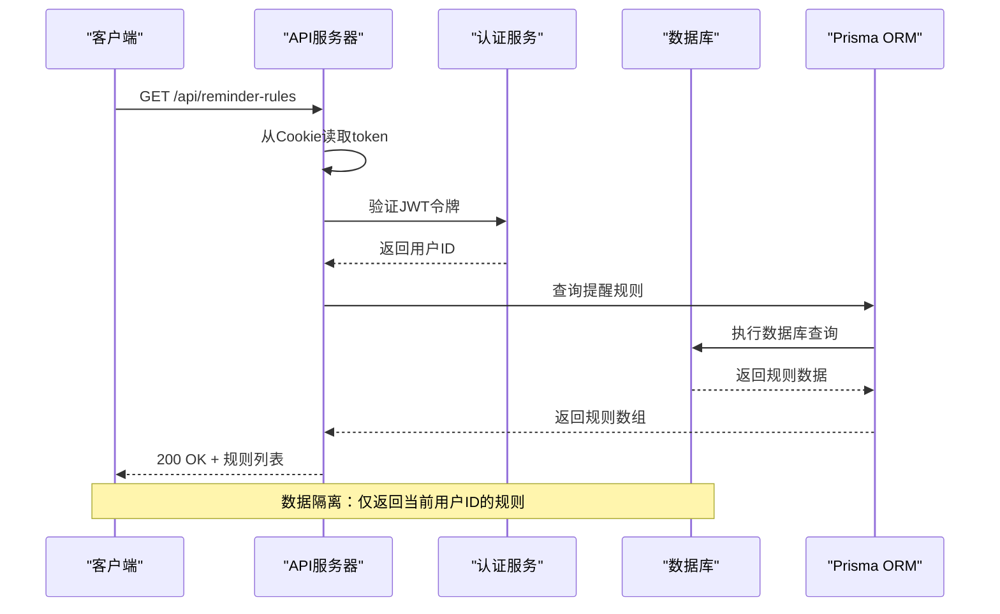
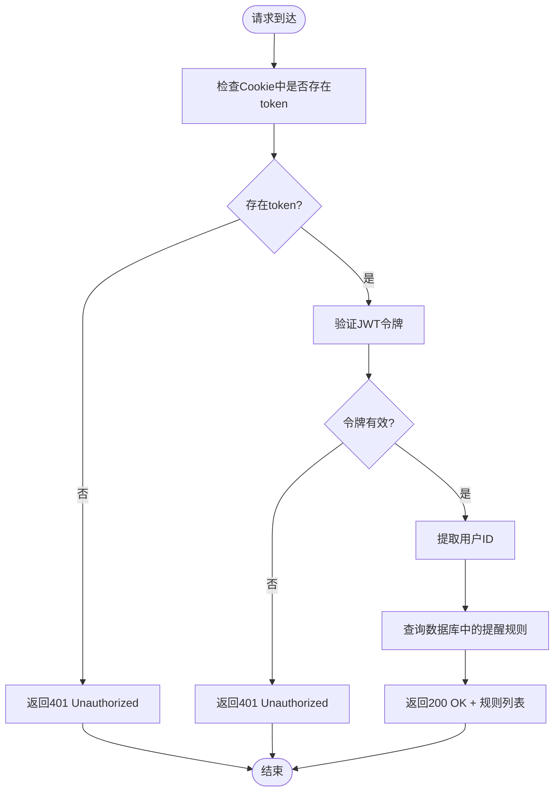
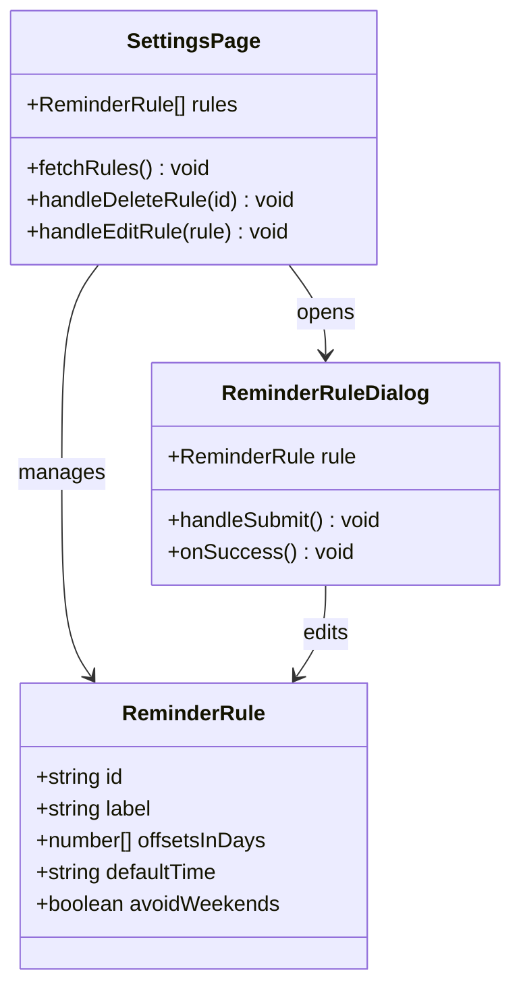
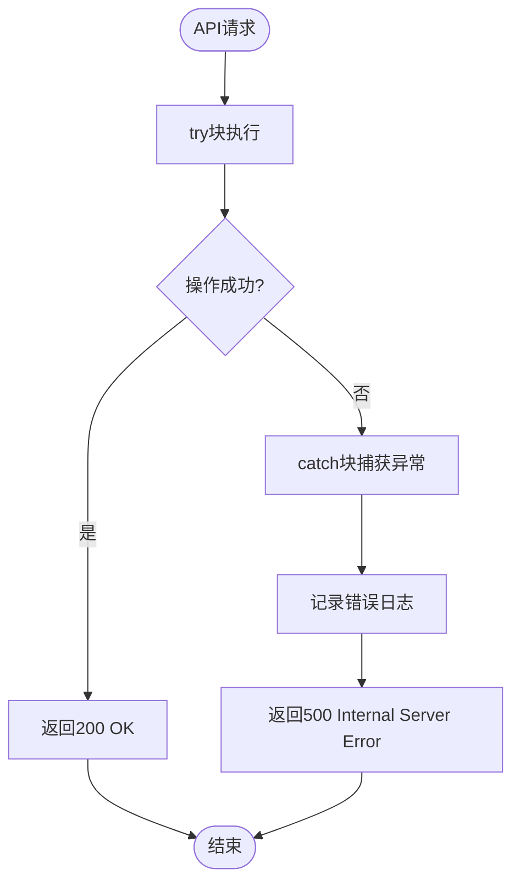
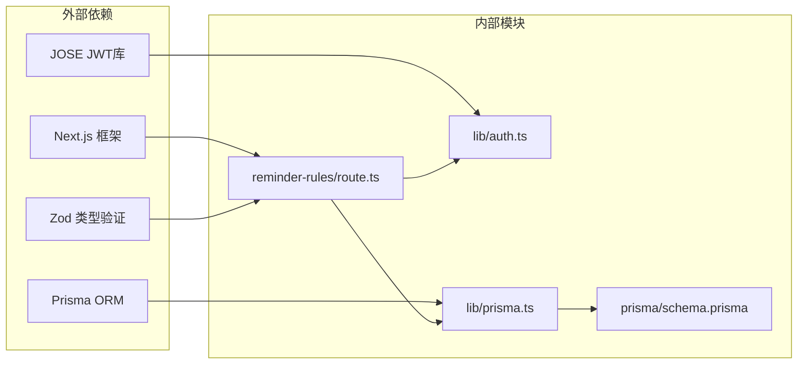

# 提醒规则列表操作

<cite>
**本文档引用的文件**
- [app/api/reminder-rules/route.ts](file://app/api/reminder-rules/route.ts)
- [app/api/reminder-rules/[id]/route.ts](file://app/api/reminder-rules/[id]/route.ts)
- [app/settings/page.tsx](file://app/settings/page.tsx)
- [lib/prisma.ts](file://lib/prisma.ts)
- [lib/auth.ts](file://lib/auth.ts)
- [prisma/schema.prisma](file://prisma/schema.prisma)
- [components/ReminderRuleDialog.tsx](file://components/ReminderRuleDialog.tsx)
</cite>

## 目录
1. [简介](#简介)
2. [项目结构](#项目结构)
3. [核心组件](#核心组件)
4. [架构概览](#架构概览)
5. [详细组件分析](#详细组件分析)
6. [依赖关系分析](#依赖关系分析)
7. [性能考虑](#性能考虑)
8. [故障排除指南](#故障排除指南)
9. [结论](#结论)

## 简介

本文档详细说明了提醒规则列表操作接口（GET /api/reminder-rules）的完整API规范。该端点用于获取当前用户的所有自定义提醒规则，确保数据隔离和安全性，同时提供与前端设置页面的完整类型一致性。

## 项目结构

提醒规则功能涉及以下关键文件和组件：



**图表来源**
- [app/api/reminder-rules/route.ts](file://app/api/reminder-rules/route.ts#L13-L39)
- [app/api/reminder-rules/[id]/route.ts](file://app/api/reminder-rules/[id]/route.ts#L94-L157)
- [lib/auth.ts](file://lib/auth.ts#L22-L29)

## 核心组件

### API端点定义

**端点**: `GET /api/reminder-rules`

**功能**: 获取当前用户的所有自定义提醒规则集合

**请求参数**: 无

**响应格式**: 
```json
{
  "rules": [
    {
      "id": "string",
      "label": "string",
      "offsetsInDays": [number],
      "defaultTime": "HH:mm",
      "avoidWeekends": boolean
    }
  ]
}
```

**章节来源**
- [app/api/reminder-rules/route.ts](file://app/api/reminder-rules/route.ts#L13-L39)

### 认证机制

系统采用基于Cookie的JWT令牌认证机制：

1. **令牌位置**: Cookie中的`token`字段
2. **验证流程**: 
   - 从Cookie中提取JWT令牌
   - 使用`verifyToken`函数验证令牌有效性
   - 从有效载荷中提取`userId`
3. **错误处理**: 验证失败返回401状态码

**章节来源**
- [app/api/reminder-rules/route.ts](file://app/api/reminder-rules/route.ts#L15-L23)
- [lib/auth.ts](file://lib/auth.ts#L22-L29)

### 数据模型

提醒规则的数据模型定义如下：



**图表来源**
- [prisma/schema.prisma](file://prisma/schema.prisma#L47-L60)

**章节来源**
- [prisma/schema.prisma](file://prisma/schema.prisma#L47-L60)

## 架构概览

提醒规则列表操作的完整架构流程：



**图表来源**
- [app/api/reminder-rules/route.ts](file://app/api/reminder-rules/route.ts#L13-L39)
- [lib/prisma.ts](file://lib/prisma.ts#L13-L19)

## 详细组件分析

### 认证与授权流程



**图表来源**
- [app/api/reminder-rules/route.ts](file://app/api/reminder-rules/route.ts#L13-L39)

### 数据查询与排序逻辑

系统使用Prisma ORM执行数据库查询，具有以下特点：

1. **数据隔离**: 通过`userId`过滤确保只返回当前用户的数据
2. **排序规则**: 按`createdAt`降序排列，最新创建的规则显示在最前面
3. **查询优化**: 使用索引优化查询性能

**章节来源**
- [app/api/reminder-rules/route.ts](file://app/api/reminder-rules/route.ts#L25-L32)

### 前端集成与类型一致性

前端设置页面通过以下方式集成API：



**图表来源**
- [app/settings/page.tsx](file://app/settings/page.tsx#L13-L19)
- [components/ReminderRuleDialog.tsx](file://components/ReminderRuleDialog.tsx#L10-L16)

**章节来源**
- [app/settings/page.tsx](file://app/settings/page.tsx#L48-L60)
- [components/ReminderRuleDialog.tsx](file://components/ReminderRuleDialog.tsx#L55-L99)

### 错误处理机制

系统实现了完善的错误处理策略：



**图表来源**
- [app/api/reminder-rules/route.ts](file://app/api/reminder-rules/route.ts#L35-L38)

**章节来源**
- [app/api/reminder-rules/route.ts](file://app/api/reminder-rules/route.ts#L35-L38)

## 依赖关系分析

提醒规则API的依赖关系图：



**图表来源**
- [app/api/reminder-rules/route.ts](file://app/api/reminder-rules/route.ts#L1-L4)
- [lib/auth.ts](file://lib/auth.ts#L1-L30)
- [lib/prisma.ts](file://lib/prisma.ts#L1-L20)

**章节来源**
- [app/api/reminder-rules/route.ts](file://app/api/reminder-rules/route.ts#L1-L4)
- [lib/auth.ts](file://lib/auth.ts#L1-L30)
- [lib/prisma.ts](file://lib/prisma.ts#L1-L20)

## 性能考虑

### 查询性能优化

1. **索引利用**: 
   - `ReminderRule`模型在`userId`上建立了唯一约束
   - 查询时自动利用索引提高性能

2. **查询范围限制**:
   - 仅查询当前用户的规则，避免全表扫描
   - 使用`orderBy`指定排序字段，利用数据库索引

3. **数据量控制**:
   - 提醒规则数量通常较少（每个用户几条到几十条）
   - 无需分页，单次查询即可完成

### 缓存策略建议

由于提醒规则数据量小且变化频率低，建议：

1. **前端缓存**:
   - 设置合理的缓存时间（如5-10分钟）
   - 在用户操作规则后主动刷新缓存

2. **CDN缓存**:
   - 可以考虑使用CDN缓存静态内容
   - 对于动态数据，建议使用边缘缓存

3. **数据库连接池**:
   - Prisma已内置连接池管理
   - 建议监控连接池使用情况

## 故障排除指南

### 常见问题及解决方案

| 问题类型 | 症状 | 可能原因 | 解决方案 |
|---------|------|----------|----------|
| 认证失败 | 401 Unauthorized | Cookie中缺少token或token无效 | 检查登录状态，重新登录 |
| 权限不足 | 403 Forbidden | token有效但用户ID不匹配 | 确认当前登录用户身份 |
| 数据库错误 | 500 Internal Server Error | 数据库连接或查询异常 | 检查数据库连接，查看服务器日志 |
| 参数验证失败 | 400 Bad Request | 请求参数不符合schema要求 | 检查请求格式，确保符合验证规则 |

### 调试步骤

1. **检查网络请求**:
   ```bash
   curl -i -H "Cookie: token=YOUR_JWT_TOKEN" https://your-domain.com/api/reminder-rules
   ```

2. **查看服务器日志**:
   - 检查认证验证过程
   - 监控数据库查询性能

3. **前端调试**:
   - 使用浏览器开发者工具查看Network面板
   - 检查响应头中的Cookie设置

**章节来源**
- [app/api/reminder-rules/route.ts](file://app/api/reminder-rules/route.ts#L15-L23)
- [app/api/reminder-rules/[id]/route.ts](file://app/api/reminder-rules/[id]/route.ts#L99-L125)

## 结论

提醒规则列表操作接口设计简洁高效，具有以下优势：

1. **安全性**: 完善的JWT认证机制确保数据隔离
2. **性能**: 针对小数据量场景优化，无需分页
3. **一致性**: 前后端类型完全一致，减少集成风险
4. **可维护性**: 清晰的错误处理和日志记录

该接口为用户提供了便捷的提醒规则管理功能，支持个性化提醒配置，提升了整体用户体验。