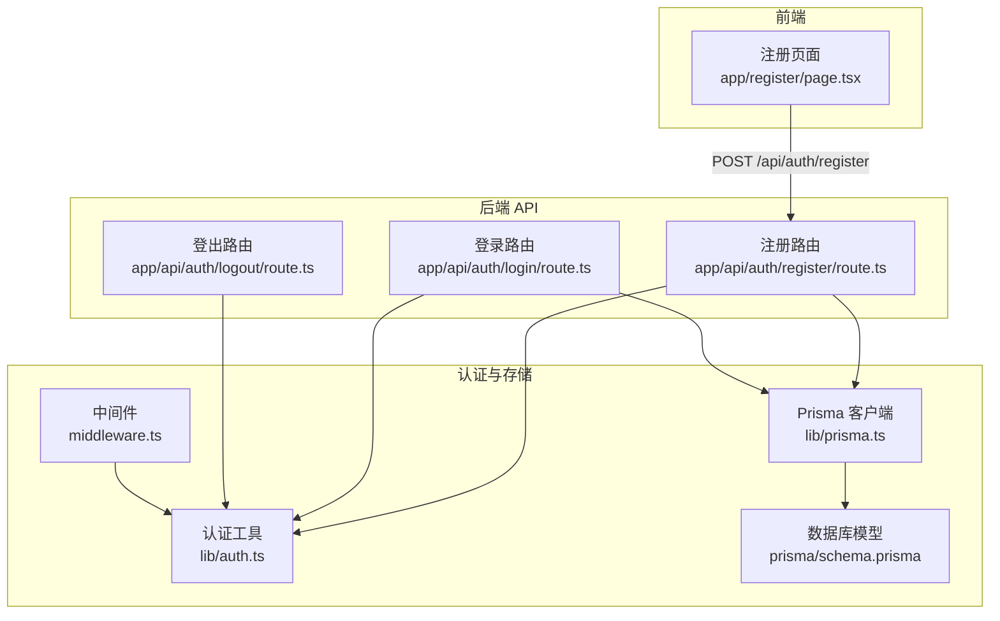
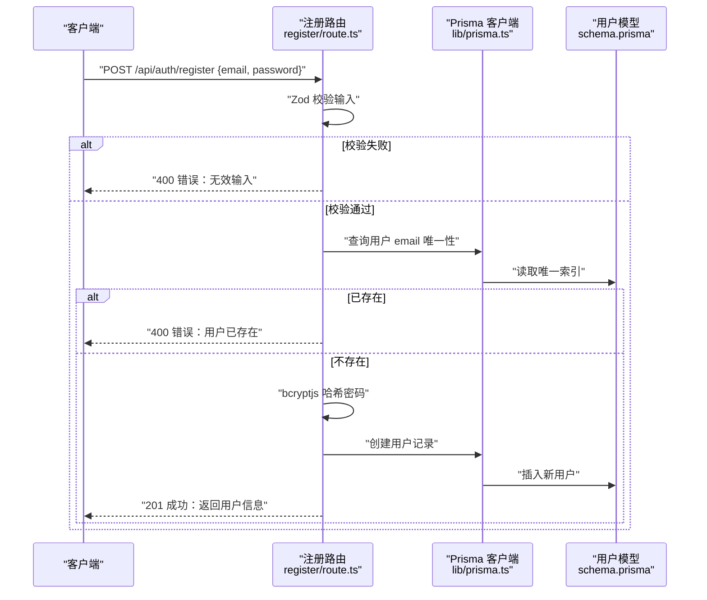
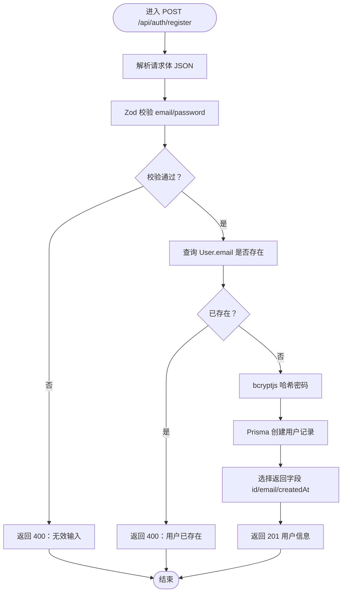
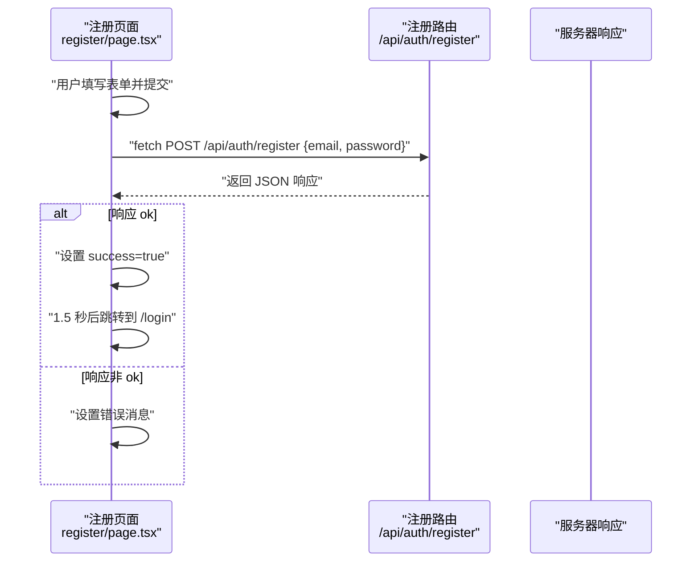
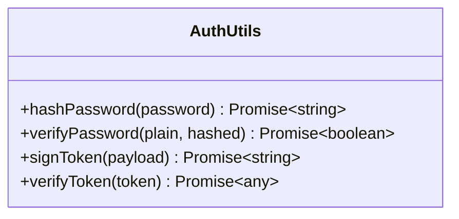
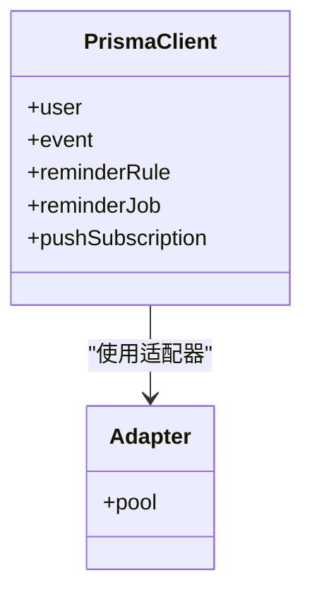
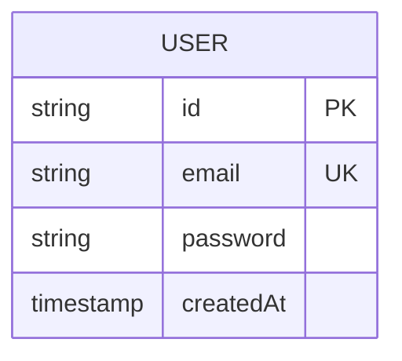
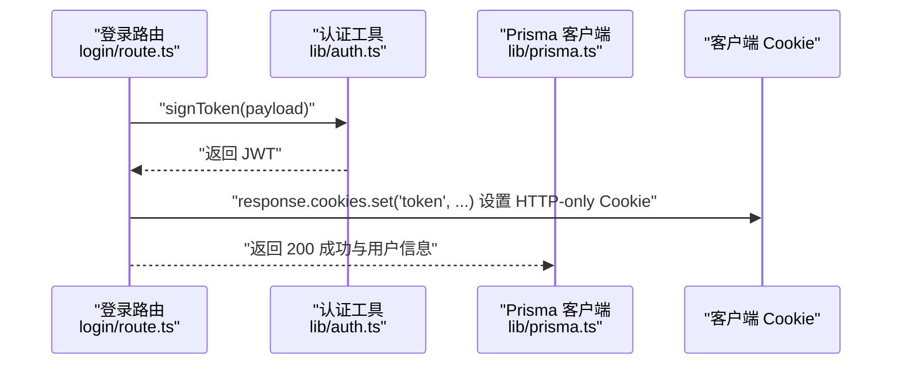
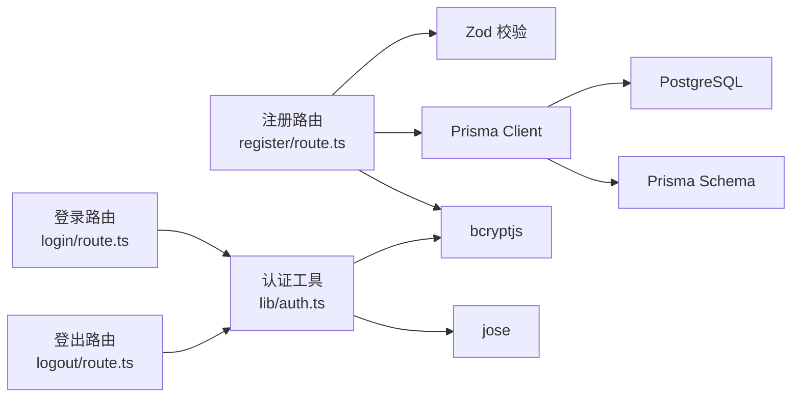

# 注册接口

<cite>
**本文引用的文件**
- [app/api/auth/register/route.ts](file://app/api/auth/register/route.ts)
- [app/register/page.tsx](file://app/register/page.tsx)
- [lib/auth.ts](file://lib/auth.ts)
- [lib/prisma.ts](file://lib/prisma.ts)
- [prisma/schema.prisma](file://prisma/schema.prisma)
- [app/api/auth/login/route.ts](file://app/api/auth/login/route.ts)
- [app/api/auth/logout/route.ts](file://app/api/auth/logout/route.ts)
- [middleware.ts](file://middleware.ts)
- [package.json](file://package.json)
</cite>

## 目录
1. [简介](#简介)
2. [项目结构](#项目结构)
3. [核心组件](#核心组件)
4. [架构总览](#架构总览)
5. [详细组件分析](#详细组件分析)
6. [依赖关系分析](#依赖关系分析)
7. [性能考量](#性能考量)
8. [故障排查指南](#故障排查指南)
9. [结论](#结论)
10. [附录](#附录)

## 简介
本文件为 todo-csv-import 项目的注册接口（/api/auth/register）提供完整的API文档。内容涵盖：
- 请求参数接收与校验（name、email、password 的处理与 Zod 校验）
- 使用 Prisma Client 检查邮箱唯一性约束（User 模型）
- 使用 bcryptjs 对密码进行安全哈希处理
- 注册成功后的自动登录流程（生成 JWT 并通过 HTTP-only Cookie 返回）
- 响应格式说明（成功与错误场景）
- curl 测试示例
- 前端注册页面（register/page.tsx）表单提交逻辑关联
- 输入校验（Zod）与数据库约束在保障数据完整性方面的协同作用

## 项目结构
注册接口位于 Next.js App Router 的 API 路由中，前端注册页面采用客户端组件与 react-hook-form 集成 Zod 进行表单校验。认证相关的工具函数（密码哈希、JWT 签发与校验）集中在 lib 层，数据库访问通过 Prisma 客户端完成。

图表来源
- [app/register/page.tsx](file://app/register/page.tsx#L39-L63)
- [app/api/auth/register/route.ts](file://app/api/auth/register/route.ts#L11-L52)
- [app/api/auth/login/route.ts](file://app/api/auth/login/route.ts#L11-L56)
- [app/api/auth/logout/route.ts](file://app/api/auth/logout/route.ts#L3-L13)
- [lib/auth.ts](file://lib/auth.ts#L1-L30)
- [lib/prisma.ts](file://lib/prisma.ts#L1-L20)
- [prisma/schema.prisma](file://prisma/schema.prisma#L16-L26)
- [middleware.ts](file://middleware.ts#L1-L49)

章节来源
- [app/register/page.tsx](file://app/register/page.tsx#L1-L138)
- [app/api/auth/register/route.ts](file://app/api/auth/register/route.ts#L1-L53)
- [lib/auth.ts](file://lib/auth.ts#L1-L30)
- [lib/prisma.ts](file://lib/prisma.ts#L1-L20)
- [prisma/schema.prisma](file://prisma/schema.prisma#L16-L26)
- [middleware.ts](file://middleware.ts#L1-L49)

## 核心组件
- 注册 API 路由：负责接收请求体、执行 Zod 校验、检查邮箱唯一性、哈希密码、创建用户、返回标准化响应。
- 认证工具库：提供密码哈希、密码验证、JWT 签发与校验等能力。
- Prisma 客户端：封装 PostgreSQL 连接与查询，提供类型安全的数据访问。
- 数据库模型：User 模型定义了邮箱唯一性约束，确保数据完整性。
- 登录/登出路由：展示 JWT 令牌通过 HTTP-only Cookie 返回的实践，便于理解注册成功后的会话机制。
- 中间件：统一校验受保护路径的令牌有效性，保障应用安全。

章节来源
- [app/api/auth/register/route.ts](file://app/api/auth/register/route.ts#L11-L52)
- [lib/auth.ts](file://lib/auth.ts#L6-L29)
- [lib/prisma.ts](file://lib/prisma.ts#L13-L19)
- [prisma/schema.prisma](file://prisma/schema.prisma#L16-L26)
- [app/api/auth/login/route.ts](file://app/api/auth/login/route.ts#L35-L51)
- [app/api/auth/logout/route.ts](file://app/api/auth/logout/route.ts#L3-L13)
- [middleware.ts](file://middleware.ts#L5-L44)

## 架构总览
注册流程从客户端发起 POST 请求到 /api/auth/register，后端依次执行：
- 解析请求体并使用 Zod 校验 email 与 password
- 查询数据库确认邮箱是否已存在（基于 User 模型的唯一索引）
- 使用 bcryptjs 对明文密码进行哈希
- 创建用户记录并返回用户信息（仅包含必要字段）
- 注意：当前注册接口未直接返回 JWT 与设置 Cookie；若需自动登录，可参考登录路由的实现模式

图表来源
- [app/api/auth/register/route.ts](file://app/api/auth/register/route.ts#L11-L52)
- [lib/prisma.ts](file://lib/prisma.ts#L13-L19)
- [prisma/schema.prisma](file://prisma/schema.prisma#L16-L26)

## 详细组件分析

### 注册 API 路由（/api/auth/register）
- 请求方法：POST
- 请求体字段：
  - email：字符串，必须符合邮箱格式
  - password：字符串，最小长度为 6
- 处理流程：
  - 解析 JSON 请求体
  - 使用 Zod schema 校验 email 与 password
  - 查询 Prisma User 模型以检查邮箱唯一性
  - 若邮箱已存在，返回 400 冲突错误
  - 使用 bcryptjs 对密码进行哈希
  - 创建用户记录，返回 201 与用户信息（id、email、createdAt）
  - 异常捕获：记录错误并返回 500

图表来源
- [app/api/auth/register/route.ts](file://app/api/auth/register/route.ts#L11-L52)

章节来源
- [app/api/auth/register/route.ts](file://app/api/auth/register/route.ts#L6-L44)

### 前端注册页面（register/page.tsx）
- 使用 react-hook-form 与 Zod schema 实现表单校验
- 字段包括 email、password、confirmPassword，并进行二次密码一致性校验
- 提交时调用 /api/auth/register，处理响应并根据状态码更新 UI 或错误提示
- 成功后延迟跳转至 /login 页面

图表来源
- [app/register/page.tsx](file://app/register/page.tsx#L39-L63)

章节来源
- [app/register/page.tsx](file://app/register/page.tsx#L14-L63)

### 认证工具库（lib/auth.ts）
- 密码哈希：使用 bcryptjs，成本因子为 10
- 密码验证：比较明文与哈希值
- JWT 签发：使用 HS256 算法，有效期 24 小时
- JWT 校验：验证签名与过期时间

图表来源
- [lib/auth.ts](file://lib/auth.ts#L6-L29)

章节来源
- [lib/auth.ts](file://lib/auth.ts#L1-L30)

### Prisma 客户端（lib/prisma.ts）
- 通过 @prisma/adapter-pg 连接 PostgreSQL
- 在开发环境缓存 PrismaClient 实例，避免重复初始化
- 用于 User 模型的查询与创建

图表来源
- [lib/prisma.ts](file://lib/prisma.ts#L13-L19)

章节来源
- [lib/prisma.ts](file://lib/prisma.ts#L1-L20)

### 数据库模型（prisma/schema.prisma）
- User 模型定义：
  - id：主键
  - email：唯一索引
  - password：存储哈希后的密码
  - createdAt：默认当前时间
- 该唯一性约束与后端查询共同保障邮箱唯一性

图表来源
- [prisma/schema.prisma](file://prisma/schema.prisma#L16-L26)

章节来源
- [prisma/schema.prisma](file://prisma/schema.prisma#L16-L26)

### 自动登录与 Cookie（参考登录路由）
- 登录路由展示了如何签发 JWT 并通过 HTTP-only Cookie 返回
- 注册接口当前未直接返回令牌与设置 Cookie；若需自动登录，可参考登录路由的实现模式（签发令牌、设置 Cookie）

图表来源
- [app/api/auth/login/route.ts](file://app/api/auth/login/route.ts#L35-L51)
- [lib/auth.ts](file://lib/auth.ts#L14-L20)
- [lib/prisma.ts](file://lib/prisma.ts#L13-L19)

章节来源
- [app/api/auth/login/route.ts](file://app/api/auth/login/route.ts#L11-L56)
- [lib/auth.ts](file://lib/auth.ts#L14-L20)

## 依赖关系分析
- 注册路由依赖：
  - Zod：输入校验
  - Prisma Client：查询与创建用户
  - bcryptjs：密码哈希
- 认证工具库依赖：
  - bcryptjs：密码哈希与验证
  - jose：JWT 签发与校验
- 数据库层依赖：
  - PostgreSQL：通过 @prisma/adapter-pg 连接
  - Prisma Client：类型化查询与模型操作

图表来源
- [app/api/auth/register/route.ts](file://app/api/auth/register/route.ts#L1-L4)
- [app/api/auth/login/route.ts](file://app/api/auth/login/route.ts#L1-L4)
- [app/api/auth/logout/route.ts](file://app/api/auth/logout/route.ts#L1-L3)
- [lib/auth.ts](file://lib/auth.ts#L1-L2)
- [lib/prisma.ts](file://lib/prisma.ts#L1-L3)
- [prisma/schema.prisma](file://prisma/schema.prisma#L1-L9)

章节来源
- [package.json](file://package.json#L11-L36)
- [app/api/auth/register/route.ts](file://app/api/auth/register/route.ts#L1-L4)
- [lib/auth.ts](file://lib/auth.ts#L1-L2)
- [lib/prisma.ts](file://lib/prisma.ts#L1-L3)
- [prisma/schema.prisma](file://prisma/schema.prisma#L1-L9)

## 性能考量
- 密码哈希成本因子为 10，平衡安全性与性能；可根据硬件条件调整
- Prisma 查询使用唯一索引（email）进行存在性检查，时间复杂度 O(log n)
- 建议：
  - 在高并发场景下，考虑对邮箱查询与创建操作使用事务或幂等设计
  - 对于频繁的输入校验，保持 Zod schema 的简洁与明确，避免过度复杂的规则链

## 故障排查指南
- 400 错误：无效输入
  - 可能原因：email 不符合格式或 password 长度不足
  - 排查步骤：检查前端表单与后端 Zod schema 的字段要求
- 400 错误：用户已存在
  - 可能原因：邮箱已被注册
  - 排查步骤：确认数据库 User.email 唯一性约束是否生效
- 500 错误：内部服务器错误
  - 可能原因：数据库连接异常、Prisma 查询失败、哈希过程异常
  - 排查步骤：查看后端日志，确认 Prisma 与数据库连接配置

章节来源
- [app/api/auth/register/route.ts](file://app/api/auth/register/route.ts#L16-L50)

## 结论
注册接口通过 Zod 输入校验与 Prisma 唯一性约束双重保障数据完整性，使用 bcryptjs 实现安全的密码存储。当前注册流程返回用户信息但未直接设置 Cookie；若需实现“注册即登录”，可参考登录路由的 JWT 签发与 Cookie 设置模式。整体架构清晰、职责分离，具备良好的扩展性与安全性基础。

## 附录

### API 规范与响应格式
- 端点：POST /api/auth/register
- 请求头：Content-Type: application/json
- 请求体字段：
  - email：字符串，必须为有效邮箱格式
  - password：字符串，最小长度为 6
- 成功响应（201 Created）：
  - 返回对象包含 user 字段，包含 id、email、createdAt
- 错误响应：
  - 400 Bad Request：无效输入或用户已存在
  - 500 Internal Server Error：服务器内部错误

章节来源
- [app/api/auth/register/route.ts](file://app/api/auth/register/route.ts#L6-L44)

### curl 测试示例
- 成功注册示例：
  - curl -X POST https://your-domain.com/api/auth/register -H "Content-Type: application/json" -d '{"email":"test@example.com","password":"your_password"}'
- 失败示例（无效邮箱）：
  - curl -X POST https://your-domain.com/api/auth/register -H "Content-Type: application/json" -d '{"email":"invalid-email","password":"123456"}'

### 前端表单提交逻辑关联
- 前端注册页面使用 react-hook-form 与 Zod schema 校验，提交时仅发送 email 与 password
- 后端注册路由严格校验并拒绝不符合要求的请求
- 建议：若需要“注册即登录”，可在前端收到 201 后继续调用登录接口或在后端补充自动登录逻辑

章节来源
- [app/register/page.tsx](file://app/register/page.tsx#L39-L63)
- [app/api/auth/register/route.ts](file://app/api/auth/register/route.ts#L11-L52)