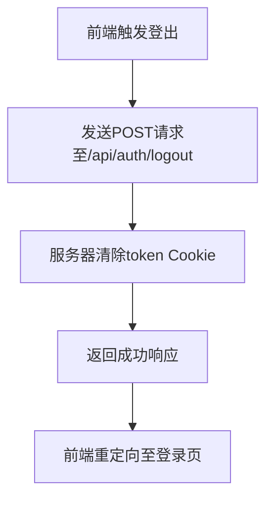
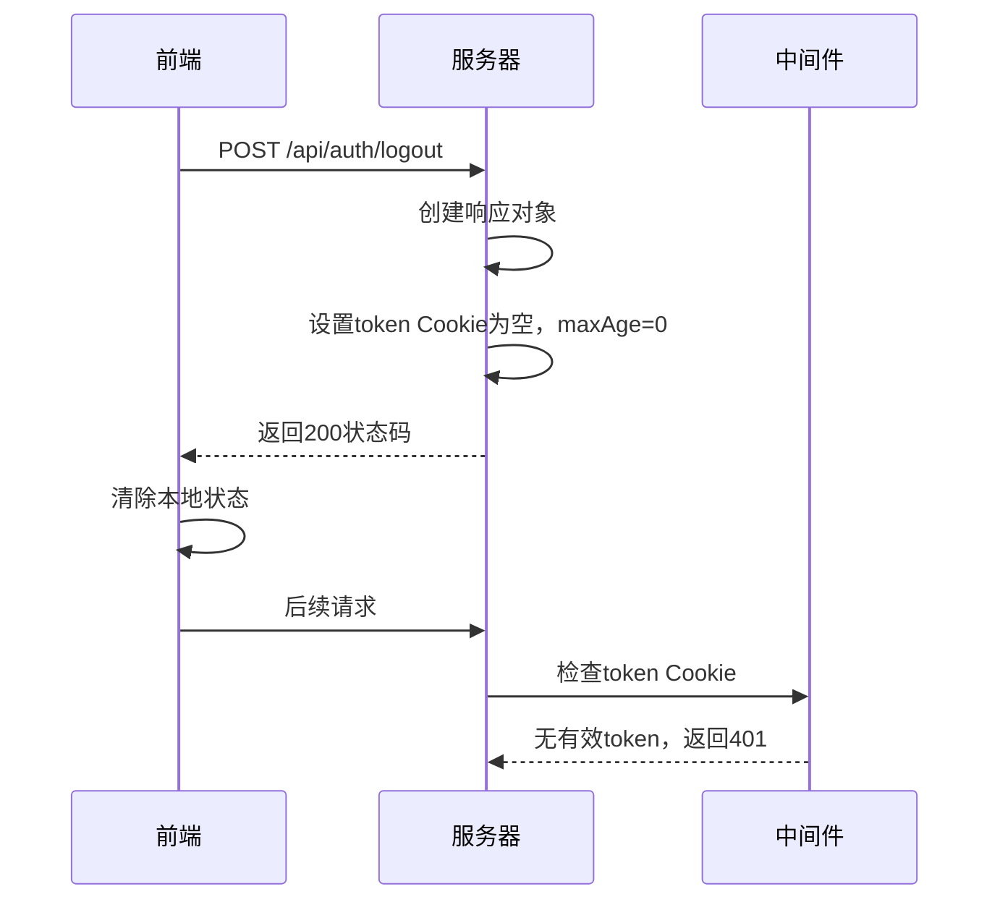
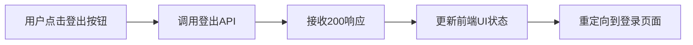
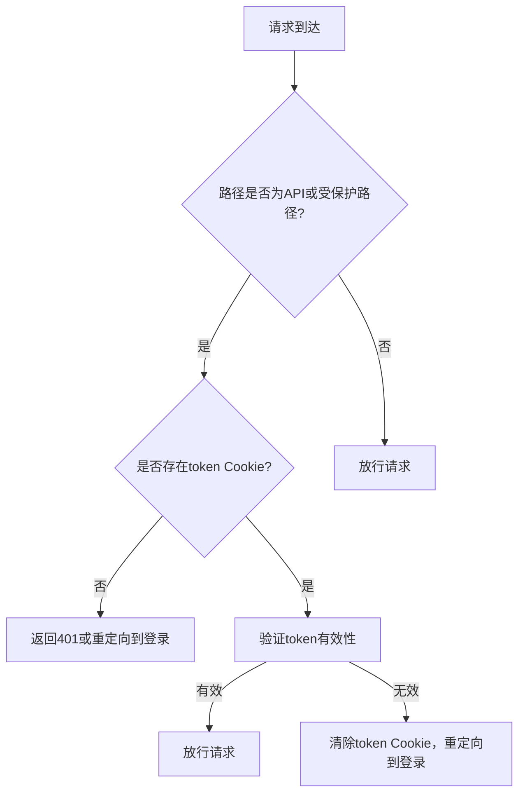

# 登出接口

<cite>
**本文档引用的文件**   
- [route.ts](file://app/api/auth/logout/route.ts)
- [middleware.ts](file://middleware.ts)
- [auth.ts](file://lib/auth.ts)
- [calendar/page.tsx](file://app/calendar/page.tsx)
- [settings/page.tsx](file://app/settings/page.tsx)
</cite>

## 目录
1. [简介](#简介)
2. [接口设计](#接口设计)
3. [会话清除机制](#会话清除机制)
4. [前端触发逻辑](#前端触发逻辑)
5. [响应状态码](#响应状态码)
6. [curl命令示例](#curl命令示例)
7. [认证逻辑集成](#认证逻辑集成)
8. [多设备场景限制](#多设备场景限制)
9. [扩展建议](#扩展建议)

## 简介
本API文档详细说明了todo-csv-import应用中的登出接口（/api/auth/logout）的设计与实现。该接口通过清除HTTP-only Cookie来安全地终止用户当前会话，确保用户身份信息不会被恶意访问。结合前端导航逻辑和中间件认证机制，实现了完整的用户退出流程。

**Section sources**
- [route.ts](file://app/api/auth/logout/route.ts#L1-L13)
- [middleware.ts](file://middleware.ts#L1-L50)

## 接口设计
登出接口设计为无请求体的POST请求，位于`/api/auth/logout`路径。该接口不接受任何输入参数，采用简单直接的设计原则，专注于会话清除这一单一职责。



**Diagram sources**
- [route.ts](file://app/api/auth/logout/route.ts#L3-L13)

**Section sources**
- [route.ts](file://app/api/auth/logout/route.ts#L3-L13)

## 会话清除机制
登出接口通过将名为`token`的Cookie值设置为空字符串，并将其`maxAge`设为0来实现会话清除。该Cookie配置为HTTP-only，防止JavaScript访问，增强了安全性。同时设置了`secure`标志（在生产环境中）和`sameSite=lax`属性，进一步保护会话安全。



**Diagram sources**
- [route.ts](file://app/api/auth/logout/route.ts#L4-L11)
- [middleware.ts](file://middleware.ts#L6-L28)

**Section sources**
- [route.ts](file://app/api/auth/logout/route.ts#L4-L11)
- [middleware.ts](file://middleware.ts#L6-L28)

## 前端触发逻辑
虽然项目中未发现显式的导航栏组件，但登出功能可通过前端页面中的按钮触发。例如，在设置页面（settings/page.tsx）中包含返回日历的按钮，类似的UI元素可扩展为登出按钮。登出后，用户将无法访问受保护的路由，如`/calendar`，中间件会自动重定向到登录页面。



**Diagram sources**
- [settings/page.tsx](file://app/settings/page.tsx#L178-L180)
- [calendar/page.tsx](file://app/calendar/page.tsx#L47-L48)

**Section sources**
- [settings/page.tsx](file://app/settings/page.tsx#L178-L180)
- [calendar/page.tsx](file://app/calendar/page.tsx#L47-L48)

## 响应状态码
登出接口成功执行后返回HTTP 200状态码，表示会话已成功清除。此状态码向客户端确认登出操作已完成，前端可根据此响应进行相应的UI更新和页面重定向。

**Section sources**
- [route.ts](file://app/api/auth/logout/route.ts#L4)

## curl命令示例
以下curl命令可用于模拟登出操作：

```bash
curl -X POST http://localhost:3000/api/auth/logout -i
```

该命令将发送一个POST请求到登出接口，并显示响应头信息，可以观察到`Set-Cookie`头中`token`被设置为空且`max-age=0`。

**Section sources**
- [route.ts](file://app/api/auth/logout/route.ts#L3-L13)

## 认证逻辑集成
登出后的JWT令牌失效机制通过中间件实现。`middleware.ts`文件中的中间件检查请求中的`token` Cookie，当登出后该Cookie被清除，后续请求将无法通过认证检查，导致401未授权响应。`verifyToken`函数在`lib/auth.ts`中实现JWT验证逻辑。



**Diagram sources**
- [middleware.ts](file://middleware.ts#L5-L44)
- [auth.ts](file://lib/auth.ts#L22-L29)

**Section sources**
- [middleware.ts](file://middleware.ts#L5-L44)
- [auth.ts](file://lib/auth.ts#L22-L29)

## 多设备场景限制
当前登出接口仅清除当前设备的会话Cookie，这意味着用户在其他设备上的登录状态仍然有效。这是一个典型的单设备会话管理限制，用户需要在每个设备上单独执行登出操作才能完全终止所有会话。

**Section sources**
- [route.ts](file://app/api/auth/logout/route.ts#L5-L11)

## 扩展建议
为了实现跨设备的会话管理，建议引入令牌黑名单机制。当用户登出时，将当前JWT令牌添加到黑名单中，并在中间件的验证过程中检查令牌是否在黑名单中。这需要后端存储（如Redis）来维护黑名单，实现真正的全局登出功能。

**Section sources**
- [auth.ts](file://lib/auth.ts#L22-L29)
- [middleware.ts](file://middleware.ts#L35-L38)