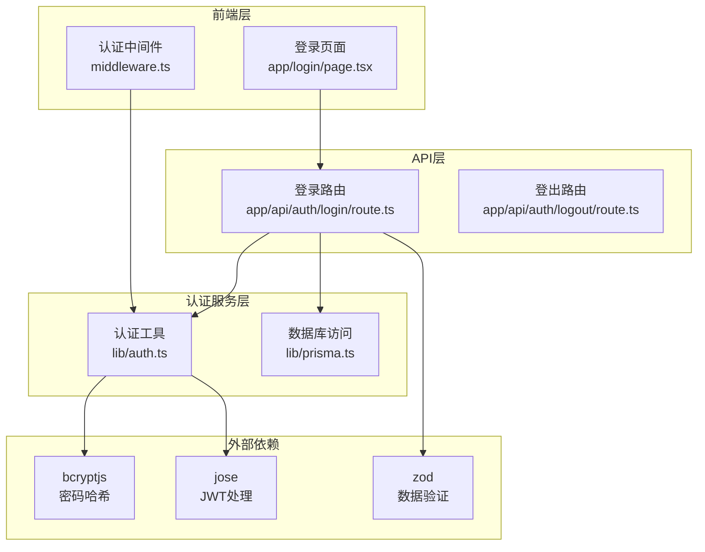
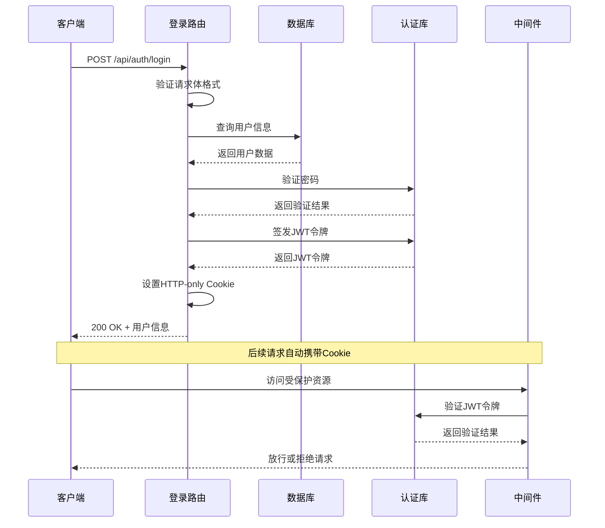
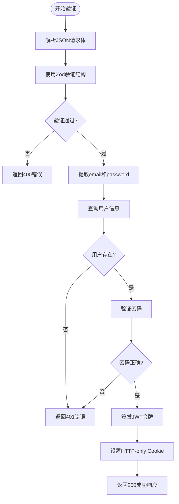
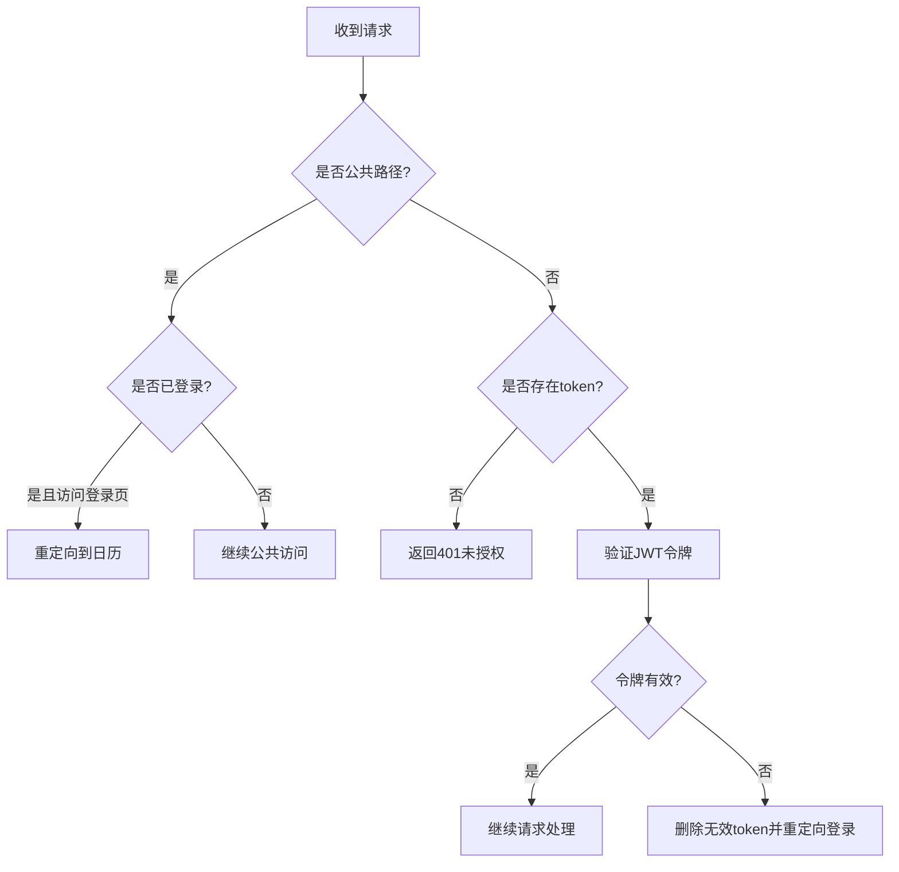
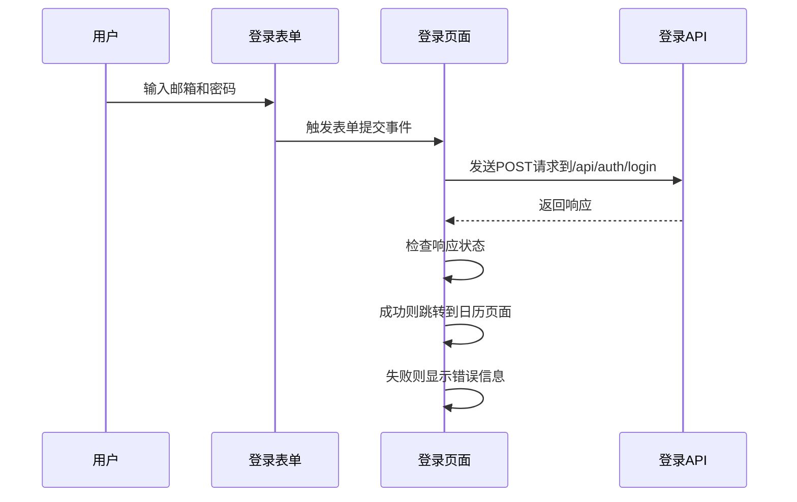
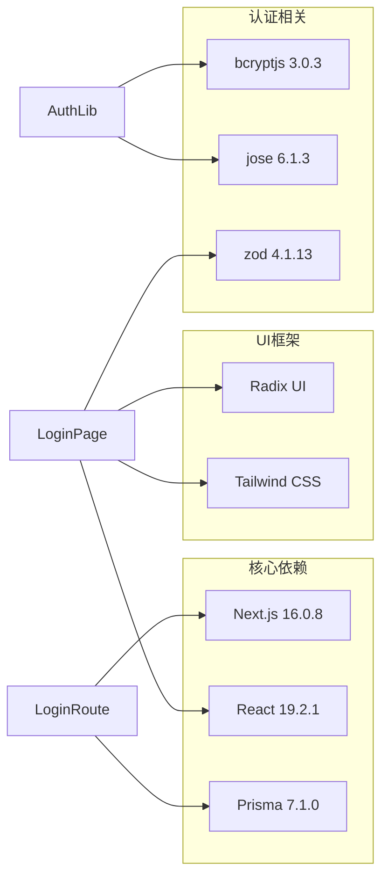
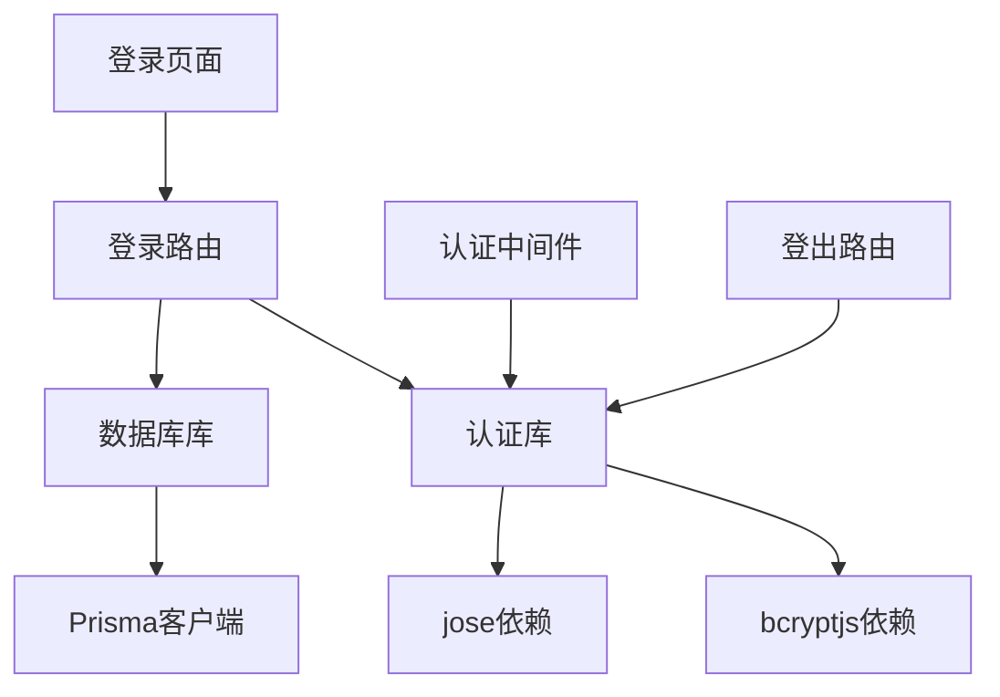

# 登录接口

<cite>
**本文档引用的文件**
- [app/api/auth/login/route.ts](file://app/api/auth/login/route.ts)
- [lib/auth.ts](file://lib/auth.ts)
- [middleware.ts](file://middleware.ts)
- [app/login/page.tsx](file://app/login/page.tsx)
- [app/api/auth/logout/route.ts](file://app/api/auth/logout/route.ts)
- [lib/prisma.ts](file://lib/prisma.ts)
- [package.json](file://package.json)
</cite>

## 目录
1. [简介](#简介)
2. [项目结构](#项目结构)
3. [核心组件](#核心组件)
4. [架构概览](#架构概览)
5. [详细组件分析](#详细组件分析)
6. [依赖关系分析](#依赖关系分析)
7. [性能考虑](#性能考虑)
8. [故障排除指南](#故障排除指南)
9. [结论](#结论)
10. [附录](#附录)

## 简介

本文档详细说明了todo-csv-import项目中登录接口（/api/auth/login）的完整API规范。该接口实现了基于JWT的用户身份验证机制，采用bcryptjs进行密码哈希验证，并通过HTTP-only Cookie存储认证令牌。文档涵盖了请求处理流程、数据验证逻辑、安全机制、错误处理以及前端集成方式。

## 项目结构

登录功能涉及以下关键文件和组件：



**图表来源**
- [app/api/auth/login/route.ts](file://app/api/auth/login/route.ts#L1-L57)
- [lib/auth.ts](file://lib/auth.ts#L1-L30)
- [middleware.ts](file://middleware.ts#L1-L50)

**章节来源**
- [app/api/auth/login/route.ts](file://app/api/auth/login/route.ts#L1-L57)
- [lib/auth.ts](file://lib/auth.ts#L1-L30)
- [middleware.ts](file://middleware.ts#L1-L50)

## 核心组件

### 登录路由处理器

登录接口位于`app/api/auth/login/route.ts`，采用Next.js App Router的Route Handler模式实现。该处理器负责：

- 请求体数据验证
- 用户身份验证
- JWT令牌签发
- HTTP-only Cookie设置

### 认证工具库

认证逻辑集中在`lib/auth.ts`中，提供了以下核心功能：
- 密码哈希：使用bcryptjs进行安全的密码加密
- 密码验证：比较明文密码与存储的哈希值
- JWT签发：使用HS256算法生成JWT令牌
- JWT验证：验证令牌的有效性和完整性

### 数据库访问层

`lib/prisma.ts`封装了Prisma客户端的初始化和连接池管理，为用户查询提供统一的数据访问接口。

**章节来源**
- [app/api/auth/login/route.ts](file://app/api/auth/login/route.ts#L11-L56)
- [lib/auth.ts](file://lib/auth.ts#L6-L29)
- [lib/prisma.ts](file://lib/prisma.ts#L13-L19)

## 架构概览

登录认证系统的整体架构如下：



**图表来源**
- [app/api/auth/login/route.ts](file://app/api/auth/login/route.ts#L11-L56)
- [lib/auth.ts](file://lib/auth.ts#L14-L29)
- [middleware.ts](file://middleware.ts#L5-L45)

## 详细组件分析

### 登录接口API规范

#### 请求规范

**URL**: `/api/auth/login`
**方法**: `POST`
**内容类型**: `application/json`

##### 请求体参数

| 参数名 | 类型 | 必填 | 描述 | 验证规则 |
|--------|------|------|------|----------|
| email | string | 是 | 用户邮箱地址 | 必须符合邮箱格式 |
| password | string | 是 | 用户密码 | 任意非空字符串 |

##### 请求体验证逻辑



**图表来源**
- [app/api/auth/login/route.ts](file://app/api/auth/login/route.ts#L11-L56)

#### 成功响应

**状态码**: `200 OK`

**响应体结构**:
```json
{
  "success": true,
  "user": {
    "id": "string",
    "email": "string"
  }
}
```

**响应头**:
- `Set-Cookie`: `token=<jwt_token>; Path=/; HttpOnly; Secure; SameSite=Lax; Max-Age=86400`

#### 失败响应

**400 错误** - 请求格式无效
```json
{
  "error": "Invalid input"
}
```

**401 错误** - 凭据无效
```json
{
  "error": "Invalid credentials"
}
```

**500 错误** - 服务器内部错误
```json
{
  "error": "Internal server error"
}
```

**章节来源**
- [app/api/auth/login/route.ts](file://app/api/auth/login/route.ts#L11-L56)

### 认证中间件机制

登录成功后，JWT令牌通过HTTP-only Cookie存储，后续请求的认证验证由中间件完成：



**图表来源**
- [middleware.ts](file://middleware.ts#L5-L45)

**章节来源**
- [middleware.ts](file://middleware.ts#L5-L45)

### 前端集成实现

前端登录页面通过React Hook Form实现表单验证和提交：



**图表来源**
- [app/login/page.tsx](file://app/login/page.tsx#L32-L54)

**章节来源**
- [app/login/page.tsx](file://app/login/page.tsx#L32-L54)

## 依赖关系分析

### 外部依赖

系统依赖以下关键包：



**图表来源**
- [package.json](file://package.json#L11-L36)

### 内部模块依赖



**图表来源**
- [app/api/auth/login/route.ts](file://app/api/auth/login/route.ts#L1-L4)
- [lib/auth.ts](file://lib/auth.ts#L1-L2)
- [middleware.ts](file://middleware.ts#L3)

**章节来源**
- [package.json](file://package.json#L11-L36)

## 性能考虑

### 密码哈希性能

- 使用bcryptjs进行密码哈希，成本因子为10，平衡了安全性与性能
- 哈希操作在内存中执行，避免了数据库层面的额外开销

### JWT令牌优化

- 令牌有效期设置为24小时，减少频繁重新认证的需求
- 使用HS256算法，计算速度快于RSA系列算法
- 令牌仅包含必要的用户标识信息，避免过大的负载

### 数据库查询优化

- 用户查询使用邮箱索引，确保O(log n)查询时间复杂度
- 查询结果仅包含必要字段，减少网络传输量

## 故障排除指南

### 常见错误及解决方案

| 错误类型 | 状态码 | 可能原因 | 解决方案 |
|----------|--------|----------|----------|
| 请求格式错误 | 400 | JSON格式不正确或缺少必填字段 | 检查请求体格式，确保包含email和password字段 |
| 凭据无效 | 401 | 邮箱不存在或密码错误 | 验证用户凭据，确认密码正确性 |
| 服务器错误 | 500 | 数据库连接问题或认证库异常 | 检查服务器日志，确认依赖服务正常运行 |

### 调试步骤

1. **检查请求格式**：确保发送正确的JSON格式
2. **验证用户存在性**：确认测试用户已在数据库中创建
3. **检查环境变量**：确保JWT_SECRET已正确配置
4. **查看服务器日志**：分析具体的错误堆栈信息

**章节来源**
- [app/api/auth/login/route.ts](file://app/api/auth/login/route.ts#L52-L55)

## 结论

todo-csv-import项目的登录接口实现了完整的认证流程，具有以下特点：

- **安全性**：采用bcryptjs进行密码哈希，使用HTTP-only Cookie存储JWT令牌
- **可靠性**：完善的错误处理机制和输入验证
- **可维护性**：清晰的模块分离和依赖管理
- **用户体验**：简洁的前端表单和流畅的认证流程

该实现遵循了现代Web应用的安全最佳实践，为后续的功能扩展奠定了坚实的基础。

## 附录

### curl命令示例

**成功登录示例**：
```bash
curl -X POST https://your-domain.com/api/auth/login \
  -H "Content-Type: application/json" \
  -d '{
    "email": "user@example.com",
    "password": "securepassword"
  }'
```

**失败场景示例**：
```bash
# 缺少必填字段
curl -X POST https://your-domain.com/api/auth/login \
  -H "Content-Type: application/json" \
  -d '{"email": "user@example.com"}'

# 凭据无效
curl -X POST https://your-domain.com/api/auth/login \
  -H "Content-Type: application/json" \
  -d '{
    "email": "user@example.com",
    "password": "wrongpassword"
  }'
```

### 安全最佳实践

1. **防止暴力破解**：
   - 实施账户锁定机制（达到一定失败次数后锁定账户）
   - 添加速率限制（每IP每分钟最大尝试次数）
   - 使用CAPTCHA验证（高失败率时触发）

2. **令牌安全**：
   - 使用HTTPS强制传输
   - 设置适当的过期时间
   - 定期轮换JWT密钥

3. **前端安全**：
   - 实施CSRF保护
   - 避免在客户端存储敏感信息
   - 使用HTTPS-only Cookie属性

4. **监控和审计**：
   - 记录所有认证尝试
   - 监控异常登录行为
   - 设置告警机制