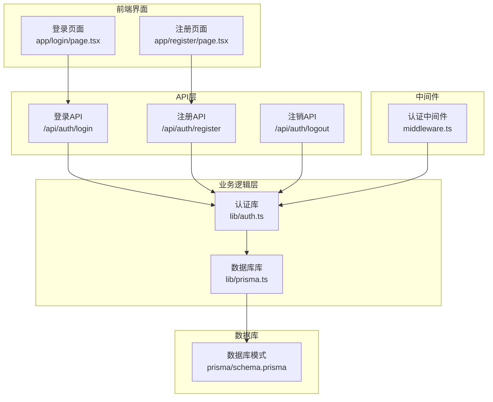
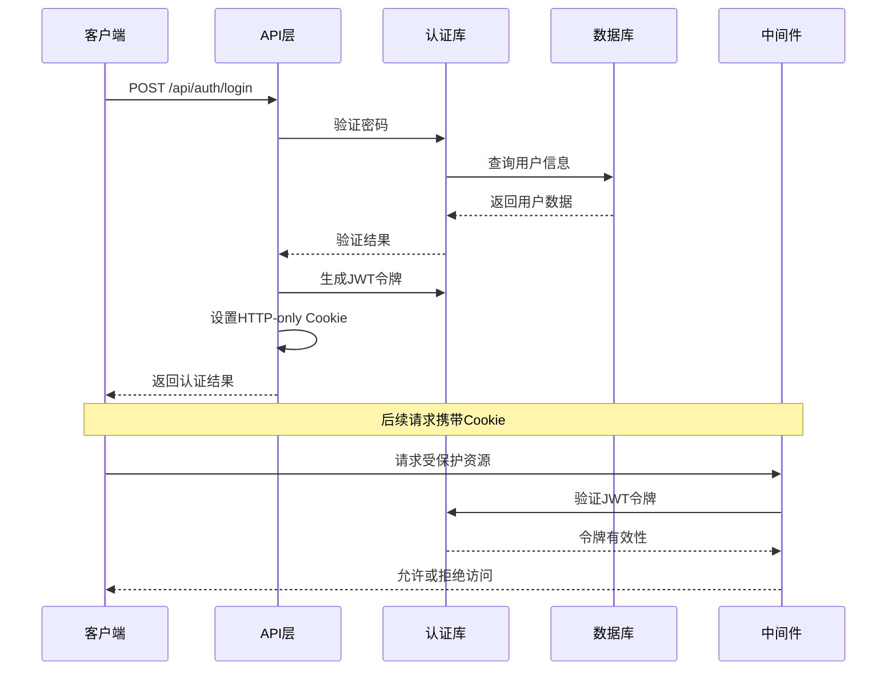
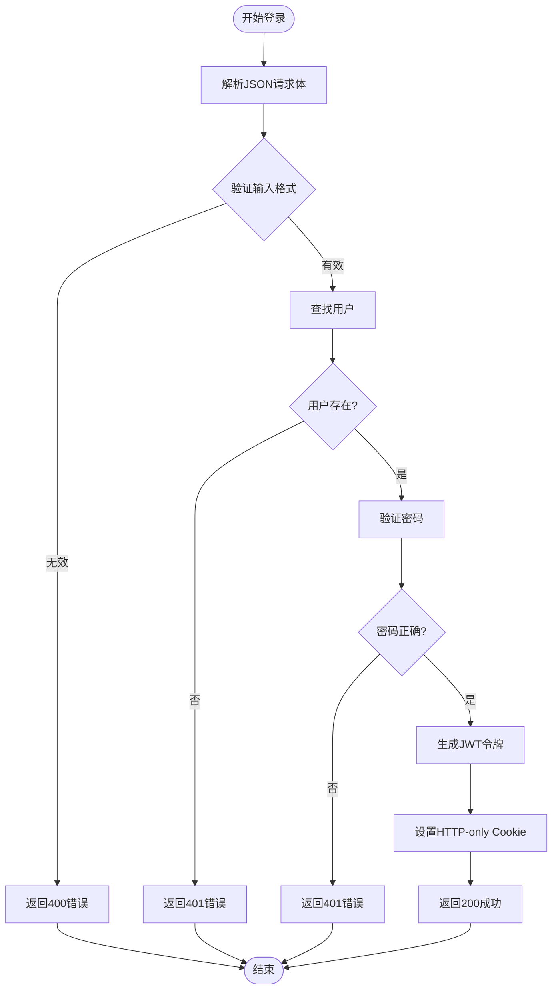
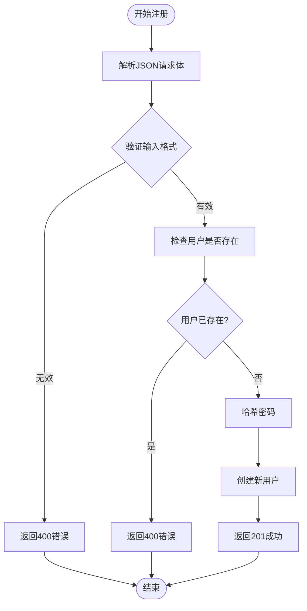
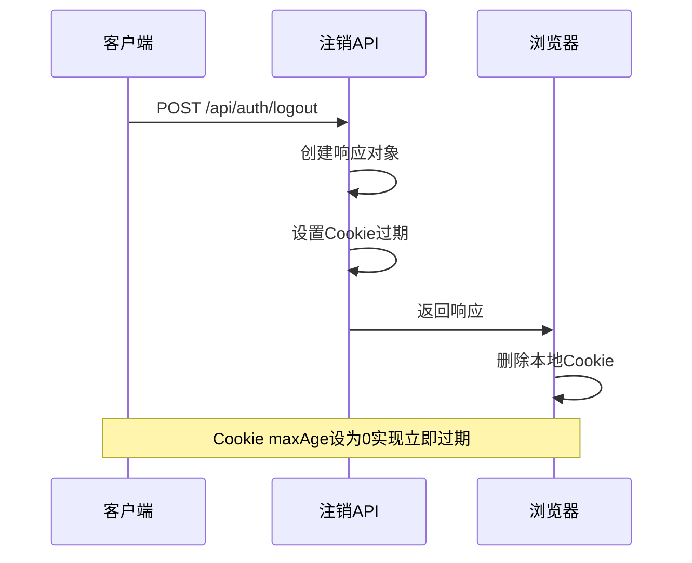
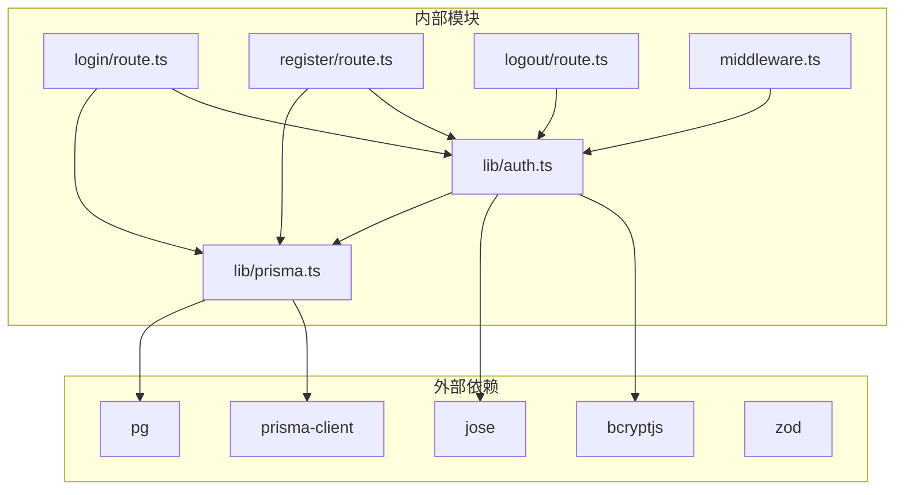

# 认证API

<cite>
**本文档引用的文件**
- [app/api/auth/login/route.ts](file://app/api/auth/login/route.ts)
- [app/api/auth/register/route.ts](file://app/api/auth/register/route.ts)
- [app/api/auth/logout/route.ts](file://app/api/auth/logout/route.ts)
- [lib/auth.ts](file://lib/auth.ts)
- [lib/prisma.ts](file://lib/prisma.ts)
- [middleware.ts](file://middleware.ts)
- [prisma/schema.prisma](file://prisma/schema.prisma)
- [app/login/page.tsx](file://app/login/page.tsx)
- [app/register/page.tsx](file://app/register/page.tsx)
- [package.json](file://package.json)
</cite>

## 目录
1. [简介](#简介)
2. [项目结构](#项目结构)
3. [核心组件](#核心组件)
4. [架构概览](#架构概览)
5. [详细组件分析](#详细组件分析)
6. [依赖关系分析](#依赖关系分析)
7. [性能考量](#性能考量)
8. [故障排除指南](#故障排除指南)
9. [结论](#结论)

## 简介

todo-csv-import项目提供了一套完整的认证API接口，基于Next.js App Router构建，采用JWT令牌和HTTP-only Cookie进行会话管理。该认证系统支持用户登录、注册和注销功能，具有完善的安全机制和错误处理。

本项目使用PostgreSQL作为数据库，通过Prisma ORM进行数据访问，采用bcryptjs进行密码哈希处理，使用jose库生成和验证JWT令牌。

## 项目结构

认证相关的核心文件组织如下：



**图表来源**
- [app/api/auth/login/route.ts](file://app/api/auth/login/route.ts#L1-L57)
- [app/api/auth/register/route.ts](file://app/api/auth/register/route.ts#L1-L53)
- [app/api/auth/logout/route.ts](file://app/api/auth/logout/route.ts#L1-L14)
- [lib/auth.ts](file://lib/auth.ts#L1-L30)
- [lib/prisma.ts](file://lib/prisma.ts#L1-L20)
- [middleware.ts](file://middleware.ts#L1-L50)

**章节来源**
- [app/api/auth/login/route.ts](file://app/api/auth/login/route.ts#L1-L57)
- [app/api/auth/register/route.ts](file://app/api/auth/register/route.ts#L1-L53)
- [app/api/auth/logout/route.ts](file://app/api/auth/logout/route.ts#L1-L14)
- [lib/auth.ts](file://lib/auth.ts#L1-L30)
- [lib/prisma.ts](file://lib/prisma.ts#L1-L20)
- [middleware.ts](file://middleware.ts#L1-L50)

## 核心组件

### 认证库 (lib/auth.ts)

认证库提供了核心的密码处理和JWT令牌管理功能：

- **密码哈希**: 使用bcryptjs对用户密码进行安全哈希处理
- **密码验证**: 验证用户输入的密码与存储的哈希值是否匹配
- **JWT签名**: 生成具有24小时有效期的JWT令牌
- **JWT验证**: 验证传入的JWT令牌的有效性

### 数据库库 (lib/prisma.ts)

数据库库负责与PostgreSQL数据库的连接和操作：

- **连接池管理**: 使用PgPool建立高效的数据库连接
- **Prisma客户端**: 提供类型安全的数据库查询接口
- **全局实例**: 在开发环境中缓存Prisma客户端实例

### 用户模型 (prisma/schema.prisma)

用户模型定义了认证所需的数据结构：

- **唯一邮箱**: 邮箱字段具有唯一约束，确保用户标识的唯一性
- **密码存储**: 密码字段存储经过哈希处理的密码
- **时间戳**: 自动记录用户的创建时间

**章节来源**
- [lib/auth.ts](file://lib/auth.ts#L1-L30)
- [lib/prisma.ts](file://lib/prisma.ts#L1-L20)
- [prisma/schema.prisma](file://prisma/schema.prisma#L16-L26)

## 架构概览

认证系统的整体架构采用分层设计，确保了安全性、可维护性和可扩展性：



**图表来源**
- [app/api/auth/login/route.ts](file://app/api/auth/login/route.ts#L35-L51)
- [lib/auth.ts](file://lib/auth.ts#L14-L20)
- [middleware.ts](file://middleware.ts#L35-L44)

## 详细组件分析

### 登录端点 (/api/auth/login)

#### 接口规范

**HTTP方法**: POST
**请求路径**: `/api/auth/login`
**请求头**: `Content-Type: application/json`

**请求体结构**:
```json
{
  "email": "string",
  "password": "string"
}
```

**响应格式**:
- 成功响应: `{ "success": true, "user": { "id": "string", "email": "string" } }`
- 错误响应: `{ "error": "string" }`

#### 验证逻辑

登录端点实现了多层验证机制：



**图表来源**
- [app/api/auth/login/route.ts](file://app/api/auth/login/route.ts#L11-L56)

#### 安全特性

- **输入验证**: 使用Zod进行严格的请求体验证
- **凭据验证**: 仅在用户存在时执行密码验证，避免时序攻击
- **令牌设置**: 使用HTTP-only Cookie防止XSS攻击
- **安全传输**: 生产环境启用HTTPS和Secure标志

**章节来源**
- [app/api/auth/login/route.ts](file://app/api/auth/login/route.ts#L1-L57)
- [lib/auth.ts](file://lib/auth.ts#L10-L12)

### 注册端点 (/api/auth/register)

#### 接口规范

**HTTP方法**: POST
**请求路径**: `/api/auth/register`
**请求头**: `Content-Type: application/json`

**请求体结构**:
```json
{
  "email": "string",
  "password": "string"
}
```

**响应格式**:
- 成功响应: `{ "user": { "id": "string", "email": "string", "createdAt": "string" } }`
- 错误响应: `{ "error": "string", "detail": "string" }`

#### 注册流程

注册端点遵循以下处理流程：



**图表来源**
- [app/api/auth/register/route.ts](file://app/api/auth/register/route.ts#L11-L52)

#### 安全特性

- **密码哈希**: 使用bcryptjs进行单向密码哈希
- **邮箱唯一性**: 数据库层面的唯一约束确保邮箱唯一性
- **最小密码长度**: 强制要求至少6位密码
- **错误处理**: 对数据库异常进行适当的错误包装

**章节来源**
- [app/api/auth/register/route.ts](file://app/api/auth/register/route.ts#L1-L53)
- [lib/auth.ts](file://lib/auth.ts#L6-L8)
- [prisma/schema.prisma](file://prisma/schema.prisma#L18)

### 注销端点 (/api/auth/logout)

#### 接口规范

**HTTP方法**: POST
**请求路径**: `/api/auth/logout`
**请求头**: `Content-Type: application/json`

**请求体**: 无
**响应格式**: `{ "success": true }`

#### 会话清除机制

注销端点采用Cookie过期机制实现会话清除：



**图表来源**
- [app/api/auth/logout/route.ts](file://app/api/auth/logout/route.ts#L3-L13)

**章节来源**
- [app/api/auth/logout/route.ts](file://app/api/auth/logout/route.ts#L1-L14)

### 前端集成

#### 登录页面 (app/login/page.tsx)

前端登录页面通过fetch API调用认证接口：

- **表单验证**: 使用React Hook Form和Zod进行客户端验证
- **API调用**: 调用`/api/auth/login`接口进行用户认证
- **路由导航**: 认证成功后重定向到日历页面
- **错误处理**: 显示服务器返回的错误信息

#### 注册页面 (app/register/page.tsx)

前端注册页面提供完整的用户注册体验：

- **密码确认**: 确保用户输入的密码一致性
- **自动重定向**: 注册成功后自动跳转到登录页面
- **实时验证**: 客户端即时反馈表单验证结果

**章节来源**
- [app/login/page.tsx](file://app/login/page.tsx#L32-L54)
- [app/register/page.tsx](file://app/register/page.tsx#L39-L63)

## 依赖关系分析

认证系统的依赖关系体现了清晰的分层架构：



**图表来源**
- [package.json](file://package.json#L11-L36)
- [lib/auth.ts](file://lib/auth.ts#L1-L2)
- [lib/prisma.ts](file://lib/prisma.ts#L1-L3)
- [middleware.ts](file://middleware.ts#L3)

**章节来源**
- [package.json](file://package.json#L11-L36)
- [lib/auth.ts](file://lib/auth.ts#L1-L30)
- [lib/prisma.ts](file://lib/prisma.ts#L1-L20)

## 性能考量

### 缓存策略

- **Prisma客户端缓存**: 开发环境中缓存Prisma客户端实例，减少重复初始化开销
- **Cookie缓存**: HTTP-only Cookie存储在浏览器端，避免不必要的网络传输
- **令牌缓存**: JWT令牌在内存中验证，避免频繁的数据库查询

### 安全优化

- **密码哈希成本**: 使用合理的哈希成本(10)平衡安全性与性能
- **令牌过期**: 24小时有效期的JWT令牌减少长期会话风险
- **中间件验证**: Edge兼容的令牌验证确保快速响应

### 错误处理优化

- **早期失败**: 在用户不存在时立即返回401错误，避免不必要的密码验证
- **统一错误格式**: 所有API端点返回一致的错误响应格式
- **日志记录**: 服务器端记录认证错误以便监控和审计

## 故障排除指南

### 常见错误及解决方案

#### 400 Bad Request
**原因**: 请求格式不正确或缺少必需字段
**解决方案**: 
- 检查请求体是否为有效的JSON格式
- 确认包含`email`和`password`字段
- 验证邮箱格式是否正确

#### 401 Unauthorized
**原因**: 凭据无效或用户不存在
**解决方案**:
- 确认用户名和密码是否正确
- 检查用户是否已被注册
- 验证数据库连接是否正常

#### 409 Conflict
**原因**: 用户已存在
**解决方案**:
- 提示用户使用不同的邮箱地址
- 引导用户前往登录页面

#### 500 Internal Server Error
**原因**: 服务器内部错误
**解决方案**:
- 检查服务器日志获取详细错误信息
- 验证数据库连接和Prisma配置
- 确认JWT密钥配置正确

### 安全最佳实践

#### 防暴力破解
- **速率限制**: 在网关层实施IP级速率限制
- **账户锁定**: 实现失败尝试次数限制
- **验证码**: 对于大量失败尝试要求验证码

#### 会话管理
- **Cookie安全**: 确保HTTP-only、Secure、SameSite属性正确设置
- **令牌刷新**: 实现短期访问令牌和长期刷新令牌机制
- **会话超时**: 实施合理的会话超时策略

#### 数据保护
- **密码存储**: 确保密码始终以哈希形式存储
- **传输加密**: 在生产环境中强制使用HTTPS
- **日志脱敏**: 避免在日志中记录敏感信息

**章节来源**
- [middleware.ts](file://middleware.ts#L23-L28)
- [lib/auth.ts](file://lib/auth.ts#L14-L20)

## 结论

todo-csv-import项目的认证API设计体现了现代Web应用的安全性和可用性要求。通过采用JWT令牌、HTTP-only Cookie和严格的输入验证，系统提供了可靠的身份认证机制。

### 主要优势

1. **安全性**: 多层安全防护，包括密码哈希、令牌验证和Cookie安全设置
2. **可维护性**: 清晰的分层架构和模块化设计
3. **可扩展性**: 基于Next.js App Router的现代化架构
4. **用户体验**: 完整的前端集成和即时反馈机制

### 改进建议

1. **增强安全**: 实现速率限制和防暴力破解机制
2. **监控告警**: 添加认证相关的监控和告警系统
3. **多因素认证**: 考虑添加MFA支持
4. **审计日志**: 实现详细的认证活动审计日志

该认证系统为todo-csv-import项目提供了坚实的基础，支持后续的功能扩展和安全加固。