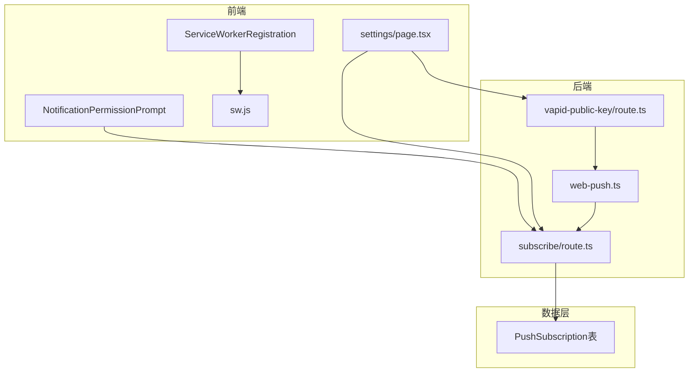
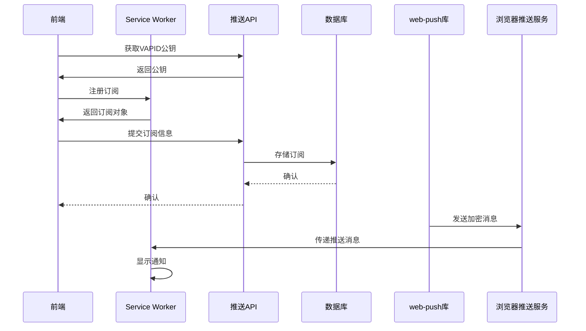
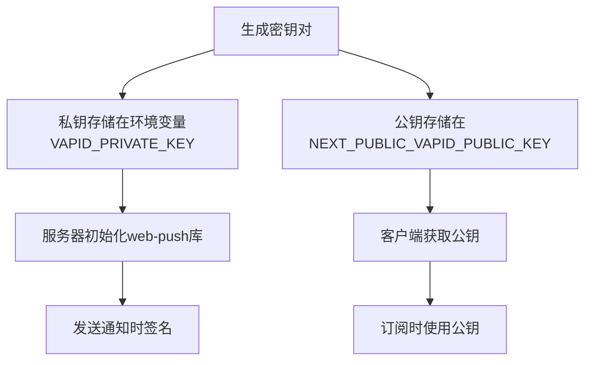
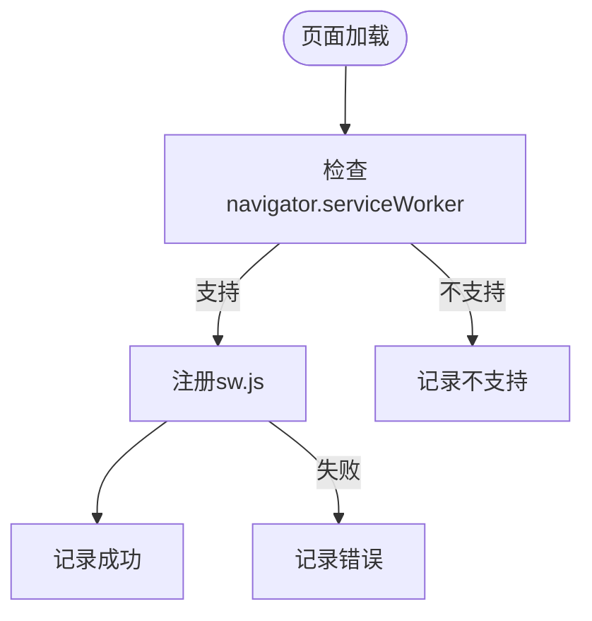
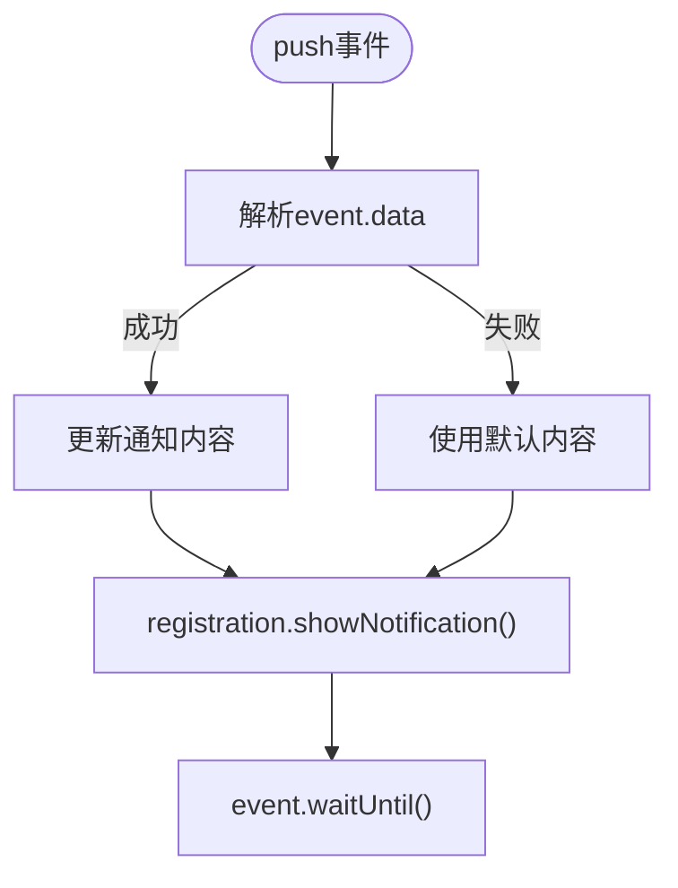
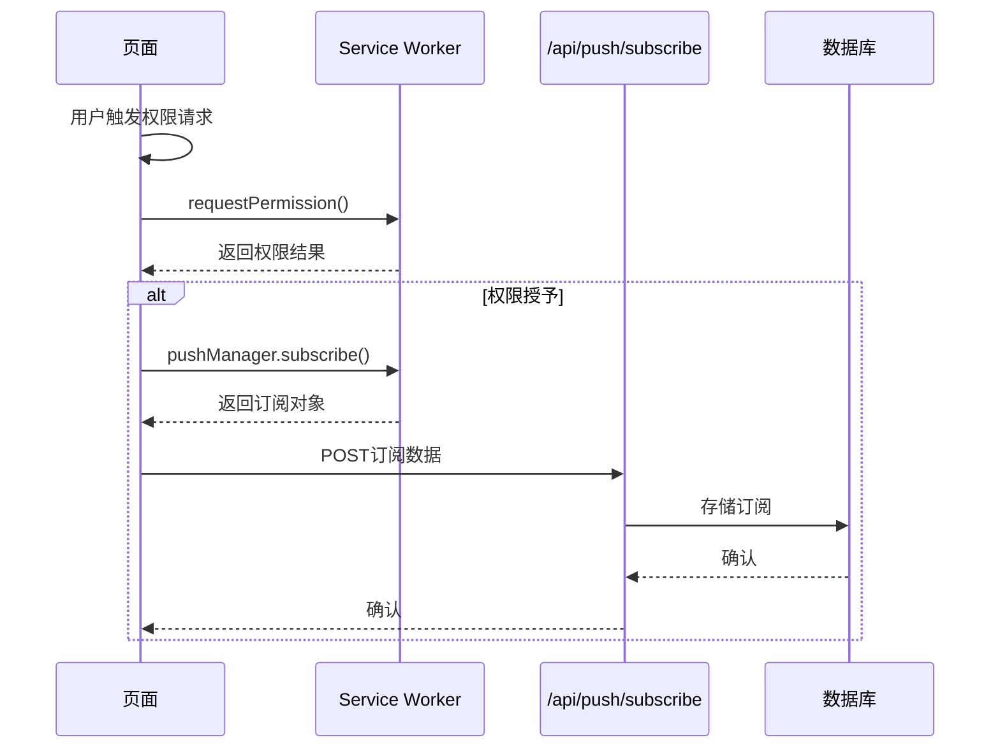
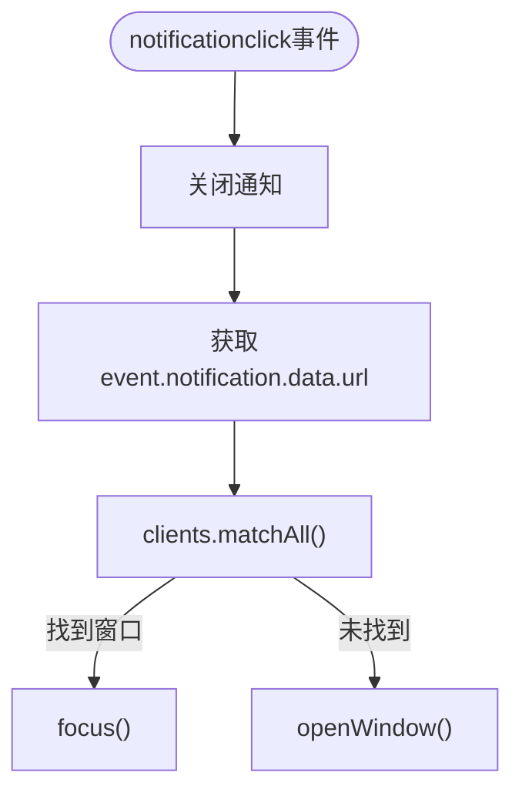
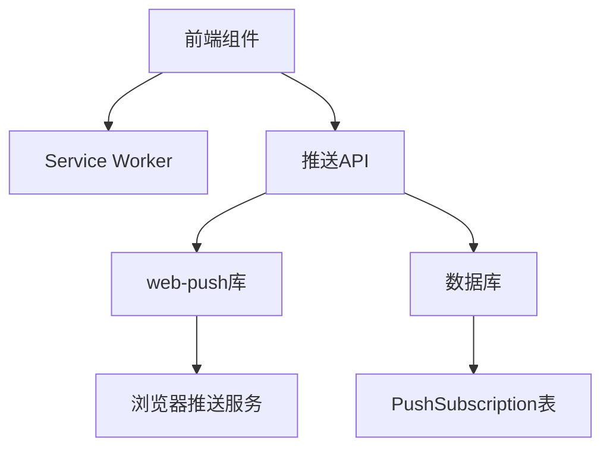

# Web Push实现

<cite>
**本文档引用的文件**  
- [web-push.ts](file://lib/web-push.ts)
- [sw.js](file://public/sw.js)
- [ServiceWorkerRegistration.tsx](file://components/ServiceWorkerRegistration.tsx)
- [subscribe/route.ts](file://app/api/push/subscribe/route.ts)
- [vapid-public-key/route.ts](file://app/api/push/vapid-public-key/route.ts)
- [schema.prisma](file://prisma/schema.prisma)
- [NotificationPermissionPrompt.tsx](file://components/NotificationPermissionPrompt.tsx)
- [settings/page.tsx](file://app/settings/page.tsx)
- [WEB_PUSH_DEBUG.md](file://docs/WEB_PUSH_DEBUG.md)
</cite>

## 目录
1. [引言](#引言)
2. [项目结构](#项目结构)
3. [核心组件](#核心组件)
4. [架构概述](#架构概述)
5. [详细组件分析](#详细组件分析)
6. [依赖分析](#依赖分析)
7. [性能考虑](#性能考虑)
8. [故障排除指南](#故障排除指南)
9. [结论](#结论)

## 引言
本文档深入解析Web Push通知系统的实现细节，涵盖VAPID密钥的生成与配置、`web-push`库的使用、Service Worker的注册与消息处理机制、前端订阅生命周期管理以及客户端通知响应流程。结合调试文档中的经验，提供常见问题的排查方法和浏览器兼容性注意事项。

## 项目结构
Web Push功能分布在多个模块中，包括后端API路由、前端组件、Service Worker脚本和数据库模型。系统通过环境变量安全地管理VAPID密钥，并利用Prisma ORM持久化推送订阅信息。



**Diagram sources**
- [lib/web-push.ts](file://lib/web-push.ts#L1-L53)
- [public/sw.js](file://public/sw.js#L1-L78)
- [components/ServiceWorkerRegistration.tsx](file://components/ServiceWorkerRegistration.tsx#L1-L30)
- [app/api/push/subscribe/route.ts](file://app/api/push/subscribe/route.ts#L1-L95)
- [app/api/push/vapid-public-key/route.ts](file://app/api/push/vapid-public-key/route.ts#L1-L12)
- [prisma/schema.prisma](file://prisma/schema.prisma#L76-L85)

**Section sources**
- [lib/web-push.ts](file://lib/web-push.ts#L1-L53)
- [public/sw.js](file://public/sw.js#L1-L78)
- [prisma/schema.prisma](file://prisma/schema.prisma#L76-L85)

## 核心组件
系统核心包括VAPID密钥管理、推送消息发送、Service Worker事件监听、订阅生命周期管理和数据库持久化。各组件协同工作，确保推送通知的安全可靠传输。

**Section sources**
- [lib/web-push.ts](file://lib/web-push.ts#L1-L53)
- [public/sw.js](file://public/sw.js#L1-L78)
- [app/api/push/subscribe/route.ts](file://app/api/push/subscribe/route.ts#L1-L95)

## 架构概述
Web Push系统采用标准的推送架构，包含应用服务器、推送服务和客户端浏览器。VAPID协议用于身份验证，确保消息来源可信。订阅信息通过API存储在数据库中，由后端服务触发推送。



**Diagram sources**
- [lib/web-push.ts](file://lib/web-push.ts#L28-L46)
- [public/sw.js](file://public/sw.js#L12-L49)
- [app/api/push/subscribe/route.ts](file://app/api/push/subscribe/route.ts#L14-L58)

## 详细组件分析

### VAPID密钥管理
VAPID（Voluntary Application Server Identification）密钥用于验证推送消息的来源。公钥暴露给客户端用于订阅，私钥在服务器端签名消息。



**Diagram sources**
- [lib/web-push.ts](file://lib/web-push.ts#L5-L15)
- [app/api/push/vapid-public-key/route.ts](file://app/api/push/vapid-public-key/route.ts#L4-L12)

**Section sources**
- [lib/web-push.ts](file://lib/web-push.ts#L3-L15)
- [app/api/push/vapid-public-key/route.ts](file://app/api/push/vapid-public-key/route.ts#L1-L12)

### web-push库封装
`web-push`库封装了消息加密和HTTP/2请求的复杂性，提供简洁的API发送通知。

```mermaid
classDiagram
class WebPushLib {
+sendPushNotification(subscription, payload)
-encryptAndSend()
-handleErrors()
}
class PushSubscriptionData {
+endpoint : string
+keys : {p256dh : string, auth : string}
}
WebPushLib --> PushSubscriptionData : 使用
```

**Diagram sources**
- [lib/web-push.ts](file://lib/web-push.ts#L28-L46)

**Section sources**
- [lib/web-push.ts](file://lib/web-push.ts#L28-L53)

### Service Worker注册与消息监听
Service Worker是推送系统的核心，负责接收和显示通知。

#### 注册机制


**Diagram sources**
- [components/ServiceWorkerRegistration.tsx](file://components/ServiceWorkerRegistration.tsx#L6-L26)

**Section sources**
- [components/ServiceWorkerRegistration.tsx](file://components/ServiceWorkerRegistration.tsx#L1-L30)
- [public/sw.js](file://public/sw.js#L1-L78)

#### 消息监听逻辑


**Diagram sources**
- [public/sw.js](file://public/sw.js#L12-L49)

**Section sources**
- [public/sw.js](file://public/sw.js#L12-L49)

### 前端订阅生命周期管理
前端通过`ServiceWorkerRegistration`和`NotificationPermissionPrompt`组件管理订阅。



**Diagram sources**
- [components/NotificationPermissionPrompt.tsx](file://components/NotificationPermissionPrompt.tsx#L51-L72)
- [app/api/push/subscribe/route.ts](file://app/api/push/subscribe/route.ts#L14-L58)

**Section sources**
- [components/NotificationPermissionPrompt.tsx](file://components/NotificationPermissionPrompt.tsx#L51-L72)
- [app/settings/page.tsx](file://app/settings/page.tsx#L125-L143)
- [app/api/push/subscribe/route.ts](file://app/api/push/subscribe/route.ts#L14-L58)

### 消息送达后的客户端处理


**Diagram sources**
- [public/sw.js](file://public/sw.js#L51-L72)

**Section sources**
- [public/sw.js](file://public/sw.js#L51-L72)

## 依赖分析
系统依赖关系清晰，各层职责分明。



**Diagram sources**
- [lib/web-push.ts](file://lib/web-push.ts#L1-L53)
- [app/api/push/subscribe/route.ts](file://app/api/push/subscribe/route.ts#L2-L4)
- [prisma/schema.prisma](file://prisma/schema.prisma#L76-L85)

**Section sources**
- [lib/web-push.ts](file://lib/web-push.ts#L1-L53)
- [app/api/push/subscribe/route.ts](file://app/api/push/subscribe/route.ts#L1-L95)
- [prisma/schema.prisma](file://prisma/schema.prisma#L76-L85)

## 性能考虑
- Service Worker的安装和激活应快速完成
- 推送消息的加密和发送应在异步任务中处理
- 订阅信息的存储应使用索引优化查询
- 频繁的推送操作应考虑节流和批处理

## 故障排除指南
基于`WEB_PUSH_DEBUG.md`文档，提供常见问题解决方案。

### 订阅失败
1. **检查权限状态**: `Notification.permission`
2. **重置浏览器权限**: 在浏览器设置中清除通知权限
3. **使用隐身模式测试**: 排除缓存影响
4. **检查HTTPS要求**: 除localhost外需HTTPS

### 消息未送达
1. **验证订阅端点**: 确保端点未过期
2. **检查VAPID配置**: 确认环境变量正确设置
3. **查看服务Worker状态**: 确保SW已正确注册
4. **检查网络请求**: 确认推送请求成功发送

### 消息未显示
1. **检查Service Worker日志**: 查看`[SW]`前缀的日志
2. **验证通知权限**: 确保权限为`granted`
3. **检查payload格式**: 确保JSON可解析

**Section sources**
- [docs/WEB_PUSH_DEBUG.md](file://docs/WEB_PUSH_DEBUG.md#L1-L166)

## 结论
本Web Push系统实现了完整的推送通知功能，从密钥管理到消息展示，各组件协同工作。通过VAPID协议确保安全性，利用Service Worker实现离线通知，结合数据库持久化订阅信息。系统设计考虑了用户体验和错误处理，提供了完善的调试指南。