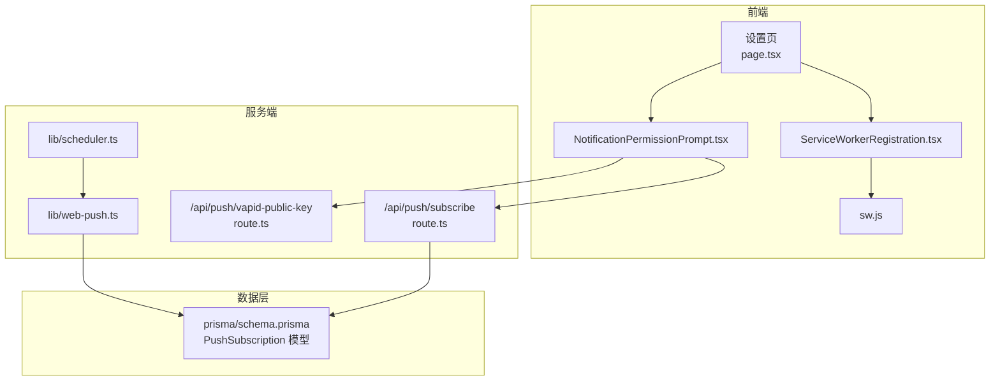
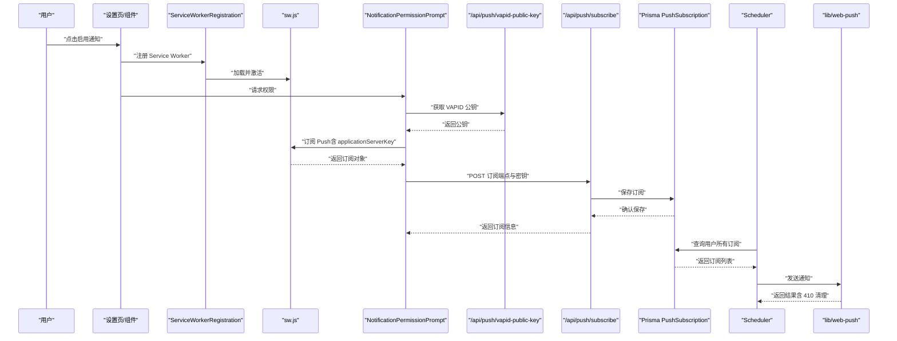
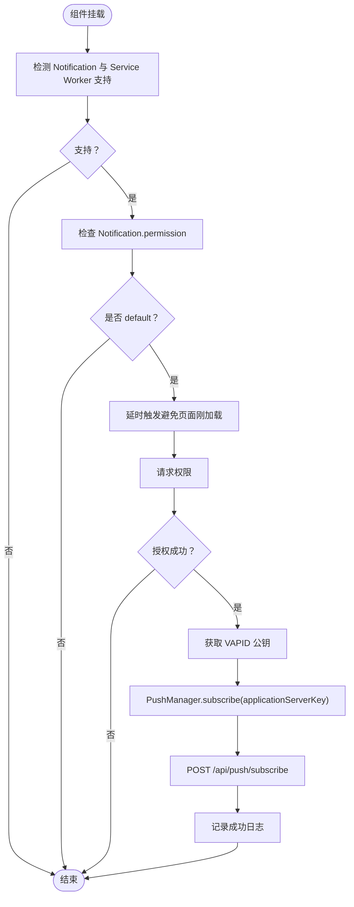
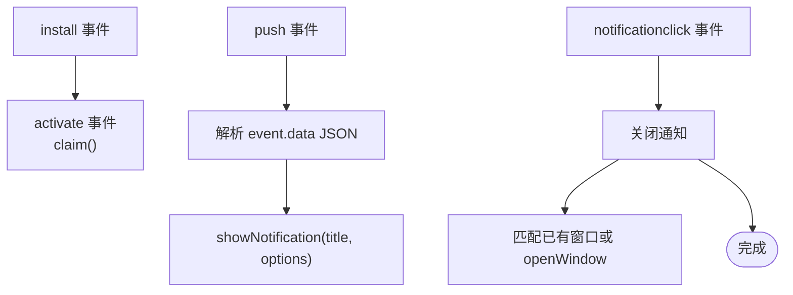
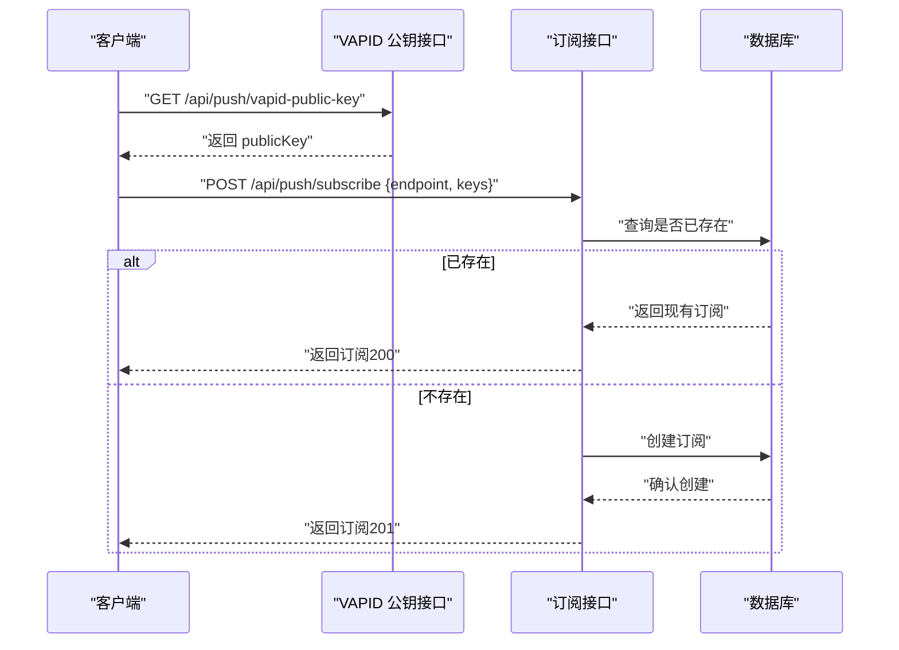
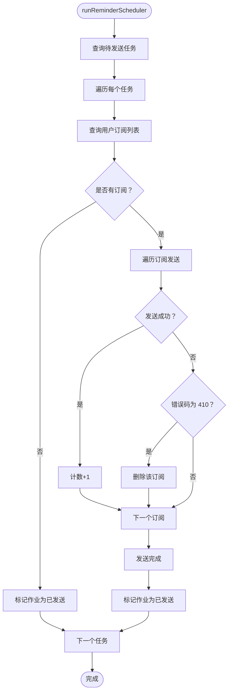
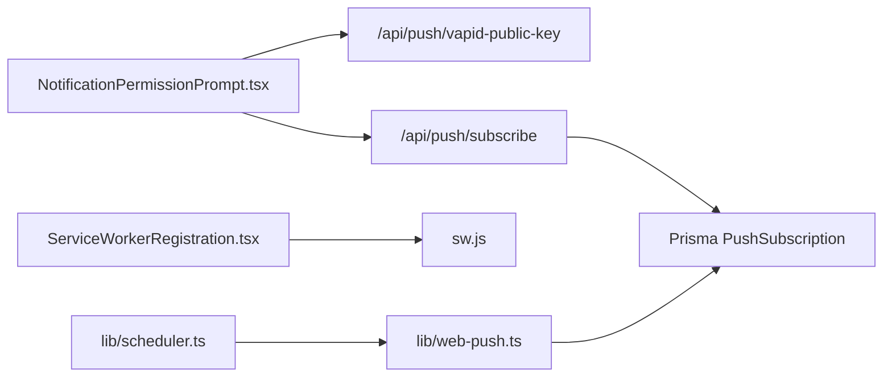

# 故障排除

<cite>
**本文引用的文件**
- [WEB_PUSH_DEBUG.md](file://docs/WEB_PUSH_DEBUG.md)
- [sw.js](file://public/sw.js)
- [ServiceWorkerRegistration.tsx](file://components/ServiceWorkerRegistration.tsx)
- [NotificationPermissionPrompt.tsx](file://components/NotificationPermissionPrompt.tsx)
- [subscribe/route.ts](file://app/api/push/subscribe/route.ts)
- [vapid-public-key/route.ts](file://app/api/push/vapid-public-key/route.ts)
- [web-push.ts](file://lib/web-push.ts)
- [scheduler.ts](file://lib/scheduler.ts)
- [schema.prisma](file://prisma/schema.prisma)
- [page.tsx（设置页）](file://app/settings/page.tsx)
</cite>

## 目录
1. [简介](#简介)
2. [项目结构](#项目结构)
3. [核心组件](#核心组件)
4. [架构总览](#架构总览)
5. [详细组件分析](#详细组件分析)
6. [依赖关系分析](#依赖关系分析)
7. [性能与可靠性考虑](#性能与可靠性考虑)
8. [故障排除指南](#故障排除指南)
9. [结论](#结论)

## 简介
本指南面向开发者，系统化梳理 Web Push 通知在本项目中的常见问题与排障流程，覆盖以下关键场景：
- 浏览器不弹出权限请求（如 Chrome 的静默提示、Safari 兼容性限制）
- Service Worker 注册失败
- 订阅端点未正确存储
- 消息发送失败（410 Gone 或 404 错误表示订阅失效）
并提供分步诊断方法，包括使用控制台命令检查 Notification.permission、验证 Service Worker 注册状态、测试 VAPID 密钥有效性。同时指导如何利用 sw.js 中的日志输出定位问题，并建议在生产环境中集成错误监控。强调 HTTPS 部署要求（除 localhost 外）及广告拦截插件可能造成的影响。

## 项目结构
Web Push 功能涉及前端组件、服务端 API、数据库模型与调度器等多个模块，整体围绕“权限请求 → Service Worker 注册 → 订阅端点存储 → VAPID 密钥校验 → 推送发送 → 订阅失效清理”的闭环展开。

图表来源
- [page.tsx（设置页）](file://app/settings/page.tsx#L125-L143)
- [ServiceWorkerRegistration.tsx](file://components/ServiceWorkerRegistration.tsx#L5-L29)
- [NotificationPermissionPrompt.tsx](file://components/NotificationPermissionPrompt.tsx#L6-L77)
- [subscribe/route.ts](file://app/api/push/subscribe/route.ts#L14-L62)
- [vapid-public-key/route.ts](file://app/api/push/vapid-public-key/route.ts#L4-L12)
- [web-push.ts](file://lib/web-push.ts#L1-L54)
- [scheduler.ts](file://lib/scheduler.ts#L8-L86)
- [schema.prisma](file://prisma/schema.prisma#L76-L85)

章节来源
- [page.tsx（设置页）](file://app/settings/page.tsx#L125-L143)
- [ServiceWorkerRegistration.tsx](file://components/ServiceWorkerRegistration.tsx#L5-L29)
- [NotificationPermissionPrompt.tsx](file://components/NotificationPermissionPrompt.tsx#L6-L77)
- [subscribe/route.ts](file://app/api/push/subscribe/route.ts#L14-L62)
- [vapid-public-key/route.ts](file://app/api/push/vapid-public-key/route.ts#L4-L12)
- [web-push.ts](file://lib/web-push.ts#L1-L54)
- [scheduler.ts](file://lib/scheduler.ts#L8-L86)
- [schema.prisma](file://prisma/schema.prisma#L76-L85)

## 核心组件
- 权限与订阅流程：前端组件负责检测浏览器能力、请求权限并在授权后通过 Service Worker 订阅推送，随后调用服务端接口保存订阅端点与密钥。
- Service Worker：接收推送事件，展示通知并处理点击跳转。
- 服务端 API：提供 VAPID 公钥查询与订阅保存接口；删除订阅接口用于解绑。
- 发送与调度：调度器周期性读取待发送任务，向用户所有有效订阅发送通知；对 410/Gone 的无效订阅执行清理。
- 数据模型：PushSubscription 存储 endpoint、p256dh、auth 等字段，关联用户。

章节来源
- [NotificationPermissionPrompt.tsx](file://components/NotificationPermissionPrompt.tsx#L6-L77)
- [ServiceWorkerRegistration.tsx](file://components/ServiceWorkerRegistration.tsx#L5-L29)
- [sw.js](file://public/sw.js#L12-L73)
- [vapid-public-key/route.ts](file://app/api/push/vapid-public-key/route.ts#L4-L12)
- [subscribe/route.ts](file://app/api/push/subscribe/route.ts#L14-L62)
- [scheduler.ts](file://lib/scheduler.ts#L8-L86)
- [schema.prisma](file://prisma/schema.prisma#L76-L85)

## 架构总览
下图展示了从用户触发到消息送达的关键路径，以及异常处理与清理机制。

图表来源
- [page.tsx（设置页）](file://app/settings/page.tsx#L125-L143)
- [ServiceWorkerRegistration.tsx](file://components/ServiceWorkerRegistration.tsx#L5-L29)
- [NotificationPermissionPrompt.tsx](file://components/NotificationPermissionPrompt.tsx#L51-L73)
- [vapid-public-key/route.ts](file://app/api/push/vapid-public-key/route.ts#L4-L12)
- [subscribe/route.ts](file://app/api/push/subscribe/route.ts#L14-L62)
- [web-push.ts](file://lib/web-push.ts#L28-L46)
- [scheduler.ts](file://lib/scheduler.ts#L42-L69)

## 详细组件分析

### 权限与订阅组件
- 组件职责：检测浏览器能力、延迟自动请求权限、订阅 Push 并保存至服务端。
- 关键行为：仅在权限为 default 时请求；授权成功后通过 PushManager 订阅并携带 VAPID 公钥；将订阅对象以 JSON 形式提交到服务端。
- 日志输出：组件在关键节点打印日志，便于定位注册失败、订阅失败等问题。

图表来源
- [NotificationPermissionPrompt.tsx](file://components/NotificationPermissionPrompt.tsx#L9-L73)

章节来源
- [NotificationPermissionPrompt.tsx](file://components/NotificationPermissionPrompt.tsx#L6-L77)

### Service Worker
- 事件处理：install/activate 用于预热与接管；push 事件解析 payload 并展示通知；notificationclick 控制窗口聚焦或新开窗口；notificationclose 记录关闭事件。
- 日志输出：在安装、激活、收到推送、点击通知、关闭通知时打印日志，便于排查推送未显示、点击无响应等问题。

图表来源
- [sw.js](file://public/sw.js#L2-L73)

章节来源
- [sw.js](file://public/sw.js#L1-L78)

### 服务端订阅与 VAPID
- 订阅接口：校验 JWT、解析并校验订阅体、去重后创建或返回现有订阅；错误统一记录日志。
- VAPID 公钥接口：返回公钥；若未配置则返回 500。
- 发送通知：封装 web-push 发送逻辑，捕获错误并返回结果；调度器在发送失败时识别 410 并清理无效订阅。

图表来源
- [vapid-public-key/route.ts](file://app/api/push/vapid-public-key/route.ts#L4-L12)
- [subscribe/route.ts](file://app/api/push/subscribe/route.ts#L14-L62)
- [web-push.ts](file://lib/web-push.ts#L28-L46)

章节来源
- [vapid-public-key/route.ts](file://app/api/push/vapid-public-key/route.ts#L1-L13)
- [subscribe/route.ts](file://app/api/push/subscribe/route.ts#L14-L96)
- [web-push.ts](file://lib/web-push.ts#L1-L54)

### 调度与失效清理
- 调度器：遍历待发送任务，按用户聚合其订阅列表，逐个发送；对 410（Gone）的无效订阅执行删除。
- 日志：记录发送结果、删除无效订阅、作业完成情况。

图表来源
- [scheduler.ts](file://lib/scheduler.ts#L8-L86)

章节来源
- [scheduler.ts](file://lib/scheduler.ts#L1-L86)

## 依赖关系分析
- 前端组件依赖浏览器原生 API（Notification、PushManager、Service Worker），并通过 fetch 与服务端通信。
- 服务端依赖 Prisma 进行数据持久化，依赖 web-push 进行推送发送。
- 调度器依赖服务端发送函数与数据库，实现定时清理无效订阅。
- VAPID 密钥由环境变量注入，未配置时 VAPID 公钥接口返回 500。

图表来源
- [NotificationPermissionPrompt.tsx](file://components/NotificationPermissionPrompt.tsx#L51-L73)
- [ServiceWorkerRegistration.tsx](file://components/ServiceWorkerRegistration.tsx#L5-L29)
- [subscribe/route.ts](file://app/api/push/subscribe/route.ts#L14-L62)
- [web-push.ts](file://lib/web-push.ts#L1-L54)
- [scheduler.ts](file://lib/scheduler.ts#L8-L86)

章节来源
- [NotificationPermissionPrompt.tsx](file://components/NotificationPermissionPrompt.tsx#L6-L77)
- [ServiceWorkerRegistration.tsx](file://components/ServiceWorkerRegistration.tsx#L5-L29)
- [subscribe/route.ts](file://app/api/push/subscribe/route.ts#L14-L62)
- [web-push.ts](file://lib/web-push.ts#L1-L54)
- [scheduler.ts](file://lib/scheduler.ts#L8-L86)

## 性能与可靠性考虑
- 订阅去重：服务端在相同 endpoint 下避免重复创建，减少数据库压力。
- 异步处理：Service Worker 使用 waitUntil 确保通知展示在后台任务完成前不会退出。
- 410 清理：调度器自动清理失效订阅，降低后续发送失败率。
- VAPID 配置：缺少私钥会导致发送失败，应确保环境变量正确配置。

章节来源
- [subscribe/route.ts](file://app/api/push/subscribe/route.ts#L35-L45)
- [sw.js](file://public/sw.js#L48-L49)
- [web-push.ts](file://lib/web-push.ts#L9-L15)
- [scheduler.ts](file://lib/scheduler.ts#L61-L67)

## 故障排除指南

### 一、浏览器不弹出权限请求
- 现象：Notification.requestPermission() 返回 pending 或直接 denied。
- 常见原因：
  - 需要由直接的用户手势触发权限请求，不能在异步回调或页面加载时自动请求。
  - 权限曾被拒绝，浏览器不再弹窗，需手动重置。
  - 浏览器兼容性差异（Safari 需要较新版本且需要用户主动交互）。
- 诊断步骤：
  1) 在浏览器控制台检查权限状态：查看 Notification.permission 的值（default/granted/denied）。
  2) 在隐身/无痕模式下重新触发权限请求，判断是否为权限缓存导致。
  3) 手动重置浏览器通知权限（Chrome/Edge：站点设置 → 通知；Firefox：更多信息 → 权限；Safari：设置 → 网站 → 通知）。
  4) 检查浏览器扩展（如广告拦截器）是否阻止权限请求。
- 参考脚本：可使用快速诊断脚本输出 Notification API、Service Worker 支持、当前权限、协议与域名等信息，辅助判断。

章节来源
- [WEB_PUSH_DEBUG.md](file://docs/WEB_PUSH_DEBUG.md#L3-L166)
- [NotificationPermissionPrompt.tsx](file://components/NotificationPermissionPrompt.tsx#L31-L46)

### 二、Service Worker 注册失败
- 现象：控制台出现注册失败日志，页面无法通过 Service Worker 接收推送。
- 诊断步骤：
  1) 检查浏览器是否支持 Service Worker（navigator.serviceWorker）。
  2) 查看 sw.js 是否可访问（本地开发默认可用，生产需确保静态资源路径正确）。
  3) 在浏览器开发者工具的 Application/Service Workers 面板查看注册状态与错误。
  4) 查看组件日志：ServiceWorkerRegistration.tsx 在注册失败时会打印错误日志。
- 定位要点：组件会在注册失败时输出错误信息，结合浏览器面板可快速定位。

章节来源
- [ServiceWorkerRegistration.tsx](file://components/ServiceWorkerRegistration.tsx#L14-L22)
- [sw.js](file://public/sw.js#L1-L10)

### 三、订阅端点未正确存储
- 现象：用户授权并订阅后，服务端未保存或重复保存。
- 诊断步骤：
  1) 检查前端订阅流程：确认在授权成功后调用 PushManager.subscribe 并携带 VAPID 公钥。
  2) 查看前端日志：组件在订阅成功后会记录成功日志。
  3) 检查服务端接口：POST /api/push/subscribe 应返回 201（新建）或 200（已存在）。
  4) 核对数据库：PushSubscription 表中是否存在对应 endpoint 的记录。
- 关键点：服务端会对相同 endpoint 的重复订阅进行去重处理，避免重复创建。

章节来源
- [NotificationPermissionPrompt.tsx](file://components/NotificationPermissionPrompt.tsx#L51-L73)
- [subscribe/route.ts](file://app/api/push/subscribe/route.ts#L35-L57)
- [schema.prisma](file://prisma/schema.prisma#L76-L85)

### 四、消息发送失败（410 Gone 或 404）
- 现象：调度器发送通知后返回 410（Gone），或 404（订阅端点不可用）。
- 诊断步骤：
  1) 查看调度器日志：发送失败时会记录错误详情。
  2) 检查 410 清理逻辑：调度器在遇到 410 时会自动删除无效订阅。
  3) 验证 VAPID 配置：确认环境变量中包含 VAPID 公钥与私钥，否则发送会失败。
  4) 重新触发订阅：若订阅端点已失效，引导用户重新授权并订阅。
- 参考：发送函数与调度器均包含错误日志与清理逻辑。

章节来源
- [scheduler.ts](file://lib/scheduler.ts#L58-L67)
- [web-push.ts](file://lib/web-push.ts#L42-L46)

### 五、使用 sw.js 中的日志输出定位问题
- 在 sw.js 中，安装、激活、收到推送、点击通知、关闭通知均有日志输出。
- 建议在浏览器开发者工具 Console 中观察这些日志，结合具体事件判断问题所在（例如：未收到 push 事件、点击未跳转等）。

章节来源
- [sw.js](file://public/sw.js#L3-L77)

### 六、HTTPS 部署要求与广告拦截影响
- HTTPS 要求：localhost 可免 HTTPS；其他 IP/域名需 HTTPS。
- 广告拦截插件：可能阻止权限请求或推送事件，建议在排查时临时禁用相关扩展。

章节来源
- [WEB_PUSH_DEBUG.md](file://docs/WEB_PUSH_DEBUG.md#L93-L166)

### 七、生产环境建议
- 集成错误监控：在关键路径（权限请求、Service Worker 注册、订阅保存、发送通知）增加错误上报，便于快速定位。
- VAPID 配置：确保环境变量正确配置，避免发送失败。
- 用户体验：在设置页提供“启用通知”入口，并在首次登录后延迟触发权限请求，提升成功率。

章节来源
- [page.tsx（设置页）](file://app/settings/page.tsx#L125-L143)
- [web-push.ts](file://lib/web-push.ts#L9-L15)

## 结论
本指南基于代码实现与文档，提供了从权限、Service Worker、订阅存储到消息发送与失效清理的全链路排障方法。建议在开发与生产环境中结合组件日志、浏览器开发者工具与调度器日志，快速定位问题并修复。同时注意 HTTPS 与浏览器扩展的影响，确保用户体验稳定可靠。