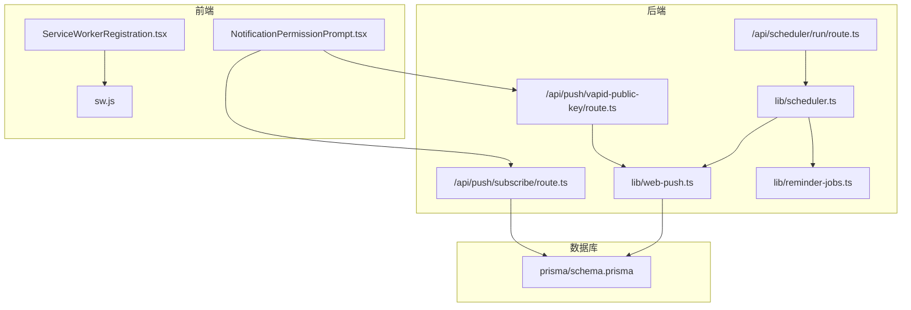
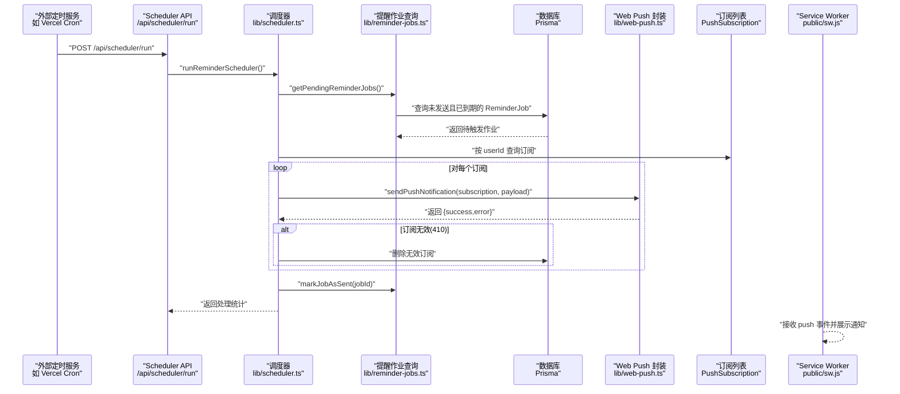
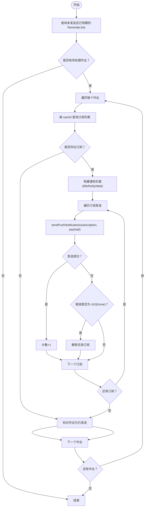
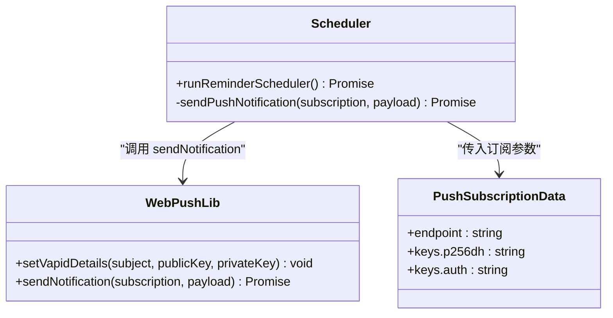
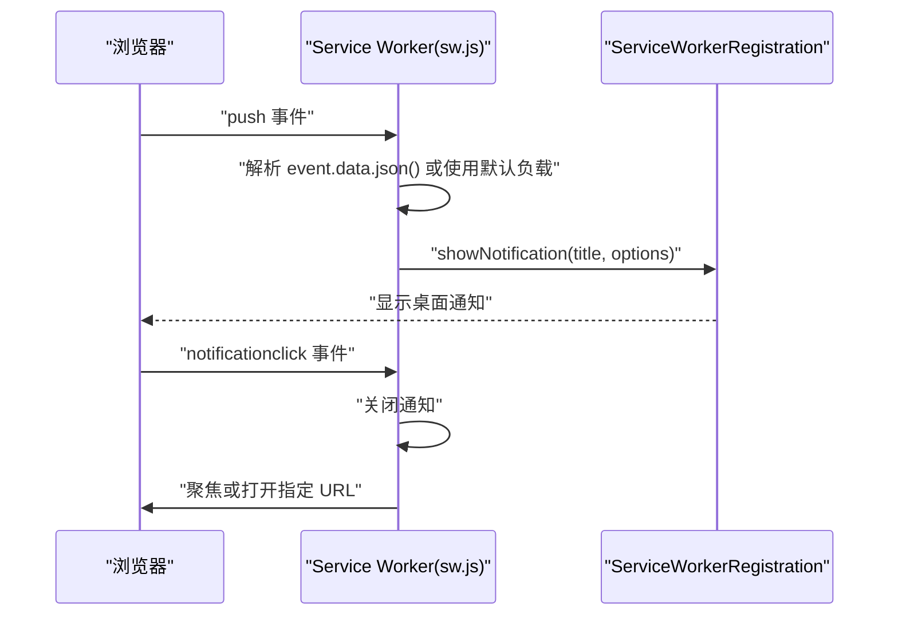
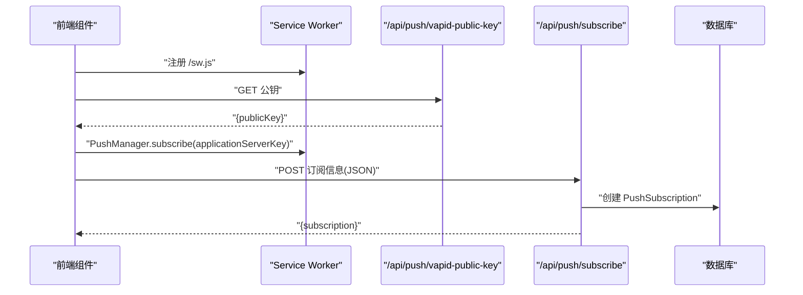
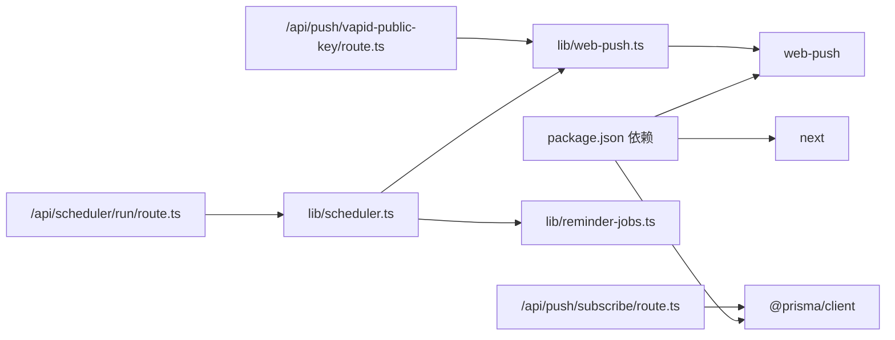
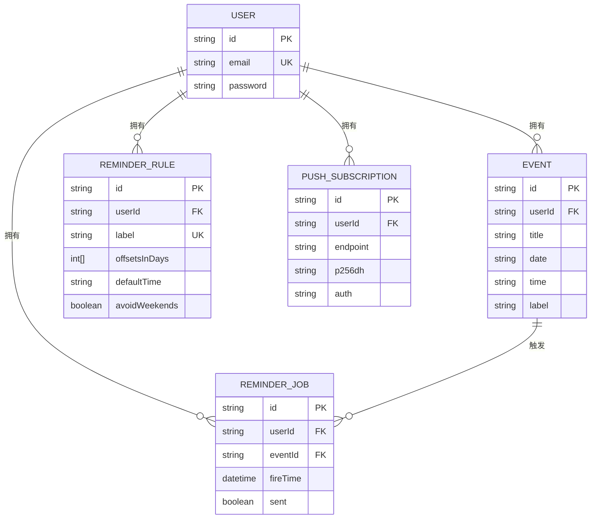

# 消息推送

<cite>
**本文引用的文件**
- [lib/scheduler.ts](file://lib/scheduler.ts)
- [lib/web-push.ts](file://lib/web-push.ts)
- [public/sw.js](file://public/sw.js)
- [app/api/push/subscribe/route.ts](file://app/api/push/subscribe/route.ts)
- [app/api/push/vapid-public-key/route.ts](file://app/api/push/vapid-public-key/route.ts)
- [app/api/scheduler/run/route.ts](file://app/api/scheduler/run/route.ts)
- [lib/reminder-jobs.ts](file://lib/reminder-jobs.ts)
- [components/ServiceWorkerRegistration.tsx](file://components/ServiceWorkerRegistration.tsx)
- [components/NotificationPermissionPrompt.tsx](file://components/NotificationPermissionPrompt.tsx)
- [prisma/schema.prisma](file://prisma/schema.prisma)
- [docs/SCHEDULER_SETUP.md](file://docs/SCHEDULER_SETUP.md)
- [docs/WEB_PUSH_DEBUG.md](file://docs/WEB_PUSH_DEBUG.md)
- [package.json](file://package.json)
</cite>

## 目录
1. [简介](#简介)
2. [项目结构](#项目结构)
3. [核心组件](#核心组件)
4. [架构总览](#架构总览)
5. [详细组件分析](#详细组件分析)
6. [依赖关系分析](#依赖关系分析)
7. [性能考虑](#性能考虑)
8. [故障排查指南](#故障排查指南)
9. [结论](#结论)
10. [附录](#附录)

## 简介
本文件系统性地文档化了 Web Push 消息推送的全链路流程，涵盖从调度器基于定时任务查询待触发的 ReminderJob，到通过 web-push 库发送加密消息，再到 Service Worker 接收 push 事件并展示桌面通知的完整过程。文档还解释了 VAPID 密钥在消息签名中的作用，以及 webpush.sendNotification 如何封装底层 HTTP/2 请求；同时给出消息负载结构与客户端行为控制（如 requireInteraction、vibrate），并提供性能优化建议（错误重试机制、无效订阅清理策略）。

## 项目结构
该仓库采用 Next.js 应用结构，消息推送相关代码主要分布在以下模块：
- 后端逻辑：lib/scheduler.ts、lib/web-push.ts、lib/reminder-jobs.ts、app/api/*
- 前端注册与提示：components/ServiceWorkerRegistration.tsx、components/NotificationPermissionPrompt.tsx
- Service Worker：public/sw.js
- 数据模型：prisma/schema.prisma
- 文档：docs/SCHEDULER_SETUP.md、docs/WEB_PUSH_DEBUG.md
- 依赖：package.json

图表来源
- [components/ServiceWorkerRegistration.tsx](file://components/ServiceWorkerRegistration.tsx#L5-L29)
- [components/NotificationPermissionPrompt.tsx](file://components/NotificationPermissionPrompt.tsx#L1-L77)
- [public/sw.js](file://public/sw.js#L1-L78)
- [app/api/scheduler/run/route.ts](file://app/api/scheduler/run/route.ts#L1-L37)
- [app/api/push/subscribe/route.ts](file://app/api/push/subscribe/route.ts#L1-L96)
- [app/api/push/vapid-public-key/route.ts](file://app/api/push/vapid-public-key/route.ts#L1-L13)
- [lib/scheduler.ts](file://lib/scheduler.ts#L1-L86)
- [lib/web-push.ts](file://lib/web-push.ts#L1-L54)
- [lib/reminder-jobs.ts](file://lib/reminder-jobs.ts#L1-L109)
- [prisma/schema.prisma](file://prisma/schema.prisma#L1-L86)

章节来源
- [package.json](file://package.json#L1-L62)

## 核心组件
- 调度器：周期性查询待触发的 ReminderJob，准备通知负载并逐个订阅发送。
- Web Push 封装：初始化 VAPID 凭据，封装 web-push.sendNotification 并处理错误。
- Service Worker：接收 push 事件，解析负载，调用 showNotification 显示桌面通知。
- 订阅管理：前端请求权限、订阅 Push，后端保存订阅信息；支持删除订阅。
- 提示组件：自动弹出权限请求并在授权后完成订阅。
- 数据模型：包含 User、Event、ReminderRule、ReminderJob、PushSubscription。

章节来源
- [lib/scheduler.ts](file://lib/scheduler.ts#L1-L86)
- [lib/web-push.ts](file://lib/web-push.ts#L1-L54)
- [public/sw.js](file://public/sw.js#L1-L78)
- [app/api/push/subscribe/route.ts](file://app/api/push/subscribe/route.ts#L1-L96)
- [app/api/push/vapid-public-key/route.ts](file://app/api/push/vapid-public-key/route.ts#L1-L13)
- [lib/reminder-jobs.ts](file://lib/reminder-jobs.ts#L1-L109)
- [components/ServiceWorkerRegistration.tsx](file://components/ServiceWorkerRegistration.tsx#L1-L30)
- [components/NotificationPermissionPrompt.tsx](file://components/NotificationPermissionPrompt.tsx#L1-L77)
- [prisma/schema.prisma](file://prisma/schema.prisma#L1-L86)

## 架构总览
下图展示了从“定时触发”到“客户端展示”的端到端流程，映射到实际源码文件。

图表来源
- [docs/SCHEDULER_SETUP.md](file://docs/SCHEDULER_SETUP.md#L1-L88)
- [app/api/scheduler/run/route.ts](file://app/api/scheduler/run/route.ts#L1-L37)
- [lib/scheduler.ts](file://lib/scheduler.ts#L1-L86)
- [lib/reminder-jobs.ts](file://lib/reminder-jobs.ts#L74-L109)
- [lib/web-push.ts](file://lib/web-push.ts#L25-L46)
- [prisma/schema.prisma](file://prisma/schema.prisma#L76-L85)
- [public/sw.js](file://public/sw.js#L12-L49)

## 详细组件分析

### 调度器：定时查询与发送
- 角色与职责
  - 周期性运行，查询未发送且已到期的 ReminderJob。
  - 为每个作业准备通知负载（title、body、data），并遍历用户的所有 PushSubscription 发送。
  - 处理发送错误，识别 410（Gone）并删除无效订阅。
  - 成功发送后标记作业为已发送。

- 关键流程
  - 查询待触发作业：使用 include event/user 获取关联数据，按 fireTime 升序处理。
  - 组装负载：包含标题、正文、事件 ID 与跳转 URL。
  - 发送循环：逐个订阅调用 sendPushNotification，记录成功数。
  - 清理无效订阅：当错误包含 statusCode=410 时删除该订阅。

- 错误处理
  - 捕获单个作业处理异常，不影响其他作业。
  - 订阅无效时删除，避免重复失败。

图表来源
- [lib/scheduler.ts](file://lib/scheduler.ts#L8-L85)
- [lib/reminder-jobs.ts](file://lib/reminder-jobs.ts#L74-L109)

章节来源
- [lib/scheduler.ts](file://lib/scheduler.ts#L1-L86)
- [lib/reminder-jobs.ts](file://lib/reminder-jobs.ts#L74-L109)

### Web Push 封装与 VAPID 签名
- 初始化 VAPID
  - 从环境变量读取公钥、私钥、subject，并调用 webpush.setVapidDetails 进行全局配置。
  - 若未配置，客户端获取公钥接口会返回错误。

- 发送通知
  - 接收 PushSubscriptionData（endpoint、keys）与 payload（title、body、可选 data）。
  - 将 payload JSON 序列化后调用 webpush.sendNotification。
  - 返回 {success, error}，便于上层处理。

- VAPID 的作用
  - 用于服务器端签名，确保浏览器信任来自可信来源的消息。
  - 客户端订阅时使用公钥作为 applicationServerKey，服务器端发送时使用私钥签名。

图表来源
- [lib/web-push.ts](file://lib/web-push.ts#L1-L54)
- [lib/scheduler.ts](file://lib/scheduler.ts#L43-L54)

章节来源
- [lib/web-push.ts](file://lib/web-push.ts#L1-L54)
- [app/api/push/vapid-public-key/route.ts](file://app/api/push/vapid-public-key/route.ts#L1-L13)

### Service Worker：接收 push 事件并展示通知
- push 事件处理
  - 优先从 event.data.json() 解析 payload，若失败则回退默认值。
  - 使用 registration.showNotification 展示通知，包含标题、正文、图标、徽章、自定义 data。
  - 设置 vibrate、tag、requireInteraction 等行为控制。

- notificationclick 事件处理
  - 关闭通知后，根据通知 data 中的 url 打开或聚焦已有窗口；若不存在则新开窗口。

- 生命周期事件
  - install/activate 中的日志与 skipWaiting/claim 有助于调试。

图表来源
- [public/sw.js](file://public/sw.js#L12-L73)

章节来源
- [public/sw.js](file://public/sw.js#L1-L78)

### 订阅管理：前端注册与后端存储
- 前端流程
  - ServiceWorkerRegistration 注册 /sw.js。
  - NotificationPermissionPrompt 在合适时机请求权限并订阅 Push。
  - 订阅时先获取 VAPID 公钥，然后使用 PushManager.subscribe 订阅，最后将订阅信息 POST 到 /api/push/subscribe。

- 后端流程
  - /api/push/subscribe/route.ts 校验 Token，解析并校验订阅体，去重后创建 PushSubscription。
  - /api/push/vapid-public-key/route.ts 返回 VAPID 公钥供前端订阅使用。

图表来源
- [components/ServiceWorkerRegistration.tsx](file://components/ServiceWorkerRegistration.tsx#L5-L29)
- [components/NotificationPermissionPrompt.tsx](file://components/NotificationPermissionPrompt.tsx#L51-L73)
- [app/api/push/vapid-public-key/route.ts](file://app/api/push/vapid-public-key/route.ts#L1-L13)
- [app/api/push/subscribe/route.ts](file://app/api/push/subscribe/route.ts#L1-L96)
- [prisma/schema.prisma](file://prisma/schema.prisma#L76-L85)

章节来源
- [components/ServiceWorkerRegistration.tsx](file://components/ServiceWorkerRegistration.tsx#L1-L30)
- [components/NotificationPermissionPrompt.tsx](file://components/NotificationPermissionPrompt.tsx#L1-L77)
- [app/api/push/subscribe/route.ts](file://app/api/push/subscribe/route.ts#L1-L96)
- [app/api/push/vapid-public-key/route.ts](file://app/api/push/vapid-public-key/route.ts#L1-L13)
- [prisma/schema.prisma](file://prisma/schema.prisma#L76-L85)

### 消息负载结构与客户端行为控制
- 负载字段
  - title：通知标题
  - body：通知正文
  - data：自定义数据对象，可在 notificationclick 时用于决定跳转 URL
  - icon/badge：图标与徽章
- 客户端行为
  - vibrate：震动模式数组
  - tag：通知标签，用于覆盖同标签通知
  - requireInteraction：保持通知可见直到用户交互

章节来源
- [lib/scheduler.ts](file://lib/scheduler.ts#L32-L40)
- [public/sw.js](file://public/sw.js#L38-L46)

## 依赖关系分析
- 外部依赖
  - web-push：负责 VAPID 签名与 HTTP/2 推送
  - Prisma：数据持久化与查询
  - Next.js API Routes：提供 /api/* 接口
- 内部依赖
  - scheduler.ts 依赖 reminder-jobs.ts 与 web-push.ts
  - web-push.ts 依赖环境变量配置
  - 前端组件依赖 API Routes 与 Service Worker

图表来源
- [package.json](file://package.json#L11-L36)
- [lib/scheduler.ts](file://lib/scheduler.ts#L1-L3)
- [lib/web-push.ts](file://lib/web-push.ts#L1-L1)
- [app/api/push/subscribe/route.ts](file://app/api/push/subscribe/route.ts#L1-L3)
- [app/api/push/vapid-public-key/route.ts](file://app/api/push/vapid-public-key/route.ts#L1-L2)
- [app/api/scheduler/run/route.ts](file://app/api/scheduler/run/route.ts#L1-L2)

章节来源
- [package.json](file://package.json#L1-L62)

## 性能考虑
- 错误重试机制
  - 当前实现仅在 410(Gone) 时删除无效订阅。建议对瞬时网络错误（如超时、5xx）增加指数退避重试，避免一次性重试导致抖动。
  - 可引入队列或延迟任务，将失败的订阅加入重试队列，分批重试。
- 无效订阅清理策略
  - 除 410 外，可定期扫描订阅状态，对长期不可达的订阅进行清理。
  - 建议记录最近一次发送时间与状态，超过阈值未送达的订阅标记为失效。
- 并发与吞吐
  - 发送循环为串行，建议改为并发限制（如每秒最多 N 次），避免对上游推送服务造成压力。
  - 对同一用户的多个订阅可并行发送，但需注意幂等与去重。
- 负载大小与序列化
  - payload 为 JSON 字符串，建议控制体积，避免超过浏览器或推送网关限制。
- 调度频率
  - 生产环境建议每分钟运行一次，避免过于频繁导致资源浪费。
  - 可根据业务量调整并发与批处理大小。

[本节为通用性能建议，不直接分析具体文件]

## 故障排查指南
- 权限问题
  - 不同浏览器对 Notification.requestPermission 的要求不同，需由直接用户手势触发。
  - Safari 需要较新系统版本；某些浏览器扩展（如广告拦截器）可能阻止权限请求。
- HTTPS 与本地开发
  - 本地 localhost/127.0.0.1 可正常使用；内网 IP 或自定义域名需 HTTPS。
- Service Worker 与通知
  - 确认 sw.js 已正确注册与激活；检查控制台日志。
  - 若通知未显示，检查 push 事件是否到达，以及 showNotification 参数是否正确。
- VAPID 配置
  - 未配置 VAPID 公钥/私钥时，/api/push/vapid-public-key 返回错误；请在环境变量中设置并重启服务。
- 调度器运行
  - 生产环境需配置外部定时服务（如 Vercel Cron、GitHub Actions、自建 Cron），确保 /api/scheduler/run 能被周期性调用。

章节来源
- [docs/WEB_PUSH_DEBUG.md](file://docs/WEB_PUSH_DEBUG.md#L1-L166)
- [app/api/push/vapid-public-key/route.ts](file://app/api/push/vapid-public-key/route.ts#L1-L13)
- [docs/SCHEDULER_SETUP.md](file://docs/SCHEDULER_SETUP.md#L1-L88)

## 结论
该系统实现了完整的 Web Push 推送链路：前端通过 Service Worker 与 Push API 订阅通知，后端通过定时任务查询待触发的提醒作业并使用 VAPID 签名发送加密消息，最终由客户端展示桌面通知。通过合理的错误处理与订阅清理策略，可提升系统的稳定性与用户体验。建议进一步引入重试与并发控制，以增强高负载场景下的可靠性。

[本节为总结性内容，不直接分析具体文件]

## 附录
- 数据模型概览（简化）
  - User：拥有多个 Events、ReminderRules、ReminderJobs、PushSubscriptions
  - Event：与 ReminderJobs 关联
  - ReminderRule：按标签定义提醒偏移与默认时间
  - ReminderJob：按 fireTime 与 sent 标记状态
  - PushSubscription：保存 endpoint 与密钥材料

图表来源
- [prisma/schema.prisma](file://prisma/schema.prisma#L16-L85)