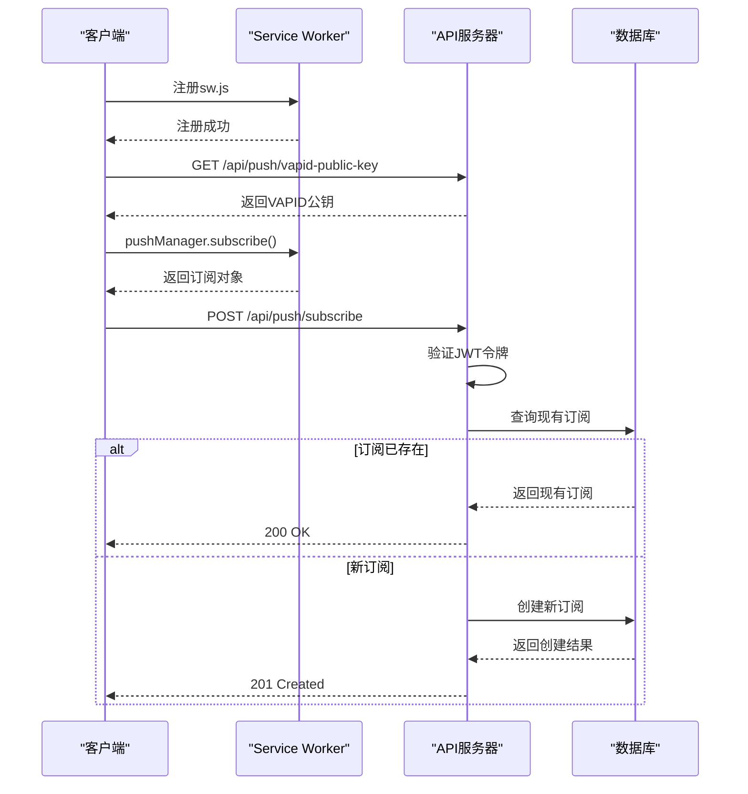
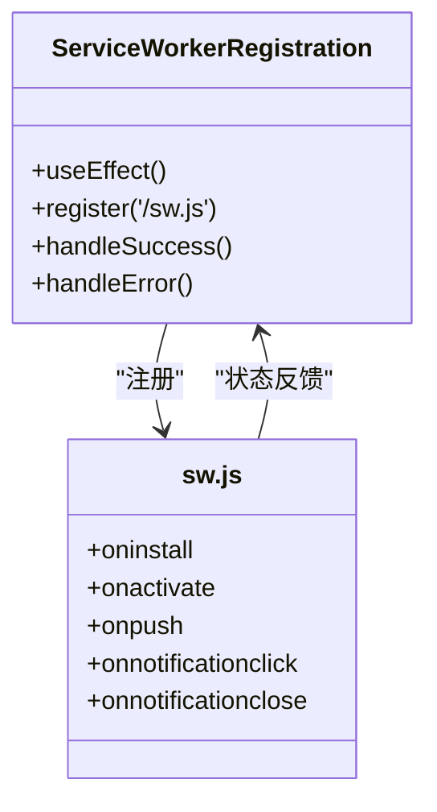
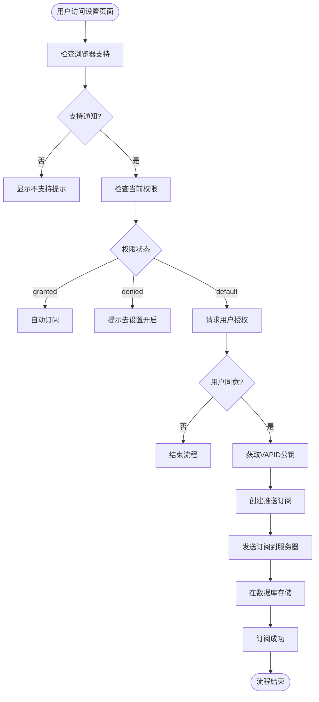
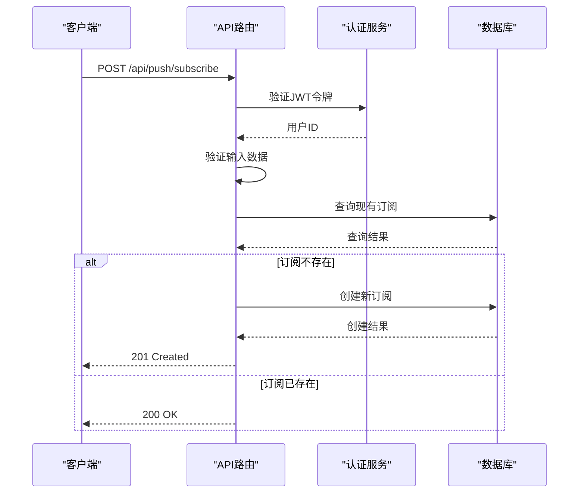
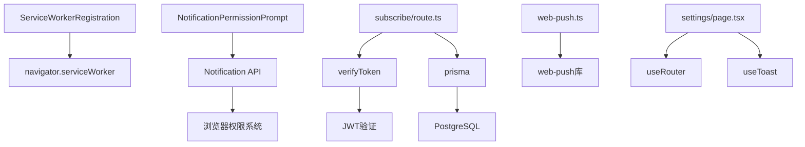

# 订阅管理

<cite>
**本文档引用的文件**   
- [sw.js](file://public/sw.js)
- [ServiceWorkerRegistration.tsx](file://components/ServiceWorkerRegistration.tsx)
- [vapid-public-key/route.ts](file://app/api/push/vapid-public-key/route.ts)
- [subscribe/route.ts](file://app/api/push/subscribe/route.ts)
- [web-push.ts](file://lib/web-push.ts)
- [schema.prisma](file://prisma/schema.prisma)
- [NotificationPermissionPrompt.tsx](file://components/NotificationPermissionPrompt.tsx)
- [settings/page.tsx](file://app/settings/page.tsx)
- [WEB_PUSH_DEBUG.md](file://docs/WEB_PUSH_DEBUG.md)
</cite>

## 目录
1. [简介](#简介)
2. [项目结构](#项目结构)
3. [核心组件](#核心组件)
4. [架构概述](#架构概述)
5. [详细组件分析](#详细组件分析)
6. [依赖分析](#依赖分析)
7. [性能考虑](#性能考虑)
8. [故障排除指南](#故障排除指南)
9. [结论](#结论)

## 简介
本文档深入文档化Web Push订阅管理机制，涵盖从客户端Service Worker注册到服务器端持久化推送订阅信息的完整流程。系统通过VAPID协议实现安全的推送通知功能，确保用户在关闭页面后仍能收到提醒。文档详细说明了前端如何获取VAPID公钥并发起订阅请求，以及后端如何验证用户身份并将订阅信息与用户账户绑定存储。

## 项目结构
项目采用Next.js架构，Web Push相关功能分布在多个目录中。核心功能包括客户端Service Worker注册、API路由处理和数据库持久化。系统通过模块化设计将权限管理、订阅处理和通知发送分离，确保代码的可维护性和安全性。

```mermaid
graph TB
subgraph "客户端"
A[ServiceWorkerRegistration]
B[NotificationPermissionPrompt]
C[Settings Page]
end
subgraph "服务端"
D[/api/push/vapid-public-key]
E[/api/push/subscribe]
F[PushSubscription Model]
end
A --> |注册| G[sw.js]
B --> |请求权限| A
C --> |触发订阅| D
D --> |返回公钥| C
C --> |发送订阅| E
E --> |存储| F
```

**Diagram sources**
- [ServiceWorkerRegistration.tsx](file://components/ServiceWorkerRegistration.tsx)
- [subscribe/route.ts](file://app/api/push/subscribe/route.ts)
- [schema.prisma](file://prisma/schema.prisma)

**Section sources**
- [public/sw.js](file://public/sw.js)
- [components/ServiceWorkerRegistration.tsx](file://components/ServiceWorkerRegistration.tsx)
- [app/api/push/](file://app/api/push/)

## 核心组件
系统的核心组件包括Service Worker注册机制、VAPID密钥管理、订阅API路由和数据库模型。这些组件协同工作，实现了完整的Web Push功能。客户端通过Service Worker处理推送事件，服务器端通过验证JWT令牌确保订阅请求来自已认证用户，并将订阅数据安全地存储在数据库中。

**Section sources**
- [sw.js](file://public/sw.js)
- [web-push.ts](file://lib/web-push.ts)
- [schema.prisma](file://prisma/schema.prisma)

## 架构概述
系统采用标准的Web Push架构，基于VAPID（Voluntary Application Server Identification）协议。架构分为客户端和服务端两大部分，通过HTTPS安全通信。客户端负责注册Service Worker、请求用户权限和发起订阅；服务端负责提供VAPID公钥、验证用户身份和持久化订阅信息。



**Diagram sources**
- [vapid-public-key/route.ts](file://app/api/push/vapid-public-key/route.ts)
- [subscribe/route.ts](file://app/api/push/subscribe/route.ts)
- [web-push.ts](file://lib/web-push.ts)

## 详细组件分析

### Service Worker 注册分析
Service Worker是Web Push的基础，负责在后台处理推送事件。系统通过ServiceWorkerRegistration组件在页面加载时自动注册sw.js，确保Service Worker在应用生命周期早期就绪。



**Diagram sources**
- [ServiceWorkerRegistration.tsx](file://components/ServiceWorkerRegistration.tsx)
- [sw.js](file://public/sw.js)

**Section sources**
- [ServiceWorkerRegistration.tsx](file://components/ServiceWorkerRegistration.tsx)
- [layout.tsx](file://app/layout.tsx)

### 订阅流程分析
订阅流程从用户交互开始，经过权限请求、公钥获取、订阅创建到最终持久化。系统在设置页面提供用户界面，允许用户主动开启通知功能，并处理各种权限状态。



**Diagram sources**
- [settings/page.tsx](file://app/settings/page.tsx)
- [NotificationPermissionPrompt.tsx](file://components/NotificationPermissionPrompt.tsx)

**Section sources**
- [settings/page.tsx](file://app/settings/page.tsx)
- [NotificationPermissionPrompt.tsx](file://components/NotificationPermissionPrompt.tsx)

### API 路由分析
API路由处理订阅生命周期的所有操作，包括创建和删除订阅。系统通过严格的输入验证和用户身份验证确保安全性，同时处理重复订阅的情况，避免数据库冗余。



**Diagram sources**
- [subscribe/route.ts](file://app/api/push/subscribe/route.ts)
- [auth.ts](file://lib/auth.ts)

**Section sources**
- [subscribe/route.ts](file://app/api/push/subscribe/route.ts)
- [vapid-public-key/route.ts](file://app/api/push/vapid-public-key/route.ts)

## 依赖分析
系统依赖关系清晰，各组件职责分明。前端组件依赖浏览器API和Next.js客户端功能，后端API依赖认证服务和数据库服务。VAPID密钥管理独立于业务逻辑，确保安全性。



**Diagram sources**
- [go.mod](file://package.json)
- [subscribe/route.ts](file://app/api/push/subscribe/route.ts)

**Section sources**
- [package.json](file://package.json)
- [lib/auth.ts](file://lib/auth.ts)
- [lib/prisma.ts](file://lib/prisma.ts)

## 性能考虑
系统在性能方面做了多项优化。Service Worker的预缓存策略减少了网络请求，API路由的重复订阅检查避免了不必要的数据库写入。VAPID公钥的静态返回减少了计算开销，而JWT令牌验证的同步处理确保了请求的快速响应。

## 故障排除指南
常见问题包括订阅失败、权限被拒绝和浏览器兼容性问题。文档提供了详细的诊断步骤和解决方案，帮助开发者快速定位和解决问题。

**Section sources**
- [WEB_PUSH_DEBUG.md](file://docs/WEB_PUSH_DEBUG.md)
- [sw.js](file://public/sw.js)
- [settings/page.tsx](file://app/settings/page.tsx)

## 结论
本系统实现了完整的Web Push订阅管理机制，通过现代化的Next.js架构和VAPID协议，提供了安全可靠的推送通知功能。代码结构清晰，组件职责分明，具备良好的可维护性和扩展性。通过详细的文档和调试指南，开发者可以快速理解和维护这一功能模块。