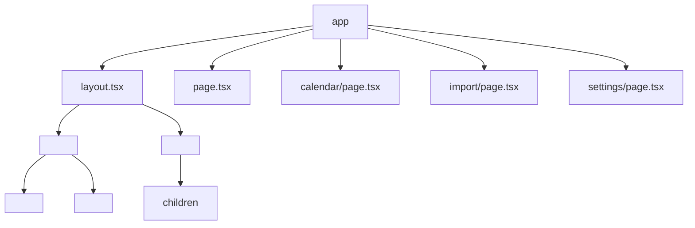
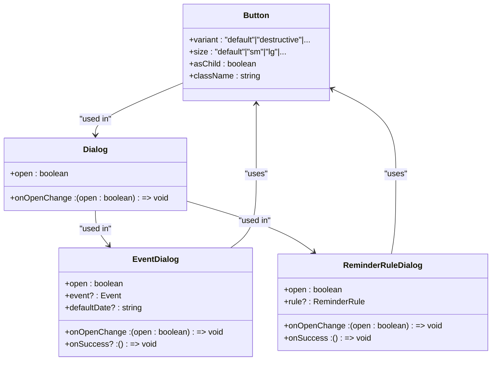
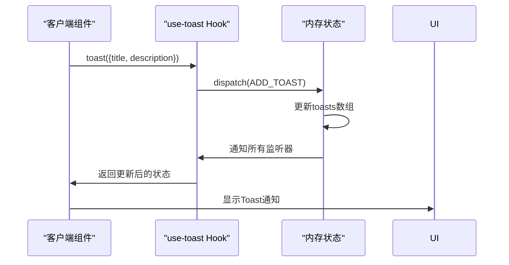
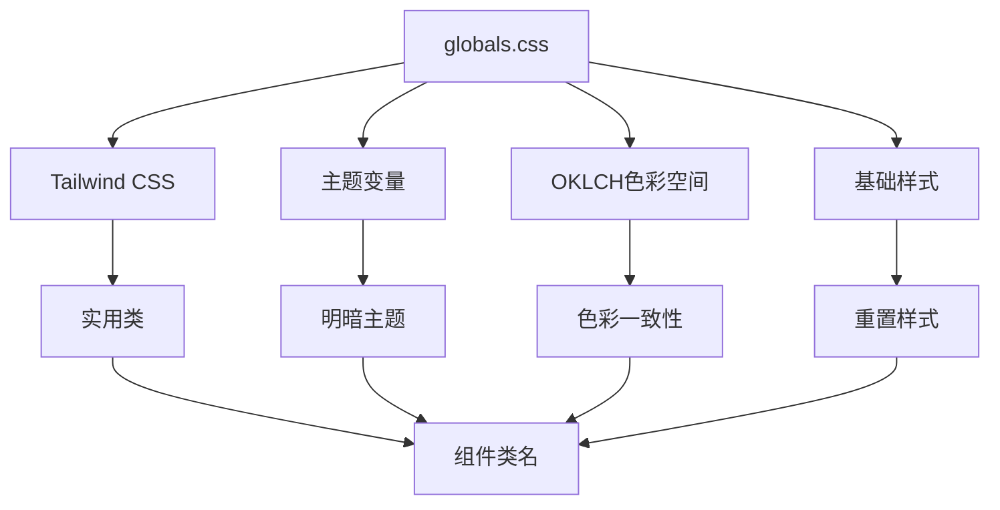
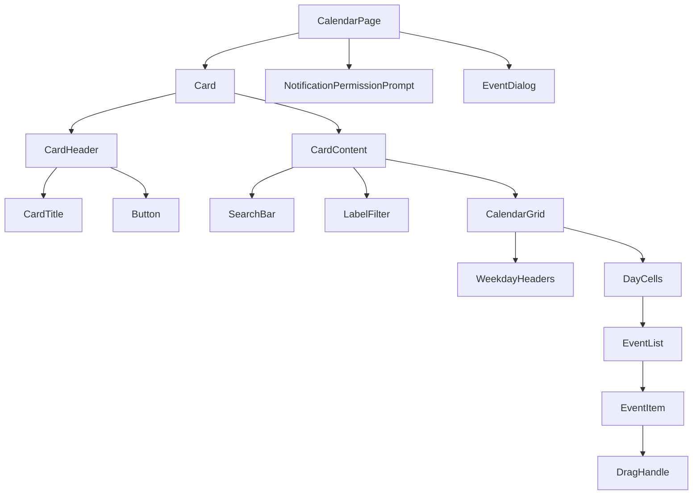

# 前端架构

<cite>
**本文档中引用的文件**   
- [layout.tsx](file://app/layout.tsx)
- [globals.css](file://app/globals.css)
- [use-toast.ts](file://hooks/use-toast.ts)
- [button.tsx](file://components/ui/button.tsx)
- [EventDialog.tsx](file://components/EventDialog.tsx)
- [ReminderRuleDialog.tsx](file://components/ReminderRuleDialog.tsx)
- [dialog.tsx](file://components/ui/dialog.tsx)
- [toaster.tsx](file://components/ui/toaster.tsx)
- [calendar/page.tsx](file://app/calendar/page.tsx)
- [import/page.tsx](file://app/import/page.tsx)
- [settings/page.tsx](file://app/settings/page.tsx)
- [LoadingSpinner.tsx](file://components/LoadingSpinner.tsx)
- [utils.ts](file://lib/utils.ts)
- [HYDRATION_FIX.md](file://docs/HYDRATION_FIX.md)
</cite>

## 目录
1. [项目结构](#项目结构)
2. [页面路由与布局](#页面路由与布局)
3. [组件体系分层设计](#组件体系分层设计)
4. [React Server Components与客户端组件混合使用](#react-server-components与客户端组件混合使用)
5. [全局样式与Tailwind集成](#全局样式与tailwind集成)
6. [组件树结构示例](#组件树结构示例)
7. [性能优化考虑](#性能优化考虑)

## 项目结构

项目采用Next.js App Router架构，核心前端文件位于`app`目录下，通过文件夹命名直接映射路由路径。UI组件分为基础组件（`components/ui/`）和业务组件（如`EventDialog`），实现了清晰的分层设计。

**Section sources**
- [app](file://app)
- [components](file://components)

## 页面路由与布局

Next.js App Router通过`app`目录下的文件夹结构实现路由组织。每个子目录（如`calendar`、`import`、`settings`）对应一个路由路径，其内部的`page.tsx`文件作为页面入口。根目录下的`layout.tsx`提供全局布局结构，被所有页面共享。

`layout.tsx`定义了HTML文档的基本结构，包括字体加载、元数据配置，并通过`<ServiceWorkerRegistration />`和`<Toaster />`注入全局功能组件。该布局在服务端渲染时添加`suppressHydrationWarning`属性以避免水合警告，确保服务端与客户端渲染一致性。

**Diagram sources **
- [layout.tsx](file://app/layout.tsx#L22-L39)
- [calendar/page.tsx](file://app/calendar/page.tsx)
- [import/page.tsx](file://app/import/page.tsx)
- [settings/page.tsx](file://app/settings/page.tsx)

**Section sources**
- [layout.tsx](file://app/layout.tsx#L1-L40)
- [app](file://app)

## 组件体系分层设计

组件体系采用分层设计模式，分为基础UI组件和业务组件两大层级，实现高内聚低耦合的架构。

### 基础UI组件

位于`components/ui/`目录下的基础UI组件（如`button.tsx`、`dialog.tsx`）基于Radix UI构建，提供可复用的原子化UI元素。这些组件通过`cva`定义样式变体，利用`cn`工具函数合并Tailwind类名，确保样式一致性。例如，`Button`组件支持多种变体（default、destructive、outline等）和尺寸（default、sm、lg等），并通过`asChild`属性实现内容透传。

### 业务组件

业务组件（如`EventDialog`、`ReminderRuleDialog`）封装特定业务逻辑，复用基础UI组件构建复杂界面。`EventDialog`处理日程创建与编辑，集成表单验证（zod）、状态管理（react-hook-form）和API交互；`ReminderRuleDialog`管理提醒规则，支持标签、提前天数、默认时间等配置。这些组件通过props接收控制参数（如`open`、`onOpenChange`），实现与父组件的双向通信。

**Diagram sources **
- [button.tsx](file://components/ui/button.tsx#L39-L60)
- [dialog.tsx](file://components/ui/dialog.tsx#L9-L143)
- [EventDialog.tsx](file://components/EventDialog.tsx#L39-L227)
- [ReminderRuleDialog.tsx](file://components/ReminderRuleDialog.tsx#L25-L173)

**Section sources**
- [components/ui](file://components/ui)
- [EventDialog.tsx](file://components/EventDialog.tsx)
- [ReminderRuleDialog.tsx](file://components/ReminderRuleDialog.tsx)

## React Server Components与客户端组件混合使用

项目采用混合渲染策略，合理分配服务端与客户端组件职责。`layout.tsx`和`page.tsx`文件默认为服务端组件，负责初始HTML生成和数据获取；而交互式组件则标记为客户端组件，通过`'use client'`指令启用。

`use-toast`自定义Hook是客户端状态管理的典型示例，它维护一个全局的`toasts`状态数组，通过发布-订阅模式实现跨组件通信。当组件调用`toast()`函数时，会触发状态更新，所有监听器（listeners）同步刷新，确保通知在`Toaster`组件中正确显示。这种设计避免了传统Context API的重渲染问题，提升了性能。

**Diagram sources **
- [use-toast.ts](file://hooks/use-toast.ts#L1-L192)
- [toaster.tsx](file://components/ui/toaster.tsx#L1-L36)

**Section sources**
- [use-toast.ts](file://hooks/use-toast.ts)
- [toaster.tsx](file://components/ui/toaster.tsx)

## 全局样式与Tailwind集成

全局样式通过`app/globals.css`文件集中管理，采用现代CSS架构。文件导入Tailwind CSS和动画库，并定义主题变量和颜色系统。通过OKLCH色彩空间定义明暗主题，确保色彩一致性与可访问性。

Tailwind类名与`cn`工具函数深度集成，`cn`函数结合`clsx`和`tailwind-merge`，智能合并和去重类名，解决样式覆盖问题。例如，`button.tsx`中通过`cn(buttonVariants({ variant, size, className }))`动态生成最终类名，既支持预设变体，又允许外部扩展。

**Diagram sources **
- [globals.css](file://app/globals.css#L1-L123)
- [utils.ts](file://lib/utils.ts#L1-L7)
- [button.tsx](file://components/ui/button.tsx)

**Section sources**
- [globals.css](file://app/globals.css)
- [utils.ts](file://lib/utils.ts)

## 组件树结构示例

以`calendar/page.tsx`为例，展示页面如何组合多个子组件形成完整界面。页面根组件包含日历视图、搜索过滤区、通知权限提示和事件对话框，形成清晰的组件树结构。

**Diagram sources **
- [calendar/page.tsx](file://app/calendar/page.tsx#L27-L468)

**Section sources**
- [calendar/page.tsx](file://app/calendar/page.tsx)

## 性能优化考虑

项目在性能优化方面采取多项策略，包括组件懒加载和水合问题处理。`HYDRATION_FIX.md`文档详细说明了如何通过`suppressHydrationWarning`属性解决由浏览器扩展引起的水合警告，避免不必要的客户端重渲染。

对于非关键路径组件，可采用动态导入实现懒加载。虽然当前代码未显式使用`next/dynamic`，但架构已为懒加载做好准备。例如，大型对话框或复杂表单可按需加载，减少初始包体积。同时，客户端状态管理（如`use-toast`）采用轻量级发布-订阅模式，避免全局状态重渲染，提升交互响应速度。

**Section sources**
- [HYDRATION_FIX.md](file://docs/HYDRATION_FIX.md#L1-L128)
- [layout.tsx](file://app/layout.tsx#L28-L31)