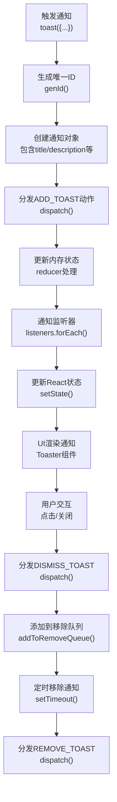
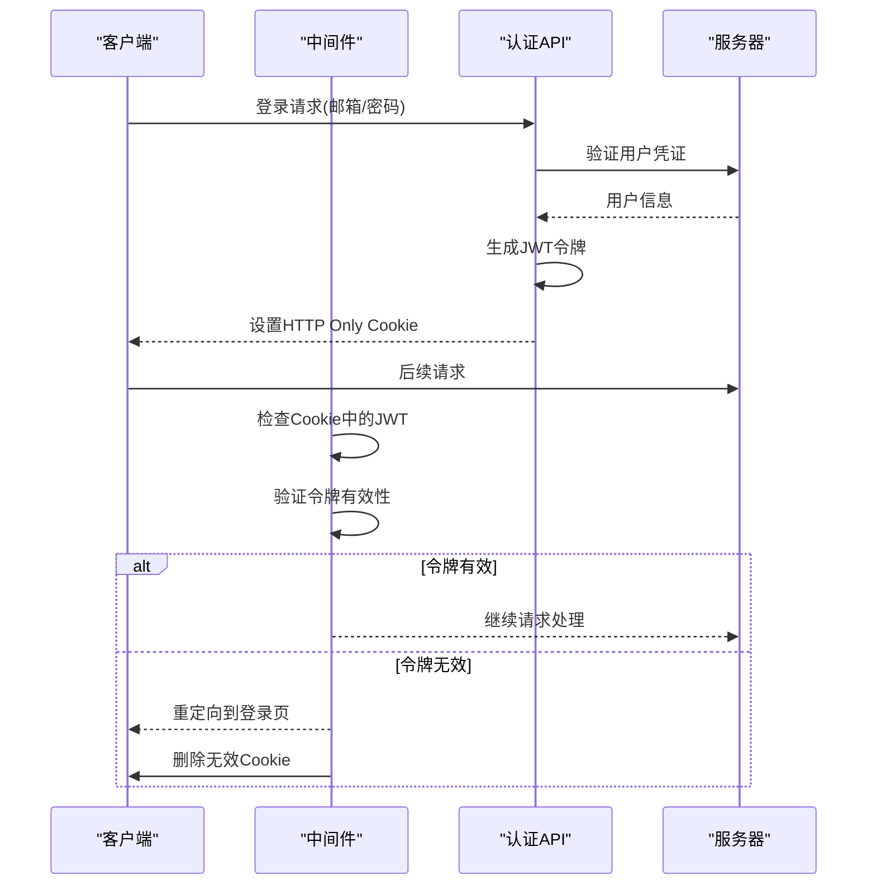
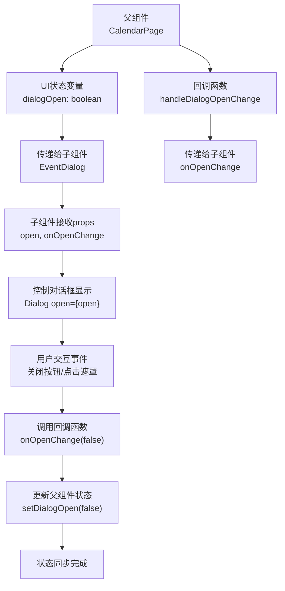
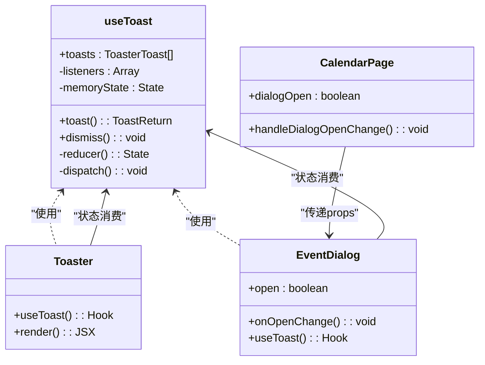
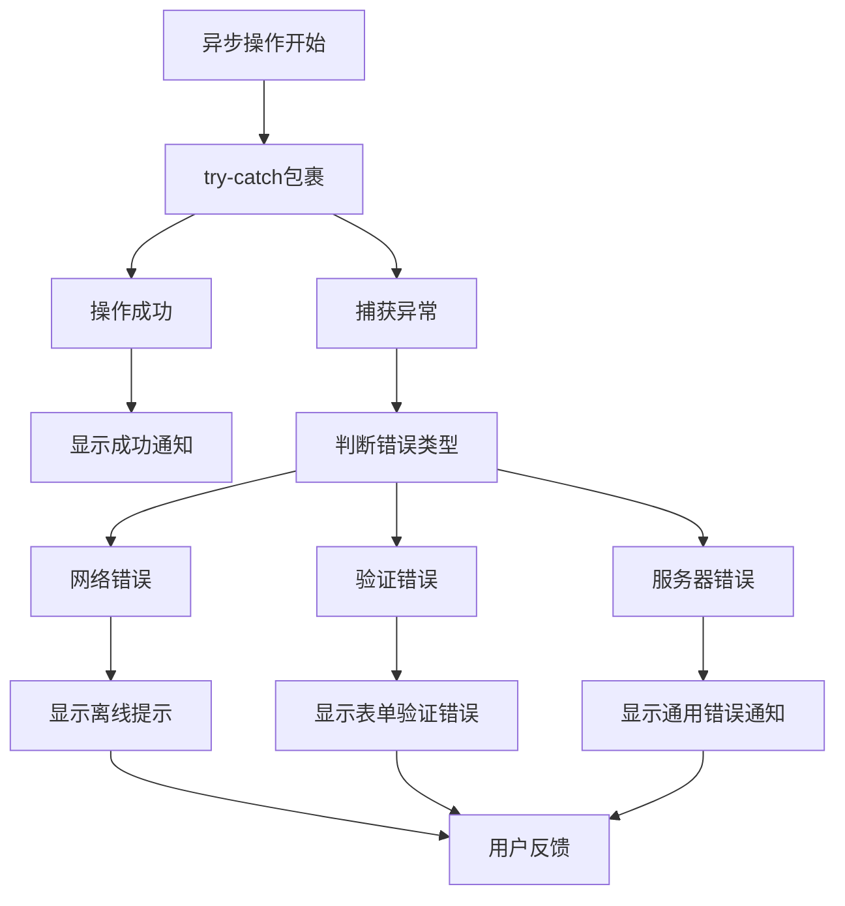
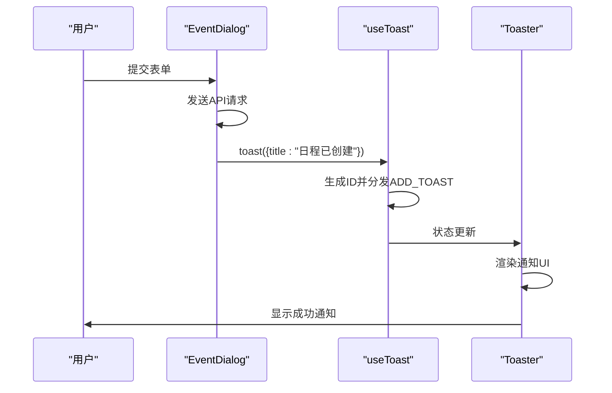
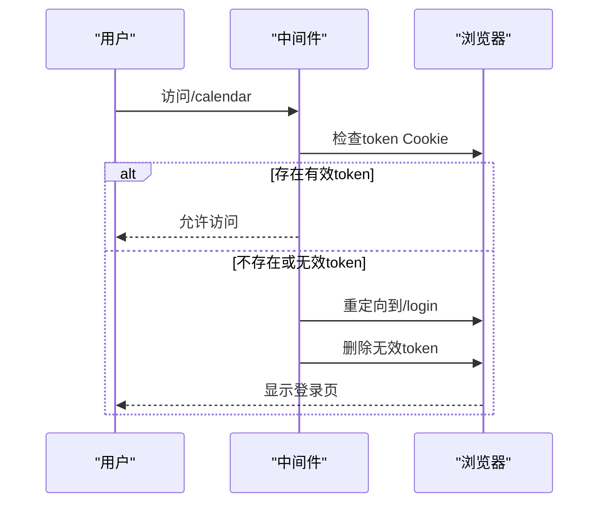

# 状态管理

<cite>
**本文档中引用的文件**   
- [use-toast.ts](file://hooks/use-toast.ts)
- [sonner.tsx](file://components/ui/sonner.tsx)
- [toaster.tsx](file://components/ui/toaster.tsx)
- [toast.tsx](file://components/ui/toast.tsx)
- [auth.ts](file://lib/auth.ts)
- [login/route.ts](file://app/api/auth/login/route.ts)
- [logout/route.ts](file://app/api/auth/logout/route.ts)
- [register/route.ts](file://app/api/auth/register/route.ts)
- [middleware.ts](file://middleware.ts)
- [EventDialog.tsx](file://components/EventDialog.tsx)
- [ReminderRuleDialog.tsx](file://components/ReminderRuleDialog.tsx)
- [layout.tsx](file://app/layout.tsx)
- [calendar/page.tsx](file://app/calendar/page.tsx)
</cite>

## 目录
1. [简介](#简介)
2. [全局通知状态管理](#全局通知状态管理)
3. [用户认证状态管理](#用户认证状态管理)
4. [全局UI状态管理](#全局ui状态管理)
5. [状态持久化与跨组件通信](#状态持久化与跨组件通信)
6. [错误状态处理策略](#错误状态处理策略)
7. [典型使用场景](#典型使用场景)
8. [总结](#总结)

## 简介
本项目采用多种状态管理机制来处理不同类型的应用状态。系统通过自定义Hook `use-toast` 与 Sonner 库集成实现全局通知状态管理，使用 JWT 存储于 HTTP Only Cookie 中进行用户认证状态管理，并通过 props 传递和回调函数控制全局UI状态（如对话框的打开/关闭）。这些机制共同构成了一个完整、安全且用户友好的状态管理体系。

## 全局通知状态管理

项目中的全局通知状态管理基于自定义Hook `use-toast.ts` 与 Sonner 库的深度集成。该机制实现了通知状态的发布、消费和生命周期管理。

**Diagram sources**
- [use-toast.ts](file://hooks/use-toast.ts#L1-L191)
- [toaster.tsx](file://components/ui/toaster.tsx#L1-L36)

**Section sources**
- [use-toast.ts](file://hooks/use-toast.ts#L1-L191)
- [sonner.tsx](file://components/ui/sonner.tsx#L1-L41)
- [toaster.tsx](file://components/ui/toaster.tsx#L1-L36)

## 用户认证状态管理

用户认证状态通过JWT存储于HTTP Only Cookie中进行管理，结合中间件在服务端进行身份验证，并将用户状态通过API暴露给客户端。

**Diagram sources**
- [auth.ts](file://lib/auth.ts#L1-L30)
- [login/route.ts](file://app/api/auth/login/route.ts#L1-L57)
- [middleware.ts](file://middleware.ts#L1-L50)

**Section sources**
- [auth.ts](file://lib/auth.ts#L1-L30)
- [login/route.ts](file://app/api/auth/login/route.ts#L1-L57)
- [logout/route.ts](file://app/api/auth/logout/route.ts#L1-L13)
- [register/route.ts](file://app/api/auth/register/route.ts#L1-L53)
- [middleware.ts](file://middleware.ts#L1-L50)

## 全局UI状态管理

全局UI状态（如对话框打开/关闭）通过props传递与回调函数进行控制，实现了父子组件之间的状态同步。

**Diagram sources**
- [EventDialog.tsx](file://components/EventDialog.tsx#L1-L227)
- [calendar/page.tsx](file://app/calendar/page.tsx#L1-L468)

**Section sources**
- [EventDialog.tsx](file://components/EventDialog.tsx#L1-L227)
- [ReminderRuleDialog.tsx](file://components/ReminderRuleDialog.tsx#L1-L173)
- [calendar/page.tsx](file://app/calendar/page.tsx#L1-L468)

## 状态持久化与跨组件通信

系统通过多种机制实现状态持久化和跨组件通信，确保状态在不同组件间的一致性和持久性。

### 状态持久化机制
- **HTTP Only Cookie**: 用于持久化JWT令牌，防止XSS攻击
- **内存状态**: `use-toast` 使用内存变量 `memoryState` 持久化通知状态
- **浏览器存储**: 通过Service Worker实现通知状态的后台持久化

### 跨组件通信模式
- **自定义Hook**: `use-toast` 作为全局状态管理器，允许多个组件订阅和发布通知
- **Props传递**: 通过组件props传递状态和回调函数
- **事件系统**: 基于监听器模式的发布-订阅系统

**Diagram sources**
- [use-toast.ts](file://hooks/use-toast.ts#L1-L191)
- [toaster.tsx](file://components/ui/toaster.tsx#L1-L36)
- [EventDialog.tsx](file://components/EventDialog.tsx#L1-L227)

**Section sources**
- [use-toast.ts](file://hooks/use-toast.ts#L1-L191)
- [toaster.tsx](file://components/ui/toaster.tsx#L1-L36)
- [layout.tsx](file://app/layout.tsx#L1-L40)

## 错误状态处理策略

系统实现了全面的错误状态处理策略，确保用户体验的健壮性和友好性。

### 错误处理层级
1. **API层错误处理**: 在API路由中捕获和处理错误
2. **组件层错误处理**: 在组件中使用try-catch处理异步操作
3. **全局错误处理**: 通过通知系统向用户展示错误信息

### 错误状态管理特点
- **用户友好**: 将技术性错误信息转换为用户可理解的提示
- **一致性**: 统一的错误通知样式和位置
- **可恢复性**: 提供明确的恢复路径或重试选项

**Diagram sources**
- [EventDialog.tsx](file://components/EventDialog.tsx#L1-L227)
- [ReminderRuleDialog.tsx](file://components/ReminderRuleDialog.tsx#L1-L173)
- [settings/page.tsx](file://app/settings/page.tsx#L145-L181)

**Section sources**
- [EventDialog.tsx](file://components/EventDialog.tsx#L1-L227)
- [ReminderRuleDialog.tsx](file://components/ReminderRuleDialog.tsx#L1-L173)
- [settings/page.tsx](file://app/settings/page.tsx#L145-L181)

## 典型使用场景

### 通知系统的使用场景
在 `EventDialog` 组件中，当用户成功创建或更新日程时，系统会发布一个成功通知：

### 认证状态的使用场景
当用户访问受保护的路由时，中间件会验证其认证状态：

**Section sources**
- [EventDialog.tsx](file://components/EventDialog.tsx#L1-L227)
- [calendar/page.tsx](file://app/calendar/page.tsx#L1-L468)
- [middleware.ts](file://middleware.ts#L1-L50)

## 总结
本项目的状态管理机制设计合理，涵盖了通知、认证和UI状态等多个方面。通过自定义Hook `use-toast` 实现了高效的全局通知管理，利用HTTP Only Cookie和中间件确保了认证状态的安全性，采用props传递和回调函数的方式实现了UI状态的精确控制。这些机制共同构建了一个健壮、安全且用户友好的应用状态管理体系。