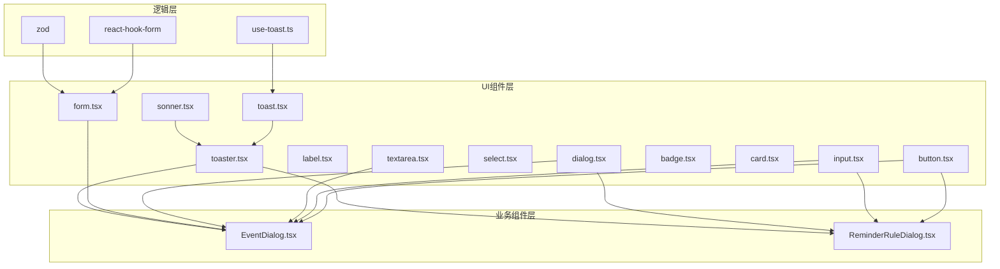
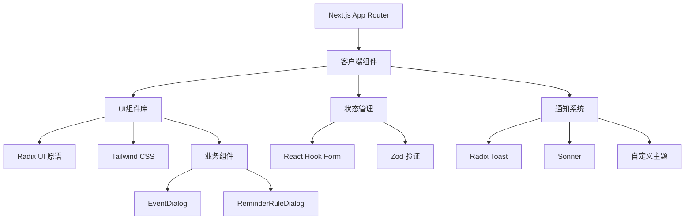
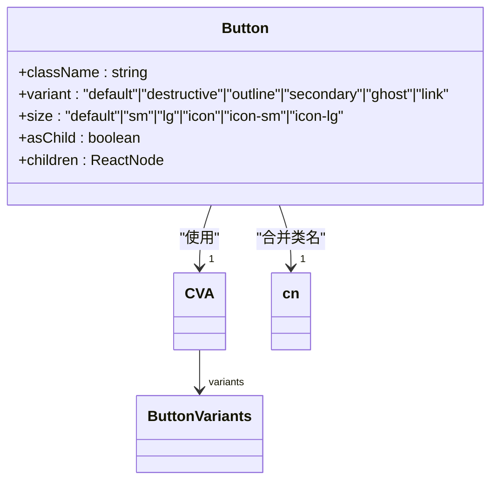
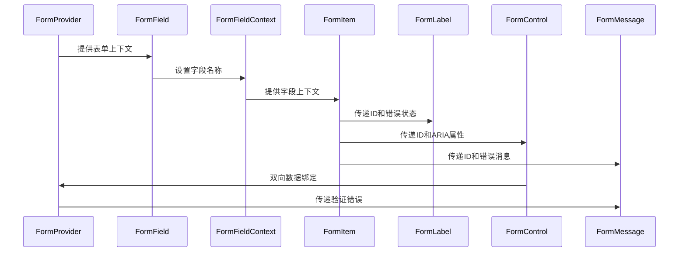
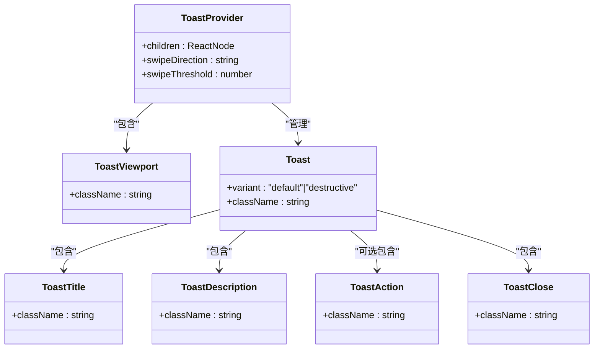
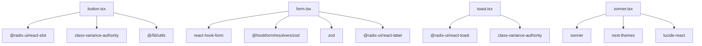

# UI组件库

<cite>
**本文档中引用的文件**  
- [button.tsx](file://components/ui/button.tsx)
- [input.tsx](file://components/ui/input.tsx)
- [dialog.tsx](file://components/ui/dialog.tsx)
- [form.tsx](file://components/ui/form.tsx)
- [label.tsx](file://components/ui/label.tsx)
- [textarea.tsx](file://components/ui/textarea.tsx)
- [select.tsx](file://components/ui/select.tsx)
- [badge.tsx](file://components/ui/badge.tsx)
- [card.tsx](file://components/ui/card.tsx)
- [toast.tsx](file://components/ui/toast.tsx)
- [sonner.tsx](file://components/ui/sonner.tsx)
- [toaster.tsx](file://components/ui/toaster.tsx)
- [use-toast.ts](file://hooks/use-toast.ts)
- [EventDialog.tsx](file://components/EventDialog.tsx)
- [ReminderRuleDialog.tsx](file://components/ReminderRuleDialog.tsx)
</cite>

## 目录
1. [简介](#简介)
2. [项目结构](#项目结构)
3. [核心组件](#核心组件)
4. [架构概览](#架构概览)
5. [详细组件分析](#详细组件分析)
6. [依赖分析](#依赖分析)
7. [性能考虑](#性能考虑)
8. [故障排除指南](#故障排除指南)
9. [结论](#结论)

## 简介
本项目实现了一套基于Radix UI与Tailwind CSS的现代化UI组件库，专为Next.js应用设计。组件库通过`'use client'`指令启用客户端交互功能，结合React Hook Form与Zod实现强大的表单验证能力，并利用Tailwind的utility-first类系统提供灵活的样式定制。核心组件包括Button、Input、Dialog、Form、Label、Textarea、Select等基础元素，以及基于这些组件构建的业务级对话框如EventDialog和ReminderRuleDialog。通知系统通过Radix UI的Toast组件与Sonner库结合实现轻量级用户反馈机制。

## 项目结构
项目采用标准的Next.js App Router架构，UI组件集中存放在`components/ui/`目录下，遵循原子设计原则。业务组件位于`components/`根目录，通过组合基础UI组件构建复杂界面。表单处理逻辑统一采用React Hook Form与Zod验证库，通知系统基于Radix UI的Toast组件并扩展自定义主题。

**Diagram sources**
- [components/ui/button.tsx](file://components/ui/button.tsx)
- [components/ui/input.tsx](file://components/ui/input.tsx)
- [components/ui/dialog.tsx](file://components/ui/dialog.tsx)
- [components/ui/form.tsx](file://components/ui/form.tsx)
- [components/ui/toast.tsx](file://components/ui/toast.tsx)
- [components/ui/sonner.tsx](file://components/ui/sonner.tsx)
- [components/ui/toaster.tsx](file://components/ui/toaster.tsx)
- [hooks/use-toast.ts](file://hooks/use-toast.ts)
- [components/EventDialog.tsx](file://components/EventDialog.tsx)
- [components/ReminderRuleDialog.tsx](file://components/ReminderRuleDialog.tsx)

**Section sources**
- [components/ui/button.tsx](file://components/ui/button.tsx)
- [components/ui/input.tsx](file://components/ui/input.tsx)
- [components/ui/dialog.tsx](file://components/ui/dialog.tsx)

## 核心组件

基础UI组件采用Radix UI作为底层可访问性原语，通过Tailwind CSS进行样式化封装。每个组件都遵循一致的设计模式：使用`data-slot`属性标记组件插槽，通过`cn()`工具函数合并类名，支持`asChild`模式以保持DOM结构灵活性。组件广泛使用Aria-invalid等属性实现可访问性支持，并通过focus-visible类确保键盘导航的可见性。

**Section sources**
- [components/ui/button.tsx](file://components/ui/button.tsx)
- [components/ui/input.tsx](file://components/ui/input.tsx)
- [components/ui/label.tsx](file://components/ui/label.tsx)

## 架构概览

系统架构采用分层设计，基础UI组件提供可复用的视觉元素，表单系统集成状态管理与验证逻辑，通知系统实现用户反馈机制。所有交互式组件均标记为客户端组件，确保在浏览器环境中正确渲染。主题支持通过Next Themes实现暗色模式切换，样式系统基于Tailwind CSS的配置文件定义设计令牌。

**Diagram sources**
- [components/ui/button.tsx](file://components/ui/button.tsx)
- [components/ui/form.tsx](file://components/ui/form.tsx)
- [components/ui/toast.tsx](file://components/ui/toast.tsx)
- [hooks/use-toast.ts](file://hooks/use-toast.ts)

## 详细组件分析

### 基础UI组件分析

#### Button组件
按钮组件使用CVA（Class Variant Authority）定义多种变体（default、destructive、outline等）和尺寸（default、sm、lg、icon等）。通过`asChild`属性支持插槽模式，允许将样式应用到子组件。组件包含完整的焦点管理和可访问性支持，包括禁用状态、错误状态和键盘导航。

**Diagram sources**
- [components/ui/button.tsx](file://components/ui/button.tsx#L7-L60)

#### Input与Textarea组件
输入框和文本域组件实现了统一的样式规范，包含焦点状态、错误状态和占位符样式。组件通过`data-slot`属性标识，支持标准的HTML输入属性。样式系统包含对文件输入的特殊处理，确保跨浏览器一致性。

**Section sources**
- [components/ui/input.tsx](file://components/ui/input.tsx)
- [components/ui/textarea.tsx](file://components/ui/textarea.tsx)

#### 表单组件封装
表单系统基于React Hook Form构建，提供高级抽象组件如`<FormField>`、`<FormItem>`、`<FormLabel>`等。这些组件通过React Context实现状态共享，自动处理ID生成、错误传播和可访问性属性同步。`useFormField`钩子提供统一的API访问表单字段状态。

**Diagram sources**
- [components/ui/form.tsx](file://components/ui/form.tsx#L19-L167)

#### 对话框组件
对话框组件基于Radix UI的Dialog原语构建，提供完整的模态交互功能。组件包含Overlay、Content、Header、Footer、Title、Description等子组件，支持可配置的关闭按钮。动画效果通过data-state属性与CSS类结合实现平滑的进入/退出过渡。

**Section sources**
- [components/ui/dialog.tsx](file://components/ui/dialog.tsx)

### 通知系统分析

#### Toast与Toaster组件
通知系统由`toast.tsx`和`toaster.tsx`组成，基于Radix UI的Toast组件实现。`Toast`组件定义了通知的视觉样式和交互行为，支持默认和破坏性（destructive）两种变体。`Toaster`组件作为容器，通过`useToast`钩子订阅通知状态，渲染活动的通知列表。

**Diagram sources**
- [components/ui/toast.tsx](file://components/ui/toast.tsx)
- [components/ui/toaster.tsx](file://components/ui/toaster.tsx)

#### use-toast钩子
`use-toast.ts`文件实现了全局通知状态管理，采用单例模式存储通知队列。钩子使用Reducer模式处理ADD_TOAST、UPDATE_TOAST、DISMISS_TOAST、REMOVE_TOAST四种操作类型。通知ID通过递增计数器生成，超时机制确保通知在指定时间后自动移除。

**Section sources**
- [hooks/use-toast.ts](file://hooks/use-toast.ts)

#### Sonner主题集成
`sonner.tsx`组件封装了Sonner库，适配项目的设计系统。通过`useTheme`钩子获取当前主题（系统、亮色、暗色），并设置CSS变量控制通知外观。图标系统集成Lucide React图标，为不同通知类型（成功、信息、警告、错误、加载）提供视觉反馈。

**Section sources**
- [components/ui/sonner.tsx](file://components/ui/sonner.tsx)

## 依赖分析

组件库依赖关系清晰分层，基础组件仅依赖Radix UI、Tailwind工具函数和图标库。表单组件额外依赖React Hook Form和Zod。通知系统依赖Radix Toast和Sonner库。所有组件通过绝对路径导入（@/components/ui/...），确保导入一致性。

**Diagram sources**
- [components/ui/button.tsx](file://components/ui/button.tsx#L2-L3)
- [components/ui/form.tsx](file://components/ui/form.tsx#L7-L14)
- [components/ui/toast.tsx](file://components/ui/toast.tsx#L4-L5)
- [components/ui/sonner.tsx](file://components/ui/sonner.tsx#L3-L11)

**Section sources**
- [components/ui/button.tsx](file://components/ui/button.tsx)
- [components/ui/form.tsx](file://components/ui/form.tsx)
- [components/ui/toast.tsx](file://components/ui/toast.tsx)
- [components/ui/sonner.tsx](file://components/ui/sonner.tsx)

## 性能考虑

组件库在性能方面进行了多项优化：使用`React.memo`避免不必要的重新渲染，通过`useId`生成稳定的ID，采用事件委托减少事件处理器数量。表单验证采用Zod的同步验证模式，确保用户输入的即时反馈。通知系统通过限制同时显示的通知数量（TOAST_LIMIT=1）避免界面混乱。

## 故障排除指南

常见问题包括：客户端组件 hydration 错误，可通过确保所有交互式组件正确标记`'use client'`解决；表单验证失败，需检查Zod模式与输入数据类型匹配；通知不显示，应验证`<Toaster />`组件是否在布局中正确渲染。暗色模式切换问题可通过检查`next-themes`配置解决。

**Section sources**
- [components/ui/dialog.tsx](file://components/ui/dialog.tsx#L1)
- [components/ui/form.tsx](file://components/ui/form.tsx#L1)
- [components/ui/sonner.tsx](file://components/ui/sonner.tsx#L1)
- [hooks/use-toast.ts](file://hooks/use-toast.ts#L1)

## 结论

该项目的UI组件库展示了现代化React组件设计的最佳实践：基于Radix UI确保可访问性，通过Tailwind CSS实现灵活样式，利用React Hook Form和Zod提供强大的表单处理能力。通知系统的设计体现了关注点分离原则，将状态管理、视觉呈现和主题集成解耦。整体架构支持高效复用，为业务组件如EventDialog和ReminderRuleDialog提供了坚实的基础。