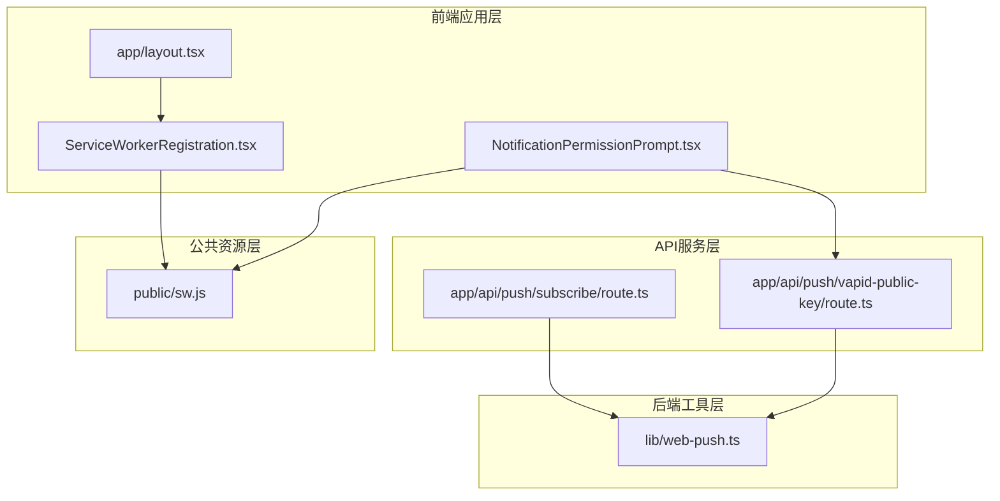
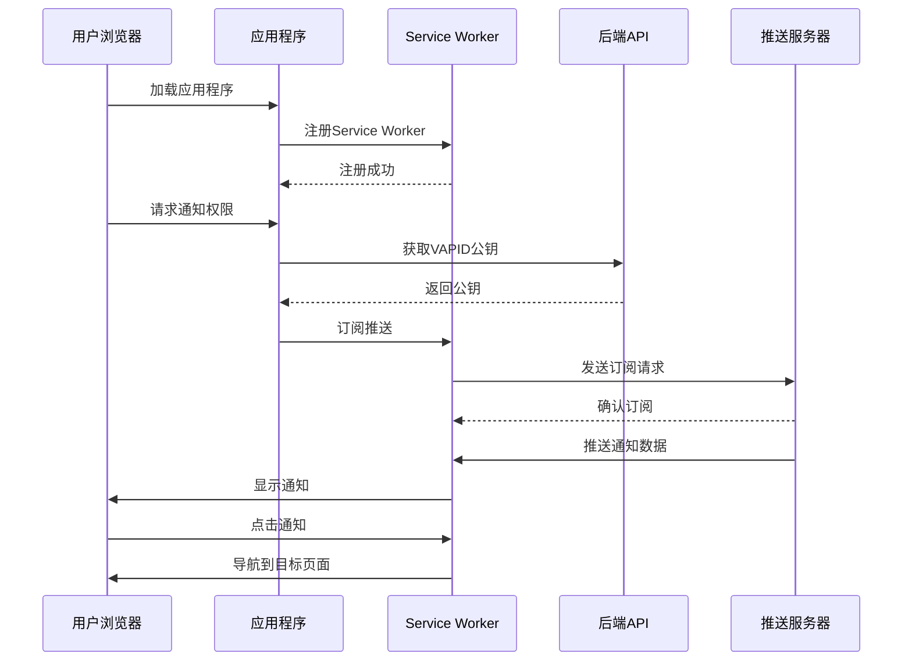
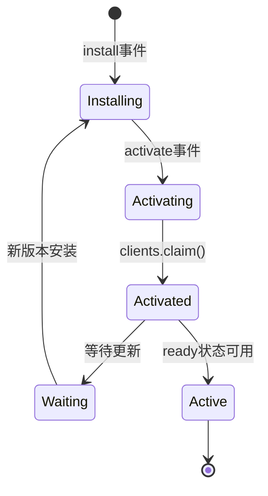
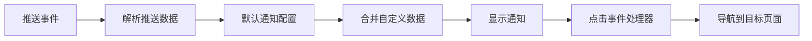
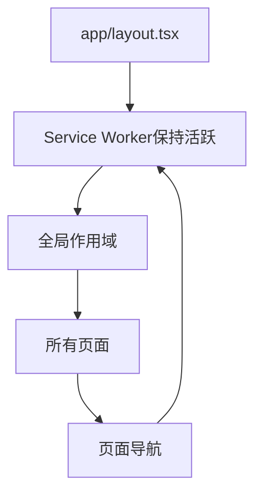
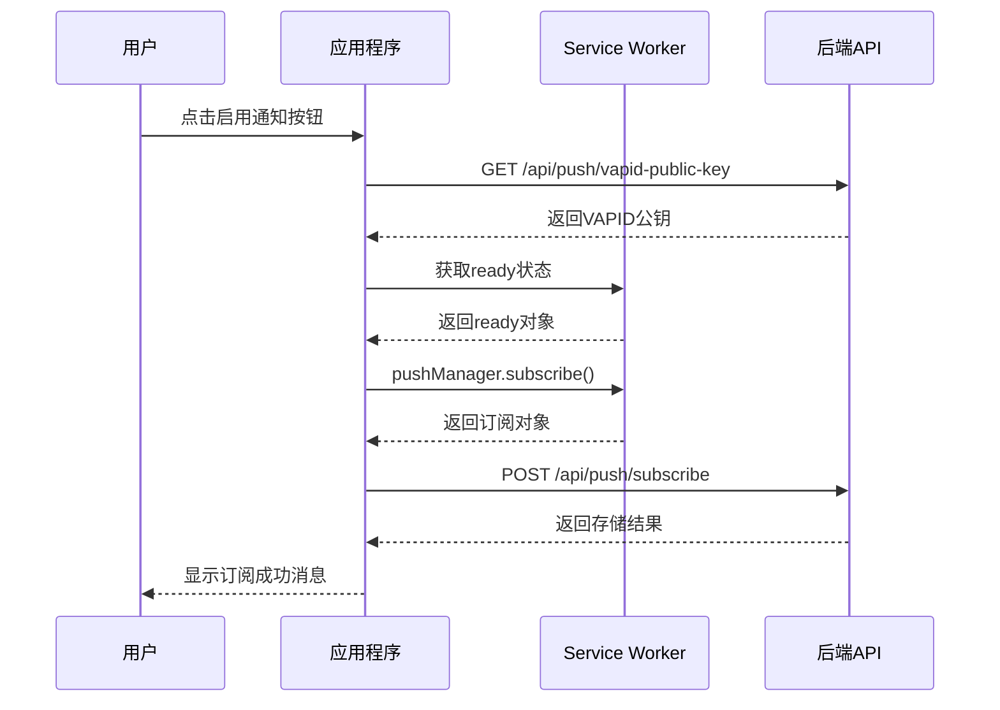
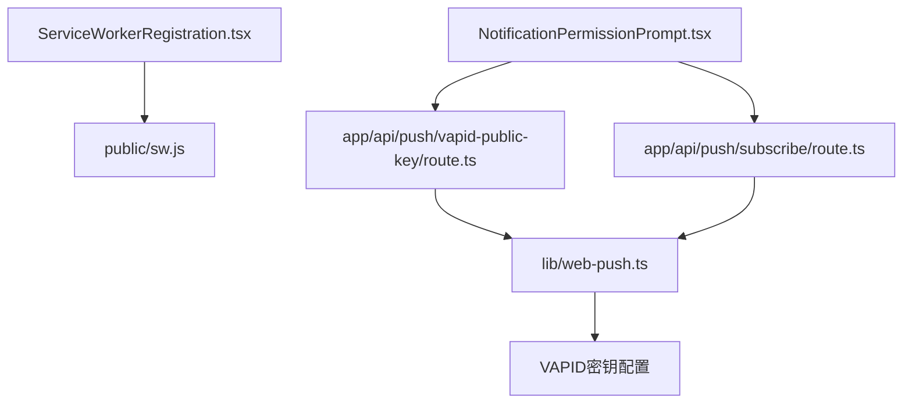
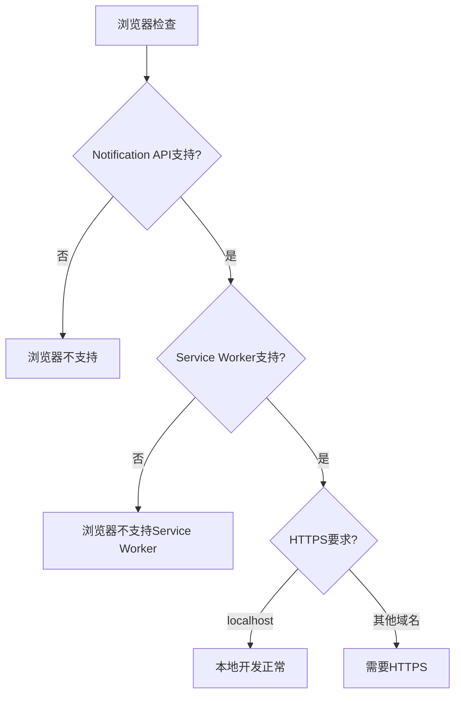

# Service Worker注册组件

<cite>
**本文档引用的文件**
- [ServiceWorkerRegistration.tsx](file://components/ServiceWorkerRegistration.tsx)
- [sw.js](file://public/sw.js)
- [layout.tsx](file://app/layout.tsx)
- [web-push.ts](file://lib/web-push.ts)
- [route.ts](file://app/api/push/subscribe/route.ts)
- [route.ts](file://app/api/push/vapid-public-key/route.ts)
- [NotificationPermissionPrompt.tsx](file://components/NotificationPermissionPrompt.tsx)
- [WEB_PUSH_DEBUG.md](file://docs/WEB_PUSH_DEBUG.md)
</cite>

## 目录
1. [简介](#简介)
2. [项目结构](#项目结构)
3. [核心组件](#核心组件)
4. [架构概览](#架构概览)
5. [详细组件分析](#详细组件分析)
6. [依赖关系分析](#依赖关系分析)
7. [性能考虑](#性能考虑)
8. [故障排除指南](#故障排除指南)
9. [结论](#结论)

## 简介

本文档深入解析了`ServiceWorkerRegistration.tsx`组件在客户端注册Service Worker的核心作用。该组件是实现Web Push通知功能的关键基础设施，负责在应用启动时自动检测和注册Service Worker，为后续的通知订阅和接收奠定基础。

Service Worker作为独立的后台进程，在浏览器之外运行，能够拦截网络请求、缓存资源、处理推送通知等。在本项目中，它承担着接收服务器推送通知并将其转换为浏览器通知的重要职责。

## 项目结构

该项目采用Next.js框架构建，具有清晰的分层架构：



**图表来源**
- [layout.tsx](file://app/layout.tsx#L1-L40)
- [ServiceWorkerRegistration.tsx](file://components/ServiceWorkerRegistration.tsx#L1-L30)
- [sw.js](file://public/sw.js#L1-L78)

**章节来源**
- [layout.tsx](file://app/layout.tsx#L1-L40)
- [ServiceWorkerRegistration.tsx](file://components/ServiceWorkerRegistration.tsx#L1-L30)

## 核心组件

### ServiceWorkerRegistration组件

`ServiceWorkerRegistration.tsx`是一个轻量级的React客户端组件，专门负责Service Worker的自动注册。其核心功能包括：

1. **环境检测**：确保只在浏览器环境中执行，避免在服务器渲染时出现问题
2. **功能检测**：检查浏览器是否支持Service Worker API
3. **自动注册**：在支持的情况下自动注册`/sw.js`脚本
4. **状态监控**：输出注册范围和激活状态信息到控制台
5. **错误处理**：捕获并记录注册过程中的任何错误

该组件采用`useEffect`钩子确保在组件挂载时执行一次性的注册逻辑，且不依赖任何外部依赖项。

**章节来源**
- [ServiceWorkerRegistration.tsx](file://components/ServiceWorkerRegistration.tsx#L5-L29)

## 架构概览

整个Web Push通知系统的架构分为三个主要层次：



**图表来源**
- [ServiceWorkerRegistration.tsx](file://components/ServiceWorkerRegistration.tsx#L14-L22)
- [NotificationPermissionPrompt.tsx](file://components/NotificationPermissionPrompt.tsx#L51-L73)
- [sw.js](file://public/sw.js#L12-L49)

## 详细组件分析

### Service Worker注册流程

#### 组件实现分析

```mermaid
flowchart TD
Start([组件挂载]) --> CheckEnv{"检查环境<br/>typeof window"}
CheckEnv --> |否| ReturnNull[返回null]
CheckEnv --> |是| LogSupport[记录支持检查]
LogSupport --> CheckSW{"检查navigator.serviceWorker"}
CheckSW --> |否| WarnBrowser[记录不支持警告]
CheckSW --> |是| RegisterSW[调用register('/sw.js')]
RegisterSW --> Success{"注册成功?"}
Success --> |是| LogScope[记录注册范围]
Success --> |是| LogState[记录激活状态]
Success --> |否| LogError[记录错误信息]
LogScope --> End([完成])
LogState --> End
LogError --> End
WarnBrowser --> End
ReturnNull --> End
```

**图表来源**
- [ServiceWorkerRegistration.tsx](file://components/ServiceWorkerRegistration.tsx#L6-L26)

#### 关键实现细节

1. **条件检查**：组件首先验证运行环境，确保在浏览器而非服务器环境中执行
2. **API检测**：通过`'serviceWorker' in navigator`检查浏览器支持情况
3. **异步注册**：使用`navigator.serviceWorker.register('/sw.js')`进行异步注册
4. **状态输出**：成功注册后输出注册范围和激活状态到控制台
5. **错误捕获**：使用`.catch()`处理注册失败的情况

#### Service Worker生命周期

Service Worker的生命周期包括多个关键阶段：



**图表来源**
- [sw.js](file://public/sw.js#L2-L10)

### Service Worker脚本职责

#### 推送事件处理

Service Worker脚本负责处理来自服务器的推送通知：

1. **安装阶段**：跳过等待直接激活
2. **激活阶段**：声明控制所有客户端
3. **推送处理**：解析推送数据并显示通知
4. **点击处理**：处理用户点击通知的导航行为

#### 通知显示配置



**图表来源**
- [sw.js](file://public/sw.js#L12-L49)

**章节来源**
- [sw.js](file://public/sw.js#L1-L78)

### 应用集成方式

#### 根布局集成

Service Worker注册组件通过在应用根布局中引入来确保在所有页面中生效：



**图表来源**
- [layout.tsx](file://app/layout.tsx#L33-L33)

#### 组件使用位置

在`layout.tsx`中，Service Worker注册组件被放置在`<body>`标签内，紧随其他UI组件之前，确保在应用初始化时就完成注册。

**章节来源**
- [layout.tsx](file://app/layout.tsx#L33-L33)

### 完整的Web Push链路

#### 前端订阅流程



**图表来源**
- [NotificationPermissionPrompt.tsx](file://components/NotificationPermissionPrompt.tsx#L51-L73)

**章节来源**
- [NotificationPermissionPrompt.tsx](file://components/NotificationPermissionPrompt.tsx#L51-L73)

## 依赖关系分析

### 组件间依赖关系



**图表来源**
- [ServiceWorkerRegistration.tsx](file://components/ServiceWorkerRegistration.tsx#L1-L30)
- [NotificationPermissionPrompt.tsx](file://components/NotificationPermissionPrompt.tsx#L1-L77)

### 外部依赖

项目对外部依赖的使用相对简洁，主要依赖包括：

1. **web-push库**：用于发送推送通知到客户端
2. **Next.js框架**：提供React应用的基础架构
3. **Prisma**：数据库ORM，用于存储推送订阅信息

**章节来源**
- [package.json](file://package.json#L11-L36)

## 性能考虑

### Service Worker优势

1. **后台运行**：Service Worker在后台独立运行，不影响页面性能
2. **持久连接**：一旦注册成功，可以在应用关闭后继续接收通知
3. **离线支持**：可以缓存资源，提高应用的离线可用性
4. **多标签页共享**：同一域名下的多个标签页共享同一个Service Worker实例

### 性能优化建议

1. **懒加载策略**：仅在需要时才请求通知权限
2. **错误恢复**：在网络不稳定时提供重试机制
3. **内存管理**：定期清理不再使用的订阅
4. **缓存策略**：合理配置Service Worker的缓存策略

## 故障排除指南

### 常见问题诊断

根据项目文档，Web Push通知功能可能遇到以下问题：

#### 浏览器兼容性问题



**图表来源**
- [WEB_PUSH_DEBUG.md](file://docs/WEB_PUSH_DEBUG.md#L121-L155)

#### 权限问题排查

1. **权限状态检查**：使用`Notification.permission`检查当前权限状态
2. **隐身模式测试**：在隐身模式下测试权限请求
3. **浏览器设置**：检查浏览器的通知设置和扩展程序影响
4. **用户手势要求**：确保权限请求由直接的用户手势触发

#### Service Worker调试

1. **注册状态检查**：使用`navigator.serviceWorker.getRegistrations()`查看注册状态
2. **控制台输出**：关注组件输出的注册信息和错误日志
3. **生命周期监控**：观察Service Worker的安装、激活和更新过程

**章节来源**
- [WEB_PUSH_DEBUG.md](file://docs/WEB_PUSH_DEBUG.md#L1-L166)

### 错误处理机制

组件实现了完善的错误处理机制：

1. **环境检查**：避免在非浏览器环境中执行
2. **功能检测**：优雅降级处理不支持的浏览器
3. **异步错误捕获**：使用Promise的catch方法处理注册失败
4. **控制台日志**：提供详细的调试信息

**章节来源**
- [ServiceWorkerRegistration.tsx](file://components/ServiceWorkerRegistration.tsx#L20-L25)

## 结论

ServiceWorkerRegistration组件虽然代码简洁，但在整个Web Push通知系统中发挥着至关重要的作用。它通过自动化的方式确保Service Worker在应用启动时被正确注册，为后续的通知订阅和接收提供了可靠的基础。

该组件的设计体现了现代前端开发的最佳实践：
- **最小化依赖**：仅依赖React的useEffect钩子
- **环境安全**：严格的环境检查和条件执行
- **错误处理**：完善的异常捕获和日志记录
- **用户体验**：透明的注册过程，不影响应用性能

通过与NotificationPermissionPrompt组件、后端API服务以及Service Worker脚本的协同工作，整个Web Push通知系统形成了一个完整、可靠的实时通知解决方案。这种设计既保证了功能的完整性，又保持了代码的简洁性和可维护性。