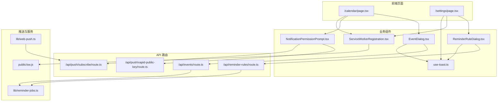
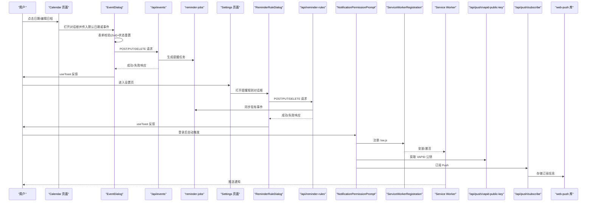
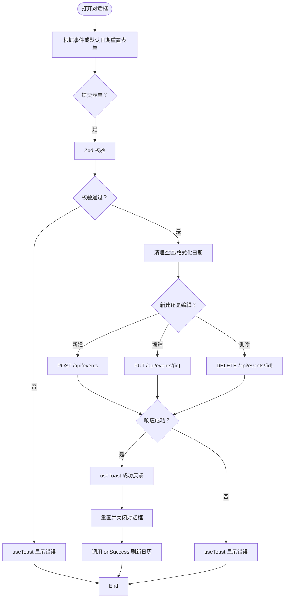
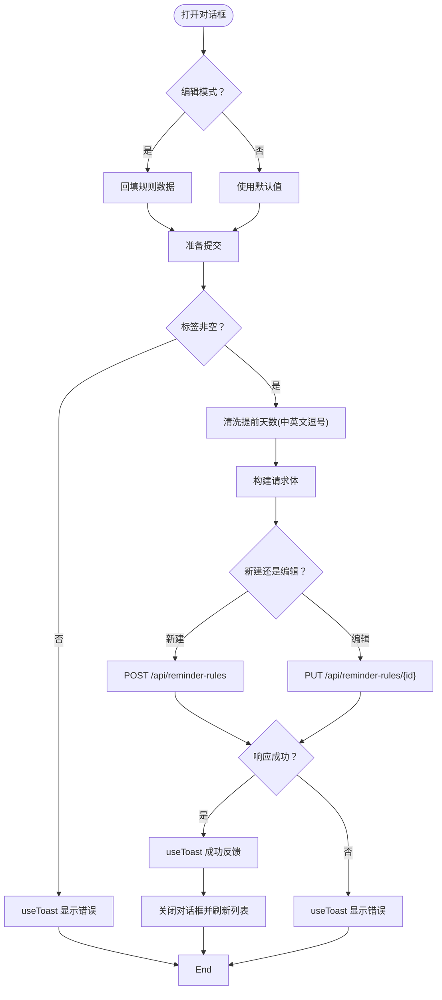
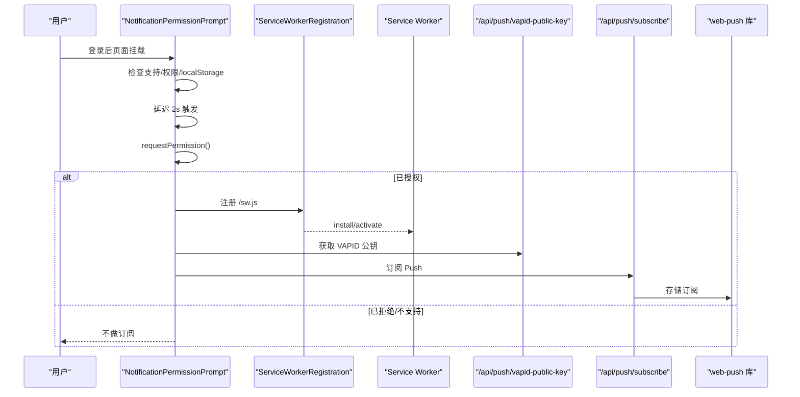
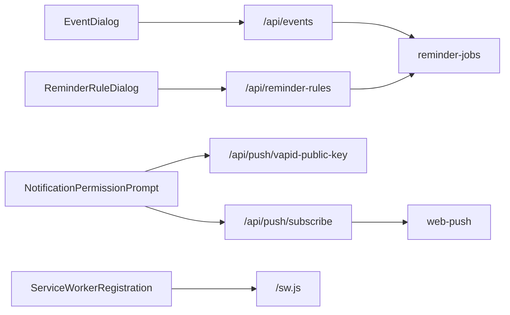

# 业务组件

<cite>
**本文引用的文件**
- [components/EventDialog.tsx](file://components/EventDialog.tsx)
- [components/ReminderRuleDialog.tsx](file://components/ReminderRuleDialog.tsx)
- [components/NotificationPermissionPrompt.tsx](file://components/NotificationPermissionPrompt.tsx)
- [components/ServiceWorkerRegistration.tsx](file://components/ServiceWorkerRegistration.tsx)
- [hooks/use-toast.ts](file://hooks/use-toast.ts)
- [app/api/events/route.ts](file://app/api/events/route.ts)
- [app/api/reminder-rules/route.ts](file://app/api/reminder-rules/route.ts)
- [app/api/push/subscribe/route.ts](file://app/api/push/subscribe/route.ts)
- [app/api/push/vapid-public-key/route.ts](file://app/api/push/vapid-public-key/route.ts)
- [app/calendar/page.tsx](file://app/calendar/page.tsx)
- [app/settings/page.tsx](file://app/settings/page.tsx)
- [lib/web-push.ts](file://lib/web-push.ts)
- [lib/reminder-jobs.ts](file://lib/reminder-jobs.ts)
- [public/sw.js](file://public/sw.js)
</cite>

## 目录
1. [简介](#简介)
2. [项目结构](#项目结构)
3. [核心组件](#核心组件)
4. [架构总览](#架构总览)
5. [组件详解](#组件详解)
6. [依赖关系分析](#依赖关系分析)
7. [性能考量](#性能考量)
8. [故障排查指南](#故障排查指南)
9. [结论](#结论)
10. [附录](#附录)

## 简介
本文件面向业务与技术读者，系统性解析 todo-csv-import 中与“日程管理”“提醒规则”“浏览器通知与Web Push”相关的核心前端组件与后端API。重点覆盖：
- EventDialog 如何结合 React Hook Form 与 Zod 实现日程创建/编辑的表单校验、状态重置、与 /api/events 的 POST/PUT/DELETE 交互及错误处理与用户反馈（useToast）
- ReminderRuleDialog 的提醒规则配置逻辑，包括标签绑定、提前天数数组处理（支持中英文逗号）、周末回避开关及其与 /api/reminder-rules 的通信
- NotificationPermissionPrompt 在用户登录后自动请求浏览器通知权限的机制，含权限状态判断、延迟提示策略、自动订阅 Push 服务（VAPID 公钥与订阅接口）
- ServiceWorkerRegistration 在客户端注册 /sw.js 支持 Web Push，包含生命周期监听与错误处理
- 组件间数据流图示，说明在 /calendar 与 /settings 页面中的组合使用方式

## 项目结构
本项目采用 Next.js App Router 结构，业务组件集中在 components 目录，API 路由位于 app/api 下，前端页面位于 app/*。通知与推送涉及 public/sw.js 与 lib/web-push.ts。

图表来源
- [app/calendar/page.tsx](file://app/calendar/page.tsx#L458-L464)
- [app/settings/page.tsx](file://app/settings/page.tsx#L278-L283)
- [components/EventDialog.tsx](file://components/EventDialog.tsx#L101-L133)
- [components/ReminderRuleDialog.tsx](file://components/ReminderRuleDialog.tsx#L74-L109)
- [components/NotificationPermissionPrompt.tsx](file://components/NotificationPermissionPrompt.tsx#L51-L73)
- [components/ServiceWorkerRegistration.tsx](file://components/ServiceWorkerRegistration.tsx#L5-L26)
- [app/api/events/route.ts](file://app/api/events/route.ts#L131-L199)
- [app/api/reminder-rules/route.ts](file://app/api/reminder-rules/route.ts#L41-L108)
- [app/api/push/subscribe/route.ts](file://app/api/push/subscribe/route.ts#L14-L62)
- [app/api/push/vapid-public-key/route.ts](file://app/api/push/vapid-public-key/route.ts#L4-L12)
- [public/sw.js](file://public/sw.js#L1-L78)
- [lib/web-push.ts](file://lib/web-push.ts#L28-L46)
- [lib/reminder-jobs.ts](file://lib/reminder-jobs.ts#L15-L72)

章节来源
- [app/calendar/page.tsx](file://app/calendar/page.tsx#L27-L467)
- [app/settings/page.tsx](file://app/settings/page.tsx#L21-L286)

## 核心组件
- EventDialog：基于 React Hook Form + Zod 的表单校验，负责日程的创建/更新/删除，与 /api/events 交互，并通过 useToast 提供即时反馈。
- ReminderRuleDialog：配置提醒规则，支持标签绑定、提前天数数组（中英文逗号兼容）、周末回避开关，与 /api/reminder-rules 交互。
- NotificationPermissionPrompt：登录后自动请求通知权限，必要时延迟触发，成功后自动订阅 Push，调用 /api/push/vapid-public-key 与 /api/push/subscribe。
- ServiceWorkerRegistration：注册 /sw.js，监听安装/激活/错误等生命周期事件，支撑 Web Push。

章节来源
- [components/EventDialog.tsx](file://components/EventDialog.tsx#L14-L227)
- [components/ReminderRuleDialog.tsx](file://components/ReminderRuleDialog.tsx#L10-L173)
- [components/NotificationPermissionPrompt.tsx](file://components/NotificationPermissionPrompt.tsx#L6-L77)
- [components/ServiceWorkerRegistration.tsx](file://components/ServiceWorkerRegistration.tsx#L5-L30)

## 架构总览
以下序列图展示从用户操作到后端持久化与通知推送的关键路径。

图表来源
- [app/calendar/page.tsx](file://app/calendar/page.tsx#L458-L464)
- [components/EventDialog.tsx](file://components/EventDialog.tsx#L101-L133)
- [app/api/events/route.ts](file://app/api/events/route.ts#L131-L199)
- [lib/reminder-jobs.ts](file://lib/reminder-jobs.ts#L15-L72)
- [app/settings/page.tsx](file://app/settings/page.tsx#L278-L283)
- [components/ReminderRuleDialog.tsx](file://components/ReminderRuleDialog.tsx#L74-L109)
- [app/api/reminder-rules/route.ts](file://app/api/reminder-rules/route.ts#L41-L108)
- [components/NotificationPermissionPrompt.tsx](file://components/NotificationPermissionPrompt.tsx#L51-L73)
- [components/ServiceWorkerRegistration.tsx](file://components/ServiceWorkerRegistration.tsx#L5-L26)
- [app/api/push/vapid-public-key/route.ts](file://app/api/push/vapid-public-key/route.ts#L4-L12)
- [app/api/push/subscribe/route.ts](file://app/api/push/subscribe/route.ts#L14-L62)
- [public/sw.js](file://public/sw.js#L12-L49)
- [lib/web-push.ts](file://lib/web-push.ts#L28-L46)

## 组件详解

### EventDialog：日程创建/编辑表单与 API 交互
- 表单校验与状态管理
  - 使用 React Hook Form + Zod 定义字段规则，包含标题必填、日期格式（YYYY-MM-DD）、时间格式（HH:mm，可选）、标签与备注（可选）。
  - 通过 reset 在对话框打开时根据是否编辑已有事件或默认日期进行状态重置。
- 数据清理与格式化
  - 将日期中的斜杠替换为连字符，保证后端识别一致；空字符串转为 null，避免无效值进入数据库。
- API 交互流程
  - 新建：POST /api/events；更新：PUT /api/events/{id}；删除：DELETE /api/events/{id}。
  - 成功后通过 useToast 展示“已创建/已更新/已删除”的消息，并重置表单、关闭对话框、回调 onSuccess 刷新日历。
  - 错误处理：捕获非 2xx 响应并解析错误信息，统一通过 useToast 报错。
- 用户体验
  - loading/deleting 状态禁用按钮，提升交互稳定性；支持取消与删除按钮。

图表来源
- [components/EventDialog.tsx](file://components/EventDialog.tsx#L44-L133)
- [hooks/use-toast.ts](file://hooks/use-toast.ts#L142-L169)
- [app/api/events/route.ts](file://app/api/events/route.ts#L131-L199)

章节来源
- [components/EventDialog.tsx](file://components/EventDialog.tsx#L14-L227)
- [hooks/use-toast.ts](file://hooks/use-toast.ts#L142-L169)
- [app/api/events/route.ts](file://app/api/events/route.ts#L131-L199)

### ReminderRuleDialog：提醒规则配置与 API 交互
- 配置项
  - 标签：必填，作为事件分类与规则匹配依据。
  - 提前天数：支持中英文逗号分隔，自动清洗为整数数组。
  - 默认提醒时间：HH:mm 格式。
  - 跳过周末：勾选后在生成提醒任务时将落在周末的提醒调整到周五。
- 数据处理
  - 编辑模式：从后端读取规则并回填表单；新建模式：预设默认值。
  - 提交前校验标签非空；提交时将逗号串标准化为数组，再发起 POST/PUT 请求。
- API 交互
  - 新建/更新：POST/PUT /api/reminder-rules
  - 删除：DELETE /api/reminder-rules/{id}
  - 成功后刷新列表并 useToast 反馈。
- 用户体验
  - loading 状态禁用提交；输入框提示支持中英文逗号。

图表来源
- [components/ReminderRuleDialog.tsx](file://components/ReminderRuleDialog.tsx#L25-L109)
- [hooks/use-toast.ts](file://hooks/use-toast.ts#L142-L169)
- [app/api/reminder-rules/route.ts](file://app/api/reminder-rules/route.ts#L41-L108)

章节来源
- [components/ReminderRuleDialog.tsx](file://components/ReminderRuleDialog.tsx#L10-L173)
- [hooks/use-toast.ts](file://hooks/use-toast.ts#L142-L169)
- [app/api/reminder-rules/route.ts](file://app/api/reminder-rules/route.ts#L41-L108)

### NotificationPermissionPrompt：自动请求通知权限与订阅
- 权限状态判断
  - 检查浏览器支持 Notification 与 Service Worker；若不在 default，则标记 localStorage 并返回。
- 延迟提示策略
  - 登录后延时 2 秒触发，避免打断用户首屏体验。
- 自动订阅流程
  - 获取 VAPID 公钥：GET /api/push/vapid-public-key
  - 通过 PushManager 订阅，得到订阅对象
  - POST /api/push/subscribe 提交订阅信息
  - 成功后记录状态，后续可由 Service Worker 接收推送并展示

图表来源
- [components/NotificationPermissionPrompt.tsx](file://components/NotificationPermissionPrompt.tsx#L9-L49)
- [components/ServiceWorkerRegistration.tsx](file://components/ServiceWorkerRegistration.tsx#L5-L26)
- [app/api/push/vapid-public-key/route.ts](file://app/api/push/vapid-public-key/route.ts#L4-L12)
- [app/api/push/subscribe/route.ts](file://app/api/push/subscribe/route.ts#L14-L62)
- [public/sw.js](file://public/sw.js#L12-L49)
- [lib/web-push.ts](file://lib/web-push.ts#L28-L46)

章节来源
- [components/NotificationPermissionPrompt.tsx](file://components/NotificationPermissionPrompt.tsx#L6-L77)
- [components/ServiceWorkerRegistration.tsx](file://components/ServiceWorkerRegistration.tsx#L5-L30)
- [app/api/push/vapid-public-key/route.ts](file://app/api/push/vapid-public-key/route.ts#L4-L12)
- [app/api/push/subscribe/route.ts](file://app/api/push/subscribe/route.ts#L14-L62)
- [public/sw.js](file://public/sw.js#L1-L78)
- [lib/web-push.ts](file://lib/web-push.ts#L28-L46)

### ServiceWorkerRegistration：注册 /sw.js 与生命周期监听
- 功能要点
  - 在浏览器支持的前提下注册 /sw.js
  - 监听 install/activate 生命周期并输出日志
  - 捕获注册失败并记录错误
- 与通知的关系
  - 注册成功后，Service Worker 可接收 push 事件并在 notificationclick 时唤起应用页面

章节来源
- [components/ServiceWorkerRegistration.tsx](file://components/ServiceWorkerRegistration.tsx#L5-L30)
- [public/sw.js](file://public/sw.js#L1-L78)

## 依赖关系分析
- 组件耦合
  - EventDialog 与 ReminderRuleDialog 均依赖 use-toast 提供统一反馈；二者均与各自 API 路由强耦合。
  - NotificationPermissionPrompt 依赖 ServiceWorkerRegistration 与两个 API 路由；与 Settings 页面存在复用关系。
- 数据一致性
  - 事件与提醒规则通过标签关联；当规则变更或事件标签变化时，reminder-jobs 会重新生成提醒任务，确保前后端一致。
- 错误传播
  - 前端统一通过 useToast 展示错误；后端 API 路由返回标准错误码与错误信息，便于前端统一处理。

图表来源
- [components/EventDialog.tsx](file://components/EventDialog.tsx#L101-L133)
- [components/ReminderRuleDialog.tsx](file://components/ReminderRuleDialog.tsx#L74-L109)
- [components/NotificationPermissionPrompt.tsx](file://components/NotificationPermissionPrompt.tsx#L51-L73)
- [components/ServiceWorkerRegistration.tsx](file://components/ServiceWorkerRegistration.tsx#L5-L26)
- [app/api/events/route.ts](file://app/api/events/route.ts#L186-L192)
- [app/api/reminder-rules/route.ts](file://app/api/reminder-rules/route.ts#L84-L101)
- [app/api/push/subscribe/route.ts](file://app/api/push/subscribe/route.ts#L14-L62)
- [lib/reminder-jobs.ts](file://lib/reminder-jobs.ts#L15-L72)
- [lib/web-push.ts](file://lib/web-push.ts#L28-L46)
- [public/sw.js](file://public/sw.js#L1-L78)

章节来源
- [app/api/events/route.ts](file://app/api/events/route.ts#L186-L192)
- [app/api/reminder-rules/route.ts](file://app/api/reminder-rules/route.ts#L84-L101)
- [lib/reminder-jobs.ts](file://lib/reminder-jobs.ts#L15-L72)

## 性能考量
- 表单渲染与重算
  - EventDialog 与 ReminderRuleDialog 在打开时重置表单，避免脏数据；建议仅在 open 变化时重置，当前实现已满足。
- 网络请求
  - Calendar 页面每分钟触发一次 /api/scheduler/run，确保提醒调度不依赖外部定时器；建议在后台任务稳定后再评估频率。
- 推送订阅
  - 订阅流程仅在权限为 granted 时执行，减少不必要的网络往返；VAPID 公钥获取与订阅合并为一次交互。
- 通知展示
  - Service Worker 使用 showNotification 并设置 vibrate、requireInteraction 等参数，提升用户体验。

## 故障排查指南
- 表单校验失败
  - 检查 Zod 规则与输入格式；确认 useToast 是否正确显示错误信息。
- 日程保存失败
  - 查看 /api/events 的 400/401/500 响应；确认 token 是否有效；检查日期/时间格式。
- 提醒规则保存失败
  - 检查标签唯一性与提前天数数组合法性；查看 /api/reminder-rules 的 400/409/500 响应。
- 通知权限未弹窗
  - 确认浏览器支持 Notification 与 Service Worker；检查 localStorage 标记；确认延迟 2s 是否已过。
- 订阅失败
  - 检查 /api/push/vapid-public-key 是否返回公钥；确认 /api/push/subscribe 的 2xx 响应；查看 web-push 库日志。
- Service Worker 未生效
  - 查看浏览器控制台日志；确认 /sw.js 是否可访问；检查 install/activate 是否完成。

章节来源
- [hooks/use-toast.ts](file://hooks/use-toast.ts#L142-L169)
- [app/api/events/route.ts](file://app/api/events/route.ts#L131-L199)
- [app/api/reminder-rules/route.ts](file://app/api/reminder-rules/route.ts#L41-L108)
- [app/api/push/subscribe/route.ts](file://app/api/push/subscribe/route.ts#L14-L62)
- [components/NotificationPermissionPrompt.tsx](file://components/NotificationPermissionPrompt.tsx#L51-L73)
- [components/ServiceWorkerRegistration.tsx](file://components/ServiceWorkerRegistration.tsx#L5-L26)
- [public/sw.js](file://public/sw.js#L1-L78)

## 结论
上述组件围绕“日程管理”“提醒规则”“浏览器通知与Web Push”构建了完整的业务闭环：前端通过表单校验与 API 交互实现数据持久化，后端通过提醒任务生成与推送订阅实现跨设备提醒。整体设计清晰、职责明确，具备良好的扩展性与可维护性。

## 附录
- 组件在页面中的组合使用
  - /calendar 页面：挂载 NotificationPermissionPrompt 与 ServiceWorkerRegistration，使用 EventDialog 进行日程创建/编辑/删除。
  - /settings 页面：挂载 ServiceWorkerRegistration，使用 ReminderRuleDialog 配置提醒规则，并提供通知开关与测试提醒功能。

章节来源
- [app/calendar/page.tsx](file://app/calendar/page.tsx#L456-L464)
- [app/settings/page.tsx](file://app/settings/page.tsx#L173-L286)