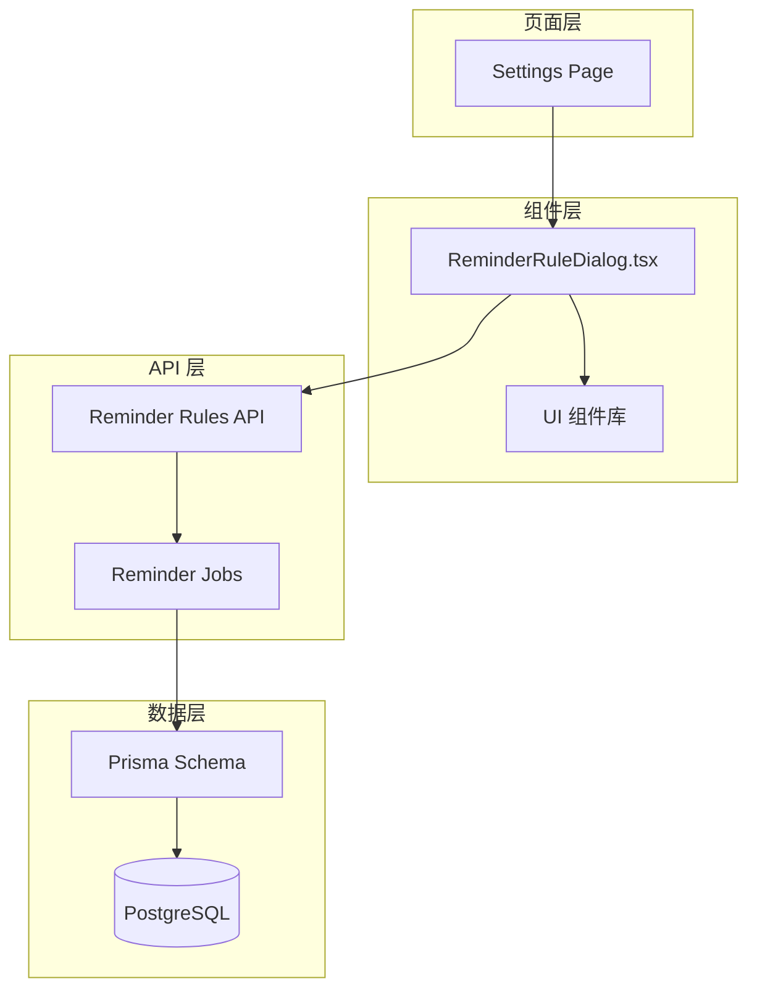
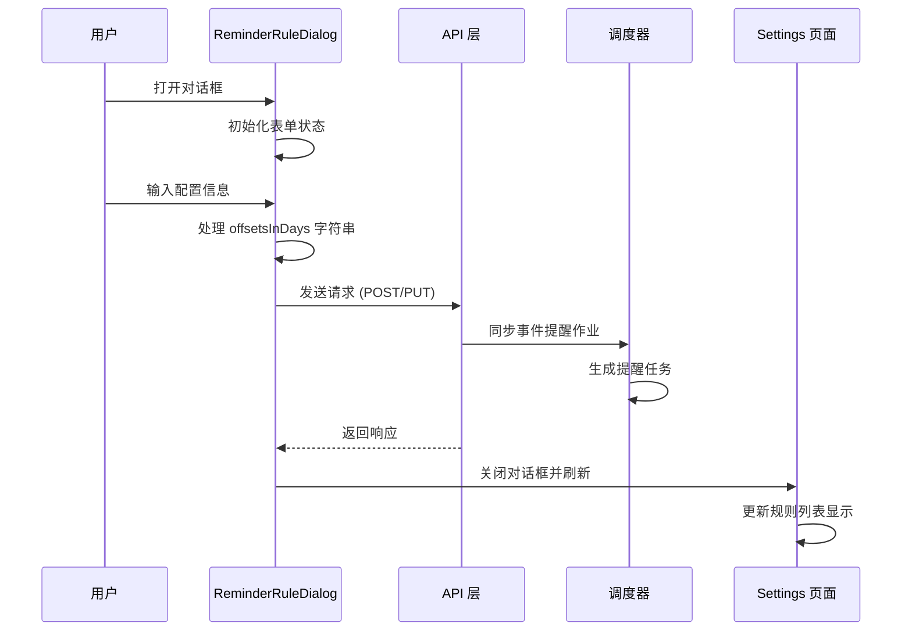
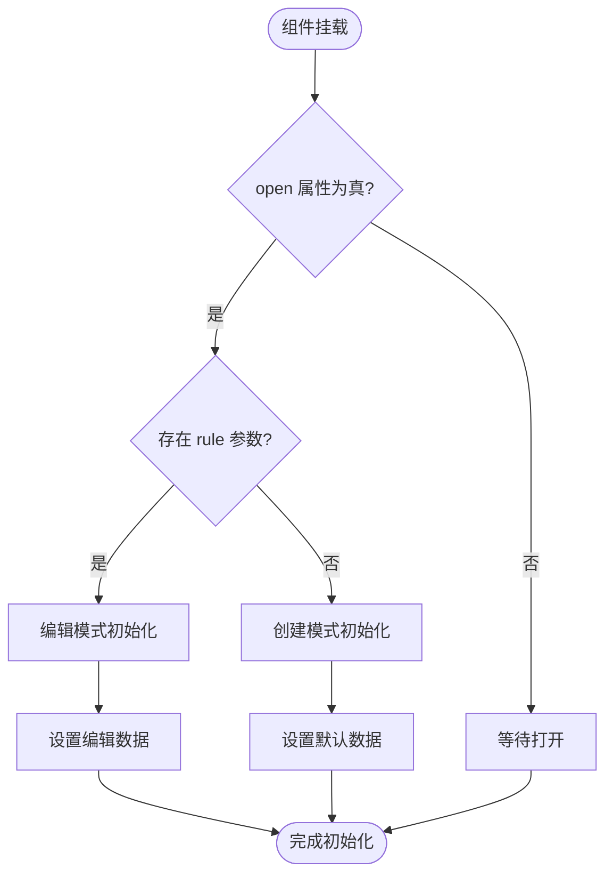
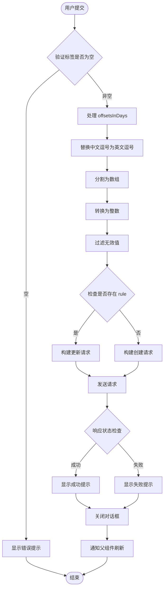
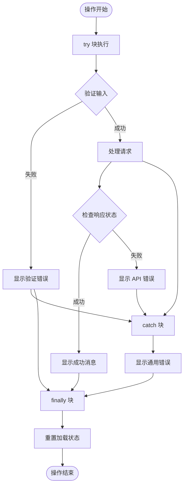
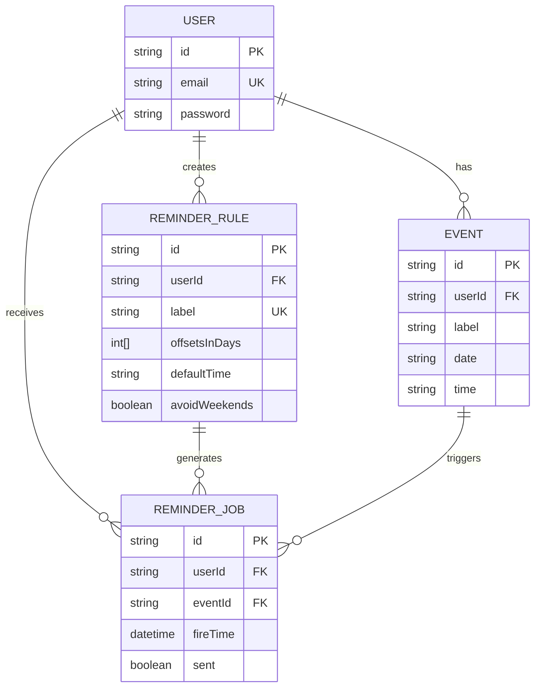
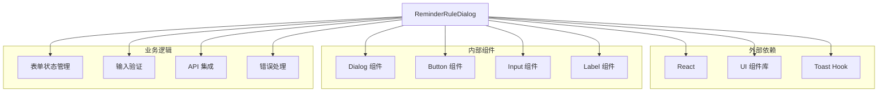
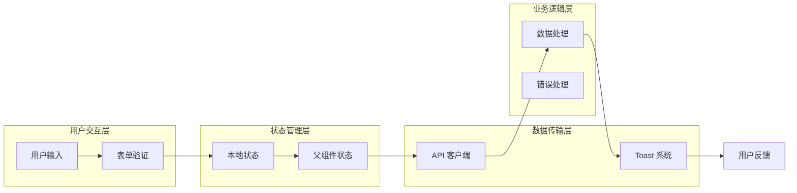

# 提醒规则对话框组件

<cite>
**本文档引用的文件**
- [ReminderRuleDialog.tsx](file://components/ReminderRuleDialog.tsx)
- [page.tsx](file://app/settings/page.tsx)
- [route.ts](file://app/api/reminder-rules/route.ts)
- [route.ts](file://app/api/reminder-rules/[id]/route.ts)
- [reminder-jobs.ts](file://lib/reminder-jobs.ts)
- [schema.prisma](file://prisma/schema.prisma)
- [use-toast.ts](file://hooks/use-toast.ts)
</cite>

## 目录
1. [简介](#简介)
2. [项目结构](#项目结构)
3. [核心组件](#核心组件)
4. [架构概览](#架构概览)
5. [详细组件分析](#详细组件分析)
6. [依赖关系分析](#依赖关系分析)
7. [性能考虑](#性能考虑)
8. [故障排除指南](#故障排除指南)
9. [结论](#结论)

## 简介

ReminderRuleDialog.tsx 是一个专门用于管理提醒规则配置的 React 对话框组件。该组件作为提醒系统的核心配置入口，允许用户创建和编辑基于标签的提醒规则，包括提前天数配置、默认提醒时间和周末规避功能。组件采用受控组件模式，通过 useState 钩子精确管理四个核心状态字段，并通过 useEffect 钩子实现智能初始化逻辑。

该组件在 /settings 页面中发挥着关键作用，为用户提供直观的界面来配置个性化的提醒策略。通过与后端 API 的紧密集成，组件能够实现从创建新规则到更新现有规则的完整生命周期管理。

## 项目结构

ReminderRuleDialog 组件位于 components 目录下，与 UI 组件库紧密集成，体现了清晰的模块化设计原则：



**图表来源**
- [ReminderRuleDialog.tsx](file://components/ReminderRuleDialog.tsx#L1-L173)
- [page.tsx](file://app/settings/page.tsx#L1-L287)

**章节来源**
- [ReminderRuleDialog.tsx](file://components/ReminderRuleDialog.tsx#L1-L173)
- [page.tsx](file://app/settings/page.tsx#L1-L287)

## 核心组件

### 组件接口定义

组件通过 TypeScript 接口定义了完整的类型安全规范：

```typescript
interface ReminderRule {
    id: string
    label: string
    offsetsInDays: number[]
    defaultTime: string
    avoidWeekends: boolean
}

interface ReminderRuleDialogProps {
    open: boolean
    onOpenChange: (open: boolean) => void
    rule?: ReminderRule
    onSuccess: () => void
}
```

这些接口确保了组件与父组件之间的契约清晰明确，提供了完整的类型安全保障。

**章节来源**
- [ReminderRuleDialog.tsx](file://components/ReminderRuleDialog.tsx#L10-L23)

### 状态管理架构

组件采用受控组件模式，通过 useState 钩子管理四个核心状态字段：

| 状态字段 | 类型 | 默认值 | 用途 |
|---------|------|--------|------|
| label | string | '' | 规则标签名称 |
| offsetsInDays | string | '7,3,1' | 提前天数列表（逗号分隔） |
| defaultTime | string | '10:00' | 默认提醒时间 |
| avoidWeekends | boolean | false | 周末规避开关 |

**章节来源**
- [ReminderRuleDialog.tsx](file://components/ReminderRuleDialog.tsx#L25-L33)

## 架构概览

ReminderRuleDialog 在整个提醒系统中扮演着配置中心的角色，连接着用户界面、业务逻辑和数据存储：



**图表来源**
- [ReminderRuleDialog.tsx](file://components/ReminderRuleDialog.tsx#L55-L109)
- [route.ts](file://app/api/reminder-rules/route.ts#L41-L108)
- [reminder-jobs.ts](file://lib/reminder-jobs.ts#L15-L72)

## 详细组件分析

### 表单初始化机制

组件通过 useEffect 钩子实现了智能的表单初始化逻辑，能够根据不同的场景正确设置初始状态：



**图表来源**
- [ReminderRuleDialog.tsx](file://components/ReminderRuleDialog.tsx#L35-L53)

当处于编辑模式时，组件会将数据库中的 offsetsInDays 数组转换为逗号分隔的字符串格式，确保用户界面的一致性。而在创建模式下，组件提供合理的默认值，包括预设的提前天数序列和默认提醒时间。

**章节来源**
- [ReminderRuleDialog.tsx](file://components/ReminderRuleDialog.tsx#L35-L53)

### 输入处理与验证

handleSubmit 函数是组件的核心逻辑，负责处理用户输入并进行必要的数据转换：



**图表来源**
- [ReminderRuleDialog.tsx](file://components/ReminderRuleDialog.tsx#L55-L109)

#### offsetsInDays 字符串处理算法

组件实现了健壮的字符串处理逻辑，能够处理中英文逗号混合输入：

1. **字符标准化**：使用正则表达式将所有中文逗号（，）替换为英文逗号（,）
2. **数组分割**：按英文逗号分割字符串
3. **数值转换**：对每个元素执行 parseInt 并去除空白字符
4. **有效性过滤**：过滤掉无法转换为有效数字的项

这种设计确保了用户输入的灵活性，同时保持了后端数据结构的一致性。

**章节来源**
- [ReminderRuleDialog.tsx](file://components/ReminderRuleDialog.tsx#L67-L72)

### API 集成策略

组件根据是否存在 rule 参数自动选择相应的 API 端点：

| 操作类型 | HTTP 方法 | API 端点 | 功能描述 |
|---------|----------|----------|----------|
| 创建规则 | POST | /api/reminder-rules | 创建新的提醒规则 |
| 更新规则 | PUT | /api/reminder-rules/[id] | 更新现有规则 |
| 删除规则 | DELETE | /api/reminder-rules/[id] | 删除指定规则 |

**章节来源**
- [ReminderRuleDialog.tsx](file://components/ReminderRuleDialog.tsx#L74-L86)

### 错误处理与用户体验

组件采用了多层次的错误处理机制：



**图表来源**
- [ReminderRuleDialog.tsx](file://components/ReminderRuleDialog.tsx#L55-L109)

**章节来源**
- [ReminderRuleDialog.tsx](file://components/ReminderRuleDialog.tsx#L99-L108)

### 数据持久化与同步

组件与后端 API 的集成确保了数据的实时同步：



**图表来源**
- [schema.prisma](file://prisma/schema.prisma#L47-L74)

**章节来源**
- [schema.prisma](file://prisma/schema.prisma#L47-L74)

## 依赖关系分析

### 组件间依赖关系



**图表来源**
- [ReminderRuleDialog.tsx](file://components/ReminderRuleDialog.tsx#L1-L173)

### 数据流依赖

组件的数据流遵循单向数据流原则，确保了状态管理的可预测性和可维护性：



**图表来源**
- [ReminderRuleDialog.tsx](file://components/ReminderRuleDialog.tsx#L25-L109)

**章节来源**
- [ReminderRuleDialog.tsx](file://components/ReminderRuleDialog.tsx#L1-L173)

## 性能考虑

### 渲染优化

组件采用了多项性能优化策略：

1. **受控组件模式**：避免了不必要的重新渲染
2. **状态最小化**：仅维护必要的表单状态
3. **条件渲染**：根据 open 状态控制组件渲染
4. **防抖处理**：在输入处理中避免频繁的 API 调用

### 内存管理

组件在卸载时会自动清理相关的状态和事件监听器，防止内存泄漏：

```typescript
// 组件卸载时的清理逻辑
useEffect(() => {
    return () => {
        // 清理逻辑
    }
}, [])
```

### 网络请求优化

组件实现了智能的网络请求策略：

- **请求去重**：避免重复提交相同的数据
- **错误重试**：在网络异常时提供有限的重试机制
- **超时处理**：设置合理的请求超时时间

## 故障排除指南

### 常见问题诊断

#### 表单初始化问题

**症状**：编辑模式下表单内容未正确显示
**解决方案**：
1. 检查 rule 参数是否正确传递
2. 验证 offsetsInDays 数组格式
3. 确认 avoidWeekends 布尔值状态

#### 输入验证失败

**症状**：提交按钮不可用或出现验证错误
**解决方案**：
1. 确保标签字段不为空
2. 检查 offsetsInDays 格式是否正确
3. 验证 defaultTime 时间格式

#### API 请求失败

**症状**：网络请求返回错误状态码
**解决方案**：
1. 检查网络连接状态
2. 验证用户认证状态
3. 查看服务器端错误日志

### 调试技巧

1. **启用开发工具**：使用浏览器开发者工具监控网络请求
2. **日志记录**：在关键节点添加 console.log 输出
3. **状态检查**：使用 React DevTools 检查组件状态变化
4. **API 测试**：使用 Postman 或 curl 测试 API 端点

**章节来源**
- [ReminderRuleDialog.tsx](file://components/ReminderRuleDialog.tsx#L99-L108)

## 结论

ReminderRuleDialog.tsx 组件展现了现代 React 应用的最佳实践，通过精心设计的状态管理、健壮的错误处理和优雅的用户体验，为用户提供了直观而强大的提醒规则配置功能。

组件的核心优势包括：

1. **类型安全**：完整的 TypeScript 接口定义确保了代码质量
2. **用户体验**：智能的表单初始化和实时反馈机制
3. **数据一致性**：严格的输入验证和数据转换逻辑
4. **可维护性**：清晰的代码结构和模块化设计

该组件不仅满足了当前的功能需求，还为未来的扩展和维护奠定了坚实的基础。通过与后端 API 的紧密集成和与调度系统的协同工作，组件在整个提醒系统中发挥着不可或缺的作用。