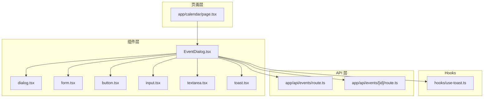
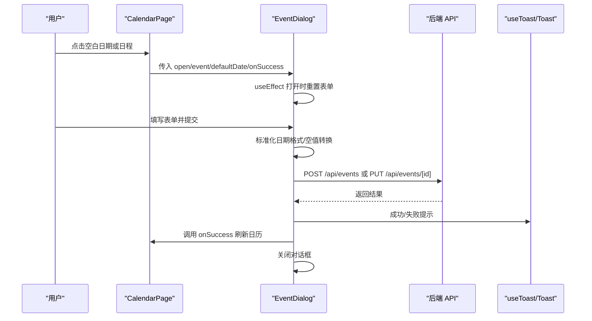
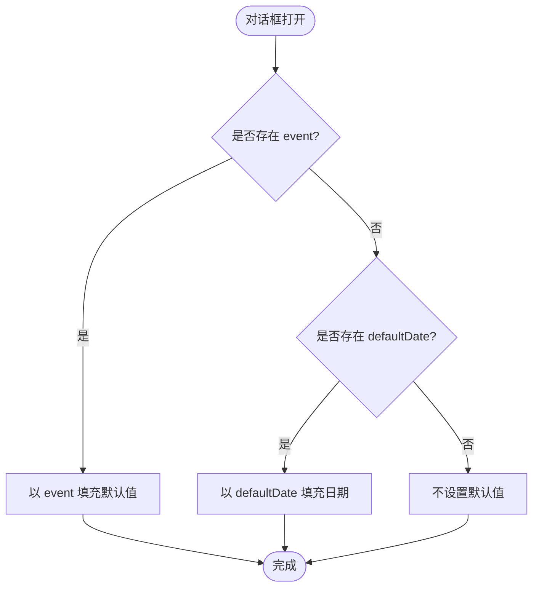
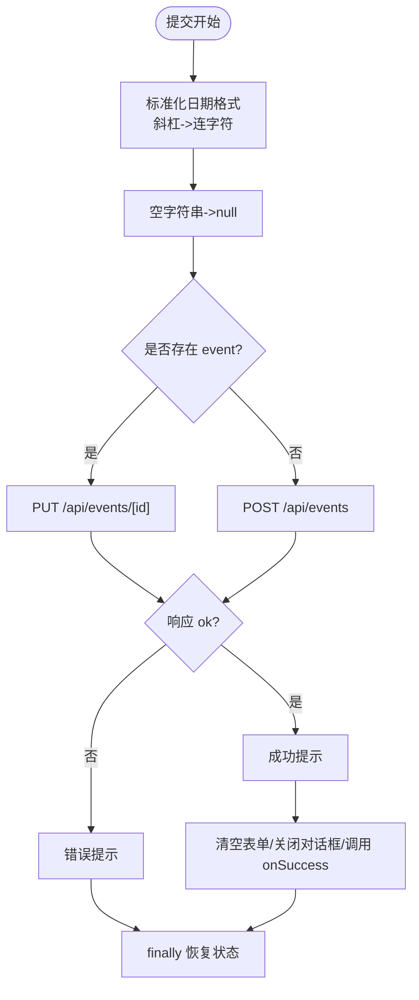
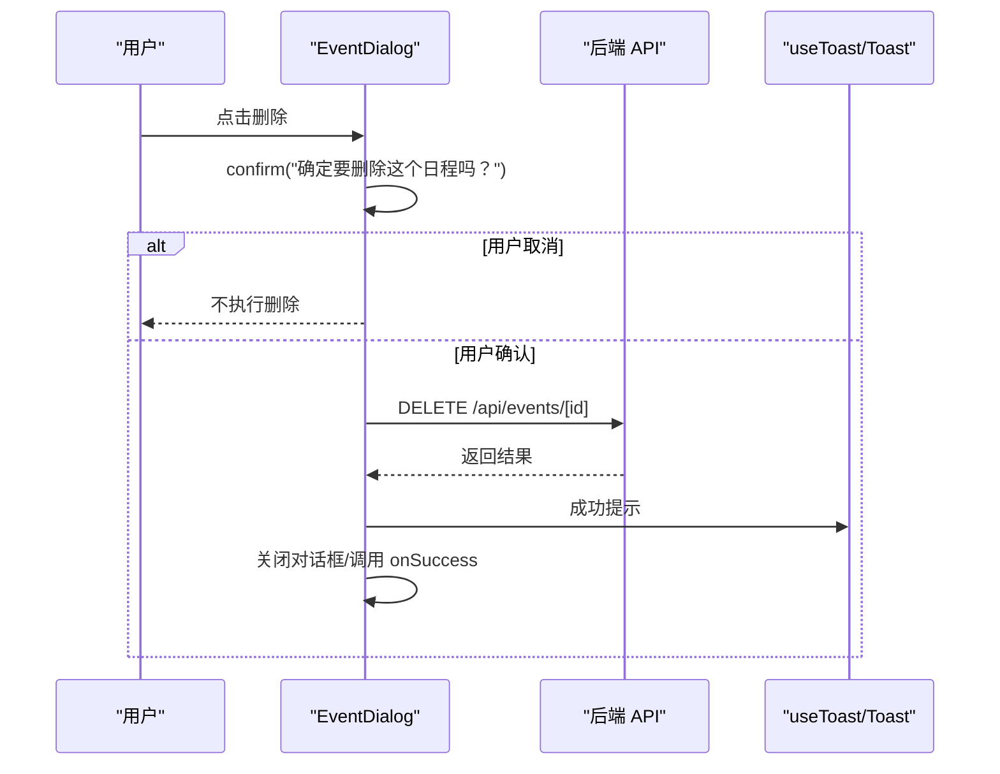
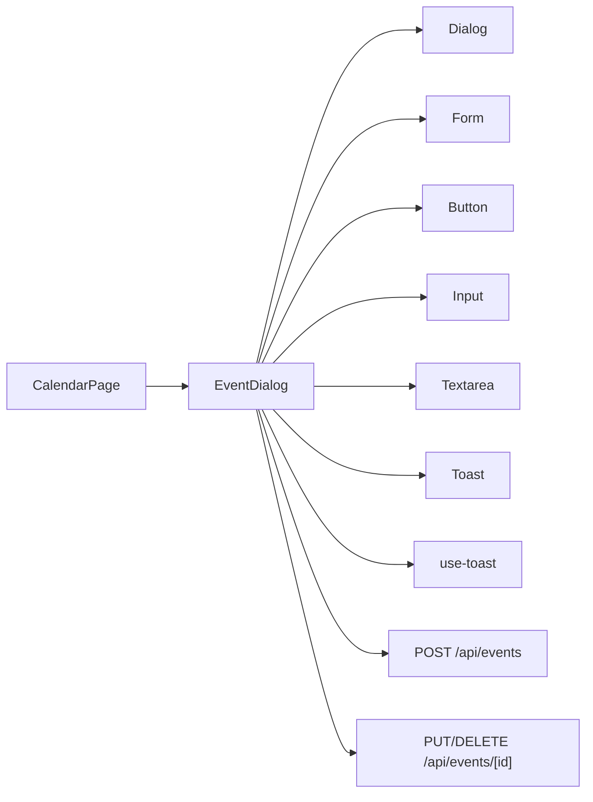

# 日程对话框组件

<cite>
**本文引用的文件**
- [EventDialog.tsx](file://components/EventDialog.tsx)
- [page.tsx](file://app/calendar/page.tsx)
- [use-toast.ts](file://hooks/use-toast.ts)
- [dialog.tsx](file://components/ui/dialog.tsx)
- [form.tsx](file://components/ui/form.tsx)
- [toast.tsx](file://components/ui/toast.tsx)
- [button.tsx](file://components/ui/button.tsx)
- [input.tsx](file://components/ui/input.tsx)
- [textarea.tsx](file://components/ui/textarea.tsx)
- [route.ts](file://app/api/events/route.ts)
- [route.ts](file://app/api/events/[id]/route.ts)
</cite>

## 目录
1. [简介](#简介)
2. [项目结构](#项目结构)
3. [核心组件](#核心组件)
4. [架构总览](#架构总览)
5. [详细组件分析](#详细组件分析)
6. [依赖关系分析](#依赖关系分析)
7. [性能考量](#性能考量)
8. [故障排查指南](#故障排查指南)
9. [结论](#结论)
10. [附录](#附录)

## 简介
本文件深入解析日程对话框组件 EventDialog.tsx 的完整实现机制。该组件是日程创建与编辑的核心 UI 组件，采用 React Hook Form 集成 Zod 进行表单状态管理与字段验证，覆盖标题、日期、时间、标签、备注等字段的校验规则；支持编辑模式（接收 event 参数）与创建模式（接收 defaultDate 参数）两种初始化状态；通过 useEffect 在对话框打开时动态重置表单数据；在 onSubmit 中对日期格式进行标准化（斜杠替换为连字符），并对空值转换为 null 以满足后端校验；通过 fetch 与后端 API 进行数据交互，分别对应 POST /api/events 或 PUT/DELETE /api/events/[id]；错误处理机制使用 useToast 展示用户友好的提示信息；在 /calendar 页面中被调用，onSuccess 回调用于触发父组件刷新日历视图；组件包含加载状态（loading）与删除状态（deleting）的 UI 反馈设计，并在删除前提供确认对话框。

## 项目结构
EventDialog.tsx 位于 components 目录，与 UI 基础组件（dialog、form、button、input、textarea、toast）以及 hooks/use-toast.ts 协同工作；在 app/calendar/page.tsx 中被调用并传递 onSuccess 回调以刷新日历。

图表来源
- [EventDialog.tsx](file://components/EventDialog.tsx#L1-L227)
- [dialog.tsx](file://components/ui/dialog.tsx#L1-L144)
- [form.tsx](file://components/ui/form.tsx#L1-L168)
- [button.tsx](file://components/ui/button.tsx#L1-L61)
- [input.tsx](file://components/ui/input.tsx#L1-L22)
- [textarea.tsx](file://components/ui/textarea.tsx#L1-L19)
- [toast.tsx](file://components/ui/toast.tsx#L1-L130)
- [use-toast.ts](file://hooks/use-toast.ts#L1-L192)
- [page.tsx](file://app/calendar/page.tsx#L1-L468)
- [route.ts](file://app/api/events/route.ts#L1-L200)
- [route.ts](file://app/api/events/[id]/route.ts#L1-L119)

章节来源
- [EventDialog.tsx](file://components/EventDialog.tsx#L1-L227)
- [page.tsx](file://app/calendar/page.tsx#L1-L468)

## 核心组件
- 表单验证与状态管理：使用 React Hook Form + Zod，定义事件数据模型与校验规则，自动渲染错误消息。
- 初始化策略：
  - 编辑模式：接收 event 对象，将标题、日期、时间、标签、备注映射到表单默认值。
  - 创建模式：接收 defaultDate，将日期预填入表单，默认其他字段为空。
  - 两者皆无：表单保持未设置状态。
- 提交流程：标准化日期格式（斜杠替换为连字符），将空字符串转换为 null，根据是否存在 event 决定 POST 或 PUT/DELETE 请求。
- 错误处理：统一通过 useToast 展示成功或失败提示。
- UI 反馈：loading/deleting 状态禁用按钮并显示“保存中/删除中”文案。

章节来源
- [EventDialog.tsx](file://components/EventDialog.tsx#L14-L59)
- [EventDialog.tsx](file://components/EventDialog.tsx#L61-L84)
- [EventDialog.tsx](file://components/EventDialog.tsx#L86-L133)
- [EventDialog.tsx](file://components/EventDialog.tsx#L135-L165)

## 架构总览
EventDialog.tsx 作为独立 UI 组件，通过 props 接收 open/onOpenChange/event/defaultDate/onSuccess；内部通过 React Hook Form 管理表单状态，Zod 负责字段校验；提交时根据是否已有 event 判断请求类型；通过 fetch 与后端 API 通信；使用 useToast 提供用户反馈；父组件（CalendarPage）负责数据拉取与刷新。

图表来源
- [EventDialog.tsx](file://components/EventDialog.tsx#L39-L133)
- [page.tsx](file://app/calendar/page.tsx#L458-L464)
- [route.ts](file://app/api/events/route.ts#L131-L199)
- [route.ts](file://app/api/events/[id]/route.ts#L15-L74)
- [use-toast.ts](file://hooks/use-toast.ts#L142-L169)

## 详细组件分析

### 表单验证与字段规则
- 字段定义与校验：
  - 标题：必填
  - 日期：必须为 YYYY-MM-DD 格式
  - 时间：可选，格式为 HH:mm，允许空字符串
  - 标签/备注：可选
- 错误渲染：每个字段下方显示对应错误消息，基于 formState.errors。

章节来源
- [EventDialog.tsx](file://components/EventDialog.tsx#L14-L20)
- [EventDialog.tsx](file://components/EventDialog.tsx#L175-L178)
- [EventDialog.tsx](file://components/EventDialog.tsx#L182-L191)
- [EventDialog.tsx](file://components/EventDialog.tsx#L194-L201)

### 初始化与表单重置逻辑
- 初始化策略：
  - 若存在 event：以 event 字段填充默认值，时间/标签/备注为空字符串时转为空字符串（保持表单一致性）。
  - 若存在 defaultDate：以 defaultDate 填充日期，其余字段为空字符串。
  - 否则：不设置默认值。
- 打开对话框时的重置：
  - useEffect 监听 open、event、defaultDate、reset，当 open 为真时按上述策略重置表单，确保每次打开都使用最新数据。

图表来源
- [EventDialog.tsx](file://components/EventDialog.tsx#L44-L59)
- [EventDialog.tsx](file://components/EventDialog.tsx#L61-L84)

章节来源
- [EventDialog.tsx](file://components/EventDialog.tsx#L44-L59)
- [EventDialog.tsx](file://components/EventDialog.tsx#L61-L84)

### 提交流程与数据标准化
- 日期标准化：将输入中的斜杠替换为连字符，保证后端期望的 YYYY-MM-DD 格式。
- 空值转换：将空字符串转换为 null，避免后端校验失败。
- 请求类型判断：
  - 存在 event：PUT /api/events/[id]
  - 不存在 event：POST /api/events
- 成功后：
  - 显示成功提示
  - 清空表单并关闭对话框
  - 调用 onSuccess 刷新父组件日历

图表来源
- [EventDialog.tsx](file://components/EventDialog.tsx#L86-L133)
- [route.ts](file://app/api/events/route.ts#L131-L199)
- [route.ts](file://app/api/events/[id]/route.ts#L15-L74)

章节来源
- [EventDialog.tsx](file://components/EventDialog.tsx#L86-L133)

### 删除流程与确认对话框
- 删除条件：仅在存在 event 时显示删除按钮。
- 用户确认：弹出浏览器确认对话框，若用户取消则终止。
- 请求类型：DELETE /api/events/[id]。
- 成功后：
  - 显示删除成功提示
  - 关闭对话框
  - 调用 onSuccess 刷新父组件日历

图表来源
- [EventDialog.tsx](file://components/EventDialog.tsx#L135-L165)
- [route.ts](file://app/api/events/[id]/route.ts#L76-L118)

章节来源
- [EventDialog.tsx](file://components/EventDialog.tsx#L135-L165)

### 错误处理与用户反馈
- 错误捕获：提交与删除过程中通过 try/catch 捕获异常。
- 响应异常：若 res.ok 为假，读取 JSON 并抛出错误，错误消息来自后端返回的 error 字段。
- 用户提示：使用 useToast 展示成功或失败提示，失败时使用破坏性样式。
- 加载状态：loading/deleting 控制按钮禁用与文案变化，避免重复提交。

章节来源
- [EventDialog.tsx](file://components/EventDialog.tsx#L101-L133)
- [EventDialog.tsx](file://components/EventDialog.tsx#L135-L165)
- [use-toast.ts](file://hooks/use-toast.ts#L142-L169)

### 在 /calendar 页面中的调用与刷新
- 调用位置：CalendarPage 在底部渲染 EventDialog，并传入 open/onOpenChange/event/defaultDate/onSuccess。
- 刷新机制：onSuccess 调用 fetchEvents(currentDate)，重新拉取当前月份的日程数据并更新状态，从而刷新日历视图。

章节来源
- [page.tsx](file://app/calendar/page.tsx#L458-L464)

## 依赖关系分析
- 组件依赖：
  - UI 基础组件：dialog、form、button、input、textarea、toast
  - Hooks：use-toast
- 数据流：
  - CalendarPage -> EventDialog（props）
  - EventDialog -> 后端 API（fetch）
  - EventDialog -> useToast（提示）
  - EventDialog -> CalendarPage（onSuccess）

图表来源
- [EventDialog.tsx](file://components/EventDialog.tsx#L1-L227)
- [page.tsx](file://app/calendar/page.tsx#L458-L464)
- [use-toast.ts](file://hooks/use-toast.ts#L1-L192)
- [route.ts](file://app/api/events/route.ts#L131-L199)
- [route.ts](file://app/api/events/[id]/route.ts#L15-L118)

章节来源
- [EventDialog.tsx](file://components/EventDialog.tsx#L1-L227)
- [page.tsx](file://app/calendar/page.tsx#L1-L468)

## 性能考量
- 表单重置：useEffect 仅在 open、event、defaultDate 变化时重置，避免不必要的重渲染。
- 网络请求：提交与删除均使用 fetch，建议在高并发场景下考虑去抖或节流，但当前实现已足够简洁。
- UI 状态：loading/deleting 状态仅影响按钮交互，不引入复杂计算，性能开销低。
- 错误处理：统一使用 toast 提示，减少重复的错误分支逻辑。

## 故障排查指南
- 表单无法提交：
  - 检查日期格式是否为 YYYY-MM-DD，时间格式是否为 HH:mm。
  - 确认网络请求是否成功，查看控制台错误。
- 删除失败：
  - 确认用户确认对话框是否被取消。
  - 检查后端返回的状态码与错误信息。
- 刷新无效：
  - 确认 onSuccess 是否被正确调用。
  - 检查 CalendarPage 中 fetchEvents 是否正常执行。

章节来源
- [EventDialog.tsx](file://components/EventDialog.tsx#L101-L133)
- [EventDialog.tsx](file://components/EventDialog.tsx#L135-L165)
- [page.tsx](file://app/calendar/page.tsx#L458-L464)

## 结论
EventDialog.tsx 通过 React Hook Form + Zod 实现了严谨的表单验证与状态管理，结合标准化的数据处理策略与完善的错误处理机制，提供了可靠的日程创建与编辑体验。其与 CalendarPage 的 onSuccess 回调配合，实现了无缝的日历刷新；UI 层面的 loading/deleting 状态与确认对话框提升了用户体验与安全性。整体架构清晰、职责明确，易于维护与扩展。

## 附录
- API 规范摘要：
  - GET /api/events?month=YYYY-MM：按月获取事件列表（含提醒扩展）。
  - POST /api/events：创建事件，返回新事件与是否替换标志。
  - PUT /api/events/[id]：更新事件，返回更新后的事件。
  - DELETE /api/events/[id]：删除事件，返回成功标志。

章节来源
- [route.ts](file://app/api/events/route.ts#L15-L129)
- [route.ts](file://app/api/events/route.ts#L131-L199)
- [route.ts](file://app/api/events/[id]/route.ts#L15-L74)
- [route.ts](file://app/api/events/[id]/route.ts#L76-L118)