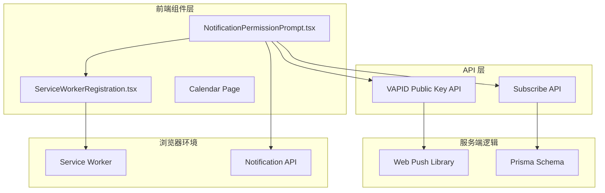
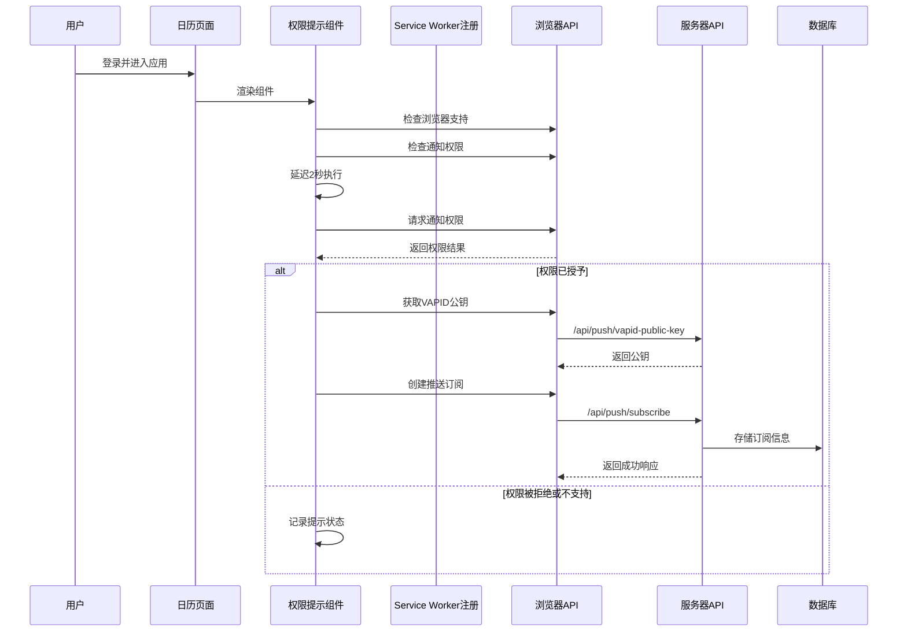
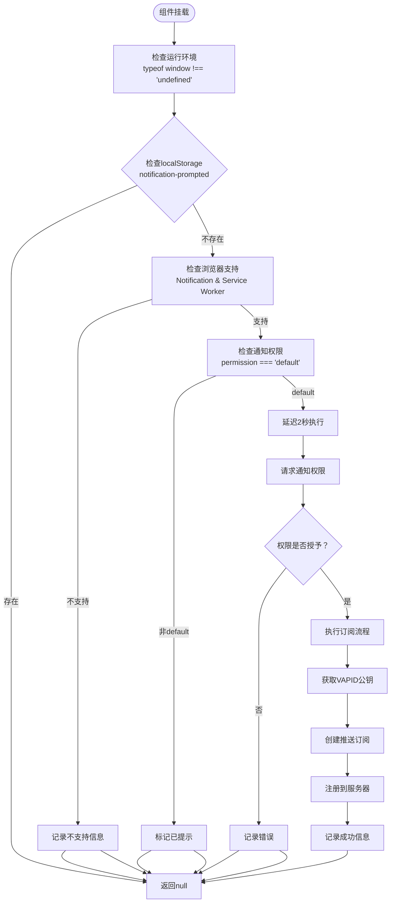
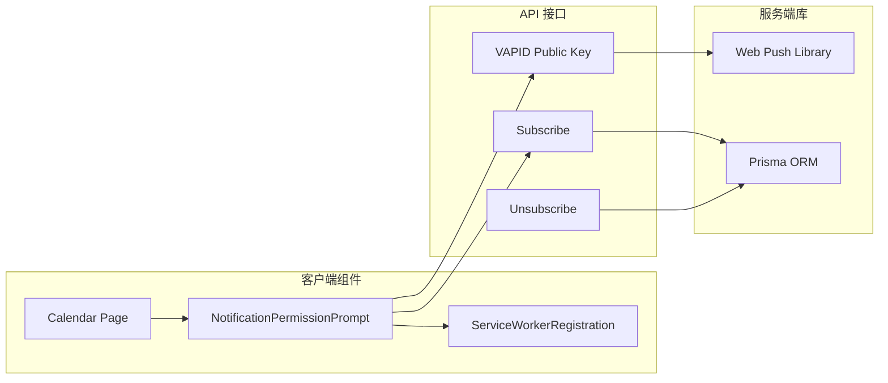

# 通知权限提示组件

<cite>
**本文档引用的文件**
- [NotificationPermissionPrompt.tsx](file://components/NotificationPermissionPrompt.tsx)
- [ServiceWorkerRegistration.tsx](file://components/ServiceWorkerRegistration.tsx)
- [sw.js](file://public/sw.js)
- [vapid-public-key/route.ts](file://app/api/push/vapid-public-key/route.ts)
- [subscribe/route.ts](file://app/api/push/subscribe/route.ts)
- [web-push.ts](file://lib/web-push.ts)
- [schema.prisma](file://prisma/schema.prisma)
- [layout.tsx](file://app/layout.tsx)
- [page.tsx](file://app/page.tsx)
- [calendar/page.tsx](file://app/calendar/page.tsx)
</cite>

## 目录
1. [简介](#简介)
2. [项目结构](#项目结构)
3. [核心组件](#核心组件)
4. [架构概览](#架构概览)
5. [详细组件分析](#详细组件分析)
6. [依赖关系分析](#依赖关系分析)
7. [性能考虑](#性能考虑)
8. [故障排除指南](#故障排除指南)
9. [结论](#结论)

## 简介

NotificationPermissionPrompt.tsx 是一个专门用于自动化通知权限请求和推送订阅的 React 客户端组件。该组件在用户登录后首次进入应用时，通过浏览器的 Notification API 和 Service Worker 技术，自动执行权限检查、权限请求和推送订阅流程，无需用户手动操作即可实现通知功能的启用。

该组件采用"无头"设计模式，只负责执行必要的副作用操作，不渲染任何可视内容，通过返回 null 实现纯功能组件的设计理念。

## 项目结构

该项目采用 Next.js 应用程序模式，包含以下关键目录结构：

**图表来源**
- [NotificationPermissionPrompt.tsx](file://components/NotificationPermissionPrompt.tsx#L1-L77)
- [ServiceWorkerRegistration.tsx](file://components/ServiceWorkerRegistration.tsx#L1-L30)
- [vapid-public-key/route.ts](file://app/api/push/vapid-public-key/route.ts#L1-L13)

**章节来源**
- [layout.tsx](file://app/layout.tsx#L1-L40)
- [page.tsx](file://app/page.tsx#L1-L6)

## 核心组件

NotificationPermissionPrompt.tsx 组件的核心功能包括：

### 自动化权限检查流程
- 浏览器兼容性检测：验证 Notification API 和 Service Worker 支持
- 本地存储检查：使用 localStorage 键 `notification-prompted` 防止重复提示
- 权限状态验证：检查当前通知权限是否为 default 状态

### 用户体验优化
- 延迟执行机制：通过 setTimeout 延迟 2 秒执行，避免页面加载时的干扰
- 无头设计：组件返回 null，专注于副作用执行而非界面渲染

### 推送订阅流程
- VAPID 密钥获取：从 /api/push/vapid-public-key 接口获取公钥
- 订阅创建：使用 pushManager.subscribe 创建推送订阅
- 服务器注册：将订阅信息发送到 /api/push/subscribe 接口

**章节来源**
- [NotificationPermissionPrompt.tsx](file://components/NotificationPermissionPrompt.tsx#L6-L77)

## 架构概览

该组件在整个通知系统中的位置和交互关系如下：

**图表来源**
- [NotificationPermissionPrompt.tsx](file://components/NotificationPermissionPrompt.tsx#L9-L49)
- [vapid-public-key/route.ts](file://app/api/push/vapid-public-key/route.ts#L4-L12)
- [subscribe/route.ts](file://app/api/push/subscribe/route.ts#L14-L62)

## 详细组件分析

### 组件结构与生命周期

**图表来源**
- [NotificationPermissionPrompt.tsx](file://components/NotificationPermissionPrompt.tsx#L9-L49)

### 订阅流程详解

订阅流程包含以下关键步骤：

#### 步骤1：Service Worker 就绪检查
组件首先等待 Service Worker 准备就绪，确保推送功能可用。

#### 步骤2：VAPID 公钥获取
从 `/api/push/vapid-public-key` 接口获取 VAPID 公钥，这是 Web Push 协议的安全要求。

#### 步骤3：推送订阅创建
使用 `pushManager.subscribe()` 方法创建推送订阅，配置参数：
- `userVisibleOnly: true` - 确保订阅仅用于用户可见的通知
- `applicationServerKey: publicKey` - 使用获取的 VAPID 公钥

#### 步骤4：服务器端注册
将订阅信息以 JSON 格式发送到 `/api/push/subscribe` 接口，完成服务器端注册。

**章节来源**
- [NotificationPermissionPrompt.tsx](file://components/NotificationPermissionPrompt.tsx#L51-L73)

### 错误处理机制

组件实现了完整的错误处理策略：

#### 浏览器兼容性错误
- 检测到不支持 Notification API 或 Service Worker 时，记录日志并终止执行

#### 权限相关错误
- 权限被拒绝时，记录错误信息但不重复提示
- 网络错误或 API 调用失败时，捕获异常并记录详细错误信息

#### 异步操作错误
- 所有异步操作都包含 try-catch 块
- fetch 请求失败时，检查响应状态并优雅处理

**章节来源**
- [NotificationPermissionPrompt.tsx](file://components/NotificationPermissionPrompt.tsx#L18-L21)
- [NotificationPermissionPrompt.tsx](file://components/NotificationPermissionPrompt.tsx#L43-L45)
- [NotificationPermissionPrompt.tsx](file://components/NotificationPermissionPrompt.tsx#L70-L72)

### 数据持久化策略

#### localStorage 使用
- 键名：`notification-prompted`
- 作用：防止同一用户在同一次会话中重复收到权限提示
- 设置时机：权限请求完成后或浏览器不支持时

#### 服务器端存储
- 数据库表：PushSubscription
- 字段：endpoint、p256dh、auth
- 关联关系：与 User 模型建立多对一关系

**章节来源**
- [NotificationPermissionPrompt.tsx](file://components/NotificationPermissionPrompt.tsx#L14-L15)
- [NotificationPermissionPrompt.tsx](file://components/NotificationPermissionPrompt.tsx#L37-L37)
- [schema.prisma](file://prisma/schema.prisma#L76-L85)

## 依赖关系分析

### 组件间依赖

**图表来源**
- [NotificationPermissionPrompt.tsx](file://components/NotificationPermissionPrompt.tsx#L1-L77)
- [ServiceWorkerRegistration.tsx](file://components/ServiceWorkerRegistration.tsx#L1-L30)
- [calendar/page.tsx](file://app/calendar/page.tsx#L456-L456)

### 外部依赖

#### 浏览器原生 API
- Notification API：用于权限请求和通知显示
- Service Worker API：用于后台消息处理
- Push API：用于推送消息接收

#### 第三方库
- web-push：用于生成和管理 VAPID 密钥对
- Prisma：用于数据库操作和数据模型管理

**章节来源**
- [web-push.ts](file://lib/web-push.ts#L1-L54)
- [prisma/schema.prisma](file://prisma/schema.prisma#L1-L86)

## 性能考虑

### 延迟执行优化
组件使用 2 秒延迟机制，主要考虑：
- 让用户先看到日历界面，避免权限请求打断用户体验
- 给浏览器足够时间完成其他初始化任务
- 减少不必要的权限弹窗干扰

### 内存管理
- 使用 useEffect 清理函数清除定时器
- 及时清理事件监听器和订阅
- 避免内存泄漏

### 网络优化
- 检查 localStorage 避免重复请求
- 使用条件检查减少不必要的 API 调用
- 错误重试机制的合理使用

## 故障排除指南

### 常见问题及解决方案

#### Service Worker 注册失败
**症状**：控制台显示 Service Worker 注册失败
**原因**：HTTPS 环境限制或文件路径错误
**解决**：确保使用 HTTPS，检查 sw.js 文件路径

#### VAPID 密钥配置错误
**症状**：获取 VAPID 公钥接口返回 500 错误
**原因**：环境变量未正确配置
**解决**：检查 NEXT_PUBLIC_VAPID_PUBLIC_KEY 和 VAPID_PRIVATE_KEY

#### 权限请求被拒绝
**症状**：权限始终为 denied 状态
**原因**：用户明确拒绝或浏览器设置限制
**解决**：引导用户在浏览器设置中手动开启通知

#### 订阅创建失败
**症状**：pushManager.subscribe 调用抛出异常
**原因**：Service Worker 未就绪或网络问题
**解决**：等待 navigator.serviceWorker.ready，检查网络连接

### 调试技巧

#### 控制台日志
组件在关键节点输出详细的调试信息：
- `[Notification] Browser does not support notifications`
- `[Notification] Auto-requesting permission after login...`
- `[Notification] Permission result: granted`
- `[Notification] Auto-subscribed successfully`

#### 开发者工具
- 使用浏览器开发者工具的 Application 面板查看 Service Worker 状态
- 检查 Network 面板确认 API 请求和响应
- 查看 Console 面板获取详细的错误信息

**章节来源**
- [NotificationPermissionPrompt.tsx](file://components/NotificationPermissionPrompt.tsx#L19-L20)
- [NotificationPermissionPrompt.tsx](file://components/NotificationPermissionPrompt.tsx#L33-L35)
- [NotificationPermissionPrompt.tsx](file://components/NotificationPermissionPrompt.tsx#L69-L72)

## 结论

NotificationPermissionPrompt.tsx 组件通过精心设计的自动化流程，实现了无缝的通知权限启用体验。该组件具有以下特点：

### 设计优势
- **无头设计**：专注于副作用执行，不干扰界面布局
- **用户体验优先**：智能的延迟执行和防重复提示机制
- **健壮的错误处理**：全面的异常捕获和用户友好的错误信息

### 技术实现亮点
- **渐进增强**：优雅降级处理不支持的浏览器
- **安全考虑**：完整的 VAPID 密钥管理和安全的订阅流程
- **可维护性**：清晰的代码结构和详细的注释说明

### 最佳实践建议
- 在生产环境中确保 HTTPS 环境
- 合理配置 VAPID 密钥对
- 提供用户手动触发权限请求的备用方案
- 定期检查和清理过期的推送订阅

该组件为现代 Web 应用的通知功能提供了可靠的基础设施，通过自动化权限管理和推送订阅，显著提升了用户的使用体验。