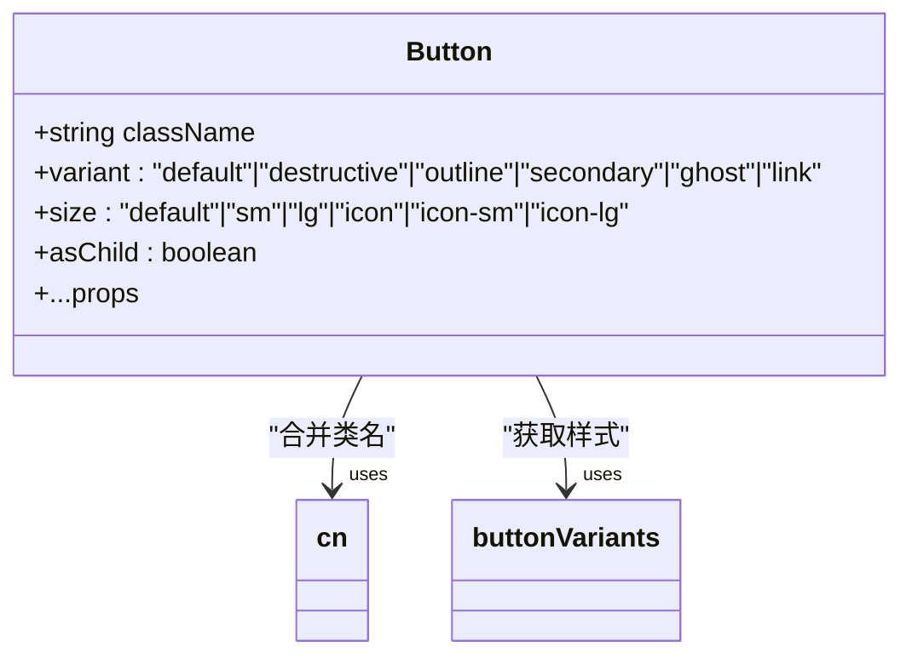
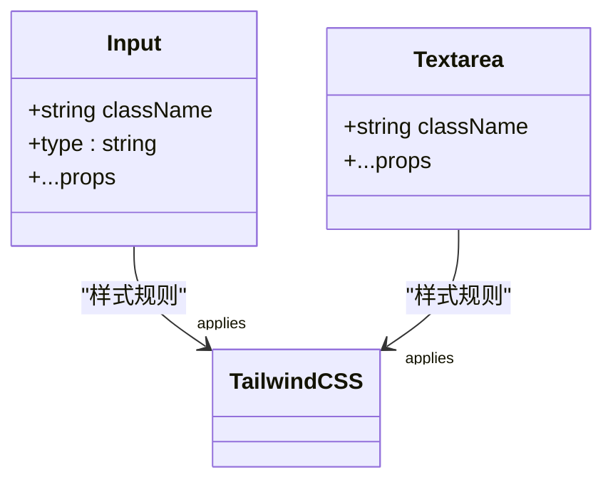
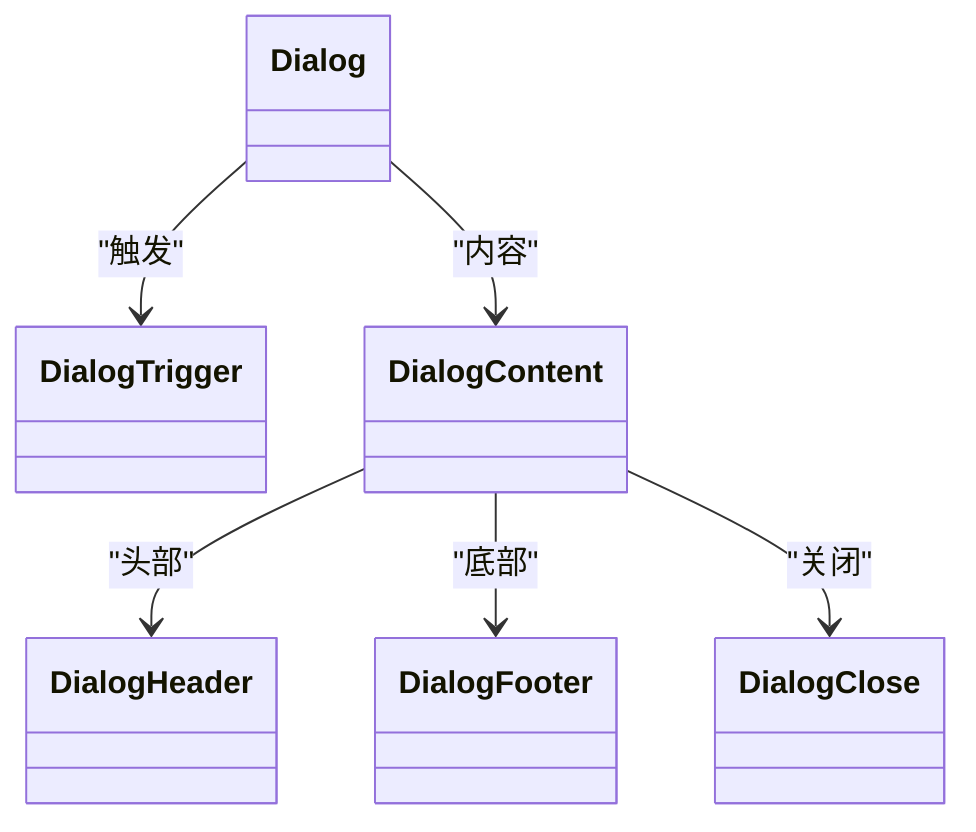
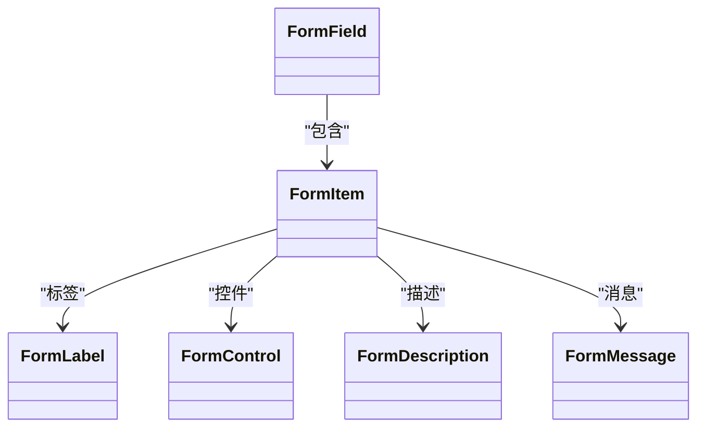
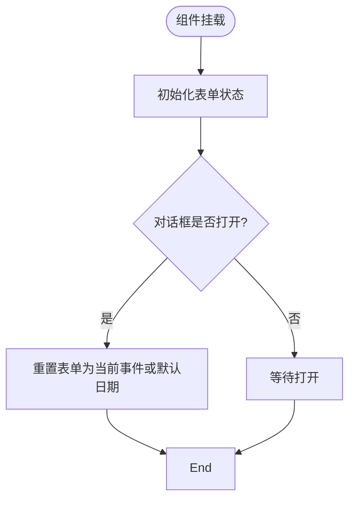
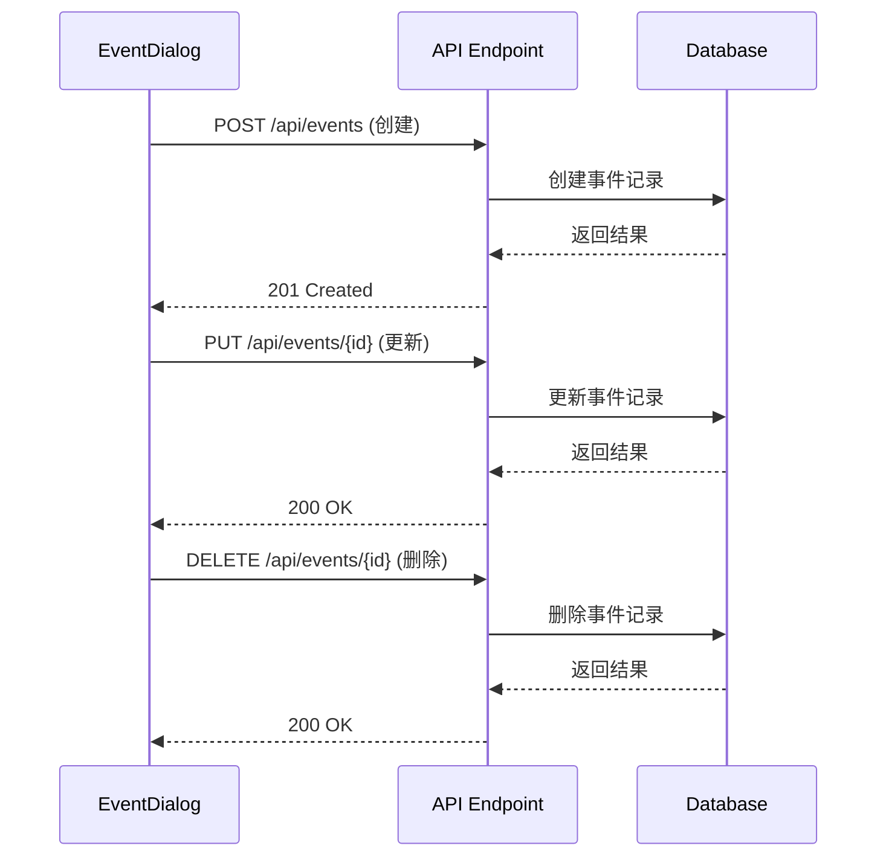
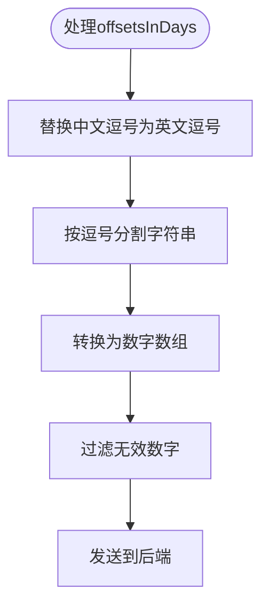
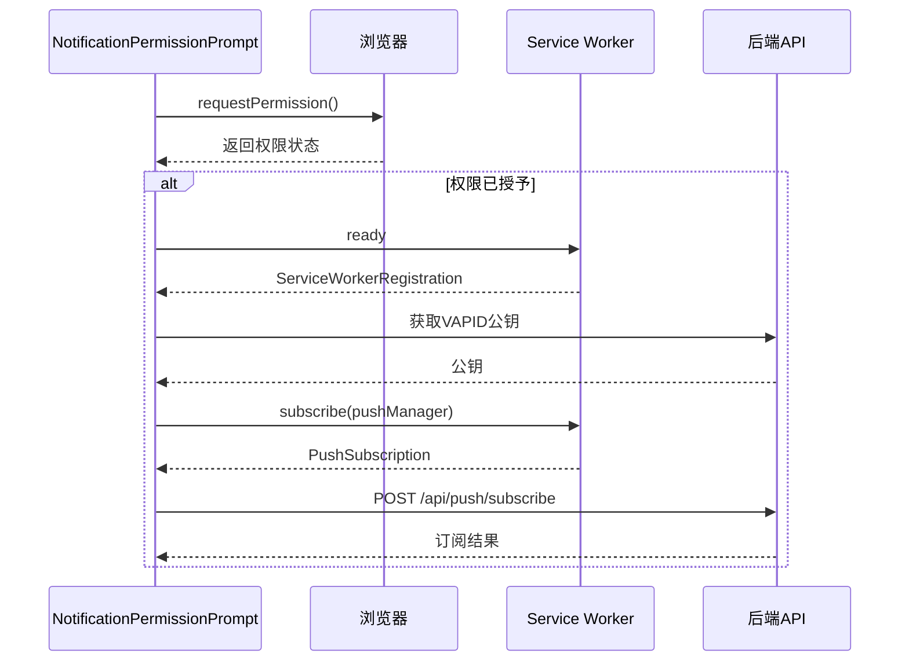
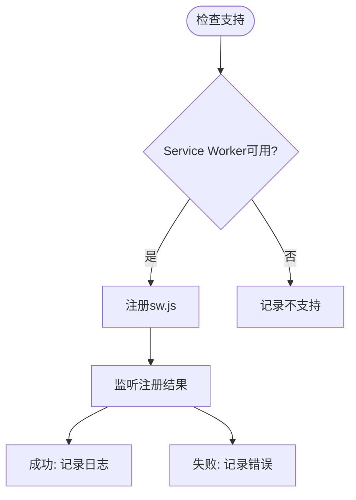

# 组件体系

<cite>
**本文档中引用的文件**  
- [button.tsx](file://components/ui/button.tsx)
- [input.tsx](file://components/ui/input.tsx)
- [dialog.tsx](file://components/ui/dialog.tsx)
- [form.tsx](file://components/ui/form.tsx)
- [textarea.tsx](file://components/ui/textarea.tsx)
- [EventDialog.tsx](file://components/EventDialog.tsx)
- [ReminderRuleDialog.tsx](file://components/ReminderRuleDialog.tsx)
- [NotificationPermissionPrompt.tsx](file://components/NotificationPermissionPrompt.tsx)
- [ServiceWorkerRegistration.tsx](file://components/ServiceWorkerRegistration.tsx)
- [use-toast.ts](file://hooks/use-toast.ts)
- [web-push.ts](file://lib/web-push.ts)
- [calendar/page.tsx](file://app/calendar/page.tsx)
- [import/page.tsx](file://app/import/page.tsx)
- [events/route.ts](file://app/api/events/route.ts)
- [reminder-rules/route.ts](file://app/api/reminder-rules/route.ts)
</cite>

## 目录
1. [简介](#简介)
2. [基础UI组件设计](#基础ui组件设计)
3. [业务组件实现逻辑](#业务组件实现逻辑)
4. [特殊功能组件与浏览器API集成](#特殊功能组件与浏览器api集成)
5. [组件组合示例](#组件组合示例)
6. [性能与可维护性考虑](#性能与可维护性考虑)
7. [结论](#结论)

## 简介
本项目采用基于Radix UI的可复用UI组件体系，结合Tailwind CSS实现样式定制。组件分为基础UI组件、业务组件和特殊功能组件三类，通过React客户端组件机制实现交互逻辑，并与后端API协同完成数据持久化和Web Push通知功能。

## 基础UI组件设计

项目中的基础UI组件（如按钮、输入框、对话框等）均基于Radix UI进行封装，利用`class-variance-authority`（CVA）实现样式变体管理，并通过`cn`工具函数合并Tailwind CSS类名，确保样式一致性与可复用性。

### 按钮组件
`button.tsx`使用CVA定义了多种变体（默认、破坏性、轮廓、次要、幽灵、链接）和尺寸（默认、小、大、图标），通过`asChild`属性支持子元素包装模式，增强了组件的灵活性。



**Diagram sources**
- [button.tsx](file://components/ui/button.tsx#L7-L37)

**Section sources**
- [button.tsx](file://components/ui/button.tsx#L1-L61)

### 输入框与文本域
`input.tsx`和`textarea.tsx`组件统一了基础输入样式，包含焦点状态、无效状态的视觉反馈，并支持禁用状态的样式控制。两者均应用了统一的边框、阴影、过渡效果和选择区域样式。



**Diagram sources**
- [input.tsx](file://components/ui/input.tsx#L5-L22)
- [textarea.tsx](file://components/ui/textarea.tsx#L5-L19)

**Section sources**
- [input.tsx](file://components/ui/input.tsx#L1-L22)
- [textarea.tsx](file://components/ui/textarea.tsx#L1-L19)

### 对话框组件
`dialog.tsx`完整封装了Radix UI的对话框原语，提供了`Dialog`、`DialogTrigger`、`DialogContent`、`DialogHeader`、`DialogFooter`等复合组件。特别地，`DialogContent`默认显示关闭按钮，并可通过`showCloseButton`属性控制。



**Diagram sources**
- [dialog.tsx](file://components/ui/dialog.tsx#L9-L144)

**Section sources**
- [dialog.tsx](file://components/ui/dialog.tsx#L1-L144)

### 表单组件
`form.tsx`基于React Hook Form构建，提供了`FormField`、`FormItem`、`FormLabel`、`FormControl`、`FormDescription`、`FormMessage`等组件，实现了表单字段的上下文管理和错误状态传播。



**Diagram sources**
- [form.tsx](file://components/ui/form.tsx#L19-L168)

**Section sources**
- [form.tsx](file://components/ui/form.tsx#L1-L168)

## 业务组件实现逻辑

### EventDialog组件
`EventDialog.tsx`是日程管理的核心组件，实现了完整的CRUD操作。该组件使用React Hook Form进行表单管理，结合Zod进行客户端验证，并通过fetch调用与后端API交互。

#### 表单处理
使用`useForm`钩子初始化表单，通过`zodResolver`连接Zod验证模式。表单包含标题、日期、时间、标签和备注字段，其中日期和时间字段有特定格式要求。



**Diagram sources**
- [EventDialog.tsx](file://components/EventDialog.tsx#L44-L85)

#### API交互
通过fetch方法与`/api/events`和`/api/events/[id]`端点通信，支持创建、更新和删除操作。请求包含适当的HTTP方法、头信息和JSON体。



**Diagram sources**
- [EventDialog.tsx](file://components/EventDialog.tsx#L101-L133)
- [events/route.ts](file://app/api/events/route.ts#L131-L200)

#### 状态管理与用户体验
使用`useState`管理加载和删除状态，通过`useToast`显示操作结果通知。错误处理包含网络错误和表单验证错误的区分提示。

**Section sources**
- [EventDialog.tsx](file://components/EventDialog.tsx#L1-L227)
- [use-toast.ts](file://hooks/use-toast.ts#L1-L192)

### ReminderRuleDialog组件
`ReminderRuleDialog.tsx`用于管理提醒规则，支持为不同标签设置提前天数、默认时间和是否回避周末。

#### 实现逻辑
组件使用受控组件模式管理表单状态，通过`useState`维护`formData`对象。提交时对输入的天数字符串进行处理（支持中英文逗号），转换为数字数组后发送到后端。



**Diagram sources**
- [ReminderRuleDialog.tsx](file://components/ReminderRuleDialog.tsx#L67-L73)

#### API交互
与`/api/reminder-rules`端点交互，支持创建和更新提醒规则。后端在创建规则后会自动为现有匹配标签的事件生成提醒任务。

**Section sources**
- [ReminderRuleDialog.tsx](file://components/ReminderRuleDialog.tsx#L1-L173)
- [reminder-rules/route.ts](file://app/api/reminder-rules/route.ts#L41-L109)

## 特殊功能组件与浏览器API集成

### NotificationPermissionPrompt组件
该组件在用户登录后自动请求通知权限，并在获得授权后自动订阅Push服务。



**Diagram sources**
- [NotificationPermissionPrompt.tsx](file://components/NotificationPermissionPrompt.tsx#L31-L76)

**Section sources**
- [NotificationPermissionPrompt.tsx](file://components/NotificationPermissionPrompt.tsx#L1-L77)
- [web-push.ts](file://lib/web-push.ts#L1-L54)

### ServiceWorkerRegistration组件
该组件负责注册Service Worker脚本（`sw.js`），为Web Push通知提供基础支持。



**Diagram sources**
- [ServiceWorkerRegistration.tsx](file://components/ServiceWorkerRegistration.tsx#L6-L26)

**Section sources**
- [ServiceWorkerRegistration.tsx](file://components/ServiceWorkerRegistration.tsx#L1-L30)

## 组件组合示例

### 日历页面集成
`calendar/page.tsx`展示了多个组件的组合使用，包括`EventDialog`、`NotificationPermissionPrompt`、`Button`、`Card`等。

```mermaid
graph TD
CalendarPage --> EventDialog : "包含"
CalendarPage --> NotificationPermissionPrompt : "包含"
CalendarPage --> Card : "包含"
CalendarPage --> Button : "包含"
CalendarPage --> Input : "包含"
CalendarPage --> Badge : "包含"
```

**Section sources**
- [calendar/page.tsx](file://app/calendar/page.tsx#L1-L468)

### 导入页面集成
`import/page.tsx`展示了CSV导入功能的组件组合，包含文件输入、数据预览和导入操作。

```mermaid
graph TD
ImportPage --> Card : "容器"
ImportPage --> Input : "文件上传"
ImportPage --> Button : "下载模板"
ImportPage --> Button : "导入"
ImportPage --> Table : "数据预览"
```

**Section sources**
- [import/page.tsx](file://app/import/page.tsx#L1-L218)

## 性能与可维护性考虑

### 客户端组件标记
所有交互式组件均使用`'use client'`指令明确标记为客户端组件，确保React交互功能正常工作。

### Hydration问题规避
通过合理使用`useEffect`和条件渲染，避免了服务端与客户端渲染不一致的问题。例如，`NotificationPermissionPrompt`组件在`useEffect`中检查`window`对象是否存在。

### 状态管理优化
使用`useToast`自定义Hook集中管理通知状态，避免了状态分散和重复代码。Toast系统实现了自动清除和队列管理。

### 错误处理策略
实现了多层次的错误处理：
- 表单验证错误：使用React Hook Form的内置机制
- API调用错误：捕获fetch异常并显示用户友好消息
- 权限相关错误：静默处理并记录日志

## 结论
todo-csv-import项目构建了一个层次清晰、可复用的组件体系。基础UI组件基于Radix UI和Tailwind CSS实现一致性样式，业务组件通过React Hook Form和Zod实现健壮的表单处理，特殊功能组件与浏览器API深度集成支持Web Push通知。整体架构注重性能优化和可维护性，为后续功能扩展提供了坚实基础。