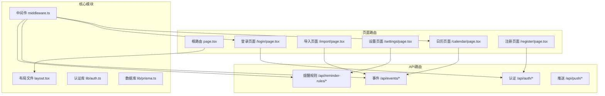
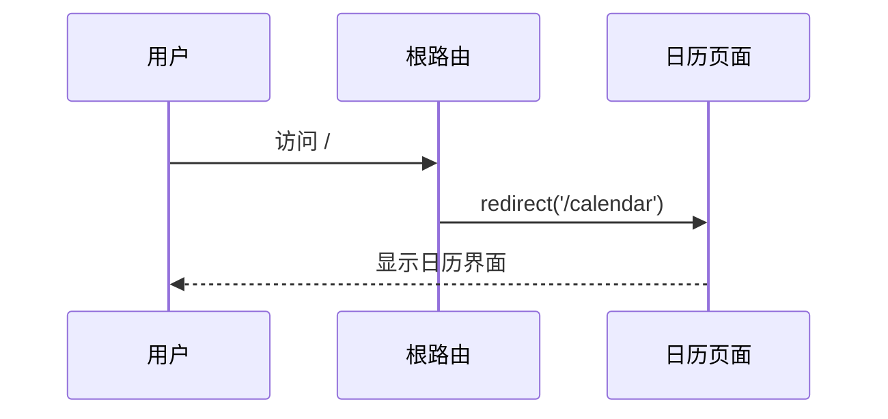
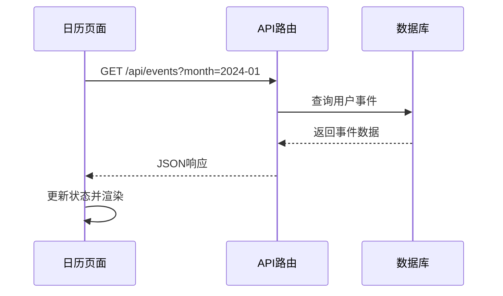
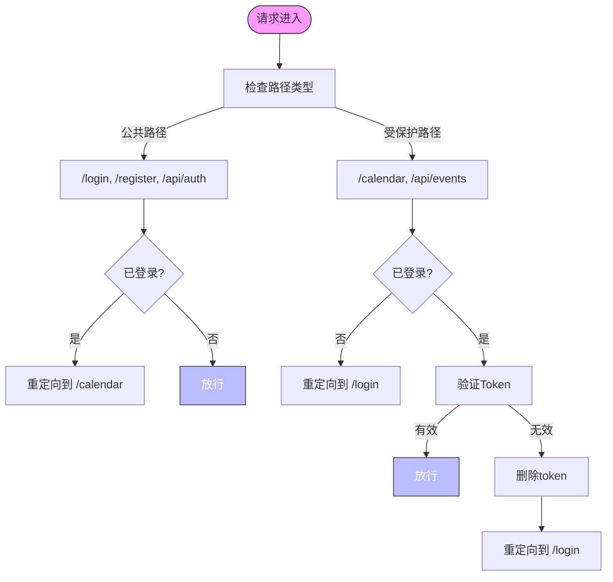

# 页面路由

<cite>
**本文档中引用的文件**   
- [page.tsx](file://app/page.tsx)
- [layout.tsx](file://app/layout.tsx)
- [middleware.ts](file://middleware.ts)
- [calendar/page.tsx](file://app/calendar/page.tsx)
- [import/page.tsx](file://app/import/page.tsx)
- [settings/page.tsx](file://app/settings/page.tsx)
- [login/page.tsx](file://app/login/page.tsx)
- [register/page.tsx](file://app/register/page.tsx)
- [api/auth/login/route.ts](file://app/api/auth/login/route.ts)
- [api/auth/register/route.ts](file://app/api/auth/register/route.ts)
- [api/events/route.ts](file://app/api/events/route.ts)
- [api/reminder-rules/route.ts](file://app/api/reminder-rules/route.ts)
- [lib/auth.ts](file://lib/auth.ts)
</cite>

## 目录
1. [项目结构](#项目结构)
2. [根路由与应用入口](#根路由与应用入口)
3. [页面组件与渲染策略](#页面组件与渲染策略)
4. [路由安全控制](#路由安全控制)
5. [页面间导航与用户工作流](#页面间导航与用户工作流)
6. [API路由与后端交互](#api路由与后端交互)
7. [SEO优化配置](#seo优化配置)

## 项目结构

该应用基于Next.js App Router架构，采用功能模块化组织方式。核心页面位于`app`目录下，每个功能页面（如`/calendar`、`/import`）通过独立的`page.tsx`文件实现。API路由位于`app/api`目录，遵循RESTful设计原则，处理认证、事件管理、提醒规则等后端逻辑。组件库位于`components`目录，提供可复用的UI组件。



**图示来源**
- [page.tsx](file://app/page.tsx)
- [calendar/page.tsx](file://app/calendar/page.tsx)
- [import/page.tsx](file://app/import/page.tsx)
- [settings/page.tsx](file://app/settings/page.tsx)
- [login/page.tsx](file://app/login/page.tsx)
- [register/page.tsx](file://app/register/page.tsx)
- [middleware.ts](file://middleware.ts)

## 根路由与应用入口

根路由`app/page.tsx`作为应用的默认入口，其职责是进行初始重定向。该页面不包含任何UI渲染，而是通过`redirect('/calendar')`将用户直接导向日历主页面，确保用户访问根路径时能立即进入核心功能区域。



**图示来源**
- [page.tsx](file://app/page.tsx)

**本节来源**
- [page.tsx](file://app/page.tsx)

## 页面组件与渲染策略

### 客户端渲染（CSR）策略

所有功能页面均采用客户端渲染（`'use client'`），利用React的交互能力实现动态UI。页面通过`useEffect`或组件挂载时调用API获取数据。

- **日历页面** (`/calendar/page.tsx`)：在`useEffect`中调用`fetch('/api/events?month=...')`获取当月事件数据，支持搜索和标签筛选。
- **导入页面** (`/import/page.tsx`)：使用`Papa.parse`在客户端解析CSV文件，预览数据后通过`fetch('/api/events/bulk-create')`批量创建事件。
- **设置页面** (`/settings/page.tsx`)：加载时获取提醒规则列表，并提供浏览器通知权限管理功能。

### 数据获取方式

页面组件通过`fetch` API与后端交互，通常在`useEffect`或事件处理函数中调用。例如，日历页面在月份变化时重新获取数据：



**图示来源**
- [calendar/page.tsx](file://app/calendar/page.tsx)
- [api/events/route.ts](file://app/api/events/route.ts)

**本节来源**
- [calendar/page.tsx](file://app/calendar/page.tsx)
- [import/page.tsx](file://app/import/page.tsx)
- [settings/page.tsx](file://app/settings/page.tsx)

## 路由安全控制

应用通过`middleware.ts`实现全面的路由安全控制。中间件根据请求路径和认证状态进行拦截和重定向。



**图示来源**
- [middleware.ts](file://middleware.ts)

**本节来源**
- [middleware.ts](file://middleware.ts)
- [lib/auth.ts](file://lib/auth.ts)

## 页面间导航与用户工作流

### 导航逻辑

页面间通过`next/navigation`的`useRouter`进行编程式导航。例如：
- 日历页面通过`router.push('/import')`跳转到导入页面
- 登录成功后通过`router.push('/calendar')`进入主界面
- 注册成功后自动跳转到登录页面

### 用户工作流

典型用户工作流如下：
1. 未登录用户访问任何受保护页面 → 重定向到登录页
2. 用户登录 → 自动跳转到日历页面
3. 在日历页面点击"导入CSV" → 进入导入页面
4. 导入完成后 → 自动跳转回日历页面
5. 在设置页面配置提醒规则 → 返回后规则立即生效

```mermaid
graph LR
A[未登录] --> B[访问/calendar]
B --> C[重定向到/login]
C --> D[用户登录]
D --> E[跳转到/calendar]
E --> F[点击导入]
F --> G[/import]
G --> H[上传CSV]
H --> I[跳转回/calendar]
```

**图示来源**
- [calendar/page.tsx](file://app/calendar/page.tsx)
- [import/page.tsx](file://app/import/page.tsx)
- [login/page.tsx](file://app/login/page.tsx)
- [register/page.tsx](file://app/register/page.tsx)

**本节来源**
- [calendar/page.tsx](file://app/calendar/page.tsx)
- [import/page.tsx](file://app/import/page.tsx)
- [login/page.tsx](file://app/login/page.tsx)
- [register/page.tsx](file://app/register/page.tsx)

## API路由与后端交互

### 认证API

- **登录** (`/api/auth/login/route.ts`)：验证邮箱密码，成功后设置HTTP-only cookie
- **注册** (`/api/auth/register/route.ts`)：创建新用户，密码使用bcrypt加密

### 事件管理API

- **获取事件** (`/api/events/route.ts`)：查询用户事件并生成提醒实例
- **批量创建** (`/api/events/bulk-create/route.ts`)：处理CSV导入的批量事件

### 提醒规则API

- **获取/创建规则** (`/api/reminder-rules/route.ts`)：管理用户的提醒规则配置

```mermaid
classDiagram
class AuthAPI {
+POST /api/auth/login
+POST /api/auth/register
+POST /api/auth/logout
}
class EventsAPI {
+GET /api/events
+POST /api/events
+PUT /api/events/{id}
+DELETE /api/events/{id}
+POST /api/events/bulk-create
}
class ReminderRulesAPI {
+GET /api/reminder-rules
+POST /api/reminder-rules
+DELETE /api/reminder-rules/{id}
}
class PushAPI {
+GET /api/push/vapid-public-key
+POST /api/push/subscribe
}
AuthAPI --> middleware : "受保护"
EventsAPI --> middleware : "受保护"
ReminderRulesAPI --> middleware : "受保护"
PushAPI --> middleware : "受保护"
```

**图示来源**
- [api/auth/login/route.ts](file://app/api/auth/login/route.ts)
- [api/auth/register/route.ts](file://app/api/auth/register/route.ts)
- [api/events/route.ts](file://app/api/events/route.ts)
- [api/reminder-rules/route.ts](file://app/api/reminder-rules/route.ts)

**本节来源**
- [api/auth/login/route.ts](file://app/api/auth/login/route.ts)
- [api/auth/register/route.ts](file://app/api/auth/register/route.ts)
- [api/events/route.ts](file://app/api/events/route.ts)
- [api/reminder-rules/route.ts](file://app/api/reminder-rules/route.ts)

## SEO优化配置

应用通过`layout.tsx`中的`metadata`对象进行SEO优化配置。根布局文件定义了全局的元数据，包括页面标题和描述：

```typescript
export const metadata: Metadata = {
  title: "日程提醒助手",
  description: "合同与事件提醒系统",
};
```

此配置确保所有页面继承统一的SEO信息，同时允许特定页面通过`generateMetadata`函数进行覆盖和定制。页面标题和描述将出现在搜索引擎结果中，提升应用的可发现性。

**本节来源**
- [layout.tsx](file://app/layout.tsx)