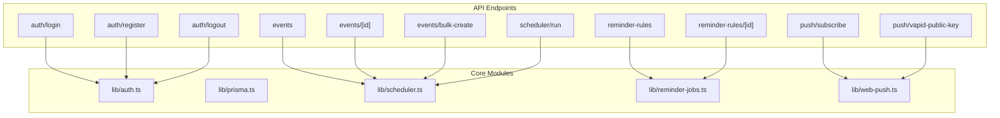
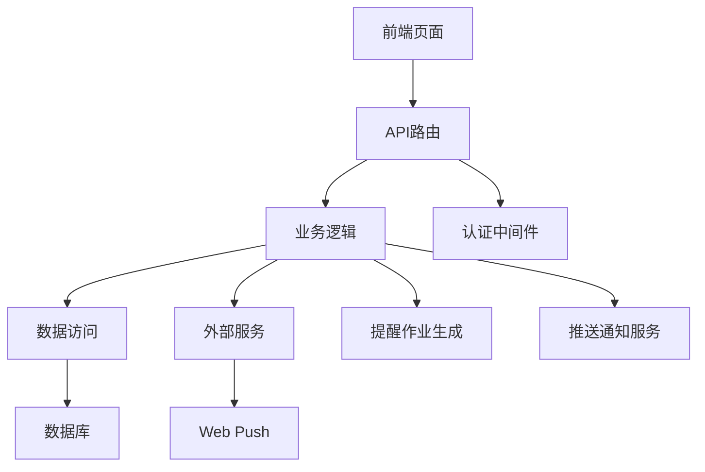
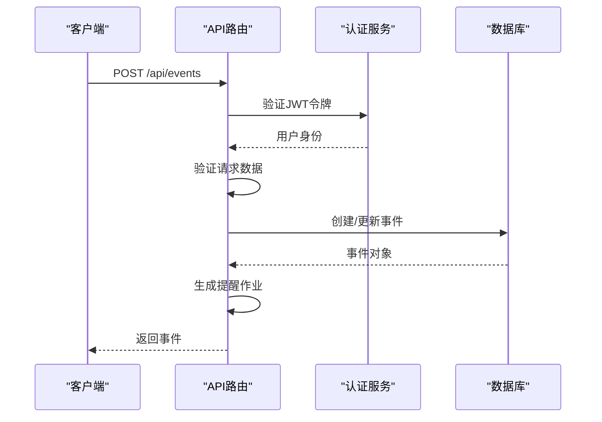
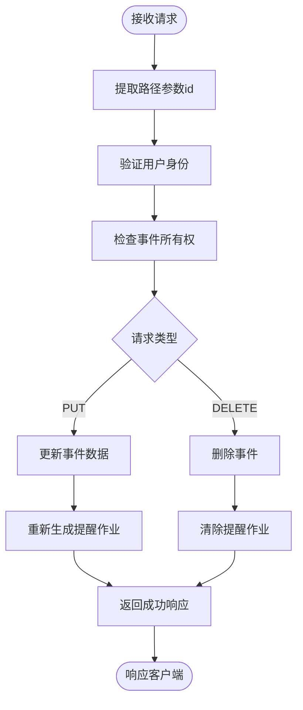
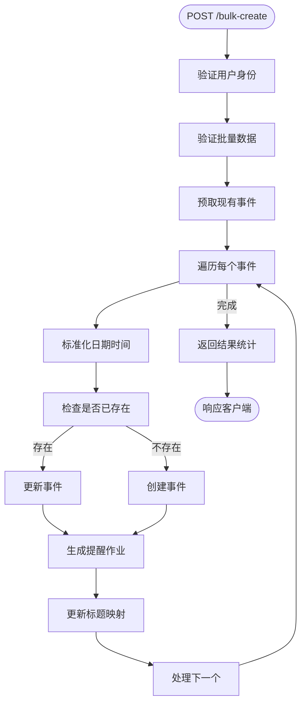
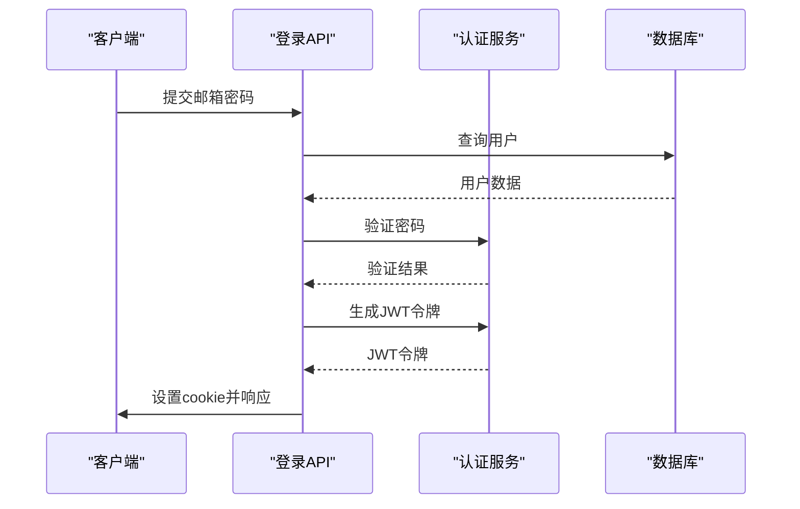
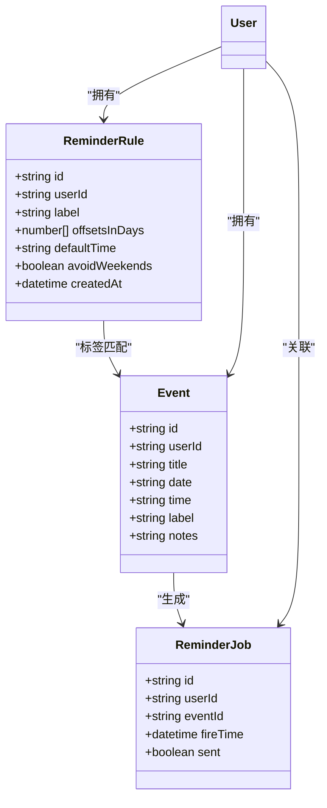
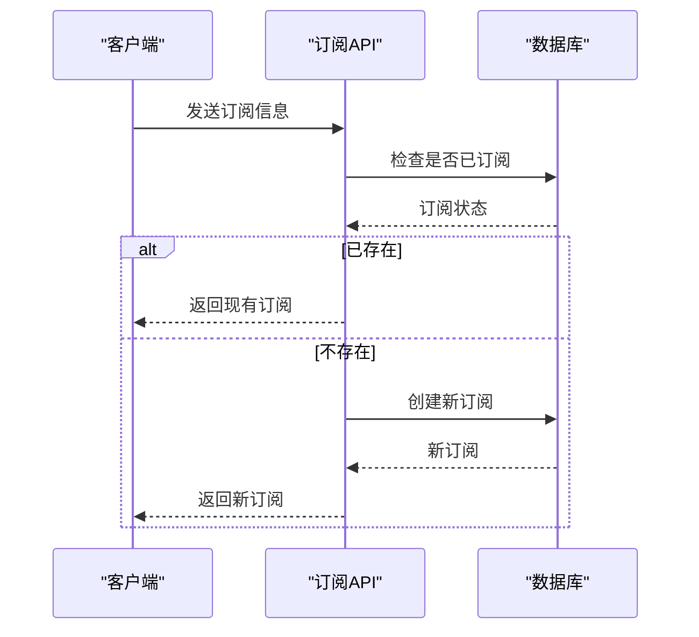
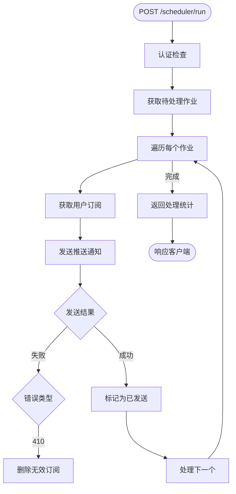
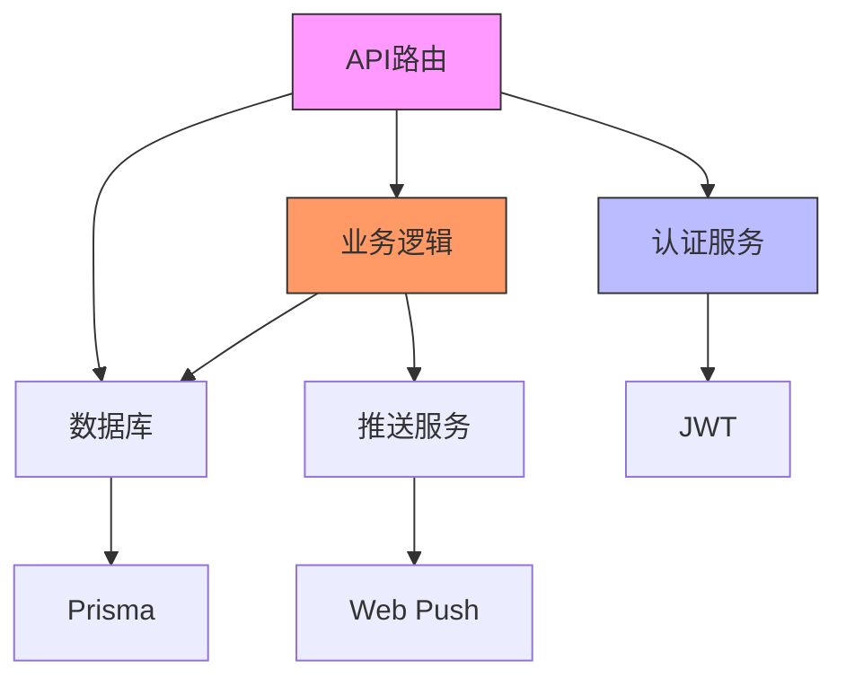

# API路由设计

<cite>
**本文档中引用的文件**  
- [events/route.ts](file://app/api/events/route.ts)
- [events/[id]/route.ts](file://app/api/events/[id]/route.ts)
- [events/bulk-create/route.ts](file://app/api/events/bulk-create/route.ts)
- [auth/login/route.ts](file://app/api/auth/login/route.ts)
- [auth/register/route.ts](file://app/api/auth/register/route.ts)
- [auth/logout/route.ts](file://app/api/auth/logout/route.ts)
- [reminder-rules/route.ts](file://app/api/reminder-rules/route.ts)
- [reminder-rules/[id]/route.ts](file://app/api/reminder-rules/[id]/route.ts)
- [push/subscribe/route.ts](file://app/api/push/subscribe/route.ts)
- [push/vapid-public-key/route.ts](file://app/api/push/vapid-public-key/route.ts)
- [scheduler/run/route.ts](file://app/api/scheduler/run/route.ts)
- [auth.ts](file://lib/auth.ts)
- [scheduler.ts](file://lib/scheduler.ts)
- [reminder-jobs.ts](file://lib/reminder-jobs.ts)
- [web-push.ts](file://lib/web-push.ts)
</cite>

## 目录
1. [简介](#简介)
2. [项目结构](#项目结构)
3. [核心组件](#核心组件)
4. [架构概述](#架构概述)
5. [详细组件分析](#详细组件分析)
6. [依赖分析](#依赖分析)
7. [性能考虑](#性能考虑)
8. [故障排除指南](#故障排除指南)
9. [结论](#结论)

## 简介
本项目是一个基于Next.js App Router的待办事项系统，支持CSV批量导入事件、提醒规则配置、Web推送通知和定时调度功能。API设计遵循RESTful原则，通过JWT实现用户认证，使用Prisma进行数据库操作，并集成Web Push API实现浏览器通知。系统核心功能包括事件管理、用户认证、提醒规则、推送订阅和调度器触发。

## 项目结构
项目采用标准的Next.js App Router目录结构，API路由集中于`app/api`目录下，按功能模块组织。前端页面与API端点分离，便于维护和扩展。



**Diagram sources**
- [app/api](file://app/api)
- [lib](file://lib)

**Section sources**
- [app/api](file://app/api)
- [lib](file://lib)

## 核心组件
系统核心组件包括事件管理、用户认证、提醒规则、推送订阅和调度器五大模块。所有API端点均通过JWT进行身份验证，使用Zod进行请求数据验证，确保接口安全性和数据完整性。

**Section sources**
- [events/route.ts](file://app/api/events/route.ts)
- [auth/login/route.ts](file://app/api/auth/login/route.ts)
- [reminder-rules/route.ts](file://app/api/reminder-rules/route.ts)
- [push/subscribe/route.ts](file://app/api/push/subscribe/route.ts)
- [scheduler/run/route.ts](file://app/api/scheduler/run/route.ts)

## 架构概述
系统采用分层架构设计，前端通过API路由与后端交互，后端服务通过业务逻辑层调用数据访问层。认证、提醒生成、推送通知等公共功能封装为独立模块，提高代码复用性。



**Diagram sources**
- [app/api](file://app/api)
- [lib](file://lib)
- [prisma/schema.prisma](file://prisma/schema.prisma)

## 详细组件分析

### 事件管理分析
事件管理API提供创建、读取、更新、删除和批量创建功能，支持基于标签的智能提醒。

#### 事件创建与读取


**Diagram sources**
- [events/route.ts](file://app/api/events/route.ts#L131-L200)
- [lib/auth.ts](file://lib/auth.ts#L22-L30)
- [lib/reminder-jobs.ts](file://lib/reminder-jobs.ts#L15-L72)

#### 动态路由[id]实现


**Diagram sources**
- [events/[id]/route.ts](file://app/api/events/[id]/route.ts)
- [lib/reminder-jobs.ts](file://lib/reminder-jobs.ts#L15-L72)

**Section sources**
- [events/[id]/route.ts](file://app/api/events/[id]/route.ts)
- [lib/reminder-jobs.ts](file://lib/reminder-jobs.ts)

#### 批量创建CSV导入


**Diagram sources**
- [events/bulk-create/route.ts](file://app/api/events/bulk-create/route.ts)
- [lib/reminder-jobs.ts](file://lib/reminder-jobs.ts#L15-L72)

**Section sources**
- [events/bulk-create/route.ts](file://app/api/events/bulk-create/route.ts)
- [lib/reminder-jobs.ts](file://lib/reminder-jobs.ts)

### 用户认证分析
用户认证系统基于JWT实现，通过HTTP-only cookie存储令牌，提高安全性。



**Diagram sources**
- [auth/login/route.ts](file://app/api/auth/login/route.ts)
- [lib/auth.ts](file://lib/auth.ts)

**Section sources**
- [auth/login/route.ts](file://app/api/auth/login/route.ts)
- [auth/register/route.ts](file://app/api/auth/register/route.ts)
- [auth/logout/route.ts](file://app/api/auth/logout/route.ts)

### 提醒规则分析
提醒规则系统允许用户为不同标签配置个性化的提醒策略。



**Diagram sources**
- [reminder-rules/route.ts](file://app/api/reminder-rules/route.ts)
- [reminder-rules/[id]/route.ts](file://app/api/reminder-rules/[id]/route.ts)
- [lib/reminder-jobs.ts](file://lib/reminder-jobs.ts)

**Section sources**
- [reminder-rules/route.ts](file://app/api/reminder-rules/route.ts)
- [reminder-rules/[id]/route.ts](file://app/api/reminder-rules/[id]/route.ts)

### 推送订阅分析
推送订阅系统基于Web Push API实现，管理用户的浏览器推送权限和订阅信息。



**Diagram sources**
- [push/subscribe/route.ts](file://app/api/push/subscribe/route.ts)
- [lib/web-push.ts](file://lib/web-push.ts)

**Section sources**
- [push/subscribe/route.ts](file://app/api/push/subscribe/route.ts)
- [push/vapid-public-key/route.ts](file://app/api/push/vapid-public-key/route.ts)

### 调度器分析
调度器作为外部Cron触发入口，负责发送待处理的提醒通知。



**Diagram sources**
- [scheduler/run/route.ts](file://app/api/scheduler/run/route.ts)
- [lib/scheduler.ts](file://lib/scheduler.ts)
- [lib/reminder-jobs.ts](file://lib/reminder-jobs.ts)

**Section sources**
- [scheduler/run/route.ts](file://app/api/scheduler/run/route.ts)
- [lib/scheduler.ts](file://lib/scheduler.ts)

## 依赖分析
系统依赖关系清晰，各模块职责分明，通过接口隔离降低耦合度。



**Diagram sources**
- [package.json](file://package.json)
- [app/api](file://app/api)
- [lib](file://lib)

**Section sources**
- [package.json](file://package.json)
- [lib](file://lib)

## 性能考虑
系统在设计时考虑了多项性能优化措施：
- 批量操作时预取数据减少数据库查询次数
- 使用Prisma的createMany等批量操作方法
- 提醒作业生成时先删除旧作业再批量创建
- 调度器运行时批量获取待处理作业
- 客户端分页加载事件数据

## 故障排除指南
常见错误响应格式统一，便于客户端处理：

```json
{
  "error": "错误描述",
  "details": "详细信息（可选）"
}
```

| 状态码 | 错误场景 | 处理建议 |
|--------|---------|---------|
| 400 | 参数验证失败 | 检查请求数据格式 |
| 401 | 未授权访问 | 确保已登录并携带有效令牌 |
| 403 | 禁止访问 | 检查资源所有权 |
| 404 | 资源不存在 | 验证资源ID是否正确 |
| 500 | 服务器内部错误 | 检查服务日志 |

**Section sources**
- [events/route.ts](file://app/api/events/route.ts)
- [auth/login/route.ts](file://app/api/auth/login/route.ts)
- [lib/scheduler.ts](file://lib/scheduler.ts)

## 结论
本API设计实现了完整的待办事项管理功能，具有良好的安全性、可扩展性和用户体验。通过RESTful设计原则和模块化架构，系统易于维护和扩展。建议在生产环境中为调度器端点添加额外的身份验证机制，如预共享密钥，以增强安全性。