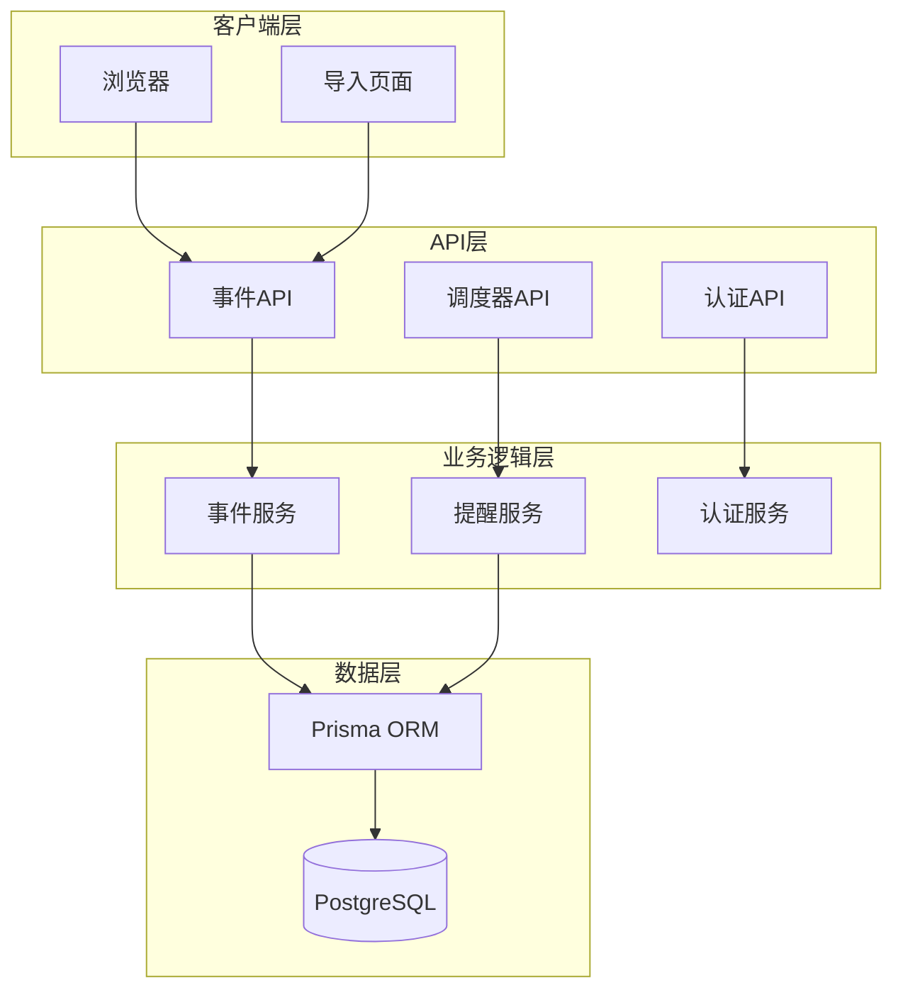
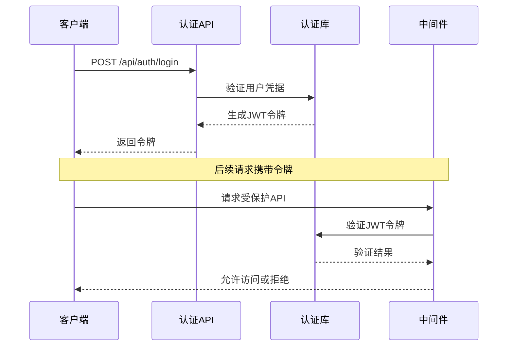
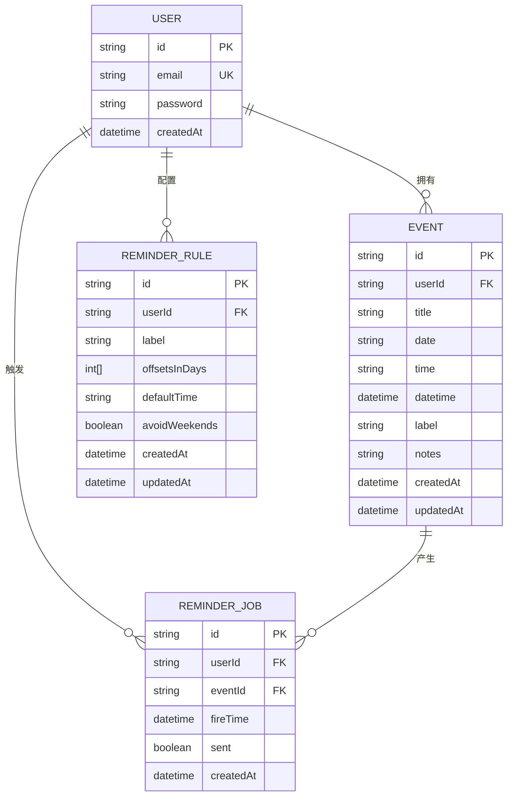
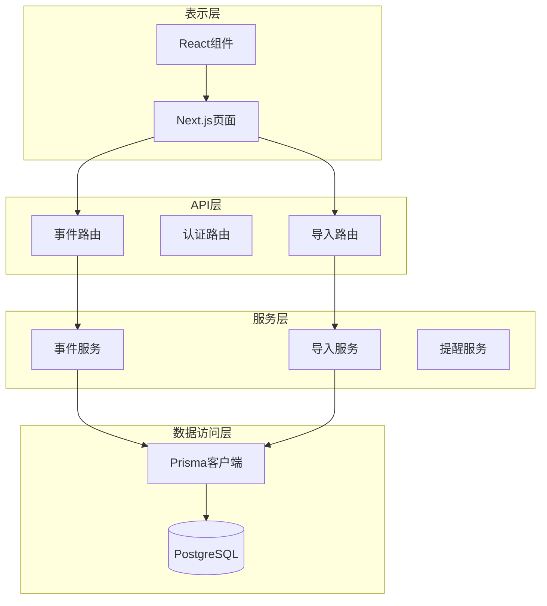
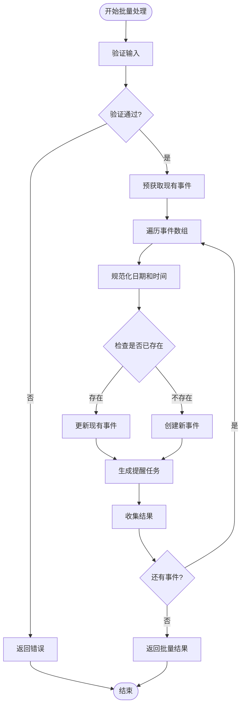
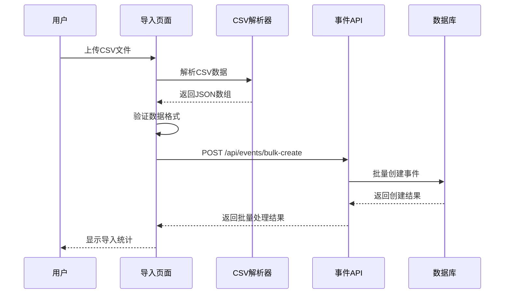
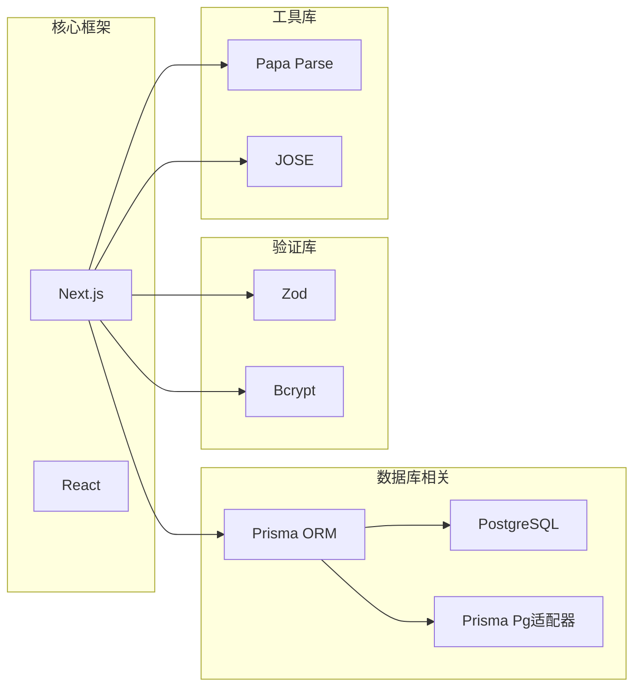
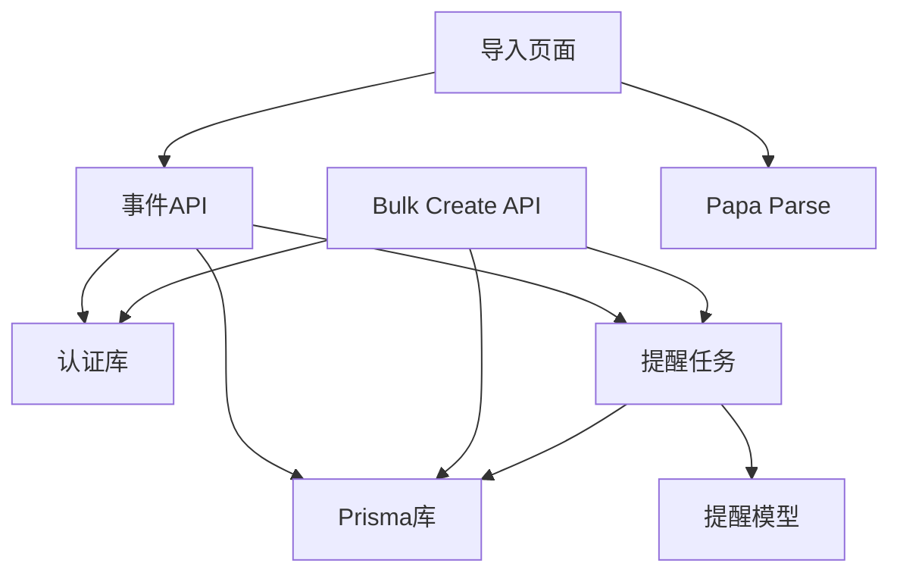
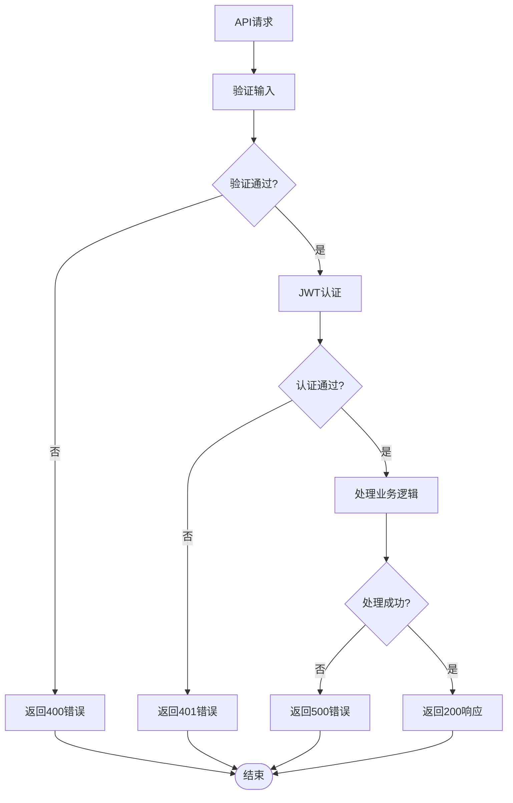

# 事件管理API

<cite>
**本文档引用的文件**
- [app/api/events/route.ts](file://app/api/events/route.ts)
- [app/api/events/[id]/route.ts](file://app/api/events/[id]/route.ts)
- [app/api/events/bulk-create/route.ts](file://app/api/events/bulk-create/route.ts)
- [lib/prisma.ts](file://lib/prisma.ts)
- [lib/auth.ts](file://lib/auth.ts)
- [lib/reminder-jobs.ts](file://lib/reminder-jobs.ts)
- [prisma/schema.prisma](file://prisma/schema.prisma)
- [app/import/page.tsx](file://app/import/page.tsx)
- [public/templates/events-template.csv](file://public/templates/events-template.csv)
- [middleware.ts](file://middleware.ts)
</cite>

## 目录
1. [简介](#简介)
2. [项目结构](#项目结构)
3. [核心组件](#核心组件)
4. [架构概览](#架构概览)
5. [详细组件分析](#详细组件分析)
6. [依赖关系分析](#依赖关系分析)
7. [性能考虑](#性能考虑)
8. [故障排除指南](#故障排除指南)
9. [结论](#结论)

## 简介

todo-csv-import 是一个基于 Next.js App Router 构建的日程管理应用，提供了完整的事件管理API。该应用支持通过CSV文件批量导入事件，具有JWT认证机制，以及智能的提醒规则生成功能。

本API文档详细说明了事件管理的所有REST接口，包括：
- 获取事件列表（GET /api/events）
- 创建单个事件（POST /api/events）
- 获取指定事件（GET /api/events/[id]）
- 更新事件（PUT /api/events/[id]）
- 删除事件（DELETE /api/events/[id]）
- 批量创建事件（POST /api/events/bulk-create）

## 项目结构

应用程序采用Next.js App Router的分层架构，API路由位于`app/api/`目录下，业务逻辑通过Prisma ORM与PostgreSQL数据库交互。



**图表来源**
- [app/api/events/route.ts](file://app/api/events/route.ts#L1-L200)
- [lib/prisma.ts](file://lib/prisma.ts#L1-L20)
- [prisma/schema.prisma](file://prisma/schema.prisma#L28-L45)

**章节来源**
- [app/api/events/route.ts](file://app/api/events/route.ts#L1-L200)
- [lib/prisma.ts](file://lib/prisma.ts#L1-L20)
- [prisma/schema.prisma](file://prisma/schema.prisma#L1-L86)

## 核心组件

### 认证系统

系统使用JWT令牌进行用户认证，所有受保护的API端点都需要有效的认证令牌。



**图表来源**
- [lib/auth.ts](file://lib/auth.ts#L14-L29)
- [middleware.ts](file://middleware.ts#L5-L45)

### 数据模型

事件数据模型定义了事件的基本属性和关系：



**图表来源**
- [prisma/schema.prisma](file://prisma/schema.prisma#L28-L74)

**章节来源**
- [lib/auth.ts](file://lib/auth.ts#L1-L30)
- [prisma/schema.prisma](file://prisma/schema.prisma#L28-L74)

## 架构概览

系统采用分层架构设计，确保关注点分离和代码可维护性：



**图表来源**
- [app/api/events/route.ts](file://app/api/events/route.ts#L1-L200)
- [app/api/events/bulk-create/route.ts](file://app/api/events/bulk-create/route.ts#L1-L133)
- [lib/prisma.ts](file://lib/prisma.ts#L1-L20)

## 详细组件分析

### 事件管理API

#### GET /api/events - 获取事件列表

此端点用于获取指定月份的所有事件，包括原始事件和根据提醒规则生成的提醒事件。

**请求参数**
- 查询参数: `month` (必需) - 格式: YYYY-MM
- 认证: 需要JWT令牌

**响应格式**
```json
{
  "events": [
    {
      "id": "string",
      "title": "string",
      "date": "string",
      "time": "string",
      "label": "string",
      "notes": "string",
      "isReminder": "boolean",
      "reminderDaysOffset": "number|null",
      "originalEventId": "string",
      "displayDate": "string"
    }
  ]
}
```

**状态码**
- 200: 成功获取事件列表
- 400: 月份格式无效
- 401: 未授权
- 500: 内部服务器错误

**章节来源**
- [app/api/events/route.ts](file://app/api/events/route.ts#L15-L129)

#### POST /api/events - 创建单个事件

此端点用于创建新的事件，如果同名事件已存在则更新现有事件。

**请求体结构**
```json
{
  "title": "string",           // 必填，事件标题
  "date": "string",            // 必填，格式: YYYY-MM-DD
  "time": "string",            // 可选，格式: HH:MM，默认: 10:00
  "label": "string",           // 可选，事件标签
  "notes": "string"            // 可选，备注信息
}
```

**响应格式**
```json
{
  "event": {
    "id": "string",
    "userId": "string",
    "title": "string",
    "date": "string",
    "time": "string",
    "datetime": "datetime",
    "label": "string",
    "notes": "string",
    "createdAt": "datetime",
    "updatedAt": "datetime"
  },
  "replaced": "boolean"
}
```

**状态码**
- 200: 更新现有事件
- 201: 创建新事件
- 400: 输入验证失败
- 401: 未授权
- 500: 内部服务器错误

**章节来源**
- [app/api/events/route.ts](file://app/api/events/route.ts#L131-L199)

#### GET /api/events/[id] - 获取指定事件

此端点用于获取特定ID的事件详情。

**动态路由参数**
- `[id]`: 事件ID (必需)

**响应格式**
```json
{
  "event": {
    "id": "string",
    "userId": "string",
    "title": "string",
    "date": "string",
    "time": "string",
    "datetime": "datetime",
    "label": "string",
    "notes": "string",
    "createdAt": "datetime",
    "updatedAt": "datetime"
  }
}
```

**状态码**
- 200: 成功获取事件
- 400: 事件ID缺失
- 401: 未授权
- 403: 禁止访问（非事件所有者）
- 404: 事件不存在
- 500: 内部服务器错误

**章节来源**
- [app/api/events/[id]/route.ts](file://app/api/events/[id]/route.ts#L1-L119)

#### PUT /api/events/[id] - 更新事件

此端点用于更新现有事件。

**请求体结构**
```json
{
  "title": "string",           // 可选
  "date": "string",            // 可选，格式: YYYY-MM-DD
  "time": "string",            // 可选，格式: HH:MM
  "label": "string",           // 可选
  "notes": "string"            // 可选
}
```

**响应格式**
```json
{
  "event": {
    "id": "string",
    "userId": "string",
    "title": "string",
    "date": "string",
    "time": "string",
    "datetime": "datetime",
    "label": "string",
    "notes": "string",
    "createdAt": "datetime",
    "updatedAt": "datetime"
  }
}
```

**状态码**
- 200: 更新成功
- 400: 输入验证失败或事件ID缺失
- 401: 未授权
- 403: 禁止访问（非事件所有者）
- 404: 事件不存在
- 500: 内部服务器错误

**章节来源**
- [app/api/events/[id]/route.ts](file://app/api/events/[id]/route.ts#L15-L74)

#### DELETE /api/events/[id] - 删除事件

此端点用于删除指定ID的事件。

**响应格式**
```json
{
  "success": true
}
```

**状态码**
- 200: 删除成功
- 400: 事件ID缺失
- 401: 未授权
- 403: 禁止访问（非事件所有者）
- 404: 事件不存在
- 500: 内部服务器错误

**章节来源**
- [app/api/events/[id]/route.ts](file://app/api/events/[id]/route.ts#L76-L118)

#### POST /api/events/bulk-create - 批量创建事件

此端点用于从CSV解析后的JSON数组批量创建事件，支持重复事件覆盖。

**请求体结构**
```json
{
  "events": [
    {
      "title": "string",           // 必填
      "date": "string",            // 必填，格式: YYYY-MM-DD 或 YYYY/MM/DD
      "time": "string",            // 可选，格式: H:MM 或 HH:MM
      "label": "string",           // 可选
      "notes": "string"            // 可选
    }
  ]
}
```

**响应格式**
```json
{
  "success": true,
  "created": "number",         // 成功创建的事件数量
  "updated": "number",         // 成功更新的事件数量
  "failed": "number",          // 失败的事件数量
  "errors": [
    {
      "index": "number",       // 原始数组索引
      "title": "string",       // 事件标题
      "error": "string"        // 错误信息
    }
  ]
}
```

**批量处理逻辑**



**图表来源**
- [app/api/events/bulk-create/route.ts](file://app/api/events/bulk-create/route.ts#L19-L132)

**状态码**
- 201: 批量创建完成
- 400: 输入验证失败
- 401: 未授权
- 500: 内部服务器错误

**章节来源**
- [app/api/events/bulk-create/route.ts](file://app/api/events/bulk-create/route.ts#L19-L132)

### CSV导入流程

系统提供了完整的CSV导入功能，支持模板下载和数据验证：



**图表来源**
- [app/import/page.tsx](file://app/import/page.tsx#L35-L106)
- [app/api/events/bulk-create/route.ts](file://app/api/events/bulk-create/route.ts#L19-L132)

**章节来源**
- [app/import/page.tsx](file://app/import/page.tsx#L1-L218)
- [public/templates/events-template.csv](file://public/templates/events-template.csv#L1-L5)

## 依赖关系分析

### 外部依赖

系统使用以下关键依赖：



**图表来源**
- [package.json](file://package.json)
- [lib/prisma.ts](file://lib/prisma.ts#L1-L20)
- [lib/auth.ts](file://lib/auth.ts#L1-L30)

### 内部模块依赖



**图表来源**
- [app/api/events/route.ts](file://app/api/events/route.ts#L1-L200)
- [app/api/events/bulk-create/route.ts](file://app/api/events/bulk-create/route.ts#L1-L133)
- [lib/reminder-jobs.ts](file://lib/reminder-jobs.ts#L1-L109)

**章节来源**
- [app/api/events/route.ts](file://app/api/events/route.ts#L1-L200)
- [app/api/events/bulk-create/route.ts](file://app/api/events/bulk-create/route.ts#L1-L133)
- [lib/reminder-jobs.ts](file://lib/reminder-jobs.ts#L1-L109)

## 性能考虑

### 数据库优化

1. **索引策略**: 事件模型在(userId, date)上建立了复合索引，优化了按用户和日期范围查询的性能。

2. **批量操作**: 批量创建事件时使用预获取机制，减少数据库查询次数。

3. **事务处理**: 虽然当前实现没有显式的数据库事务，但批量操作采用逐个处理的方式，确保数据一致性。

### 缓存策略

1. **提醒规则缓存**: 在获取事件列表时，系统会缓存用户的提醒规则设置，避免重复查询。

2. **重复事件检测**: 批量导入时使用Map数据结构快速检测重复事件，提高处理效率。

### 并发控制

1. **JWT令牌验证**: 每个API请求都进行令牌验证，确保用户身份的准确性。

2. **用户隔离**: 所有数据库操作都包含userId过滤条件，防止跨用户数据访问。

## 故障排除指南

### 常见错误类型

1. **认证相关错误**
   - 401 Unauthorized: 令牌缺失或无效
   - 403 Forbidden: 非事件所有者尝试访问

2. **数据验证错误**
   - 400 Bad Request: 输入格式不符合Zod验证规则
   - 日期格式错误: 不符合YYYY-MM-DD或YYYY/MM/DD格式

3. **业务逻辑错误**
   - 事件不存在: 尝试更新或删除不存在的事件
   - 重复事件: 批量导入时发现重复标题

### 错误处理机制



**图表来源**
- [app/api/events/route.ts](file://app/api/events/route.ts#L15-L129)
- [app/api/events/[id]/route.ts](file://app/api/events/[id]/route.ts#L15-L118)

### 调试建议

1. **检查JWT令牌**: 确保客户端正确存储和发送令牌
2. **验证数据格式**: 使用提供的CSV模板确保数据格式正确
3. **查看服务器日志**: 关注console.error输出的详细错误信息
4. **测试单个事件**: 先测试单个事件API，再进行批量操作

**章节来源**
- [app/api/events/route.ts](file://app/api/events/route.ts#L125-L128)
- [app/api/events/[id]/route.ts](file://app/api/events/[id]/route.ts#L70-L73)

## 结论

todo-csv-import的事件管理API提供了完整且健壮的日程管理功能。系统采用现代化的技术栈，包括Next.js App Router、Prisma ORM和JWT认证，确保了良好的开发体验和运行性能。

主要特性包括：
- 完整的RESTful API设计
- 强大的CSV批量导入功能
- 智能的提醒规则生成功能
- 严格的数据验证和错误处理
- 良好的用户体验和响应式界面

该API设计遵循了最佳实践，具有良好的扩展性和维护性，为后续的功能扩展奠定了坚实的基础。