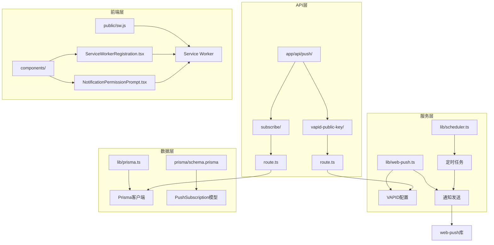
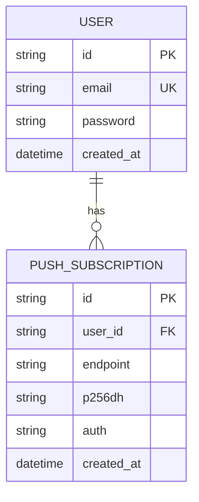
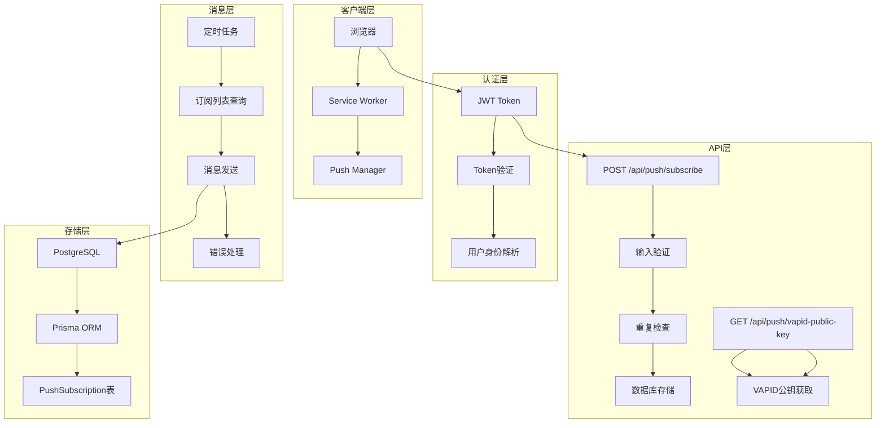
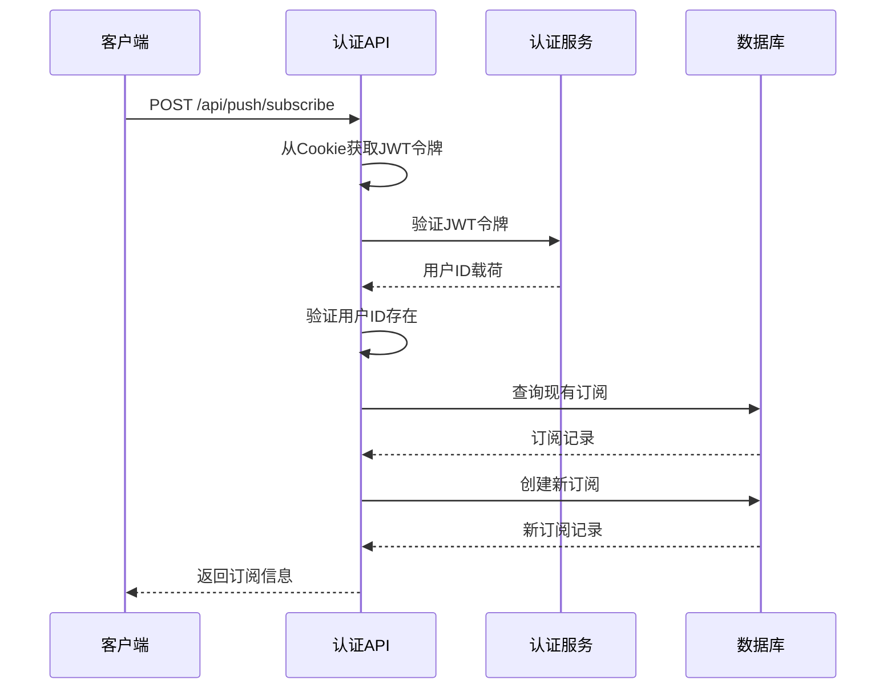
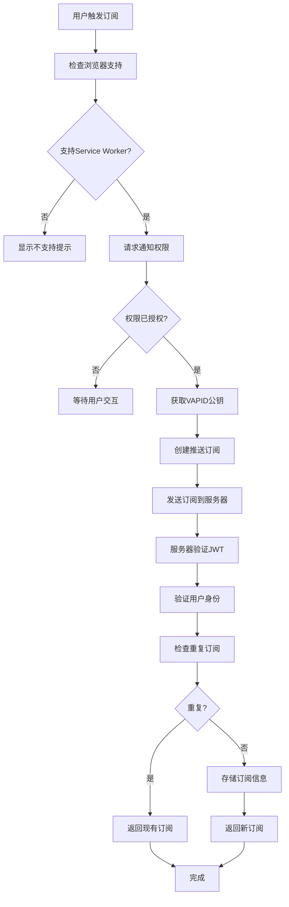
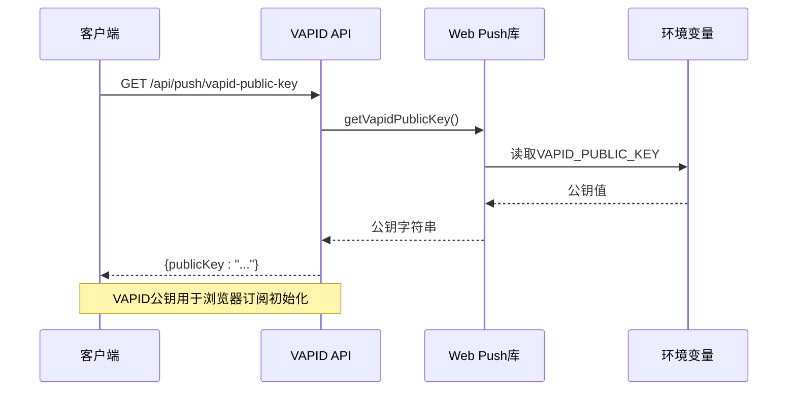
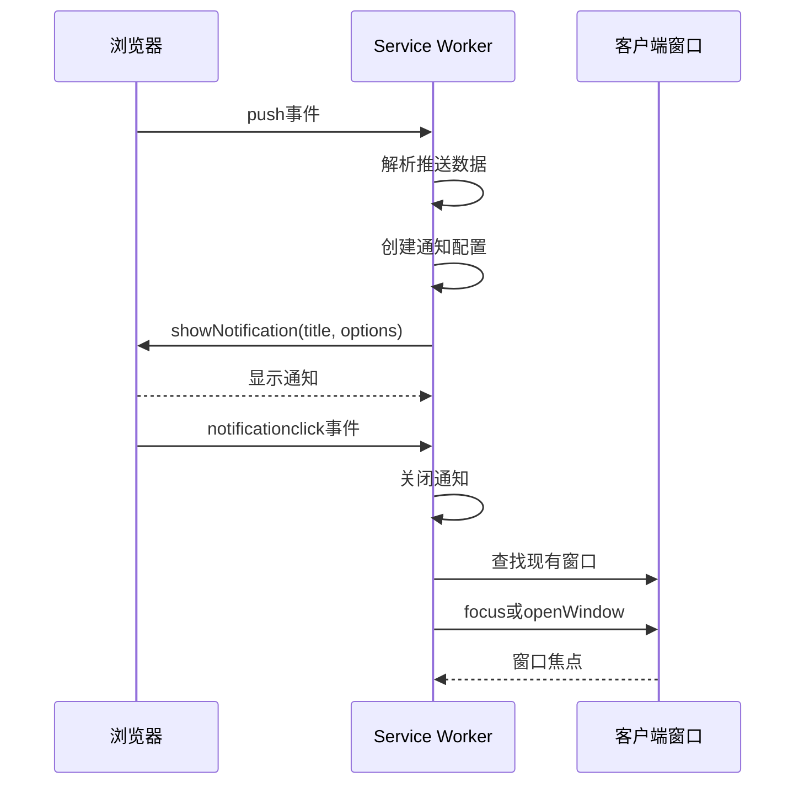
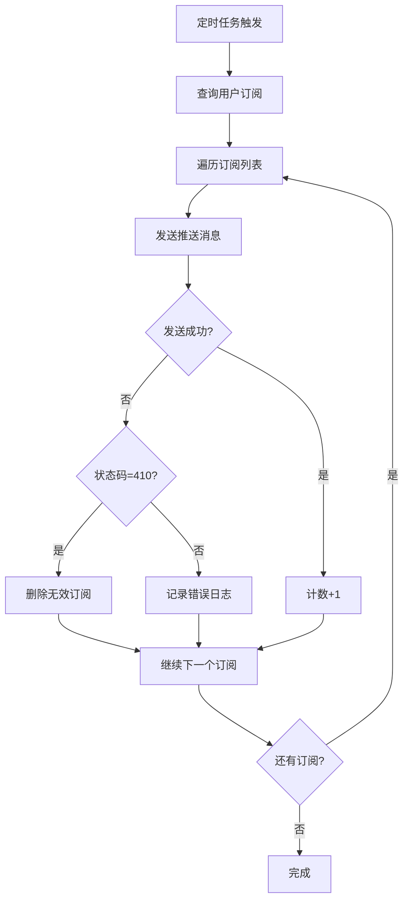
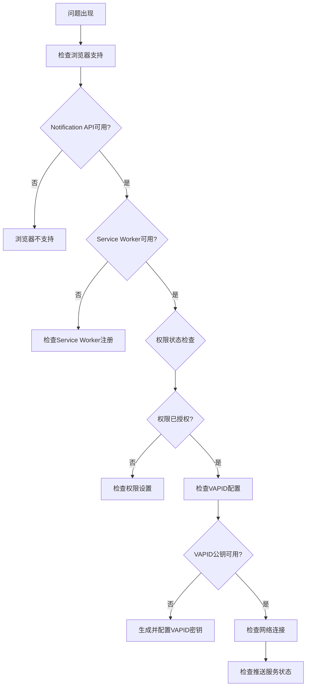

# 推送订阅API

<cite>
**本文档引用的文件**
- [app/api/push/subscribe/route.ts](file://app/api/push/subscribe/route.ts)
- [app/api/push/vapid-public-key/route.ts](file://app/api/push/vapid-public-key/route.ts)
- [lib/web-push.ts](file://lib/web-push.ts)
- [public/sw.js](file://public/sw.js)
- [lib/prisma.ts](file://lib/prisma.ts)
- [prisma/schema.prisma](file://prisma/schema.prisma)
- [components/ServiceWorkerRegistration.tsx](file://components/ServiceWorkerRegistration.tsx)
- [components/NotificationPermissionPrompt.tsx](file://components/NotificationPermissionPrompt.tsx)
- [lib/auth.ts](file://lib/auth.ts)
- [lib/scheduler.ts](file://lib/scheduler.ts)
- [docs/WEB_PUSH_DEBUG.md](file://docs/WEB_PUSH_DEBUG.md)
</cite>

## 目录
1. [简介](#简介)
2. [项目结构](#项目结构)
3. [核心组件](#核心组件)
4. [架构概览](#架构概览)
5. [详细组件分析](#详细组件分析)
6. [依赖关系分析](#依赖关系分析)
7. [性能考虑](#性能考虑)
8. [故障排除指南](#故障排除指南)
9. [结论](#结论)

## 简介

todo-csv-import项目实现了完整的Web Push通知订阅管理功能。该系统允许用户通过浏览器订阅推送通知，并通过VAPID（Voluntary Application-Server Identification）协议确保消息的安全传输。系统包含两个主要的API端点：`POST /api/push/subscribe`用于注册推送订阅，`GET /api/push/vapid-public-key`用于获取VAPID公钥。

## 项目结构

项目采用Next.js框架的目录结构，推送相关的核心文件分布如下：



**图表来源**
- [app/api/push/subscribe/route.ts](file://app/api/push/subscribe/route.ts#L1-L96)
- [app/api/push/vapid-public-key/route.ts](file://app/api/push/vapid-public-key/route.ts#L1-L13)
- [lib/web-push.ts](file://lib/web-push.ts#L1-L54)
- [public/sw.js](file://public/sw.js#L1-L78)

**章节来源**
- [app/api/push/subscribe/route.ts](file://app/api/push/subscribe/route.ts#L1-L96)
- [app/api/push/vapid-public-key/route.ts](file://app/api/push/vapid-public-key/route.ts#L1-L13)
- [lib/web-push.ts](file://lib/web-push.ts#L1-L54)
- [public/sw.js](file://public/sw.js#L1-L78)

## 核心组件

### PushSubscription数据模型

系统使用Prisma ORM管理推送订阅数据，核心数据结构如下：



**图表来源**
- [prisma/schema.prisma](file://prisma/schema.prisma#L76-L85)

### VAPID密钥管理系统

VAPID（Voluntary Application-Server Identification）协议提供了应用服务器身份验证机制，确保推送消息的来源可信。

**章节来源**
- [lib/web-push.ts](file://lib/web-push.ts#L3-L15)
- [prisma/schema.prisma](file://prisma/schema.prisma#L76-L85)

## 架构概览

系统采用分层架构设计，确保推送功能的安全性和可维护性：



**图表来源**
- [app/api/push/subscribe/route.ts](file://app/api/push/subscribe/route.ts#L14-L62)
- [app/api/push/vapid-public-key/route.ts](file://app/api/push/vapid-public-key/route.ts#L4-L12)
- [lib/scheduler.ts](file://lib/scheduler.ts#L42-L69)

## 详细组件分析

### 认证与授权机制

系统使用JWT（JSON Web Token）进行用户身份验证，确保只有经过认证的用户可以管理推送订阅。



**图表来源**
- [app/api/push/subscribe/route.ts](file://app/api/push/subscribe/route.ts#L14-L62)
- [lib/auth.ts](file://lib/auth.ts#L22-L29)

**章节来源**
- [app/api/push/subscribe/route.ts](file://app/api/push/subscribe/route.ts#L14-L24)
- [lib/auth.ts](file://lib/auth.ts#L14-L29)

### PushSubscription对象结构

PushSubscription对象包含浏览器推送API所需的所有必要信息：

| 字段名 | 类型 | 必需 | 描述 |
|--------|------|------|------|
| endpoint | string | 是 | 推送服务端点URL |
| keys.p256dh | string | 是 | ECDH密钥派生参数 |
| keys.auth | string | 是 | 认证密钥 |

**章节来源**
- [app/api/push/subscribe/route.ts](file://app/api/push/subscribe/route.ts#L6-L12)
- [lib/web-push.ts](file://lib/web-push.ts#L17-L23)

### 订阅注册流程



**图表来源**
- [components/NotificationPermissionPrompt.tsx](file://components/NotificationPermissionPrompt.tsx#L31-L73)
- [app/api/push/subscribe/route.ts](file://app/api/push/subscribe/route.ts#L35-L55)

**章节来源**
- [components/NotificationPermissionPrompt.tsx](file://components/NotificationPermissionPrompt.tsx#L51-L73)
- [app/api/push/subscribe/route.ts](file://app/api/push/subscribe/route.ts#L35-L55)

### VAPID公钥获取机制



**图表来源**
- [app/api/push/vapid-public-key/route.ts](file://app/api/push/vapid-public-key/route.ts#L4-L12)
- [lib/web-push.ts](file://lib/web-push.ts#L51-L53)

**章节来源**
- [app/api/push/vapid-public-key/route.ts](file://app/api/push/vapid-public-key/route.ts#L4-L12)
- [lib/web-push.ts](file://lib/web-push.ts#L51-L53)

### Service Worker通知处理

Service Worker负责处理来自推送服务的消息：



**图表来源**
- [public/sw.js](file://public/sw.js#L12-L73)

**章节来源**
- [public/sw.js](file://public/sw.js#L12-L73)

### 消息发送与错误处理

系统实现了智能的订阅失效检测和清理机制：



**图表来源**
- [lib/scheduler.ts](file://lib/scheduler.ts#L42-L69)

**章节来源**
- [lib/scheduler.ts](file://lib/scheduler.ts#L42-L69)

## 依赖关系分析

系统的关键依赖关系如下：

```mermaid
graph LR
subgraph "外部依赖"
A[web-push ^3.6.7] --> B[推送消息发送]
C[zod ^4.1.13] --> D[输入验证]
E[jose ^6.1.3] --> F[JWT处理]
G[bcryptjs ^3.0.3] --> H[密码哈希]
end
subgraph "数据库依赖"
I[@prisma/client ^7.1.0] --> J[类型安全查询]
K[pg ^8.16.3] --> L[PostgreSQL连接]
M[@prisma/adapter-pg ^7.1.0] --> N[适配器]
end
subgraph "前端依赖"
O[react ^19.2.1] --> P[组件渲染]
Q[next ^16.0.8] --> R[服务端渲染]
end
subgraph "内部模块"
S[lib/web-push.ts] --> A
T[lib/auth.ts] --> E
U[lib/prisma.ts] --> I
V[lib/scheduler.ts] --> S
end
```

**图表来源**
- [package.json](file://package.json#L11-L36)
- [lib/web-push.ts](file://lib/web-push.ts#L1-L1)
- [lib/auth.ts](file://lib/auth.ts#L1-L2)

**章节来源**
- [package.json](file://package.json#L11-L36)

## 性能考虑

### 订阅存储优化

- **索引设计**：PushSubscription表针对`userId`和`endpoint`建立了复合索引，确保查询效率
- **重复检查**：在存储前进行重复检查，避免数据库冗余
- **批量操作**：支持批量删除无效订阅，提高清理效率

### 消息发送优化

- **并发处理**：定时任务中并行发送消息，提高处理速度
- **错误隔离**：单个订阅失败不影响其他订阅的消息发送
- **自动清理**：自动检测并清理失效的订阅

### 缓存策略

- **VAPID公钥缓存**：公钥在应用启动时加载到内存中，避免重复读取环境变量
- **Service Worker缓存**：Service Worker在安装时跳过等待，提高响应速度

## 故障排除指南

### 常见问题诊断

根据官方文档，Web Push权限问题的常见原因包括：

1. **浏览器安全策略限制**
   - 权限请求必须由直接的用户手势触发
   - 不能在异步操作后请求权限
   - 不能在页面加载时自动请求

2. **权限状态问题**
   - `default`: 未请求过（应该能弹出对话框）
   - `granted`: 已授权
   - `denied`: 已拒绝（需要手动重置）

3. **HTTPS要求**
   - `localhost`和`127.0.0.1`不需要HTTPS
   - 内网IP地址需要HTTPS
   - 自定义域名需要HTTPS

### 调试步骤



**章节来源**
- [docs/WEB_PUSH_DEBUG.md](file://docs/WEB_PUSH_DEBUG.md#L1-L166)

### 错误处理策略

系统实现了多层次的错误处理机制：

1. **认证错误**：401 Unauthorized - JWT令牌缺失或无效
2. **输入验证错误**：400 Bad Request - PushSubscription格式不正确
3. **服务器错误**：500 Internal Server Error - 数据库或服务异常
4. **订阅管理**：自动清理410 Gone状态的无效订阅

**章节来源**
- [app/api/push/subscribe/route.ts](file://app/api/push/subscribe/route.ts#L17-L24)
- [app/api/push/subscribe/route.ts](file://app/api/push/subscribe/route.ts#L29-L31)

## 结论

todo-csv-import项目的Web Push订阅管理API实现了完整的推送通知功能，具有以下特点：

### 技术优势

- **安全性**：采用JWT认证和VAPID协议，确保消息来源可信
- **可靠性**：完善的错误处理和订阅失效检测机制
- **可扩展性**：模块化设计，易于添加新的推送功能
- **性能**：优化的数据库查询和消息发送策略

### 最佳实践

- **用户隐私保护**：仅存储必要的推送订阅信息
- **错误监控**：详细的日志记录和错误报告
- **性能监控**：定期清理无效订阅，保持系统性能
- **安全配置**：正确的VAPID密钥管理和HTTPS部署

### 未来改进方向

- **订阅分类**：支持按事件类型分类的订阅管理
- **推送模板**：预定义的通知模板系统
- **统计分析**：推送效果的统计和分析功能
- **多平台支持**：扩展到移动端推送服务

该系统为todo-csv-import应用提供了可靠的推送通知基础设施，为用户提供及时的任务提醒和重要通知。