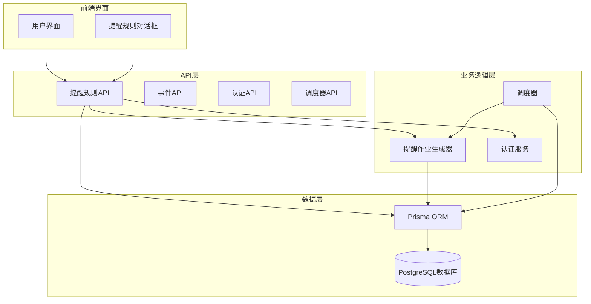
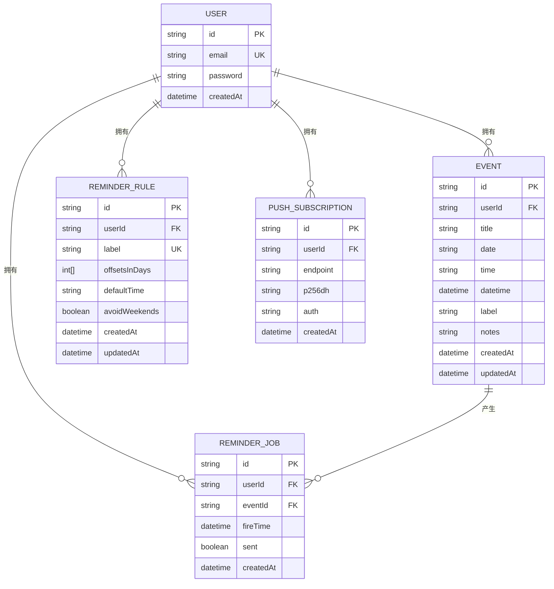
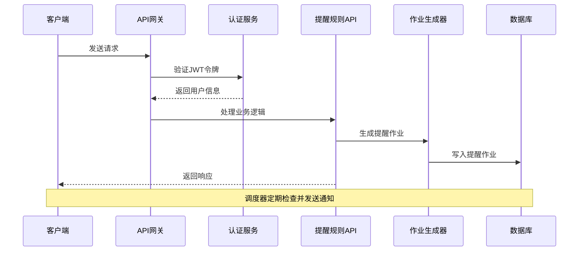
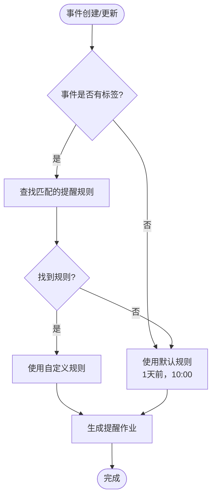
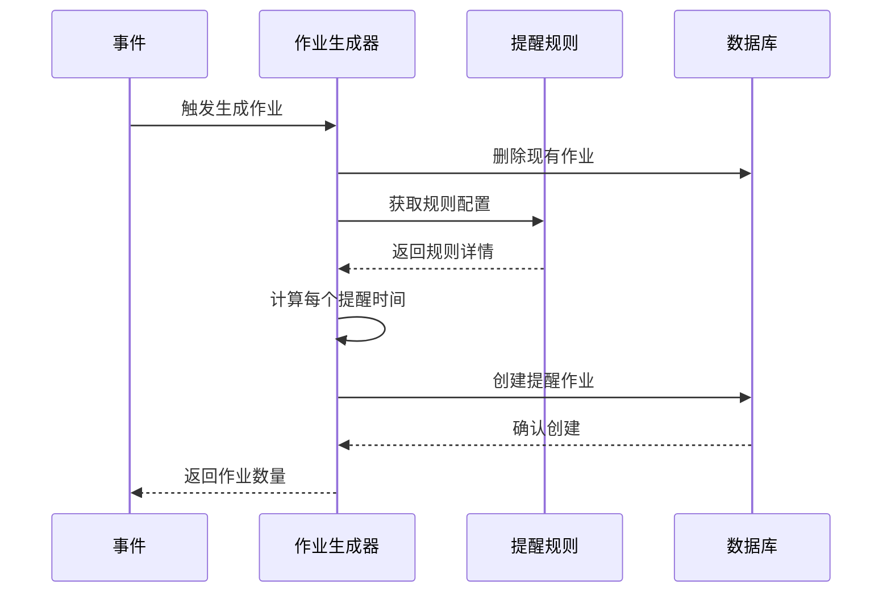
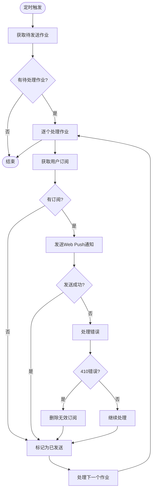
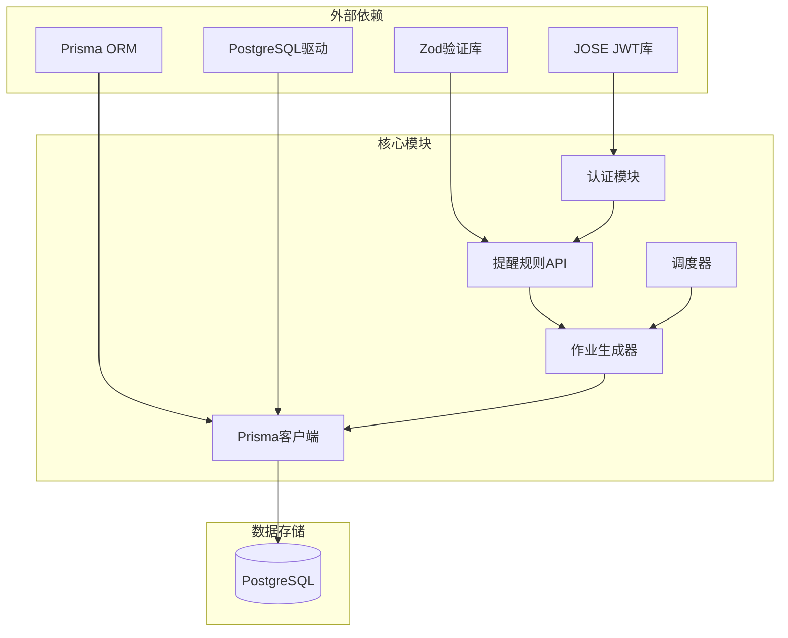

# 提醒规则API

<cite>
**本文档引用的文件**
- [app/api/reminder-rules/route.ts](file://app/api/reminder-rules/route.ts)
- [app/api/reminder-rules/[id]/route.ts](file://app/api/reminder-rules/[id]/route.ts)
- [lib/reminder-jobs.ts](file://lib/reminder-jobs.ts)
- [lib/scheduler.ts](file://lib/scheduler.ts)
- [lib/prisma.ts](file://lib/prisma.ts)
- [prisma/schema.prisma](file://prisma/schema.prisma)
- [lib/auth.ts](file://lib/auth.ts)
- [middleware.ts](file://middleware.ts)
- [docs/PRD.md](file://docs/PRD.md)
- [docs/SCHEDULER_SETUP.md](file://docs/SCHEDULER_SETUP.md)
- [components/ReminderRuleDialog.tsx](file://components/ReminderRuleDialog.tsx)
</cite>

## 目录
1. [简介](#简介)
2. [项目结构](#项目结构)
3. [核心组件](#核心组件)
4. [架构概览](#架构概览)
5. [详细组件分析](#详细组件分析)
6. [依赖关系分析](#依赖关系分析)
7. [性能考虑](#性能考虑)
8. [故障排除指南](#故障排除指南)
9. [结论](#结论)

## 简介

todo-csv-import是一个基于Next.js的提醒管理系统，专门用于管理事件到期提醒。该系统提供了完整的提醒规则API，允许用户为不同类型的事件标签配置个性化的提醒策略。系统支持Web Push通知，能够提前多次提醒用户即将到来的重要事件。

## 项目结构

系统采用模块化架构设计，主要包含以下核心模块：



**图表来源**
- [app/api/reminder-rules/route.ts](file://app/api/reminder-rules/route.ts#L1-L109)
- [lib/reminder-jobs.ts](file://lib/reminder-jobs.ts#L1-L109)
- [lib/scheduler.ts](file://lib/scheduler.ts#L1-L86)

**章节来源**
- [prisma/schema.prisma](file://prisma/schema.prisma#L1-L86)
- [middleware.ts](file://middleware.ts#L1-L50)

## 核心组件

### 数据模型

系统使用Prisma定义了四个核心数据模型：



**图表来源**
- [prisma/schema.prisma](file://prisma/schema.prisma#L16-L86)

### 认证机制

系统使用JWT令牌进行用户认证，所有API端点都需要有效的认证令牌才能访问。

**章节来源**
- [lib/auth.ts](file://lib/auth.ts#L1-L30)
- [middleware.ts](file://middleware.ts#L1-L50)

## 架构概览

系统采用分层架构，清晰分离了API层、业务逻辑层和数据持久层：



**图表来源**
- [app/api/reminder-rules/route.ts](file://app/api/reminder-rules/route.ts#L13-L39)
- [lib/reminder-jobs.ts](file://lib/reminder-jobs.ts#L15-L72)

## 详细组件分析

### 提醒规则API

#### GET /api/reminder-rules

获取当前用户的所有提醒规则。

**请求参数**
- 认证：必需
- 请求头：Cookie中包含JWT令牌

**响应格式**
```json
{
  "rules": [
    {
      "id": "string",
      "label": "string",
      "offsetsInDays": [number],
      "defaultTime": "HH:mm",
      "avoidWeekends": boolean,
      "createdAt": "datetime",
      "updatedAt": "datetime"
    }
  ]
}
```

**状态码**
- 200: 成功获取规则列表
- 401: 未授权访问
- 500: 服务器内部错误

#### POST /api/reminder-rules

创建新的提醒规则。

**请求体结构**
```json
{
  "label": "string",           // 规则标签（必填，长度>=1）
  "offsetsInDays": [number],   // 提前提醒天数数组（必填，非负整数）
  "defaultTime": "HH:mm",      // 默认提醒时间（必填，格式验证）
  "avoidWeekends": boolean     // 是否避开周末（可选，默认false）
}
```

**验证规则**
- label: 非空字符串
- offsetsInDays: 数组，每个元素为非负整数
- defaultTime: HH:mm格式的时间字符串
- avoidWeekends: 布尔值

**响应格式**
```json
{
  "rule": {
    "id": "string",
    "label": "string",
    "offsetsInDays": [number],
    "defaultTime": "HH:mm",
    "avoidWeekends": boolean,
    "createdAt": "datetime",
    "updatedAt": "datetime"
  }
}
```

**状态码**
- 201: 规则创建成功
- 400: 输入验证失败或规则已存在
- 401: 未授权访问
- 500: 服务器内部错误

#### GET /api/reminder-rules/[id]

获取特定的提醒规则。

**路径参数**
- id: 规则ID（必填）

**响应格式**
```json
{
  "rule": {
    "id": "string",
    "label": "string",
    "offsetsInDays": [number],
    "defaultTime": "HH:mm",
    "avoidWeekends": boolean,
    "createdAt": "datetime",
    "updatedAt": "datetime"
  }
}
```

**状态码**
- 200: 成功获取规则
- 404: 规则不存在
- 401: 未授权访问
- 500: 服务器内部错误

#### PUT /api/reminder-rules/[id]

更新现有的提醒规则。

**路径参数**
- id: 规则ID（必填）

**请求体结构**
```json
{
  "label": "string",           // 新标签名称（可选）
  "offsetsInDays": [number],   // 提前提醒天数数组（可选）
  "defaultTime": "HH:mm",      // 默认提醒时间（可选）
  "avoidWeekends": boolean     // 是否避开周末（可选）
}
```

**验证规则**
- label: 长度>=1（如果提供）
- offsetsInDays: 数组，每个元素为非负整数（如果提供）
- defaultTime: HH:mm格式的时间字符串（如果提供）
- avoidWeekends: 布尔值（如果提供）

**响应格式**
```json
{
  "rule": {
    "id": "string",
    "label": "string",
    "offsetsInDays": [number],
    "defaultTime": "HH:mm",
    "avoidWeekends": boolean,
    "createdAt": "datetime",
    "updatedAt": "datetime"
  }
}
```

**状态码**
- 200: 规则更新成功
- 400: 输入验证失败
- 404: 规则不存在
- 403: 权限不足
- 401: 未授权访问
- 500: 服务器内部错误

#### DELETE /api/reminder-rules/[id]

删除指定的提醒规则。

**路径参数**
- id: 规则ID（必填）

**响应格式**
```json
{
  "success": true
}
```

**状态码**
- 200: 规则删除成功
- 404: 规则不存在
- 403: 权限不足
- 401: 未授权访问
- 500: 服务器内部错误

**章节来源**
- [app/api/reminder-rules/route.ts](file://app/api/reminder-rules/route.ts#L13-L109)
- [app/api/reminder-rules/[id]/route.ts](file://app/api/reminder-rules/[id]/route.ts#L13-L158)

### 规则匹配逻辑

提醒规则与事件标签的关联机制如下：



**图表来源**
- [lib/reminder-jobs.ts](file://lib/reminder-jobs.ts#L15-L72)

**章节来源**
- [lib/reminder-jobs.ts](file://lib/reminder-jobs.ts#L15-L72)

### 作业生成机制

系统会为每个事件生成多个提醒作业，对应不同的提前提醒天数：



**图表来源**
- [lib/reminder-jobs.ts](file://lib/reminder-jobs.ts#L15-L72)

**章节来源**
- [lib/reminder-jobs.ts](file://lib/reminder-jobs.ts#L15-L72)

### 调度器运行机制

调度器负责定期检查和发送提醒通知：



**图表来源**
- [lib/scheduler.ts](file://lib/scheduler.ts#L8-L86)

**章节来源**
- [lib/scheduler.ts](file://lib/scheduler.ts#L8-L86)

## 依赖关系分析

系统各组件之间的依赖关系如下：



**图表来源**
- [app/api/reminder-rules/route.ts](file://app/api/reminder-rules/route.ts#L1-L109)
- [lib/reminder-jobs.ts](file://lib/reminder-jobs.ts#L1-L109)
- [lib/scheduler.ts](file://lib/scheduler.ts#L1-L86)

**章节来源**
- [lib/prisma.ts](file://lib/prisma.ts#L1-L20)

## 性能考虑

### 数据库优化

- 使用索引优化查询性能
- 实现连接池管理
- 采用异步操作避免阻塞

### 缓存策略

- 在生产环境中考虑添加Redis缓存
- 缓存热门规则配置
- 减少数据库查询频率

### 错误处理

- 实现重试机制
- 添加超时控制
- 记录详细的错误日志

## 故障排除指南

### 常见错误场景

1. **认证失败**
   - 检查JWT令牌是否有效
   - 验证令牌是否过期
   - 确认用户账户状态

2. **规则冲突**
   - 确保标签名称唯一性
   - 检查输入数据格式
   - 验证时间格式正确性

3. **作业生成异常**
   - 检查事件数据完整性
   - 验证规则配置有效性
   - 确认数据库连接正常

### 调试建议

- 启用详细日志记录
- 使用Postman测试API端点
- 检查数据库约束条件
- 验证Web Push订阅状态

**章节来源**
- [middleware.ts](file://middleware.ts#L22-L44)

## 结论

todo-csv-import的提醒规则API提供了一个完整、灵活的提醒管理系统。通过标签驱动的规则配置，用户可以为不同类型的重要事件设置个性化的提醒策略。系统的Web Push通知机制确保用户能够在任何情况下及时收到提醒，大大提高了工作效率和可靠性。

主要优势包括：
- 灵活的标签分类系统
- 多次提醒支持
- 自动避开周末功能
- 完整的Web Push通知支持
- 易于扩展的架构设计