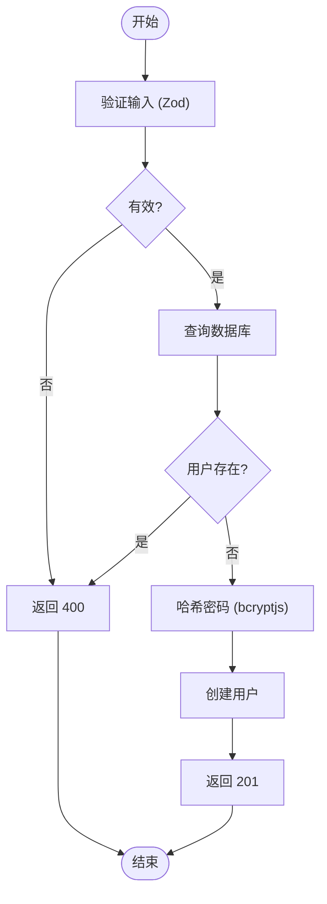
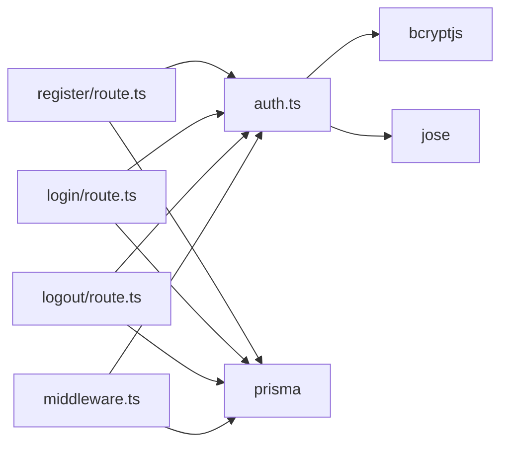

# 认证管理API

<cite>
**本文档中引用的文件**  
- [register/route.ts](file://app/api/auth/register/route.ts)
- [login/route.ts](file://app/api/auth/login/route.ts)
- [logout/route.ts](file://app/api/auth/logout/route.ts)
- [auth.ts](file://lib/auth.ts)
- [middleware.ts](file://middleware.ts)
- [schema.prisma](file://prisma/schema.prisma)
- [register/page.tsx](file://app/register/page.tsx)
- [login/page.tsx](file://app/login/page.tsx)
</cite>

## 目录
1. [简介](#简介)
2. [项目结构](#项目结构)
3. [核心组件](#核心组件)
4. [架构概述](#架构概述)
5. [详细组件分析](#详细组件分析)
6. [依赖分析](#依赖分析)
7. [性能考虑](#性能考虑)
8. [故障排除指南](#故障排除指南)
9. [结论](#结论)

## 简介
本项目 `todo-csv-import` 是一个基于 Next.js 的待办事项管理系统，支持通过 CSV 文件导入事件，并具备完整的用户认证机制。认证管理 API 提供了用户注册、登录和登出功能，采用 JWT Token 进行身份验证，Token 通过 HTTP Only Cookie 存储以增强安全性。系统使用 bcryptjs 对密码进行哈希加密，通过 Prisma 操作 PostgreSQL 数据库，并在中间件中实现全局认证拦截。本文档详细说明了认证流程、接口定义、安全策略及前后端交互机制。

## 项目结构

```mermaid
graph TD
subgraph "API Routes"
A[/api/auth/register]
B[/api/auth/login]
C[/api/auth/logout]
D[/api/events]
end
subgraph "Frontend Pages"
E[注册页面]
F[登录页面]
G[日历页面]
end
subgraph "Libraries"
H[auth.ts]
I[prisma.ts]
J[middleware.ts]
end
A --> H
B --> H
C --> H
D --> H
E --> A
F --> B
H --> I
J --> H
```

**Diagram sources**  
- [register/route.ts](file://app/api/auth/register/route.ts)
- [login/route.ts](file://app/api/auth/login/route.ts)
- [logout/route.ts](file://app/api/auth/logout/route.ts)
- [auth.ts](file://lib/auth.ts)
- [middleware.ts](file://middleware.ts)

**Section sources**  
- [app/api/auth/](file://app/api/auth/)
- [lib/auth.ts](file://lib/auth.ts)
- [middleware.ts](file://middleware.ts)

## 核心组件

认证管理模块由多个核心组件构成：  
- **注册接口**：处理用户注册请求，验证邮箱唯一性并安全存储密码  
- **登录接口**：验证用户凭证，生成 JWT Token 并通过 Cookie 返回  
- **登出接口**：清除客户端 Token Cookie  
- **认证中间件**：全局拦截受保护路由，验证 Token 有效性  
- **JWT 工具函数**：封装 Token 的生成与验证逻辑  
- **密码哈希工具**：使用 bcryptjs 对密码进行加密存储  

这些组件协同工作，确保系统的安全性和用户体验。

**Section sources**  
- [auth.ts](file://lib/auth.ts)
- [middleware.ts](file://middleware.ts)
- [route.ts](file://app/api/auth/*/route.ts)

## 架构概述

```mermaid
sequenceDiagram
participant 前端 as 前端 (React)
participant API as 认证API
participant 工具 as 认证工具 (auth.ts)
participant 数据库 as 数据库 (Prisma)
前端->>API : POST /api/auth/register<br/>{email, password}
API->>工具 : hashPassword(password)
API->>数据库 : 创建用户 (email, hashedPassword)
API-->>前端 : 201 Created
前端->>API : POST /api/auth/login<br/>{email, password}
API->>数据库 : 查询用户
API->>工具 : verifyPassword()
API->>工具 : signToken(payload)
API-->>前端 : 200 OK + Set-Cookie : token
前端->>API : POST /api/auth/logout
API-->>前端 : 200 OK + Set-Cookie : token=""; maxAge=0
前端->>API : 请求 /api/events
API->>工具 : verifyToken(cookie.token)
工具-->>API : payload 或 null
alt Token 有效
API-->>前端 : 200 OK + 数据
else Token 无效
API-->>前端 : 401 Unauthorized
end
```

**Diagram sources**  
- [register/route.ts](file://app/api/auth/register/route.ts)
- [login/route.ts](file://app/api/auth/login/route.ts)
- [logout/route.ts](file://app/api/auth/logout/route.ts)
- [auth.ts](file://lib/auth.ts)
- [middleware.ts](file://middleware.ts)

## 详细组件分析

### 用户注册分析

#### 接口定义
- **路径**: `POST /api/auth/register`
- **请求体**: `{ email: string, password: string }`
- **响应**: `201 Created` + `{ user: { id, email, createdAt } }`
- **错误**: `400 Bad Request`（输入无效或用户已存在）

#### 验证逻辑
使用 Zod 进行请求体验证：
- `email` 必须为有效邮箱格式
- `password` 长度至少为 6 位

#### 数据库操作
通过 Prisma 检查邮箱唯一性，若不存在则创建新用户，密码经 `hashPassword` 加密后存储。



**Diagram sources**  
- [register/route.ts](file://app/api/auth/register/route.ts)
- [auth.ts](file://lib/auth.ts)
- [schema.prisma](file://prisma/schema.prisma)

**Section sources**  
- [register/route.ts](file://app/api/auth/register/route.ts)
- [register/page.tsx](file://app/register/page.tsx)

### 用户登录分析

#### 接口定义
- **路径**: `POST /api/auth/login`
- **请求体**: `{ email: string, password: string }`
- **响应**: `200 OK` + `{ success: true, user: { id, email } }` + `Set-Cookie: token=xxx`
- **错误**: `401 Unauthorized`（凭证无效）

#### 认证流程
1. 验证输入
2. 查询用户
3. 比对密码（`verifyPassword`）
4. 生成 JWT Token（`signToken`）
5. 设置 HTTP Only Cookie

#### Token 配置
- **算法**: HS256
- **过期时间**: 24 小时
- **Cookie 属性**: `httpOnly`, `secure`（生产环境）, `sameSite=lax`

```mermaid
classDiagram
class signToken {
+payload : any
+header : { alg : 'HS256' }
+issuedAt : now()
+expirationTime : '24h'
+sign(SECRET_KEY)
}
class verifyToken {
+token : string
+jwtVerify(token, SECRET_KEY)
+return payload | null
}
class hashPassword {
+password : string
+saltRounds : 10
+hash(password, saltRounds)
}
class verifyPassword {
+plain : string
+hashed : string
+compare(plain, hashed)
}
```

**Diagram sources**  
- [login/route.ts](file://app/api/auth/login/route.ts)
- [auth.ts](file://lib/auth.ts)

**Section sources**  
- [login/route.ts](file://app/api/auth/login/route.ts)
- [login/page.tsx](file://app/login/page.tsx)

### 用户登出分析

#### 接口定义
- **路径**: `POST /api/auth/logout`
- **响应**: `200 OK` + `Set-Cookie: token=""; maxAge=0`

#### 实现机制
通过设置 Cookie 的 `maxAge=0` 来立即清除 Token，确保客户端不再携带有效凭证。

**Section sources**  
- [logout/route.ts](file://app/api/auth/logout/route.ts)

### 中间件认证分析

#### 路由匹配
```ts
matcher: ['/calendar/:path*', '/api/events/:path*']
```

#### 认证逻辑
- 公共路径（`/login`, `/register`, `/api/auth`）直接放行
- 受保护路径检查 `token` Cookie
- 若存在 Token，则调用 `verifyToken` 验证其有效性
- 无效 Token 时重定向至登录页并清除 Cookie

**Section sources**  
- [middleware.ts](file://middleware.ts)

## 依赖分析



**Diagram sources**  
- [auth.ts](file://lib/auth.ts)
- [prisma.ts](file://lib/prisma.ts)
- [package.json](file://package.json)

**Section sources**  
- [lib/auth.ts](file://lib/auth.ts)
- [lib/prisma.ts](file://lib/prisma.ts)

## 性能考虑
- **密码哈希**：使用 bcryptjs 的 10 轮盐值，在安全与性能间取得平衡
- **Token 验证**：在中间件中进行，避免每次 API 调用重复验证
- **数据库连接**：Prisma 客户端使用连接池，提升并发性能
- **边缘兼容**：`jose` 库支持边缘运行时，适合 Next.js 中间件

## 故障排除指南

### 常见问题
- **登录失败但无错误提示**：检查前端是否正确处理 `401` 响应
- **Cookie 未设置**：确认 `NODE_ENV=production` 时 `secure=true`
- **Token 过期后未重定向**：检查中间件的 `verifyToken` 是否抛出异常
- **注册时邮箱重复**：确保数据库 `User.email` 字段有唯一约束

### 安全建议
- **密码强度**：前端已限制密码至少 6 位，可考虑增加复杂度要求
- **邮箱唯一性**：数据库层面通过 `@unique` 约束保证
- **暴力破解防护**：当前无限流机制，建议在生产环境添加基于 IP 的请求频率限制
- **JWT 密钥**：使用环境变量 `JWT_SECRET`，避免硬编码

**Section sources**  
- [auth.ts](file://lib/auth.ts)
- [middleware.ts](file://middleware.ts)
- [schema.prisma](file://prisma/schema.prisma)

## 结论
todo-csv-import 项目的认证系统设计合理，实现了完整的注册、登录、登出流程，采用 JWT + HTTP Only Cookie 的安全方案，并通过中间件实现全局保护。密码加密、Token 管理、数据库约束等环节均符合现代 Web 应用的安全实践。建议未来增加登录限流、多因素认证等高级安全功能以进一步提升系统安全性。