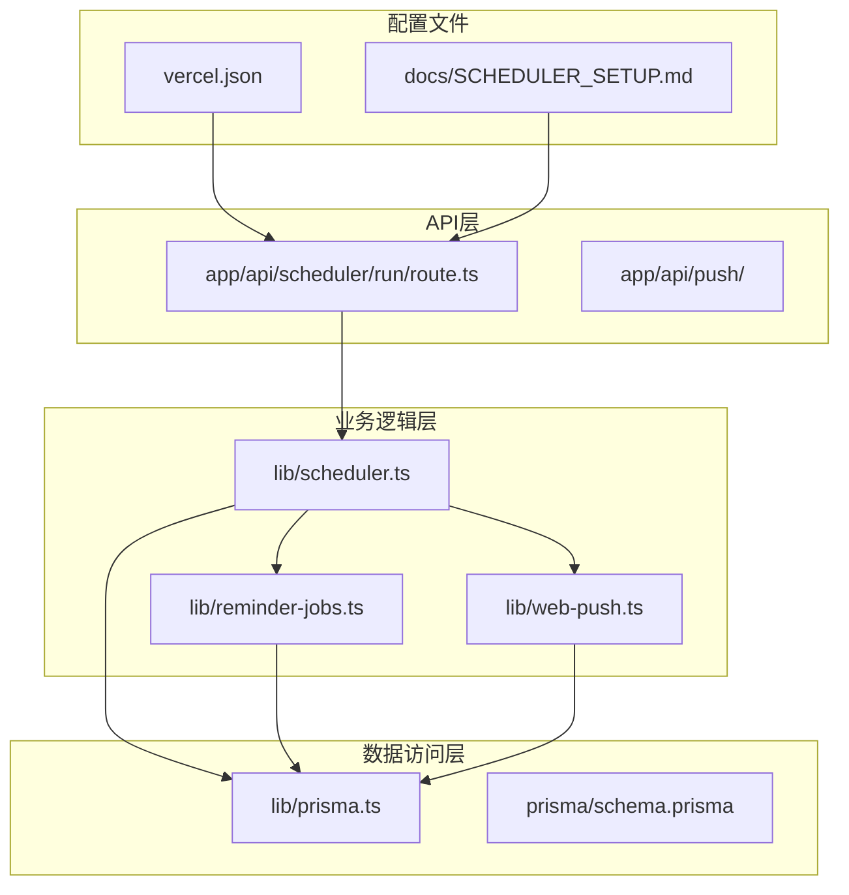
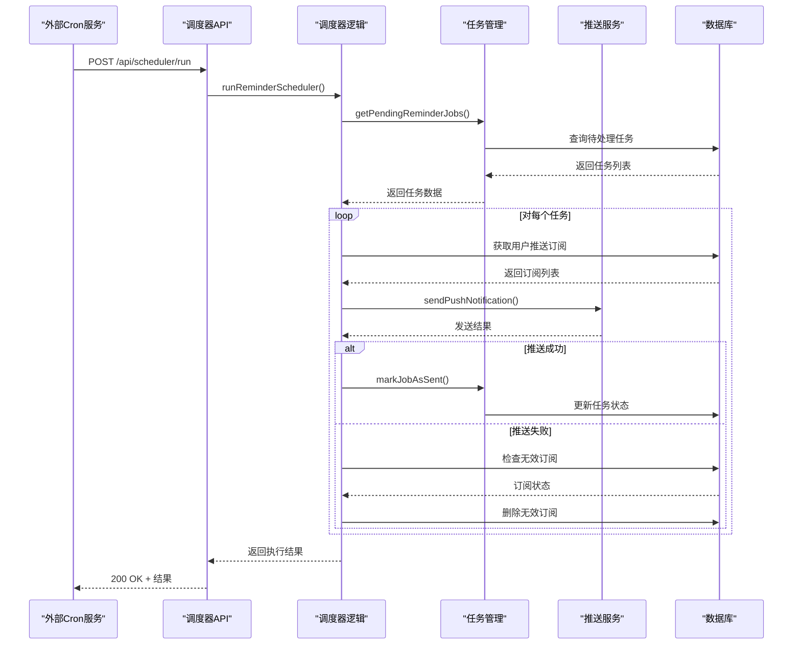
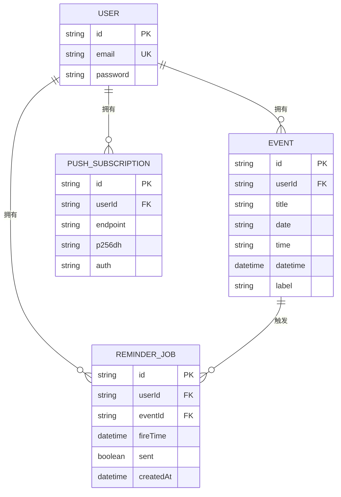
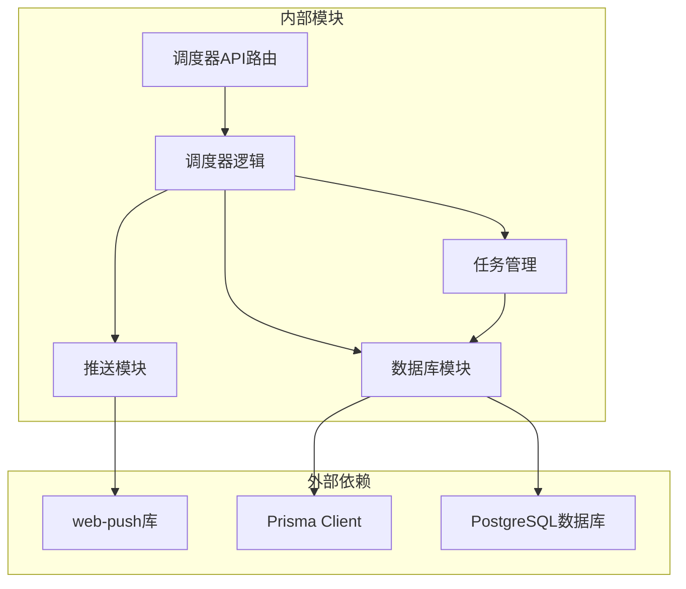

# 调度器触发API

<cite>
**本文档引用的文件**
- [app/api/scheduler/run/route.ts](file://app/api/scheduler/run/route.ts)
- [lib/scheduler.ts](file://lib/scheduler.ts)
- [lib/reminder-jobs.ts](file://lib/reminder-jobs.ts)
- [lib/web-push.ts](file://lib/web-push.ts)
- [lib/prisma.ts](file://lib/prisma.ts)
- [prisma/schema.prisma](file://prisma/schema.prisma)
- [docs/SCHEDULER_SETUP.md](file://docs/SCHEDULER_SETUP.md)
- [vercel.json](file://vercel.json)
- [package.json](file://package.json)
</cite>

## 目录
1. [简介](#简介)
2. [项目结构](#项目结构)
3. [核心组件](#核心组件)
4. [架构概览](#架构概览)
5. [详细组件分析](#详细组件分析)
6. [依赖关系分析](#依赖关系分析)
7. [性能考虑](#性能考虑)
8. [故障排除指南](#故障排除指南)
9. [结论](#结论)

## 简介

本文档详细说明了todo-csv-import项目的调度器触发API，这是一个用于自动化任务执行的REST接口。该系统通过定时调度机制实现每日提醒检查功能，为外部Cron Job（如Vercel Cron）提供调用目标。

该API的核心功能包括：
- 触发提醒调度器执行
- 查询即将到期的事件
- 根据提醒规则生成ReminderJob
- 调用web-push发送通知
- 更新任务状态
- 支持幂等性设计，防止重复通知

## 项目结构

调度器相关的核心文件组织如下：

**图表来源**
- [app/api/scheduler/run/route.ts](file://app/api/scheduler/run/route.ts#L1-L37)
- [lib/scheduler.ts](file://lib/scheduler.ts#L1-L86)
- [lib/reminder-jobs.ts](file://lib/reminder-jobs.ts#L1-L109)
- [lib/web-push.ts](file://lib/web-push.ts#L1-L54)

**章节来源**
- [app/api/scheduler/run/route.ts](file://app/api/scheduler/run/route.ts#L1-L37)
- [lib/scheduler.ts](file://lib/scheduler.ts#L1-L86)
- [vercel.json](file://vercel.json#L1-L8)

## 核心组件

### 调度器API端点

调度器API提供两个主要端点：
- **GET /api/scheduler/run** - 检查调度器状态
- **POST /api/scheduler/run** - 手动触发调度器执行

### 主调度逻辑

调度器的核心流程包括：
1. 获取所有待处理的提醒任务
2. 遍历每个任务并发送通知
3. 处理无效的推送订阅
4. 标记任务为已发送状态

### 任务管理系统

系统使用ReminderJob模型管理提醒任务，包含以下关键字段：
- `fireTime`: 任务触发时间
- `sent`: 发送状态标志
- `userId`: 用户标识
- `eventId`: 事件标识

**章节来源**
- [lib/scheduler.ts](file://lib/scheduler.ts#L8-L85)
- [lib/reminder-jobs.ts](file://lib/reminder-jobs.ts#L64-L108)
- [prisma/schema.prisma](file://prisma/schema.prisma#L62-L74)

## 架构概览

调度器系统的整体架构采用分层设计：

**图表来源**
- [app/api/scheduler/run/route.ts](file://app/api/scheduler/run/route.ts#L8-L26)
- [lib/scheduler.ts](file://lib/scheduler.ts#L13-L77)
- [lib/reminder-jobs.ts](file://lib/reminder-jobs.ts#L103-L108)

## 详细组件分析

### 调度器API端点实现

#### POST /api/scheduler/run

该端点作为外部Cron Job的主要调用目标，具有以下特性：

**安全设计**：
- 当前实现允许匿名访问（无需身份验证）
- 建议通过Secret Token进行安全防护
- 可选的认证机制已在文档中提供实现方案

**响应格式**：
- 成功时返回 `{ success: true, processed: number }`
- 失败时返回 `{ success: false, error: string }`

#### GET /api/scheduler/run

提供健康检查功能：
- 返回调度器可用状态
- 提供简要说明信息

**章节来源**
- [app/api/scheduler/run/route.ts](file://app/api/scheduler/run/route.ts#L8-L36)

### 主调度逻辑实现

#### runReminderScheduler函数

该函数是调度器的核心执行逻辑：

**执行流程**：
1. 获取所有未发送且到达触发时间的任务
2. 对每个任务：
   - 获取用户的推送订阅
   - 准备通知载荷
   - 向所有订阅发送通知
   - 处理无效订阅（410状态码）
   - 标记任务为已发送

**错误处理**：
- 捕获并记录单个任务处理异常
- 继续处理其他任务
- 整体执行异常向上抛出

**章节来源**
- [lib/scheduler.ts](file://lib/scheduler.ts#L8-L85)

### 任务管理系统

#### ReminderJob模型

ReminderJob表管理提醒任务的状态：

**图表来源**
- [prisma/schema.prisma](file://prisma/schema.prisma#L62-L85)

#### 任务生成与管理

**generateReminderJobs函数**：
- 删除现有任务（避免重复）
- 基于提醒规则生成新任务
- 支持自定义偏移时间和周末避让

**getPendingReminderJobs函数**：
- 查询未发送且到达触发时间的任务
- 包含事件和用户信息
- 按触发时间升序排列

**markJobAsSent函数**：
- 将任务标记为已发送
- 更新数据库状态

**章节来源**
- [lib/reminder-jobs.ts](file://lib/reminder-jobs.ts#L15-L108)

### 推送通知系统

#### web-push集成

系统使用web-push库实现推送通知：

**VAPID配置**：
- 使用环境变量配置公钥、私钥和主题
- 在运行时初始化VAPID详情
- 提供公钥获取接口

**通知发送**：
- 支持批量发送到多个订阅
- 自动处理无效订阅（410状态码）
- 返回发送结果和错误信息

**章节来源**
- [lib/web-push.ts](file://lib/web-push.ts#L1-L54)

### 数据库连接管理

#### Prisma客户端配置

系统使用Prisma作为ORM工具：

**连接池配置**：
- 基于PostgreSQL连接字符串
- 使用PrismaPg适配器
- 支持全局实例缓存

**模型关系**：
- 用户与事件的一对多关系
- 用户与提醒规则的一对多关系
- 用户与推送订阅的一对多关系
- 事件与提醒任务的级联删除

**章节来源**
- [lib/prisma.ts](file://lib/prisma.ts#L1-L20)
- [prisma/schema.prisma](file://prisma/schema.prisma#L16-L85)

## 依赖关系分析

调度器系统的依赖关系如下：

**图表来源**
- [package.json](file://package.json#L35-L35)
- [lib/scheduler.ts](file://lib/scheduler.ts#L1-L3)
- [lib/reminder-jobs.ts](file://lib/reminder-jobs.ts#L1-L1)
- [lib/web-push.ts](file://lib/web-push.ts#L1-L1)
- [lib/prisma.ts](file://lib/prisma.ts#L1-L3)

**章节来源**
- [package.json](file://package.json#L11-L36)
- [lib/scheduler.ts](file://lib/scheduler.ts#L1-L3)

## 性能考虑

### 并发处理

调度器采用串行处理模式，确保：
- 避免数据库连接竞争
- 简化错误处理逻辑
- 保持任务状态一致性

### 批量操作优化

**数据库查询优化**：
- 使用索引 `[userId, sent, fireTime]` 提高查询性能
- 批量删除过期任务
- 分页处理大量任务

**网络请求优化**：
- 并行发送多个订阅通知
- 异步处理避免阻塞

### 内存管理

系统设计避免内存泄漏：
- 及时清理数据库连接
- 控制日志输出频率
- 合理的错误处理策略

## 故障排除指南

### 常见问题及解决方案

#### 推送服务不可用

**症状**：
- 通知发送失败
- 错误日志显示网络连接问题

**解决方案**：
- 检查VAPID密钥配置
- 验证推送服务可用性
- 实施重试机制

#### 数据库连接问题

**症状**：
- 查询超时
- 连接池耗尽

**解决方案**：
- 检查数据库连接字符串
- 调整连接池大小
- 优化查询性能

#### 任务重复执行

**症状**：
- 同一任务被多次发送
- 数据库状态不一致

**解决方案**：
- 实施幂等性设计
- 使用分布式锁
- 增加任务去重机制

### 调试技巧

**启用详细日志**：
- 查看调度器执行日志
- 监控数据库查询性能
- 跟踪推送通知状态

**监控指标**：
- 任务处理成功率
- 平均处理时间
- 错误率统计

**章节来源**
- [lib/scheduler.ts](file://lib/scheduler.ts#L56-L68)
- [lib/web-push.ts](file://lib/web-push.ts#L42-L45)

## 结论

调度器触发API为todo-csv-import项目提供了可靠的自动化提醒功能。通过合理的架构设计和错误处理机制，系统能够稳定地处理定时任务并发送推送通知。

### 关键优势

1. **简单易用**：API设计简洁，易于集成各种Cron服务
2. **可扩展性**：模块化设计支持功能扩展
3. **可靠性**：完善的错误处理和重试机制
4. **安全性**：支持Secret Token认证，防止滥用

### 最佳实践建议

1. **生产环境部署**：
   - 配置VAPID密钥
   - 设置Secret Token
   - 监控系统性能指标

2. **运维管理**：
   - 定期检查数据库连接
   - 监控推送服务状态
   - 实施备份策略

3. **性能优化**：
   - 调整调度频率
   - 优化数据库查询
   - 实施缓存机制

该系统为构建可靠的自动化提醒功能提供了完整的技术解决方案，适合在各种部署环境中使用。