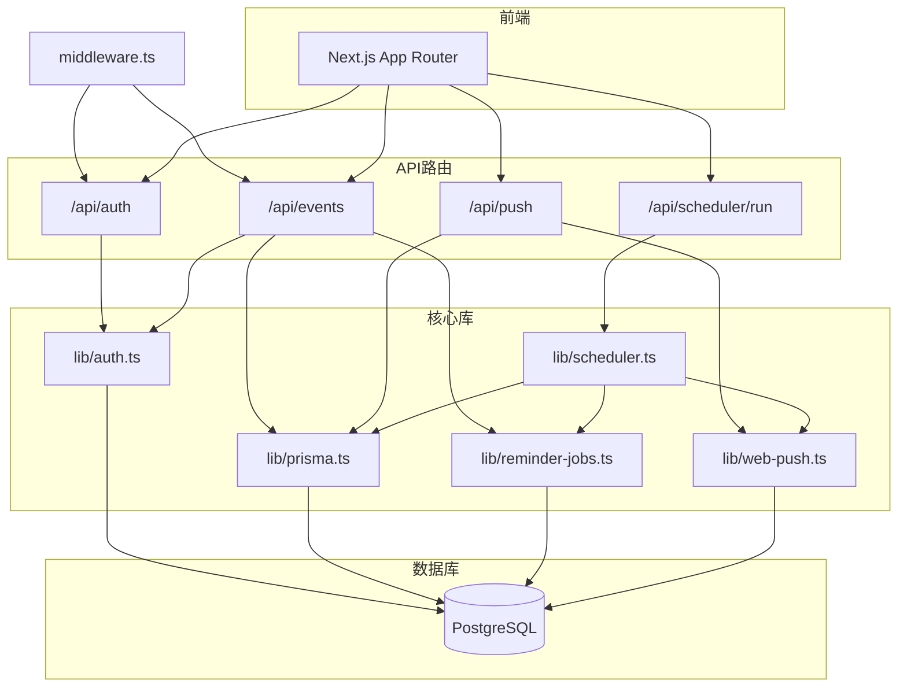
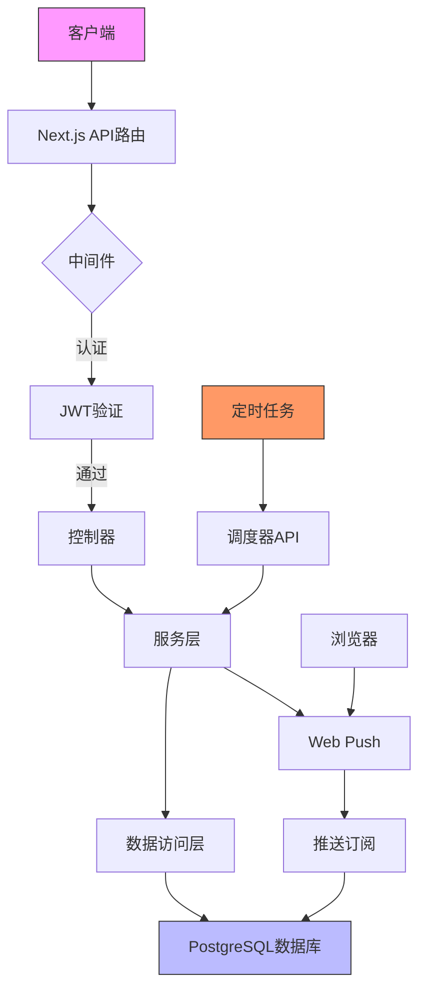
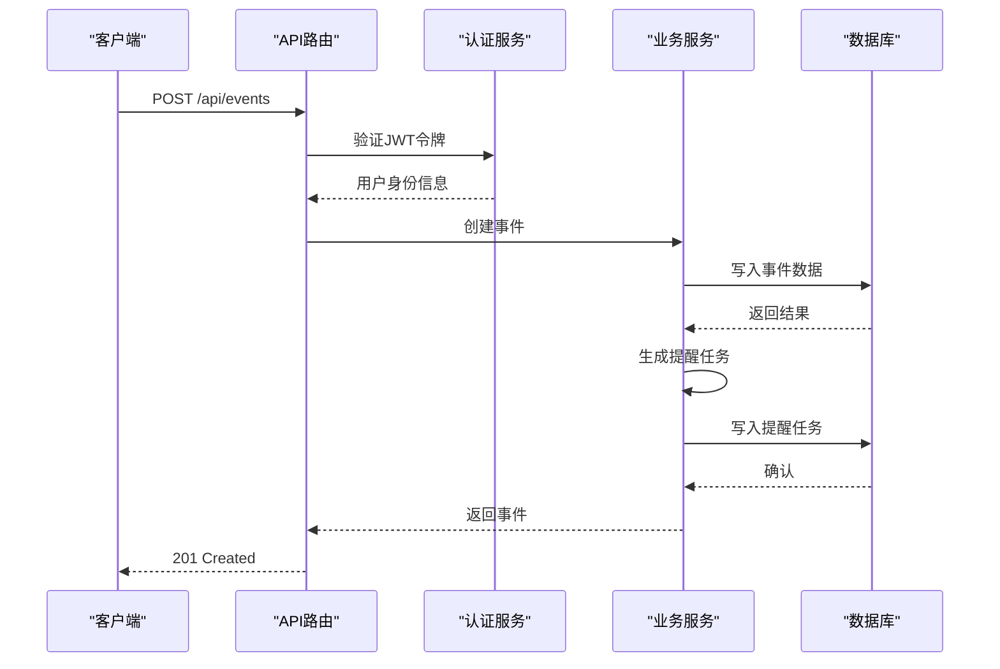
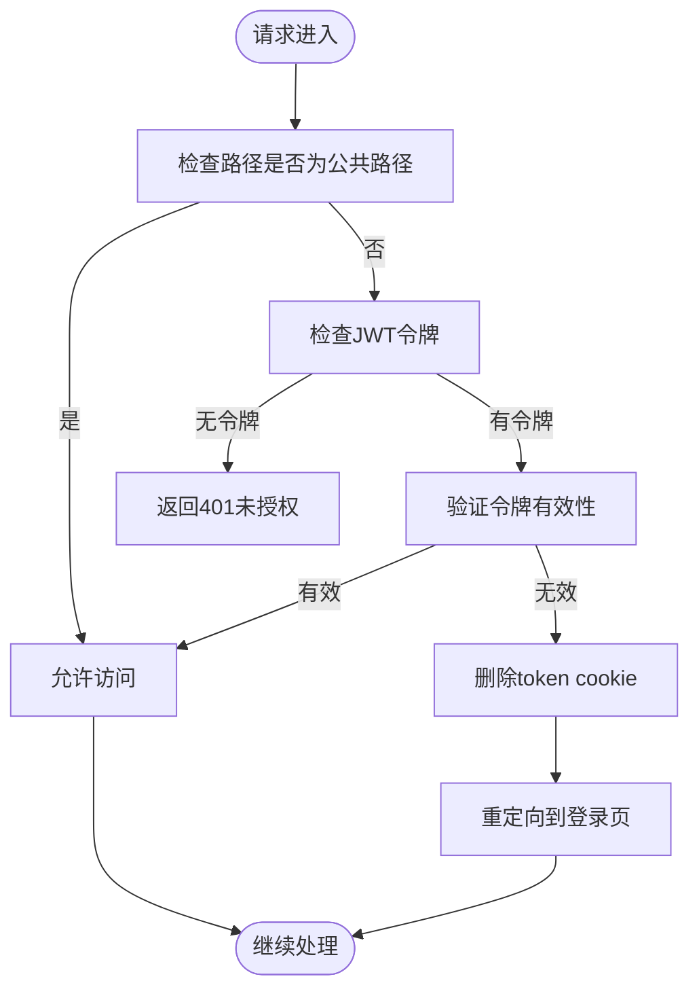
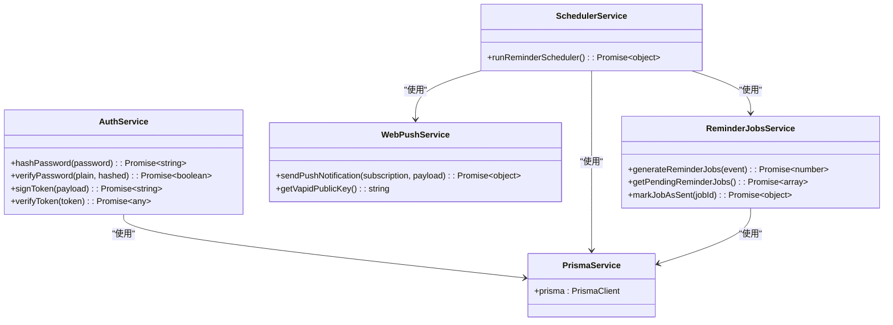
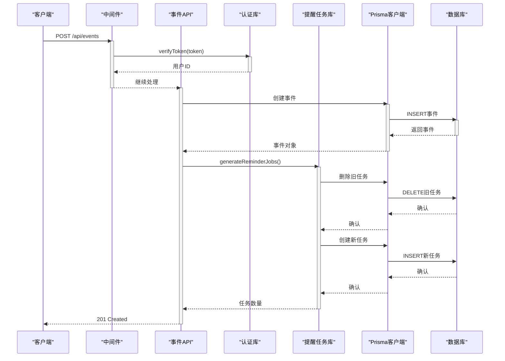
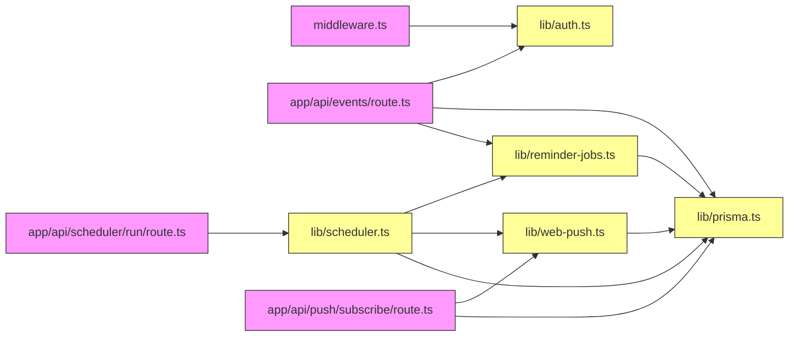

# 后端架构

<cite>
**本文档引用的文件**  
- [middleware.ts](file://middleware.ts#L1-L50)
- [lib/auth.ts](file://lib/auth.ts#L1-L30)
- [lib/prisma.ts](file://lib/prisma.ts#L1-L20)
- [lib/scheduler.ts](file://lib/scheduler.ts#L1-L86)
- [lib/web-push.ts](file://lib/web-push.ts#L1-L54)
- [lib/reminder-jobs.ts](file://lib/reminder-jobs.ts#L1-L109)
- [app/api/events/route.ts](file://app/api/events/route.ts#L1-L200)
- [app/api/events/[id]/route.ts](file://app/api/events/[id]/route.ts#L1-L119)
- [app/api/scheduler/run/route.ts](file://app/api/scheduler/run/route.ts#L1-L37)
- [app/api/push/subscribe/route.ts](file://app/api/push/subscribe/route.ts#L1-L96)
- [prisma/schema.prisma](file://prisma/schema.prisma#L1-L86)
- [package.json](file://package.json#L1-L62)
</cite>

## 目录
1. [简介](#简介)
2. [项目结构](#项目结构)
3. [核心组件](#核心组件)
4. [架构概览](#架构概览)
5. [详细组件分析](#详细组件分析)
6. [依赖分析](#依赖分析)
7. [性能考虑](#性能考虑)
8. [故障排除指南](#故障排除指南)
9. [结论](#结论)

## 简介
本项目是一个基于Next.js的待办事项系统，支持CSV导入功能，并集成了事件提醒、用户认证和Web推送通知。后端架构采用分层设计，通过Next.js API路由实现RESTful接口，结合Prisma操作PostgreSQL数据库，实现了无状态服务以支持水平扩展。系统通过JWT进行身份验证，使用中间件统一处理认证逻辑，并通过定时任务调度器发送提醒通知。

## 项目结构



**图示来源**  
- [middleware.ts](file://middleware.ts#L1-L50)
- [lib/auth.ts](file://lib/auth.ts#L1-L30)
- [lib/prisma.ts](file://lib/prisma.ts#L1-L20)
- [lib/scheduler.ts](file://lib/scheduler.ts#L1-L86)
- [lib/web-push.ts](file://lib/web-push.ts#L1-L54)

**本节来源**  
- [middleware.ts](file://middleware.ts#L1-L50)
- [lib/auth.ts](file://lib/auth.ts#L1-L30)
- [lib/prisma.ts](file://lib/prisma.ts#L1-L20)

## 核心组件

系统核心组件包括：基于Next.js的API路由作为控制器层，`lib`目录下的服务模块（auth、prisma、scheduler、web-push）构成服务层，Prisma Client作为数据访问层与PostgreSQL数据库交互。中间件统一处理JWT认证验证，确保API安全性。调度器通过定时任务触发提醒发送，Web Push模块实现浏览器推送通知。

**本节来源**  
- [lib/auth.ts](file://lib/auth.ts#L1-L30)
- [lib/prisma.ts](file://lib/prisma.ts#L1-L20)
- [lib/scheduler.ts](file://lib/scheduler.ts#L1-L86)
- [lib/web-push.ts](file://lib/web-push.ts#L1-L54)

## 架构概览



**图示来源**  
- [middleware.ts](file://middleware.ts#L1-L50)
- [app/api/events/route.ts](file://app/api/events/route.ts#L1-L200)
- [lib/scheduler.ts](file://lib/scheduler.ts#L1-L86)
- [lib/web-push.ts](file://lib/web-push.ts#L1-L54)

## 详细组件分析

### API路由设计

Next.js API路由作为控制器层，遵循RESTful设计原则，每个路由文件对应特定资源操作。通过`GET`、`POST`、`PUT`、`DELETE`方法实现资源的查询、创建、更新和删除。路由统一进行JWT验证，确保只有认证用户才能访问受保护资源。



**图示来源**  
- [app/api/events/route.ts](file://app/api/events/route.ts#L1-L200)
- [lib/auth.ts](file://lib/auth.ts#L1-L30)
- [lib/reminder-jobs.ts](file://lib/reminder-jobs.ts#L1-L109)

**本节来源**  
- [app/api/events/route.ts](file://app/api/events/route.ts#L1-L200)
- [app/api/events/[id]/route.ts](file://app/api/events/[id]/route.ts#L1-L119)

### 中间件与JWT认证

`middleware.ts`实现请求拦截与JWT认证验证。中间件配置匹配器，对`/calendar`和`/api/events`路径进行保护。对于公共路径（如登录、注册），允许直接访问；对于受保护路径，检查请求中的JWT令牌。若令牌存在，则验证其有效性；若无效，则清除cookie并重定向到登录页。



**图示来源**  
- [middleware.ts](file://middleware.ts#L1-L50)
- [lib/auth.ts](file://lib/auth.ts#L1-L30)

**本节来源**  
- [middleware.ts](file://middleware.ts#L1-L50)
- [lib/auth.ts](file://lib/auth.ts#L1-L30)

### 核心服务模块

#### 认证服务 (auth)
`lib/auth.ts`提供密码哈希、JWT签发与验证功能。使用`bcryptjs`对密码进行安全哈希，通过`jose`库实现JWT的签发和验证。`signToken`函数生成包含用户信息的JWT令牌，`verifyToken`函数验证令牌有效性并返回用户载荷。

#### 数据库服务 (prisma)
`lib/prisma.ts`封装Prisma客户端实例，使用连接池优化数据库连接。通过全局变量缓存Prisma实例，避免在开发环境中重复创建实例。配置PostgreSQL适配器，确保数据库操作的高效性。

#### 调度器服务 (scheduler)
`lib/scheduler.ts`实现提醒任务调度器。`runReminderScheduler`函数查询待发送的提醒任务，获取用户推送订阅，发送Web Push通知，并更新任务状态。自动清理无效的推送订阅（HTTP 410响应）。

#### Web Push服务 (web-push)
`lib/web-push.ts`封装Web Push功能。初始化VAPID密钥，配置推送服务。`sendPushNotification`函数向指定订阅发送通知，`getVapidPublicKey`函数提供公钥供客户端订阅使用。



**图示来源**  
- [lib/auth.ts](file://lib/auth.ts#L1-L30)
- [lib/prisma.ts](file://lib/prisma.ts#L1-L20)
- [lib/scheduler.ts](file://lib/scheduler.ts#L1-L86)
- [lib/web-push.ts](file://lib/web-push.ts#L1-L54)
- [lib/reminder-jobs.ts](file://lib/reminder-jobs.ts#L1-L109)

**本节来源**  
- [lib/auth.ts](file://lib/auth.ts#L1-L30)
- [lib/prisma.ts](file://lib/prisma.ts#L1-L20)
- [lib/scheduler.ts](file://lib/scheduler.ts#L1-L86)
- [lib/web-push.ts](file://lib/web-push.ts#L1-L54)
- [lib/reminder-jobs.ts](file://lib/reminder-jobs.ts#L1-L109)

### 分层架构模式

系统采用典型的分层架构：API路由作为控制器层，处理HTTP请求和响应；`lib`目录下的服务模块构成服务层，实现业务逻辑；Prisma Client作为数据访问层，操作PostgreSQL数据库。这种分层设计实现了关注点分离，提高了代码可维护性和可测试性。

```mermaid
graph TD
A[API路由 - 控制器层] --> B[服务层]
B --> C[数据访问层]
C --> D[PostgreSQL数据库]
style A fill:#ffcccc,stroke:#333
style B fill:#ccffcc,stroke:#333
style C fill:#ccccff,stroke:#333
style D fill:#ffffcc,stroke:#333
subgraph "职责"
A: "请求处理、响应格式化"
B: "业务逻辑、服务协调"
C: "数据库操作、数据映射"
D: "数据持久化"
end
```

**图示来源**  
- [app/api/events/route.ts](file://app/api/events/route.ts#L1-L200)
- [lib/scheduler.ts](file://lib/scheduler.ts#L1-L86)
- [lib/prisma.ts](file://lib/prisma.ts#L1-L20)

**本节来源**  
- [app/api/events/route.ts](file://app/api/events/route.ts#L1-L200)
- [lib/scheduler.ts](file://lib/scheduler.ts#L1-L86)
- [lib/prisma.ts](file://lib/prisma.ts#L1-L20)

### 无状态服务与水平扩展

系统设计为无状态服务，所有用户状态信息存储在JWT令牌中，服务器不保存会话状态。数据库连接通过连接池管理，Prisma实例在开发环境中缓存以避免重复创建。这种设计使得服务可以轻松水平扩展，通过增加实例数量来提高系统吞吐量。Vercel配置文件中的cron作业确保调度器定期运行，实现分布式环境下的定时任务处理。

**本节来源**  
- [lib/prisma.ts](file://lib/prisma.ts#L1-L20)
- [vercel.json](file://vercel.json#L1-L8)
- [middleware.ts](file://middleware.ts#L1-L50)

### 错误处理与日志记录

系统实现统一的错误处理策略，在每个API路由中使用try-catch捕获异常，返回标准化的错误响应。关键操作添加详细的日志记录，使用`console.error`输出错误信息，便于问题排查。调度器和推送服务特别处理HTTP 410等特定错误，自动清理无效订阅。

**本节来源**  
- [app/api/events/route.ts](file://app/api/events/route.ts#L1-L200)
- [lib/scheduler.ts](file://lib/scheduler.ts#L1-L86)
- [app/api/push/subscribe/route.ts](file://app/api/push/subscribe/route.ts#L1-L96)

### API版本控制扩展

当前系统未实现API版本控制，但可通过以下方式扩展：在API路径中添加版本号（如`/api/v1/events`），或通过请求头指定API版本。服务层保持向后兼容，逐步迁移旧版本接口。使用Zod进行请求数据验证，确保不同版本间的数据格式兼容性。

**本节来源**  
- [app/api/events/route.ts](file://app/api/events/route.ts#L1-L200)
- [lib/reminder-jobs.ts](file://lib/reminder-jobs.ts#L1-L109)

### 典型请求数据流



**图示来源**  
- [app/api/events/route.ts](file://app/api/events/route.ts#L1-L200)
- [lib/reminder-jobs.ts](file://lib/reminder-jobs.ts#L1-L109)
- [lib/prisma.ts](file://lib/prisma.ts#L1-L20)

## 依赖分析



**图示来源**  
- [middleware.ts](file://middleware.ts#L1-L50)
- [app/api/events/route.ts](file://app/api/events/route.ts#L1-L200)
- [app/api/scheduler/run/route.ts](file://app/api/scheduler/run/route.ts#L1-L37)
- [app/api/push/subscribe/route.ts](file://app/api/push/subscribe/route.ts#L1-L96)
- [lib/scheduler.ts](file://lib/scheduler.ts#L1-L86)
- [lib/reminder-jobs.ts](file://lib/reminder-jobs.ts#L1-L109)
- [lib/web-push.ts](file://lib/web-push.ts#L1-L54)
- [lib/prisma.ts](file://lib/prisma.ts#L1-L20)

**本节来源**  
- [middleware.ts](file://middleware.ts#L1-L50)
- [app/api/events/route.ts](file://app/api/events/route.ts#L1-L200)
- [app/api/scheduler/run/route.ts](file://app/api/scheduler/run/route.ts#L1-L37)
- [app/api/push/subscribe/route.ts](file://app/api/push/subscribe/route.ts#L1-L96)

## 性能考虑
系统性能优化主要体现在数据库连接管理、Prisma实例缓存和无状态设计。使用PostgreSQL连接池避免频繁建立连接，Prisma实例在非生产环境缓存以减少开销。JWT认证避免了服务器端会话存储，支持水平扩展。调度器批量处理提醒任务，减少数据库查询次数。未来可考虑添加Redis缓存层，缓存频繁访问的数据。

## 故障排除指南
常见问题包括JWT验证失败、数据库连接超时、推送通知发送失败等。检查环境变量配置是否正确，特别是JWT密钥和数据库URL。查看日志输出定位具体错误，如调度器中的"Scheduler error"或推送服务中的"Push notification error"。对于推送失败，检查VAPID密钥配置和订阅状态。确保Vercel cron作业正确配置，调度器能定期执行。

**本节来源**  
- [middleware.ts](file://middleware.ts#L1-L50)
- [lib/scheduler.ts](file://lib/scheduler.ts#L1-L86)
- [lib/web-push.ts](file://lib/web-push.ts#L1-L54)

## 结论
todo-csv-import后端架构采用现代化的分层设计，结合Next.js、Prisma和PostgreSQL，实现了高效、可扩展的待办事项系统。通过JWT实现无状态认证，中间件统一处理安全逻辑，服务层解耦业务功能，支持系统的可维护性和可扩展性。定时调度器和Web Push集成提供了强大的提醒功能，整体架构清晰，职责分明，为后续功能扩展奠定了良好基础。