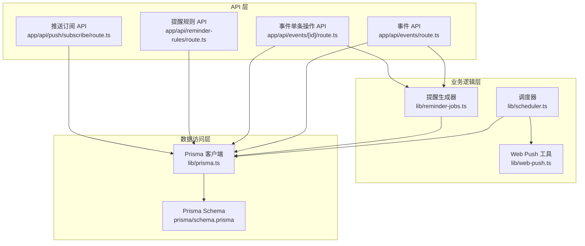
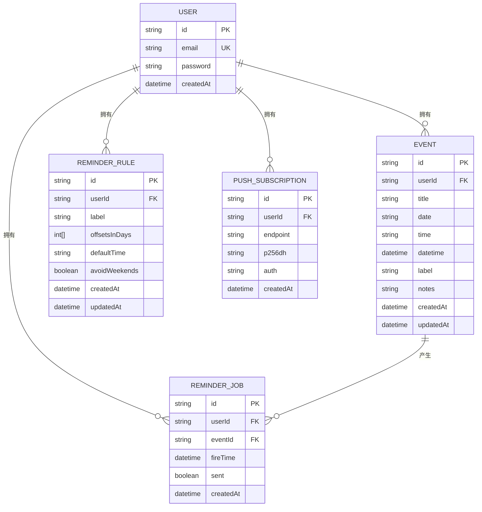
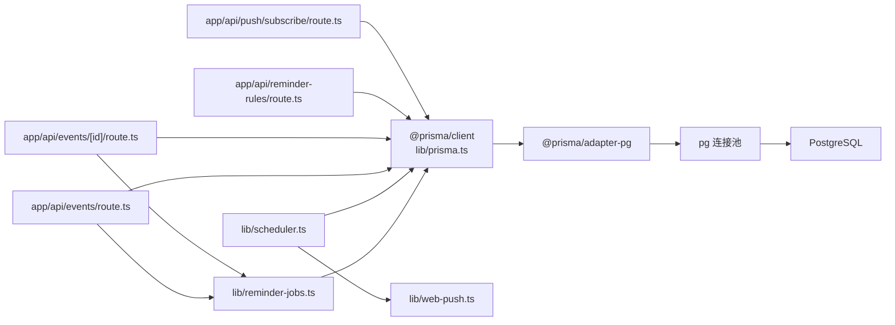

# 数据库模型

<cite>
**本文引用的文件**
- [prisma/schema.prisma](file://prisma/schema.prisma)
- [lib/prisma.ts](file://lib/prisma.ts)
- [lib/reminder-jobs.ts](file://lib/reminder-jobs.ts)
- [lib/scheduler.ts](file://lib/scheduler.ts)
- [app/api/events/route.ts](file://app/api/events/route.ts)
- [app/api/events/[id]/route.ts](file://app/api/events/[id]/route.ts)
- [app/api/reminder-rules/route.ts](file://app/api/reminder-rules/route.ts)
- [app/api/push/subscribe/route.ts](file://app/api/push/subscribe/route.ts)
- [lib/web-push.ts](file://lib/web-push.ts)
</cite>

## 目录
1. [简介](#简介)
2. [项目结构](#项目结构)
3. [核心组件](#核心组件)
4. [架构总览](#架构总览)
5. [详细组件分析](#详细组件分析)
6. [依赖分析](#依赖分析)
7. [性能考量](#性能考量)
8. [故障排查指南](#故障排查指南)
9. [结论](#结论)
10. [附录](#附录)

## 简介
本文件围绕 Prisma 模型定义与实际数据访问路径，系统性梳理用户、事件、提醒规则、提醒任务与推送订阅五大核心模型。重点说明：
- 字段类型、默认值与约束（如唯一索引、复合索引、自增主键）
- 关系映射与外键级联删除行为
- Event 模型中 datetime 字段用于排序与查询的用途
- ReminderRule 中 offsetsInDays 数组在 PostgreSQL 的适配实现
- 实体关系图（ER Diagram）与典型查询场景的数据访问路径
- 结合 Prisma Client 调用示例，展示如何通过 include 或 select 优化数据加载性能

## 项目结构
该应用采用 Next.js API 路由 + Prisma Client 的后端架构。数据库适配器为 PostgreSQL，通过 @prisma/adapter-pg 连接原生 pg 连接池。

图表来源
- [lib/prisma.ts](file://lib/prisma.ts#L1-L20)
- [prisma/schema.prisma](file://prisma/schema.prisma#L1-L86)
- [app/api/events/route.ts](file://app/api/events/route.ts#L1-L200)
- [app/api/events/[id]/route.ts](file://app/api/events/[id]/route.ts#L1-L119)
- [app/api/reminder-rules/route.ts](file://app/api/reminder-rules/route.ts#L1-L109)
- [app/api/push/subscribe/route.ts](file://app/api/push/subscribe/route.ts#L1-L96)
- [lib/reminder-jobs.ts](file://lib/reminder-jobs.ts#L1-L109)
- [lib/scheduler.ts](file://lib/scheduler.ts#L1-L86)
- [lib/web-push.ts](file://lib/web-push.ts#L1-L54)

章节来源
- [lib/prisma.ts](file://lib/prisma.ts#L1-L20)
- [prisma/schema.prisma](file://prisma/schema.prisma#L1-L86)

## 核心组件
本节从模型定义出发，逐项解析字段、默认值、约束与关系映射，并给出典型查询场景与性能优化建议。

- User 模型
  - 主键：String，@id，@default(cuid())
  - 唯一约束：email
  - 默认值：createdAt 使用数据库默认时间
  - 关系：一对多到 Event、ReminderRule、ReminderJob、PushSubscription
  - 外键级联：未显式声明，遵循 Prisma 默认行为（不自动级联）

- Event 模型
  - 主键：String，@id，@default(cuid())
  - 关系：属于 User（userId → User.id）
  - 字段：
    - title：字符串
    - date：字符串（YYYY-MM-DD）
    - time：可空字符串（HH:mm）
    - datetime：DateTime（ISO 时间，用于排序与查询）
    - label、notes：可空字符串
  - 索引：@@index([userId, date])
  - 默认值：createdAt、updatedAt 使用数据库默认时间
  - 外键级联：未显式声明，遵循 Prisma 默认行为

- ReminderRule 模型
  - 主键：String，@id，@default(cuid())
  - 关系：属于 User（userId → User.id）
  - 字段：
    - label：字符串（与 userId 组成唯一索引）
    - offsetsInDays：整数数组（PostgreSQL 数组）
    - defaultTime：字符串（默认时间）
    - avoidWeekends：布尔，默认 false
  - 约束：@@unique([userId, label])
  - 默认值：createdAt、updatedAt 使用数据库默认时间

- ReminderJob 模型
  - 主键：String，@id，@default(cuid())
  - 关系：属于 User（userId → User.id），属于 Event（eventId → Event.id）
  - 字段：
    - eventId：字符串
    - fireTime：DateTime（触发时间）
    - sent：布尔，默认 false
  - 索引：@@index([userId, sent, fireTime])
  - 默认值：createdAt 使用数据库默认时间
  - 外键级联：onDelete: Cascade（当事件被删除时，对应的提醒任务也会被级联删除）

- PushSubscription 模型
  - 主键：String，@id，@default(cuid())
  - 关系：属于 User（userId → User.id）
  - 字段：
    - endpoint：字符串
    - p256dh、auth：字符串
  - 默认值：createdAt 使用数据库默认时间

章节来源
- [prisma/schema.prisma](file://prisma/schema.prisma#L16-L86)

## 架构总览
下图展示五种模型之间的实体关系与外键约束，突出 User 与其他模型的一对多关系及 ReminderJob 的级联删除策略。

图表来源
- [prisma/schema.prisma](file://prisma/schema.prisma#L16-L86)

## 详细组件分析

### User 模型
- 字段与约束
  - id：String，@id，@default(cuid())
  - email：String，@unique
  - password：String
  - createdAt：DateTime，@default(now())
- 关系
  - 一对多：events、reminderRules、reminderJobs、pushSubscriptions
- 外键级联
  - 未显式声明，遵循 Prisma 默认行为（不自动级联）

章节来源
- [prisma/schema.prisma](file://prisma/schema.prisma#L16-L26)

### Event 模型
- 字段与约束
  - id：String，@id，@default(cuid())
  - userId：String（外键）
  - user：User，@relation(fields: [userId], references: [id])
  - title、date、time、label、notes：字符串或可空
  - datetime：DateTime（ISO 时间，用于排序与查询）
  - createdAt、updatedAt：DateTime，@default(now())/@updatedAt
  - 索引：@@index([userId, date])
- 外键级联
  - 未显式声明，遵循 Prisma 默认行为
- 排序用途
  - datetime 字段用于事件排序与查询，确保跨日期与时间的统一比较

章节来源
- [prisma/schema.prisma](file://prisma/schema.prisma#L28-L45)

### ReminderRule 模型
- 字段与约束
  - id：String，@id，@default(cuid())
  - userId：String（外键）
  - user：User，@relation(fields: [userId], references: [id])
  - label：String（与 userId 组成唯一索引）
  - offsetsInDays：Int[]（PostgreSQL 数组）
  - defaultTime：String（默认时间）
  - avoidWeekends：Boolean，@default(false)
  - createdAt、updatedAt：DateTime，@default(now())/@updatedAt
  - 约束：@@unique([userId, label])
- PostgreSQL 适配
  - offsetsInDays 在 PostgreSQL 中以数组形式存储，Prisma Client 提供读写支持

章节来源
- [prisma/schema.prisma](file://prisma/schema.prisma#L47-L60)

### ReminderJob 模型
- 字段与约束
  - id：String，@id，@default(cuid())
  - userId：String（外键）
  - user：User，@relation(fields: [userId], references: [id])
  - eventId：String（外键）
  - event：Event，@relation(fields: [eventId], references: [id], onDelete: Cascade)
  - fireTime：DateTime（触发时间）
  - sent：Boolean，@default(false)
  - createdAt：DateTime，@default(now())
  - 索引：@@index([userId, sent, fireTime])
- 外键级联
  - onDelete: Cascade（当事件被删除时，对应的提醒任务也会被级联删除）

章节来源
- [prisma/schema.prisma](file://prisma/schema.prisma#L62-L74)

### PushSubscription 模型
- 字段与约束
  - id：String，@id，@default(cuid())
  - userId：String（外键）
  - user：User，@relation(fields: [userId], references: [id])
  - endpoint、p256dh、auth：字符串
  - createdAt：DateTime，@default(now())

章节来源
- [prisma/schema.prisma](file://prisma/schema.prisma#L76-L86)

### 典型查询场景与数据访问路径

- 场景一：按月获取事件列表（含提醒扩展）
  - 访问路径：事件 API → 查询事件 → 合并提醒实例
  - 性能优化：使用 select 仅返回必要字段，避免 include 带来的 N+1 加载
  - 参考路径
    - [app/api/events/route.ts](file://app/api/events/route.ts#L53-L71)
    - [app/api/events/route.ts](file://app/api/events/route.ts#L74-L122)

- 场景二：生成提醒任务
  - 访问路径：事件创建/更新 → 查找规则 → 计算 fireTime → 批量创建 ReminderJob
  - 性能优化：批量 createMany，减少往返次数
  - 参考路径
    - [lib/reminder-jobs.ts](file://lib/reminder-jobs.ts#L15-L72)

- 场景三：获取待发送提醒任务
  - 访问路径：调度器 → 查询未发送且已到期的任务 → include 事件与用户信息
  - 性能优化：使用 include 并限定字段（select），避免不必要的数据传输
  - 参考路径
    - [lib/reminder-jobs.ts](file://lib/reminder-jobs.ts#L77-L98)

- 场景四：按标签创建提醒规则并同步现有事件
  - 访问路径：提醒规则 API → 创建规则 → 查找同标签事件 → 重新生成提醒任务
  - 参考路径
    - [app/api/reminder-rules/route.ts](file://app/api/reminder-rules/route.ts#L84-L101)

- 场景五：推送订阅管理
  - 访问路径：订阅 API → 校验重复 → 创建订阅；取消订阅时按 endpoint 删除
  - 参考路径
    - [app/api/push/subscribe/route.ts](file://app/api/push/subscribe/route.ts#L35-L55)
    - [app/api/push/subscribe/route.ts](file://app/api/push/subscribe/route.ts#L83-L88)

- 场景六：调度器发送通知并清理无效订阅
  - 访问路径：调度器 → 获取待发任务 → 查询用户所有订阅 → 发送通知 → 标记已发送 → 清理 410 订阅
  - 参考路径
    - [lib/scheduler.ts](file://lib/scheduler.ts#L17-L77)
    - [lib/web-push.ts](file://lib/web-push.ts#L28-L46)

章节来源
- [app/api/events/route.ts](file://app/api/events/route.ts#L1-L200)
- [lib/reminder-jobs.ts](file://lib/reminder-jobs.ts#L1-L109)
- [app/api/reminder-rules/route.ts](file://app/api/reminder-rules/route.ts#L1-L109)
- [app/api/push/subscribe/route.ts](file://app/api/push/subscribe/route.ts#L1-L96)
- [lib/scheduler.ts](file://lib/scheduler.ts#L1-L86)
- [lib/web-push.ts](file://lib/web-push.ts#L1-L54)

### Prisma Client 调用示例与性能优化

- 使用 select 限制字段
  - 示例路径：事件列表查询中使用 select 仅返回 id、title、date、time、label、notes
  - 参考路径
    - [app/api/events/route.ts](file://app/api/events/route.ts#L63-L70)

- 使用 include 联合加载关联数据
  - 示例路径：获取待发提醒任务时 include 事件与用户部分字段
  - 参考路径
    - [lib/reminder-jobs.ts](file://lib/reminder-jobs.ts#L85-L93)

- 批量写入提升吞吐
  - 示例路径：生成提醒任务时使用 createMany 批量插入
  - 参考路径
    - [lib/reminder-jobs.ts](file://lib/reminder-jobs.ts#L66-L69)

- 条件查询与排序
  - 示例路径：按 fireTime 升序获取待发任务
  - 参考路径
    - [lib/reminder-jobs.ts](file://lib/reminder-jobs.ts#L94-L96)

章节来源
- [app/api/events/route.ts](file://app/api/events/route.ts#L63-L70)
- [lib/reminder-jobs.ts](file://lib/reminder-jobs.ts#L85-L93)
- [lib/reminder-jobs.ts](file://lib/reminder-jobs.ts#L66-L69)
- [lib/reminder-jobs.ts](file://lib/reminder-jobs.ts#L94-L96)

## 依赖分析
- 数据库适配器
  - 使用 @prisma/adapter-pg 与原生 pg 连接池，通过 DATABASE_URL 连接 PostgreSQL
  - 参考路径
    - [lib/prisma.ts](file://lib/prisma.ts#L9-L15)

- 模型间依赖
  - User 为上游实体，Event、ReminderRule、ReminderJob、PushSubscription 均依赖 User
  - ReminderJob 对 Event 存在 onDelete: Cascade 的级联删除策略
  - 参考路径
    - [prisma/schema.prisma](file://prisma/schema.prisma#L31-L31)
    - [prisma/schema.prisma](file://prisma/schema.prisma#L67-L67)

- 外部依赖
  - web-push：用于发送 Web Push 通知
  - 参考路径
    - [lib/web-push.ts](file://lib/web-push.ts#L1-L54)

图表来源
- [lib/prisma.ts](file://lib/prisma.ts#L1-L20)
- [lib/reminder-jobs.ts](file://lib/reminder-jobs.ts#L1-L109)
- [lib/scheduler.ts](file://lib/scheduler.ts#L1-L86)
- [lib/web-push.ts](file://lib/web-push.ts#L1-L54)
- [app/api/events/route.ts](file://app/api/events/route.ts#L1-L200)
- [app/api/events/[id]/route.ts](file://app/api/events/[id]/route.ts#L1-L119)
- [app/api/reminder-rules/route.ts](file://app/api/reminder-rules/route.ts#L1-L109)
- [app/api/push/subscribe/route.ts](file://app/api/push/subscribe/route.ts#L1-L96)

章节来源
- [lib/prisma.ts](file://lib/prisma.ts#L1-L20)
- [lib/reminder-jobs.ts](file://lib/reminder-jobs.ts#L1-L109)
- [lib/scheduler.ts](file://lib/scheduler.ts#L1-L86)
- [lib/web-push.ts](file://lib/web-push.ts#L1-L54)
- [app/api/events/route.ts](file://app/api/events/route.ts#L1-L200)
- [app/api/events/[id]/route.ts](file://app/api/events/[id]/route.ts#L1-L119)
- [app/api/reminder-rules/route.ts](file://app/api/reminder-rules/route.ts#L1-L109)
- [app/api/push/subscribe/route.ts](file://app/api/push/subscribe/route.ts#L1-L96)

## 性能考量
- 使用 select 限制字段，避免 include 带来的 N+1 加载与多余网络传输
  - 示例参考：事件列表查询
  - 参考路径
    - [app/api/events/route.ts](file://app/api/events/route.ts#L63-L70)

- 使用 include 时限定 select 字段，仅取需要的用户与事件信息
  - 示例参考：获取待发提醒任务
  - 参考路径
    - [lib/reminder-jobs.ts](file://lib/reminder-jobs.ts#L85-L93)

- 批量写入 createMany 替代循环 insert，降低往返次数
  - 示例参考：生成提醒任务
  - 参考路径
    - [lib/reminder-jobs.ts](file://lib/reminder-jobs.ts#L66-L69)

- 利用索引加速查询
  - Event 的复合索引：@@index([userId, date])
  - ReminderJob 的复合索引：@@index([userId, sent, fireTime])

- 避免不必要的排序与过滤
  - 仅在必要时对 datetime 字段进行排序与范围查询

[本节提供通用指导，无需特定文件来源]

## 故障排查指南
- 提醒任务未发送
  - 检查 ReminderJob.sent 是否为 false 且 fireTime ≤ 当前时间
  - 参考路径
    - [lib/reminder-jobs.ts](file://lib/reminder-jobs.ts#L77-L98)

- 事件删除后提醒任务未清理
  - 确认 ReminderJob 的 onDelete: Cascade 设置是否生效
  - 参考路径
    - [prisma/schema.prisma](file://prisma/schema.prisma#L67-L67)

- Web Push 410 错误
  - 调度器会检测 410 并删除无效订阅
  - 参考路径
    - [lib/scheduler.ts](file://lib/scheduler.ts#L61-L67)

- 订阅重复
  - 订阅 API 会在相同 endpoint 下去重
  - 参考路径
    - [app/api/push/subscribe/route.ts](file://app/api/push/subscribe/route.ts#L35-L45)

章节来源
- [lib/reminder-jobs.ts](file://lib/reminder-jobs.ts#L77-L98)
- [prisma/schema.prisma](file://prisma/schema.prisma#L67-L67)
- [lib/scheduler.ts](file://lib/scheduler.ts#L61-L67)
- [app/api/push/subscribe/route.ts](file://app/api/push/subscribe/route.ts#L35-L45)

## 结论
本文基于 Prisma Schema 与实际 API 路由，系统梳理了 User、Event、ReminderRule、ReminderJob、PushSubscription 五类模型的字段、约束与关系映射。重点强调了：
- Event.datetime 用于统一排序与查询
- ReminderRule.offsetsInDays 作为 PostgreSQL 数组存储
- ReminderJob.onDelete: Cascade 的级联删除策略
- 通过 select 与 include 的组合优化数据加载性能
- 典型查询场景与数据访问路径，便于定位问题与性能优化

[本节为总结，无需特定文件来源]

## 附录

### 字段与约束速览
- User
  - id：String，@id，@default(cuid())
  - email：String，@unique
  - createdAt：DateTime，@default(now())
  - 关系：一对多到 Event、ReminderRule、ReminderJob、PushSubscription

- Event
  - id：String，@id，@default(cuid())
  - userId：String（外键）
  - user：User，@relation(fields: [userId], references: [id])
  - datetime：DateTime（排序/查询）
  - 索引：@@index([userId, date])
  - createdAt、updatedAt：DateTime，@default(now())/@updatedAt

- ReminderRule
  - id：String，@id，@default(cuid())
  - userId：String（外键）
  - user：User，@relation(fields: [userId], references: [id])
  - offsetsInDays：Int[]（PostgreSQL 数组）
  - label：String（与 userId 组成唯一索引）
  - createdAt、updatedAt：DateTime，@default(now())/@updatedAt

- ReminderJob
  - id：String，@id，@default(cuid())
  - userId：String（外键）
  - user：User，@relation(fields: [userId], references: [id])
  - eventId：String（外键）
  - event：Event，@relation(fields: [eventId], references: [id], onDelete: Cascade)
  - fireTime：DateTime
  - sent：Boolean，@default(false])
  - 索引：@@index([userId, sent, fireTime])
  - createdAt：DateTime，@default(now())

- PushSubscription
  - id：String，@id，@default(cuid())
  - userId：String（外键）
  - user：User，@relation(fields: [userId], references: [id])
  - endpoint、p256dh、auth：字符串
  - createdAt：DateTime，@default(now())

章节来源
- [prisma/schema.prisma](file://prisma/schema.prisma#L16-L86)