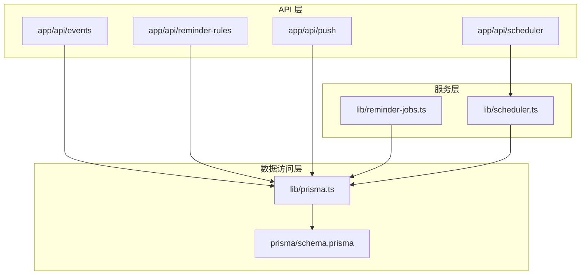
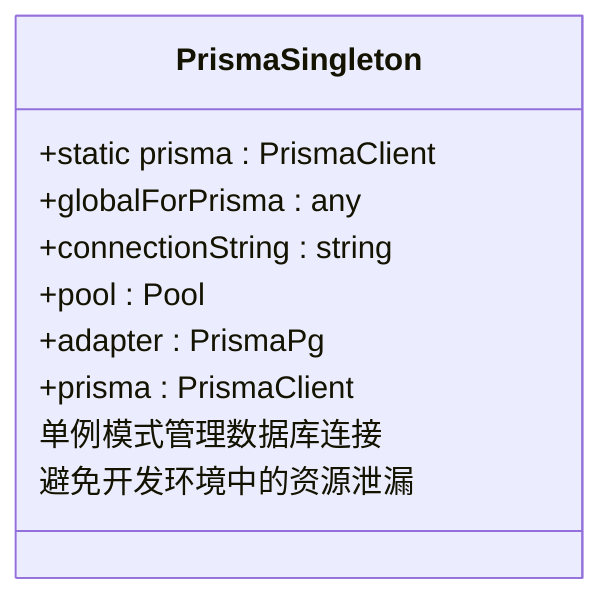
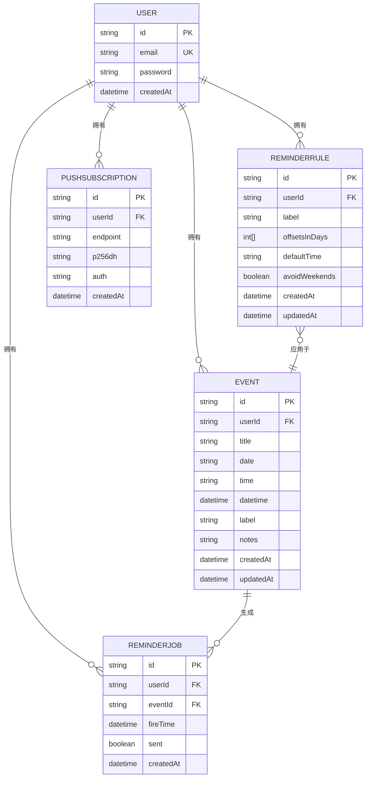
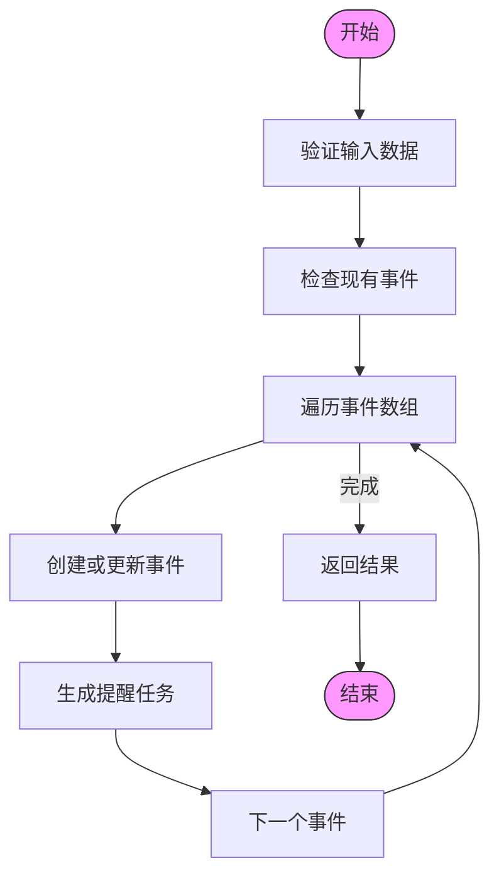
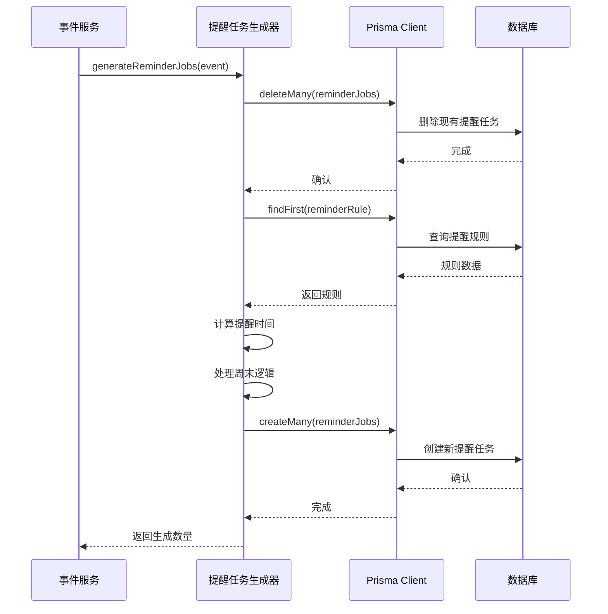
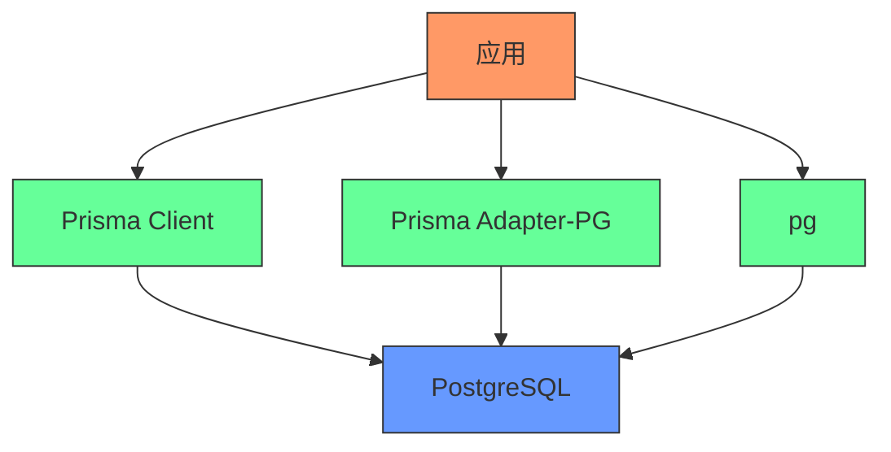

# 数据访问层

<cite>
**本文档中引用的文件**  
- [lib/prisma.ts](file://lib/prisma.ts)
- [prisma/schema.prisma](file://prisma/schema.prisma)
- [lib/reminder-jobs.ts](file://lib/reminder-jobs.ts)
- [app/api/events/route.ts](file://app/api/events/route.ts)
- [app/api/events/bulk-create/route.ts](file://app/api/events/bulk-create/route.ts)
- [lib/scheduler.ts](file://lib/scheduler.ts)
- [app/api/scheduler/run/route.ts](file://app/api/scheduler/run/route.ts)
- [app/api/reminder-rules/route.ts](file://app/api/reminder-rules/route.ts)
- [app/api/push/subscribe/route.ts](file://app/api/push/subscribe/route.ts)
- [prisma.config.ts](file://prisma.config.ts)
</cite>

## 目录
1. [简介](#简介)
2. [项目结构](#项目结构)
3. [核心组件](#核心组件)
4. [架构概述](#架构概述)
5. [详细组件分析](#详细组件分析)
6. [依赖分析](#依赖分析)
7. [性能考虑](#性能考虑)
8. [故障排除指南](#故障排除指南)
9. [结论](#结论)

## 简介
本文件详细说明了基于Prisma ORM的数据访问层实现，重点介绍数据库连接管理、数据模型定义、API调用模式以及提醒任务生成机制。系统使用PostgreSQL作为后端数据库，通过Prisma Client提供类型安全的数据库访问，并采用单例模式确保连接资源的有效管理。

## 项目结构
数据访问层的核心文件分布在`lib/`和`prisma/`目录中，API路由位于`app/api/`目录下。这种分层结构实现了关注点分离，将数据访问逻辑与业务逻辑和API接口清晰地划分开来。



**图示来源**  
- [lib/prisma.ts](file://lib/prisma.ts#L1-L19)
- [prisma/schema.prisma](file://prisma/schema.prisma#L1-L86)

**本节来源**  
- [lib/prisma.ts](file://lib/prisma.ts#L1-L19)
- [prisma/schema.prisma](file://prisma/schema.prisma#L1-L86)

## 核心组件
数据访问层的核心组件包括Prisma客户端单例、数据模型定义、提醒任务生成器和调度器。这些组件协同工作，确保数据的一致性、完整性和及时性。

**本节来源**  
- [lib/prisma.ts](file://lib/prisma.ts#L1-L19)
- [prisma/schema.prisma](file://prisma/schema.prisma#L1-L86)
- [lib/reminder-jobs.ts](file://lib/reminder-jobs.ts#L1-L109)

## 架构概述
系统采用分层架构，前端通过API路由与后端交互，后端服务通过Prisma Client访问数据库。Prisma Client通过PostgreSQL适配器与数据库通信，确保了数据库操作的高效性和可靠性。


**图示来源**  
- [app/api/events/route.ts](file://app/api/events/route.ts#L1-L200)
- [lib/prisma.ts](file://lib/prisma.ts#L1-L19)
- [prisma/schema.prisma](file://prisma/schema.prisma#L1-L86)

## 详细组件分析

### Prisma客户端单例模式
`lib/prisma.ts`文件实现了Prisma Client的单例模式，防止在开发环境中创建多个实例导致的资源泄漏。通过全局对象缓存Prisma Client实例，确保在整个应用生命周期中只存在一个数据库连接客户端。



**图示来源**  
- [lib/prisma.ts](file://lib/prisma.ts#L1-L19)

**本节来源**  
- [lib/prisma.ts](file://lib/prisma.ts#L1-L19)

### 数据模型定义
`prisma/schema.prisma`文件定义了核心数据模型，包括User、Event、ReminderRule、ReminderJob和PushSubscription。这些模型之间通过关系字段建立关联，形成了完整的数据模型。

#### 实体关系图


**图示来源**  
- [prisma/schema.prisma](file://prisma/schema.prisma#L16-L85)

**本节来源**  
- [prisma/schema.prisma](file://prisma/schema.prisma#L16-L85)

### API调用模式
API路由中展示了Prisma Client的典型使用模式，包括事务性批量插入和复杂查询。`bulk-create/route.ts`中的实现展示了如何处理批量事件创建，同时为每个事件生成相应的提醒任务。

#### 批量创建事件流程


**图示来源**  
- [app/api/events/bulk-create/route.ts](file://app/api/events/bulk-create/route.ts#L1-L132)

**本节来源**  
- [app/api/events/bulk-create/route.ts](file://app/api/events/bulk-create/route.ts#L1-L132)
- [app/api/events/route.ts](file://app/api/events/route.ts#L1-L200)

### 提醒任务生成机制
`lib/reminder-jobs.ts`文件实现了提醒任务的生成逻辑。当事件创建或更新时，系统会根据事件的标签查找相应的提醒规则，并生成对应的提醒任务。

#### 提醒任务生成流程


**图示来源**  
- [lib/reminder-jobs.ts](file://lib/reminder-jobs.ts#L15-L72)
- [prisma/schema.prisma](file://prisma/schema.prisma#L62-L74)

**本节来源**  
- [lib/reminder-jobs.ts](file://lib/reminder-jobs.ts#L1-L109)
- [app/api/events/route.ts](file://app/api/events/route.ts#L185-L192)

## 依赖分析
数据访问层依赖于Prisma ORM、PostgreSQL数据库适配器和Node.js运行时环境。这些依赖通过package.json文件进行管理，确保了版本的一致性和可重现性。



**图示来源**  
- [package.json](file://package.json#L1-L62)
- [lib/prisma.ts](file://lib/prisma.ts#L1-L19)

**本节来源**  
- [package.json](file://package.json#L1-L62)
- [prisma.config.ts](file://prisma.config.ts#L1-L15)

## 性能考虑
为了优化数据库性能，系统采用了多种策略，包括索引优化、字段选择裁剪和连接池配置。在查询时使用select选项只获取必要的字段，减少网络传输和内存占用。

### 查询优化建议
- 在常用查询字段上创建索引，如`userId`和`date`的组合索引
- 使用select裁剪只获取必要的字段，避免N+1查询问题
- 批量操作使用createMany、updateMany等批量方法，减少数据库往返次数
- 合理配置连接池大小，平衡并发性能和资源消耗

**本节来源**  
- [prisma/schema.prisma](file://prisma/schema.prisma#L44)
- [app/api/events/route.ts](file://app/api/events/route.ts#L63-L71)
- [lib/prisma.ts](file://lib/prisma.ts#L10-L11)

## 故障排除指南
### 数据库连接问题
如果遇到数据库连接问题，请检查：
- DATABASE_URL环境变量是否正确配置
- PostgreSQL服务是否正在运行
- 网络连接是否正常
- 防火墙设置是否允许数据库端口通信

### 迁移管理
使用Prisma Migrate管理数据库模式变更：
```bash
npx prisma migrate dev --name init
npx prisma migrate deploy
npx prisma db pull
```

**本节来源**  
- [prisma.config.ts](file://prisma.config.ts#L1-L15)
- [lib/prisma.ts](file://lib/prisma.ts#L9-L11)

## 结论
本数据访问层设计实现了高效、可靠和可维护的数据库交互机制。通过Prisma ORM的类型安全查询、单例模式的连接管理、清晰的数据模型定义和合理的API调用模式，系统能够有效地处理数据访问需求。提醒任务生成机制与调度器的结合，确保了提醒功能的准确性和及时性。整体架构遵循了良好的软件工程实践，为系统的扩展和维护提供了坚实的基础。