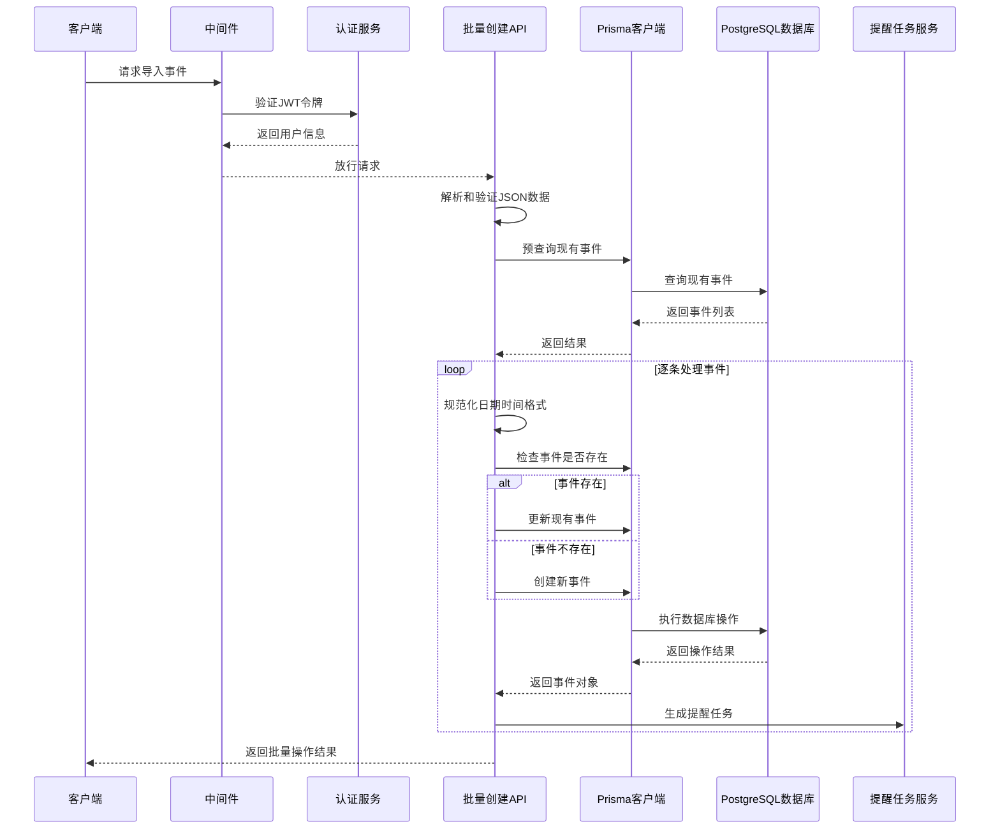
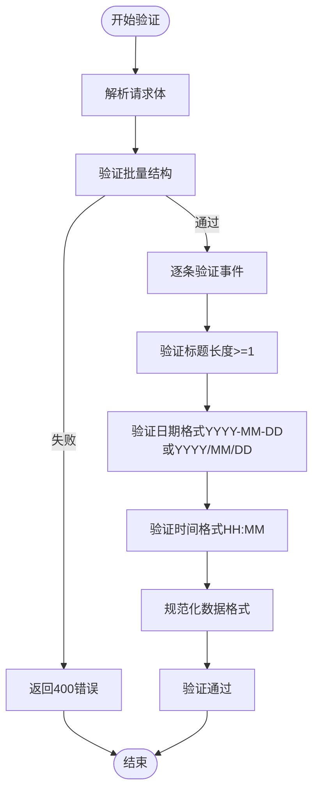
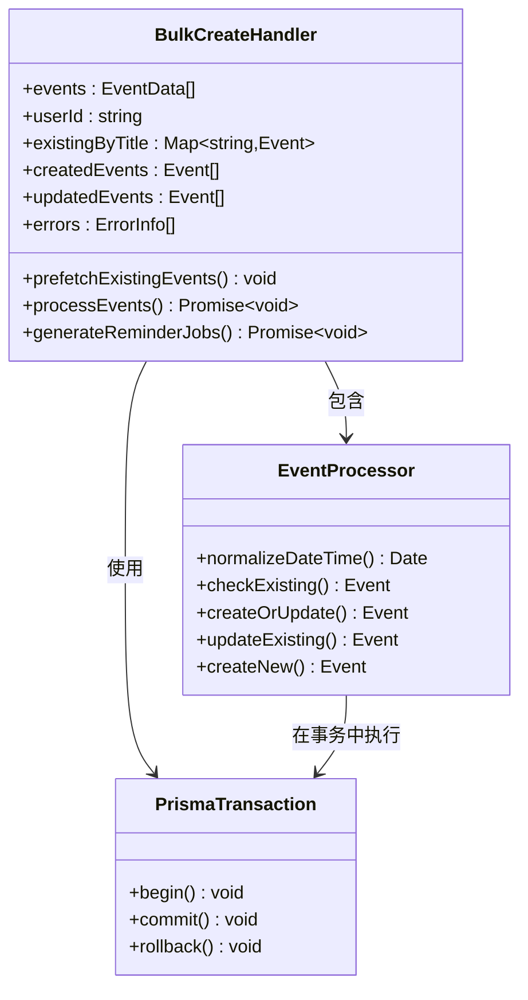
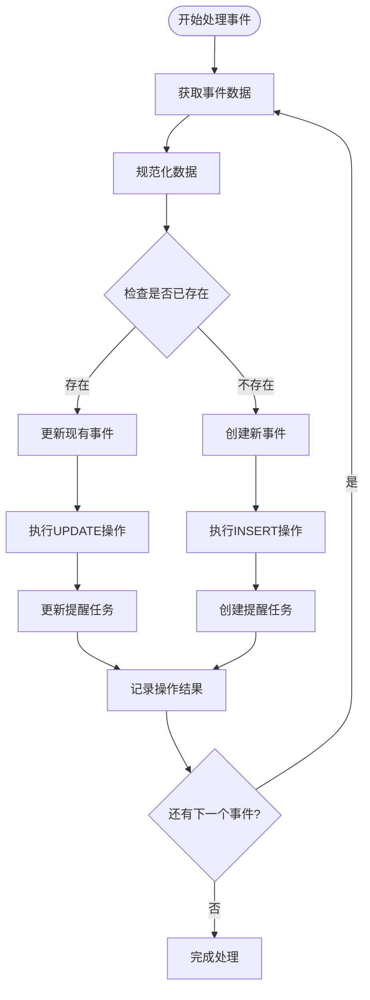
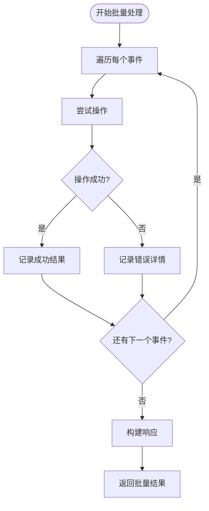
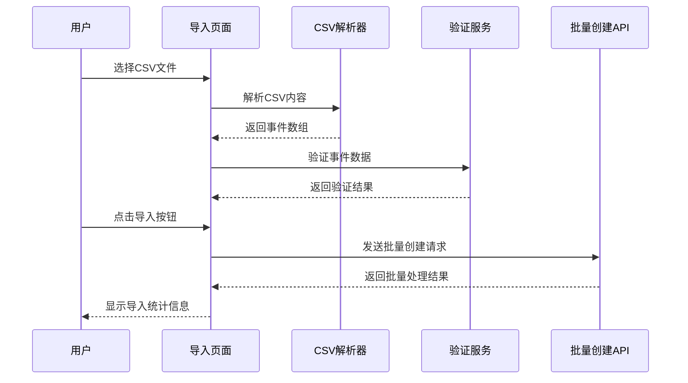
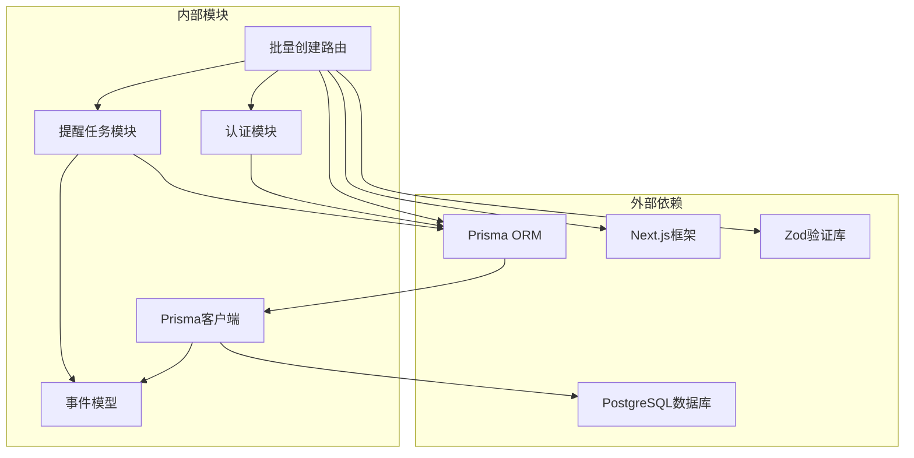

# 事务性批量插入

<cite>
**本文档引用的文件**
- [app/api/events/bulk-create/route.ts](file://app/api/events/bulk-create/route.ts)
- [lib/prisma.ts](file://lib/prisma.ts)
- [prisma/schema.prisma](file://prisma/schema.prisma)
- [lib/reminder-jobs.ts](file://lib/reminder-jobs.ts)
- [app/import/page.tsx](file://app/import/page.tsx)
- [public/templates/events-template.csv](file://public/templates/events-template.csv)
- [middleware.ts](file://middleware.ts)
- [lib/auth.ts](file://lib/auth.ts)
</cite>

## 目录
1. [简介](#简介)
2. [项目结构](#项目结构)
3. [核心组件](#核心组件)
4. [架构概览](#架构概览)
5. [详细组件分析](#详细组件分析)
6. [依赖关系分析](#依赖关系分析)
7. [性能考虑](#性能考虑)
8. [故障排除指南](#故障排除指南)
9. [结论](#结论)

## 简介

本文档深入分析了应用中批量事件创建功能的实现，重点探讨了在 `app/api/events/bulk-create/route.ts` 中如何通过逐条处理事件并结合 Prisma 的默认事务行为确保数据一致性。该功能支持在单个请求中混合创建与更新操作，通过 Map 结构动态维护已存在事件的引用以支持后续覆盖更新。文档还详细说明了输入验证（Zod）与错误收集策略的实现细节，并结合代码展示了请求响应格式设计。最后，讨论了在高并发导入场景下的潜在性能瓶颈及优化建议。

## 项目结构

该项目采用 Next.js App Router 架构，API 路由位于 `app/api/` 目录下，业务逻辑通过 Prisma ORM 进行数据库操作。批量事件创建功能位于事件管理模块中，与前端 CSV 导入页面配合使用。

```mermaid
graph TB
subgraph "前端层"
Import[导入页面<br/>app/import/page.tsx]
Template[CSV模板<br/>public/templates/events-template.csv]
end
subgraph "API层"
BulkRoute[批量创建路由<br/>app/api/events/bulk-create/route.ts]
SingleRoute[单个事件路由<br/>app/api/events/[id]/route.ts]
end
subgraph "服务层"
Prisma[Prisma客户端<br/>lib/prisma.ts]
Auth[认证服务<br/>lib/auth.ts]
ReminderJobs[提醒任务生成<br/>lib/reminder-jobs.ts]
end
subgraph "数据库层"
EventModel[事件模型<br/>prisma/schema.prisma]
end
Import --> BulkRoute
BulkRoute --> Prisma
BulkRoute --> Auth
BulkRoute --> ReminderJobs
Prisma --> EventModel
```

**图表来源**
- [app/api/events/bulk-create/route.ts](file://app/api/events/bulk-create/route.ts#L1-L133)
- [lib/prisma.ts](file://lib/prisma.ts#L1-L20)
- [prisma/schema.prisma](file://prisma/schema.prisma#L28-L45)

**章节来源**
- [app/api/events/bulk-create/route.ts](file://app/api/events/bulk-create/route.ts#L1-L133)
- [lib/prisma.ts](file://lib/prisma.ts#L1-L20)
- [prisma/schema.prisma](file://prisma/schema.prisma#L1-L86)

## 核心组件

批量事件创建功能的核心组件包括：

### 输入验证系统
- **Zod Schema 定义**：使用 Zod 对批量事件数据进行严格验证
- **类型安全**：确保运行时数据类型与编译时类型一致
- **错误收集**：提供详细的验证错误信息

### 数据库操作层
- **Prisma ORM**：提供类型安全的数据库操作
- **事务管理**：利用 Prisma 默认事务行为确保数据一致性
- **索引优化**：基于用户ID和日期的复合索引提升查询性能

### 业务逻辑层
- **混合创建更新**：支持同一请求中同时创建新事件和更新现有事件
- **去重处理**：通过标题字段实现同名事件的覆盖更新
- **提醒任务生成**：自动为每个事件生成对应的提醒任务

**章节来源**
- [app/api/events/bulk-create/route.ts](file://app/api/events/bulk-create/route.ts#L7-L17)
- [lib/prisma.ts](file://lib/prisma.ts#L13-L19)
- [prisma/schema.prisma](file://prisma/schema.prisma#L28-L45)

## 架构概览

批量事件创建功能采用分层架构设计，从输入验证到数据库操作形成完整的处理链路。



**图表来源**
- [app/api/events/bulk-create/route.ts](file://app/api/events/bulk-create/route.ts#L19-L127)
- [lib/auth.ts](file://lib/auth.ts#L22-L29)
- [lib/reminder-jobs.ts](file://lib/reminder-jobs.ts#L15-L72)

## 详细组件分析

### 输入验证与数据规范化

批量事件创建功能实现了严格的输入验证和数据规范化流程：

#### Zod Schema 设计


**图表来源**
- [app/api/events/bulk-create/route.ts](file://app/api/events/bulk-create/route.ts#L7-L17)
- [app/api/events/bulk-create/route.ts](file://app/api/events/bulk-create/route.ts#L32-L36)

#### 数据规范化策略
- **日期格式统一**：将 `/` 分隔符转换为 `-` 分隔符
- **时间格式标准化**：确保单数字小时前面补零
- **默认值处理**：为空的时间字段使用默认值 '10:00'

**章节来源**
- [app/api/events/bulk-create/route.ts](file://app/api/events/bulk-create/route.ts#L56-L67)

### 事务性批量处理机制

批量事件创建采用了逐条处理但共享事务的策略，确保数据一致性：



**图表来源**
- [app/api/events/bulk-create/route.ts](file://app/api/events/bulk-create/route.ts#L41-L96)

#### 事务行为分析
- **默认事务**：Prisma 在单个操作中自动使用事务
- **逐条提交**：每个 create/update 操作都在独立的事务中执行
- **原子性保证**：单个操作要么完全成功，要么完全失败

**章节来源**
- [app/api/events/bulk-create/route.ts](file://app/api/events/bulk-create/route.ts#L71-L93)

### 混合创建与更新处理机制

系统支持在同一请求中混合创建新事件和更新现有事件：



**图表来源**
- [app/api/events/bulk-create/route.ts](file://app/api/events/bulk-create/route.ts#L69-L96)

#### 去重与覆盖策略
- **标题去重**：使用 Map 结构按标题维护事件引用
- **最新覆盖**：后续相同标题的事件会覆盖之前的引用
- **最终一致性**：确保同一请求中重复标题只保留最后一次出现的版本

**章节来源**
- [app/api/events/bulk-create/route.ts](file://app/api/events/bulk-create/route.ts#L42-L49)
- [app/api/events/bulk-create/route.ts](file://app/api/events/bulk-create/route.ts#L95-L96)

### 错误收集与响应格式

系统实现了完善的错误处理和响应格式设计：

#### 错误收集策略


**图表来源**
- [app/api/events/bulk-create/route.ts](file://app/api/events/bulk-create/route.ts#L112-L118)

#### 响应格式设计
批量操作返回包含以下信息的 JSON 对象：
- `success`: 布尔值，表示整体操作是否成功
- `created`: 整数，表示成功创建的事件数量
- `updated`: 整数，表示成功更新的事件数量
- `failed`: 整数，表示失败的操作数量
- `errors`: 数组，包含每个失败操作的详细信息

**章节来源**
- [app/api/events/bulk-create/route.ts](file://app/api/events/bulk-create/route.ts#L121-L127)

### 前端集成与CSV导入

前端页面提供了完整的CSV导入体验：



**图表来源**
- [app/import/page.tsx](file://app/import/page.tsx#L76-L105)
- [public/templates/events-template.csv](file://public/templates/events-template.csv#L1-L5)

**章节来源**
- [app/import/page.tsx](file://app/import/page.tsx#L1-L217)
- [public/templates/events-template.csv](file://public/templates/events-template.csv#L1-L5)

## 依赖关系分析

批量事件创建功能涉及多个组件之间的复杂依赖关系：



**图表来源**
- [app/api/events/bulk-create/route.ts](file://app/api/events/bulk-create/route.ts#L1-L5)
- [lib/prisma.ts](file://lib/prisma.ts#L1-L20)
- [lib/reminder-jobs.ts](file://lib/reminder-jobs.ts#L1-L109)

### 关键依赖特性

#### Prisma 配置依赖
- **连接池管理**：使用 `@prisma/adapter-pg` 实现高效的连接池
- **全局实例缓存**：避免重复创建 PrismaClient 实例
- **环境变量配置**：通过 `DATABASE_URL` 环境变量管理数据库连接

#### 数据模型依赖
- **外键约束**：事件模型通过 `userId` 字段关联用户
- **索引优化**：`userId` 和 `date` 的复合索引提升查询性能
- **级联删除**：事件删除时自动清理相关提醒任务

**章节来源**
- [lib/prisma.ts](file://lib/prisma.ts#L1-L20)
- [prisma/schema.prisma](file://prisma/schema.prisma#L28-L45)

## 性能考虑

在高并发导入场景下，批量事件创建功能可能面临以下性能挑战：

### 当前实现的性能特征

#### 优点
- **内存效率**：使用 Set 和 Map 结构进行去重和查找
- **渐进式处理**：逐条处理避免一次性加载所有数据
- **错误隔离**：单个事件失败不影响其他事件的处理

#### 潜在瓶颈
- **N+1 查询问题**：预查询后仍需要对每个事件执行单独的 CRUD 操作
- **网络往返次数**：每个数据库操作都需要独立的网络往返
- **事务开销**：每个操作都包含完整的事务开销

### 优化建议

#### Prisma $transaction 显式事务
```typescript
// 建议的优化实现
const result = await prisma.$transaction(async (tx) => {
    const createdEvents = []
    const updatedEvents = []
    
    for (const eventData of events) {
        const existing = existingByTitle.get(eventData.title)
        
        if (existing) {
            const updatedEvent = await tx.event.update({
                where: { id: existing.id },
                data: normalizedData
            })
            updatedEvents.push(updatedEvent)
        } else {
            const createdEvent = await tx.event.create({
                data: { ...normalizedData, userId }
            })
            createdEvents.push(createdEvent)
        }
    }
    
    return { createdEvents, updatedEvents }
})
```

#### 批量操作优化
```typescript
// 使用 createMany 和 updateMany 进行批量操作
const createMany = eventsToCreate.map(event => ({
    userId,
    title: event.title,
    date: normalizedDate,
    time: normalizedTime || null,
    datetime,
    label: event.label || null,
    notes: event.notes || null,
}))

await prisma.event.createMany({ data: createMany })
```

#### 并发控制策略
- **批量大小限制**：设置最大批量大小避免内存溢出
- **并发限制**：限制同时处理的事件数量
- **背压机制**：当系统负载过高时暂停新的导入请求

**章节来源**
- [app/api/events/bulk-create/route.ts](file://app/api/events/bulk-create/route.ts#L51-L119)

## 故障排除指南

### 常见错误类型与解决方案

#### 输入验证错误
- **错误表现**：返回 400 错误，包含详细的验证错误信息
- **常见原因**：标题为空、日期格式不正确、时间格式不符合要求
- **解决方法**：检查 CSV 文件格式，确保符合模板要求

#### 认证失败
- **错误表现**：返回 401 未授权错误
- **常见原因**：缺少有效的 JWT 令牌或令牌已过期
- **解决方法**：重新登录获取新令牌

#### 数据库操作错误
- **错误表现**：部分事件处理失败，但整体操作返回 201
- **常见原因**：违反数据库约束、并发冲突
- **解决方法**：检查事件唯一性约束，重试失败的事件

#### 性能问题
- **错误表现**：大量事件导入耗时过长
- **常见原因**：网络延迟、数据库性能瓶颈
- **解决方法**：实施批量优化策略，增加服务器资源

**章节来源**
- [app/api/events/bulk-create/route.ts](file://app/api/events/bulk-create/route.ts#L20-L36)
- [app/api/events/bulk-create/route.ts](file://app/api/events/bulk-create/route.ts#L128-L131)

### 调试技巧

#### 开发环境调试
- **启用详细日志**：在开发模式下查看完整的错误堆栈
- **使用数据库监控**：观察实际执行的 SQL 语句
- **性能分析**：使用 Next.js 内置的性能分析工具

#### 生产环境监控
- **错误追踪**：集成错误监控服务跟踪异常
- **性能指标**：监控 API 响应时间和数据库查询时间
- **用户反馈**：收集用户报告的问题和使用情况

## 结论

批量事件创建功能通过精心设计的架构实现了高效的数据导入能力。其核心优势在于：

1. **数据一致性保障**：通过逐条处理和 Prisma 默认事务行为确保每个操作的原子性
2. **灵活的混合操作**：支持在同一请求中同时创建新事件和更新现有事件
3. **智能去重机制**：使用 Map 结构动态维护事件引用，支持后续覆盖更新
4. **完善的错误处理**：提供详细的错误收集和响应格式设计
5. **前后端协同**：前端 CSV 导入与后端批量处理形成完整的用户体验

在高并发场景下，建议采用显式事务和批量操作等优化策略来进一步提升性能。通过合理的设计和持续的优化，该功能能够满足各种规模的事件导入需求。