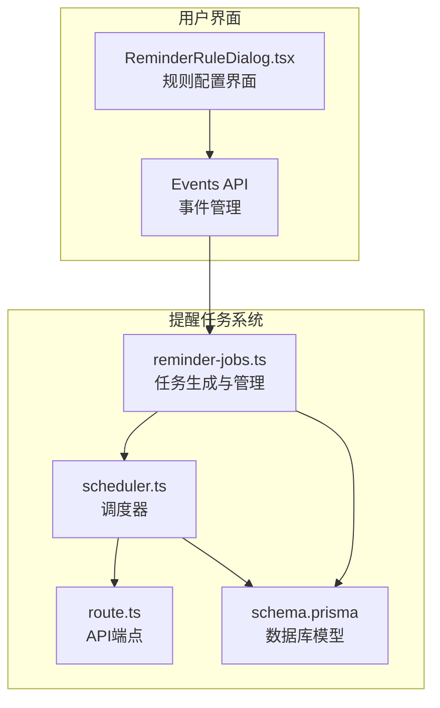
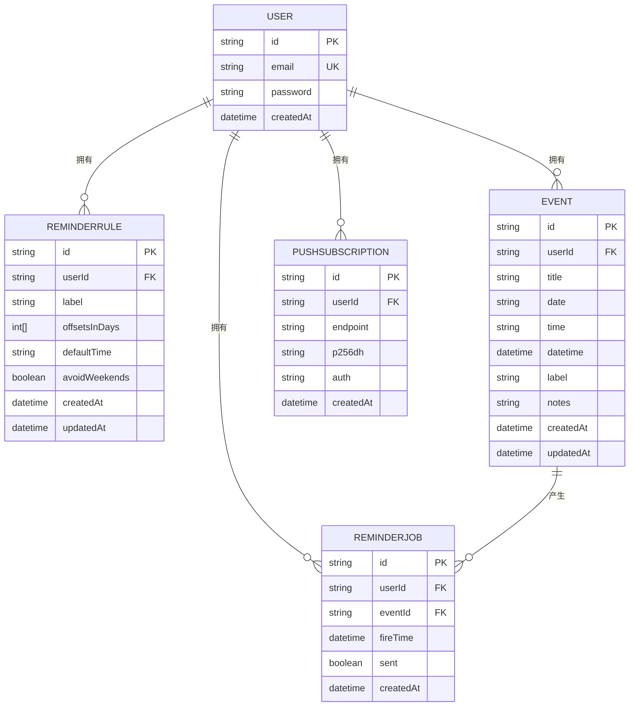
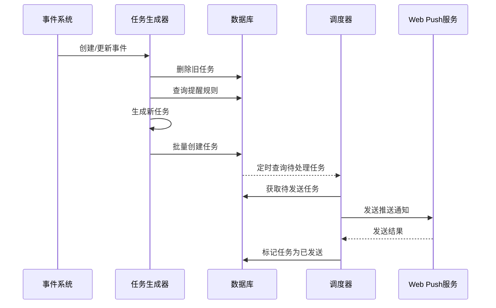
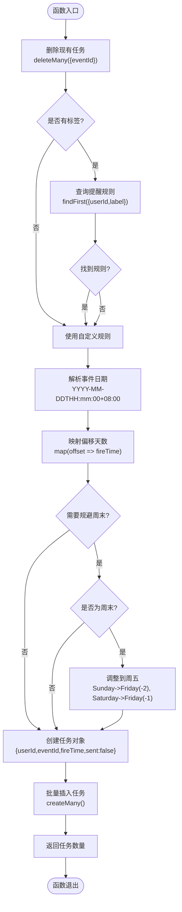
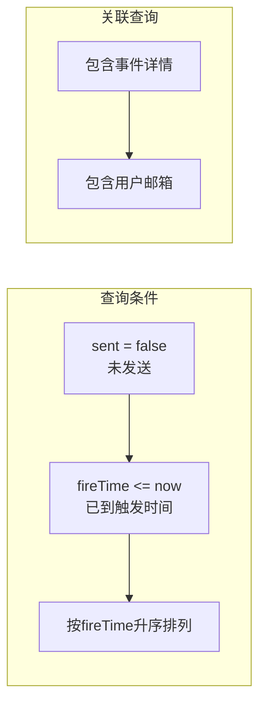
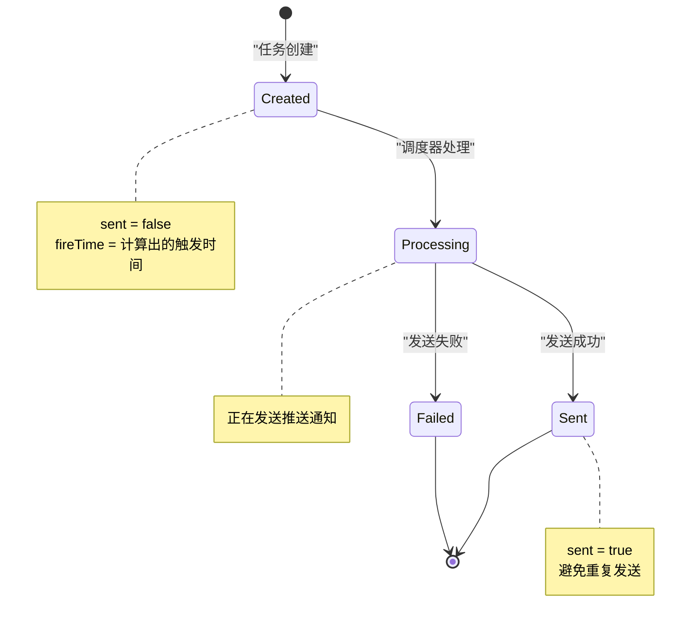
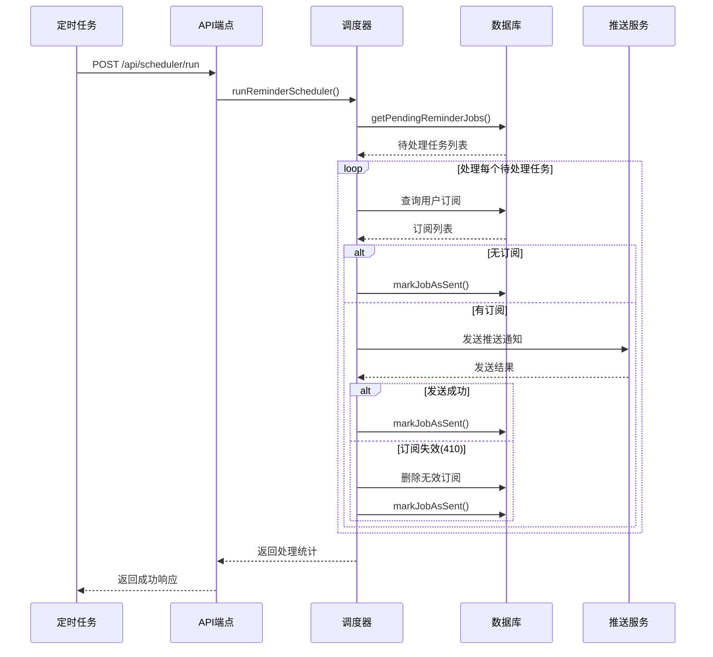
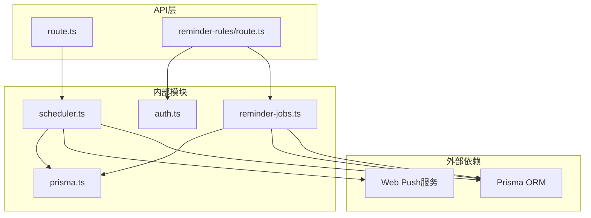
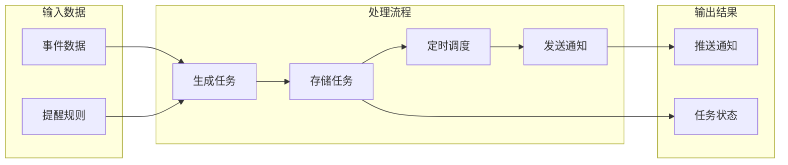

# 提醒任务生成机制

<cite>
**本文档引用的文件**
- [lib/reminder-jobs.ts](file://lib/reminder-jobs.ts)
- [lib/scheduler.ts](file://lib/scheduler.ts)
- [app/api/scheduler/run/route.ts](file://app/api/scheduler/run/route.ts)
- [prisma/schema.prisma](file://prisma/schema.prisma)
- [app/api/reminder-rules/route.ts](file://app/api/reminder-rules/route.ts)
- [components/ReminderRuleDialog.tsx](file://components/ReminderRuleDialog.tsx)
</cite>

## 目录
1. [简介](#简介)
2. [项目结构概览](#项目结构概览)
3. [核心组件分析](#核心组件分析)
4. [架构总览](#架构总览)
5. [详细组件分析](#详细组件分析)
6. [依赖关系分析](#依赖关系分析)
7. [性能考虑](#性能考虑)
8. [故障排除指南](#故障排除指南)
9. [结论](#结论)

## 简介

本文档深入解析了 `lib/reminder-jobs.ts` 中提醒任务（ReminderJob）的生成逻辑。该系统实现了灵活的提醒机制，支持基于事件标签的自定义提醒规则配置，包含默认策略（提前1天、10:00）以及周末自动规避功能。系统通过完整的任务生命周期管理，确保提醒任务的准确性和一致性。

## 项目结构概览

提醒任务系统主要由以下模块组成：

**图表来源**
- [lib/reminder-jobs.ts](file://lib/reminder-jobs.ts#L1-L109)
- [lib/scheduler.ts](file://lib/scheduler.ts#L1-L86)
- [prisma/schema.prisma](file://prisma/schema.prisma#L1-L86)

## 核心组件分析

### 数据模型设计

系统采用清晰的数据模型设计，确保提醒功能的完整性和扩展性：

**图表来源**
- [prisma/schema.prisma](file://prisma/schema.prisma#L16-L86)

**章节来源**
- [prisma/schema.prisma](file://prisma/schema.prisma#L16-L86)

## 架构总览

提醒任务系统采用分层架构设计，实现了从事件创建到提醒推送的完整流程：

**图表来源**
- [lib/reminder-jobs.ts](file://lib/reminder-jobs.ts#L15-L72)
- [lib/scheduler.ts](file://lib/scheduler.ts#L8-L85)

## 详细组件分析

### generateReminderJobs 函数详解

`generateReminderJobs` 是整个提醒系统的核心函数，负责根据事件标签匹配对应的提醒规则并生成具体的提醒任务。

#### 核心算法流程

**图表来源**
- [lib/reminder-jobs.ts](file://lib/reminder-jobs.ts#L15-L72)

#### 关键实现细节

1. **数据一致性保证**：函数首先删除该事件的所有现有提醒任务，确保不会产生重复或过期的任务。

2. **规则匹配机制**：
   - 优先查找与事件标签完全匹配的自定义规则
   - 若无匹配规则，则使用默认策略（提前1天，10:00）

3. **日期计算算法**：
   - 将事件日期解析为带时区的JavaScript Date对象
   - 对每个偏移天数执行日期减法运算
   - 实现精确的日期时间计算

4. **周末规避逻辑**：
   - 周末检查：周日(0)或周六(6)
   - 自动调整：向前移动2天或1天至周五
   - 保持提醒的实用性

**章节来源**
- [lib/reminder-jobs.ts](file://lib/reminder-jobs.ts#L15-L72)

### getPendingReminderJobs 函数分析

该函数负责查询所有待发送的提醒任务，是调度器的核心查询接口。

#### 查询条件设计

**图表来源**
- [lib/reminder-jobs.ts](file://lib/reminder-jobs.ts#L77-L98)

#### 性能优化策略

1. **索引优化**：数据库模型中为 `(userId, sent, fireTime)` 建立复合索引
2. **排序优化**：直接按触发时间升序排列，避免额外排序开销
3. **关联查询**：只选择必要的字段，减少数据传输量

**章节来源**
- [lib/reminder-jobs.ts](file://lib/reminder-jobs.ts#L77-L98)

### markJobAsSent 函数实现

该函数负责将已成功发送的提醒任务标记为已发送状态。

#### 状态管理机制

**图表来源**
- [lib/reminder-jobs.ts](file://lib/reminder-jobs.ts#L103-L108)

**章节来源**
- [lib/reminder-jobs.ts](file://lib/reminder-jobs.ts#L103-L108)

### 调度器运行机制

调度器负责周期性地检查和发送待处理的提醒任务。

#### 完整调度流程

**图表来源**
- [lib/scheduler.ts](file://lib/scheduler.ts#L8-L85)
- [app/api/scheduler/run/route.ts](file://app/api/scheduler/run/route.ts#L8-L26)

**章节来源**
- [lib/scheduler.ts](file://lib/scheduler.ts#L8-L85)
- [app/api/scheduler/run/route.ts](file://app/api/scheduler/run/route.ts#L8-L26)

## 依赖关系分析

### 组件间依赖关系

**图表来源**
- [lib/reminder-jobs.ts](file://lib/reminder-jobs.ts#L1)
- [lib/scheduler.ts](file://lib/scheduler.ts#L1-L3)
- [app/api/scheduler/run/route.ts](file://app/api/scheduler/run/route.ts#L1-L2)

### 数据流分析

**图表来源**
- [lib/reminder-jobs.ts](file://lib/reminder-jobs.ts#L15-L72)
- [lib/scheduler.ts](file://lib/scheduler.ts#L8-L85)

**章节来源**
- [lib/reminder-jobs.ts](file://lib/reminder-jobs.ts#L1-L109)
- [lib/scheduler.ts](file://lib/scheduler.ts#L1-L86)

## 性能考虑

### 查询优化策略

1. **索引设计**：数据库模型为 `ReminderJob` 表的 `(userId, sent, fireTime)` 字段建立了复合索引，确保查询性能。

2. **批量操作**：使用 `createMany()` 进行批量任务创建，减少数据库往返次数。

3. **条件过滤**：通过 `sent = false` 和 `fireTime <= now` 的组合条件，精确筛选待处理任务。

### 内存使用优化

1. **流式处理**：调度器逐个处理待处理任务，避免大量内存占用。

2. **最小化数据传输**：只查询必要的字段，减少网络传输开销。

### 错误处理机制

1. **原子性保证**：任务生成过程在单个事务中完成，确保数据一致性。

2. **幂等性设计**：重复调用任务生成函数不会产生重复任务，因为会先删除旧任务。

## 故障排除指南

### 常见问题诊断

#### 任务未按时发送

1. **检查调度器状态**：确认定时任务正常运行
2. **验证时间设置**：检查事件时间和默认时间配置
3. **确认订阅有效性**：检查用户是否已注册推送订阅

#### 规则配置问题

1. **标签匹配失败**：确认事件标签与规则标签完全一致
2. **偏移天数异常**：检查 `offsetsInDays` 数组是否包含非负整数
3. **时间格式错误**：验证 `defaultTime` 符合 `HH:mm` 格式

#### 数据库连接问题

1. **连接池耗尽**：检查并发请求量和数据库连接限制
2. **查询超时**：优化查询条件和索引使用
3. **事务冲突**：避免同时修改相同记录

**章节来源**
- [lib/scheduler.ts](file://lib/scheduler.ts#L11-L84)

## 结论

提醒任务生成机制通过精心设计的算法和架构，实现了灵活、可靠且高效的提醒系统。系统的主要优势包括：

1. **灵活性**：支持基于事件标签的自定义提醒规则配置
2. **可靠性**：通过任务清理和状态管理确保数据一致性
3. **效率性**：采用批量操作和索引优化提升性能
4. **可用性**：提供周末规避等人性化功能

该系统为事件管理应用提供了完整的提醒解决方案，能够满足不同用户群体的需求，并为未来的功能扩展奠定了良好的基础。