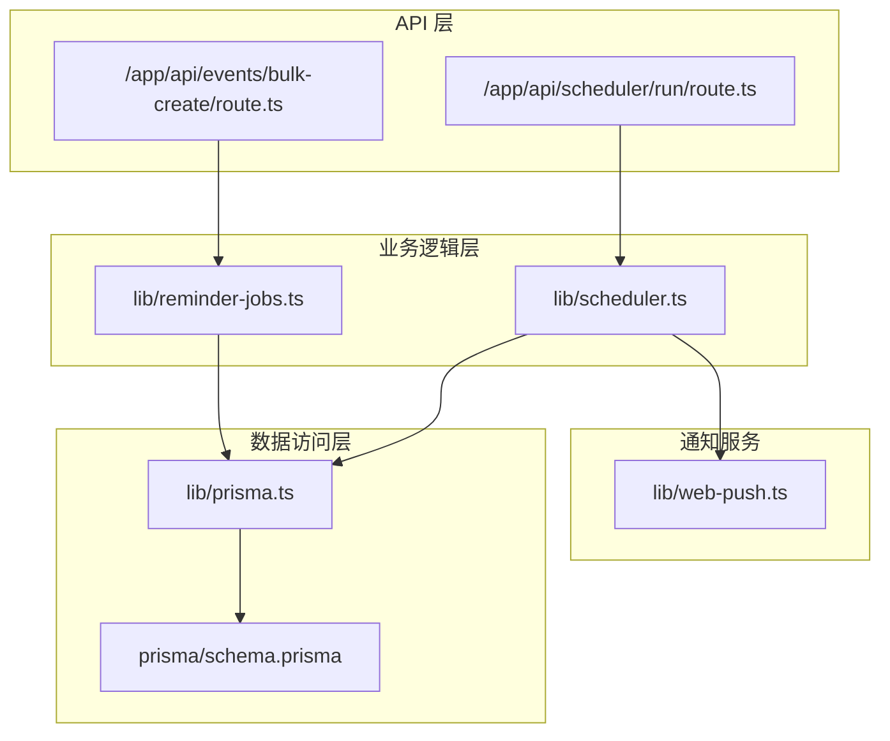
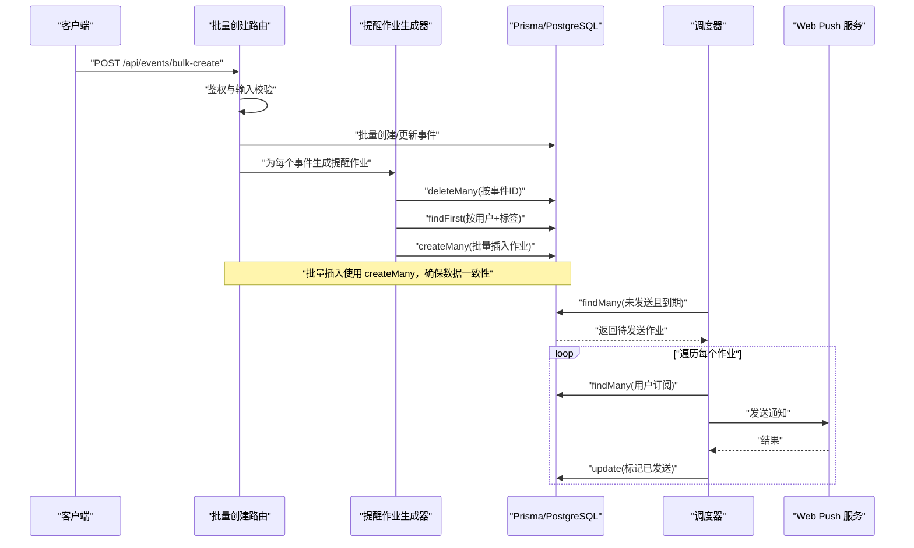
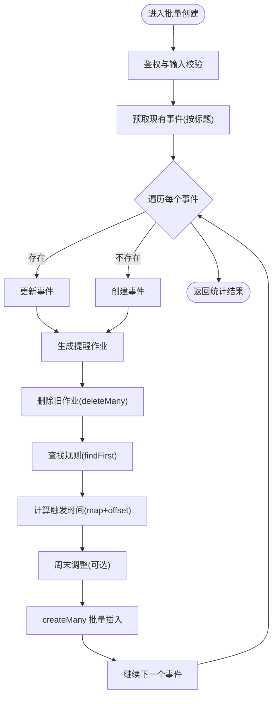
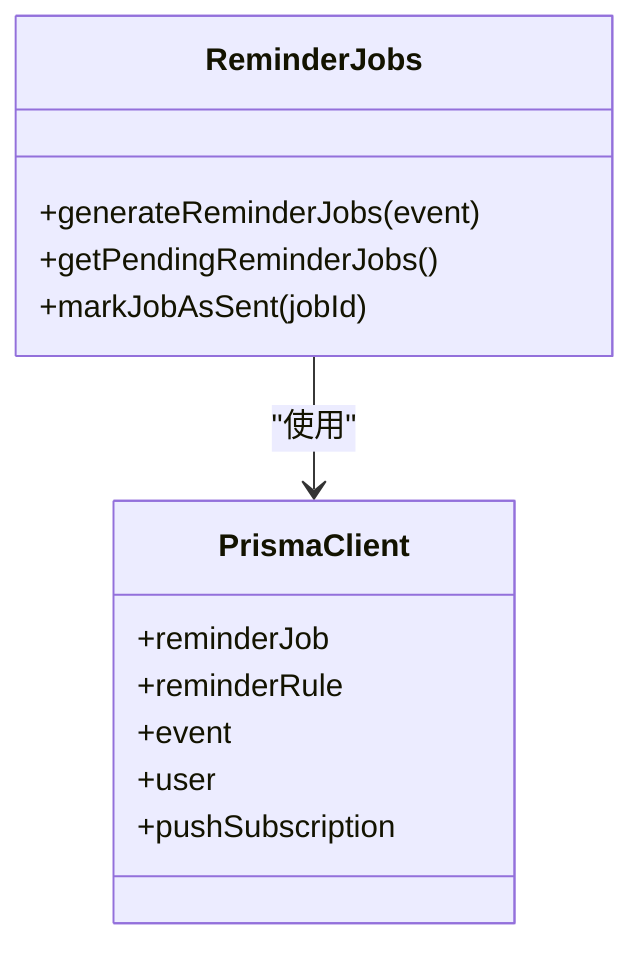
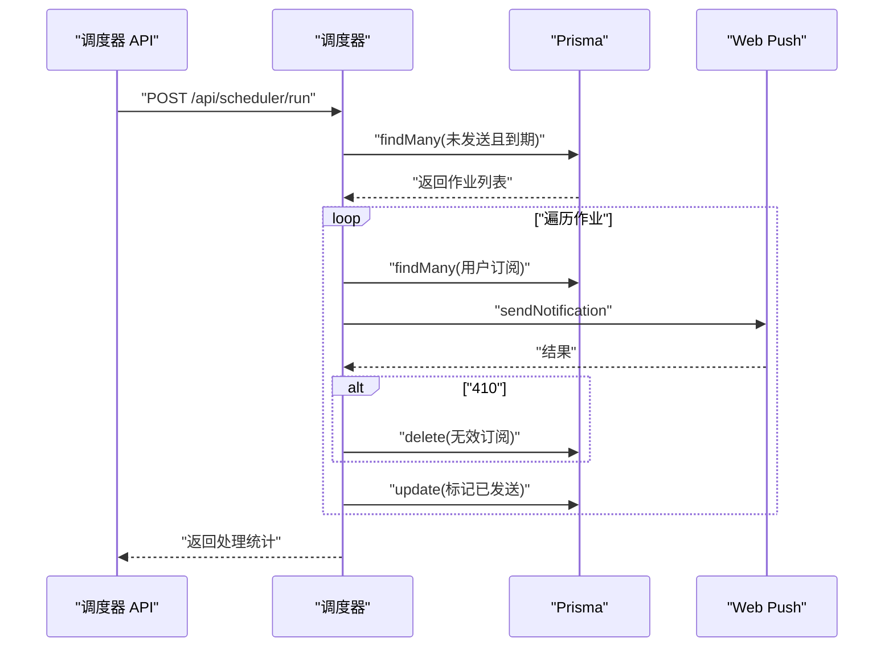
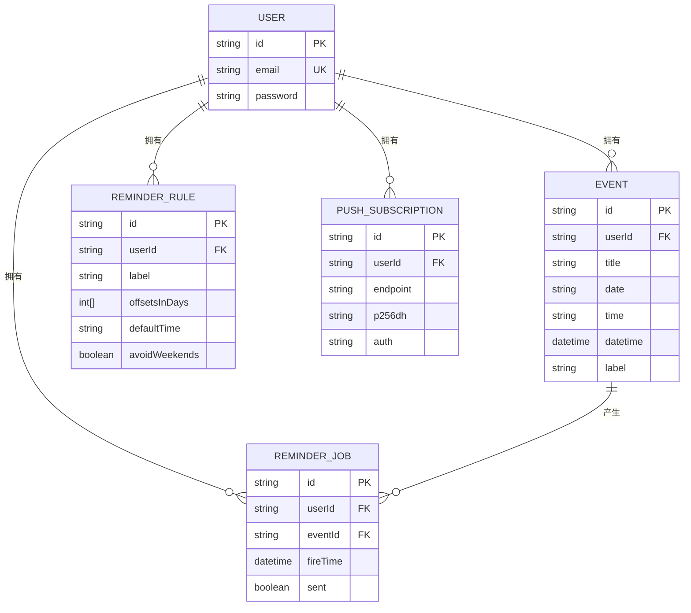

# 数据访问模式

<cite>
**本文引用的文件**
- [lib/reminder-jobs.ts](file://lib/reminder-jobs.ts)
- [app/api/events/bulk-create/route.ts](file://app/api/events/bulk-create/route.ts)
- [lib/prisma.ts](file://lib/prisma.ts)
- [prisma/schema.prisma](file://prisma/schema.prisma)
- [lib/scheduler.ts](file://lib/scheduler.ts)
- [app/api/scheduler/run/route.ts](file://app/api/scheduler/run/route.ts)
- [lib/web-push.ts](file://lib/web-push.ts)
- [.cursorrules](file://.cursorrules)
</cite>

## 目录
1. [简介](#简介)
2. [项目结构](#项目结构)
3. [核心组件](#核心组件)
4. [架构总览](#架构总览)
5. [详细组件分析](#详细组件分析)
6. [依赖关系分析](#依赖关系分析)
7. [性能考量](#性能考量)
8. [故障排查指南](#故障排查指南)
9. [结论](#结论)
10. [附录](#附录)

## 简介
本文件聚焦于应用中的典型数据访问模式，结合以下两个关键模块进行深入剖析：
- bulk-create 路由：展示如何在单次请求中对多个事件进行批量创建与更新，并通过 Prisma 的 createMany 实现批量插入，确保数据一致性。
- 提醒作业生成器：基于 Event 和 ReminderRule 生成 ReminderJob，演示如何通过 Prisma 查询组合（findMany + where + map）构建待执行提醒任务并持久化到数据库。

同时，文档讨论了复杂查询的性能考量（如使用 select 裁剪字段、索引设计对扫描效率的影响），并给出错误处理与重试策略建议。

## 项目结构
该项目采用 Next.js 应用结构，数据层通过 Prisma 连接 PostgreSQL。核心数据模型包括 User、Event、ReminderRule、ReminderJob、PushSubscription。提醒作业的生成与调度贯穿事件导入、规则匹配与定时推送三个阶段。

图表来源
- [app/api/events/bulk-create/route.ts](file://app/api/events/bulk-create/route.ts#L1-L133)
- [lib/reminder-jobs.ts](file://lib/reminder-jobs.ts#L1-L109)
- [lib/scheduler.ts](file://lib/scheduler.ts#L1-L86)
- [lib/prisma.ts](file://lib/prisma.ts#L1-L20)
- [prisma/schema.prisma](file://prisma/schema.prisma#L1-L86)
- [lib/web-push.ts](file://lib/web-push.ts#L1-L54)

章节来源
- [app/api/events/bulk-create/route.ts](file://app/api/events/bulk-create/route.ts#L1-L133)
- [lib/reminder-jobs.ts](file://lib/reminder-jobs.ts#L1-L109)
- [lib/scheduler.ts](file://lib/scheduler.ts#L1-L86)
- [lib/prisma.ts](file://lib/prisma.ts#L1-L20)
- [prisma/schema.prisma](file://prisma/schema.prisma#L1-L86)
- [lib/web-push.ts](file://lib/web-push.ts#L1-L54)

## 核心组件
- 事件批量创建路由：负责鉴权、输入校验、去重与批量创建/更新、逐条生成提醒作业。
- 提醒作业生成器：删除旧作业、查找规则、计算触发时间、批量插入新作业。
- 调度器：扫描未发送且已到期的提醒作业，向用户订阅发送 Web Push 通知，并标记作业为已发送。
- Prisma 客户端：统一的数据访问入口，使用 Postgres 适配器连接数据库。
- 数据模型：User、Event、ReminderRule、ReminderJob、PushSubscription，其中 ReminderJob 上的复合索引用于高效扫描。

章节来源
- [app/api/events/bulk-create/route.ts](file://app/api/events/bulk-create/route.ts#L1-L133)
- [lib/reminder-jobs.ts](file://lib/reminder-jobs.ts#L1-L109)
- [lib/scheduler.ts](file://lib/scheduler.ts#L1-L86)
- [lib/prisma.ts](file://lib/prisma.ts#L1-L20)
- [prisma/schema.prisma](file://prisma/schema.prisma#L1-L86)

## 架构总览
下图展示了从 CSV 导入到提醒作业生成与调度的整体流程，以及各模块之间的调用关系。

图表来源
- [app/api/events/bulk-create/route.ts](file://app/api/events/bulk-create/route.ts#L1-L133)
- [lib/reminder-jobs.ts](file://lib/reminder-jobs.ts#L1-L109)
- [lib/scheduler.ts](file://lib/scheduler.ts#L1-L86)
- [lib/web-push.ts](file://lib/web-push.ts#L1-L54)

## 详细组件分析

### 批量事件创建与提醒作业生成
- 输入校验与鉴权：使用 Zod Schema 校验请求体，从 Cookie 中提取 token 并验证其有效性。
- 去重与预取：根据标题集合预取现有事件，避免重复创建；同一导入批次内的后续同名事件会覆盖最新一条。
- 批量创建/更新：逐条创建或更新事件，计算日期时间字符串并转换为 ISO 时间戳，确保排序与查询稳定性。
- 逐条生成提醒作业：调用生成器函数，传入事件 ID、用户 ID、日期、时间、标签等信息。
- 生成器内部逻辑：
  - 删除该事件已存在的所有提醒作业，保证作业集的唯一性与一致性。
  - 查找用户自定义的提醒规则（按用户 ID + 标签），若无则使用默认规则（默认提前天数、默认时间、是否避开周末）。
  - 计算每个偏移天数对应的触发时间，必要时将周末调整到周五。
  - 使用 createMany 批量插入生成的作业，避免多次往返数据库。

图表来源
- [app/api/events/bulk-create/route.ts](file://app/api/events/bulk-create/route.ts#L1-L133)
- [lib/reminder-jobs.ts](file://lib/reminder-jobs.ts#L1-L109)

章节来源
- [app/api/events/bulk-create/route.ts](file://app/api/events/bulk-create/route.ts#L1-L133)
- [lib/reminder-jobs.ts](file://lib/reminder-jobs.ts#L1-L109)

### 提醒作业生成器：查询组合与持久化
- 查询组合：
  - deleteMany：按事件 ID 删除旧作业，确保每次生成都是最新的作业集。
  - findFirst：按用户 ID + 标签查找规则，若无则回退到默认规则。
  - findMany + include + select：在调度阶段查询未发送且已到期的作业，同时包含事件与用户信息，并仅选择必要的字段（如用户邮箱），减少网络传输与序列化开销。
- 持久化：
  - createMany：将计算好的作业批量插入数据库，提升写入吞吐。
  - update：在调度完成后将作业标记为已发送。

图表来源
- [lib/reminder-jobs.ts](file://lib/reminder-jobs.ts#L1-L109)
- [lib/prisma.ts](file://lib/prisma.ts#L1-L20)

章节来源
- [lib/reminder-jobs.ts](file://lib/reminder-jobs.ts#L1-L109)
- [lib/prisma.ts](file://lib/prisma.ts#L1-L20)

### 调度器：扫描与推送
- 扫描策略：按索引 [userId, sent, fireTime] 查询未发送且已到期的作业，有序返回，便于逐条处理。
- 推送流程：获取用户的所有订阅，逐个尝试发送；若收到 410（订阅失效），则删除该订阅并继续。
- 标记已发送：成功或失败后均将作业标记为已发送，避免重复处理。

图表来源
- [app/api/scheduler/run/route.ts](file://app/api/scheduler/run/route.ts#L1-L37)
- [lib/scheduler.ts](file://lib/scheduler.ts#L1-L86)
- [lib/web-push.ts](file://lib/web-push.ts#L1-L54)

章节来源
- [app/api/scheduler/run/route.ts](file://app/api/scheduler/run/route.ts#L1-L37)
- [lib/scheduler.ts](file://lib/scheduler.ts#L1-L86)
- [lib/web-push.ts](file://lib/web-push.ts#L1-L54)

## 依赖关系分析
- 数据模型依赖：ReminderJob 关联 Event 与 User，并在 onDelete 时级联删除；ReminderRule 与 User 一对一（联合唯一）。
- 索引依赖：ReminderJob 的复合索引 [userId, sent, fireTime] 是调度扫描的关键，确保高效筛选未发送且已到期的作业。
- 业务依赖：批量创建路由依赖提醒作业生成器；调度器依赖提醒作业生成器提供的查询与更新能力。

图表来源
- [prisma/schema.prisma](file://prisma/schema.prisma#L1-L86)

章节来源
- [prisma/schema.prisma](file://prisma/schema.prisma#L1-L86)

## 性能考量
- 查询裁剪：
  - 在查询用户信息时使用 select 仅返回必要字段（如 id、email），减少网络传输与序列化成本。
  - 在批量插入前先删除旧作业，避免冗余数据增长导致的扫描与写入压力。
- 索引优化：
  - ReminderJob 上的复合索引 [userId, sent, fireTime] 支持高效的调度扫描，避免全表扫描。
  - Event 上的复合索引 [userId, date] 有助于按用户与日期范围查询事件。
- 写入优化：
  - createMany 批量插入替代循环逐条插入，显著降低往返次数与事务开销。
- 错误与异常：
  - 对无效订阅（410）进行清理，防止后续重复尝试造成资源浪费。
  - 调度器对单个作业失败不中断整体流程，保证高可用性。

章节来源
- [lib/reminder-jobs.ts](file://lib/reminder-jobs.ts#L78-L97)
- [lib/scheduler.ts](file://lib/scheduler.ts#L20-L69)
- [prisma/schema.prisma](file://prisma/schema.prisma#L44-L74)

## 故障排查指南
- 批量创建失败：
  - 检查鉴权 token 是否有效，确认请求头与 Cookie 设置正确。
  - 核对输入格式（日期、时间、标签），确保符合 Zod 校验规则。
  - 观察每条事件的错误数组，定位具体失败项与错误信息。
- 提醒作业未生成：
  - 确认事件标签与用户规则匹配；若无匹配规则，系统将使用默认规则。
  - 检查 createMany 是否执行成功，确认 deleteMany 已清理旧作业。
- 调度未推送：
  - 确认作业未被标记为已发送；检查 fireTime 是否已到达。
  - 若出现 410 错误，确认订阅已被清理；检查 VAPID 凭据配置。
- 数据一致性：
  - 批量插入使用 createMany，确保在单次调用中完成写入；若需要跨多步事务，可在业务层封装事务（参见 .cursorrules 中的说明）。

章节来源
- [app/api/events/bulk-create/route.ts](file://app/api/events/bulk-create/route.ts#L20-L132)
- [lib/reminder-jobs.ts](file://lib/reminder-jobs.ts#L15-L72)
- [lib/scheduler.ts](file://lib/scheduler.ts#L17-L77)
- [.cursorrules](file://.cursorrules#L92-L119)

## 结论
本项目通过清晰的分层与合理的数据访问模式，实现了从 CSV 导入到提醒作业生成与调度的完整闭环。批量创建使用 createMany 确保写入效率与一致性；提醒作业生成器通过查询组合与批量插入保障数据完整性；调度器利用复合索引实现高效扫描与可靠推送。建议在需要跨多步事务的场景引入 Prisma 事务（参考 .cursorrules 的说明），并在生产环境中完善错误监控与重试策略。

## 附录
- 事务与批量写入说明：根据 .cursorrules 的指引，批量插入应在单个事务中完成，以确保原子性与一致性。当前批量创建路由通过逐条处理与批量插入相结合的方式，保证了整体流程的可靠性与可观测性。

章节来源
- [.cursorrules](file://.cursorrules#L92-L119)