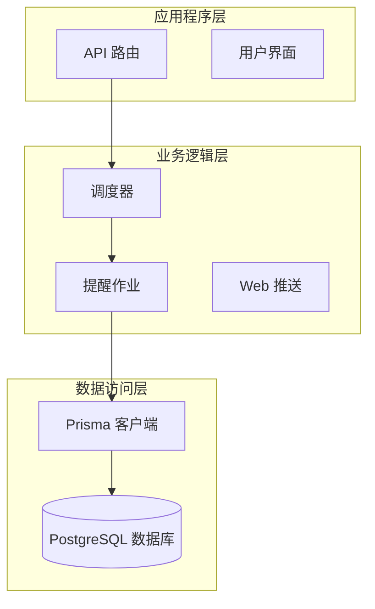
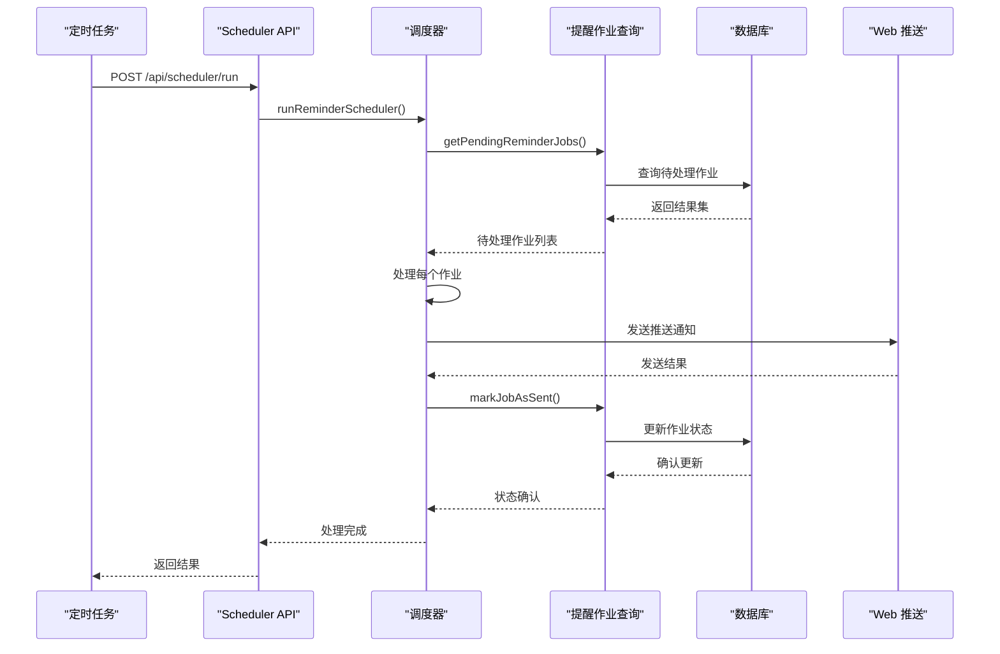
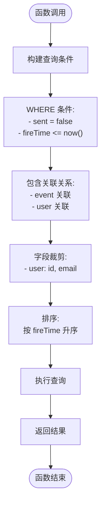
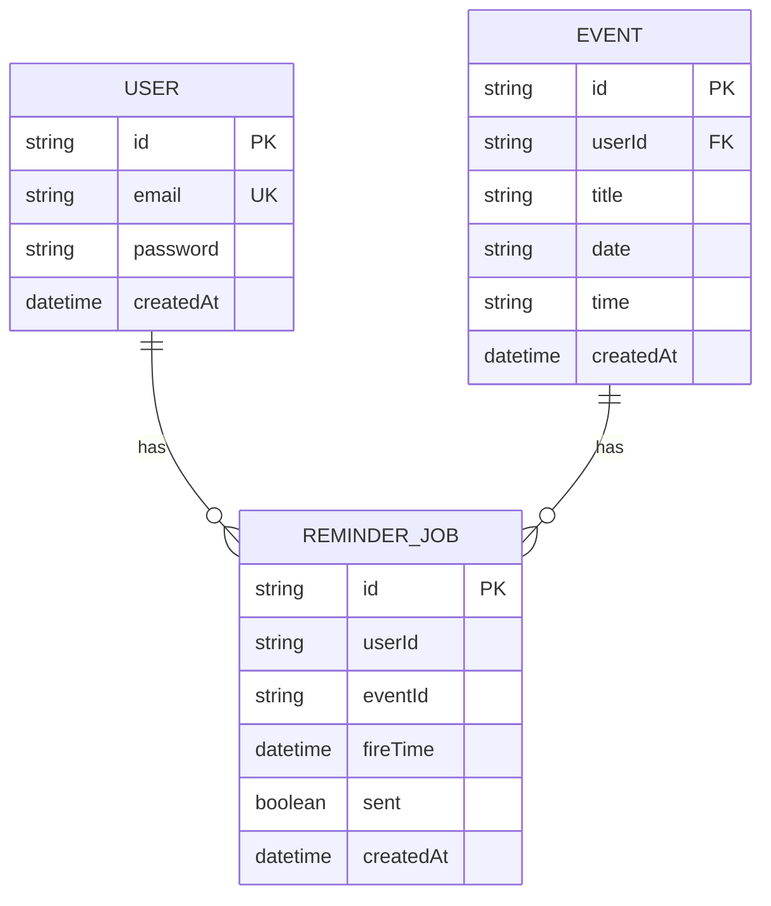
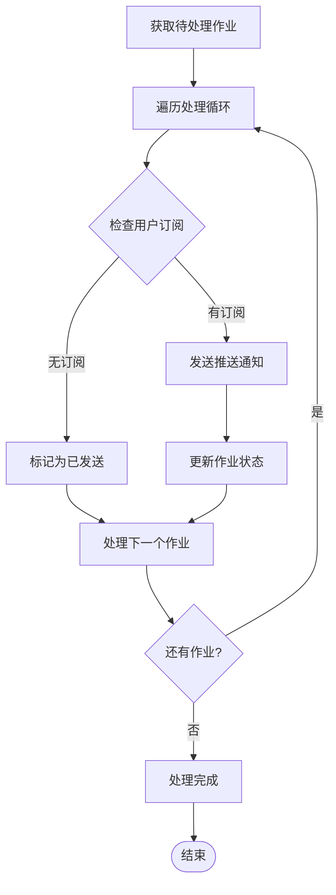
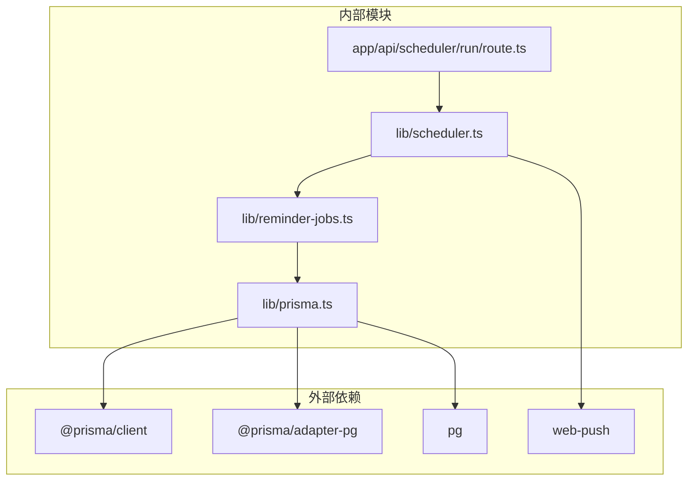

# 查询优化策略

<cite>
**本文档引用的文件**
- [lib/reminder-jobs.ts](file://lib/reminder-jobs.ts)
- [prisma/schema.prisma](file://prisma/schema.prisma)
- [lib/scheduler.ts](file://lib/scheduler.ts)
- [lib/prisma.ts](file://lib/prisma.ts)
- [app/api/scheduler/run/route.ts](file://app/api/scheduler/run/route.ts)
</cite>

## 目录
1. [简介](#简介)
2. [项目结构](#项目结构)
3. [核心组件](#核心组件)
4. [架构概览](#架构概览)
5. [详细组件分析](#详细组件分析)
6. [依赖关系分析](#依赖关系分析)
7. [性能考量](#性能考量)
8. [故障排除指南](#故障排除指南)
9. [结论](#结论)

## 简介

本文档深入分析了应用中的关键查询性能优化实践，重点关注 `lib/reminder-jobs.ts` 中 `getPendingReminderJobs` 函数的查询优化策略。该函数通过精确的 where 条件筛选未发送且触发时间已到的任务，并利用 orderBy 按 fireTime 升序排列以支持定时调度器的有序处理。同时，文档详细解释了在 Prisma 查询中使用 include 与 select 进行关系字段裁剪的重要性，以及 prisma/schema.prisma 中 `@@index([userId, sent, fireTime])` 复合索引如何加速高频查询场景下的数据检索效率。

## 项目结构

该项目采用 Next.js 应用程序架构，主要包含以下关键目录和文件：

**图表来源**
- [lib/reminder-jobs.ts](file://lib/reminder-jobs.ts#L1-L109)
- [lib/scheduler.ts](file://lib/scheduler.ts#L1-L86)
- [lib/prisma.ts](file://lib/prisma.ts#L1-L20)

**章节来源**
- [lib/reminder-jobs.ts](file://lib/reminder-jobs.ts#L1-L109)
- [lib/scheduler.ts](file://lib/scheduler.ts#L1-L86)
- [lib/prisma.ts](file://lib/prisma.ts#L1-L20)

## 核心组件

### 提醒作业管理器

`lib/reminder-jobs.ts` 文件包含了完整的提醒作业生命周期管理：

- **生成提醒作业**: 基于事件标签的提醒规则生成对应的提醒任务
- **获取待处理作业**: 精确筛选未发送且已到达触发时间的作业
- **标记作业状态**: 将已处理的作业标记为已发送状态

### 调度器系统

`lib/scheduler.ts` 实现了定时执行的调度逻辑，负责：
- 获取待处理的提醒作业
- 发送 Web 推送通知
- 管理无效的推送订阅

### 数据库连接管理

`lib/prisma.ts` 提供了高效的数据库连接池配置，使用 `@prisma/adapter-pg` 优化 PostgreSQL 连接。

**章节来源**
- [lib/reminder-jobs.ts](file://lib/reminder-jobs.ts#L15-L72)
- [lib/scheduler.ts](file://lib/scheduler.ts#L8-L85)
- [lib/prisma.ts](file://lib/prisma.ts#L1-L20)

## 架构概览

**图表来源**
- [app/api/scheduler/run/route.ts](file://app/api/scheduler/run/route.ts#L8-L26)
- [lib/scheduler.ts](file://lib/scheduler.ts#L8-L85)
- [lib/reminder-jobs.ts](file://lib/reminder-jobs.ts#L77-L98)

## 详细组件分析

### getPendingReminderJobs 函数优化分析

#### 查询条件优化

`getPendingReminderJobs` 函数使用了精确的查询条件来确保高效的数据检索：

**图表来源**
- [lib/reminder-jobs.ts](file://lib/reminder-jobs.ts#L77-L98)

#### 关系字段裁剪策略

该函数采用了两种重要的优化技术：

1. **include 关联加载**: 加载必要的关联关系以支持后续处理
2. **select 字段裁剪**: 仅选择必需的用户字段（id 和 email），避免不必要的数据传输

这种设计确保了：
- 减少网络传输量
- 降低内存使用
- 提高序列化性能

#### 排序优化

通过 `orderBy: { fireTime: 'asc' }` 实现：
- 支持调度器按时间顺序处理作业
- 避免额外的客户端排序开销
- 确保最早到期的作业优先处理

**章节来源**
- [lib/reminder-jobs.ts](file://lib/reminder-jobs.ts#L77-L98)

### 复合索引优化策略

#### schema.prisma 中的索引设计

在 `prisma/schema.prisma` 中定义了关键的复合索引：

**图表来源**
- [prisma/schema.prisma](file://prisma/schema.prisma#L62-L74)

#### 索引优化效果分析

复合索引 `@@index([userId, sent, fireTime])` 在高频查询场景下提供以下优势：

1. **精确匹配**: 支持基于用户 ID 的快速过滤
2. **范围查询**: 有效支持 fireTime 的范围查询
3. **避免全表扫描**: 通过索引直接定位符合条件的记录
4. **排序优化**: 索引顺序支持按 fireTime 升序的高效排序

**章节来源**
- [prisma/schema.prisma](file://prisma/schema.prisma#L73-L74)

### 调度器集成优化

#### 批量处理策略

调度器实现了高效的批量处理机制：

**图表来源**
- [lib/scheduler.ts](file://lib/scheduler.ts#L17-L77)

#### 错误处理和恢复机制

调度器包含完善的错误处理：
- 单个作业失败不影响整体处理
- 无效的推送订阅自动清理
- 详细的日志记录便于监控

**章节来源**
- [lib/scheduler.ts](file://lib/scheduler.ts#L17-L77)

## 依赖关系分析

**图表来源**
- [lib/reminder-jobs.ts](file://lib/reminder-jobs.ts#L1)
- [lib/scheduler.ts](file://lib/scheduler.ts#L1)
- [lib/prisma.ts](file://lib/prisma.ts#L1)
- [app/api/scheduler/run/route.ts](file://app/api/scheduler/run/route.ts#L1)

**章节来源**
- [lib/reminder-jobs.ts](file://lib/reminder-jobs.ts#L1)
- [lib/scheduler.ts](file://lib/scheduler.ts#L1)
- [lib/prisma.ts](file://lib/prisma.ts#L1)
- [app/api/scheduler/run/route.ts](file://app/api/scheduler/run/route.ts#L1)

## 性能考量

### 查询性能优化要点

1. **精确的查询条件**: 使用 `sent: false` 和 `fireTime.lte(new Date())` 确保只返回需要处理的作业
2. **关系字段裁剪**: 仅选择必要的用户字段，减少数据传输
3. **索引优化**: 复合索引支持高效的范围查询和排序
4. **批量处理**: 调度器一次性获取所有待处理作业，减少数据库往返

### 数据库连接优化

使用 `@prisma/adapter-pg` 提供的连接池优化：
- 复用数据库连接
- 减少连接建立开销
- 支持高并发场景

### 内存和网络优化

- **字段裁剪**: 避免不必要的字段传输
- **批量查询**: 减少 API 调用次数
- **及时清理**: 自动清理无效的推送订阅

## 故障排除指南

### 常见问题及解决方案

#### 查询性能问题

**症状**: `getPendingReminderJobs` 查询响应缓慢

**可能原因**:
- 缺少适当的索引
- 查询条件不够精确
- 关联查询导致的数据膨胀

**解决方案**:
- 确认复合索引 `@@index([userId, sent, fireTime])` 存在
- 验证查询条件的精确性
- 检查是否需要进一步的字段裁剪

#### 调度器异常

**症状**: 调度器无法正常处理作业

**排查步骤**:
1. 检查数据库连接配置
2. 验证 Prisma 客户端初始化
3. 查看详细的错误日志

**章节来源**
- [lib/reminder-jobs.ts](file://lib/reminder-jobs.ts#L77-L98)
- [lib/scheduler.ts](file://lib/scheduler.ts#L8-L85)
- [lib/prisma.ts](file://lib/prisma.ts#L13-L15)

## 结论

该应用在提醒作业调度系统中实现了多项关键的查询性能优化策略：

1. **精确查询条件**: 通过 `sent: false` 和时间范围限制确保查询的针对性
2. **关系字段裁剪**: 使用 `select` 仅获取必要字段，显著减少数据传输量
3. **复合索引优化**: `@@index([userId, sent, fireTime])` 支持高效的范围查询和排序
4. **有序处理**: `orderBy` 确保调度器按时间顺序处理作业
5. **批量处理**: 调度器一次性获取所有待处理作业，提高整体效率

这些优化措施共同确保了调度系统的低延迟响应和高吞吐量处理能力，为用户提供可靠的提醒服务体验。通过合理的数据库设计和查询优化，系统能够在高并发场景下保持稳定的性能表现。