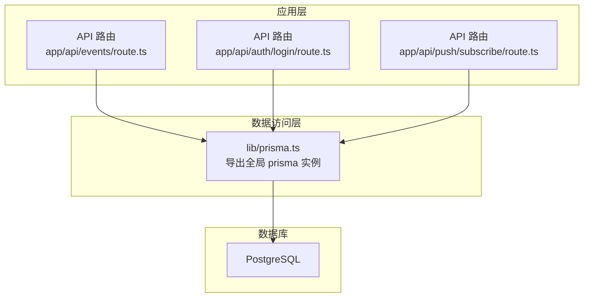
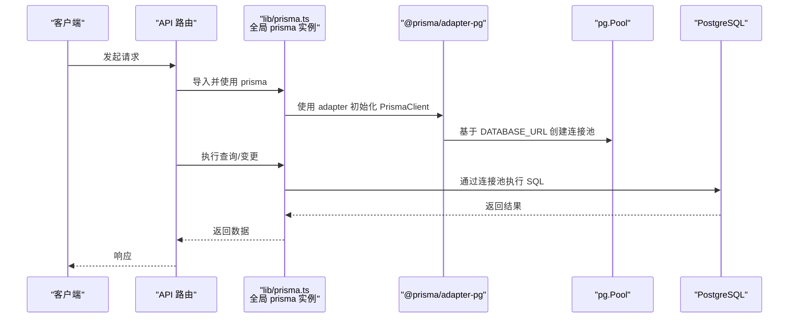
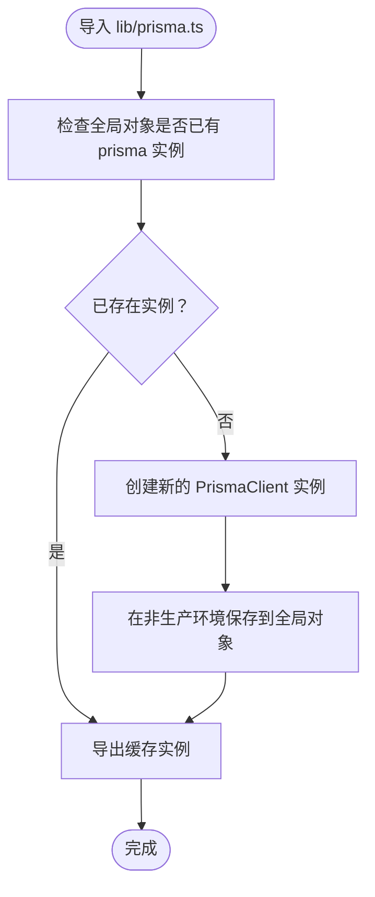
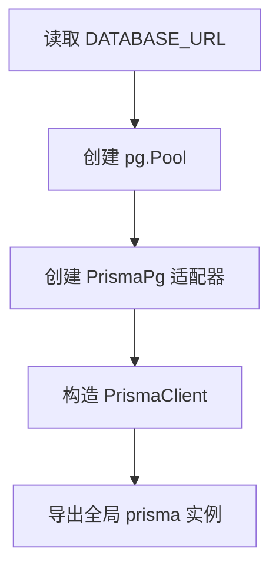
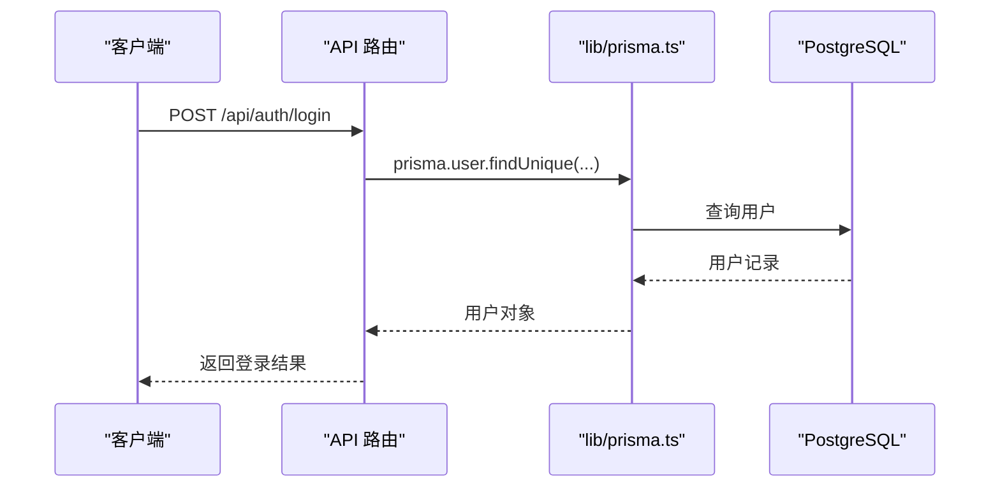
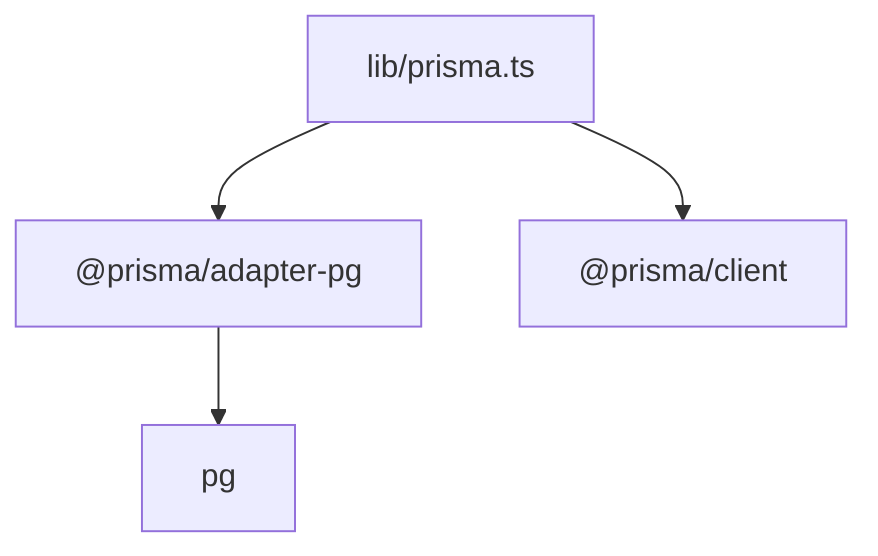

# 连接管理

<cite>
**本文引用的文件**
- [lib/prisma.ts](file://lib/prisma.ts)
- [prisma/schema.prisma](file://prisma/schema.prisma)
- [prisma.config.ts](file://prisma.config.ts)
- [app/api/events/route.ts](file://app/api/events/route.ts)
- [app/api/auth/login/route.ts](file://app/api/auth/login/route.ts)
- [app/api/push/subscribe/route.ts](file://app/api/push/subscribe/route.ts)
- [docs/SCHEDULER_SETUP.md](file://docs/SCHEDULER_SETUP.md)
- [package.json](file://package.json)
</cite>

## 目录
1. [简介](#简介)
2. [项目结构](#项目结构)
3. [核心组件](#核心组件)
4. [架构总览](#架构总览)
5. [详细组件分析](#详细组件分析)
6. [依赖关系分析](#依赖关系分析)
7. [性能考量](#性能考量)
8. [故障排查指南](#故障排查指南)
9. [结论](#结论)

## 简介
本文件聚焦于 lib/prisma.ts 中的数据库连接管理机制，系统性阐述其如何通过单例模式导出全局 prisma 实例，防止在 Next.js API 路由热重载时重复创建连接导致资源泄漏；解释 PrismaClient 实例的初始化流程及与 PostgreSQL 数据库的连接配置来源（环境变量 DATABASE_URL）；覆盖连接生命周期管理（开发环境下的全局注入防护与生产环境的连接池配置建议）；并提供最佳实践指导，包括在 API 路由中正确使用 try-finally 或 onExit 钩子确保 prisma.$disconnect() 的调用，避免 Vercel 等 Serverless 平台上的连接超限问题。

## 项目结构
该项目采用 Next.js App Router 架构，数据库层通过 Prisma 客户端与 PostgreSQL 交互。连接管理的核心位于 lib/prisma.ts，API 路由通过相对路径导入该模块以获得全局唯一的 PrismaClient 实例。

图表来源
- [lib/prisma.ts](file://lib/prisma.ts#L1-L20)
- [app/api/events/route.ts](file://app/api/events/route.ts#L1-L200)
- [app/api/auth/login/route.ts](file://app/api/auth/login/route.ts#L1-L57)
- [app/api/push/subscribe/route.ts](file://app/api/push/subscribe/route.ts#L1-L95)

章节来源
- [lib/prisma.ts](file://lib/prisma.ts#L1-L20)
- [app/api/events/route.ts](file://app/api/events/route.ts#L1-L200)
- [app/api/auth/login/route.ts](file://app/api/auth/login/route.ts#L1-L57)
- [app/api/push/subscribe/route.ts](file://app/api/push/subscribe/route.ts#L1-L95)

## 核心组件
- 全局 prisma 实例（单例模式）
  - 通过全局对象注入（开发环境）避免热重载时重复创建
  - 在非生产环境将实例挂载到全局对象，生产环境直接导出
- 连接适配器与连接池
  - 使用 @prisma/adapter-pg 与 pg.Pool 将连接复用到 PostgreSQL
  - 连接字符串来自环境变量 DATABASE_URL
- PrismaClient 初始化
  - 传入 adapter 构造 PrismaClient，统一数据库访问入口

章节来源
- [lib/prisma.ts](file://lib/prisma.ts#L1-L20)

## 架构总览
下图展示了从 API 路由到数据库的调用链路，以及连接管理的关键节点（单例导出、全局注入防护、连接池复用）。

图表来源
- [lib/prisma.ts](file://lib/prisma.ts#L1-L20)
- [prisma/schema.prisma](file://prisma/schema.prisma#L1-L14)
- [prisma.config.ts](file://prisma.config.ts#L1-L14)

## 详细组件分析

### 单例模式与全局注入防护
- 设计要点
  - 使用全局对象保存 prisma 实例，避免在开发热重载期间重复创建
  - 仅在非生产环境进行全局注入，生产环境直接导出实例
- 关键行为
  - 首次导入时若未在全局对象找到实例，则创建并缓存
  - 非生产环境将实例写回全局对象，后续导入直接返回缓存实例
- 作用
  - 防止重复创建连接，降低资源泄漏风险
  - 在开发环境下保持稳定的连接状态，提升热重载体验

图表来源
- [lib/prisma.ts](file://lib/prisma.ts#L5-L19)

章节来源
- [lib/prisma.ts](file://lib/prisma.ts#L5-L19)

### PrismaClient 初始化与连接配置
- 初始化流程
  - 读取环境变量 DATABASE_URL
  - 基于 DATABASE_URL 创建 pg.Pool
  - 使用 @prisma/adapter-pg 将 Pool 包装为适配器
  - 以适配器构造 PrismaClient
- 配置来源
  - DATABASE_URL 来自环境变量（开发时通常来自 .env）
  - Prisma 配置文件 prisma.config.ts 通过 env("DATABASE_URL") 读取并传递给 Prisma 引擎
- 数据源声明
  - schema.prisma 中声明 provider 为 postgresql，并包含多个模型定义

图表来源
- [lib/prisma.ts](file://lib/prisma.ts#L9-L15)
- [prisma.config.ts](file://prisma.config.ts#L10-L13)
- [prisma/schema.prisma](file://prisma/schema.prisma#L7-L9)

章节来源
- [lib/prisma.ts](file://lib/prisma.ts#L9-L15)
- [prisma.config.ts](file://prisma.config.ts#L10-L13)
- [prisma/schema.prisma](file://prisma/schema.prisma#L7-L9)

### API 路由中的使用示例
- 事件路由
  - 在 GET/POST 请求中通过 prisma 访问 Event/ReminderRule 等模型
  - 展示了在 API 路由中直接使用全局 prisma 实例的标准模式
- 登录路由
  - 使用 prisma 查询用户并配合认证逻辑
- 推送订阅路由
  - 使用 prisma 管理 PushSubscription 模型

图表来源
- [app/api/auth/login/route.ts](file://app/api/auth/login/route.ts#L22-L36)

章节来源
- [app/api/events/route.ts](file://app/api/events/route.ts#L35-L194)
- [app/api/auth/login/route.ts](file://app/api/auth/login/route.ts#L11-L56)
- [app/api/push/subscribe/route.ts](file://app/api/push/subscribe/route.ts#L36-L55)

### 连接生命周期管理与最佳实践
- 开发环境下的全局注入防护
  - 通过将实例保存到全局对象，避免热重载时重复创建连接
- 生产环境的连接池配置建议
  - 使用 @prisma/adapter-pg 与 pg.Pool 可实现连接池复用
  - 建议在生产环境中合理设置连接池大小与超时参数（具体参数需结合部署平台与数据库规格）
- Serverless 平台（如 Vercel）注意事项
  - Serverless 函数冷启动后首次使用连接池，可能需要短暂延迟
  - 若函数执行时间较长，建议在请求结束时显式断开连接，避免连接泄漏
  - 可参考调度器配置文档了解定时任务触发方式，减少长时间占用连接

章节来源
- [lib/prisma.ts](file://lib/prisma.ts#L17-L19)
- [docs/SCHEDULER_SETUP.md](file://docs/SCHEDULER_SETUP.md#L1-L16)

## 依赖关系分析
- 外部依赖
  - @prisma/adapter-pg：将 pg.Pool 适配为 PrismaClient 的驱动
  - @prisma/client：Prisma 客户端包
  - pg：PostgreSQL 驱动，提供连接池能力
- 内部依赖
  - lib/prisma.ts 作为全局连接入口，被各 API 路由导入使用

图表来源
- [lib/prisma.ts](file://lib/prisma.ts#L1-L3)
- [package.json](file://package.json#L13-L29)

章节来源
- [lib/prisma.ts](file://lib/prisma.ts#L1-L3)
- [package.json](file://package.json#L13-L29)

## 性能考量
- 连接池复用
  - 使用 pg.Pool 可显著降低连接建立开销，提高并发性能
- 热重载与内存占用
  - 开发环境通过全局注入避免重复创建实例，减少内存占用
- Serverless 平台优化
  - 合理设置连接池大小与超时，避免在冷启动时过度占用资源
  - 对长耗时操作，考虑在请求结束时断开连接，释放资源

## 故障排查指南
- 症状：连接泄漏或连接数过多
  - 排查点：确认 API 路由中是否存在未断开连接的情况
  - 解决方案：在请求结束时调用 prisma.$disconnect()，或在进程退出时统一断开
- 症状：开发热重载后出现重复连接
  - 排查点：确认 lib/prisma.ts 是否在非生产环境进行了全局注入
  - 解决方案：保持现有单例模式不变，确保实例缓存在全局对象中
- 症状：Vercel 等平台连接超限
  - 排查点：检查连接池配置与请求生命周期
  - 解决方案：在请求结束时断开连接，或调整连接池参数

章节来源
- [lib/prisma.ts](file://lib/prisma.ts#L17-L19)

## 结论
lib/prisma.ts 通过单例模式与全局注入防护，有效避免了在 Next.js 开发热重载期间重复创建数据库连接，降低了资源泄漏风险。结合 @prisma/adapter-pg 与 pg.Pool 的连接池复用机制，能够在生产环境中稳定地提供数据库访问能力。针对 Serverless 平台（如 Vercel），建议在 API 路由中显式断开连接，以避免连接超限问题。整体而言，该连接管理策略简洁可靠，适合在 Next.js 应用中广泛采用。